# 普联软件股份有限公司

# Pansoft Company Limited

(山东省济南市高新区舜泰北路789号B座20层)

# Pansoft

普联软件一

# 向不特定对象发行可转换公司债券 募集说明书

保荐人（主承销商）

中泰证券股份有限公司

ZHONGTAI SECURITIES CO.,LTD.

(山东省济南市市中区经七路86号)

二〇二五年十二月

# 声明

中国证券监督管理委员会、深圳证券交易所对本次发行所作的任何决定或意见，均不表明其对申请文件及所披露信息的真实性、准确性、完整性作出保证，也不表明其对发行人的盈利能力、投资价值或者对投资者的收益作出实质性判断或保证。任何与之相反的声明均属虚假不实陈述。

根据《证券法》的规定，证券依法发行后，发行人经营与收益的变化，由发行人自行负责。投资者自主判断发行人的投资价值，自主作出投资决策，自行承担证券依法发行后因发行人经营与收益变化或者证券价格变动引致的投资风险。

# 重大事项提示

投资者在评价公司本次发行的可转换公司债券时，应特别关注下列重大事项并仔细阅读本募集说明书中有关风险因素的章节。

# 一、特别风险提示

本公司提请投资者仔细阅读本募集说明书“风险因素”全文，并特别注意以下风险：

# （一）主营业务毛利率持续下降及经营业绩下滑风险

2022 年度、2023 年度、2024 年度及 2025 年 1-6 月，公司主营业务毛利率分别为 47.71%、38.46%、33.25% 和 35.05%。受市场竞争情况、项目复杂程度、新客户及新领域业务布局策略以及人力成本等因素综合影响，导致公司最近三年主营业务毛利率呈现下降趋势。2025 年 1-6 月公司扣除非经常性损益后的归属母公司所有者的净利润为 -445.29 万元，较 2024 年同期减少 1,235.52 万元，经营业绩有所下滑，主要受研发费用增加所致。由于 2025 年 1-6 月公司研发投入增加以及研发项目资本化支出较小，导致研发费用较 2024 年同期增加 1,905.14 万元。

2025 年 1-9 月公司扣除非经常性损益后的归属母公司所有者的净利润为 -680.30 万元，较 2024 年同期减少 1,432.72 万元，经营业绩有所下滑，主要受业务季节性特征和研发费用增加所致。受业务季节性特征影响，公司前三季度营业收入占全年比重不足 40%，营业收入主要集中在第四季度确认，导致前三季度业绩较低且存在一定波动。由于 2025 年 1-9 月公司研发投入增加以及研发项目资本化支出较小，导致研发费用较 2024 年同期增加 1,953.02 万元。

定制软件收入是公司的主要收入来源。定制软件项目金额较高、实施周期较长，具有一定不确定性，大项目的收入确认对当期营业收入影响较大；受项目开展进度、客户验收时间等因素影响，项目的收入确认时点具有不确定性。若这类合同集中完工，会造成收入、利润在不同报告期之间出现一定波动。如未来市场竞争持续加剧、客户信息化需求差异性提升、项目复杂程度及实施难度提升、新客户及新领域业务拓展不及预期、人力成本无法得到有效控制，公司无法保持竞争优势，存在毛利率持续下降的风险；如2025年后续季度公司营业收入未能如

期实现，对公司盈利能力产生不利影响，公司将面临经营业绩下滑的风险。

# （二）主要客户集中风险

2022 年度、2023 年度、2024 年度及 2025 年 1-6 月，公司来自前五名客户（合并口径）的销售收入金额分别为 48,757.64 万元、41,505.16 万元、48,325.76 万元和 11,219.79 万元，占营业收入的比例分别为 70.15%、55.40%、57.80% 和 53.39%，主要客户收入占比较高。如果主要客户未来采购策略发生变化，或公司产品和服务质量不能持续满足客户要求，导致公司与主要客户的合作关系发生变化，公司可能无法持续获得客户订单以及项目收入，将对公司的生产经营带来不利影响。

# （三）部分项目未签约风险

公司主营业务是为大型集团企业提供管理信息化方案及 IT 综合服务，下游客户包括石油石化、建筑地产、煤炭电力及金融等行业的大型企业。由于该类客户内部审批环节较多，流程较复杂，致使合同签订时间延迟。该类客户普遍具备经营规模大、业务抗风险能力强、业务连续性和稳定性好等特点，因此大多数项目的确定性都比较高，一旦方案确定，客户即希望项目组尽快投入工作，不能因为合同签订时间因素影响项目周期。其中，2023 年因公司未能取得“建造一体化及供应链项目”客户订单，导致前期项目投入成本 3,116.94 万元结转销售费用，在一定程度上影响了当年的盈利能力。

截至 2025 年 6 月 30 日, 2024 年末项目实施成本中尚未签约金额为 3,723.40 万元。如果最终公司未与客户签订合同，无法获取相关收入，前期投入的项目实施成本将会结转销售费用，会对公司盈利能力造成不利影响。

# （四）应收账款坏账风险

2022 年末、2023 年末、2024 年末和 2025 年 6 月末，公司应收账款账面余额分别为 40,710.38 万元、51,243.74 万元、58,706.74 万元和 54,411.40 万元。最近三年，公司 1 年以内应收账款占比呈波动下滑趋势，分别为 88.23%、79.21%、76.86%，主要原因为自 2023 年开始，受部分最终用户回款、预算资金拨付程序等因素影响，公司部分央国企客户付款周期相较以往年度存在延长趋势，导致公司账龄为 1 至 2 年及 2 至 3 年的应收账款占比有所提高。2022 年末、2023 年末、2024 年末和 2025 年 6 月末，公司应收账款坏账整体计提比例分别为 7.38%、

9.00%、8.46%和7.62%。公司自2019年1月开始采用预期信用损失模型，对于划分为组合的应收账款，公司采用基于平均迁徙率的减值矩阵进行信用减值测试，为了历史数据更具有代表性剔除异常期间的相关数值，报告期公司主要对1年以内央企及金融类客户组合的异常数据进行了剔除。如不剔除前述相关异常数据，2022至2024年末公司针对央企及金融类客户的账龄为1年以内的应收账款应计提的坏账准备将增加0.00万元、46.49万元和323.44万元。

若公司的主要债务人未来受宏观经济、经营模式及内部管理等因素影响出现财务状况恶化，导致公司应收账款不能回收或因无法回收而产生坏账，将对公司的业绩和生产经营产生一定不利影响。

# （五）募投项目实施效果未达预期的风险

本次募投项目中 “国产 ERP 功能扩展建设项目” “数智化金融风险管控系列产品建设项目” 涉及效益预测。其中，“国产 ERP 功能扩展建设项目” 系对现有 ERP 产品的新增，预计达产期新增年收入为 1.71 亿元，“数智化金融风险管控系列产品建设项目” 系对现有 XBRL 应用产品的迭代，预计达产期年收入为 0.63 亿元。

考虑到新建项目产生效益需要一定的过程和时间，在此过程中，公司面临着下游行业市场需求变动、市场容量发生变化、行业竞争是否加剧、市场开拓是否顺利、研发产品功能是否达到预期等诸多不确定因素，若上述因素发生不利变化，可能导致公司相关产品的销量及销售价格不及预期，并出现销售收入、毛利率及税后内部收益率低于测算值的情况。上述相关因素均可能导致募集资金投资项目实施效果低于预期。

# （六）募集资金投资项目研发风险

本次募投项目中，“国产 ERP 功能扩展建设项目”在公司现有 ERP 产品的基础上，围绕 Oracle EBS 替代、金融行业财务核心和供应链管理的三个细分领域进行适配性研发升级；“数智化金融风险管控系列产品建设项目”在公司现有 XBRL 应用产品的基础上，围绕最新监管政策要求和 AI 智能化改造进行研发升级；“云湖平台研发升级项目”对公司技术底座“云湖平台”进行信创化、智能化研发升级。

公司募投项目所在的软件和信息技术服务行业属于技术和人才密集型行业，行业技术更新迭代较快，研发项目实施所需研发人员数量较多、专业性较强，一旦底层技术发生改变或新技术出现突破，而公司又没有相应的技术、专利和人才储备，本次募投项目将面临不能及时跟进行业技术进步和下游客户需求导致项目实施进展受阻、研发失败的风险，并对公司核心竞争力带来潜在风险。

# （七）经营活动现金流波动风险

2022 年度、2023 年度、2024 年度及 2025 年 1-6 月，公司经营活动现金流量净额分别为 4,895.25 万元、-5,914.45 万元、11,571.97 万元和 -12,861.51 万元，公司实现净利润分别为 15,027.90 万元、5,626.34 万元、12,362.43 万元和 -534.85 万元，经营活动现金流量净额与净利润存在一定差异，主要受客户回款节奏以及结算方式变动、业务活动季节性等因素影响所致。如果公司客户回款情况发生不利变化、业务活动未如期推进，公司将面临经营活动现金流波动风险，对公司的生产经营带来不利影响。

# （八）未决诉讼风险

截至本募集说明书签署日，公司存在一起未决诉讼，涉及金额489.64万元。由于法院尚未开庭进行实体审理，诉讼结果具有不确定性。若法院最终支持原告请求，则公司需承担相关赔偿义务，从而对公司的经营业绩及财务状况产生不利影响。

# 二、关于本次发行的可转债的信用评级

针对本次可转债，公司聘请了中证鹏元资信评估股份有限公司进行资信评级。根据中证鹏元出具的报告，公司主体信用级别为 A+，本次可转债信用级别为 A+。在本次可转债的存续期限内，中证鹏元将每年进行一次定期跟踪评级。

# 三、本次发行的可转换公司债券的担保事项

公司本次发行的可转换公司债券未提供担保措施, 如果存续期间出现对经营管理和偿债能力有重大负面影响的事件, 可转债可能因未提供担保而增加风险。

# 四、关于公司的股利分配政策和现金分红情况

# （一）公司现行利润分配政策

公司现行有效的《公司章程》对公司的利润分配政策作出的规定如下：

“第一百六十条 公司利润分配政策如下:

# （一）利润分配原则

1. 公司的利润分配应重视对投资者的合理回报，并兼顾公司的可持续发展，保持利润分配政策的连续性和稳定性。  
2. 公司的利润分配不得超过累计可分配利润的范围，不得损害公司持续经营能力。公司董事会和股东会对利润分配政策的决策和论证过程中应当充分考虑公众投资者的意见。

# （二）利润分配方式

公司可以采用现金、股票或现金与股票相结合或者法律、法规允许的其他方式分配股利，并积极推行以现金方式分配股利。在公司的现金能够满足公司正常经营和发展需要的前提下，相对于股票股利，公司优先采取现金分红。

# （三）现金分红条件

1. 公司该年度的可分配利润（即公司弥补亏损、提取公积金后所余的税后利润）为正值，且现金流充裕，实施现金分红不会影响公司后续持续经营。  
2. 审计机构对公司的该年度财务报告出具标准无保留意见的审计报告。  
3. 公司未来 12 个月内无重大投资计划或重大现金支出等事项发生（募集资金项目除外）。重大投资计划或重大现金支出是指：公司未来 12 个月内购买资产、对外投资、进行固定资产投资等交易累计支出达到或超过公司最近一期经审计净资产 30%，且超过 5,000 万元。  
4. 公司现金流满足公司正常经营和长期发展的需要。

# （四）现金分红比例

如无重大投资计划或重大现金支出发生, 公司每年以现金方式分配的利润应不低于当年实现的可分配利润的 10%。如果公司净利润保持持续稳定增长, 公司

可提高现金分红比例或者实施股票股利分配，加大对投资者的回报力度。确因特殊原因不能达到上述比例的，董事会应当向股东会作特别说明。

董事会应当综合考虑所处行业特点、发展阶段、自身经营模式、盈利水平、债务偿还能力、是否有重大资金支出安排和投资者回报等因素，区分下列情形，并按照相关规定的程序，提出差异化的现金分红政策：

1. 公司发展阶段属成熟期且无重大资金支出安排的，进行利润分配时，现金分红在本次利润分配中所占比例最低应达到 80%;  
2. 公司发展阶段属成熟期且有重大资金支出安排的，进行利润分配时，现金分红在本次利润分配中所占比例最低应达到 40%;  
3. 公司发展阶段属成长期且有重大资金支出安排的，进行利润分配时，现金分红在本次利润分配中所占比例最低应达到 20%;

公司发展阶段不易区分但有重大资金支出安排的，可以按照前项规定处理。

现金分红在本次利润分配中所占比例为现金股利除以现金股利与股票股利之和。

# （五）发放股票股利的条件

公司可以根据累计可供分配利润、公积金及现金流状况，在保证足额现金分红及公司股本规模合理的前提下，必要时公司可以采用发放股票股利方式进行利润分配，董事会可提出股票股利分配预案。

# （六）利润分配时间间隔

在满足上述第（三）项的条件下，公司原则上每年度至少现金分红一次。在有条件的情况下，公司董事会可以根据公司的资金需求状况提议公司进行中期利润分配。

公司现金股利政策目标为稳定增长股利。

当公司最近一年审计报告为非无保留意见或带有与持续经营相关的重大不确定性段落的无保留意见或出现法律、法规、中国证监会规定、深圳证券交易所业务规则等规定的其他情形时，可以不进行利润分配。”

# （二）最近三年利润分配情况

# 1、公司 2022 年度利润分配情况

2023 年 5 月 5 日，公司召开 2022 年年度股东大会，审议通过了《关于 2022 年度利润分配及资本公积金转增股本预案的议案》，以总股本 143,774,714 股为基数，向公司全体股东每 10 股派发现金红利 3 元（含税），共计派发现金红利 43,132,414.2 元（含税），不送红股，同时以资本公积金向公司全体股东每 10 股转增 4 股，合计转增股本 57,509,886 股。公司剩余未分配利润结转以后年度。

# 2、公司 2023 年度利润分配情况

2024 年 5 月 10 日，公司召开 2023 年年度股东大会，审议通过了《关于 2023 年度利润分配预案的议案》，以总股本 202,525,749 股为基数，向权益分派股权登记日登记在册的全体股东每 10 股派发现金红利 1.00 元（含税），共计派发现金红利 20,252,574.90 元（含税），不送红股，不以资本公积金转增股本。公司剩余未分配利润用于公司经营发展及后续分配。

# 3、公司 2024 年度利润分配情况

2025 年 4 月 21 日，公司召开 2024 年年度股东大会，审议通过了《关于 2024 年度利润分配及资本公积金转增股本预案的议案》，以 2024 年 12 月 31 日总股本 202,525,749 股剔除公司回购专用证券账户持有的 1,900,000 股后的 200,625,749 股为基数，向权益分派股权登记日登记在册的全体股东每 10 股派发现金红利 1.50 元（含税），合计派发现金红利 30,093,862.35 元（含税），不送红股，同时以资本公积金向公司全体股东每 10 股转增 4 股，合计转增股本 80,250,299 股。公司剩余未分配利润用于公司经营发展及后续分配。

公司最近三年现金分红具体情况如下:

单位：万元

<table><tr><td>项目</td><td>2024年度</td><td>2023年度</td><td>2022年度</td></tr><tr><td>现金分红金额(含税)1</td><td>3,009.39</td><td>2,025.26</td><td>4,313.24</td></tr><tr><td>以现金方式回购股份计入现金分红的金额2</td><td>-</td><td>-</td><td>-</td></tr><tr><td>当年现金分红总金额3=1+2</td><td>3,009.39</td><td>2,025.26</td><td>4,313.24</td></tr><tr><td>归属于上市公司股东的净利润4</td><td>12,125.00</td><td>6,216.02</td><td>15,514.82</td></tr><tr><td>当年现金分红占合并报表中归属于母公司股东净利润</td><td>24.82%</td><td>32.58%</td><td>27.80%</td></tr><tr><td>的比例5=3/4</td><td></td><td></td><td></td></tr><tr><td>最近三年累计现金分配合计</td><td colspan="3">9,347.89</td></tr><tr><td>最近三年归属于母公司股东年均可分配利润</td><td colspan="3">11,285.28</td></tr><tr><td>最近三年累计现金分配利润占年均可分配利润的比例</td><td colspan="3">82.83%</td></tr></table>

# 目录

# 声明....1

# 重大事项提示....2

一、特别风险提示....2  
二、关于本次发行的可转债的信用评级....5  
三、本次发行的可转换公司债券的担保事项....5  
四、关于公司的股利分配政策和现金分红情况....6

# 目录....10

# 第一节 释义....13

一、基本术语....13  
二、专业术语....15

# 第二节 本次发行概况 ……17

一、基本信息....17  
二、本次发行的背景和目的....18  
三、本次发行概况....21  
四、本次可转债发行的基本条款....25  
五、本次发行的有关当事人....35  
六、发行人与本次发行有关的中介机构的关系....37

# 第三节 风险因素 ……38

一、与发行人相关的风险....38  
二、与行业相关的风险....44  
三、其他风险....44

# 第四节 发行人基本情况....47

一、发行人股本结构及股东持股情况....47  
二、公司组织机构图及重要权益投资情况....47  
三、控股股东及实际控制人的基本情况....52  
四、承诺事项及履行情况....54  
五、发行人董事、高级管理人员和其他核心人员情况....56  
六、发行人所处行业基本情况....70

七、发行人主营业务的具体情况....87  
八、发行人研发情况....100  
九、发行人主要固定资产和无形资产....104  
十、发行人拥有的特许经营权....116  
十一、发行人的重大资产重组情况....116  
十二、境外经营情况....116  
十三、报告期内公司分红情况....117  
十四、公司最近三年债券发行情况....117  
十五、最近三年平均可分配利润是否足以支付公司债券一年的利息情况117

# 第五节 财务会计信息与管理层分析 …… 118

一、报告期内财务报表审计情况....118  
二、最近三年一期财务报表....119  
三、合并财务报表的编制基础、合并范围及变化情况....123  
四、主要财务指标及非经常性损益明细表....124  
五、会计政策变更、会计估计变更及会计差错更正....126  
六、财务状况分析....128  
七、盈利能力分析....154  
八、现金流量分析....175  
九、资本性支出分析....177  
十、技术创新性分析....177

十一、重大担保、诉讼、仲裁、其他或有事项和重大期后事项情况……177  
十二、本次发行对公司的影响....179  
十三、发行人 2025 年 1-9 月业绩下滑情况及说明 ..... 179

# 第六节 合规经营与独立性....188

一、发行人报告期内受到的行政处罚情况....188  
二、发行人及其董事、高级管理人员、控股股东、实际控制人被证券监管部

门和交易所采取监管措施或处罚的情况....188

三、控股股东、实际控制人及其控制的其他企业占用发行人资源的情况189  
四、发行人同业竞争情况....189  
五、关联方及关联关系....190

# 六、关联交易....194

# 第七节 本次募集资金运用 ……199

一、本次募集资金具体使用计划....199

二、本次募集资金投资项目的基本情况和可行性分析....203

三、本次募投项目效益测算合理....220

四、因实施募投项目而新增的折旧和摊销对发行人未来经营业绩的影响221

五、本次募集资金对公司经营管理和财务状况的影响....223

六、本次募投项目实施后是否会新增关联交易或同业竞争情形....223

七、本次发行符合“两符合”的规定....224

八、本次发行补充流动资金规模符合《证券期货法律适用意见第18号》的规定....224

# 第八节 历次募集资金使用情况....232

一、前次募集资金的数额、资金到账时间及资金在专项账户的存放情况232

二、募集资金实际使用情况....233

三、会计师关于前次募集资金使用情况鉴证报告的结论性意见……238

# 第九节 董事、高级管理人员及有关中介机构声明 ……239

一、全体董事、高级管理人员声明....239

二、发行人控股股东、实际控制人声明....241

三、保荐人（主承销商）声明....242

四、发行人律师声明....244

五、会计师事务所声明....245

六、债券信用评级机构声明....246

七、发行人董事会声明....247

# 第十节 备查文件 ....249

一、备查文件....249

二、备查文件查阅时间和地点....249

# 附件一：发行人及其子公司拥有的软件著作权清单....250

# 第一节 释义

本募集说明书中，除非文义另有所指，下列词语或简称具有如下含义：

一、基本术语

<table><tr><td>普联软件、公司、本公司、发行人</td><td>指</td><td>普联软件股份有限公司</td></tr><tr><td>北京中瑞</td><td>指</td><td>普联中瑞(北京)软件有限公司,曾用名北京艾特蓝博科技有限公司,发行人全资子公司</td></tr><tr><td>合肥朗霁</td><td>指</td><td>合肥普联朗霁软件有限公司,曾用名合肥朗霁软件技术有限公司,发行人全资子公司</td></tr><tr><td>普联香港</td><td>指</td><td>PANSOFT (HONG KONG) LIMITED/普联软件(香港)有限公司,注册地中国香港,发行人全资子公司</td></tr><tr><td>普联大阪</td><td>指</td><td>日本パンソフト株式会社,注册地日本,发行人间接全资子公司</td></tr><tr><td>普联数科</td><td>指</td><td>普联数字科技(济南)有限公司,曾用名普联软件服务外包(济南)有限公司,发行人全资子公司</td></tr><tr><td>北京世圭谷</td><td>指</td><td>北京世圭谷科技有限公司,发行人全资子公司</td></tr><tr><td>普联数建</td><td>指</td><td>普联智能数建科技(北京)有限公司,发行人控股子公司</td></tr><tr><td>北京思源</td><td>指</td><td>北京思源时代科技有限公司,发行人控股子公司</td></tr><tr><td>北京联方</td><td>指</td><td>北京联方智慧科技有限公司,发行人控股子公司</td></tr><tr><td>普联奥飞</td><td>指</td><td>普联奥飞数字科技(济南)有限公司,发行人控股子公司</td></tr><tr><td>河南思源</td><td>指</td><td>河南思源大数据科技有限公司,发行人控股子公司,已注销</td></tr><tr><td>西安思源</td><td>指</td><td>思源时代(西安)网络科技有限公司,发行人控股子公司</td></tr><tr><td>合肥耀安</td><td>指</td><td>合肥耀安科技有限公司,发行人参股公司</td></tr><tr><td>普联实信</td><td>指</td><td>北京普联实信科技中心(有限合伙),北京中瑞参股并担任执行事务合伙人的企业,普联数建的股东之一(员工持股平台)</td></tr><tr><td>普联建信</td><td>指</td><td>北京普联建信科技中心(有限合伙),北京中瑞参股并担任执行事务合伙人的企业,普联数建的股东之一(员工持股平台)</td></tr><tr><td>普联智建</td><td>指</td><td>北京普联智建科技中心(有限合伙),北京中瑞参股并担任执行事务合伙人的企业,普联数建的股东之一(员工持股平台)</td></tr><tr><td>北京分公司</td><td>指</td><td>普联软件股份有限公司北京分公司,发行人分公司</td></tr><tr><td>上海分公司</td><td>指</td><td>普联软件股份有限公司上海分公司,发行人分公司</td></tr><tr><td>西安分公司</td><td>指</td><td>普联软件股份有限公司西安分公司,发行人分公司</td></tr><tr><td>巴州分公司</td><td>指</td><td>普联软件股份有限公司巴州分公司,发行人分公司</td></tr><tr><td>成都分公司</td><td>指</td><td>普联软件股份有限公司成都分公司,发行人分公司</td></tr><tr><td>新疆分公司</td><td>指</td><td>普联软件股份有限公司新疆分公司,发行人分公司</td></tr><tr><td>深圳分公司</td><td>指</td><td>普联软件股份有限公司深圳分公司,发行人分公司</td></tr><tr><td>中石油</td><td>指</td><td>中国石油天然气集团有限公司</td></tr><tr><td>中国石油</td><td>指</td><td>中国石油天然气股份有限公司,系中石油控股子公司</td></tr><tr><td>中石化</td><td>指</td><td>中国石油化工集团有限公司</td></tr><tr><td>中国石化</td><td>指</td><td>中国石油化工股份有限公司,系中石化控股子公司</td></tr><tr><td>石化盈科</td><td>指</td><td>石化盈科信息技术有限责任公司、石化盈科信息技术有限责任公司上海分公司、石化盈科信息技术有限责任公司北京分公司。石化盈科信息技术有限责任公司为中国石化的控股子公司</td></tr><tr><td>中国建筑</td><td>指</td><td>中国建筑集团有限公司</td></tr><tr><td>中国海油</td><td>指</td><td>中国海洋石油集团有限公司</td></tr><tr><td>股东大会/股东会</td><td>指</td><td>普联软件股份有限公司股东大会/股东会</td></tr><tr><td>董事会</td><td>指</td><td>普联软件股份有限公司董事会</td></tr><tr><td>监事会</td><td>指</td><td>普联软件股份有限公司监事会(已取消)</td></tr><tr><td>本次发行、本次向不特定对象发行、本次向不特定对象发行可转债、本次可转债</td><td>指</td><td>普联软件本次向不特定对象发行可转换公司债券的行为</td></tr><tr><td>本募集说明书、募集说明书</td><td>指</td><td>普联软件股份有限公司向不特定对象发行可转换公司债券募集说明书</td></tr><tr><td>保荐人、保荐人(主承销商)、中泰证券</td><td>指</td><td>中泰证券股份有限公司</td></tr><tr><td>审计机构、发行人会计师、致同会计师事务所</td><td>指</td><td>致同会计师事务所(特殊普通合伙)</td></tr><tr><td>发行人律师</td><td>指</td><td>北京市中伦律师事务所</td></tr><tr><td>中证鹏元</td><td>指</td><td>中证鹏元资信评估股份有限公司</td></tr><tr><td>深交所</td><td>指</td><td>深圳证券交易所</td></tr><tr><td>中国证监会、证监会</td><td>指</td><td>中国证券监督管理委员会</td></tr><tr><td>《公司章程》</td><td>指</td><td>《普联软件股份有限公司章程》</td></tr><tr><td>《公司法》</td><td>指</td><td>《中华人民共和国公司法》</td></tr><tr><td>《证券法》</td><td>指</td><td>《中华人民共和国证券法》</td></tr><tr><td>《注册管理办法》</td><td>指</td><td>《上市公司证券发行注册管理办法》</td></tr><tr><td>报告期、报告期内、报告期各期</td><td>指</td><td>2022年度、2023年度、2024年度及2025年1-6月</td></tr><tr><td>报告期各期末</td><td>指</td><td>2022年12月31日、2023年12月31日、2024年12月31日及2025年6月30日</td></tr><tr><td>报告期末</td><td>指</td><td>2025年6月30日</td></tr><tr><td>元、万元、亿元</td><td>指</td><td>人民币元、人民币万元、人民币亿元</td></tr></table>

二、专业术语

<table><tr><td>ERP</td><td>指</td><td>企业资源计划(Enterprise Resource Planning),建立在信息技术基础上,以系统化的管理思想,为企业决策层及员工提供决策运行手段的管理平台</td></tr><tr><td>数智化</td><td>指</td><td>数字化和智能化的深度融合,旨在通过数据驱动的智能化过程,推动各行各业的全面转型和升级。数智化结合了人工智能、大数据分析、云计算等技术手段,通过对大量数据的收集、整理和分析,为企业和组织提供更加精准的决策支持</td></tr><tr><td>云湖平台</td><td>指</td><td>云湖平台(Pansoft Skylake Platform),是面向大中型企业的PaaS云平台,采用云原生基础架构,包含技术中台、业务中台、数据中台、智能中台、开发套件、集成套件等,是构建企业混合云智能化应用系统、助力企业数字化转型的技术与数据底座,是公司基于原OSP平台的全面升级</td></tr><tr><td>大数据</td><td>指</td><td>需要新处理模式才能具有更强的决策力、洞察发现力和流程优化能力的海量、高增长率和多样化的信息资产</td></tr><tr><td>云计算</td><td>指</td><td>与信息技术、软件、互联网相关的一种服务,借助互联网把计算资源集合起来,通过软件实现自动化管理,形成可配置的计算资源共享池(资源包括网络、服务器、存储、应用软件、服务),资源快速提供。这种模式提供可用的、便捷的、按需的资源访问和应用</td></tr><tr><td>人工智能</td><td>指</td><td>人工智能(Artificial Intelligence),英文缩写为AI,是研究、开发用于模拟、延伸和扩展人的智能的理论、方法、技术及应用系统的一门新的技术科学</td></tr><tr><td>XBRL</td><td>指</td><td>可扩展商业报告语言(eXtensible Business Reporting Language),一种基于XML的标记语言,用于商业和财务信息的定义和交换</td></tr><tr><td>Oracle</td><td>指</td><td>甲骨文公司,是全球最大的企业级软件公司之一</td></tr><tr><td>SAP</td><td>指</td><td>SAP公司,是全球最大的企业级软件公司之一</td></tr><tr><td>Oracle EBS</td><td>指</td><td>Oracle E-Business Suite,是Oracle公司旗下的ERP产品之一,具备功能模块成熟稳定、支持深度定制的特点,适用于中大型企业复杂业务流程</td></tr><tr><td>Oracle数据库</td><td>指</td><td>Oracle Database,是甲骨文公司的一款关系数据库管理系统,是在数据库领域一直处于领先地位的产品,系统可移植性好、使用方便、功能强,适用于各类大、中、小微机环境</td></tr><tr><td>大语言模型</td><td>指</td><td>Large Language Model,简称LLM,基于深度学习技术的人工智能模型,具有强大的语言理解、生成和处理能力</td></tr><tr><td>RPA</td><td>指</td><td>流程自动化机器人(Robotic Process Automation)</td></tr><tr><td>SARMRA</td><td>指</td><td>保险公司偿付能力风险管理要求与评估(Solvency Aligned Risk Management Requirements and Assessment,简称SARMRA),是中国风险导向的保险偿付能力体系(偿二代)中的重要组成部分</td></tr><tr><td>IFRS9</td><td>指</td><td>国际财务报告准则第9号—金融工具,旨在提升金融工具会计处理的透明度与风险敏感性</td></tr><tr><td>DevOps</td><td>指</td><td>DevOps是开发(Development)与运维(Operations)的结合,强调通过文化、流程和工具链的整合,实现软件交付的高效协作与自动化</td></tr><tr><td>PaaS</td><td>指</td><td>平台即服务(Platform as a Service),提供基于互联网构建应用程序和服务的平台。PaaS为开发、测试和管理软件应用程序提供按需开发环境</td></tr><tr><td>OSP</td><td>指</td><td>开放服务平台(Open Service Platform),是公司多年来在应用软件研发过程中提炼出的业务模型、模板、开发工具,开发框架,中间件,基础类库及研发模式等成果的载体,是集开发、集成、运行、管理等功能于一体的覆盖软件全生命周期的统一软件平台。该平台提供可视化和集成化开发模式,是公司目前的主流研发平台</td></tr></table>

注：本募集说明书中如出现合计数与所加总数值总和尾数不符，均为四舍五入所致。

# 第二节 本次发行概况

一、基本信息

<table><tr><td>项目</td><td>内容</td></tr><tr><td>公司名称</td><td>普联软件股份有限公司</td></tr><tr><td>英文名称</td><td>Pansoft Company Limited</td></tr><tr><td>股票代码</td><td>300996</td></tr><tr><td>注册资本</td><td>28,277.6048万元</td></tr><tr><td>法定代表人</td><td>蔺国强</td></tr><tr><td>成立日期</td><td>2001年9月28日</td></tr><tr><td>改制日期</td><td>2014年8月25日</td></tr><tr><td>上市日期</td><td>2021年6月3日</td></tr><tr><td>统一社会信用代码</td><td>913701007317289784</td></tr><tr><td>联系地址</td><td>济南市高新区舜泰北路789号B座20层</td></tr><tr><td>经营范围</td><td>一般项目:软件开发;软件外包服务;软件销售;计算机系统服务;信息系统集成服务;信息系统运行维护服务;信息技术咨询服务;企业管理咨询;税务服务;财务咨询;基于云平台的业务外包服务;网络技术服务;技术服务、技术开发、技术咨询、技术交流、技术转让、技术推广;人工智能基础软件开发;人工智能应用软件开发;人工智能通用应用系统;人工智能行业应用系统集成服务;智能控制系统集成;数据处理和存储支持服务;数据处理服务;大数据服务;互联网数据服务;工业互联网数据服务;区块链技术相关软件和服务;数字技术服务;计算机软硬件及外围设备制造;计算机软硬件及辅助设备批发;计算机软硬件及辅助设备零售;信息安全设备销售;技术进出口;安防设备销售;物联网应用服务;物联网技术研发;物联网技术服务;网络与信息安全软件开发;非居住房地产租赁;劳务服务(不含劳务派遣);工程管理服务;承接档案服务外包;物联网设备销售;仪器仪表销售;人力资源服务(不含职业中介活动、劳务派遣服务)。(除依法须经批准的项目外,凭营业执照依法自主开展经营活动)许可项目:代理记账;劳务派遣服务。(依法须经批准的项目,经相关部门批准后方可开展经营活动,具体经营项目以相关部门批准文件或许可证件为准)</td></tr><tr><td>邮政编码</td><td>250101</td></tr><tr><td>互联网网址</td><td>http://www.pansoft.com</td></tr><tr><td>电子信箱</td><td>300996@pansoft.com</td></tr><tr><td>负责信息披露和投资者关系的部门</td><td>董事会办公室、证券事务部</td></tr><tr><td>负责人</td><td>乔海兵</td></tr><tr><td>联系电话</td><td>0531-88897389</td></tr><tr><td>传真</td><td>0531-88897389</td></tr></table>

# 二、本次发行的背景和目的

# （一）本次发行的背景

# 1、数字经济步入高质量发展，软件产业保持高景气度

国家政策持续推进数字化转型战略，加速数字化转型进程走向深层次、智能化的高质量发展。《中华人民共和国国民经济和社会发展第十四个五年规划和2035年远景目标纲要》提出加快数字化发展、打造数字经济新优势的发展目标，充分发挥海量数据和丰富应用场景优势，促进数字技术与实体经济深度融合，赋能传统产业转型升级，催生新产业新业态新模式，壮大经济发展新引擎。据中国信息通信研究院数据，2023年我国数字经济增加值达到53.90万亿元，占GDP比重上升至42.80%，数字技术持续赋能实体经济发展。在产业政策的持续推动下，作为数字经济核心之一的软件产业维持了高景气发展的态势。据工信部数据，2019年至2024年，我国软件产业业务总收入从71,768亿元增长到137,276亿元，年均复合增长率13.85%，历年增速始终高于GDP增速。

# 2、人工智能技术迅猛发展，带动软件及下游产业智能化变革提速

以大语言模型为代表的人工智能技术蓬勃发展，特别是以 DeepSeek 为代表的高性能、低训练成本的大语言模型开源，正对软件产业智能化升级产生深远影响。大语言模型凭借其强大的自然语言处理能力和深度学习框架，在精准语义理解、系统自动化处理、自我反馈优化等多个应用场景具备明显优势。此外，对特定行业领域数据的定向强化学习，能够定制化训练垂直行业大模型，增强在细分领域的应用能力，可以在降低产品开发成本、优化产品预测精度、提升产品自动化处理准确度、拓展产品智能交互功能等多个方面赋能软件开发企业。与此同时，国家和地方政府部门纷纷推出一系列政策，支持人工智能技术落地产业应用。一方面将加速软件开发企业自身的智能化变革；另一方面也将带动智能应用软件市场需求的扩增，为软件开发企业带来了新的业务增长点。据观知海内咨询数据，2024 年我国人工智能软件市场规模预计为 452.90 亿元，同比增长 20%，我国人工智能软件市场规模呈现持续快速增长的趋势。

# 3、信创替代进入关键期，信创业务发展空间广阔

自 2016 年信创被提出以来，国家大力推进从基础硬件到基础软件再到应用软件三个层级的国外产品替代。2021 年 11 月，工信部发布《“十四五”软件和信息技术服务业发展规划》强调要壮大信息技术应用创新体系，全面推进重点领域产业化规模化应用，持续培育数字化发展新动能，全面支撑制造强国、网络强国、数字中国建设。2022 年 1 月，国家金融监督管理总局（原中国银行保险监督管理委员会）发布《关于银行业保险业数字化转型的指导意见》，强调坚持关键技术自主可控原则，对业务经营发展有重大影响的关键平台、关键组件以及关键信息基础设施要形成自主研发能力，降低外部依赖、避免单一依赖。2024 年 5 月，工信部发布《工业重点行业领域设备更新和技术改造指南》，推动航空、船舶、石化、钢铁、汽车、装备、轨道交通、电子等重点行业及模具等重点领域企业工业软件全面更新换代。

随着信创逐渐从国产替代试点转向全行业规模化落地，政策推动加快行业需求逐步释放，尤其是央国企的国产替代加速，这一阶段将重点推进ERP、工业软件等高端应用软件的国产替代。据观知海内咨询数据，我国ERP软件市场规模预计到2028年将达到781.80亿元，2024-2028年年复合增速达 $10.20\%$ ，我国ERP软件市场规模保持快速增长，信创替代的市场空间广阔。

# 4、金融行业监管新规催生系统性改造需求，促进金融监管智能化转型

2024-2025 年金融行业监管规则处于密集迭代期，国家金融监督管理总局发布的《银行保险机构操作风险管理办法》《保险资产风险分类暂行办法》分别于 2024 年 7 月、2025 年 7 月施行，前者要求银行、保险行业加强操作风险管理，有效防范操作风险，并在管理责任、管理流程与方法、操作风险监测指标等方面做了详细规定，后者要求保险公司完善资产风险分类治理结构。同时，国家金融监督管理总局（原中国银行保险监督管理委员会）2022 年发布的《关于银行业保险业数字化转型的指导意见》要求银行、保险行业金融机构利用大数据、人工智能等技术优化各类风险管理系统，将数字化风控工具嵌入业务流程，提升风险监测预警智能化水平。

上述一系列监管政策的集中出台，为 XBRL 应用产品软件技术企业在金融

机构信息系统技术改造领域开拓了广阔的市场空间。根据艾瑞咨询数据，2024年我国金融机构科技投入规模预计为4,090.40亿元，到2027年将达到5,861.20亿元，2024-2027年年复合增速达12.74%，国内金融机构对于金融科技的投入规模持续快速增长，金融监管科技智能化转型加速。

# （二）本次发行的目的

# 1、顺应行业发展趋势，提高公司市场竞争力，保持行业技术领先地位

随着数字经济深入高质量发展和以 DeepSeek 为代表的大语言模型技术迅速发展，推动包括软件及下游产业智能化变革加速，公司亟需对现有云湖平台进行智能化升级，满足智能化开发和降本的需要。同时，信创替代步入重点推动 ERP 等高端应用国产替代的阶段，公司现有面向大型集团客户的通用 ERP 产品在进一步市场开拓中，在 Oracle EBS 平滑替代、金融行业适配、供应链管理模块补充等细分场景急需升级和扩展。

本次募投项目中，公司拟建设“云湖平台研发升级项目”“国产 ERP 功能扩展建设项目”，以把握人工智能技术发展和信创替代趋势，升级和扩展公司现有产品以满足下游市场的需要，巩固公司在能源、金融等行业的市场地位，提高公司的综合竞争力。

# 2、有利于公司抓住金融监管数智化转型需求，抢占市场发展先机

在金融行业监管标准持续优化的背景下，人工智能、大数据、云计算等新一代信息技术与金融行业风险管控深度融合，持续推动金融监管数智化转型。近期一系列金融监管政策的集中出台，在金融机构信息系统技术改造领域催生了广阔的市场空间。

本次募投项目中，公司拟建设“数智化金融风险管控系列产品建设项目”，通过开发基于最新监管政策要求的XBRL技术应用产品，为金融机构在风险管理、报表报送等方面提供数字化、智能化的解决方案，以满足金融机构系统风险管控和金融监管的需要。本次项目的实施，有利于公司提升产品竞争力，抢占金融监管数智化转型的先机。

# 3、增强公司抗风险能力，推动公司可持续发展

近年来，公司密切跟踪行业技术最新发展，持续进行研发投入，不断对公司技术平台、软件方案和产品进行升级和迭代，为公司巩固市场地位、保持技术优势奠定了基础。本次募投项目的实施，有利于公司提升抗风险能力，有助于公司进行研发创新，拓展利润增长点，实现可持续发展，符合全体股东的利益。

# 三、本次发行概况

# （一）发行证券的类型

本次发行证券的种类为可转换为公司 A 股股票的可转换公司债券。该可转债及未来转换的公司 A 股股票将在深圳证券交易所上市。

# （二）发行数量

本次发行募集资金总额为人民币 24,293.26 万元，发行数量为 2,429,326 张。

# （三）证券面值和发行价格

本次发行的可转债每张面值为人民币 100.00 元，按面值发行。

# （四）预计募集资金量及募集资金净额

本次可转债预计募集资金总额为人民币 24,293.26 万元，募集资金净额将扣除发行费用后确定。

# （五）募集资金投向

本次发行的可转债预计募集资金总额为 24,293.26 万元，扣除发行费用后拟用于以下项目：

单位：万元

<table><tr><td>序号</td><td>项目名称</td><td>计划投资</td><td>拟用募集资金投入</td></tr><tr><td>1</td><td>国产ERP功能扩展建设项目</td><td>8,529.61</td><td>8,529.61</td></tr><tr><td>2</td><td>数智化金融风险管控系列产品建设项目</td><td>4,915.81</td><td>4,915.81</td></tr><tr><td>3</td><td>云湖平台研发升级项目</td><td>10,847.85</td><td>10,847.85</td></tr><tr><td colspan="2">合计</td><td>24,293.26</td><td>24,293.26</td></tr></table>

# （六）募集资金专项存储的账户

公司已经制定了《募集资金管理制度》。本次发行可转债的募集资金将存放

于公司董事会决定的专项账户中，具体开户事宜将在发行前由公司董事会及/或董事会授权人士确定。

# （七）发行方式与发行对象

# 1、发行对象

（1）向发行人原股东优先配售：在股权登记日（即2025年12月4日，T-1日）收市后中国证券登记结算有限责任公司深圳分公司（以下简称“中国结算深圳分公司”）登记在册的发行人原股东。  
（2）网上发行：持有中国结算深圳分公司证券账户的自然人、法人、证券投资基金、符合法律规定的其他投资者（国家法律、法规禁止者除外），其中自然人需根据《关于完善可转换公司债券投资者适当性管理相关事项的通知（2025年修订）》（深证上〔2025〕223号）等规定已开通向不特定对象发行的可转债交易权限。  
（3）本次发行的保荐人（主承销商）的自营账户不得参与网上申购。

# 2、发行方式

本次发行的普联转债向发行人在股权登记日（2025年12月4日，T-1日）收市后中国结算深圳分公司登记在册的原股东实行优先配售，原股东优先配售后余额部分（含原股东放弃优先配售部分）通过深交所交易系统网上向社会公众投资者发行。认购金额不足24,293.26万元的余额由保荐人（主承销商）包销。

# (1) 向发行人原股东优先配售

原股东可优先配售的可转债数量为其在股权登记日（2025年12月4日，T-1日）收市后中国结算深圳分公司登记在册的持有发行人股份数量按每股配售0.8598元面值可转债的比例计算可配售可转债的金额，并按100元/张转换为可转债张数，每1张（100元）为一个申购单位，即每股配售0.008598张可转债。

发行人现有 A 股总股本 282,776,048 股，剔除发行人回购专户库存股 243,363 股后，可参与原股东优先配售的股本总数为 282,532,685 股，按本次发行优先配售比例计算，原股东可优先配售的可转债上限总额为 2,429,216 张，约占本次发行的可转债总额的 99.9955%。由于不足 1 张部分按照《中国证券登记结算有限

责任公司深圳分公司证券发行人业务指南》（以下简称“中国结算深圳分公司证券发行人业务指南”）执行，最终优先配售总数可能略有差异。

原股东的优先配售通过深交所交易系统进行，配售代码为 “380996”，配售简称为 “普联配债”。原股东可根据自身情况自行决定实际认购的可转债数量。

原股东优先认购时间为 T 日（9:15-11:30，13:00-15:00）。每个账户最小认购单位为 1 张（100 元），超出 1 张必须是 1 张的整数倍。原股东网上优先配售可转债认购数量不足 1 张的部分按照中国结算深圳分公司证券发行人业务指南执行，即所产生的不足 1 张的优先认购数量，按数量大小排序，数量小的进位给数量大的参与优先认购的原股东，以达到最小记账单位 1 张，循环进行直至全部配完。

原股东持有的发行人股票如托管在两个或者两个以上的证券营业部，则以托管在各营业部的股票分别计算可认购的张数，且必须依照深交所相关业务规则在对应证券营业部进行配售认购。

原股东除可参加优先配售外，还可参加优先配售后余额的网上申购。原股东参与优先配售的部分，应当在 T 日申购时缴付足额资金。原股东参与优先配售后余额部分的网上申购部分无需缴付申购资金。

# (2) 网上向社会公众投资者发行

社会公众投资者通过深交所交易系统参加网上发行，网上发行申购代码为“370996”，申购简称为“普联发债”。每个账户最小认购单位为10张（1,000元），每10张为一个申购单位，超过10张的必须是10张的整数倍，每个账户申购上限为10,000张（100万元），如超过该申购上限，则该笔申购无效。

投资者参与可转债网上申购只能使用一个证券账户。同一投资者使用多个证券账户参与同一只可转债申购的，或投资者使用同一证券账户多次参与同一只可转债申购的，以该投资者的第一笔申购为有效申购，其余申购均为无效申购。申购一经深交所交易系统确认，不得撤销。

确认多个证券账户为同一投资者持有的原则为证券账户注册资料中的“账户持有人名称”“有效身份证明文件号码”均相同。证券公司客户定向资产管理专用账户、企业年金账户以及职业年金账户，证券账户注册资料中“账户持有人名

称”相同且“有效身份证明文件号码”相同的，按不同投资者进行统计。证券账户注册资料以 T-1 日日终为准。

不合格、休眠和注销的证券账户不得参与可转债的申购。

申购时，投资者无需缴付申购资金。投资者应结合行业监管要求及相应的资产规模或资金规模，合理确定申购金额，不得超资产规模申购。保荐人（主承销商）发现投资者不遵守行业监管要求，超过相应资产规模或资金规模申购的，保荐人（主承销商）有权认定该投资者的申购无效。投资者应自主表达申购意向，不得概括委托证券公司代为申购。

# （八）承销方式及承销期

本次发行由保荐人（主承销商）以余额包销方式承销。保荐人（主承销商）对认购金额不足24,293.26万元的部分承担余额包销责任，包销基数为24,293.26万元。保荐人（主承销商）根据网上资金到账情况确定最终配售结果和包销金额，包销比例原则上不超过本次发行总额的30%，即原则上最大包销金额为7,287.9780万元。当包销比例超过本次发行总额的30%时，保荐人（主承销商）将启动内部承销风险评估程序，并与发行人协商一致后继续履行发行程序或采取中止发行措施，并由保荐人（主承销商）及时向深交所报告。如果中止发行，将就中止发行的原因和后续安排进行信息披露，并在批文有效期内择机重启发行。

保荐人（主承销商）依据承销协议将原股东优先认购款与网上申购资金及包销金额汇总，按照承销协议扣除保荐承销费用后划入发行人指定的银行账户。

本次发行由主承销商以余额包销方式承销，承销期的起止时间：自 2025 年 12 月 3 日至 2025 年 12 月 11 日。

（九）发行费用

<table><tr><td>项目</td><td>金额(万元)</td></tr><tr><td>保荐及承销费用</td><td>364.40</td></tr><tr><td>律师费用</td><td>66.04</td></tr><tr><td>审计及评级费用</td><td>59.43</td></tr><tr><td>用于本次发行的信息披露费用</td><td>3.77</td></tr><tr><td>本次发行上市手续费用及材料制作费用</td><td>2.05</td></tr><tr><td>合计</td><td>495.69</td></tr></table>

注：1、以上各项费用均不含增值税；2、各项费用根据发行结果可能会有调整。  
（十）证券上市的时间安排、申请上市的证券交易所

<table><tr><td>交易日</td><td>日期</td><td>事项</td><td>停牌安排</td></tr><tr><td>T-2</td><td>2025年12月3日</td><td>披露《募集说明书》及其摘要、《募集说明书提示性公告》《发行公告》《网上路演公告》</td><td>正常交易</td></tr><tr><td>T-1</td><td>2025年12月4日</td><td>网上路演;原股东优先配售股权登记日</td><td>正常交易</td></tr><tr><td>T</td><td>2025年12月5日</td><td>披露《可转债发行提示性公告》;股东优先配售日(缴付足额资金);网上申购日(无需缴付申购资金);确定网上中签率</td><td>正常交易</td></tr><tr><td>T+1</td><td>2025年12月8日</td><td>披露《网上中签率及优先配售结果公告》;网上申购摇号</td><td>正常交易</td></tr><tr><td>T+2</td><td>2025年12月9日</td><td>披露《中签号码公告》;网上投资者根据中签号码确认认购数量并缴纳认购款(投资者确保资金账户在T+2日日终有足额的可转债认购资金)</td><td>正常交易</td></tr><tr><td>T+3</td><td>2025年12月10日</td><td>保荐人(主承销商)根据网上资金到账情况确定最终配售结果和包销金额</td><td>正常交易</td></tr><tr><td>T+4</td><td>2025年12月11日</td><td>披露《发行结果公告》</td><td>正常交易</td></tr></table>

注：上述日期为交易日，如相关监管部门要求对上述日程安排进行调整或遇重大突发事件影响发行，公司将与保荐人（主承销商）协商后修改发行日程并及时公告。

本次发行结束后,公司将尽快申请本次发行的可转换公司债券在深圳证券交易所上市,具体上市时间将另行公告。

# （十一）本次发行证券的上市流通，包括各类投资者持有期的限制或承诺

本次发行可转换公司债券不设持有期的限制。本次发行结束后，公司将尽快向深圳证券交易所申请上市交易，具体上市时间将另行公告。

# 四、本次可转债发行的基本条款

# （一）债券期限

本次发行的可转债的期限为自发行之日起6年,即2025年12月5日至2031年12月4日（如遇非交易日延至其后的第1个交易日，顺延期间付息款项不另计息）。

# （二）证券面值和发行价格

本次发行的可转债每张面值为人民币 100.00 元，按面值发行。

# （三）票面利率

本次发行的可转债票面利率第一年 0.20%，第二年 0.40%，第三年 0.80%，

第四年 1.50%，第五年 2.00%，第六年 2.50%。

# （四）转股期限

本次发行的可转债转股期限自发行结束之日（2025年12月11日，T+4日）起满6个月后的第一个交易日起至本次可转债到期日止，即2026年6月11日至2031年12月4日。（如遇非交易日延至其后的第1个交易日，顺延期间付息款项不另计息）。可转债持有人对转股或者不转股有选择权，并于转股的次日成为公司股东。

# （五）评级情况

中证鹏元为公司本次向不特定对象发行可转换公司债券进行了信用评级，根据《普联软件股份有限公司向不特定对象发行可转换公司债券信用评级报告》，普联软件主体信用等级为 A+，评级展望为稳定，本次债券信用等级为 A+。本次发行的可转换公司债券上市后，中证鹏元将进行跟踪评级。

跟踪评级包括定期跟踪评级和不定期跟踪评级。定期跟踪评级每年进行一次，中证鹏元将按照规定出具定期跟踪评级报告，不定期跟踪评级在中证鹏元认为可能存在对该债项信用等级产生重大影响的事项时启动。

# （六）保护债券持有人权利的办法，以及债券持有人会议的权利、程序和决议生效条件

# 1、本次可转债债券持有人的权利

(1) 依照其所持有的本次可转债数额享有约定利息;  
（2）根据《普联软件股份有限公司向不特定对象发行可转换公司债券募集说明书》（以下简称“《可转债募集说明书》”）约定条件将所持有的本次可转债转为公司 A 股股票；  
(3) 根据《可转债募集说明书》约定的条件行使回售权;  
（4）依照法律、行政法规及《普联软件股份有限公司章程》（以下简称“《公司章程》”）的规定转让、赠予或质押其所持有的本次可转债；  
(5) 依照法律、行政法规及《公司章程》的规定获得有关信息;

（6）按《可转债募集说明书》约定的期限和方式要求公司偿付本次可转债本息；  
（7）依照法律、行政法规等相关规定参与或委托代理人参与债券持有人会议并行使表决权；  
（8）法律、行政法规及《公司章程》所赋予的其作为公司债权人的其他权利。

若公司发生因持股计划、股权激励或为维护公司价值及股东权益回购股份而导致减资的情形时，本次可转换债券持有人不得因此要求公司提前清偿或者提供相应的担保。

# 2、本次可转债债券持有人的义务

（1）遵守公司发行可转债条款的相关规定；  
(2) 依其所认购的可转债数额缴纳认购资金;  
（3）遵守债券持有人会议形成的有效决议；  
（4）除法律、法规规定、《公司章程》及《可转债募集说明书》约定之外，不得要求公司提前偿付本次可转债的本金和利息；  
（5）法律、行政法规及《公司章程》规定应当由可转债持有人承担的其他义务。

# 3、债券持有人会议的召开情形

在本次可转债存续期间内，有下列情形之一的，公司董事会应当召集债券持有人会议：

（1）公司拟变更《可转债募集说明书》的重要约定：

①变更债券偿付基本要素（包括偿付主体、期限、票面利率调整机制等）；  
②变更增信或其他偿债保障措施及其执行安排；  
③变更债券投资者保护措施及其执行安排；  
④变更《募集说明书》约定的募集资金用途；

⑤其他涉及债券本息偿付安排及与偿债能力密切相关的重大事项变更。

（2）公司不能按期支付本次可转债本息；  
（3）公司发生减资（因员工持股计划、股权激励或公司为维护公司价值及股东权益所必须回购股份导致的减资除外）、合并、分立、解散或者申请破产；  
（4）担保人（如有）、担保物（如有）或者其他偿债保障措施（如有）发生重大变化；

（5）公司拟变更可转债受托管理人或受托管理协议的主要内容；

（6）公司管理层不能正常履行职责，导致公司债务清偿能力面临严重不确定性，需要依法采取行动的；

（7）公司拟在法律规定许可的范围内修改《债券持有人会议规则》；

（8）公司提出债务重组方案；

（9）发生其他对本次债券持有人权益有重大实质影响的事项；

（10）根据法律、行政法规、中国证监会、深圳证券交易所以及《债券持有人会议规则》的规定，应当由债券持有人会议审议并决定的其他事项。

# 4、下列机构或人士可以提议召开债券持有人会议

（1）公司董事会；  
（2）单独或合计持有本次可转债未偿还债券面值总额 10% 以上的债券持有人；  
（3）债券受托管理人；  
（4）法律、法规、中国证监会、深圳证券交易所规定的其他机构或人士。

# （七）转股价格的确定及其调整

# 1、初始转股价格的确定依据

本次发行的可转债初始转股价格为18.26元/股，不低于募集说明书公告之日前二十个交易日公司A股股票交易均价（若在该二十个交易日内发生过因除权、除息引起股价调整的情形，则对调整前交易日的交易均价按经过相应除权、除息

调整后的价格计算）和前一个交易日公司A股股票交易均价，且不得向上修正。

前二十个交易日公司A股股票交易均价=前二十个交易日公司A股股票交易总额/该二十个交易日公司A股股票交易总量；

前一个交易日公司A股股票交易均价=前一个交易日公司A股股票交易总额/该日公司A股股票交易总量。

# 2、转股价格的调整方式及计算公式

在本次发行之后，当公司出现因派送股票股利、转增股本、增发新股或配股等情况（不包括因本次发行的可转债转股而增加的股本）使公司股份发生变化或派送现金股利时，公司将按下述公式进行转股价格的调整（保留小数点后两位，最后一位四舍五入）：

派送股票股利或转增股本： $P_{1}=P_{0}/(1+n)$ ;

增发新股或配股： $\mathrm{P}_{1} = (\mathrm{P}_{0} + \mathrm{A} \times \mathrm{k}) / (1 + \mathrm{k})$ ;

上述两项同时进行： $\mathrm{P}_{1} = (\mathrm{P}_{0} + \mathrm{A} \times \mathrm{k}) / (1 + \mathrm{n} + \mathrm{k})$ ;

派送现金股利： $P_{1}=P_{0}-D$ ;

上述三项同时进行： $\mathrm{P}_{1} = (\mathrm{P}_{0} - \mathrm{D} + \mathrm{A} \times \mathrm{k}) / (1 + \mathrm{n} + \mathrm{k})$ 。

以上公式中： $P_{0}$ 为调整前转股价格，n为派送股票股利或转增股本率，k为增发新股或配股率，A为增发新股价或配股价，D为每股派送现金股利， $P_{1}$ 为调整后转股价。

当公司出现上述股份和/或股东权益变化情况时，公司将依次进行转股价格调整，并在深圳证券交易所网站和中国证监会指定的上市公司信息披露媒体上刊登转股价格调整公告，并于公告中载明转股价格调整日、调整办法及暂停转股时期（如需）。当转股价格调整日为本次发行的可转债持有人转股申请日或之后、转换股份登记日之前，则该持有人的转股申请按公司调整后的转股价格执行。

当公司可能发生股份回购、合并、分立或任何其他情形使公司股份类别、数量和/或股东权益发生变化从而可能影响本次发行的可转债持有人的债权利益或转股衍生权益时，公司将视具体情况按照公平、公正、公允的原则以及充分保护本次发行的可转债持有人权益的原则调整转股价格。有关转股价格调整内容及操

作办法将依据届时国家有关法律法规及证券监管部门的相关规定制订。

# （八）转股价格向下修正

# 1、修正权限与修正幅度

在本次发行的可转债存续期间，当公司 A 股股票在任意连续三十个交易日中至少有十五个交易日的收盘价低于当期转股价格的 85% 时，公司董事会有权提出转股价格向下修正方案并提交公司股东会审议表决。

上述方案须经出席会议的股东所持表决权的三分之二以上通过方可实施。股东会进行表决时，持有本次发行的可转债的股东应当回避。修正后的转股价格应不低于本次股东会召开日前二十个交易日公司 A 股股票交易均价和前一交易日公司 A 股股票交易均价之间的较高者。

若在前述 30 个交易日内发生过转股价格调整的情形，则在转股价格调整日前的交易日按调整前的转股价格和收盘价计算，在转股价格调整日及之后的交易日按调整后的转股价格和收盘价计算。

# 2、修正程序

如公司决定向下修正转股价格，公司将在中国证监会指定的上市公司信息披露媒体上刊登相关公告，并公告修正幅度、股权登记日及暂停转股期间（如需）等有关信息。从股权登记日后的第一个交易日（即转股价格修正日）起，开始恢复转股申请并执行修正后的转股价格。若转股价格修正日为转股申请日或之后，转换股份登记日之前，该类转股申请应按修正后的转股价格执行。

# （九）转股股数确定方式以及转股时不足一股金额的处理方法

本次发行的可转债持有人在转股期内申请转股时，转股数量的计算方式为：Q=V/P，并以去尾法取一股的整数倍。

其中：

Q为可转债持有人申请转股的数量;

V为可转债持有人申请转股的可转债票面总金额;

P为申请转股当日有效的转股价格。

可转债持有人申请转换成的股份须是整数股。转股时不足转换为一股的可转债余额，公司将按照中国证监会、深圳证券交易所等部门的有关规定，在可转债持有人转股当日后的五个交易日内以现金兑付该不足转换为一股的本次可转债余额及该余额所对应的当期应计利息。

# （十）转股年度有关股利的归属

因本次发行的可转债转股而增加的本公司 A 股股票享有与原 A 股股票同等的权益，在股利发放的股权登记日当日下午收市后登记在册的所有 A 股普通股股东（含因可转债转股形成的股东）均参与当期股利分配，享有同等权益。

# （十一）向公司原股东配售的安排

本次发行的可转债将向发行人在股权登记日（2025年12月4日，T-1日）收市后中国结算深圳分公司登记在册的原股东优先配售。

原股东可优先配售的可转债数量为其在股权登记日（2025年12月4日，T-1日）收市后中国结算深圳分公司登记在册的持有发行人股份数量按每股配售0.8598元面值可转债的比例计算可配售可转债的金额，并按100元/张转换为可转债张数，每1张（100元）为一个申购单位，即每股配售0.008598张可转债。

发行人现有 A 股总股本 282,776,048 股，剔除发行人回购专户库存股 243,363 股后，可参与原股东优先配售的股本总数为 282,532,685 股，按本次发行优先配售比例计算，原股东可优先配售的可转债上限总额为 2,429,216 张，约占本次发行的可转债总额的 99.9955%。由于不足 1 张部分按照中国结算深圳分公司证券发行人业务指南执行，最终优先配售总数可能略有差异。

原股东优先配售后余额（含原股东放弃优先配售部分）通过深交所交易系统网上向社会公众投资者发行，认购不足 24,293.26 万元的余额由保荐人（主承销商）包销。

# （十二）赎回条款

# 1、到期赎回条款

本次发行的可转债期满后五个交易日内，公司将按本次可转债面值的114%（含最后一期利息）的价格向投资者赎回全部未转股的可转债。

# 2、有条件赎回条款

在本次发行可转债的转股期内，当下述两种情形的任意一种出现时，公司董事会有权决定按照债券面值加当期应计利息的价格赎回全部或部分未转股的本次可转债：

（1）在本次发行的可转债转股期内，如果公司A股股票连续三十个交易日中至少有十五个交易日的收盘价格不低于当期转股价格的130%（含130%）；  
(2) 当本次发行的可转债未转股余额不足3,000万元时。

当期应计利息的计算公式为： $IA=B\times i\times t/365$

IA: 指当期应计利息;  
B: 指本次发行的可转债持有人持有的可转债票面总金额;

i: 指可转债当年票面利率;

t: 指计息天数，即从上一个付息日起至本计息年度赎回日止的实际日历天数（算头不算尾）。

若在前述三十个交易日内发生过转股价格调整的情形, 则在调整日前的交易日按调整前的转股价格和收盘价格计算, 在调整日及之后的交易日按调整后的转股价格和收盘价格计算。

# （十三）回售条款

# 1、有条件回售条款

在本次发行的可转债最后两个计息年度，如果公司A股股票在任何连续三十个交易日的收盘价格低于当期转股价的70%时，可转债持有人有权将其持有的可转债全部或部分按面值加上当期应计利息的价格回售给公司（当期应计利息的计算方式参见（十二）赎回条款的相关内容）。

若在上述交易日内发生过转股价格因发生送红股、转增股本、增发新股（不包括因本次发行的可转债转股而增加的股本）、配股以及派发现金股利等情况而调整的情形，则在调整前的交易日按调整前的转股价格和收盘价格计算，在调整日及之后的交易日按调整后的转股价格和收盘价格计算。如果出现转股价格向下

修正的情况，则上述“连续三十个交易日”须从转股价格调整之后的第一个交易日起重新计算。

在本次发行的可转债最后两个计息年度, 可转债持有人在每年回售条件首次满足后可按上述约定条件行使回售权一次, 若在首次满足回售条件而可转债持有人未在公司届时公告的回售申报期内申报并实施回售的, 该计息年度不能再行使回售权, 可转债持有人不能多次行使部分回售权。

# 2、附加回售条款

若公司本次发行可转债募集资金运用的实施情况与公司在募集说明书中的承诺相比出现重大变化，根据中国证监会的相关规定被视作改变募集资金用途或被中国证监会认定为改变募集资金用途的，可转债持有人享有一次回售的权利。可转债持有人有权将其持有的可转债全部或部分按债券面值加上当期应计利息价格回售给公司。可转债持有人在附加回售条件满足后，可以在公司公告后的附加回售申报期内进行回售，该次附加回售申报期内不实施回售的，不应再行使附加回售权（当期应计利息的计算方式参见（十二）赎回条款的相关内容）。

# （十四）还本付息的期限和方式

本次发行的可转债采用每年付息一次的付息方式, 到期归还所有未转股的可转债本金和最后一年利息。

# 1、计息年度的利息计算

计息年度的利息（以下简称“年利息”）指本次发行的可转债持有人按持有的可转债票面总金额自可转债发行首日起每满一年可享受的当期利息。

年利息的计算公式为： $I=B\times i$

I: 指年利息额;

B: 指本次发行的可转债持有人在计息年度（以下简称“当年”或“每年”）付息债权登记日持有的可转债票面总金额；

i: 指可转债的当年票面利率。

# 2、付息方式

（1）本次发行的可转债采用每年付息一次的付息方式，计息起始日为本次可转债发行首日。  
（2）付息日：每年的付息日为本次发行的可转债发行首日起每满一年的当日。如该日为法定节假日或休息日，则顺延至下一个交易日，顺延期间不另付息。每相邻的两个付息日之间为一个计息年度。

转股年度有关利息和股利的归属等事项，由公司董事会及/或董事会授权人士根据相关法律法规及深圳证券交易所的规定确定。

（3）付息债权登记日：每年的付息债权登记日为每年付息日的前一交易日，公司将在每年付息日之后的 5 个交易日内支付当年利息。在付息债权登记日前（包括付息债权登记日）申请转换成公司 A 股股票的可转债，公司不再向其持有人支付本计息年度及以后计息年度的利息。

（4）在本次发行的可转换公司债券到期日之后的 5 个交易日内，公司将偿还所有到期未转股的可转换公司债券的本金及最后一年利息。

(5) 可转债持有人所获得利息收入的应付税项由可转债持有人承担。

# （十五）担保事项

本次发行可转债不提供担保。

# （十六）本次发行可转债受托管理相关事项

为维护本次债券全体债券持有人的权益，公司聘任中泰证券作为本次债券的受托管理人，并同意接受受托管理人的监督。公司与中泰证券就本次可转债受托管理事项签署了《普联软件股份有限公司与中泰证券股份有限公司关于普联软件股份有限公司向不特定对象发行可转换公司债券之债券受托管理协议》（以下简称“《受托管理协议》”）。

在本次债券存续期内，受托管理人应当勤勉尽责，根据相关法律法规、部门规章、行政规范性文件及自律规则的规定以及募集说明书、《受托管理协议》和《债券持有人会议规则》的约定，行使权利和履行义务，维护债券持有人合法权益。

任何债券持有人一经认购、交易、受让、继承或者其他合法方式持有本次债

券，即视为同意中泰证券作为本次债券的受托管理人，且视为同意《受托管理协议》项下的相关规定，并受《受托管理协议》之约束。

其他具体事项详见《受托管理协议》。

# （十七）违约情形、违约责任及争议解决机制

# 1、违约情形

公司未能按期支付本次可转债的本金或者利息，以及本募集说明书、《债券持有人会议规则》或其他相关适用法律法规规定的其他违约事项。

# 2、违约责任

发生违约情形时，公司应当承担相应的违约责任，包括但不限于按照本募集说明书的约定向债券持有人及时、足额支付本金和/或利息。对于逾期未付的利息或本金，公司将根据逾期天数按债券票面利率向债券持有人支付逾期利息。其他违约事项及具体法律救济方式请参照《债券持有人会议规则》等相关约定。

# 3、争议解决机制

本次可转债发行和存续期间所产生的争议或纠纷，首先应在争议各方之间协商解决。如果协商解决不成，争议各方有权按照《债券持有人会议规则》等约定，向公司住所地有管辖权的人民法院提起诉讼或仲裁。

# 五、本次发行的有关当事人

（一）发行人：普联软件股份有限公司

<table><tr><td>公司名称</td><td>普联软件股份有限公司</td></tr><tr><td>法定代表人</td><td>蔺国强</td></tr><tr><td>办公地址</td><td>山东省济南市高新区舜泰北路789号B座20层</td></tr><tr><td>联系人</td><td>乔海兵</td></tr><tr><td>电话</td><td>0531-88897389</td></tr><tr><td>传真</td><td>0531-88897389</td></tr></table>

（二）保荐人（主承销商）：中泰证券股份有限公司

<table><tr><td>公司名称</td><td>中泰证券股份有限公司</td></tr><tr><td>法定代表人</td><td>王洪</td></tr><tr><td>办公地址</td><td>济南市市中区经七路86号</td></tr><tr><td>保荐代表人</td><td>唐听良、丁志皓</td></tr><tr><td>项目协办人</td><td>李民昊</td></tr><tr><td>项目组其他成员</td><td>曾丽萍、关峰、郭柳源、李桂法、胥静菲、詹锐超、张玮麟</td></tr><tr><td>电话</td><td>0531-68889223</td></tr><tr><td>传真</td><td>0531-68889001</td></tr></table>

# （三）律师事务所：北京市中伦律师事务所

<table><tr><td>机构名称</td><td>北京市中伦律师事务所</td></tr><tr><td>负责人</td><td>张学兵</td></tr><tr><td>住所</td><td>北京市朝阳区金和东路20号院正大中心3号楼南塔22-31层</td></tr><tr><td>签字律师</td><td>顾平宽、刘允豪</td></tr><tr><td>电话</td><td>010-59572288</td></tr><tr><td>传真</td><td>010-65681022</td></tr></table>

# （四）会计师事务所：致同会计师事务所（特殊普通合伙）

<table><tr><td>机构名称</td><td>致同会计师事务所（特殊普通合伙）</td></tr><tr><td>执行事务合伙人</td><td>李惠琦</td></tr><tr><td>住所</td><td>北京市朝阳区建国门外大街22号赛特广场五层</td></tr><tr><td>签字会计师</td><td>刘健、赵燕廷、江涛、郭冬梅</td></tr><tr><td>电话</td><td>0531-68978057</td></tr><tr><td>传真</td><td>0531-68978060</td></tr></table>

# （五）资信评级机构：中证鹏元资信评估股份有限公司

<table><tr><td>机构名称</td><td>中证鹏元资信评估股份有限公司</td></tr><tr><td>法定代表人</td><td>张剑文</td></tr><tr><td>住所</td><td>深圳市福田区香蜜湖街道东海社区深南大道 7008 阳光高尔夫大厦1509</td></tr><tr><td>经办人</td><td>陈良玮、王玉婷</td></tr><tr><td>电话</td><td>0755-82872897</td></tr><tr><td>传真</td><td>0755-82872090</td></tr></table>

# （六）股票登记机构：中国证券登记结算有限责任公司深圳分公司

<table><tr><td>机构名称</td><td>中国证券登记结算有限责任公司深圳分公司</td></tr><tr><td>住所</td><td>深圳市福田区莲花街道深南大道2012号深圳证券交易所广场25楼</td></tr><tr><td>电话</td><td>0755-25938000</td></tr><tr><td>传真</td><td>0755-25938122</td></tr></table>

# （七）申请上市证券交易所：深圳证券交易所

<table><tr><td>机构名称</td><td>深圳证券交易所</td></tr><tr><td>住所</td><td>深圳市福田区莲花街道福田区深南大道2012号</td></tr><tr><td>电话</td><td>0755-88668888</td></tr><tr><td>传真</td><td>0755-82083947</td></tr></table>

# （八）保荐人（主承销商）收款银行

<table><tr><td>收款银行</td><td>交通银行股份有限公司济南市中支行</td></tr><tr><td>户名</td><td>中泰证券股份有限公司</td></tr><tr><td>账号</td><td>371611000018170130778</td></tr></table>

# 六、发行人与本次发行有关的中介机构的关系

截至本募集说明书签署日，发行人与本次发行有关的中介机构及其负责人、高级管理人员、经办人员之间不存在其他直接或间接的股权关系或其他利益关系。

# 第三节 风险因素

投资者在评价本次发行及做出投资决定时,除本募集说明书已披露的其他信息外,应慎重考虑下述各项风险因素。

# 一、与发行人相关的风险

# （一）经营风险

# 1、主要客户集中风险

2022 年度、2023 年度、2024 年度及 2025 年 1-6 月，公司来自前五名客户（合并口径）的销售收入金额分别为 48,757.64 万元、41,505.16 万元、48,325.76 万元和 11,219.79 万元，占营业收入的比例分别为 70.15%、55.40%、57.80% 和 53.39%，主要客户收入占比较高。如果主要客户未来采购策略发生变化，或公司产品和服务质量不能持续满足客户要求，导致公司与主要客户的合作关系发生变化，公司可能无法持续获得客户订单以及项目收入，将对公司的生产经营带来不利影响。

# 2、发行人业绩存在季节性波动的风险

公司的主要客户为中石油、中石化、中国海油、中国建筑和中国中铁等大型集团企业，该等客户其信息化项目的立项、审批、采购招标、合同签署以及项目验收和货款支付有较长的审核周期，下半年尤其是第四季度通常是项目验收的高峰期。2022年-2024年，公司第四季度收入分别为43,842.31万元、47,171.01万元和54,232.51万元，占当期营业收入的比例分别为63.08%、62.96%和64.86%。公司业务收入具有季节性特征，第四季度收入占比较高，而费用支出基本在年内平均分布，导致前三季度利润较低，公司业绩存在季节性波动风险。

# 3、部分项目未签约风险

公司主营业务是为大型集团企业提供管理信息化方案及 IT 综合服务，下游客户包括石油石化、建筑地产、煤炭电力及金融等行业的大型企业。由于该类客户内部审批环节较多，流程较复杂，致使合同签订时间延迟。该类客户普遍具备经营规模大、业务抗风险能力强、业务连续性和稳定性好等特点，因此大多数项目的确定性都比较高，一旦方案确定，客户即希望项目组尽快投入工作，不能因为合同签订时间因素影响项目周期。其中，2023 年因公司未能取得“建造一体

化及供应链项目”客户订单, 导致前期项目投入成本 3,116.94 万元结转销售费用, 在一定程度上影响了当年的盈利能力。

截至 2025 年 6 月 30 日, 2024 年末项目实施成本中尚未签约金额为 3,723.40 万元。如果最终公司未与客户签订合同，无法获取相关收入，前期投入的项目实施成本将会结转销售费用，会对公司盈利能力造成不利影响。

# （二）财务风险

# 1、主营业务毛利率持续下降及经营业绩下滑风险

2022 年度、2023 年度、2024 年度及 2025 年 1-6 月，公司主营业务毛利率分别为 47.71%、38.46%、33.25% 和 35.05%。受市场竞争情况、项目复杂程度、新客户及新领域业务布局策略以及人力成本等因素综合影响，导致公司最近三年主营业务毛利率呈现下降趋势。2025 年 1-6 月公司扣除非经常性损益后的归属母公司所有者的净利润为 -445.29 万元，较 2024 年同期减少 1,235.52 万元，经营业绩有所下滑，主要受研发费用增加所致。由于 2025 年 1-6 月公司研发投入增加以及研发项目资本化支出较小，导致研发费用较 2024 年同期增加 1,905.14 万元。

2025 年 1-9 月公司扣除非经常性损益后的归属母公司所有者的净利润为 -680.30 万元，较 2024 年同期减少 1,432.72 万元，经营业绩有所下滑，主要受业务季节性特征和研发费用增加所致。受业务季节性特征影响，公司前三季度营业收入占全年比重不足 40%，营业收入主要集中在第四季度确认，导致前三季度业绩较低且存在一定波动。由于 2025 年 1-9 月公司研发投入增加以及研发项目资本化支出较小，导致研发费用较 2024 年同期增加 1,953.02 万元。

定制软件收入是公司的主要收入来源。定制软件项目金额较高、实施周期较长，具有一定不确定性，大项目的收入确认对当期营业收入影响较大；受项目开展进度、客户验收时间等因素影响，项目的收入确认时点具有不确定性。若这类合同集中完工，会造成收入、利润在不同报告期之间出现一定波动。如未来市场竞争持续加剧、客户信息化需求差异性提升、项目复杂程度及实施难度提升、新客户及新领域业务拓展不及预期、人力成本无法得到有效控制，公司无法保持竞争优势，存在毛利率持续下降的风险；如2025年后续季度公司营业收入未能如期实现，对公司盈利能力产生不利影响，公司将面临经营业绩下滑的风险。

# 2、应收账款坏账风险

2022年末、2023年末、2024年末和2025年6月末，公司应收账款账面余额分别为40,710.38万元、51,243.74万元、58,706.74万元和54,411.40万元。最近三年，公司1年以内应收账款占比呈波动下滑趋势，分别为 $88.23\%$ 、 $79.21\%$ 、 $76.86\%$ ，主要原因为自2023年开始，受部分最终用户回款、预算资金拨付程序等因素影响，公司部分央国企客户付款周期相较以往年度存在延长趋势，导致公司账龄为1至2年及2至3年的应收账款占比有所提高。2022年末、2023年末、2024年末和2025年6月末，公司应收账款坏账整体计提比例分别为 $7.38\%$ 、 $9.00\%$ 、 $8.46\%$ 和 $7.62\%$ 。公司自2019年1月开始采用预期信用损失模型，对于划分为组合的应收账款，公司采用基于平均迁徙率的减值矩阵进行信用减值测试，为了历史数据更具有代表性剔除异常期间的相关数值，报告期公司主要对1年以内央企及金融类客户组合的异常数据进行了剔除。如不剔除前述相关异常数据，2022至2024年末公司针对央企及金融类客户的账龄为1年以内的应收账款应计提的坏账准备将增加0.00万元、46.49万元和323.44万元。

若公司的主要债务人未来受宏观经济、经营模式及内部管理等因素影响出现财务状况恶化，导致公司应收账款不能回收或因无法回收而产生坏账，将对公司的业绩和生产经营产生一定不利影响。

# 3、商誉减值风险

截至 2025 年 6 月 30 日，公司商誉账面价值为 3,700.02 万元，占总资产的比例为 2.54%，系公司历年收购子公司所产生。公司按照《企业会计准则》及《会计监管风险提示第 8 号—商誉减值》相关要求，于每年度末对商誉进行减值测试。2024 年度，北京思源效益实现情况不及预期，经测试，北京思源收购所形成的商誉发生减值，公司确认减值损失 917.28 万元。除北京思源外，报告期各期末其他收购资产均未出现需要计提商誉减值的迹象。若未来由于外部环境或内部经营发生重大不利变化，收购的相关子公司盈利情况不及预期，与各收购子公司商誉相关的资产组或资产组组合可收回金额将可能低于其账面价值，可能导致商誉减值，从而对公司未来经营业绩产生不利影响。

# 4、经营活动现金流波动风险

2022 年度、2023 年度、2024 年度及 2025 年 1-6 月，公司经营活动现金流量净额分别为 4,895.25 万元、-5,914.45 万元、11,571.97 万元和 -12,861.51 万元，公司实现净利润分别为 15,027.90 万元、5,626.34 万元、12,362.43 万元和 -534.85 万元，经营活动现金流量净额与净利润存在一定差异，主要受客户回款节奏以及结算方式变动、业务活动季节性等因素影响所致。如果公司客户回款情况发生不利变化、业务活动未如期推进，公司将面临经营活动现金流波动风险，对公司的生产经营带来不利影响。

# 5、研发活动未能产生预期效益的风险

2022 年度、2023 年度、2024 年度和 2025 年 1-6 月，公司高度重视研发工作，研发投入金额分别为 9,697.27 万元、12,181.27 万元、10,823.61 万元和 5,471.64 万元，金额保持相对较高的水平。但研发活动能否形成研发成果具有一定不确定性，研发成果向经济效益的转化亦存在一定的滞后性，若公司短期内大规模的研发活动未能产生预期效益，可能对经营业绩带来不利影响。

# 6、存货跌价风险

2022 年末、2023 年末、2024 年末和 2025 年 6 月末，公司存货账面价值分别为 7,192.40 万元、7,553.23 万元、6,986.59 万元和 19,139.55 万元，占资产总额的比例分别为 5.28%、5.03%、4.42% 和 13.12%。公司存货主要系各期末尚未验收结转营业成本的项目实施成本，2025 年 6 月末存货账面价值较大，主要系公司业务季节性特征，客户验收主要集中在第四季度，6 月末尚处于执行阶段的项目较多所致。公司存货按照成本与可变现净值孰低计量，存货成本高于其可变现净值的，应当计提存货跌价准备。如果存货项目可变现净值未能覆盖存货成本，则存在存货跌价的风险，进而对公司盈利能力造成不利影响。

# （三）内控风险

# 1、实际控制人持股比例较低的风险

截至 2025 年 6 月 30 日，公司实际控制人蔺国强、王虎持有的发行人股份比例分别为 11.06%、10.35%，合计为 21.41%，持股比例相对较低，存在实际控制人持股比例较低所带来的控制权不稳定风险。

# 2、核心技术人员流失和核心技术泄露的风险

公司所处行业为人才和技术密集型行业，对人才特别是核心技术人员的依赖程度通常高于传统生产型企业。公司若不能进一步增强对核心技术人员的凝聚力，避免核心技术人员的流失，将不能确保公司专有技术及其他商业秘密不会被泄露，从而对公司的技术开发和市场开拓产生不利影响，削弱公司的竞争优势。

# （四）募集资金投资项目相关风险

# 1、项目不能顺利组织实施的风险

公司本次发行募集资金投资项目的可行性分析是基于当前公司业务的行业政策、市场环境、发展趋势、技术水平等因素做出的。由于市场情况不断发展变化，如果出现募集资金不能及时到位、项目延期实施、产业政策或市场环境发生变化、竞争加剧等情况，将导致募集资金投资项目的预期效益不能完全实现，进而对公司经营产生不利影响。

# 2、募集资金投资项目新增折旧摊销影响公司盈利的风险

公司将按照当前执行的折旧与摊销政策, 对本次募投项目新增固定资产和无形资产进行折旧和摊销, 新增折旧摊销对发行人未来经营业绩的影响量化分析如下:

单位：万元

<table><tr><td>项目</td><td>新增折旧摊销合计1</td><td>募投项目预计营业收入合计2</td><td>募投项目预计净利润合计3</td><td>折旧摊销占营业收入比重4=1/2</td><td>折旧摊销占净利润比重5=1/3</td></tr><tr><td>T+2</td><td>854.84</td><td>5,398.00</td><td>991.91</td><td>15.84%</td><td>86.18%</td></tr><tr><td>T+3</td><td>1,968.82</td><td>11,310.00</td><td>2,784.81</td><td>17.41%</td><td>70.70%</td></tr><tr><td>T+4</td><td>3,111.67</td><td>19,650.00</td><td>3,726.23</td><td>15.84%</td><td>83.51%</td></tr><tr><td>T+5</td><td>3,062.43</td><td>22,852.00</td><td>4,632.44</td><td>13.40%</td><td>66.11%</td></tr><tr><td>T+6</td><td>3,041.33</td><td>23,302.00</td><td>5,021.13</td><td>13.05%</td><td>60.57%</td></tr><tr><td>T+7</td><td>2,308.47</td><td>23,302.00</td><td>5,390.74</td><td>9.91%</td><td>42.82%</td></tr><tr><td>T+8</td><td>1,215.59</td><td>23,302.00</td><td>5,864.86</td><td>5.22%</td><td>20.73%</td></tr><tr><td>T+9</td><td>137.50</td><td>23,302.00</td><td>6,290.32</td><td>0.59%</td><td>2.19%</td></tr><tr><td>T+10</td><td>137.50</td><td>23,302.00</td><td>6,290.32</td><td>0.59%</td><td>2.19%</td></tr></table>

注：营业收入不考虑募投项目外的其他产品线收入，T+2年开始产生收入。

若募集资金投资项目不能很快产生效益以弥补新增固定资产与无形资产产生的折旧摊销额, 公司将面临募集资金投资项目的折旧与摊销增加影响盈利的风

险。

# 3、募投项目实施效果未达预期的风险

本次募投项目中 “国产 ERP 功能扩展建设项目” “数智化金融风险管控系列产品建设项目” 涉及效益预测。其中，“国产 ERP 功能扩展建设项目” 系对现有 ERP 产品的新增，预计达产期新增年收入为 1.71 亿元，“数智化金融风险管控系列产品建设项目” 系对现有 XBRL 应用产品的迭代，预计达产期年收入为 0.63 亿元。

考虑到新建项目产生效益需要一定的过程和时间，在此过程中，公司面临着下游行业市场需求变动、市场容量发生变化、行业竞争是否加剧、市场开拓是否顺利、研发产品功能是否达到预期等诸多不确定因素，若上述因素发生不利变化，可能导致公司相关产品的销量及销售价格不及预期，并出现销售收入、毛利率及税后内部收益率低于测算值的情况。上述相关因素均可能导致募集资金投资项目实施效果低于预期。

# 4、募集资金投资项目研发风险

本次募投项目中，“国产 ERP 功能扩展建设项目”在公司现有 ERP 产品的基础上，围绕 Oracle EBS 替代、金融行业财务核心和供应链管理的三个细分领域进行适配性研发升级；“数智化金融风险管控系列产品建设项目”在公司现有 XBRL 应用产品的基础上，围绕最新监管政策要求和 AI 智能化改造进行研发升级；“云湖平台研发升级项目”对公司技术底座“云湖平台”进行信创化、智能化研发升级。

公司募投项目所在的软件和信息技术服务行业属于技术和人才密集型行业，行业技术更新迭代较快，研发项目实施所需研发人员数量较多、专业性较强，一旦底层技术发生改变或新技术出现突破，而公司又没有相应的技术、专利和人才储备，本次募投项目将面临不能及时跟进行业技术进步和下游客户需求导致项目实施进展受阻、研发失败的风险，并对公司核心竞争力带来潜在风险。

# 二、与行业相关的风险

# （一）技术创新的风险

公司所处行业为技术密集型行业，核心竞争力主要体现在拥有较强的系统开发、项目交付和技术研发能力。软件和信息技术行业技术升级和更新换代较快，客户信息化建设的需求也在持续提升，不同客户之间需求的差异化特征不断增大，若公司不能及时迭代技术基础以适应市场变化、满足客户需求，将影响公司各类业务的市场竞争力，对公司经营和盈利能力造成不利影响。

# （二）市场竞争风险

近年来随着我国软件和信息技术服务业的快速发展，国内企业信息化业务领域的市场竞争也日趋激烈。公司若不能及时适应快速变化的市场环境、满足客户变化的市场需求、保持既有竞争优势和品牌效应，未来将存在被竞争对手挤占市场从而造成公司市场占有率及经营业绩下滑的风险。

# 三、其他风险

# （一）可转换公司债券本息兑付风险

可转债的存续期限内，公司需按可转债的发行条款就可转债未转股的部分每年偿付利息及到期兑付本金，并承兑投资者可能提出的回售要求。根据公司现金流情况、资产负债率、未来营运资金需求、现金分红安排及资本支出计划等情况，公司具备偿还可转换公司债券本息的能力。后续若受国家政策、法规、行业和市场等不可控因素的影响，公司的经营活动没能带来预期回报，难以覆盖可转债本息金额规模，可能影响公司对可转债本息的按时足额兑付，以及对投资者回售要求的承兑能力。

# （二）可转换公司债券到期不能转股的风险

本次可转换公司债券转股情况受转股价格、转股期公司股票价格、投资者偏好和心理预期等诸多因素影响。如果因上述因素导致可转换公司债券未能在转股期内转股，公司则需对未转股的可转换公司债券偿付本息，从而增加公司财务费用和经营压力。

# （三）可转换公司债券价格波动的风险

可转换公司债券是一种具有债券特性且附有股票期权的混合型证券，其二级市场价格受市场利率、债券剩余期限、转股价格、发行人股票价格、赎回条款、回售条款和向下修正条款、投资者的预期等诸多因素的影响，这需要可转换公司债券的投资者具备一定的专业知识。可转换公司债券在上市交易、转股等过程中，其价格可能会出现异常波动或与其投资价值严重偏离的现象，从而可能使投资者遭受损失。

# （四）可转换公司债券存续期内转股价格向下修正条款不实施的风险

本次可转换公司债券发行方案设置了公司转股价格向下修正条款: 在本次发行的可转换公司债券存续期间, 当公司股票在任意连续三十个交易日中至少有十五个交易日的收盘价低于当期转股价格的 85% 时, 公司董事会有权提出转股价格向下修正方案并提交公司股东会表决。上述方案须经出席会议的股东所持表决权的三分之二以上通过方可实施。股东会进行表决时, 持有本次发行的可转换公司债券的股东应当回避。

修正后的转股价格应不低于该次股东会召开日前二十个交易日公司 A 股股票交易均价和前一交易日的公司 A 股股票交易均价之间的较高者。若在前述三十个交易日内发生过转股价格调整的情形，则在转股价格调整日前的交易日按调整前的转股价格和收盘价计算，在转股价格调整日及之后的交易日按调整后的转股价格和收盘价计算。

未来在满足可转债转股价格修正条款时，公司董事会可能基于公司的股票情况、市场因素、业务发展情况和财务状况等多重因素考虑，不提出转股价格向下修正方案，或董事会虽提出转股价格向下修正方案但方案未能通过股东会表决。因此，存续期内可转债持有人可能面临转股价格向下修正条款不实施的风险。

# （五）转股后每股收益、净资产收益率摊薄的风险

由于可转换公司债券的转股情况受发行窗口、二级市场股价波动、投资者预期等多种不确定因素影响，且本次募集资金投资项目需要一定的建设期，在此期间相关的投资无法全部产生收益。因此，本次可转债发行后，如债券持有人在转股期开始后的较短期间内将大部分或全部可转换公司债券转换为公司股票，公司

将面临当期每股收益和净资产收益率被摊薄的风险。

# （六）利率风险

在债券存续期内，当市场利率上升时，可转债的价值可能会相应降低，从而使投资者遭受损失。公司提醒投资者充分考虑市场利率波动可能引起的风险，以避免和减少损失。

# （七）信用评级变化的风险

公司目前资信状况良好，经中证鹏元综合评定，公司主体信用等级为 A+，本次可转债信用等级为 A+，评级展望为稳定。在本次可转债存续期内，评级机构将持续关注公司外部经营环境的变化、经营管理或财务状况的重大事项等因素，出具跟踪评级报告。如果发生任何影响公司主体信用等级或本次可转债信用等级的事项，导致评级机构调低公司主体信用等级或本次可转债信用等级，将会增大投资者的风险，对投资人的利益产生一定影响。

# （八）未决诉讼风险

截至本募集说明书签署日，公司存在一起未决诉讼，涉及金额489.64万元。由于法院尚未开庭进行实体审理，诉讼结果具有不确定性。若法院最终支持原告请求，则公司需承担相关赔偿义务，从而对公司的经营业绩及财务状况产生不利影响。

# （九）实际控制人的股权质押风险

截至 2025 年 6 月 30 日，公司控股股东、实际控制人之一蔺国强先生持有公司 3,126.9286 万股股份，占公司总股本的 11.06%，其中已质押股数 945.00 万股，已质押股票占蔺国强先生所持股份比例为 30.22%，占公司总股本比例为 3.34%。如果未来蔺国强先生的资信状况及履约能力恶化或者公司股价出现大幅下跌的极端情况，而其又未能及时作出相应调整安排，则其所质押上市公司股份可能面临平仓，从而可能导致公司实际控制人之一蔺国强先生持股比例下降，甚至可能导致公司面临控制权不稳定的风险，提醒投资者注意相关风险。

# 第四节 发行人基本情况

# 一、发行人股本结构及股东持股情况

截至 2025 年 6 月 30 日，公司股本总额为 282,776,048 股，股本结构如下：

<table><tr><td>股份性质</td><td>股份数量(股)</td><td>比例(%)</td></tr><tr><td>一、限售条件流通股/非流通股</td><td>47,673,340</td><td>16.86</td></tr><tr><td>二、无限售条件流通股</td><td>235,102,708</td><td>83.14</td></tr><tr><td>三、股份总数</td><td>282,776,048</td><td>100.00</td></tr></table>

截至 2025 年 6 月 30 日，公司前十名股东持股情况如下：

<table><tr><td>序号</td><td>股东名称</td><td>股东性质</td><td>持股比例(%)</td><td>持股数量(股)</td><td>限售股份数量(股)</td></tr><tr><td>1</td><td>蔺国强</td><td>境内自然人</td><td>11.06</td><td>31,269,286</td><td>23,451,965</td></tr><tr><td>2</td><td>王虎</td><td>境内自然人</td><td>10.35</td><td>29,264,197</td><td>-</td></tr><tr><td>3</td><td>相洪伟</td><td>境内自然人</td><td>1.87</td><td>5,286,429</td><td>3,964,822</td></tr><tr><td>4</td><td>张廷兵</td><td>境内自然人</td><td>1.82</td><td>5,154,513</td><td>3,906,988</td></tr><tr><td>5</td><td>任炳章</td><td>境内自然人</td><td>1.72</td><td>4,854,087</td><td>3,640,566</td></tr><tr><td>6</td><td>李燕冬</td><td>境内自然人</td><td>1.58</td><td>4,478,601</td><td>-</td></tr><tr><td>7</td><td>石连山</td><td>境内自然人</td><td>1.49</td><td>4,212,601</td><td>-</td></tr><tr><td>8</td><td>杨华茂</td><td>境内自然人</td><td>1.47</td><td>4,154,662</td><td>4,154,662</td></tr><tr><td>9</td><td>许彦明</td><td>境内自然人</td><td>1.40</td><td>3,945,318</td><td>-</td></tr><tr><td>10</td><td>冯培培</td><td>境内自然人</td><td>1.06</td><td>3,004,896</td><td>-</td></tr><tr><td colspan="3">合计</td><td>33.82</td><td>95,624,590</td><td>39,119,003</td></tr></table>

# 二、公司组织机构图及重要权益投资情况

# （一）发行人的组织机构

公司建立、健全了法人治理结构，有完善的股东会、董事会和管理层的独立运行机制，同时公司建立了与生产经营相适应的组织职能机构，保障了公司的运营效率。

截至 2025 年 6 月 30 日，公司的组织机构如下图所示：

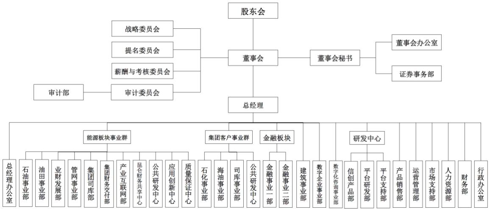

flowchart

```mermaid
graph TD
  A["股东会"] --> B["董事会"]
  C["战略委员会"] --> B
  D["提名委员会"] --> B
  E["薪酬与考核委员会"] --> B
  F["审计委员会"] --> B
  G["董事会秘书"] --> H["董事会办公室"]
  I["证券事务部"] --> H
  J["总经理"] --> K["能源板块事业群"]
  K --> L["集团客户事业群"]
  M["金融板块"] --> N["金融事业二部"]
  O["研发中心"] --> P["数字化咨询事业部"]
  Q["信创产品部"] --> R["平台支持部"]
  S["产品销售部"] --> T["运营管理部"]
  U["市场支持部"] --> V["人力资源部"]
  W["财务部"] --> X["行政办公室"]
  Y["总经管办公室"] --> Z["石油事业部"]
  Y --> AA["油田事业部"]
  Y --> AB["业财发展部"]
  Y --> AC["管网事业部"]
  Y --> AD["集团司库部"]
  Y --> AE["集团财务交付部"]
  Y --> AF["产业互联网部"]
  Y --> AG["昆仑财务共享中心"]
  Y --> AH["应用创新中心"]
  Y --> AI["质量保证中心"]
  Y --> AJ["石化事业部"]
  Y --> AK["海油事业部"]
  Y --> AL["司库事业部"]
  Y --> AM["公共研发中心"]
  Y --> AN["金融事业一部"]
  Y --> AO["建筑事业部"]
  Y --> AP["数字化咨询事业部"]
  Y --> AQ["信创产品部"]
  Y --> AR["平台研发部"]
```

# （二）发行人的重要权益投资情况

截至 2025 年 6 月 30 日，发行人拥有 6 家全资子公司、5 家控股子公司、4 家参股公司、10 家分公司，具体情况详见下图：

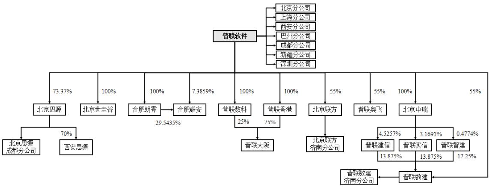

flowchart

This image displays a corporate equity structure chart (a type of flowchart) showing the shareholding relationships and percentage stakes between various companies, with top-level entities connected to specific subsidiaries.

发行人直接持股的全资子公司共 5 家，具体情况如下：

<table><tr><td>序号</td><td>公司名称</td><td>注册资本</td><td>主营业务及与发行人主营业务的关系</td></tr><tr><td>1</td><td>普联中瑞(北京)软件有限公司</td><td>500.00 万元</td><td>北京中瑞系发行人在北京地区的市场拓展平台及开发服务机构</td></tr><tr><td>2</td><td>合肥普联朗霁软件有限公司</td><td>1,000.00 万元</td><td>合肥朗霁定位于人力资源软件产品及解决方案供应商,主要客户分布在煤炭、教育等行业领域</td></tr><tr><td>3</td><td>PANSOFT (HONG KONG) LIMITED/普联软件(香港)有限公司</td><td>200.00 万美元</td><td>普联香港系发行人拓展中国香港地区及境外软件开发及技术服务业务的重要机构</td></tr><tr><td>4</td><td>普联数字科技(济南)有限公司</td><td>500.00 万元</td><td>普联数科主营业务为对日软件开发及测试等外包业务;软件开发及系统集成业务</td></tr><tr><td>5</td><td>北京世圭谷科技有限公司</td><td>5,000.00 万元</td><td>北京世圭谷系发行人2022年收购的公司,主要从事石油化工行业的计算机系统集成和软件开发实施</td></tr></table>

发行人间接持股的全资子公司共1家，具体情况如下：

<table><tr><td>序号</td><td>公司名称</td><td>注册资本</td><td>主营业务及与发行人主营业务的关系</td></tr><tr><td>1</td><td>日本パンソフト株式会社</td><td>8,000.00 万日元</td><td>普联大阪系发行人对日外包业务在日本的承接和交付机构</td></tr></table>

发行人共拥有 5 家控股子公司，具体情况如下：

<table><tr><td>序号</td><td>公司名称</td><td>注册资本</td><td>持股比例</td><td>主营业务及与发行人主营业务的关系</td></tr><tr><td>1</td><td>普联智能数建科技(北京)有限公司</td><td>8,500.00万元</td><td>55.00%</td><td>普联数建主营业务为数字建造产品的研发、销售、实施,负责建筑业务的开展</td></tr><tr><td>2</td><td>北京思源时代科技有限公司</td><td>1,200.00万元</td><td>73.37%</td><td>北京思源系发行人2022年收购的公司,从事建筑行业管理信息化方案咨询和系统建设业务</td></tr><tr><td>3</td><td>普联奥飞数字科技(济南)有限公司</td><td>1,000.00万元</td><td>55.00%</td><td>普联奥飞系发行人于2023年设立的子公司,主营业务为设备管理相关信息化产品的开发</td></tr><tr><td>4</td><td>北京联方智慧科技有限公司</td><td>1,200.00万元</td><td>55.00%</td><td>北京联方系发行人于2023年收购的公司,主要发展矿山行业的综合管控平台和智慧安全平台产品</td></tr><tr><td>5</td><td>思源时代(西安)网络科技有限公司</td><td>70.00万元</td><td>51.36%(间接)</td><td>西安思源为北京思源子公司,主营业务为软件开发和销售,并提供相关技术服务</td></tr></table>

发行人共拥有 4 家参股公司，具体情况如下：

<table><tr><td>序号</td><td>企业名称</td><td>注册资本/出资额</td><td>主营业务及与发行人主营业务的关系</td></tr><tr><td>1</td><td>合肥耀安科技有限公司</td><td>1,353.9371 万元</td><td>合肥耀安定位于高危行业安全培训领域的互联网服务业务,不同于发行人主营业务领域的其他业务</td></tr><tr><td>2</td><td>北京普联实信科技中心(有限合伙)</td><td>1,179.375 万元</td><td>北京中瑞参股并担任执行事务合伙人的企业,普联数建的股东之一(员工持股平台)</td></tr><tr><td>3</td><td>北京普联建信科技中心(有限合伙)</td><td>1,179.375 万元</td><td>北京中瑞参股并担任执行事务合伙人的企业,普联数建的股东之一(员工持股平台)</td></tr><tr><td>4</td><td>北京普联智建科技中心(有限合伙)</td><td>1,466.25 万元</td><td>北京中瑞参股并担任执行事务合伙人的企业,普联数建的股东之一(员工持股平台)</td></tr></table>

报告期内，以总资产、净资产、营业收入或净利润四项中有一项达到合并报表相关指标的 10% 作为重要子公司的判断标准，认定普联数建、北京思源、北京联方及普联奥飞为重要子公司，具体情况如下：

# 1、普联数建

<table><tr><td>公司名称</td><td colspan="3">普联智能数建科技(北京)有限公司</td></tr><tr><td>统一社会信用代码</td><td colspan="3">91110101MA04F4GD1U</td></tr><tr><td>成立时间</td><td colspan="3">2021年9月10日</td></tr><tr><td>法定代表人</td><td colspan="3">蔺国强</td></tr><tr><td>注册资本</td><td colspan="3">8,500.00万元人民币</td></tr><tr><td>实收资本</td><td colspan="3">8,500.00万元人民币</td></tr><tr><td>注册地及主要生产经营地</td><td colspan="3">北京市东城区后永康胡同17号10号楼1层1501室</td></tr><tr><td>股东构成</td><td colspan="3">发行人持有55%股权,普联智建持有17.25%股权,普联建信持有13.875%股权,普联实信持有13.875%股权</td></tr><tr><td>经营范围</td><td colspan="3">技术开发;技术咨询;技术交流;技术转让;技术推广;技术服务;软件服务;软件开发;基础软件服务;应用软件服务;计算机系统服务。(市场主体依法自主选择经营项目,开展经营活动;依法须经批准的项目,经相关部门批准后依批准的内容开展经营活动;不得从事国家和本市产业政策禁止和限制类项目的经营活动。)</td></tr><tr><td>主营业务及与发行人主营业务的关系</td><td colspan="3">数字建造产品的研发、销售、实施,负责建筑业务的开展</td></tr><tr><td rowspan="4">最近一年主要财务数据(万元)</td><td>项目</td><td>2025年6月30日/2025年1-6月(未经审计)</td><td>2024年12月31日/2024年度(经审计)</td></tr><tr><td>总资产</td><td>2,405.97</td><td>2,902.67</td></tr><tr><td>净资产</td><td>1,753.11</td><td>1,972.75</td></tr><tr><td>净利润</td><td>-268.71</td><td>158.72</td></tr></table>

2、北京思源

<table><tr><td>公司名称</td><td colspan="3">北京思源时代科技有限公司</td></tr><tr><td>统一社会信用代码</td><td colspan="3">91110106748105312J</td></tr><tr><td>成立时间</td><td colspan="3">2003年3月4日</td></tr><tr><td>法定代表人</td><td colspan="3">魏闽</td></tr><tr><td>注册资本</td><td colspan="3">1,200万元人民币</td></tr><tr><td>实收资本</td><td colspan="3">1,200万元人民币</td></tr><tr><td>注册地及主要生产经营地</td><td colspan="3">北京市丰台区汽车博物馆南路3号院1号楼1至11层101内6层602-1</td></tr><tr><td>股东构成</td><td colspan="3">发行人持有73.37%股权,魏闽持有8.63%股权,北京驷源科技中心(有限合伙)持有18%股权</td></tr><tr><td>经营范围</td><td colspan="3">一般项目:技术服务、技术开发、技术咨询、技术交流、技术转让、技术推广;信息技术咨询服务;软件开发;信息系统运行维护服务;计算机软硬件及辅助设备零售;软件销售;电子产品销售;计算机系统服务;数据处理服务;企业管理咨询;会议及展览服务。(除依法须经批准的项目外,凭营业执照依法自主开展经营活动)(不得从事国家和本市产业政策禁止和限制类项目的经营活动。)</td></tr><tr><td>主营业务及与发行人主营业务的关系</td><td colspan="3">北京思源系发行人于2022年11月新收购子公司,其长期深耕建筑行业基建领域业务,主要向建筑行业管理信息化方案提供咨询和系统建设等</td></tr><tr><td rowspan="4">最近一年主要财务数据(万元)</td><td>项目</td><td>2025年6月30日/2025年1-6月(未经审计)</td><td>2024年12月31日/2024年度(经审计)</td></tr><tr><td>总资产</td><td>5,967.66</td><td>6,887.06</td></tr><tr><td>净资产</td><td>4,762.42</td><td>5,184.45</td></tr><tr><td>净利润</td><td>-422.03</td><td>602.31</td></tr></table>

# 3、北京联方

<table><tr><td>公司名称</td><td colspan="3">北京联方智慧科技有限公司</td></tr><tr><td>统一社会信用代码</td><td colspan="3">91110108MA01NT8H28</td></tr><tr><td>成立时间</td><td colspan="3">2019年11月20日</td></tr><tr><td>法定代表人</td><td colspan="3">蔺国强</td></tr><tr><td>注册资本</td><td colspan="3">1,200万元人民币</td></tr><tr><td>实收资本</td><td colspan="3">1,200万元人民币</td></tr><tr><td>注册地及主要生产经营地</td><td colspan="3">北京市海淀区北四环中路283号2幢一层108号</td></tr><tr><td>通信地址</td><td colspan="3">北京市东城区华润大厦21层</td></tr><tr><td>股东构成</td><td colspan="3">发行人持有55%股权,北京共济长青信息技术中心(有限合伙)持有45%股权</td></tr><tr><td>经营范围</td><td colspan="3">技术开发、技术转让、技术推广、技术服务、技术咨询;软件开发;软件咨询;应用软件服务;计算机系统服务;基础软件服务。(市场主体依法自主选择经营项目,开展经营活动;依法须经批准的项目,经相关部门批准后依批准的内容开展经营活动;不得从事国家和本市产业政策禁止和限制类项目的经营活动。)</td></tr><tr><td>主营业务及与发行人主营业务的关系</td><td colspan="3">北京联方系发行人于2023年7月新收购子公司,主要发展矿山行业的综合管控平台和智慧安全平台产品</td></tr><tr><td rowspan="4">最近一年主要财务数据(万元)</td><td>项目</td><td>2025年6月30日/2025年1-6月(未经审计)</td><td>2024年12月31日/2024年度(经审计)</td></tr><tr><td>总资产</td><td>3,293.94</td><td>4,422.76</td></tr><tr><td>净资产</td><td>1,705.86</td><td>2,219.08</td></tr><tr><td>净利润</td><td>-513.23</td><td>-482.72</td></tr></table>

# 4、普联奥飞

<table><tr><td>公司名称</td><td colspan="3">普联奥飞数字科技(济南)有限公司</td></tr><tr><td>统一社会信用代码</td><td colspan="3">91370100MACQAQR77T</td></tr><tr><td>成立时间</td><td colspan="3">2023年7月11日</td></tr><tr><td>法定代表人</td><td colspan="3">冯学伟</td></tr><tr><td>注册资本</td><td colspan="3">1,000万元人民币</td></tr><tr><td>实收资本</td><td colspan="3">500万元人民币</td></tr><tr><td>注册地及主要生产经营地</td><td colspan="3">中国(山东)自由贸易试验区济南片区舜泰北路789号B座19层1906室</td></tr><tr><td>股东构成</td><td colspan="3">发行人持有55%股权,济南智信数字科技合伙企业(有限合伙)持有45%股权</td></tr><tr><td>经营范围</td><td colspan="3">一般项目:软件开发;电子产品销售;数字技术服务;人工智能应用软件开发;信息系统集成服务;技术服务、技术开发、技术咨询、技术交流、技术转让、技术推广;物联网技术研发;信息系统运行维护服务;企业管理咨询;信息技术咨询服务;计算机软硬件及外围设备制造;计算机软硬件及辅助设备批发;计算机软硬件及辅助设备零售;物联网设备销售;软件外包服务;以自有资金从事投资活动。(除依法须经批准的项目外,凭营业执照依法自主开展经营活动)</td></tr><tr><td>主营业务及与发行人主营业务的关系</td><td colspan="3">普联奥飞系发行人于2023年7月新设立的子公司,主要负责设备管理相关信息化产品的开发</td></tr><tr><td rowspan="4">最近一年主要财务数据(万元)</td><td>项目</td><td>2025年6月30日/2025年1-6月(未经审计)</td><td>2024年12月31日/2024年度(经审计)</td></tr><tr><td>总资产</td><td>3,271.71</td><td>3,896.93</td></tr><tr><td>净资产</td><td>1,223.19</td><td>1,481.75</td></tr><tr><td>净利润</td><td>-258.56</td><td>419.25</td></tr></table>

# 三、控股股东及实际控制人的基本情况

# （一）股权控制关系

截至 2025 年 6 月 30 日，蔺国强、王虎持有发行人股份比例分别为 11.06%、10.35%，合计为 21.41%，为发行人的控股股东、实际控制人。公司的控股股东、实际控制人最近三年未发生过变化。

蔺国强、王虎、任炳章、相洪伟、张廷兵、李燕冬、石连山、杨华茂、许彦明、李守强、高峰信、冯学伟、李守林、胡东映、聂玉涛、陈徐亚先生曾于2020年3月20日签订《一致行动协议》，就各方之间的一致行动事项作出约定，有效期至公司上市之日起三年。为促进公司持续稳健发展，保证公司经营治理的稳定性，经充分沟通协商，前述各方于2024年5月21日共同签署了新的《一致行动协议》，自2024年6月3日起生效，有效期为三年。因此，截至2025年6月30日，发行人控股股东、实际控制人蔺国强和王虎同时通过一致行动协议控制 $16.86\%$ 的股份表决权，蔺国强、王虎合计控制普联软件 $38.27\%$ 的股份表决权，其余股东均持股不超过 $5\%$ 。

公司控股股东、实际控制人简历如下：

# 1、蔺国强

蔺国强先生，1968年12月出生，汉族，中国国籍，无永久境外居留权。蔺国强先生毕业于山东师范大学计算机科学专业，本科学历。1991年7月至1994年4月，任山东医药工业学校教师；1994年5月至2001年9月，任浪潮通软副经理。2001年10月以来，蔺国强先生一直任职于公司，曾任公司执行董事、总经理等职务。2018年11月至今，蔺国强先生任公司董事长。

# 2、王虎

王虎先生，1950年7月出生，汉族，中国国籍，无永久境外居留权。王虎先生1987年毕业于清华大学计算机系，获硕士研究生学历。1982年1月至1985年9月，任济南铁路局电子计算所软件室主任；1985年9月至1987年9月，清华大学计算机科学与工程系研究生班学生；1987年9月至1990年1月，任山东师范大学计算机科学系研究室副主任；1990年1月至2001年6月，任职于浪潮集团，曾任浪潮集团分管软件业务的副总裁兼总工程师，期间参与创办浪潮通软并任该公司董事长兼总经理；自2001年10月至2018年11月，王虎先生一直任职于公司，曾任公司董事长及总经理等职务。2018年11月至2023年7月，王虎先生任公司副董事长。目前王虎先生已退休，未在公司担任职务。

# （二）持有公司股票的质押情况

截至 2025 年 6 月 30 日，发行人控股股东、实际控制人之一蔺国强持有公司的股份存在质押情况，具体情况如下：

<table><tr><td>股东名称</td><td>持股数量(股)</td><td>持股比例(%)</td><td>累计被质押股份数量(股)</td><td>占其所持股份比例(%)</td><td>占公司总股本比例(%)</td><td>质权人</td><td>质押用途</td></tr><tr><td>蔺国强</td><td>31,269,286</td><td>11.06</td><td>9,450,000</td><td>30.22</td><td>3.34</td><td>山东省国际信托股份有限公司</td><td>个人资金需求</td></tr></table>

除上述情况外，截至 2025 年 6 月 30 日，发行人控股股东、实际控制人所持有的其他股份不存在质押、冻结和其他限制权利的情况。

# （三）除发行人外重要权益投资情况等

截至 2025 年 6 月 30 日，控股股东、实际控制人蔺国强、王虎除持有发行人股份外，不存在其他权益投资情况。

# 四、承诺事项及履行情况

# （一）本次发行前所作出的重要承诺及其履行情况

本次发行前相关主体已作出的重要承诺及其履行情况参见发行人于 2025 年 4 月 1 日在巨潮资讯网(www.cninfo.com.cn)披露的《普联软件股份有限公司 2024 年年度报告》之“第六节 重要事项”之“一、承诺事项履行情况”。

# （二）本次发行所作出的重要承诺

1、公司全体董事和高级管理人员关于切实履行公司填补即期回报措施的承诺

公司全体董事和高级管理人员作出如下承诺：

“1、本人承诺不会无偿或以不公平条件向其他单位或者个人输送利益，也不会采用其他方式损害上市公司利益。  
2、本人承诺对本人的职务消费行为进行约束。  
3、本人承诺不动用上市公司资产从事与本人履行职责无关的投资、消费活动。  
4、本人承诺在自身职责和权限范围内，全力促使由董事会或薪酬委员会制定的薪酬制度与上市公司填补回报措施的执行情况相挂钩。  
5、如果上市公司未来筹划实施股权激励，本人承诺在自身职责和权限范围内，全力促使上市公司筹划的股权激励行权条件与填补回报措施的执行情况相挂钩。  
6、本承诺出具日后至本次向不特定对象发行可转换公司债券实施完毕前，若中国证监会作出关于填补回报措施及其承诺的其他新的监管规定的，且上述承诺不能满足中国证监会该等规定时，本人承诺届时将按照中国证监会的最新规定出具补充承诺。  
7、本人承诺切实履行上市公司制定的有关填补回报措施以及本人对此作出的任何有关填补回报措施的承诺。若本人违反该等承诺或拒不履行承诺，本人自愿接受中国证监会、交易所等证券监管机构依法作出的监管措施；给上市公司或

者投资者造成损失的，本人愿意依法承担对上市公司或者投资者的补偿责任。”

# 2、公司控股股东、实际控制人关于切实履行公司填补即期回报措施的承诺

“1、本人将不会越权干预上市公司经营管理活动，不会侵占上市公司利益；

2、本人不会无偿或以不公平条件向其他单位或者个人输送利益，也不采用其他方式损害上市公司利益；

3、本人将切实履行本人所作出的上述承诺事项，确保上市公司填补回报措施能够得到切实履行。若本人违反该等承诺或拒不履行承诺，本人自愿接受中国证监会、交易所等证券监管机构依法作出的监管措施；若违反该等承诺给上市公司或者股东造成损失的，本人愿意依法承担赔偿责任；

4、本人承诺出具日后至本次向不特定对象发行可转换公司债券实施完毕前，若中国证监会作出关于填补回报措施及其承诺的其他新的监管规定的，且上述承诺不能满足中国证监会该等规定时，本人承诺届时将按照中国证监会的最新规定出具补充承诺”

# 3、公司控股股东、实际控制人及其一致行动人、非独立董事、高级管理人员关于本次可转债发行的认购意向及承诺

公司控股股东、实际控制人及其一致行动人、非独立董事、高级管理人员就本次可转债发行认购意向出具承诺，具体内容如下：

“1、在符合《证券法》等相关规定及监管要求的前提下，本人将根据届时市场情况、本次可转债发行具体方案、资金状况等决定是否参与本次可转债发行认购。若认购成功，本人承诺自本次可转债发行首日（募集说明书公告日）起至本次可转债发行完成后六个月内不减持公司本次发行的可转债；

2、本人承诺并保证本人及本人之配偶、父母、子女将严格遵守《证券法》等相关规定，不进行短线交易。若有违规，由此所得收益归公司所有，并将依法承担由此产生的法律责任；

3、若本承诺函出具之后适用的法律、法规、规章、规范性文件、政策及证券监管机构的要求发生变化的，本人承诺将自动适用变更后的相关法律、法规、规章、规范性文件、政策及证券监管机构的要求。”

# 4、公司独立董事关于不参与本次可转债发行的认购的承诺

公司独立董事就不参与本次可转债发行认购出具承诺，具体内容如下：

“1、本人及本人配偶、父母、子女将不参与本次可转债发行认购，亦不会委托其他主体参与本次可转债发行认购；  
2、本人自愿作出上述承诺，并自愿接受上述承诺的约束。如本人及配偶、父母、子女违反上述承诺，由此所得收益归公司所有，本人将依法承担由此产生的法律责任；  
3、若本承诺函出具之后适用的法律、法规、规章、规范性文件、政策及证券监管机构的要求发生变化的，本人承诺将自动适用变更后的相关法律、法规、规章、规范性文件、政策及证券监管机构的要求。”

# 五、发行人董事、高级管理人员和其他核心人员情况

# （一）发行人董事、高级管理人员和其他核心人员基本情况

# 1、董事、高级管理人员的任职情况

截至本募集说明书签署日，公司现任董事、高级管理人员的基本情况如下：

<table><tr><td>序号</td><td>姓名</td><td>职务</td><td>本届任期</td></tr><tr><td>1</td><td>蔺国强</td><td>董事长</td><td>2023.7.31-2026.7.30</td></tr><tr><td>2</td><td>冯学伟</td><td>董事、总经理</td><td>2023.7.31-2026.7.30</td></tr><tr><td>3</td><td>相洪伟</td><td>董事、副总经理</td><td>2023.7.31-2026.7.30</td></tr><tr><td>4</td><td>李守强</td><td>董事</td><td>2023.7.31-2026.7.30</td></tr><tr><td>5</td><td>李科兵</td><td>职工代表董事</td><td>2025.5.15-2026.7.30</td></tr><tr><td>6</td><td>任迎春</td><td>独立董事</td><td>2023.7.31-2026.7.30</td></tr><tr><td>7</td><td>郝兴伟</td><td>独立董事</td><td>2023.7.31-2026.7.30</td></tr><tr><td>8</td><td>石贵泉</td><td>独立董事</td><td>2023.7.31-2026.7.30</td></tr><tr><td>9</td><td>张廷兵</td><td>副总经理</td><td>2023.7.31-2026.7.30</td></tr><tr><td>10</td><td>任炳章</td><td>副总经理</td><td>2023.7.31-2026.7.30</td></tr><tr><td>11</td><td>乔海兵</td><td>副总经理、董事会秘书</td><td>2023.7.31-2026.7.30</td></tr><tr><td>12</td><td>聂玉涛</td><td>财务总监</td><td>2023.7.31-2026.7.30</td></tr><tr><td>13</td><td>朱长春</td><td>副总经理</td><td>2025.2.10-2026.7.30</td></tr><tr><td>14</td><td>耿正</td><td>副总经理</td><td>2025.2.10-2026.7.30</td></tr></table>

注：1、2025年4月28日，发行人第四届董事会第二十三次会议聘任冯学伟为总经理，冯学伟担任总经理的任期自2025年4月28日起算；2、2025年5月15日，发行人2025年度第二次临时股东大会审议通过《关于选举相洪伟先生为公司董事的议案》，相洪伟担任董事的时间自2025年5月15日起算；3、2023年7月31日，发行人第四届董事会第一次会议聘任乔海兵为副总经理、董事会秘书，其中董事会秘书职务任期自其取得董事会秘书资格证书之日起算；乔海兵于2023年8月23日获深交所颁发董事会秘书资格证书。

# 2、董事、高级管理人员简历

# (1) 董事

蔺国强先生，其简历详见“第四节 发行人基本情况”之“三、控股股东及实际控制人的基本情况”。

冯学伟先生，1976年1月出生，中国国籍，无永久境外居留权，硕士。2003年8月至今任职于公司，曾任油田事业部经理、公司副总经理等职务。现任公司董事、总经理。

相洪伟先生，1971年7月出生，中国国籍，无永久境外居留权，专科学历，高级会计师，经济师。2001年9月至今任职于公司，曾任石油事业部副经理、石油事业部总经理、副总经理等职务；2025年5月，任公司董事；现任公司董事、副总经理。

李守强先生，1975年12月出生，中国国籍，无永久境外居留权，专科学历。2001年12月至今任职于公司，曾担任公司解决方案部、平台研发部经理及公司首席架构师、技术总监等职务。现任公司董事、技术总监。

李科兵先生，1982年3月出生，中国国籍，无永久境外居留权，专科学历。2001年9月至今任职于本公司，曾任石油事业部副经理、石油板块执行经理、能源板块事业群副总经理等职务。现任公司职工代表董事。

任迎春女士，1973年12月出生，中国国籍，无永久境外居留权，本科学历，律师。1994年7月至2000年9月，任济南东风锅炉厂厂办主任；2000年9月至2003年7月于山东政法学院学习；2003年7月至2004年7月，任山东高信律师事务所实习律师；2004年7月至2007年9月，任山东安邦顺意律师事务所专职律师；2007年9月至2024年4月，任山东盈德律师事务所执行主任；2024年4月至今，任上海段和段（济南）律师事务所高级合伙人、副主任。2020年7月至今，任公司独立董事。

郝兴伟先生，1966年4月出生，中国国籍，无永久境外居留权，计算机软件与理论专业，博士。1987年9月至2018年2月，在山东大学计算机科学与技术学院工作；2018年3月至今，在山东大学软件学院工作，现任山东大学计算机通识教育首席教授、山东大学计算中心主任。2022年4月至今，任公司独立董事。

石贵泉先生，1969年6月出生，中国国籍，无永久境外居留权，研究生学历。1992年7月至2011年7月，山东经济学院教师；2011年8月至今，山东财经大学教授，硕士生导师，任山东财经大学智能会计现代产业学院执行院长。国际注册内部审计师（CIA），山东省财政厅、济南市财政局特聘内部控制咨询专家，济南市国资委兼职外部董事。2021年3月至今，任威海华东数控股份有限公司独立董事；2022年7月至今，任济南文旅发展集团有限公司董事。2023年7月至今，任公司独立董事。2025年7月至今，任孚日集团股份有限公司独立董事。

# (2) 高级管理人员

冯学伟先生，其简历详见本节之“五、发行人董事、高级管理人员和其他核心人员情况”之“(一）发行人董事、高级管理人员和其他核心人员基本情况”之“1、董事、高级管理人员的任职情况”。

张廷兵先生，1976年9月出生，中国国籍，无永久境外居留权，本科学历。2002年1月至今任职于公司，曾任石油事业部经理、公司董事、副总经理等职务。现任公司副总经理。

任炳章先生，1974年3月出生，中国国籍，无永久境外居留权，专科学历。2001年11月至今任职于公司，曾任石化事业部总经理、公司副总经理等职务。现任公司副总经理。

相洪伟先生，其简历详见本节之“五、发行人董事、高级管理人员和其他核心人员情况”之“(一）发行人董事、高级管理人员和其他核心人员基本情况”之“1、董事、高级管理人员的任职情况”。

乔海兵女士，1974年9月出生，中国国籍，无永久境外居留权，本科学历，高级会计师。1995年7月至2006年6月，历任中国石油化工股份有限公司燕山

分公司会计中心会计、资金主管；2006年7月至2021年10月，历任石化盈科信息技术有限责任公司ERP事业部高级财务顾问、ERP事业部总经理助理、共享服务部总经理、共享创新事业部总经理；2021年11月至2023年6月，历任山东京博控股集团有限公司集团财务负责人、首席财务官、财务与资产管理中心总经理。现任公司副总经理、董事会秘书。

聂玉涛先生，1975年11月出生，中国国籍，无永久境外居留权，本科学历，会计师、人力资源管理师。2001年11月至今任职于公司。曾任石油事业部副经理、公司监事、人力资源部经理、财务总监等职务。现任公司财务总监，兼任人力资源部经理。

朱长春先生，1985年6月出生，中国国籍，无永久境外居留权，本科学历。2005年7月至2009年7月，山东财政学院学习。2009年7月至今，任职于公司，曾任石油事业部副总经理、石油事业部总经理、石油板块事业群副总经理等职务。现任公司副总经理。

耿正先生，1985年7月出生，中国国籍，无永久境外居留权，研究生学历。2002年9月至2006年6月，山东大学计算机学院本科学习。2019年8月至2020年12月，北京科技大学EMBA学习。2006年6月至今，任职于公司，曾任项目经理、部门副经理、部门经理等职务。现任公司副总经理、信创产品部经理。

# 3、其他核心人员

公司其他核心人员为公司的核心技术人员，公司共有 11 名核心技术人员。核心技术人员名单及其简历如下：

<table><tr><td>序号</td><td>姓名</td><td>在公司的任职情况</td></tr><tr><td>1</td><td>蔺国强</td><td>董事长</td></tr><tr><td>2</td><td>冯学伟</td><td>董事、总经理</td></tr><tr><td>3</td><td>相洪伟</td><td>董事、副总经理</td></tr><tr><td>4</td><td>张廷兵</td><td>副总经理</td></tr><tr><td>5</td><td>任炳章</td><td>副总经理</td></tr><tr><td>6</td><td>李守强</td><td>董事、技术总监</td></tr><tr><td>7</td><td>李守林</td><td>咨询总监</td></tr><tr><td>8</td><td>聂玉涛</td><td>财务总监</td></tr><tr><td>9</td><td>朱长春</td><td>副总经理</td></tr><tr><td>10</td><td>耿正</td><td>副总经理</td></tr><tr><td>11</td><td>刘萌</td><td>首席架构师</td></tr></table>

蔺国强先生，其简历详见“第四节 发行人基本情况”之“三、控股股东及实际控制人的基本情况”。

冯学伟先生，其简历详见本节之“五、发行人董事、高级管理人员和其他核心人员情况”之“(一）发行人董事、高级管理人员和其他核心人员基本情况”之“1、董事、高级管理人员的任职情况”。

相洪伟先生，其简历详见本节之“五、发行人董事、高级管理人员和其他核心人员情况”之“(一）发行人董事、高级管理人员和其他核心人员基本情况”之“1、董事、高级管理人员的任职情况”。

张廷兵先生，其简历详见本节之“五、发行人董事、高级管理人员和其他核心人员情况”之“(一）发行人董事、高级管理人员和其他核心人员基本情况”之“1、董事、高级管理人员的任职情况”。

任炳章先生，其简历详见本节之“五、发行人董事、高级管理人员和其他核心人员情况”之“(一）发行人董事、高级管理人员和其他核心人员基本情况”之“1、董事、高级管理人员的任职情况”。

李守强先生，其简历详见本节之“五、发行人董事、高级管理人员和其他核心人员情况”之“(一）发行人董事、高级管理人员和其他核心人员基本情况”之“1、董事、高级管理人员的任职情况”。

李守林先生，1976年3月出生，中国国籍，无永久境外居留权，计算机应用专业，研究生学历。2002年3月至今任职于公司，主要从事系统设计及技术研发工作。先后主持参与了基于J2EE的财务信息系统开发框架、SmartWeb企业应用开发框架、BIS业务集成平台等基础系统的设计开发；主持研发了普联银企交互平台，普联财务共享平台等系统。现主要致力于智能化财务数字化转型中的业务实践和系统分析工作。现任公司咨询总监。

聂玉涛先生，其简历详见本节之“五、发行人董事、高级管理人员和其他核心人员情况”之“(一）发行人董事、高级管理人员和其他核心人员基本情况”

# 之 “1、董事、高级管理人员的任职情况”。

朱长春先生，其简历详见本节之“五、发行人董事、高级管理人员和其他核心人员情况”之“(一）发行人董事、高级管理人员和其他核心人员基本情况”之“1、董事、高级管理人员的任职情况”。

耿正先生，其简历详见本节之“五、发行人董事、高级管理人员和其他核心人员情况”之“（一）发行人董事、高级管理人员和其他核心人员基本情况”之“1、董事、高级管理人员的任职情况”。

刘萌先生，1983年6月出生，中国国籍，无永久境外居留权，本科学历。2018年10月至2021年12月，任北京马赫谷科技有限公司产品总监、架构师；2021年12月至2022年5月，任北京优特捷信息技术有限公司产品总监；2022年5月至今就职于公司，目前任公司首席架构师。负责信创产品技术规划、方案设计和关键技术研发，实现信创总账产品会计核算的性能突破。负责公司人工智能技术与应用研发，主持公司智能体开发平台的方案设计、技术预研和产品交付。

# （二）董事、高级管理人员和其他核心人员的薪酬情况

2024 年度，公司现任董事、高级管理人员和其他核心人员在公司领取的薪酬情况如下：

<table><tr><td>序号</td><td>姓名</td><td>职务</td><td>从公司获得的税前报酬总额(万元)</td></tr><tr><td>1</td><td>蔺国强</td><td>董事长、实际控制人、核心技术人员</td><td>64.16</td></tr><tr><td>2</td><td>冯学伟</td><td>董事、总经理、核心技术人员</td><td>90.28</td></tr><tr><td>3</td><td>相洪伟</td><td>董事、副总经理、核心技术人员</td><td>91.68</td></tr><tr><td>4</td><td>李守强</td><td>董事、核心技术人员</td><td>65.56</td></tr><tr><td>5</td><td>李科兵</td><td>职工代表董事</td><td>-</td></tr><tr><td>6</td><td>任迎春</td><td>独立董事</td><td>7.20</td></tr><tr><td>7</td><td>郝兴伟</td><td>独立董事</td><td>7.20</td></tr><tr><td>8</td><td>石贵泉</td><td>独立董事</td><td>7.20</td></tr><tr><td>9</td><td>张廷兵</td><td>副总经理、核心技术人员</td><td>68.08</td></tr><tr><td>10</td><td>任炳章</td><td>副总经理、核心技术人员</td><td>86.68</td></tr><tr><td>11</td><td>乔海兵</td><td>副总经理、董事会秘书</td><td>115.96</td></tr><tr><td>12</td><td>聂玉涛</td><td>财务总监、核心技术人员</td><td>68.08</td></tr><tr><td>13</td><td>朱长春</td><td>副总经理、核心技术人员</td><td>-</td></tr><tr><td>14</td><td>耿正</td><td>副总经理、核心技术人员</td><td>-</td></tr><tr><td>15</td><td>李守林</td><td>核心技术人员</td><td>67.88</td></tr><tr><td>16</td><td>刘萌</td><td>核心技术人员</td><td>88.96</td></tr><tr><td colspan="3">合计</td><td>828.92</td></tr></table>

注：李科兵于 2025 年 5 月 15 日起担任职工代表董事，朱长春、耿正于 2025 年 2 月 10 日起任副总经理、核心技术人员，2024 年期间未担任。

# （三）董事、高级管理人员和其他核心人员的兼职情况

截至 2025 年 6 月 30 日，发行人现任董事、高级管理人员和其他核心人员除在公司及子公司任职以外，其他主要兼职情况如下：

<table><tr><td>姓名</td><td>公司职务/与公司关系</td><td>兼职单位</td><td>兼职职务</td><td>兼职单位与公司关系</td></tr><tr><td>冯学伟</td><td>董事、总经理</td><td>合肥耀安科技有限公司</td><td>董事</td><td>公司参股公司</td></tr><tr><td>任炳章</td><td>副总经理</td><td>山东益友德能源有限公司</td><td>监事</td><td>公司高级管理人员担任监事的单位</td></tr><tr><td>任迎春</td><td>独立董事</td><td>上海段和段(济南)律师事务所</td><td>高级合伙人、副主任</td><td>公司独立董事担任关键管理职务的单位</td></tr><tr><td rowspan="5">石贵泉</td><td rowspan="5">独立董事</td><td>山东财经大学</td><td>教授</td><td>公司独立董事在外任职的单位</td></tr><tr><td>威海华东数控股份有限公司</td><td>独立董事</td><td>公司独立董事在外担任独立董事的单位</td></tr><tr><td>济南市人民政府国有资产监督管理委员会</td><td>济南市市属一级国有企业兼职外部董事</td><td>公司独立董事在外担任外部董事的单位</td></tr><tr><td>济南文旅发展集团有限公司</td><td>董事</td><td>公司独立董事在外担任董事的单位</td></tr><tr><td>孚日集团股份有限公司</td><td>独立董事</td><td>公司独立董事在外担任独立董事的单位</td></tr></table>

# （四）董事、高级管理人员和其他核心人员持有公司股份的情况

截至 2025 年 6 月 30 日，公司现任董事、高级管理人员和其他核心人员持有公司股份的情况如下：

<table><tr><td>序号</td><td>姓名</td><td>职务</td><td>持股数量(股)</td><td>持股比例(%)</td></tr><tr><td>1</td><td>蔺国强</td><td>董事长、实际控制人</td><td>31,269,286</td><td>11.06</td></tr><tr><td>2</td><td>冯学伟</td><td>董事、总经理</td><td>2,888,845</td><td>1.02</td></tr><tr><td>3</td><td>相洪伟</td><td>董事、副总经理</td><td>5,286,429</td><td>1.87</td></tr><tr><td>4</td><td>李守强</td><td>董事</td><td>2,947,892</td><td>1.04</td></tr><tr><td>5</td><td>李科兵</td><td>职工代表董事</td><td>-</td><td>-</td></tr><tr><td>6</td><td>任迎春</td><td>独立董事</td><td>-</td><td>-</td></tr><tr><td>7</td><td>郝兴伟</td><td>独立董事</td><td>-</td><td>-</td></tr><tr><td>8</td><td>石贵泉</td><td>独立董事</td><td>-</td><td>-</td></tr><tr><td>9</td><td>张廷兵</td><td>副总经理</td><td>5,154,513</td><td>1.82</td></tr><tr><td>10</td><td>任炳章</td><td>副总经理</td><td>4,854,087</td><td>1.72</td></tr><tr><td>11</td><td>乔海兵</td><td>副总经理、董事会秘书</td><td>-</td><td>-</td></tr><tr><td>12</td><td>聂玉涛</td><td>财务总监</td><td>1,743,056</td><td>0.62</td></tr><tr><td>13</td><td>朱长春</td><td>副总经理</td><td>-</td><td>-</td></tr><tr><td>14</td><td>耿正</td><td>副总经理</td><td>-</td><td>-</td></tr><tr><td>15</td><td>李守林</td><td>核心技术人员</td><td>2,485,640</td><td>0.88</td></tr><tr><td>16</td><td>刘萌</td><td>核心技术人员</td><td>-</td><td>-</td></tr></table>

# （五）报告期内董事、监事、高级管理人员和其他核心人员的变动情况

自 2022 年 1 月 1 日至本募集说明书签署日，发行人董事、监事、高级管理人员和其他核心人员变动情况如下：

1、董事自2022年1月1日以来变动情况

<table><tr><td>报告期初</td><td colspan="3">蔺国强、王虎、张廷兵、冯学伟、张善良、王凯、司潮、任迎春、王瑞金</td></tr><tr><td>变更时间</td><td>变更情况</td><td>变更后情况</td><td>变更原因</td></tr><tr><td>2022年4月20日2021年年度股东大会</td><td>王瑞金届满离任,选举郝兴伟为独立董事</td><td>蔺国强、王虎、张廷兵、冯学伟、张善良、王凯、司潮、任迎春、郝兴伟</td><td>任期届满</td></tr><tr><td>2023年7月31日2023年第二次临时股东大会</td><td>王虎、张善良、王凯、司潮届满离任;审议通过减少公司董事会成员人数的相关议案;选举李守强为非独立董事,石贵泉为独立董事</td><td>蔺国强、张廷兵、冯学伟、李守强、任迎春、郝兴伟、石贵泉</td><td>任期届满</td></tr><tr><td>2025年5月6日职工代表大会2025年5月15日2025年第二次临时股东大会</td><td>张廷兵辞任,选举相洪伟为董事;选举李科兵为职工代表董事</td><td>蔺国强、冯学伟、相洪伟、李守强、李科兵、任迎春、郝兴伟、石贵泉</td><td>个人原因、选举职工代表董事</td></tr></table>

<table><tr><td>截至本募集说明书签署日</td><td>蔺国强、冯学伟、相洪伟、李守强、李科兵、任迎春、郝兴伟、石贵泉</td></tr></table>

2、监事自2022年1月1日以来变动情况

<table><tr><td>报告期初</td><td colspan="3">石连山、邹方平、路前程</td></tr><tr><td>变更时间</td><td>变更情况</td><td>变更后情况</td><td>变更原因</td></tr><tr><td>2022年1月27日2022年第一次职工代表大会</td><td>路前程辞任,选举高峰信为职工代表监事</td><td>石连山、邹方平、高峰信</td><td>个人原因</td></tr><tr><td>2023年7月31日2023年第二次临时股东大会</td><td>石连山、邹方平届满离任,选举杨华茂为监事会主席,张云剑为非职工代表监事</td><td>杨华茂、高峰信、张云剑</td><td>任期届满</td></tr><tr><td>2025年5月15日2025年第二次临时股东大会</td><td colspan="2">明确公司不设监事会,不设监事,相应职权由董事会审计委员会行使。</td><td>根据《公司法》《上市公司章程指引(2025年修订)》等法律法规修订公司章程</td></tr><tr><td>截至本募集说明书签署日</td><td colspan="3">-</td></tr></table>

3、高级管理人员自2022年1月1日以来变动情况

<table><tr><td>报告期初</td><td colspan="3">蔺国强、冯学伟、张廷兵、李燕冬、任炳章、相洪伟、聂玉涛</td></tr><tr><td>变更时间</td><td>变更情况</td><td>变更后情况</td><td>变更原因</td></tr><tr><td>2023年7月31日2023年第二次临时股东大会</td><td>李燕冬届满离任,聘任乔海兵为董事会秘书、副总经理</td><td>蔺国强、冯学伟、张廷兵、乔海兵、任炳章、相洪伟、聂玉涛</td><td>任期届满</td></tr><tr><td>2025年2月10日第四届董事会第二十次会议</td><td>新增聘任朱长春、耿正为副总经理</td><td>蔺国强、冯学伟、张廷兵、任炳章、相洪伟、乔海兵、聂玉涛、朱长春、耿正</td><td>新增聘任</td></tr><tr><td>2025年4月28日第四届董事会第二十三次会议</td><td>蔺国强辞任,聘任冯学伟为总经理</td><td>冯学伟、张廷兵、任炳章、相洪伟、乔海兵、聂玉涛、朱长春、耿正</td><td>个人原因、新增聘任</td></tr><tr><td>截至本募集说明书签署日</td><td colspan="3">冯学伟、张廷兵、任炳章、相洪伟、乔海兵、聂玉涛、朱长春、耿正</td></tr></table>

# 4、其他核心人员自2022年1月1日以来的变动情况

公司其他核心人员为公司的核心技术人员。报告期期初，公司的核心技术人员名单如下：蔺国强、王虎、冯学伟、张廷兵、相洪伟、任炳章、李守强、李守林、胡小丰、石连山、聂玉涛，共11人。报告期内，王虎因退休离任，不再在公司担任职务及核心技术人员；胡小丰因个人原因不再担任XBRL事业部经理，故不再担任核心技术人员；石连山因离职，不再担任核心技术人员；新增刘萌为

核心技术人员。2025年2月，新增朱长春、耿正为核心技术人员。

发行人董事、监事、高级管理人员和其他核心人员的上述变动系个人原因、期满换届、公司经营管理的策略性调整、根据法律法规修订公司章程等所致，相关人员变动不会对公司的经营管理产生重大不利影响，且相关变动均符合公司章程规定的任免程序和内部人事聘用制度，不存在实际控制人及其控制的其他企业干预发行人董事会和股东（大）会已经作出的人事任免决定的情况。

# （六）对董事、高级管理人员及其他员工的激励情况

自公司 2021 年 6 月于深交所创业板上市以来，共实施过三次限制性股票激励计划，具体情况如下：

# 1、2021年限制性股票激励计划

# （1）2021年9月，向激励对象首次授予限制性股票

2021 年 9 月 6 日，公司召开第三届董事会第十次会议，审议通过了《2021年限制性股票激励计划（草案）及其摘要的议案》《关于公司<2021年限制性股票激励计划实施考核管理办法>的议案》等相关议案，同意本次激励计划拟授予的限制性股票总量为 360.00 万股，其中首次授予 340.00 万股，预留 20.00 万股。

2021 年 9 月 24 日，公司召开 2021 年第二次临时股东大会，审议通过了《关于公司<2021 年限制性股票激励计划（草案）>及其摘要的议案》等相关议案，并授权董事会办理股权激励相关事宜。

2021 年 9 月 27 日，公司召开第三届董事会第十一次会议并作出决议，同意确定 2021 年 9 月 27 日为首次授予日，以 18.24 元/股向符合授予条件的 292 名激励对象授予 340 万股第二类限制性股票。

# （2）2022年8月，向激励对象授予预留部分限制性股票

2022 年 6 月 22 日，公司召开第三届董事会第十八次会议、第三届监事会第十六次会议，审议通过了《关于调整 2021 年限制性股票激励计划授予价格的议案》。对 2021 年限制性股票授予价格（含预留授予）进行调整，由 18.24 元/股调整为 17.94 元/股。

2022 年 8 月 25 日，公司召开第三届董事会第二十次会议和第三届监事会第

十八次会议，审议通过了《关于向激励对象授予2021年限制性股票激励计划预留部分的议案》，确定2022年8月25日为公司预留部分限制性股票的授予日，以17.94元/股的授予价格向符合授予条件的13名激励对象授予20万股第二类限制性股票。

# （3）2022年12月，普联软件2021年股权激励计划完成第一期归属

2022 年 9 月 28 日，公司召开第三届董事会第二十一次会议和第三届监事会第十九次会议，审议通过了《关于 2021 年限制性股票激励计划首次授予部分第一个归属期归属条件成就的议案》，同意公司按规定为符合条件的 285 名激励对象办理 953,908 股第二类限制性股票归属相关事宜。

2022 年 9 月 29 日，致同所出具致同验字（2022）第 371C000568 号《验资报告》。经审验，截至 2022 年 9 月 28 日止，公司已收到前述限制性股票激励对象的归属出资款合计人民币 17,113,109.52 元，其中计入股本人民币 953,908.00 元。

2022 年 10 月 14 日，新增股份已办理完成登记手续并上市。本次归属完成后，发行人股本总额由 141,010,659 股增至 141,964,567 股。

2022 年 12 月 6 日，济南高新技术产业开发区管理委员会向发行人换发《营业执照》。

# （4）2023年12月，普联软件2021年股权激励计划完成第二期归属及作废部分已授予尚未归属的2021年限制性股票

2023 年 5 月 29 日，公司召开第三届董事会第二十九次会议、第三届监事会第二十七次会议，审议通过了《关于调整 2021 年限制性股票激励计划授予数量及授予价格的议案》。公司 2021 年限制性股票激励计划已经授予尚未归属（不含已作废）的股票授予数量由 255.1300 万股调整为 357.1820 万股、授予价格由 17.94 元/股调整为 12.60 元/股。

2023 年 9 月 28 日，公司召开第四届董事会第五次会议、第四届监事会第五次会议，审议通过了《关于 2021 年限制性股票激励计划首次授予部分第二个归属期及预留授予部分第一个归属期归属条件成就的议案》，同意公司按规定为符合条件的 294 名激励对象办理 1,241,150 股第二类限制性股票归属相关事宜。

同日，公司审议通过了《关于作废部分已授予尚未归属的2021年限制性股票的议案》，公司2021年限制性股票激励计划首次授予且上一个归属期仍满足任期期限要求的285名激励对象中，4人因个人原因离职，不再具备激励对象资格，其已授予尚未归属的限制性股票25,480股予以作废；符合本次归属任职期限要求的剩余294名（含首次授予剩余281名及预留授予13名）激励对象，因2022年度公司层面业绩考核归属比例为 $80.6015\%$ ，经考核本期不能归属的限制性股票298,710股不得归属，予以作废。上述已获授尚未归属的第二类限制性股票合计作废324,190股。

2023 年 10 月 8 日，致同所出具致同验字（2023）第 371C000462 号《验资报告》。经审验，截至 2023 年 10 月 7 日止，公司已收到前述限制性股票激励对象的归属出资款合计人民币 15,638,490.00 元，其中计入股本人民币 1,241,150.00 元。

2023 年 10 月 13 日，新增股份已办理完成登记手续并上市。本次归属完成后，发行人股本总额由 201,284,599 股增至 202,525,749 股。

2023 年 12 月 1 日，公司已办理并完成工商变更登记及《公司章程》备案手续，并取得了济南高新技术产业开发区管理委员会核发的《营业执照》。

# （5）2024年4月，作废部分已授予尚未归属的2021年限制性股票

2024 年 4 月 12 日，公司召开第四届董事会第九次会议、第四届监事会第八次会议，审议通过了《关于作废部分已授予尚未归属的 2021 年限制性股票的议案》。

根据公司《2021年限制性股票激励计划（草案）》和《2021年限制性股票激励计划实施考核管理办法》，鉴于2021年限制性股票激励计划首次授予部分的激励对象中，2名激励对象因个人原因离职，不再具备激励对象资格，其已获授但尚未归属的限制性股票合计8,400股不得归属，作废失效；鉴于2021年限制性股票激励计划预留授予部分的激励对象中，1名激励对象因个人原因离职，不再具备激励对象资格，其已获授但尚未归属的限制性股票5,600股不得归属，作废失效；因公司2023年营业收入较2020年增长率为77.50%，未达业绩考核触发增长率，故在职的所有激励对象对应考核当年计划归属的限制性股票合计

1,992,480 股均不得归属，并作废失效。综上，本次合计作废 2,006,480 股 2021 年限制性股票激励计划中已授予尚未归属的第二类限制性股票。

上述已授予但尚未归属的限制性股票作废后，公司 2021 年限制性股票激励计划结束。

# 2、2023年限制性股票激励计划

# （1）2023年6月，向激励对象首次授予限制性股票

2023年5月29日,公司召开第三届董事会第二十九次会议,审议通过了《2023年限制性股票激励计划（草案）及其摘要的议案》等相关议案，同意本次激励计划拟授予的限制性股票总量为980万股,其中首次授予855万股,预留125万股。

2023 年 6 月 19 日，公司召开 2023 年第一次临时股东大会，审议通过了《关于公司<2023 年限制性股票激励计划（草案）>及其摘要的议案》等相关议案，并授权董事会办理股权激励相关事宜。

2023 年 6 月 27 日，公司召开第三届董事会第三十次会议，审议通过了《关于 2023 年限制性股票激励计划首次授予相关事项的议案》。同意确定 2023 年 6 月 27 日为首次授予日，以 22 元/股的授予价格向符合条件的 89 名激励对象授予 855 万股第二类限制性股票。

# （2）2023年8月，向激励对象授予预留部分限制性股票

2024 年 8 月 25 日，公司召开第四届董事会第三次会议和第四届监事会第三次会议，审议通过了《关于向激励对象授予 2023 年限制性股票激励计划预留部分的议案》，确定 2023 年 8 月 25 日为公司预留部分限制性股票的授予日，以 22 元/股的授予价格向符合授予条件的 15 名激励对象授予 125 万股第二类限制性股票。

# （3）2024年4月，作废部分已授予尚未归属的2023年限制性股票

2024 年 4 月 12 日，公司召开第四届董事会第九次会议、第四届监事会第八次会议，审议通过了《关于作废部分已授予尚未归属的 2023 年限制性股票的议案》。

根据公司《2023年限制性股票激励计划》和《2023年限制性股票激励计划

实施考核管理办法》，公司 2023 年营业收入较 2022 年增长率为 7.80%，未达业绩考核触发增长率，首次授予部分及预留部分的第一个归属期的归属条件均未成就，公司董事会决定上述激励对象第一个归属期计划归属的限制性股票 2,940,000 股不得归属，并作废失效。

(4) 2025 年 8 月, 作废部分已授予尚未归属的 2023 年限制性股票

2025 年 8 月 26 日, 公司召开第四届董事会第二十五次会议, 审议通过了《关于作废部分已授予尚未归属的 2023 年限制性股票的议案》。

根据公司《2023年限制性股票激励计划》和《2023年限制性股票激励计划实施考核管理办法》，鉴于2023年限制性股票激励计划首次授予部分及预留授予的激励对象中，其中2名激励对象因个人原因离职，不再具备激励对象资格，其已获授但尚未归属的限制性股票合计44.10万股（数量调整后）不得归属，作废失效；公司2024年营业收入较2022年增长率为 $20.30\%$ ，未达业绩考核触发增长率，首次授予部分及预留部分的第二个归属期的归属条件均未成就，公司董事会决定激励对象第二个归属期计划归属的限制性股票392.70万股（数量调整后）不得归属，并作废失效。因此，本次合计作废436.80万股（数量调整后）已授予尚未归属的2023年第二类限制性股票。

# 3、2024年限制性股票激励计划

# （1）2024年9月，向激励对象授予限制性股票

2024 年 8 月 30 日，公司召开第四届董事会第十四次会议，审议通过了《关于公司〈2024 年限制性股票激励计划（草案）〉及其摘要的议案》等相关议案，同意本次激励计划拟授予的限制性股票总量为 390 万股，其中首次授予 360 万股，预留 30 万股。

2024 年 9 月 18 日，公司 2024 年第五次临时股东大会审议通过了《关于公司〈2024 年限制性股票激励计划（草案）〉及其摘要的议案》等相关议案，并授权董事会办理股权激励相关事宜。

2024 年 9 月 19 日，公司召开第四届董事会第十五次会议审议通过了《关于 2024 年限制性股票激励计划首次授予相关事项的议案》，同意确定 2024 年 9 月 18 日为首次授予日，以 11 元/股的授予价格向符合条件的 26 名激励对象授予 360

万股第二类限制性股票。

2024 年 9 月 30 日，公司召开第四届董事会第十六次会议，审议通过了《关于向激励对象授予 2024 年限制性股票激励计划预留部分的议案》，同意确定 2024 年 9 月 27 日为预留部分授予日，以 11 元/股的价格向符合授予条件的 1 名激励对象授予 30 万股第二类限制性股票。

# 六、发行人所处行业基本情况

根据《国民经济行业分类与代码（GB/T 4754-2017）》，公司属于“I65 软件和信息技术服务业”。根据国家统计局发布的《战略性新兴产业分类（2018）》，发行人属于“1.3 新兴软件和新型信息技术服务”下属的“1.3.1 新兴软件开发”中的“6513 应用软件开发”子行业。

# （一）行业监管体制及最近三年监管政策的变化

# 1、主管部门及监管体制

软件行业的主管部门是国家工业和信息化部。国家工业和信息化部负责制定国家信息产业发展战略、方针政策和总体规划，对全国软件行业实行行业管理和监督，组织协调并管理全国软件企业认定工作，主要职责包括：制定并发布软件业的行政规章、技术政策、技术体制和技术标准；授权软件产品检测机构，按照我国软件产品的标准规范和软件产品的测试标准和规范，进行符合性检测；制定全国统一的软件产品登记号码体系、制作软件产品登记证书；发布软件产品登记通告等。

软件行业的自律组织是中国软件行业协会及各地方协会, 主要从事软件行业市场研究, 为会员单位提供公共服务、行业自律管理及向政府部门提出行业发展建议等。

中国版权保护中心和中国软件登记中心受国家版权局的委托和指定，从事各种与著作权有关的登记，面向社会提供著作权法律咨询和著作权交易服务等。

# 2、近年来行业主要法律法规、政策

<table><tr><td>序号</td><td>法律法规及政策</td><td>颁布部门</td><td>颁布时间</td><td>主要相关内容</td></tr><tr><td>1</td><td>《推动数字金融高质量发展行动方案》</td><td>中国人民银行、国家发改委、工信部等7个部门</td><td>2024年</td><td>基本建成与数字经济发展高度适应的金融体系。金融机构数字化转型取得积极成效,数字化经营管理能力明显增强。数字金融治理体系基本形成,数字金融基础设施基本齐备,相关金融管理和配套制度机制进一步健全。</td></tr><tr><td>2</td><td>《工业重点行业领域设备更新和技术改造指南》</td><td>工信部</td><td>2024年</td><td>推动航空、船舶、石化、钢铁、汽车、装备、轨道交通、电子等重点行业及模具等重点领域企业的工业软件全面更新换代。</td></tr><tr><td>3</td><td>《国家人工智能产业综合标准化体系建设指南(2024版)》</td><td>工信部、中央网信办、国家发改委、国家标准化管理委员会</td><td>2024年</td><td>坚持创新驱动,优化产业科技创新与标准化联动机制,加快人工智能领域关键共性技术研究,推动先进适用的科技创新成果高效转化成标准;坚持应用牵引,坚持企业主体、市场导向,面向行业应用需求,强化创新成果迭代和应用场景构建,协同推进人工智能与重点行业融合应用。</td></tr><tr><td>4</td><td>《关于加快大模型产业高质量发展的指导意见》</td><td>山东省工业和信息化厅</td><td>2024年</td><td>到2025年,加快突破一批前瞻性、原创性、引领性大模型关键技术,推动创新平台体系初步建成,积极打造具有一定国际影响力的基础级大模型,在重点领域和关键环节培育一批覆盖范围广、产品能效高的行业级大模型、场景级大模型。</td></tr><tr><td>5</td><td>《生成式人工智能服务管理暂行办法》</td><td>国家网信办、国家发改委、工信部等7个部门</td><td>2023年</td><td>鼓励生成式人工智能技术在各行业、各领域的创新应用,生成积极健康、向上向善的优质内容,探索优化应用场景,构建应用生态体系。</td></tr><tr><td>6</td><td>《关于加强数据资产管理的指导意见》</td><td>财政部</td><td>2023年</td><td>通过加强和规范公共数据资产基础管理工作,探索公共数据资产应用机制,促进公共数据资产高质量供给,有效释放公共数据价值,为赋能实体经济数字化转型升级,推进数字经济高质量发展,加快推进共同富裕提供有力支撑。</td></tr><tr><td>7</td><td>《关于加快推进能源数字化智能化发展的若干意见》</td><td>国家能源局</td><td>2023年</td><td>针对电力、煤炭、油气等行业数字化智能化转型发展需求,通过数字化智能化技术融合应用,急用先行、先易后难,分行业、分环节、分阶段补齐转型发展短板,为能源高质量发展提供有效支撑。推动数字化智能化技术在煤炭和油气产供储销体系全链条和各环节的覆盖应用,提高行业整体能效、安全生产和绿色低碳水平。</td></tr><tr><td>8</td><td>《数字中国建设整体布局规划》</td><td>国务院</td><td>2023年</td><td>培育壮大数字经济核心产业,研究制定推动数字产业高质量发展的措施,打造具有国际竞争力的数字产业集群。推动数字技术和实体经济深度融合,在农业、工业、金融、教育、医疗、交通、能源等重点领域,加快数字技术创新应用。</td></tr><tr><td>9</td><td>《关于推进普惠金融高质量发展的实施意见》</td><td>国务院</td><td>2023年</td><td>强化科技赋能普惠金融,支持金融机构深化运用互联网、大数据、人工智能、区块链等科技手段,优化普惠金融服务模式,改进授信审批和风险管理模型,提升小微企业、个体工商户、涉农主体等金融服务可得性和质量。推动互联网保险规范发展,增强线上承保理赔能力,通过数字化、智能化经营提升保险服务水平。</td></tr><tr><td>10</td><td>《关于银行业保险业数字化转型的指导意见》</td><td>中国银行保险监督管理委员会</td><td>2022年</td><td>以数字化转型推动银行业保险业高质量发展,构建适应现代经济发展的数字金融新格局,不断提高金融服务实体经济的能力和水平,有效防范化解金融风险。坚持关键技术自主可控原则,对业务经营发展有重大影响的关键平台、关键组件以及关键信息基础设施要形成自主研发能力,降低外部依赖、避免单一依赖。利用大数据、人工智能等技术优化各类风险管理系统,将数字化风控工具嵌入业务流程,提升风险监测预警智能化水平。</td></tr><tr><td>11</td><td>《关于中央企业加快建设世界一流财务管理体系的指导意见》</td><td>国务院国资委</td><td>2022年</td><td>推动财务管理理念变革、组织变革、机制变革、手段变革,更好统筹发展和安全,更加注重质量和效率,以数字技术与财务管理深度融合为抓手,固根基、强职能、优保障,加快构建世界一流财务管理体系。</td></tr><tr><td>12</td><td>《关于推动中央企业加快司库体系建设进一步加强资金管理的意见》</td><td>国务院国资委</td><td>2022年</td><td>中央企业要充分认识加快推进司库体系建设的必要性和紧迫性,主动把握新一轮信息技术革命和数字经济快速发展的战略机遇,围绕创建世界一流财务管理体系,将司库体系建设作为促进财务管理数字化转型升级的切入点和突破口,重构内部资金等金融资源管理体系,进一步加强资金的集约、高效、安全管理,促进业财深度融合,推动企业管理创新与组织变革,不断增强企业价值创造力、核心竞争力和抗风险能力,夯实培育世界一流企业的管理基础。</td></tr></table>

# 3、对公司生产经营的影响

软件产业是数字经济的基础性、战略性和先导性产业，也是国家科技竞争和产业升级的核心领域。近年来，国家出台的相关政策旨在推动行业向规范化、创新驱动和国产替代方向转型，为公司的业务发展提供了良好的外部环境。

# （二）行业发展概况及发展趋势

# 1、软件和信息技术服务行业概况及发展趋势

软件和信息技术服务业是指利用计算机、通信网络等技术对信息进行生产、收集、处理、加工、存储、运输、检索和利用，并提供信息服务的业务活动。它涵盖了软件产品开发、信息技术服务、信息系统集成服务、数据处理和存储服务等多个细分领域。作为数字经济的核心产业之一，软件产业对于拉动国内经济增长持续发挥着重要作用。近年来，软件和信息技术服务行业发展在新技术、新产业、新业态、新模式方面呈现出以下特点：

# （1）数字经济步入高质量发展，软件产业保持高景气度

国家政策持续推进数字化转型战略，加速数字化转型进程走向深层次、智能化的高质量发展。《中华人民共和国国民经济和社会发展第十四个五年规划和2035年远景目标纲要》提出加快数字化发展、打造数字经济新优势的发展目标，充分发挥海量数据和丰富应用场景优势，促进数字技术与实体经济深度融合，赋能传统产业转型升级，催生新产业新业态新模式，壮大经济发展新引擎。2023年国务院印发《数字中国建设整体布局规划》，强调促进数字技术和实体经济深度融合，推进数字技术与经济、政治、文化、社会、生态文明建设“五位一体”深度融合。在能源、金融等重点领域，国家能源局、中国人民银行、国家发改委、国家金融监督管理总局等国家部门亦出台了《关于加快推进能源数字化智能化发展的若干意见》《推动数字金融高质量发展行动方案》等相关政策，推动数字化、智能化技术在煤炭、油气行业的产供储销体系全链条和各环节的覆盖应用，系统推进金融行业的数字化转型。据中国信息通信研究院数据，2023年我国数字经济增加值达到53.90万亿元，占GDP比重上升至42.80%，数字技术持续赋能实体经济发展。

2019-2023年我国数字经济增加值及占GDP比重  
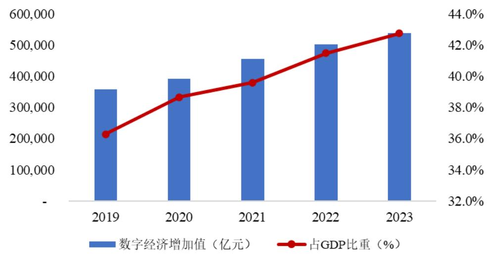

bar_line

| Year | 数字经济增加值 (亿元) | 占GDP比重 (%) |
| --- | --- | --- |
| 2019 | ~360,000 | ~36.2% |
| 2020 | ~395,000 | ~38.7% |
| 2021 | ~455,000 | ~39.6% |
| 2022 | ~500,000 | ~41.5% |
| 2023 | ~540,000 | ~42.8% |

数据来源：中国信息通信研究院

在产业政策的持续推动下,作为数字经济核心的软件产业维持了高景气发展的态势。据工信部数据,2019年至2024年,我国软件产业业务总收入从71,768亿元增长到137,276亿元,年均复合增长率13.85%,历年增速始终高于GDP增速。

2019-2024年我国软件业务收入增长情况  
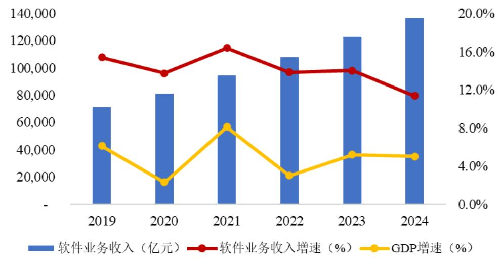

bar_line

| 年份 | 软件业务收入 (亿元) | 软件业务收入增速 (%) | GDP增速 (%) |
| --- | --- | --- | --- |
| 2019 | ~71,000 | ~15.5% | ~6.0% |
| 2020 | ~81,000 | ~13.5% | ~2.5% |
| 2021 | ~95,000 | ~16.5% | ~8.0% |
| 2022 | ~108,000 | ~14.0% | ~3.0% |
| 2023 | ~123,000 | ~14.0% | ~5.5% |
| 2024 | ~137,000 | ~11.5% | ~5.5% |

数据来源：工信部

# （2）人工智能技术迅猛发展，带动软件及下游产业智能化变革提速

以大语言模型为代表的人工智能技术蓬勃发展，特别是以 DeepSeek 为代表的高性能、低训练成本的大语言模型开源，正对软件产业智能化升级产生深远影响。大语言模型凭借其强大的自然语言处理能力和深度学习框架，在精准语义理

解、系统自动化处理、自我反馈优化等多个应用场景具备明显优势。此外，对特定行业领域数据的定向强化学习，能够定制化训练垂直行业大模型，增强在细分领域的应用能力，可以在降低产品开发成本、优化产品预测精度、提升产品自动化处理准确度、拓展产品智能交互功能等多个方面赋能软件开发企业。

与此同时，国家和地方政府部门纷纷推出一系列政策，支持人工智能技术落地产业应用。国家网信办、国家发改委、工信部等国家部门先后出台了《生成式人工智能服务管理暂行办法》《国家人工智能产业综合标准化体系建设指南（2024版）》《关于加快大模型产业高质量发展的指导意见》等政策规划，强调坚持应用牵引，鼓励生成式人工智能技术在各行业、各领域的创新应用；山东省工信厅等地方政府部门亦出台《关于加快大模型产业高质量发展的指导意见》，提出在重点领域和关键环节培育一批覆盖范围广、产品能效高的行业级大模型、场景级大模型。在上述政策的支持下，一方面将加速软件开发企业自身的智能化变革，另一方面也将带动智能应用软件市场需求的扩增，为软件开发企业带来了新的业务增长点。

2021-2025年我国人工智能软件市场规模及预测  
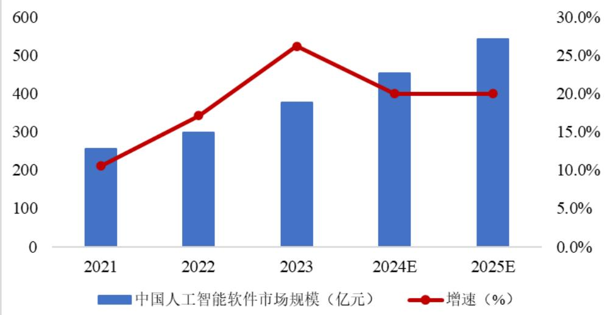

bar_line

| Year | 中国人工智能软件市场规模 (亿元) | 增速 (%) |
| --- | --- | --- |
| 2021 | ~260 | ~10.5% |
| 2022 | ~300 | ~17.0% |
| 2023 | ~380 | ~26.0% |
| 2024E | ~460 | ~20.0% |
| 2025E | ~550 | ~20.0% |

数据来源：观知海内咨询

据观知海内咨询数据，2024年我国人工智能软件市场规模预计为452.90亿元，同比增长20%，我国人工智能软件市场规模呈现持续快速增长的趋势。

# （3）信创替代进入关键期，信创业务发展空间广阔

自 2016 年信创被提出以来，国家大力推进从基础硬件到基础软件再到应用

软件三个层级的国外产品替代。2021年11月，工信部发布《“十四五”软件和信息技术服务业发展规划》强调要壮大信息技术应用创新体系，全面推进重点领域产业化规模化应用，持续培育数字化发展新动能，全面支撑制造强国、网络强国、数字中国建设。2022年1月，国家金融监督管理总局（原中国银行保险监督管理委员会）发布《关于银行业保险业数字化转型的指导意见》，强调坚持关键技术自主可控原则，对业务经营发展有重大影响的关键平台、关键组件以及关键信息基础设施要形成自主研发能力，降低外部依赖、避免单一依赖。2024年5月，工信部发布《工业重点行业领域设备更新和技术改造指南》，推动航空、船舶、石化、钢铁、汽车、装备、轨道交通、电子等重点行业及模具等重点领域企业工业软件全面更新换代。

随着信创逐渐从国产替代试点转向全行业规模化落地，政策推动加快行业需求逐步释放，尤其是央国企的国产替代加速，这一阶段将重点推进 ERP、工业软件等高端应用的国产替代。据观知海内咨询数据，我国 ERP 软件市场规模预计到 2028 年将达到 781.80 亿元，2024-2028 年年复合增速达 10.20%，我国 ERP 软件市场规模保持快速增长，信创替代的市场空间广阔。

2019-2028年我国ERP软件市场规模  
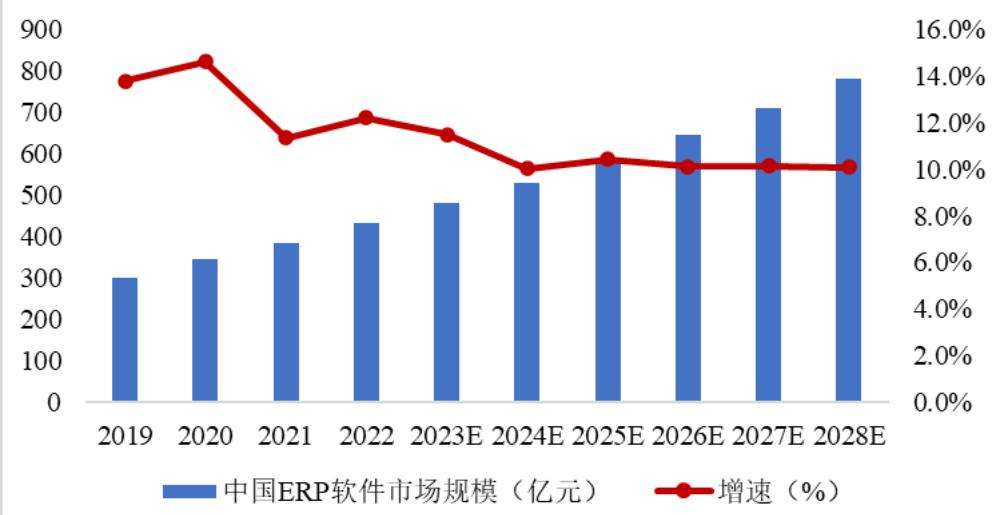

bar_line

| Year | 中国ERP软件市场规模 (亿元) | 增速 (%) |
| --- | --- | --- |
| 2019 | ~300 | ~14.0% |
| 2020 | ~350 | ~15.0% |
| 2021 | ~390 | ~11.5% |
| 2022 | ~435 | ~12.5% |
| 2023E | ~485 | ~11.5% |
| 2024E | ~535 | ~10.0% |
| 2025E | ~585 | ~10.5% |
| 2026E | ~650 | ~10.0% |
| 2027E | ~715 | ~10.0% |
| 2028E | ~785 | ~10.0% |

数据来源：观知海内咨询

# （4）金融行业监管新规催生系统性改造需求，促进金融监管智能化转型

2024-2025 年金融行业监管规则处于密集迭代期，国家金融监督管理总局发布的《银行保险机构操作风险管理办法》《保险资产风险分类暂行办法》分别于 2024 年 7 月、2025 年 7 月施行，前者要求银行、保险行业加强操作风险管理，

有效防范操作风险，并在管理责任、管理流程与方法、操作风险监测指标等方面做了详细规定，后者要求保险公司完善资产风险分类治理结构。同时，国家金融监督管理总局（原中国银行保险监督管理委员会）2022年发布的《关于银行业保险业数字化转型的指导意见》要求银行、保险行业金融机构利用大数据、人工智能等技术优化各类风险管理系统，将数字化风控工具嵌入业务流程，提升风险监测预警智能化水平。

XBRL 作为可扩展商业报告语言，用于标准化财务数据，便于分析和交换。基于 XBRL 技术底座的统一报送工具可自动化生成实例文档，减少人工干预错误，XBRL 结构化数据便于横向（跨企业）和纵向（跨周期）分析，同时集成人工智能技术的风险决策引擎的 XBRL 系统，可自动解析监管政策文本，动态调整数据标签映射规则，提升规则适配速度。

上述一系列监管政策的集中出台，为 XBRL 应用产品软件技术企业在金融机构信息系统技术改造领域开拓了广阔的市场空间。根据艾瑞咨询数据，2024年我国金融机构科技投入规模预计为 4,090.40 亿元，到 2027 年将达到 5,861.20 亿元，2024-2027 年年复合增速达 12.74%，国内金融机构对于金融科技的投入规模持续快速增长，金融监管科技智能化转型加速。

2020-2027年我国金融机构科技投入规模  
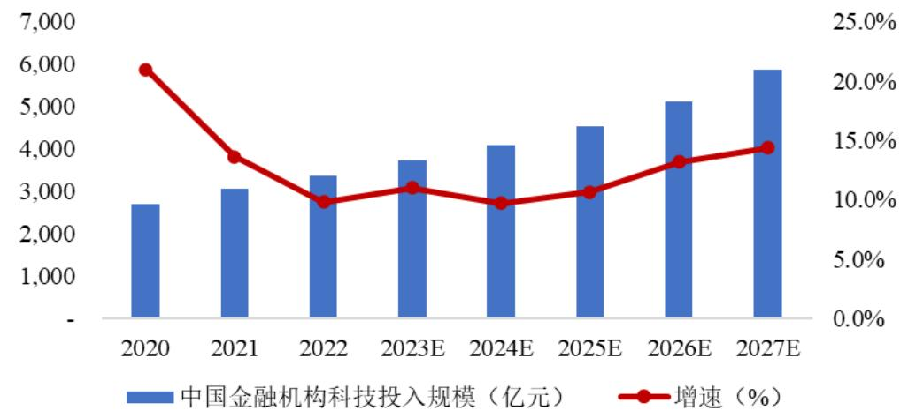

bar_line

| 年份 | 中国金融机构科技投入规模 (亿元) | 增速 (%) |
| :--- | :--- | :--- |
| 2020 | ~2,700 | ~21.0% |
| 2021 | ~3,100 | ~14.0% |
| 2022 | ~3,400 | ~10.0% |
| 2023E | ~3,800 | ~11.0% |
| 2024E | ~4,100 | ~10.0% |
| 2025E | ~4,600 | ~11.0% |
| 2026E | ~5,100 | ~13.5% |
| 2027E | ~5,900 | ~14.5% |

数据来源：艾瑞咨询

# 2、集团企业管理软件行业概况及发展趋势

# （1）中国集团企业管理软件市场概况

集团企业管理软件为企业管理软件（ERP）的细分市场。集团企业结构复杂、

分子公司分布广泛，大部分集团企业高度重视信息化建设，希望借助信息化手段规范管理、支持生产运营和公司发展，因此集团企业的信息化建设一直走在国内企业前列，无论是信息化投资还是应用深度，集团企业对信息化的需求在不断的提高，从最初的部门级应用到集团一体化的解决方案，集团管理软件所应用的领域在不断的深化。主要体现在两方面，一个是通过管理高度集中实现资源统筹协调和高效运作，例如会计集中核算、全面预算管理、资金集中管理、内部结算封闭运行等；另一个是财务和业务管理软件的协同，也包括在财务集中管理下对业务集中管理的推动，例如集中和分级相结合的集团采购管理模式。

集团企业管理软件市场的产品结构与企业级应用软件市场产品结构大致相同，集团企业经营管理信息化投入目前主要集中在以财务管理为核心的 ERP 系统建设和提升、共享服务建设等领域，集团企业的主要应用除了基础的运营管理和财务管理之外，更加重视预算的全面掌控、资金的集中管理和调度、风险的实时监控。随着集团业务的不断发展和壮大，新兴的大数据和人工智能技术的快速发展也给基于大数据和智能化应用带来了巨大的发展潜力。

# （2）中国集团企业管理软件行业特点

①技术迭代速度快，企业面临多种技术路线选择

随着物联网、云计算、大数据以及人工智能等技术发展日益成熟，企业信息化将不再局限于传统领域，在选择系统实施的技术路线时，大型集团企业在上云方式上与中小企业有较大的差异，他们更关注数据的可控性。这就促使集团企业针对不同数据采用不同的云部署形式，从而形成了一个混合云的模式，这也是大型企业在未来较长时间内的典型架构。

②以客户为导向，更注重系统设计的个性化

随着数字化技术领域的持续投资和发展，中国已经逐渐从一个工业化经济体转变为一个数字化经济体，与此同时，市场也正在经历“生产力导向”向“顾客导向”的转变。市场更青睐那些能持续带来增值产品和服务，且能抓住不断变化的客户需求的商家，以客户为中心将成为各个集团企业的核心经营理念。集团管理软件也不例外，一方面，集团统建的管理软件拥有企业全球的内部客户即各业务单元的完整数据，同时可以接触到各业务单元完整的外部客户供应商数据；另

一方面，认知计算、人工智能等技术在管理信息化的充分应用，可以使企业开展更全面、更深入的客户分析，掌握客户偏好。因此，以客户为中心的管理信息系统设计，将可以向客户传递更个性化和独一无二的体验，将使企业在市场中更具竞争力。

③集团 ERP 市场呈现国际主导、国产渗透的竞争格局

在集团 ERP 市场，由于国内厂商起步较晚，技术水平和产品能力与国外厂商仍有一定差距，SAP、Oracle、IBM 等国际厂商仍然占据高端 ERP 市场的主导地位。根据中国信息通信研究院 2023 年发布的《中国 ERP 价值创新研究报告》调研显示，2023 年受访的大型企业中，46.84% 选择国外 ERP 软件，高于选择国内 ERP 软件的 33.54%。

我国大型企业ERP软件应用情况  
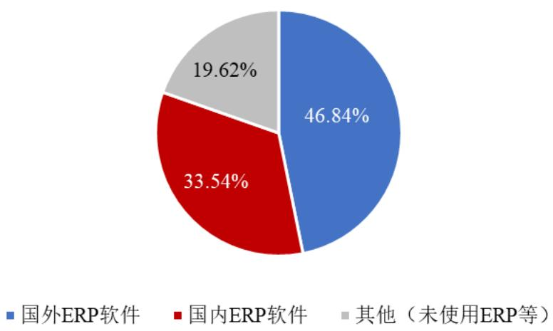

pie

| Category | Percentage |
| --- | --- |
| 国外ERP软件 | 46.84% |
| 国内ERP软件 | 33.54% |
| 其他（未使用ERP等） | 19.62% |

数据来源：中国信息通信研究院

尽管国外 ERP 软件在技术成熟度和功能全面性质上占据一定优势，但随着大多数国内企业从 ERP 初步探索阶段转向深度应用阶段，ERP 系统的重大升级和替换需求普遍存在，同时信创政策推动 ERP 软件自主可控，国内 ERP 系统在快速服务和安全可信方面的优势逐渐凸显，国产渗透率将逐步提升。

# （3）中国集团管理软件技术发展趋势

①安全可信成为集团管理软件的基础要求

信创产业作为落实网络安全与自主可控的核心抓手, 被国家政策持续支持和推动发展。对于集团企业自身而言, 安全可信的管理软件能够保障数据在采集、

传输、存储全流程的安全性，支撑企业战略管控与风险预警，实现跨业务系统的数据驱动决策。安全可信从可选变为必选，既是国家战略的需求，也是企业抵御风险、提升竞争力的必然选择。

②人工智能技术赋能集团管理软件数智化

人工智能技术通过提供图像和语音识别、深层次数据分析和智能决策支持，极大提升了集团管控软件的用户体验。随着以 DeepSeek 为代表的高性能、低训练成本的开源大语言模型在集团企业私有化部署和产业落地应用，未来集团管控软件将更加智能化，能够实时响应企业运营中的复杂需求，成为企业数字化转型的核心驱动力。

③中台将成为集团管理软件新架构

与前台、后台相对应，中台就是在系统中被共用的中间件的集合，其作用就是更好的服务前台，在当今数字化时代已不断发展到数据、业务、人工智能等各个领域，包括技术中台、业务中台、组织中台、数据中台等一系列系统平台。在保障后台应用稳定的前提下，有效整合后台资源，向前台应用提供市场及用户需求变化的快速适应能力，同时又能够将多个前台应用中可重用的公共业务资源沉淀下来，用以提高效能、消除冗余和降低成本。中台将支撑前台多种业务形态的技术和业务的综合能力平台，具备了对于前台业务变化及创新的快速响应能力。前台越来越薄，越来越碎片化，中台积累越来越厚，通过中台的强大能力支撑使轻量化的前台可塑性越强，能够围绕用户及市场需求变化快速做出适应性调整，使企业可以迅速响应瞬息万变的客户市场，真正做到自身能力与用户需求的持续对接。

④SaaS+PaaS 将成为集团管理软件新模式

目前 SaaS 产品已经进入快速发展期，未来各细分领域的需求也会进一步扩大。PaaS 平台对于集团大型管理系统的部署和 SaaS 的持续扩展更加重要。在容器技术的推动下，SaaS+PaaS 将成为集团管理软件的新模式。

# 3、下游应用市场和需求前景

# （1）能源行业信息化概况

公司现有主要客户集中于能源行业，该行业信息化总体水平较高，尤其是中石油、中石化、中国海油等石油石化企业高度重视信息化建设工作，坚持工业化和信息化高度融合，基本完成生产、经营、管理等领域信息化建设工作，集团公司统建的管理信息系统已经覆盖绝大部分核心管理流程，集团管控和业务协同能力大大加强，信息化已经成为中石油、中石化、中国海油等的核心竞争力的重要组成部分。

当前全球经济环境的变化使石油石化企业对数字技术应用的认知大幅提高，越来越多的石油石化企业开始关注人工智能技术应用。例如，埃克森美孚积极拥抱人工智能，利用行业知识和私有数据训练形成了 CustomLLM，并应用于油气和钻井领域；沙特阿美于 2024 年发布了油气行业大语言模型 Aramco Metabrain，用于推荐最理想的油井方案，并为成品油业务提供包括价格趋势、市场动态和地缘政治洞察力在内的精确预测；中国国产大模型 DeepSeek 也助力中国石化等众多国内企业提升智能化水平、加速业务创新。人工智能技术与石油石化行业的结合，促进了传统业务模式的改变，提升了工作的效率，推进了产业的结构化调整，成为石油石化行业企业新的发展动能。

具体而言，石油石化行业企业数字化转型具有以下特征：

一是数字化转型已上升到公司发展战略高度。各大石油公司先后启动顶层设计工作，制定公司数字化发展战略，规划数字化转型路线图，谋划数字化转型的目标、路径及保障措施，明确新技术应用方向和推动计划，逐步推进战略实施。

二是数据资产化管理是转型的前提和基础。各大石油公司均已经采取措施加大数据治理工作力度，建立数据资产化管理体系，制定统一数据标准，搭建集成统一数据管理平台，实现数据资产化、集中化、平台化管理，确保数据的及时性、准确性和完整性，提高数据集成共享能力，充分挖掘数据资产价值，夯实数字化转型基础。

三是跨界合作成为快速提升数字化能力的重要手段。各传统石油公司纷纷牵手互联网、数字技术等高科技公司，借助外部技术优势重塑传统业务，提升公司核心竞争力。

# （2）建筑行业信息化概况

《“十四五”建筑业发展规划》中指出，建筑市场作为我国超大规模市场的重要组成部分，是构建新发展格局的重要阵地，在与新一代信息技术深度融合发展方面有着巨大的潜力和发展空间。推广绿色化、工业化、信息化、集约化、产业化建造方式，推动新一代信息技术与建筑业深度融合，积极培育新产品、新业态、新模式，减少材料和能源消耗，降低建造过程碳排放量，实现更高质量、更有效率、更加公平、更可持续的发展。积极培育企业级平台。发挥龙头企业示范引领作用，以企业资源计划（ERP）平台为基础，建设企业级建筑产业互联网平台，实现企业资源集约调配和智能决策，提升企业运营管理效益。

据国家统计局数据，2023年我国建筑业总产值达到31.6万亿元，但建筑信息化投入在建筑业总产值中的占比仅为0.08%，而欧美发达国家为1%左右，尽管当前建筑企业的数字化应用整体仍处起步阶段，面临诸多挑战，但数字化转型已成为必然趋势。

随着人工智能、大数据、云计算、物联网等新一代信息技术的快速发展与深度应用，将为建筑信息化带来革命性的变革。例如，建筑信息模型技术（BIM）通过整合建筑项目的几何、材料、成本等多维信息，构建三维可视化的智能模型，实现建筑全生命周期的协同管理和优化；智能工地的应用将大幅提升施工现场的安全性和工作效率。在全球推动绿色建筑和可持续发展的大背景下，建筑信息化在节能设计、环保材料选用、能源管理系统等方面发挥着至关重要的作用，有助于实现建筑全生命周期的节能减排目标。建筑信息化低渗透率叠加新科技浪潮驱动产业变革，中国建筑信息化市场前景广阔。

# （3）金融行业信息化概况

金融行业信息化可以分为基础设施信息化、业务信息化和管理信息化三个层次。基础设施信息化包括网络建设、计算机硬件设备和软件系统的建设等，为金融业务的开展提供基础支持；业务信息化包括金融产品的设计、交易处理、风险管理、客户关系管理等，以提高金融机构的业务效率和服务质量；管理信息化包括决策支持、绩效评估、内部控制等，以提高金融机构的管理水平和决策效率。

财务总账系统是金融信息化的中枢，它作为金融机构实现会计核算、账务处理和财务报告的核心平台，通过整合金融机构全部交易数据，支撑从业务发生到

财务结果的全流程闭环管理，是业财融合的关键纽带。自 2019 年金融信创试点启动以来，至今已经进入全面落地的阶段，近两年，头部金融机构纷纷推进总账系统信创改造，中小金融机构也在加速自主创新步伐，国产化财务总账系统迎来了发展的黄金时期。

随着信创政策下金融行业数字化进程推进和以容器化、微服务为代表的云原生技术、以大语言模型为代表的人工智能技术快速发展，国内金融机构对于金融科技的投入规模逐年递增，根据艾瑞咨询数据，未来国内金融科技市场将以约12%的复合增长率于2027年超过5,800亿元。

# （三）行业市场地位和主要竞争对手

# 1、公司在行业中的地位

公司长期专注于大型集团企业管理软件的开发及服务，为中石油、中石化、中国海油、国家管网、中国建筑、中国中铁等大型央企客户提供长期服务，凭借技术优势和高水平服务建立了长期合作关系，业务领域不断拓展，在所从事的业务领域具备较强的持续创新能力和交付能力，积累了丰富的实践经验和典型客户，所研发的软件产品符合大型集团企业需求。公司聚焦战略客户长期服务的发展战略符合大型集团客户信息化建设的特点和需求，与主要战略客户建立了多层次的合作关系，大型集团企业信息化领域享有较高的品牌知名度和行业地位。

公司是国内较早全面研究掌握 XBRL 标准体系及关键技术的软件厂商，也是较早通过 XBRL 软件认证技术委员会认证的成员单位之一。2012 年即作为财政部通用分类标准实施技术支持单位，参与了财政部 XBRL 通用分类标准制订工作。解析引擎首批通过了 XBRL 规范相关的符合性套件的测试，并取得国标《GBT 25500-2010 可扩展商业报告语言（XBRL）技术规范》之基础、维度、公式、版本全部认证。公司的 XBRL 相关系统及产品，已经应用到财政部、中证信息、国家金融监督管理总局、全国股转公司、保险公司、银行等众多客户，其中，偿付能力二代报送系统在全国一半以上的保险公司成功应用，资产负债报送系统和风险监控系统也实现了较大规模推广。

# 2、行业主要竞争对手 $^{1}$

# (1) SAP 公司 (SAP.N)

SAP 是全球最大的企业应用软件提供商之一，也是一家在全球拥有 1.1 亿云用户的云计算公司。SAP 是企业应用软件的市场领导者，帮助各种规模和所有行业的公司发挥最佳作用，全球 77% 的交易收入涉及 SAP 系统。

中国众多大型集团企业，包括中石油、中石化和中国海油，选用了 SAP 公司的 ERP 产品作为管理软件基础应用系统。随着 SAP 系统应用的逐渐深入，企业各项业务的运转已和 SAP 系统密不可分。在石油、石化等大型客户中，公司与 SAP 存在竞争关系；在企业管理软件更广泛的市场，SAP 是国际化竞争厂商之一。

# (2) Oracle 公司（ORCL.N）

Oracle 是全球最大的企业应用软件提供商之一，在全球软件行业占据重要地位，其核心业务涵盖企业应用软件、数据库管理系统、云计算服务等。Oracle 旗下 ERP 产品线覆盖从本地部署到云端、从通用到垂直行业的解决方案，主要包括 Oracle EBS、Oracle Fusion Cloud ERP、Oracle NetSuite 等。

Oracle EBS（Oracle E-Business Suite）是 Oracle 公司推出的一款 ERP 系统产品，旨在帮助企业整合和管理核心业务流程，包括财务管理、供应链管理、人力资源管理等功能模块，其具有成熟稳定、支持深度定制等优点，至今仍在全球许多企业中广泛应用。

# （3）用友网络（600588.SH）

用友网络在 3.0 战略的新时期，形成了以用友云为核心，云服务、软件、金融服务融合发展的新战略布局。用友网络基于移动互联网、云计算、大数据、人工智能、物联网、区块链等新一代企业计算技术，定位社会化商业应用基础设施和企业服务产业共享平台，推动中国数字经济与智慧社会的进步与发展。

在企业管理软件方面，用友网络面向大型企业、中型企业、小微企业皆有专业的解决方案与专业服务业务。面向集团等大型企业的解决方案与专业服务业务

主要是面向大型企业提供 ERP 套件、行业解决方案、技术应用平台和专业咨询服务，帮助企业实现管理转型升级。该业务经营模式是为客户提供软件和专业服务，收入来源包括软件许可、产品支持与运维服务、咨询实施服务、客户化开发等。在除石油石化外的集团企业市场、新兴业务及产品市场，用友网络是竞争厂商之一。

# （4）久其软件（002279.SZ）

久其软件是企业管理软件行业的领先供应商之一，其企业管理软件主要面向国家部委、大中型企业集团在内众多政企优质客户。久其软件的电子政务、集团管控产品与政企大数据解决方案已在财政、交通、司法、民生等行政领域，以及建筑施工、通信、金融投资、旅游商贸等行业领域内得到深入应用。在集团财务管理、集团报表领域，久其软件是主要竞争厂商之一。

# (5) 远光软件 (002063.SZ)

远光软件是国内领先的集团企业管理和社会服务信息化产品及服务供应商，在电力行业企业管理软件领域长期处于领先地位，主营产品与服务包括集团管理、智慧能源、智能物联、社会互联等。远光软件紧随能源互联网规模化发展的浪潮，在强化既有优势业务的基础上，优化了产业布局和产品战略。远光软件研发并发布了多款贴近用户的新产品，推出了一系列智能化的软件产品和解决方案，并实现了在大型集团企业的落地应用。在电力行业管理信息化领域，远光软件是主要竞争厂商之一。

# （6）元年科技（834507.OC，终止挂牌）

元年科技一直专注于以管理会计为核心的管理咨询和管理信息化领域，帮助中国企业实现财务转型和管理精细化。元年科技的客户中，不乏大型多元化企业集团，有中国中铁、国家投资开发公司、中国有色等大型央企，也有海尔、美的、顺丰、国美等领先的民营企业，更有大量快速成长的中小企业，其中大量客户都是细分市场的行业领袖或隐形冠军。诺亚舟咨询、云快报、元年C1软件等，均是元年科技旗下的管理会计专业咨询服务和软件产品的品牌。元年科技是公司在财务共享领域的竞争厂商之一。

# (7) 长亮科技 (300348.SZ)

长亮科技是国内领先的金融 IT 解决方案提供商之一，服务于以银行为主的金融行业客户，凭借自主研发的核心技术和产品，围绕客户的核心业务系统、信贷业务系统、信用卡业务系统、业务中台系统等关键业务系统领域，向客户提供关键业务系统建设相关的全生命周期的 IT 解决方案与服务，包括数字金融业务解决方案、大数据应用系统解决方案及全面价值管理解决方案等信息化服务。与邮储银行、中国银行、交通银行、招商银行、平安银行、宁波银行、菲律宾 CIMB 银行、泰国 SCB 银行、马来西亚 SCC 银行等国内外知名金融机构建立了稳定的业务合作关系。

# （四）行业壁垒

# 1、技术壁垒

集团企业对财务、资金的集中管控模式，决定了作为核心系统的财务资金等管理软件必须具有高度的统一性，该类核心软件系统基本上由集团总部统一选型、实施、建设，投资巨大，随着系统的使用，用户的操作习惯及对系统数据信息的依赖度会越来越高。为大型集团企业提供的财务管理系统主要采用集中部署模式，并已经实现与相关业务系统高度集成，建成后具有独占性，更换周期长、风险高、难度大，客户一般采取持续提升策略，因此形成了较高的技术壁垒。

# 2、品牌壁垒

集团企业客户对产品质量要求较高,往往对具有较高行业知名度且经营履历良好的品牌具有较高的认知度,而在市场中要建立被广泛认可的知名品牌,需要多年的行业应用实践和市场推广,短期内较难实现。因此,行业的品牌壁垒使新进企业难以快速跨越。

# 3、专业化壁垒

集团企业要求软件开发企业能够快速响应的市场需求, 对下游厂商客户所处行业有深入的了解, 具备同步开发的能力, 能为客户提供专业化服务和系统化解决方案, 能根据客户的要求完成个性化定制, 满足各类不同客户的特定需求。

# 4、人才壁垒

集团企业管理软件开发需要具备经验丰富的研发人才，使其对开发需求以及

行业特征等深入了解，从而能为客户提供系统解决方案和技术服务。企业需要建立、维护具有较高水准的研发团队，保持充足的人才储备和技术研发储备，才能使其充分应对行业日新月异的技术迭代所带来的挑战。

# （五）公司所处行业与上、下游行业的关系

公司的上游企业为生产基础软件产品、计算机硬件产品的企业，竞争充分、供给充足，不存在供应瓶颈。上游行业的技术更新和产品升级促进了本行业的产品升级和应用范围的扩大，对本行业发展总体比较有利。

公司的下游主要为能源、建筑、金融等行业，下游行业与公司所属行业存在高度的相关性：在能源行业，石油石化企业高度重视数字技术应用，将数字化转型提升至战略高度；在建筑行业，建筑数字化将赋能建筑全生命周期的协同管理和优化；在金融行业，信创政策下金融机构数字化改造逐步向总账系统推进，同时以大模型为代表的人工智能技术快速发展，推动金融监管数智化转型加速。下游市场数字化转型发展趋势对公司所处软件产业具有明显带动作用。

# 七、发行人主营业务的具体情况

# （一）主营业务基本情况

公司主营业务是为大型集团企业提供信息化方案及 IT 综合服务，经过二十余年的沉淀与积累，通过持续的管理创新与新技术研究应用，形成了突出的信息化综合服务能力，主营业务涵盖解决方案、咨询与服务、应用软件产品、平台软件产品、软件定制开发等多个方面。顺应国家信创替代战略持续推进和以大语言模型为代表人工智能技术蓬勃发展的行业趋势，公司持续进行研发创新，实现公司解决方案和产品的扩展和提升，在深耕石油石化、建筑地产等传统优势领域的同时，实现向金融等其他行业领域拓展。

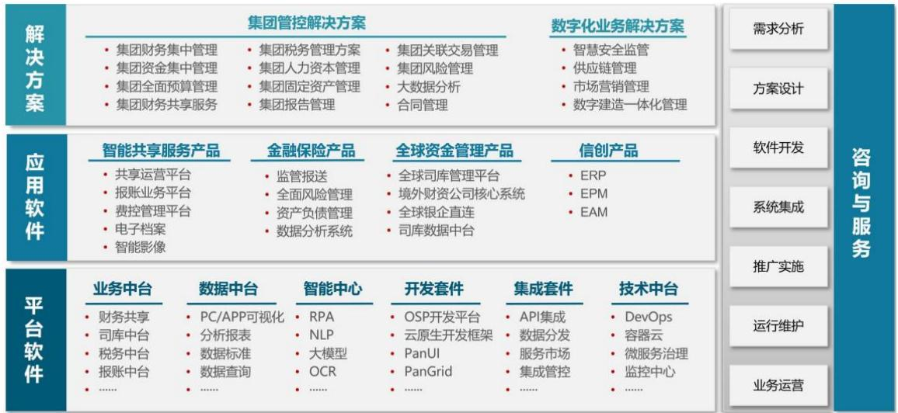

other

| Category | Solutions | Details |
| :--- | :--- | :--- |
| 解决方案 | 集团管控解决方案 | • 集团财务集中管理 • 集团资金集中管理 • 集团全面预算管理 • 集团财务共享服务 |
| 解决方案 | 集团管控解决方案 | • 集团税务管理方案 • 集团人力资本管理 • 集团固定资产管理 • 集团报告管理 |
| 解决方案 | 集团管控解决方案 | • 集团关联交易管理 • 集团风险管理 • 大数据分析 • 合同管理 |
| 解决方案 | 数字化业务解决方案 | • 智慧安全监管 • 供应链管理 • 市场营销管理 • 数字建造一体化管理 |
| 应用软件 | 智能共享服务产品 | • 共享运营平台 • 报账业务平台 • 费控管理平台 • 电子档案 • 智能影像 |
| 应用软件 | 金融保险产品 | • 监管报送 • 全面风险管理 • 资产负债管理 • 数据分析系统 |
| 应用软件 | 全球资金管理产品 | • 全球司库管理平台 • 境外财资公司核心系统 • 全球银企直连 • 司库数据中台 |
| 应用软件 | 信创产品 | • ERP • EPM • EAM |
| 平台软件 | 业务中台 | • 财务共享 • 司库中台 • 税务中台 • 报账中台 • ...... |
| 平台软件 | 数据中台 | • PC/APP可视化 • 分析报表 • 数据标准 • 数据查询 • ...... |
| 平台软件 | 智能中心 | • RPA • NLP • 大模型 • OCR • ...... |
| 平台软件 | 开发套件 | • OSP开发平台 • 云原生开发框架 • PanUI • PanGrid • ...... |
| 平台软件 | 集成套件 | • API集成 • 数据分发 • 服务市场 • 集成管控 • ...... |
| 平台软件 | 技术中台 | • DevOps • 容器云 • 微服务治理 • 监控中心 • ...... |

# （二）主要产品基本情况

# 1、集团管控解决方案

面向集团管控的产品与方案, 是公司针对大型集团企业规模庞大、产业链长、组织层级深、业务逻辑与处理流程复杂、组织变革频繁、管理创新需求旺盛等特点，充分融合集团企业信息化建设的实践经验，经过技术不断创新，自主研发并持续迭代完善形成的集团级信息系统解决方案。该方案为集团企业实现业务流程的持续优化、业务的持续拓展、管理的持续创新提供系统支撑，为企业集中管控、资源调配、统筹运作及分析决策能力的不断提升提供技术保障。

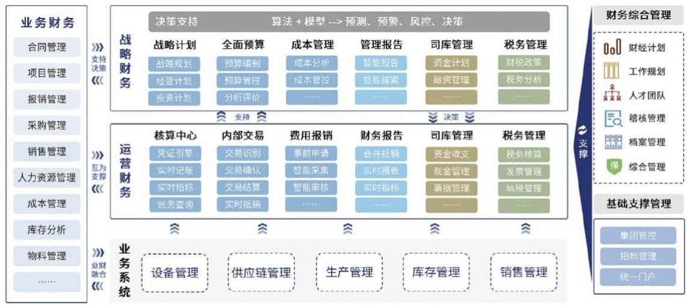

flowchart

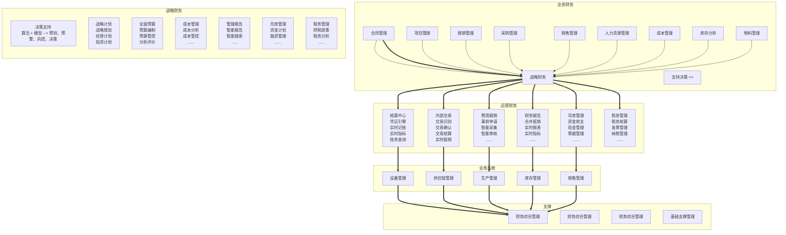
```mermaid
graph TD
  subgraph Business_Finance ["业务财务"]
    direction TB
  A["合同管理"] --> B["战略财务"]
  C["项目管理"] --> B
  D["报销管理"] --> B
  E["采购管理"] --> B
  F["销售管理"] --> B
  G["人力资源管理"] --> B
  H["成本管理"] --> B
  I["库存分析"] --> B
  J["物料管理"] --> B
    K["支持决策 <<"]
  end

  subgraph Strategy_Finance ["战略财务"]
    direction TB
  L["决策支持\n算法 + 模型 --> 预测、预警、风控、决策"]
    M1["战略计划\n战略规划\n经营计划\n投资计划"]
    M2["全面预算\n预算编制\n预算管控\n分析评价"]
    M3["成本管理\n成本分析\n成本管控\n......"]
    M4["管理报告\n智能报告\n智能搜索\n......"]
    M5["司库管理\n资金计划\n融资管理\n......"]
    M6["税务管理\n财税政策\n税务分析\n......"]
  end

  subgraph Operation_Finance ["运营财务"]
    direction TB
    N1["核算中心\n凭证引擎\n实时记账\n实时指标\n账务查询"]
    N2["内部交易\n交易识别\n交易确认\n交易结算\n实时抵销"]
    N3["费用报销\n事前申请\n智能采集\n智能审核\n......"]
    N4["财务报告\n合并抵销\n实时报表\n实时指标\n......"]
    N5["司库管理\n资金收支\n现金管理\n票据管理\n......"]
    N6["税务管理\n税务核算\n发票管理\n纳税管理\n......"]
  end

  subgraph Business_System ["业务系统"]
    direction TB
    O1["设备管理"]
    O2["供应链管理"]
    O3["生产管理"]
    O4["库存管理"]
    O5["销售管理"]
  end

  subgraph Support ["支撑"]
    R1["财务综合管理"]
    R2["财务综合管理"]
    R3["财务综合管理"]
    R4["基础支撑管理"]
  end

  A ==> B
  B ==> N1
  B ==> N2
  B ==> N3
  B ==> N4
  B ==> N5
  B ==> N6
  
  N1 ==> O1
  N2 ==> O2
  N3 ==> O3
  N4 ==> O4
  N5 ==> O5
  
  O1 ==> R1
  O2 ==> R1
  O3 ==> R1
  O4 ==> R1
  O5 ==> R1
```

公司集团管控解决方案主要产品具体情况如下：

<table><tr><td>序号</td><td>类别</td><td>产品/方案名称</td><td>主要功能</td></tr><tr><td>1</td><td>集团财务</td><td>集团财务集中管理</td><td>包括核算标准体系管理、组织架构管理、会计集中核算、内部交易抵销、合并报表等功能模块,全面满足集团企业核算、披露、分析、考核等全过程的管理会计需求。</td></tr><tr><td rowspan="4"></td><td rowspan="4"></td><td>集团报告管理</td><td>以多维指标体系为统一的数据底座,满足财务报告、管理报告同时出具的一体化实时报告管理平台,核心功能包括数据集成、数据管理、指标管理、合并抵消、报表管理、报告管理、智能搜索、监管报送等。</td></tr><tr><td>集团全面预算管理</td><td>承接战略目标,构建涵盖预算编制、预算控制、预算分析、对标评价的全面预算管理解决方案,帮助集团企业实现“横向到边、纵向到底”的集团预算管理,强化集团企业的战略执行能力,提升集团企业的分析和决策支持能力。</td></tr><tr><td>集团税务管理方案</td><td>包括税务管理信息库、税基管理、发票管理、税金管理、纳税申报、风险防控、智能分析等功能模块。</td></tr><tr><td>集团固定资产管理</td><td>包括资产主数据、资产转资、资产清查、资产调拨,资产租赁、资产维修、资产报废处置等模块,实现各类资产从购置、转资、折旧、维修、盘点、报废、处置的全流程、全生命周期管理,满足集团企业资产精细化管理要求,助力企业解决资产核算、实物管理方面的问题。</td></tr><tr><td>2</td><td>集团司库</td><td>集团司库管理</td><td>以强化集团资金管控、规避防范资金风险、发挥集团整体运作优势为目标,涵盖账户管理、资金计划管理、结算管理、资金池管理、债权债务管理、投资理财管理、票证管理、筹融资管理、外汇管理、风险管理、考核评价、境内外银财企直联、决策支持分析等模块。</td></tr><tr><td rowspan="2">3</td><td rowspan="2">业财融合</td><td>集团财务共享服务</td><td>基于业财一体化模式下的智能财务共享平台,前端承接业务系统数据,后端对接财务支撑系统,包括共享报账平台、共享运营平台、智能稽核平台、会计引擎平台、电子影像平台、电子档案平台、业务集成平台等。</td></tr><tr><td>集团人力资源管理</td><td>基于集团化管理架构设计,支持多地区保险法规预置,支持集团化公司薪酬多样性、组织架构层次化、人员类型复杂等管理需求,为集团企业提供人力资本管理、面向过程的绩效管理以及人力资源共享服务解决方案。</td></tr></table>

# 2、数字生产应用产品及方案

公司数字生产应用产品及方案包括设备管理（EAM）、智能安全管理等，智能优化设备调度与维护、实现对安全风险记录、跟踪、统计、分析、上报等全过程的信息化管理，赋能制造业数字化转型。

公司数字生产主要产品及方案具体情况如下:

<table><tr><td>序号</td><td>数字生产主要产品</td><td>主要功能</td></tr><tr><td>1</td><td>设备管理</td><td>以设备为核心,基于设备全生命周期管理理念,实现从购置登记、运行、维护、报废等设备全生命周期管理,以信息技术为支撑,通过集成物联网、大数据、人工智能等先进技术,构建感知诊断中心、设备可视中心、决策分析中心,推进企业设备运维智能化管理,提高设备运营效率和管理水平,实现最大化设备资产价值。</td></tr><tr><td>2</td><td>智能安全管理</td><td>面向矿山、建筑等行业实现设备的实时监控、生产流程系统的优化调度以及安全状况的动态预警。支持数据分析与决策支持功能,助力企业实现可持续发展目标。</td></tr></table>

# 3、XBRL 应用产品及方案

XBRL 是可扩展的商业报告语言，是数据的 “二维码”，计算机系统可以通过识别 “二维码” 获取存储的数据信息，包括组织机构、会计期间、数据类型、数据维度等，实现不依赖于报表格式快速、准确、可靠地处理商业报告数据，报表报告由人类可阅读延伸到计算机系统可阅读，提高信息处理的数字化、自动化、网络化水平，XBRL 已广泛应用于监管机构和金融行业。

公司拥有 XBRL 核心处理引擎和 XBRL 工具软件、报表报告、风险管理、数据分析等系列产品，XBRL 核心处理引擎已经通过认证，符合国家和国际标准。

<table><tr><td>序号</td><td>XBRL 应用产品</td><td>典型用户</td></tr><tr><td>1</td><td>XBRL 工具软件</td><td>财政部、国家金融监督管理总局、中证信息、全国股转公司</td></tr><tr><td>2</td><td>XBRL 报表报告系统</td><td>中国平安财险、中国人寿、太平洋保险等众多保险公司</td></tr><tr><td>3</td><td>XBRL 风险管理系统</td><td>中国人寿、华夏人寿、长安责任、平安养老、中德安联</td></tr><tr><td>4</td><td>XBRL 数据分析系统</td><td>中国石油、中国建筑、浦发银行、万达院线</td></tr></table>

注：XBRL 工具软件、报表报告系统、风险管理系统、数据分析系统均为独立的软件产品，可以独立销售、独立应用，也可以通过和客户已有系统集成提高自动化、集成化程度。

# (1) XBRL 工具软件

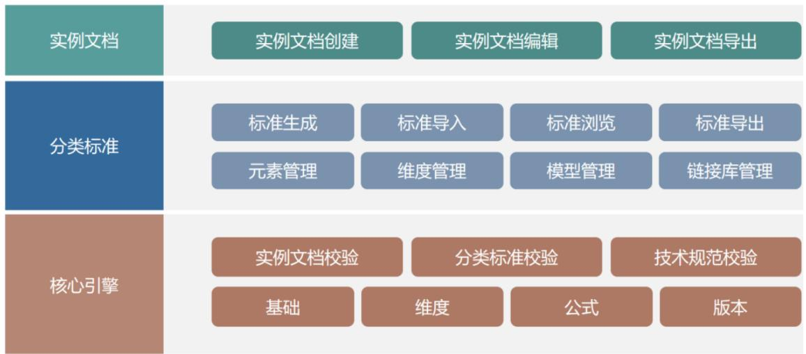

flowchart

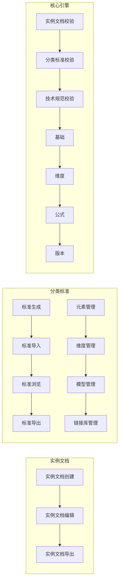
```mermaid
graph LR
  subgraph TopLevel["实例文档"]
  A1["实例文档创建"] --> B1["实例文档编辑"]
  B1 --> C1["实例文档导出"]
  end

  subgraph MiddleLevel["分类标准"]
  D1["标准生成"] --> E1["标准导入"]
  E1 --> F1["标准浏览"]
  F1 --> G1["标准导出"]
  H1["元素管理"] --> I1["维度管理"]
  I1 --> J1["模型管理"]
  J1 --> K1["链接库管理"]
  end

  subgraph BottomLevel["核心引擎"]
  L1["实例文档校验"] --> M1["分类标准校验"]
  M1 --> N1["技术规范校验"]
  N1 --> O1["基础"]
  O1 --> P1["维度"]
  P1 --> Q1["公式"]
  Q1 --> R1["版本"]
  end
```

XBRL 工具软件内置了 XBRL 国内和国际技术规范, 应用该软件可制定符合规范的 XBRL 分类标准, 例如国家金融监督管理总局（原中国银行保险监督管理委员会）使用该工具软件制订保险行业偿二代监管分类标准。该软件主要包括 XBRL 核心引擎、分类标准、实例文档等功能模块。

XBRL 工具软件具有以下特点：①主要适用于监管机构及行业数据标准制定，电子化商业报告的生成与校验。②提供数据标准在线制定、商业报告在线编辑、报告信息在线校验等功能，满足监管机构、交易所、大型企业实现电子化商业报告的自动收集与校验需求。③支持主流分类标准，包括国际报告分类标准（IFRS）、中国财政部会计准则通用分类标准（CAS）、美国会计准则分类标准（USGAAP），新三板信息披露分类标准、基金行业分类标准、偿二代监管分类标准等。

(2) XBRL 报表报告系统  
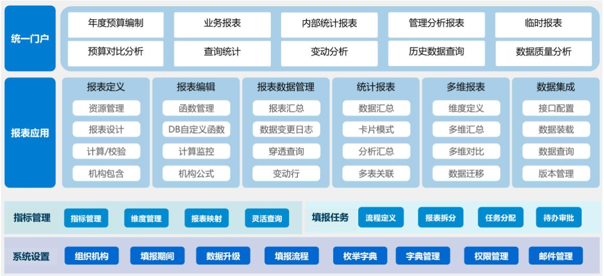

flowchart

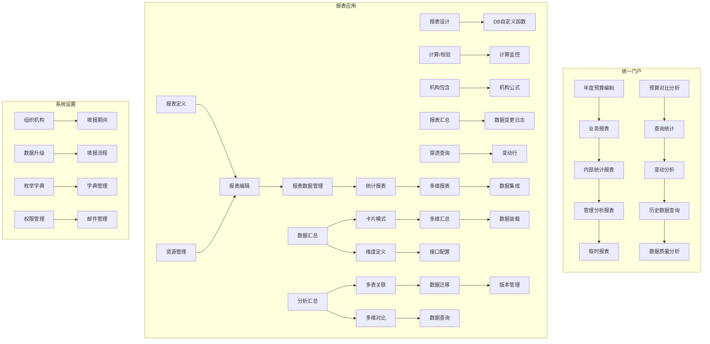
```mermaid
graph TD
  subgraph GeneralClients["统一门户"]
    direction TB
  A["年度预算编制"] --> B["业务报表"]
  C["预算对比分析"] --> D["查询统计"]
  B --> E["内部统计报表"]
  D --> F["变动分析"]
  E --> G["管理分析报表"]
  F --> H["历史数据查询"]
  G --> I["临时报表"]
  H --> J["数据质量分析"]
  end

  subgraph ReportApplications["报表应用"]
  K["报表定义"] --> L["报表编辑"]
  M["资源管理"] --> L
  N["报表设计"] --> O["DB自定义函数"]
  P["计算/校验"] --> Q["计算监控"]
  R["机构包含"] --> S["机构公式"]
  L --> T["报表数据管理"]
  U["报表汇总"] --> V["数据变更日志"]
  W["穿透查询"] --> X["变动行"]
  T --> Y["统计报表"]
  Z["数据汇总"] --> AA["卡片模式"]
  AB["分析汇总"] --> AC["多表关联"]
  Y --> AD["多维报表"]
  Z --> AE["维度定义"]
  AA --> AF["多维汇总"]
  AB --> AG["多维对比"]
  AC --> AH["数据迁移"]
  AD --> AI["数据集成"]
  AE --> AJ["接口配置"]
  AF --> AK["数据装载"]
  AG --> AL["数据查询"]
  AH --> AM["版本管理"]
  end

  subgraph SystemSettings["系统设置"]
  B1["组织机构"] --> B2["填报期间"]
  B3["数据升级"] --> B4["填报流程"]
  B5["枚举字典"] --> B6["字典管理"]
  B7["权限管理"] --> B8["邮件管理"]
  end
```

XBRL 报表报告系统主要包括报表定义、报表编辑、报表数据管理、统计报表、多维报表、数据集成等功能，该系统区别于传统报表系统之处在于将采集或自动读取的数据存储为符合 XBRL 技术规范的数据，报表数据的存储不再依赖报表格式，可以直接导出符合监管要求的 XBRL 报告。

XBRL 报表报告系统具有以下特点: ①实现采集-审批-校验-报送闭环的全流程报表管理, 采集方面支持在线协同填报, 审批方面支持自定义设置审批流、多维度跟踪和催办, 校验方面支持预警值和限额值设置并依托系统开展监测管理, 报送方面支持选择不同期次和准则一键输出符合披露要求的报送文件。②支持表

内数据公式校验，检查数据准确性、合理性；支持对数据变更留痕，方便跟踪数据变动；支持对报表数据的可视化分析，以图表方式进行直观展示。

(3) XBRL 风险管理系统  
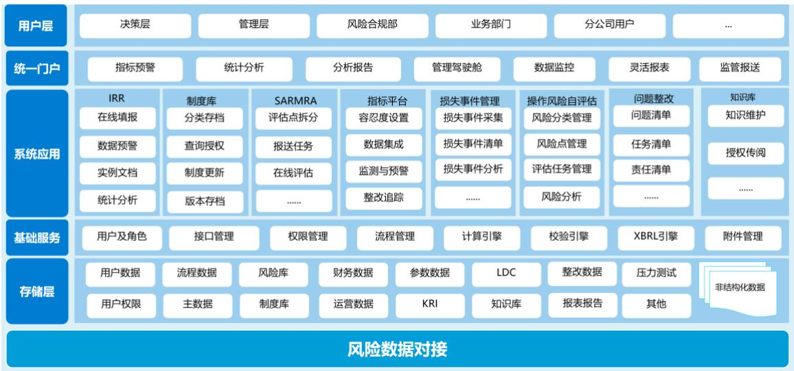

flowchart

```mermaid
graph LR
  subgraph UserLayer ["用户层"]
  A["决策层"] --> B["管理层"]
  B --> C["风险合规部"]
  C --> D["业务部门"]
  D --> E["分公司用户"]
  E --> F["..."]
  end

  subgraph SystemLayer ["统一门户"]
  G["指标预警"] --> H["统计分析"]
  H --> I["分析报告"]
  I --> J["管理驾驶舱"]
  J --> K["数据监控"]
  K --> L["灵活报表"]
  L --> M["监管报送"]
  end

  subgraph ApplicationLayer ["系统应用"]
  N["IRR\n在线填报"] --> O["制度库\n分类存档"]
  O --> P["SARMRA\n评估点拆分"]
  P --> Q["指标平台\n容忍度设置"]
  Q --> R["损失事件管理\n损失事件采集"]
  R --> S["操作风险自评估\n风险分类管理"]
  S --> T["问题整改\n问题清单"]
  T --> U["知识库\n知识维护"]
    
  V["数据预警"] --> W["查询授权"]
  W --> X["报送任务"]
  X --> Y["数据集成"]
  Y --> Z["损失事件清单"]
  Z --> AA["风险点管理"]
  AA --> AB["任务清单"]
  AB --> AC["授权传阅"]
    
  AD["实例文档"] --> AE["制度更新"]
  AE --> AF["在线评估"]
  AF --> AG["监测与预警"]
  AG --> AH["损失事件分析"]
  AH --> AI["评估任务管理"]
  AI --> AJ["责任清单"]
    
  AK["统计分析"] --> AL["版本存档"]
  AL --> AM["......"]
  AM --> AN["整改追踪"]
  AN --> AO["......"]
    
  AP["基础服务"] --> AQ["用户及角色"]
  AQ --> AR["接口管理"]
  AR --> AS["权限管理"]
  AS --> AT["流程管理"]
  AT --> AU["计算引擎"]
  AU --> AV["校验引擎"]
  AV --> AW["XBRL引擎"]
  AW --> AX["附件管理"]
  end

  subgraph ServiceLayer ["存储层"]
  BA["用户数据"] --> BA1["流程数据"]
  BA1 --> BA2["风险库"]
  BA2 --> BA3["财务数据"]
  BA3 --> BA4["参数数据"]
  BA4 --> BA5["LDC"]
  BA5 --> BA6["整改数据"]
  BA6 --> BA7["压力测试"]
    
    BA1 -.-> BB["非结构化数据"]
    
    BA2 -.-> BB
    BA3 -.-> BB
    BA4 -.-> BB
    BA5 -.-> BB
    BA6 -.-> BB
    BA7 -.-> BB
    BA8 -.-> BB
  end

  subgraph RiskData["RiskData对接 [\"风险数据对接\"]"]

  B1["用户权限"] --> B2["主数据"]
  B2 --> B3["制度库"]
  B3 --> B4["运营数据"]
  B4 --> B5["KRI"]
  B5 --> B6["知识库"]
  B6 --> B7["报表报告"]
  B7 --> B8["其他"]
```

XBRL 风险管理系统主要包括风险综合评级、指标平台、偿付能力风险管理要求与评估（SARMRA）、损失事件管理、问题整改、操作风险自评估等功能，该系统是基于国家金融监督管理总局对保险公司风险监管的要求而研发，依托于保险行业制定的系列 XBRL 分类标准，包括偿二代分类标准、风险综合评级分类标准、资产负债分类标准、能力评估分类标准，使用 XBRL 技术规范存储各指标数据。

XBRL 风险管理系统具有以下特点：①主要应用于保险行业风险管理领域，实现风险指标监控、损失事件管理、操作风险自评估、SARMRA、问题与整改等业务高效协同，形成企业闭环式风险管理监测体系，从而实现全面风险管理。②支持填报数据汇总和一键生成报告，支持对风险指标定制展示和详情查询。

(4) XBRL 数据分析系统

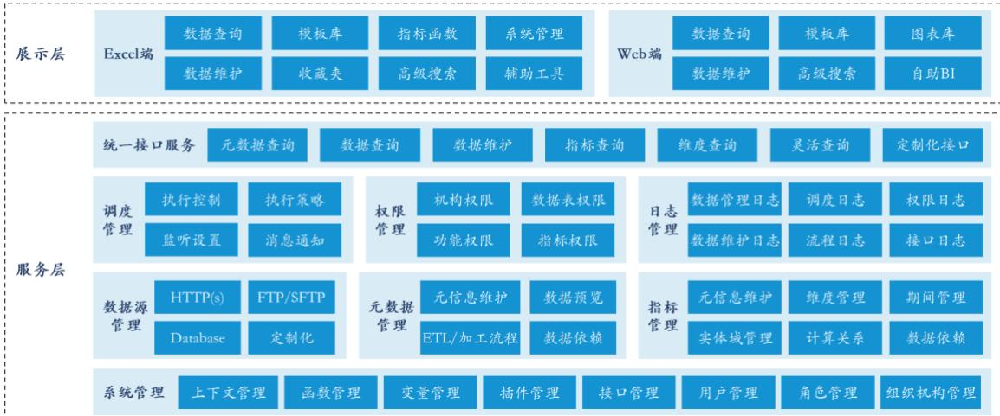

XBRL 数据分析系统主要包括数据源管理、元数据管理、指标管理、调度管理、数据服务等功能模块，通过浏览器 Web 端和 Excel 端展示应用数据，支持第三方分析工具。该系统基于 XBRL 数据格式规范进行分析，充分利用 XBRL 数据颗粒化、标准化、计算机可读的特点进行数据灵活分析应用。

XBRL 数据分析系统具有以下特点：①支持流程化的数据集成，通过集成工具汇集各业务系统原始数据，以数据流的方式进行数据加工，形成数据模型。②采用数据标签的方式建立数据目录，实现对主数据、交易数据、汇总数据、指标数据的统一管理，通过数据目录对外提供标准的数据服务。③支持多种数据应用场景，包括统计报表、分析报告、数据大屏、数据看板、移动应用等。

# （三）主要经营模式

# 1、盈利模式

公司业务主要包括三大类：（1）为客户提供定制软件；（2）为客户提供年度运维及技术支持等服务；（3）向客户提供产品化软件及售后技术服务。

# （1）定制软件业务模式

定制软件主要是根据项目合同约定，依据客户个性化需求而自主研究开发的软件。定制软件项目类型主要包括客户新建系统的开发、已有系统的扩展开发两类。定制软件按项目交付过程主要分为需求分析、方案设计、代码编制、系统测试、系统上线试运行、项目验收等环节。对于部分大型集团类客户项目，软件开发完成并取得试点成功后，会进行分批次的集团下属企业推广实施。

# （2）技术服务业务模式

技术服务业务，主要包括已有系统的年度运维、技术支持等服务。技术服务的提供主要包括现场实施、驻场运维、远程维护、热线支持等形式。随着公司客户群体的不断扩大，更多的客户系统需要长期运维和技术支持，公司技术服务业务收入规模会随之稳定增长。

# （3）产品化软件业务模式

产品化软件业务，主要是向客户销售公司拥有著作权的软件产品，并提供安装部署及售后服务。

# 2、采购模式

公司业务开展过程中存在对外采购的情形, 主要包括为软硬件和外协服务采购。其中, 硬件采购主要是计算机及相关部件; 软件采购主要为操作系统、数据库、中间件等第三方通用软件; 公司采购的服务主要包括外协服务。公司的各项采购均严格按照相关采购制度执行, 采购流程图如下:

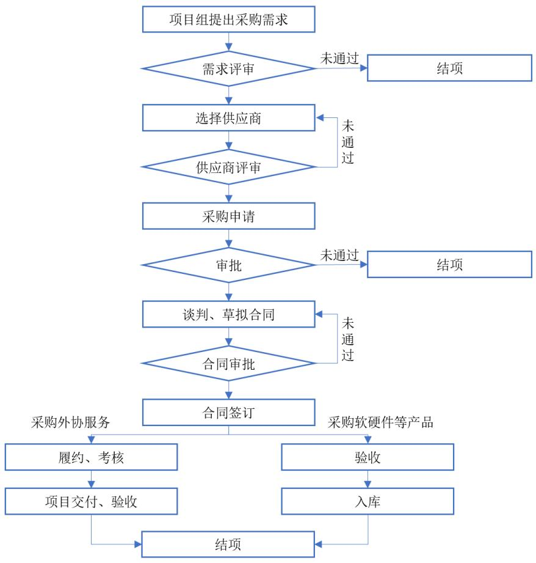

flowchart

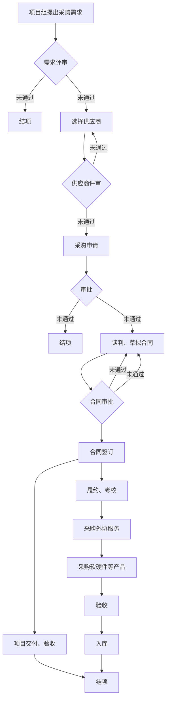
```mermaid
graph TD
  A["项目组提出采购需求"] --> B{"需求评审"}
  B -->|未通过| C["结项"]
  B -->|未通过| D["选择供应商"]
  D --> E{"供应商评审"}
  E -->|未通过| D
  E -->|未通过| F["采购申请"]
  F --> G{"审批"}
  G -->|未通过| H["结项"]
  G -->|未通过| I["谈判、草拟合同"]
  I --> J{"合同审批"}
  J -->|未通过| I
  J -->|未通过| I
  J --> K["合同签订"]
  K --> L["履约、考核"]
  K --> M["项目交付、验收"]
  L --> N["采购外协服务"]
  M --> O["结项"]
  N --> P["采购软硬件等产品"]
  P --> Q["验收"]
  Q --> R["入库"]
  R --> O
```

# 3、销售及管理模式

公司的主要客户是大型集团企业，其信息化项目方案复杂度高，前期规划、筹备周期长，公司主要采用成熟稳定的“工程师顾问式”直接销售模式取得合同。对于新开拓客户或老客户的新建项目，发挥公司在大集团企业管理信息化领域经验丰富、行业特点熟悉的优势，在获取项目信息后，组织经验丰富的顾问团队，根据客户确定的采购方式和沟通渠道，与客户充分沟通、交流，展示方案能力和实施能力，赢得客户信任，并一般通过投标方式取得销售合同；对于客户已经和公司建立战略合作关系，并且项目属于公司以前承建项目的提升改造项目、配套项目或关联性项目，公司组织原项目团队骨干，积极参与项目前期方案设计，充分与客户沟通交流，提交可行的建议方案，一般通过单一来源谈判或议标方式取得销售合同。

公司主要通过直销模式为客户提供方案、产品等，一般通过议标或投标方式取得销售合同。在市场业务组织上，公司采用事业部为主体、区域本地化服务机构协同的运营管理模式。公司设有多个行业及专业领域事业部，并在多地设有区域机构。该运营管理模式，适合公司目前以项目交付为主要特征的业务需求，具有较高的运行效率。

直销模式的销售流程图如下:

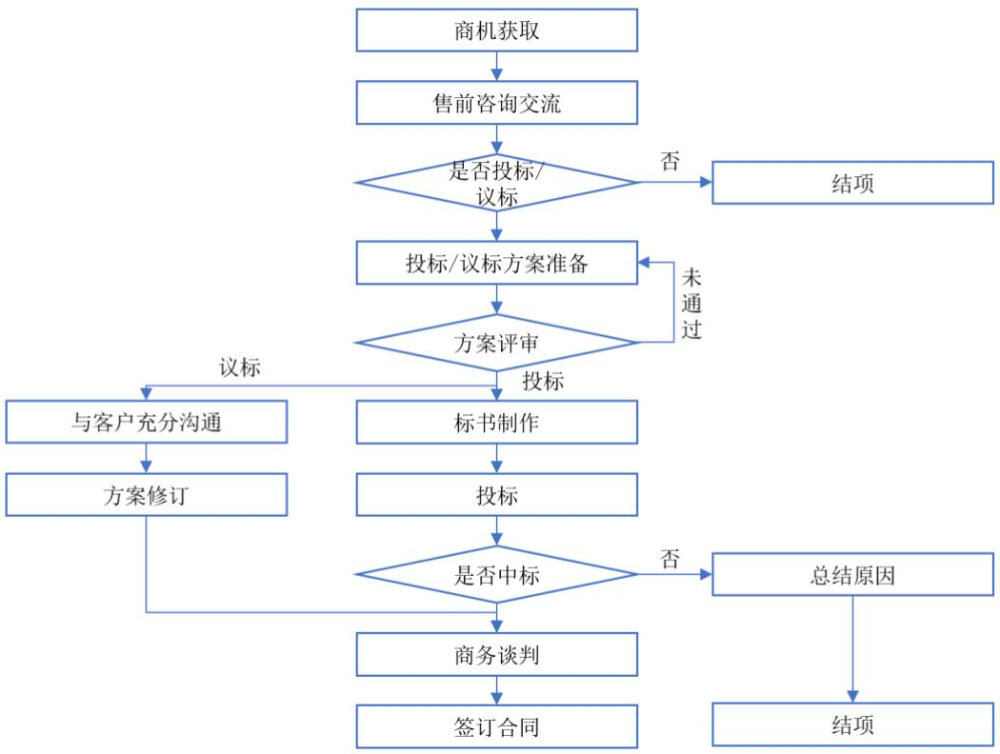

flowchart

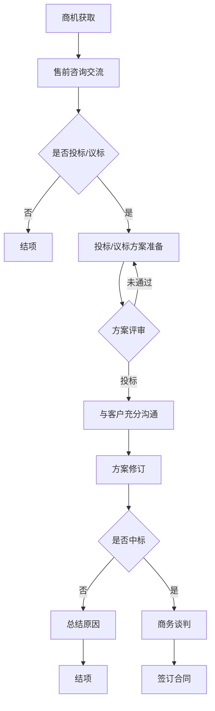
```mermaid
graph TD
  A["商机获取"] --> B["售前咨询交流"]
  B --> C{"是否投标/议标"}
  C -->|否| D["结项"]
  C -->|是| E["投标/议标方案准备"]
  E --> F{"方案评审"}
  F -->|未通过| E
  F -->|投标| G["与客户充分沟通"]
  G --> H["方案修订"]
  H --> I{"是否中标"}
  I -->|否| J["总结原因"]
  I -->|是| K["商务谈判"]
  K --> L["签订合同"]
  J --> M["结项"]
```

# 4、研发模式

公司建立了“平台研发+产品研发+项目研发”三位一体的研发模式和完善的研发流程管理制度，通过技术平台的持续创新和迭代保证基线交付质量，通过持续满足客户需求研发领先产品，通过专职团队提高开发服务的效率和质量。公司的研发流程如下：

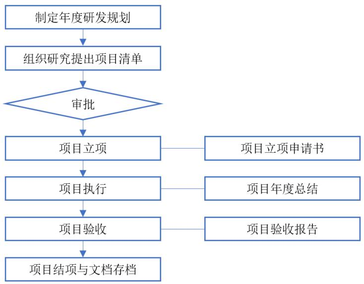

flowchart

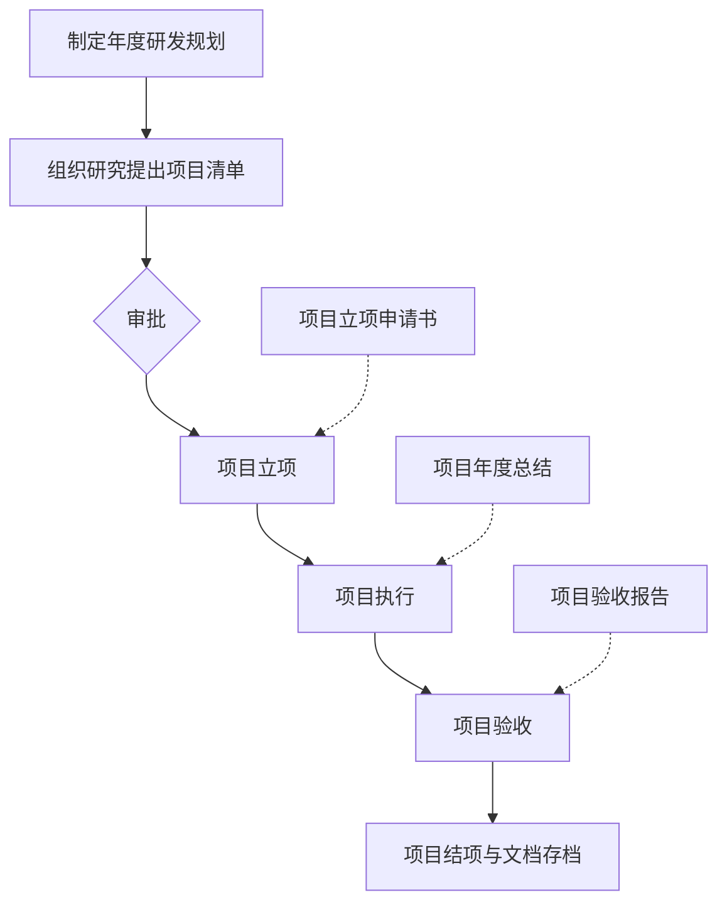
```mermaid
graph TD
  A["制定年度研发规划"] --> B["组织研究提出项目清单"]
  B --> C{"审批"}
  C --> D["项目立项"]
  D --> E["项目执行"]
  E --> F["项目验收"]
  G["项目立项申请书"] -.-> D
  H["项目年度总结"] -.-> E
  I["项目验收报告"] -.-> F
  F --> J["项目结项与文档存档"]
```

# （四）主要产品和销售情况

# 1、按业务类型分类

公司主营业务是为大型集团企业提供管理信息化方案及IT综合服务，致力于应用云计算、大数据、人工智能等新一代信息技术，推动企业运营管理数字化、智能化。目前主要面向石油、石化、建筑、地产及金融保险领域客户，提供管理信息系统的方案设计、软件开发、系统实施及运维服务，提供管理软件产品及售后服务。公司的产品、方案和服务主要聚焦于集团财务管控、资金集中管理、财务共享服务、数据应用服务以及信息系统集成等领域，并积极拓展设备管理、数字建造、智能矿山等多行业、多领域的信息化服务业务。

报告期内，公司主营业务收入按业务类型分类情况如下：

单位：万元、%

<table><tr><td rowspan="2">项目</td><td colspan="2">2025年1-6月</td><td colspan="2">2024年度</td><td colspan="2">2023年度</td><td colspan="2">2022年度</td></tr><tr><td>金额</td><td>占比</td><td>金额</td><td>占比</td><td>金额</td><td>占比</td><td>金额</td><td>占比</td></tr><tr><td>定制软件</td><td>9,438.69</td><td>45.00</td><td>50,035.93</td><td>59.94</td><td>41,642.92</td><td>55.68</td><td>46,143.58</td><td>66.46</td></tr><tr><td>技术服务</td><td>9,511.62</td><td>45.35</td><td>24,322.30</td><td>29.14</td><td>21,305.31</td><td>28.49</td><td>15,864.49</td><td>22.85</td></tr><tr><td>产品化软件</td><td>352.71</td><td>1.68</td><td>5,160.90</td><td>6.18</td><td>7,778.18</td><td>10.40</td><td>4,337.84</td><td>6.25</td></tr><tr><td>服务外包</td><td>1,493.66</td><td>7.12</td><td>3,105.07</td><td>3.72</td><td>2,975.26</td><td>3.98</td><td>2,459.30</td><td>3.54</td></tr><tr><td>硬件产品</td><td>178.88</td><td>0.85</td><td>852.96</td><td>1.02</td><td>1,092.01</td><td>1.46</td><td>627.04</td><td>0.90</td></tr><tr><td>合计</td><td>20,975.56</td><td>100.00</td><td>83,477.17</td><td>100.00</td><td>74,793.68</td><td>100.00</td><td>69,432.25</td><td>100.00</td></tr></table>

定制软件与技术服务业务是公司的核心业务，报告期内，定制软件与技术服务业务收入合计分别占当期主营业务收入的90.46%、85.65%、89.08%和90.35%，是公司主要收入及利润来源。公司通过自主研发积极发展产品化软件销售业务，硬件产品业务是公司软件开发与服务业务的延伸或派生业务，服务外包业务包括软件测试业务和会计服务业务等。

# 2、按地区分类

报告期内，公司主营业务收入按地区划分如下：

单位：万元、%

<table><tr><td rowspan="2">地区类别</td><td colspan="2">2025年1-6月</td><td colspan="2">2024年度</td><td colspan="2">2023年度</td><td colspan="2">2022年度</td></tr><tr><td>金额</td><td>占比</td><td>金额</td><td>占比</td><td>金额</td><td>占比</td><td>金额</td><td>占比</td></tr><tr><td>华北地区</td><td>12,896.72</td><td>61.48</td><td>53,663.57</td><td>64.29</td><td>45,965.46</td><td>61.46</td><td>43,705.01</td><td>62.95</td></tr><tr><td>华东地区</td><td>2,245.35</td><td>10.70</td><td>10,927.83</td><td>13.09</td><td>9,663.03</td><td>12.92</td><td>10,366.24</td><td>14.93</td></tr><tr><td>西北地区</td><td>1,961.04</td><td>9.35</td><td>7,217.39</td><td>8.65</td><td>8,107.49</td><td>10.84</td><td>5,289.52</td><td>7.62</td></tr><tr><td>境外地区</td><td>671.83</td><td>3.20</td><td>2,821.78</td><td>3.38</td><td>3,672.11</td><td>4.91</td><td>3,278.37</td><td>4.72</td></tr><tr><td>华南地区</td><td>2,292.85</td><td>10.93</td><td>3,439.50</td><td>4.12</td><td>2,657.00</td><td>3.55</td><td>1,636.12</td><td>2.36</td></tr><tr><td>西南地区</td><td>414.38</td><td>1.98</td><td>2,084.82</td><td>2.50</td><td>2,038.45</td><td>2.73</td><td>2,380.05</td><td>3.43</td></tr><tr><td>华中地区</td><td>315.89</td><td>1.51</td><td>2,541.11</td><td>3.04</td><td>1,828.36</td><td>2.44</td><td>1,790.07</td><td>2.58</td></tr><tr><td>东北地区</td><td>177.50</td><td>0.85</td><td>781.17</td><td>0.94</td><td>861.77</td><td>1.15</td><td>986.87</td><td>1.42</td></tr><tr><td>合计</td><td>20,975.56</td><td>100.00</td><td>83,477.17</td><td>100.00</td><td>74,793.68</td><td>100.00</td><td>69,432.25</td><td>100.00</td></tr></table>

公司现有客户主要集中在石油石化、建筑地产、金融行业，公司的业务从大型客户的总部公司不断深化并向各地二级及以下级企业与部门拓展，石油石化、建筑地产、金融等行业特点决定了公司业务的地区分布。大型集团企业的管理信息化大多通过总部向分子公司逐步推广，来自客户总部的业务收入占比较高；华北的业务主要为总部的业务，报告期内来自华北地区的收入占比较高。西北、华东、华南、华中、西南及东北地区的业务主要为下属企业及部门的业务，在公司较早布局设立分公司或常驻部门与人员的地区每年可以保证一定规模的收入，比如西北地区来自塔里木油田与西北油田的业务等。

公司境外收入主要为公司向客户境外子公司销售产品及提供服务，以及公司全资子公司普联香港、普联大阪产生的收入。报告期内，公司境外收入分别为3,278.37万元、3,672.11万元、2,821.78万元和671.83万元，占主营业务收入的比率分别为4.72%、4.91%、3.38%和3.20%，占比较低。

# 3、前五大客户销售金额及占比情况

发行人向前五名客户的销售内容包括定制软件、技术服务、产品化软件、服务外包、硬件产品等。报告期内，公司来自前五名客户（合并口径）的销售收入金额分别为48,757.64万元、41,505.16万元、48,325.76万元和11,219.79万元，占营业收入的比例分别为70.15%、55.40%、57.80%和53.39%。公司前五大客户销售收入占比较高，主要系公司通过在能源、建筑等行业业务的持续拓展，与中石油、中石化、中国海油、中国建筑、中国中铁等大型集团及其众多下属企业开展多领域业务的深入合作，持续产生业务收入。报告期内公司围绕优势业务拓展新客户和新领域的业务机会，销售收入及客户数量增加，主要客户集中度有所降低。

公司不存在来自单个客户的销售收入占销售收入总额比例超过 50% 的情形，公司与前五大客户不存在关联关系。

# （五）发行人主要采购情况

# 1、发行人采购情况

报告期内，公司对外采购内容主要包括外协服务和部分软硬件等。基于项目交付效率和质量等考虑，在项目工期紧张、人力资源暂时短缺的情况下，公司对于非核心业务涉及的部分重复性工作进行外协，以及部分项目内容涉及的规划咨询等服务与公司主营业务领域存在一定跨度，因而将此类工作进行外协。根据客户需求或项目需要，公司对外采购计算机设备、系统软件等软硬件。

# 2、主要供应商采购情况

报告期内，公司向前五名供应商的采购金额分别为 2,071.10 万元、2,549.17 万元、3,585.88 万元和 1,093.18 万元，占采购总额的比例分别为 50.51%、38.00%、41.98% 和 40.85%。公司不存在向单个供应商的采购金额占采购总额的比例超过 50% 的情形。公司与前五大供应商不存在关联关系。

# （六）现有业务发展安排及未来发展战略

# 1、公司发展战略

公司坚持 “聚焦大型集团客户、聚焦优势业务领域” 的发展战略，分别采用 “客户+服务” 和 “产品+市场” 的拓展模式进行两类业务的拓展。

聚焦大型集团客户，发挥集团管控业务竞争优势，以定制软件方式拓展大型集团客户市场，采用长期服务策略持续扩展业务领域。针对已有大型集团客户，公司努力抓住技术进步和管理变革带来的新机遇，推动新模式和新技术与客户业务实践的深度融合，持续提供原有系统升级服务，不断拓展新的业务领域和其分子公司业务。

聚焦优势业务领域，以专业化产品和服务拓展客户。公司在集团司库管理、智能财务共享、XBRL 数据应用等传统细分领域具备较强的竞争优势，同时顺应数字化、智能化和信创国产化的机遇，公司在符合信创标准的 ERP 等方面积极投入。聚焦上述细分领域，组建专业产品研发团队和销售团队进行产品研发和市

场拓展，通过口碑营销、市场活动、媒体宣传等形式进行市场推广。

两类业务拓展模式相互依托，相互促进。依托“客户+服务”模式下大型集团企业的最佳业务实践，提炼优势产品，建立细分领域的差异化竞争优势，助力开拓更广泛市场；依托“产品+市场”模式扩大优势领域客户群规模，通过整合公司能力持续提供优质服务，将更多潜力客户发展为战略客户。

# 2、未来发展战略

# （1）坚持研发创新，紧跟技术发展趋势

公司所从事的业务属于技术密集型，核心竞争力主要体现在拥有较强的系统开发、项目交付和技术研发能力。软件和信息技术行业技术升级和更新换代较快，客户信息化建设的需求也在持续提升，公司必须不断进行技术创新以适应客户需求。公司始终坚持研发创新，通过持续的研发投入、人才引进提升研发实力，致力于人工智能、云计算、大数据等新一代信息技术的应用，推动企业运营管理数字化、智能化。

# （2）紧抓信创替代趋势，持续优化升级公司产品

随着信创替代进入关键期, ERP 软件等高端应用在央国企等大型企业的国产替代加速，公司将顺应这一政策导向，持续对 ERP 系统软件等产品进行升级和扩展，以符合大型集团企业需求和信创标准，进一步开拓在金融、能源等领域市场战略客户。

# （3）坚持人才发展战略，完善具有市场竞争力的激励机制

公司高度重视人才在企业的价值，为人才提供丰厚的薪酬福利，并多次实施股权激励计划，将人才个人发展与公司战略发展紧密联系。同时，公司以内部培养和外部引进结合建设人才梯队，为公司的稳定发展与持续创新奠定了深厚的人才基础。

# 八、发行人研发情况

# （一）研发投入的构成及占营业收入的比例

报告期内，公司研发投入占营业收入比例情况如下：

单位：万元

<table><tr><td>项目</td><td>2025年1-6月</td><td>2024年度</td><td>2023年度</td><td>2022年度</td></tr><tr><td>研发投入</td><td>5,471.64</td><td>10,823.61</td><td>12,181.27</td><td>9,697.27</td></tr><tr><td>其中:研发支出资本化</td><td>1,108.29</td><td>6,124.51</td><td>3,140.58</td><td>-</td></tr><tr><td>研发费用</td><td>4,363.36</td><td>4,699.10</td><td>9,040.69</td><td>9,697.27</td></tr><tr><td>营业收入</td><td>21,014.55</td><td>83,613.02</td><td>74,925.38</td><td>69,503.51</td></tr><tr><td>研发投入占营业收入比例</td><td>26.04%</td><td>12.94%</td><td>16.26%</td><td>13.95%</td></tr><tr><td>研发支出资本化占研发投入的比例</td><td>20.26%</td><td>56.58%</td><td>25.78%</td><td>-</td></tr></table>

报告期内，公司研发投入分别为 9,697.27 万元、12,181.27 万元、10,823.61 万元和 5,471.64 万元，占营业收入的比例分别为 13.95%、16.26%、12.94% 和 26.04%。公司高度重视研发投入，已组建具有丰富行业经验和较高技术水平的研发团队，推动公司技术平台能力提升和产品研发工作。报告期内，公司针对符合资本化条件的研发项目，在取得公司技术、产品专家或资深员工组成的项目评审小组审议通过的项目资本化申请资料后，后续投入进行资本化处理。

# （二）公司核心技术人员及研发人员情况

截至 2025 年 6 月 30 日，公司技术及研发人员共计 2,502 人，占员工总人数的 94.67%。报告期初，公司的核心技术人员名单如下：蔺国强、王虎、冯学伟、张廷兵、相洪伟、任炳章、李守强、李守林、胡小丰、石连山、聂玉涛，共 11 人。报告期内，王虎因退休离任，不再在公司担任职务及核心技术人员；胡小丰因个人原因不再担任 XBRL 事业部经理，故不再担任核心技术人员；石连山因离职，不再担任核心技术人员；新增刘萌为核心技术人员。2025 年 2 月，新增朱长春、耿正为核心技术人员。

# （三）报告期内研发形成的重要专利及非专利技术及其应用情况

报告期内，公司研发形成的专利及非专利技术主要应用于公司集团管控解决方案、XBRL应用产品及方案等业务，公司研发形成的授权专利技术和软件著作权参见本节“九、发行人主要固定资产和无形资产”之“(二）主要无形资产情况”。

# （四）核心技术来源及其对发行人的影响

公司通过持续投入，不断研发迭代具有自有知识产权的云湖平台，基于核心

技术的产品与方案已广泛应用于能源、建筑、金融等领域。公司的核心技术情况如下表：

<table><tr><td>序号</td><td>核心技术名称</td><td>简介</td><td>技术来源</td><td>是否形成专利或软件著作权</td><td>应用情况</td></tr><tr><td>1</td><td>OSP开发平台</td><td>该平台基于微服务与前后端分离的架构设计,通过在线可视化拖拽的方式进行快速开发,减少项目重复工作,提高企业开发效率和保证开发质量。</td><td>自主研发</td><td>软件著作权“普联企业云服务平台软件V6.5”</td><td>用于集团管控产品开发和大型企业定制软件项目交付。</td></tr><tr><td>2</td><td>PaaS云平台</td><td>该平台提供基于容器技术、资源动态管理技术、微服务技术和DevOps技术的企业级PaaS解决方案,支持集团企业大型复杂业务系统的高可靠性、高稳定性集中部署需求。</td><td>自主研发</td><td>软件著作权“普联OSP企业PaaS云平台软件V2.0”“普联OSP容器云平台软件V2.0”“普联DevOps统一管理平台软件V2.0”等</td><td>用于大型企业信息化系统的集中部署及公司研发设施环境的基础支撑。</td></tr><tr><td>3</td><td>OSP云开发移动平台</td><td>该平台是基于消息的场景化移动应用服务与开发平台,用于快速构建移动应用系统和跨平台APP服务,实现与PC应用系统的无缝整合</td><td>自主研发</td><td>软件著作权“普联智能移动终端开放式服务平台软件V3.0”</td><td>用于企业移动应用开发和项目交付。</td></tr><tr><td>4</td><td>PANSSF共享服务框架平台</td><td>普联共享服务框架(Pansoft Share Service Framework)提供共享运营的标准实现框架和基础功能组件,提供标准接口和业务规范,实现与费用报销、资金结算、应收、应付、税务、总账等关键核心业务流程的对接,支撑共享运营系统的快速构建。</td><td>自主研发</td><td>软件著作权“普联智能共享服务平台软件V5.0”</td><td>用于财务共享系统的构建和该类软件定制项目的交付。</td></tr><tr><td>5</td><td>XBRL解析引擎</td><td>XBRL解析引擎,是XBRL系列产品的核心,根据国际、国内标准机构发布的分类标准和企业扩展的分类标准,实现数据的解析、加载、校验、管理、分析(知识图谱)和数据交换。</td><td>自主研发</td><td>软件著作权“普联新一代XBRL报告系统V2.0”等</td><td>用于保险公司、银行、监管机构的XBRL应用产品的交付。</td></tr><tr><td>6</td><td>BIS系统集成平台</td><td>BIS集成平台,可实现客户目标系统与国内外主流ERP软件、客户自建系统软件的无缝集成,与智能终端设备的通讯集成;实现客户财务及资金系统与国内外主要银行的直联。</td><td>自主研发</td><td>软件著作权“普联OSP集成平台软件V5.0”</td><td>用于大型集团信息化项目,用来连接目标系统与其他系统进行协议转换和报文消息转换。</td></tr><tr><td>7</td><td>RPA机器人流程自动化平台</td><td>RPA机器人流程自动化平台是一种基于新型业务理念、面向业务流程的计算机软件解决方案。该平台包含RPA流程设计器、RPA执行器、RPA控制器三部分,RPA机器人基于设定的规则与其他各类系统进行交互。</td><td>自主研发</td><td>软件著作权“普联RPA机器人流程自动化平台软件V2.0”</td><td>用于财务共享产品的业务自动化、智能化处理。</td></tr><tr><td>8</td><td>TurboChain区块链开发平台</td><td>Turbochain是结合星际存储技术、星际通讯技术构建的企业级区块链应用平台。该平台可降低区块链技术应用门槛,快速搭建企业区块链应用,与财务、资金、供应链等系统一起构成完整的企业区块链应用解决方案。</td><td>自主研发</td><td>软件著作权“普联区块链平台软件V2.0”</td><td>用于境外MuleChain的开发。</td></tr></table>

# （五）正在从事的研发项目及进展情况

截至 2025 年 6 月 30 日，公司主要在研项目情况如下：

<table><tr><td>序号</td><td>项目名称</td><td>拟达到的目标及概要内容</td><td>进展情况</td></tr><tr><td>1</td><td>财务共享中心平台信创国产化改造项目</td><td>本项目旨在完成财务共享中心平台产品与国产主流芯片、操作系统、数据库、中间件等基础软硬件的全面适配,并将后端业务代码完成Java技术语言重构,以构建符合信创生态标准、技术自主可控的数智化财务共享平台,满足国产信创化的政策要求,同时在分发服务、预算校验、账表和总账查询等方面进行性能优化</td><td>测试及应用阶段</td></tr><tr><td>2</td><td>报表云服务平台研究与应用</td><td>本项目采用分布式微服务架构平台,旨在建立能够满足整个业务需求的企业级报表平台,为企业各业务系统提供标准统一报表服务,支持多系统应用、多数据源配置,实现各业务系统间报表共享功能,使各业务部门之间的数据共享更加便捷</td><td>测试及应用阶段</td></tr><tr><td>3</td><td>管控类软件产品研发项目</td><td>本项目旨在运用物联网、大数据、自动控制等新一代信息技术,以工业大数据为支撑,面向煤矿及非煤矿山构建统一集中的生产调度协同管控、决策分析综合管控等智能化管控业务应用,实现对煤矿安全生产运营状态的全面感知、实时互联、智能决策、协同控制、精准运维与闭环管理,同时建设安全管理系统,实现对安全风险记录、跟踪、统计、分析、上报等全过程信息化管理</td><td>测试及应用阶段</td></tr><tr><td>4</td><td>数智化人力资源云平台项目</td><td>本项目旨在构建一个全面、高效、稳定的数智化人力资源云平台,以提升人力资源管理服务能力,主要研究并实现多种主流和国产数据库兼容、高性能前端开发、系统架构优化和兼容性优化</td><td>测试及应用阶段</td></tr><tr><td>5</td><td>AI大模型在企业财务管理中的应用研究</td><td>本项目旨在应用AI大模型技术,通过构建基于合同结算的数智风控模型,能够实现对合同结算全业务流程潜在风险的精准预测、实时监督与有效管控,应用于合同结算场景的风险实时预警、风险分析报告等</td><td>开发阶段</td></tr><tr><td>6</td><td>普联OSP开发平台软件升级项目</td><td>本项目旨在对OSP开发平台持续升级,主要在以下方面进行优化升级:前端框架丰富行业应用组件、可直接调用模板;服务端采用系统级编程语言和安全可信编程技术逐步对现有技术体系进行升级替代;优化研发体系管理、社区建设和文档培训等方面内容</td><td>开发阶段</td></tr></table>

# （六）保持持续技术创新的机制和安排

公司设有专门研发机构，建立了研发项目管理机制。为激励员工技术创新，成立了“普联开发者社区”。近几年公司与山东大学、山东师范大学建立了紧密的产学研合作关系，共同开展了移动计算、大数据、区块链、人工智能等技术及应用研究，并共同承担了多项省级科技项目，有力促进了技术人员的快速成长，

公司的技术实力及创新能力得到持续提升。

# 九、发行人主要固定资产和无形资产

# （一）固定资产情况

截至 2025 年 6 月 30 日，公司固定资产情况如下表所示：

单位：万元

<table><tr><td>项目</td><td>原值</td><td>累计折旧</td><td>减值准备</td><td>账面价值</td><td>财务成新率</td></tr><tr><td>房屋及建筑物</td><td>6,145.13</td><td>551.91</td><td>-</td><td>5,593.22</td><td>91.02%</td></tr><tr><td>电子设备</td><td>2,575.43</td><td>1,925.66</td><td>-</td><td>649.77</td><td>25.23%</td></tr><tr><td>运输工具</td><td>486.74</td><td>395.37</td><td>-</td><td>91.37</td><td>18.77%</td></tr><tr><td>家具及其他</td><td>690.45</td><td>422.31</td><td>-</td><td>268.14</td><td>38.84%</td></tr><tr><td>合计</td><td>9,897.75</td><td>3,295.24</td><td>-</td><td>6,602.51</td><td>66.71%</td></tr></table>

# 1、自有房屋建筑物情况

截至 2025 年 6 月 30 日，公司及其子公司拥有房产建筑具体情况如下：

<table><tr><td>序号</td><td>所有权人</td><td>产权证号</td><td>坐落地址</td><td>用途</td><td>建筑面积(m2)</td><td>他项权</td></tr><tr><td>1</td><td>普联软件</td><td>鲁(2025)济南市不动产权第0155070号</td><td>历城区舜泰北路789号山东信息通信技术创新产业基地高层厂房A、B座B-1601</td><td>生产办公</td><td>1,637.79</td><td>无</td></tr><tr><td>2</td><td>普联软件</td><td>鲁(2025)济南市不动产权第0155071号</td><td>历城区舜泰北路789号山东信息通信技术创新产业基地高层厂房A、B座B-1701</td><td>生产办公</td><td>1,636.97</td><td>无</td></tr><tr><td>3</td><td>普联软件</td><td>鲁(2025)济南市不动产权第0155072号</td><td>历城区舜泰北路789号山东信息通信技术创新产业基地高层厂房A、B座B-1801</td><td>生产办公</td><td>1,635.90</td><td>无</td></tr><tr><td>4</td><td>普联软件</td><td>鲁(2025)济南市不动产权第0155073号</td><td>历城区舜泰北路789号山东信息通信技术创新产业基地高层厂房A、B座B-1901</td><td>生产办公</td><td>1,634.74</td><td>无</td></tr><tr><td>5</td><td>普联软件</td><td>鲁(2025)济南市不动产权第0155074号</td><td>历城区舜泰北路789号山东信息通信技术创新产业基地高层厂房A、B座B-2001</td><td>生产办公</td><td>1,633.85</td><td>无</td></tr><tr><td>6</td><td>普联软件</td><td>鲁(2025)济南市不动产权第0155398号等86项</td><td>历城区舜泰北路789号山东信息通信技术创新产业基地地下车库-108等86项</td><td>车位</td><td>2,202.63</td><td>无</td></tr><tr><td>7</td><td>巴州分公司</td><td>新(2022)库尔勒市不动产权第00016374号</td><td>库尔勒市康都辖区塔指东路77号金日大厦1栋1单元6层601</td><td>办公</td><td>146.85</td><td>无</td></tr><tr><td>8</td><td>巴州分公司</td><td>新(2022)库尔勒市不动产权第00016143号</td><td>库尔勒市康都辖区塔指东路77号金日大厦1栋1单元6层602</td><td>办公</td><td>119.72</td><td>无</td></tr><tr><td>9</td><td>巴州分公司</td><td>新(2022)库尔勒市不动产权第00016136号</td><td>库尔勒市康都辖区塔指东路77号金日大厦1栋1单元6层603</td><td>办公</td><td>121.24</td><td>无</td></tr></table>

注：①普联软件巴州分公司与第三方共有国有建设用地使用权宗地面积 $4,482.99 \, m^{2}$ ，权利性质为国有出让，用途为城镇住宅用地，使用期限至 2057 年 4 月 18 日；  
②序号 7、8、9 号房产均为普联软件巴州分公司单独所有，权利类型均为房屋所有权，权利性质均为市场化商品房，用途均为住宅；  
③普联软件于 2025 年 7 月 30 日取得序号 1-6 号房产的权属证书。

普联软件巴州分公司的上述房屋实际用于办公，与证载住宅用途不符。根据《中华人民共和国民法典》第二百七十九条，业主不得违反法律、法规以及管理规约，将住宅改变为经营性用房；业主将住宅改变为经营性用房的，除遵守法律、法规以及管理规约外，应当经有利害关系的业主一致同意。根据《新疆维吾尔自治区物业管理条例》第四十五条、第八十五条，物业使用中不得擅自改变房屋用途，物业管理人发现有前述行为的，应当予以劝阻、制止并报告有关行政主管部门；业主、物业管理人和物业使用人违反前述规定，给他人造成损害的，依法承担民事责任；违反行政管理规定的，由县级以上人民政府规划、建设、房地产、城市管理、公安、环境保护等有关行政主管部门按照各自职责依法查处。

根据普联软件巴州分公司说明, 上述房屋所在大厦存在较多实际用于办公经营的情况, 其截至目前并未因此受到物业管理人的劝阻或制止, 未受到有利害关系的业主要求承担民事责任, 亦未受到有关行政主管部门的行政处罚或强制措施。

经登陆国家企业信用信息公示系统、信用中国、中国裁判文书网、人民法院

公告网、中国执行信息公开网等网站公开检索，未有普联软件巴州分公司报告期内的行政处罚记录，亦未有与业主纠纷相关的诉讼或执行信息。

就此，发行人实际控制人蔺国强、王虎已出具《承诺函》：“如发行人或其附属公司因未按规划用途使用自有房屋，而被利害相关方主张承担民事责任，或被政府主管部门处以行政处罚或要求承担其他法律责任，或被政府主管部门要求对相关问题进行整改而发生损失或支出，或因此导致发行人或其附属公司无法继续使用相关场所的，本人承诺将为其提前寻找其他合适场所，以保证经营的持续稳定，并愿意承担发行人或其附属公司因此所遭受的经济损失。”

综上，鉴于普联软件巴州分公司将自有住宅用于办公并未引发业主纠纷或遭受行政处罚或强制措施，且实际控制人已作出损失承担承诺，该事项不对发行人的持续经营造成重大不利影响，不对本次发行构成实质性法律障碍。

# 2、租赁房产情况

截至 2025 年 6 月 30 日, 公司及其附属公司用于办公经营的主要承租物业情况:

<table><tr><td>序号</td><td>承租方</td><td>出租方</td><td>房屋坐落</td><td>面积( $m^{2}$ )</td><td>用途</td><td>租期</td><td>产权证号</td><td>租赁备案</td></tr><tr><td>1</td><td>普联软件</td><td>济南齐鲁软件园发展中心有限公司</td><td>济南市高新区舜华路1000号齐鲁软件园6号楼(创业广场D座)五层A501/A503/B515/B517/B519房间</td><td>1,456.90</td><td>科研办公</td><td>2024/8/1至2025/7/31</td><td>鲁(2020)济南市不动产权第0249470号</td><td>(济高)房屋字第(053392)号</td></tr><tr><td>2</td><td>普联软件</td><td>东营市君亭商务酒店有限责任公司</td><td>东营市东营区胜泰路32号万里大厦10楼1005/1006/1009/1012/1018室</td><td>520.00</td><td>办公</td><td>2022/8/1至2025/7/31</td><td>鲁(2018)东营市不动产权第0007542号</td><td>1230011</td></tr><tr><td>3</td><td>普联软件</td><td>成都子修房业置业有限公司</td><td>成都市高新区吉泰五路118号凯旋广场3栋2层1号房</td><td>299.60</td><td>办公</td><td>2023/4/1至2031/2/10</td><td>成房权证监证字第4320006号</td><td>未办理</td></tr><tr><td>4</td><td>普联软件</td><td>中国石化集团新星石油有限责任公司</td><td>西安经济技术开发区明光路55号天朗经开中心11804-11805</td><td>558.43</td><td>办公</td><td>2025/1/1至2027/12/31</td><td>陕(2018)西安市不动产权第1027275、1027274号</td><td>未办理</td></tr><tr><td>5</td><td>普联软件</td><td>新泰生生基金小镇运营管理有限公司</td><td>上海市太平金融大厦5层(名义层)505房间</td><td>45.00</td><td>办公</td><td>2023/3/10至2026/3/9</td><td>沪房地浦字(2012)第021086号</td><td>未办理</td></tr><tr><td>6</td><td>普联软件</td><td>吕鹏、王妍</td><td>北京市朝阳区朝阳门北大街乙12号1号楼19层19公寓D/E</td><td>425.25</td><td>办公</td><td>2024/8/1至2026/1/31</td><td>京(2017)朝不动产权第032032号、京(2022)朝不动产权第0025400号</td><td>ZLFJZ2025朝000056号、ZLFJZ2025朝000063号</td></tr><tr><td>7</td><td>普联软件深圳分公司</td><td>深圳新浩苑科技有限公司</td><td>深圳市福田区北环大道和彩田路东南角新浩壹都A栋16层1603、1605、1606号</td><td>920.50</td><td>产业研发</td><td>2023/7/10至2028/7/9</td><td>粤(2021)深圳市不动产权第0210465、0211230、0211227号</td><td>深房租福田2025010279</td></tr><tr><td>8</td><td>普联软件新疆分公司</td><td>王晶</td><td>乌鲁木齐高新技术产业开发区(新市区)长春中路401号锦城大厦14层</td><td>719.85</td><td>办公</td><td>2021/10/1至2026/9/30</td><td>新(2020)乌鲁木齐市不动产权第0157996、0157995、0158904、0158902、0141917、0141916号</td><td>ZLWQ2025080603183、ZLWQ2025080603176、ZLWQ2025080603173、ZLWQ2025080603178、ZLWQ2025080603180</td></tr><tr><td>9</td><td>普联软件巴州分公司</td><td>许博</td><td>库尔勒市塔指东路金泰大厦C座501~504</td><td>548.52</td><td>办公</td><td>2025/1/1至2025/12/31</td><td>新(2016)库尔勒市不动产权第00015452、00015453号,新(2017)库尔勒市不动产权第00000041、00001149号</td><td>未办理</td></tr><tr><td>10</td><td>合肥</td><td>合肥高创</td><td>合肥市高新区留学生园2</td><td>334.00</td><td>研</td><td>2025/1/1至</td><td>房地权证</td><td>2507220</td></tr><tr><td></td><td>朗霁</td><td>股份有限公司</td><td>栋2-307/309/311/313室</td><td></td><td>发办公生产</td><td>2025/12/31</td><td>合产字第8110287322号</td><td>0I001</td></tr><tr><td>11</td><td>北京世圭谷</td><td>北京京能房产租赁经营有限责任公司</td><td>北京市朝阳区西坝河南路1号南1号二层213,南1号二层215,南1号二层216单元</td><td>110.00</td><td>办公</td><td>2024/8/16至2025/8/15</td><td>京房权证朝其07字第002157号</td><td>未办理</td></tr><tr><td>12</td><td>北京思源</td><td>北京中铁悦诚投资管理有限公司</td><td>北京市丰台区汽车博物馆南路3号院D座602室</td><td>387.65</td><td>办公</td><td>2025/6/1至2026/5/31</td><td>京(2019)丰不动产权第0056944号</td><td>未办理</td></tr><tr><td>13</td><td>北京思源</td><td>成都市锦祥捷通商业管理有限公司</td><td>成都市锦江区一环路东五段55号阳光新业大厦的14层01、02、03、04、06、07号房</td><td>930.32</td><td>办公</td><td>2024/12/18至2025/9/30</td><td>川(2021)成都市不动产权第0207351号</td><td>ZLCDB20250321053620、ZLCDB20250321052777、ZLCDB20250321052785、ZLCDB20250321053652、ZLCDB20250321053460、ZLCDB20250321053663</td></tr><tr><td>14</td><td>西安思源</td><td>西安市浐灞生态房地产开发有限公司</td><td>西安市浐灞生态区浐灞大道1号浐灞商务中心小区3期1单元1405室</td><td>232.62</td><td>办公</td><td>2024/11/1至2025/10/31</td><td>陕(2021)西安市不动产权第0171757号</td><td>租赁证2592006000072</td></tr><tr><td>15</td><td>普联香港</td><td>中国石化盛骏国际投资有限公司</td><td>香港湾仔告士打道171-172号安邦商业大厦三层</td><td>207.73</td><td>商业</td><td>2024/2/1至2026/1/31</td><td>A0779983、B8839890[物业参考编号]</td><td>境外,不适用</td></tr><tr><td>16</td><td>普联大阪</td><td>麻殖生健治</td><td>日本大阪市西区西本町1丁目6番2号阿波堀大厦2层202</td><td>56.20</td><td>办公</td><td>2023/11/1至2025/10/31</td><td>1204001102702[不动产番号]</td><td>境外,不适用</td></tr><tr><td>17</td><td>普联软件</td><td>北京华润大厦有限公司</td><td>北京市东城区建国门北大街8号华润大厦第21层2102-2107单元</td><td>1,247.96</td><td>办公</td><td>2025/1/1至2027/12/31</td><td>京房权证市东港澳台字第10170号</td><td>ZLFJZ2025东000012号</td></tr><tr><td>18</td><td>北京思源</td><td>河南天汇星空孵化器有限公司</td><td>郑州市高新技术产业开发区合欢街61号1,C01、C02、C03室</td><td>159</td><td>办公</td><td>2025/4/1至2025/12/31</td><td>豫(2017)郑州市不动产权第0132402号</td><td>未办理</td></tr></table>

注：①第 5 项物业，产权人为太平置业（上海）有限公司，新泰生生基金小镇运营管理有限公司承租后用于运营山东省协同创新中心（上海），普联软件入驻该中心并采购相关商务服务，其中 505 房间系专属使用区域；  
②第 14 项，产权人为西安浐灞发展集团有限公司，西安市浐灞生态房地产开发有限公司未提供有权出租文件，但其系产权人的全资子公司；  
③根据转让地下车位使用协议书、付款凭证及租赁发票，周昌林于2023年1月1日将位于新疆库尔勒市塔指东路金泰大厦地下停车场B28号车位的使用权以12.5053万元（含税）转移至普联软件巴州分公司，使用期限与大厦所占土地期限同等；

发行人及其附属公司部分承租房屋尚未办理租赁登记备案。根据《中华人民共和国民法典》第七百零六条，当事人未依照法律、行政法规规定办理租赁合同登记备案手续的，不影响合同的效力。根据《商品房屋租赁管理办法》（住房和城乡建设部令第6号），房屋租赁合同订立后三十日内，房屋租赁当事人不到租赁房屋所在地直辖市、市、县人民政府建设（房地产）主管部门办理房屋租赁登记备案的，直辖市、市、县人民政府建设（房地产）主管部门责令限期改正；单位逾期不改正的，处以一千元以上一万元以下罚款。

发行人实际控制人蔺国强、王虎已出具《承诺函》：“如发行人或其附属公司的承租房屋，因需依法完善有关租赁登记备案等手续，而被政府主管部门处以行政处罚或要求承担其他法律责任，或被政府主管部门要求对相关问题进行整改而发生损失或支出，或因此导致发行人或其附属公司无法继续使用相关场所的，本人承诺将为其提前寻找其他合适场所，以保证经营的持续稳定，并愿意承担发行人或其附属公司因此所遭受的一切经济损失。”

综上，发行人及其附属公司与出租方之间的房屋租赁系双方真实意思表示，合法有效，未办理租赁登记备案不影响合同效力，发行人及其附属公司可依约占有使用相关房屋。鉴于实际控制人已作出损失承担承诺，上述事项不会对发行人的持续经营造成重大不利影响，不会对本次发行构成实质性法律障碍。

# 3、电子设备

公司的电子设备主要为台式计算机、笔记本电脑、服务器等，截至 2025 年 6 月 30 日，公司电子设备净值为 649.77 万元。

# （二）主要无形资产情况

公司无形资产主要为软件、商标权以及自研项目。截至 2025 年 6 月 30 日，公司无形资产账面价值为 8,844.14 万元。

# 1、土地使用权

截至 2025 年 6 月 30 日，公司无土地使用权。

# 2、商标

截至 2025 年 6 月 30 日，发行人及其子公司拥有注册商标 24 项，详情如下：

<table><tr><td>序号</td><td>注册人</td><td>标识</td><td>注册号</td><td>类别</td><td>有效期至</td></tr><tr><td>1</td><td>普联软件</td><td></td><td>3487169</td><td>42</td><td>2035/1/27</td></tr><tr><td>2</td><td>普联软件</td><td></td><td>3956297</td><td>42</td><td>2026/12/20</td></tr><tr><td>3</td><td>普联软件</td><td></td><td>9260320</td><td>9</td><td>2032/4/6</td></tr><tr><td>4</td><td>普联软件</td><td></td><td>9260361</td><td>42</td><td>2032/4/6</td></tr><tr><td>5</td><td>普联软件</td><td></td><td>12686362</td><td>42</td><td>2035/5/13</td></tr><tr><td>6</td><td>普联软件</td><td></td><td>23909530</td><td>42</td><td>2028/4/20</td></tr><tr><td>7</td><td>普联软件</td><td></td><td>35687807</td><td>42</td><td>2029/9/13</td></tr><tr><td>8</td><td>普联软件</td><td></td><td>35691933</td><td>42</td><td>2029/9/6</td></tr><tr><td>9</td><td>普联软件</td><td></td><td>38539459</td><td>9</td><td>2030/4/27</td></tr><tr><td>10</td><td>普联软件</td><td></td><td>74326512</td><td>42</td><td>2034/3/13</td></tr><tr><td>11</td><td>合肥朗霁</td><td></td><td>7948353</td><td>9</td><td>2033/1/6</td></tr><tr><td>12</td><td>合肥朗霁</td><td></td><td>7948354</td><td>42</td><td>2031/3/13</td></tr><tr><td>13</td><td>合肥朗霁</td><td></td><td>7948355</td><td>42</td><td>2031/1/27</td></tr><tr><td>14</td><td>合肥朗霁</td><td></td><td>7948356</td><td>42</td><td>2031/1/27</td></tr><tr><td>15</td><td>北京思源</td><td></td><td>3861176</td><td>42</td><td>2036/5/13</td></tr><tr><td>16</td><td>北京思源</td><td></td><td>3861177</td><td>42</td><td>2026/11/6</td></tr><tr><td>17</td><td>北京思源</td><td></td><td>19186609</td><td>42</td><td>2027/4/6</td></tr><tr><td>18</td><td>北京思源</td><td></td><td>34757384</td><td>42</td><td>2029/7/27</td></tr><tr><td>19</td><td>北京思源</td><td></td><td>34761117</td><td>9</td><td>2029/7/27</td></tr><tr><td>20</td><td>北京思源</td><td>建企云易</td><td>34764208</td><td>9</td><td>2029/7/27</td></tr><tr><td>21</td><td>北京思源</td><td>建企云易</td><td>34764226</td><td>42</td><td>2029/7/27</td></tr><tr><td>22</td><td>北京思源</td><td>建企云</td><td>34771865</td><td>42</td><td>2029/8/13</td></tr><tr><td>23</td><td>北京思源</td><td>思源时代</td><td>34772822</td><td>9</td><td>2029/7/27</td></tr><tr><td>24</td><td>北京思源</td><td>思源时代</td><td>34772849</td><td>37</td><td>2029/10/6</td></tr></table>

注：①第1项注册商标系受让取得，其余各项均系现时持有人原始注册取得；②各项注册商标现时均不存在质押或其他受限情形。

# 3、专利

截至 2025 年 6 月 30 日，发行人及其子公司拥有 13 项发明专利、1 项实用新型专利，公司对该等专利拥有合法的所有权，发行人及其子公司可以以合法的方式使用专利，不存在产权纠纷或潜在纠纷。具体情况如下：

<table><tr><td>序号</td><td>专利号</td><td>专利权人</td><td>专利名称</td><td>类型</td><td>申请日</td><td>授权公告日</td></tr><tr><td>1</td><td>ZL 201410612142.3</td><td>普联软件</td><td>一种软件升级方法及系统</td><td>发明</td><td>2014/11/4</td><td>2018/5/1</td></tr><tr><td>2</td><td>ZL 201410729543.7</td><td>普联软件</td><td>一种移动终端及其应用程序通知处理方法</td><td>发明</td><td>2014/12/4</td><td>2018/2/13</td></tr><tr><td>3</td><td>ZL 201410800325.8</td><td>普联软件</td><td>基于 STUN 协议的UDP 老化时间检测系统及方法</td><td>发明</td><td>2014/12/18</td><td>2018/5/18</td></tr><tr><td>4</td><td>ZL 201510055798.4</td><td>普联软件</td><td>一种保证海量数据缓存实时性和一致性的系统及方法</td><td>发明</td><td>2015/2/3</td><td>2017/6/16</td></tr><tr><td>5</td><td>ZL 201510056231.9</td><td>普联软件</td><td>一种保证海量数据缓存最终一致性的系统及方法</td><td>发明</td><td>2015/2/3</td><td>2017/5/17</td></tr><tr><td>6</td><td>ZL 201510510617.2</td><td>普联软件</td><td>数据信息走向轨迹的展示方法和系统、节点、服务器</td><td>发明</td><td>2015/8/19</td><td>2018/9/28</td></tr><tr><td>7</td><td>ZL 201510582179.0</td><td>普联软件</td><td>一种测试数据管理系统及方法</td><td>发明</td><td>2015/9/14</td><td>2017/12/5</td></tr><tr><td>8</td><td>ZL 201510912446.6</td><td>普联软件</td><td>一种通过在线方式进行嵌入软件调试的系统与方法</td><td>发明</td><td>2015/12/11</td><td>2018/10/12</td></tr><tr><td>9</td><td>ZL 201610156477.8</td><td>普联软件</td><td>一种 Oracle 数据库表数据历史轨迹保存方法及系统</td><td>发明</td><td>2016/3/18</td><td>2019/10/25</td></tr><tr><td>10</td><td>ZL 201610283888.3</td><td>合肥朗霁、普联软件</td><td>一种应用程序进行切换的系统及方法</td><td>发明</td><td>2016/4/29</td><td>2020/3/17</td></tr><tr><td>11</td><td>ZL 201610829433.7</td><td>普联软件</td><td>基于 Android 的个性化环境感知隐私保护方法</td><td>发明</td><td>2016/9/18</td><td>2019/6/28</td></tr><tr><td>12</td><td>ZL 201611103897.6</td><td>普联软件</td><td>一种软件定义网络系统及其报文转发控制方法</td><td>发明</td><td>2016/12/5</td><td>2019/10/29</td></tr><tr><td>13</td><td>ZL 202323138642.1</td><td>合肥朗霁</td><td>一种用于生物特征识别和图像采集设备的考勤装置</td><td>实用新型</td><td>2023/11/17</td><td>2024/5/17</td></tr><tr><td>14</td><td>ZL 201810846524.0</td><td>普联数建</td><td>一种基于标记图的云平台全链路应用迁移方法</td><td>发明</td><td>2018/7/27</td><td>2019/5/28</td></tr></table>

注：①除第13项专利系原始取得外，其余各项专利均系受让取得；  
②各项专利现时均不存在质押或其他受限情形。

# 4、软件著作权

截至 2025 年 6 月 30 日，发行人及其子公司拥有（或与他人共有）已获登记证书且对公司技术与业务发展有重大影响的计算机软件著作权 443 项。发行人及其子公司软件著作权详情见附件一：发行人及其子公司拥有的软件著作权清单。公司对该等软件著作权拥有合法的所有权，发行人及其子公司可以以合法的方式使用上述软件著作权，不存在产权纠纷或潜在纠纷。

# （三）发行人及子公司拥有的经营活动相关的资质和许可

截至 2025 年 6 月 30 日，公司及子公司拥有的主要资质如下：

<table><tr><td>序号</td><td>名称</td><td>证书编号</td><td>颁发机构</td><td>企业名称</td><td>发证日期</td><td>有效期/到期日</td></tr><tr><td>1</td><td>高新技术企业证书</td><td>GR202237004260</td><td>山东省科学技术厅、山东省财政厅、国家税务总局山东省税务局</td><td>普联软件</td><td>2022.12.12</td><td>三年</td></tr><tr><td>2</td><td>软件企业证书</td><td>鲁RQ-2016-0390</td><td>中国软件行业协会</td><td>普联软件</td><td>2025.8.31</td><td>一年</td></tr><tr><td>3</td><td>AAA级企业信用等级证书</td><td>202508811100585</td><td>中国软件行业协会</td><td>普联软件</td><td>2025.6.25</td><td>2028.6.25</td></tr><tr><td>4</td><td>电子与智能化工程专业承包贰级证书</td><td>D237A73018</td><td>山东省住房和城乡建设厅</td><td>普联软件</td><td>2023.12.1</td><td>2028.12.1</td></tr><tr><td>5</td><td>安全生产许可证</td><td>(鲁)JZ安许证字[2024]010364</td><td>山东省住房和城乡建设厅</td><td>普联软件</td><td>2024.3.7</td><td>2027.3.6</td></tr><tr><td>6</td><td>CMMI过程成熟度五级</td><td>-</td><td>CMMI Institute Certified SCAMPI Lead Appraiser</td><td>普联软件</td><td>2023.12.21</td><td>-</td></tr><tr><td>7</td><td>信息系统建设和服务能力良好级(CS3)</td><td>CS3-3700-000033</td><td>中国电子信息行业联合会</td><td>普联软件</td><td>2024.11.16</td><td>2028.11.15</td></tr><tr><td>8</td><td>信息安全管理体系认证</td><td>08923I20165R0M</td><td>北京中水卓越认证有限公司</td><td>普联软件</td><td>2025.6.30</td><td>2026.6.26</td></tr><tr><td>9</td><td>质量管理体系认证</td><td>04323Q30797R3M</td><td>北京联合智业认证有限公司</td><td>普联软件</td><td>2023.4.25</td><td>2026.5.4</td></tr><tr><td>10</td><td>职业健康安全管理体系认证</td><td>04323S40578R2M</td><td>北京联合智业认证有限公司</td><td>普联软件</td><td>2023.4.25</td><td>2026.5.4</td></tr><tr><td>11</td><td>环境管理体系认证</td><td>04323E30594R2M</td><td>北京联合智业认证有限公司</td><td>普联软件</td><td>2023.4.25</td><td>2026.5.4</td></tr><tr><td>12</td><td>信息技术服务管理体系认证</td><td>08925ITSM20167R0N</td><td>北京中水卓越认证有限公司</td><td>普联软件</td><td>2025.6.30</td><td>2028.6.29</td></tr><tr><td>13</td><td>隐私信息管理体系认证</td><td>11323ZPI1006R0M</td><td>北京中水卓越认证有限公司</td><td>普联软件</td><td>2025.6.30</td><td>2026.6.26</td></tr><tr><td>14</td><td>知识产权管理体系认证证书</td><td>165IP190729R2M</td><td>中知(北京)认证有限公司</td><td>普联软件</td><td>2025.3.4</td><td>2028.3.5</td></tr><tr><td>15</td><td>信息技术服务运行维护标准符合性证书(四级)</td><td>ITSS-YW-4-370020250098</td><td>中国电子工业标准化技术协会信息技术服务分会</td><td>普联软件</td><td>2025.9.12</td><td>2028.9.11</td></tr><tr><td>16</td><td>信息系统安全运维服务资质三级</td><td>CCRC-2023-ISV-SM-2844</td><td>中国网络安全审查技术与认证中心</td><td>普联软件</td><td>2023.12.18</td><td>2026.12.17</td></tr><tr><td>17</td><td>软件安全开发服务资质二级</td><td>CCRC-2023-ISV-SD-1124</td><td>中国网络安全审查技术与认证中心</td><td>普联软件</td><td>2023.12.18</td><td>2026.12.17</td></tr><tr><td>18</td><td>数据管理能力成熟度(乙方)三级</td><td>DCMM-V-3-3700-000664</td><td>中国电子信息行业联合会</td><td>普联软件</td><td>2024.1.8</td><td>2027.1.7</td></tr><tr><td>19</td><td>业务连续性管理体系</td><td>11325ZBC2012R0M</td><td>北京中水卓越认证有限公司</td><td>普联软件</td><td>2025.6.30</td><td>2028.6.29</td></tr><tr><td>20</td><td>代理记账许可证书</td><td>DLJZ37011420250019</td><td>代理记账许可证书</td><td>普联软件</td><td>2025.4.24</td><td>-</td></tr><tr><td>21</td><td>人力资源服务许可证</td><td>(鲁)职介证字〔2025〕第01130100号</td><td>济南高新技术产业开发区管理委员会</td><td>普联软件</td><td>2025.4.24</td><td>长期</td></tr><tr><td>22</td><td>劳务派遣经营许可证</td><td>37019920251198</td><td>济南高新技术产业开发区管理委员会</td><td>普联软件</td><td>2025.4.24</td><td>2028.4.23</td></tr><tr><td>23</td><td>高新技术企业证书</td><td>GR202234003269</td><td>安徽省科学技术厅、安徽省财政厅、国家税务总局安徽省税务局</td><td>合肥朗霁</td><td>2022.10.18</td><td>三年</td></tr><tr><td>24</td><td>质量管理体系认证证书</td><td>54225Q0160R0S</td><td>上海磐正认证有限公司</td><td>合肥朗霁</td><td>2025.5.20</td><td>2028.5.19</td></tr><tr><td>25</td><td>软件企业证书</td><td>皖RQ-2025-0257</td><td>中国软件行业协会</td><td>合肥朗霁</td><td>2025.7.31</td><td>一年</td></tr><tr><td>26</td><td>高新技术企业证书</td><td>GR202411001559</td><td>北京市科学技术委员会、北京市财政局、国家税务总局北京市税务局</td><td>普联数建</td><td>2024.10.29</td><td>三年</td></tr><tr><td>27</td><td>软件企业证书</td><td>京RQ-2025-1091</td><td>中国软件行业协会</td><td>普联数建</td><td>2025.8.30</td><td>一年</td></tr><tr><td>28</td><td>企业信用等级证书AAA</td><td>202308811101757</td><td>中国软件行业协会</td><td>普联数建</td><td>2023.6.25</td><td>2026.6.25</td></tr><tr><td>29</td><td>质量管理体系认证证书</td><td>04323Q30798R0M</td><td>北京联合智业认证有限公司</td><td>普联数建</td><td>2025.4.2</td><td>2026.4.24</td></tr><tr><td>30</td><td>环境管理体系认证证书</td><td>04323E30595R0M</td><td>北京联合智业认证有限公司</td><td>普联数建</td><td>2025.4.2</td><td>2026.4.24</td></tr><tr><td>31</td><td>职业健康安全管理体系认证证书</td><td>04323S40579R0M</td><td>北京联合智业认证有限公司</td><td>普联数建</td><td>2025.4.2</td><td>2026.4.24</td></tr><tr><td>32</td><td>软件企业证书</td><td>鲁RQ-2024-0070</td><td>中国软件行业协会</td><td>普联奥飞</td><td>2025.5.31</td><td>一年</td></tr><tr><td>33</td><td>质量管理体系认证证书</td><td>04324Q30562R0S</td><td>北京联合智业认证有限公司</td><td>普联奥飞</td><td>2024.3.18</td><td>2027.3.17</td></tr><tr><td>34</td><td>环境管理体系认证证书</td><td>04324E30452R0S</td><td>北京联合智业认证有限公司</td><td>普联奥飞</td><td>2024.3.18</td><td>2027.3.17</td></tr><tr><td>35</td><td>职业健康安全管理体系认证证书</td><td>04324S40425R0S</td><td>北京联合智业认证有限公司</td><td>普联奥飞</td><td>2024.3.18</td><td>2027.3.17</td></tr><tr><td>36</td><td>高新技术企业证书</td><td>GR202311008749</td><td>北京市科学技术委员会、北京市财政局、国家税务总局北京市税务局</td><td>北京联方</td><td>2023.12.20</td><td>三年</td></tr><tr><td>37</td><td>软件企业证书(中国软件行业协会)</td><td>京RQ-2024-1616</td><td>中国软件行业协会</td><td>北京联方</td><td>2024.10.31</td><td>一年</td></tr><tr><td>38</td><td>环境管理体系认证证书</td><td>04324E31121R0S</td><td>北京联合智业认证有限公司</td><td>北京联方</td><td>2024.6.7</td><td>2027.6.6</td></tr><tr><td>39</td><td>职业健康安全管理体系认证证书</td><td>04324S41046R0S</td><td>北京联合智业认证有限公司</td><td>北京联方</td><td>2024.6.7</td><td>2027.6.6</td></tr><tr><td>40</td><td>质量管理体系认证证书</td><td>04324Q31378R0S</td><td>北京联合智业认证有限公司</td><td>北京联方</td><td>2024.6.7</td><td>2027.6.6</td></tr><tr><td>41</td><td>高新技术企业证书</td><td>GR202211000761</td><td>北京市科学技术委员会、北京市财政局、国家税务总局北京市税务局</td><td>北京思源</td><td>2022.10.18</td><td>三年</td></tr><tr><td>42</td><td>应用创新工作委员会技术活动单位</td><td>ITAIC-2023-0086</td><td>中国电子工业标准化技术协会</td><td>北京思源</td><td>2024.8</td><td>2025.7</td></tr><tr><td>43</td><td>AAA级企业信用等级证书</td><td>ZGXY-18824406720</td><td>中联诚(北京)国际信用评价有限公司</td><td>北京思源</td><td>2024.11.4</td><td>2027.11.3</td></tr><tr><td>44</td><td>企业资信等级证书</td><td>ZGXY-18824406721</td><td>中联诚(北京)国际信用评价有限公司</td><td>北京思源</td><td>2024.11.4</td><td>2027.11.3</td></tr><tr><td>45</td><td>质量服务诚信单位</td><td>ZGXY-18824406722</td><td>中联诚(北京)国际信用评价有限公司</td><td>北京思源</td><td>2024.11.4</td><td>2027.11.3</td></tr><tr><td>46</td><td>重合同守信用企业</td><td>ZGXY-18824406723</td><td>中联诚(北京)国际信用评价有限公司</td><td>北京思源</td><td>2024.11.4</td><td>2027.11.3</td></tr><tr><td>47</td><td>诚信经营示范单位</td><td>ZGXY-18824406724</td><td>中联诚(北京)国际信用评价有限公司</td><td>北京思源</td><td>2024.11.4</td><td>2027.11.3</td></tr><tr><td>48</td><td>重质量守信用企业</td><td>ZGXY-18824406725</td><td>中联诚(北京)国际信用评价有限公司</td><td>北京思源</td><td>2024.11.4</td><td>2027.11.3</td></tr><tr><td>49</td><td>重服务守信用企业</td><td>ZGXY-18824406726</td><td>中联诚(北京)国际信用评价有限公司</td><td>北京思源</td><td>2024.11.4</td><td>2027.11.3</td></tr><tr><td>50</td><td>绿色低碳诚信示范创建企业</td><td>ZGXY-1882440672219</td><td>中联诚(北京)国际信用评价有限公司</td><td>北京思源</td><td>2024.11.4</td><td>2027.11.3</td></tr><tr><td>51</td><td>质量管理体系认证证书</td><td>00125Q30813R3M/1100</td><td>中国质量认证中心</td><td>北京思源</td><td>2025.1.26</td><td>2028.2.17</td></tr><tr><td rowspan="2">52</td><td rowspan="2">高新技术企业证书</td><td>GR202411007029</td><td rowspan="2">北京市科学技术委员会、北京市财政局、国家税务总局北京市税务局</td><td rowspan="2">北京世圭谷</td><td>2024.12.31</td><td>三年</td></tr><tr><td>GR202111007486</td><td>2021.12.21</td><td>三年</td></tr><tr><td>53</td><td>软件企业证书</td><td>京RQ-2024-1560</td><td>中国软件行业协会</td><td>北京世圭谷</td><td>2024.10.31</td><td>一年</td></tr><tr><td>54</td><td>AAA级企业信用等级证书</td><td>202308811101783</td><td>中国软件行业协会</td><td>北京世圭谷</td><td>2023.8.25</td><td>2026.8.25</td></tr><tr><td>55</td><td>质量管理体系认证证书</td><td>04323Q31092R0S</td><td>北京联合智业认证有限公司</td><td>北京世圭谷</td><td>2023.5.24</td><td>2026.5.23</td></tr><tr><td>56</td><td>环境管理体系认证证书</td><td>04323E30804R0S</td><td>北京联合智业认证有限公司</td><td>北京世圭谷</td><td>2023.5.24</td><td>2026.5.23</td></tr><tr><td>57</td><td>职业健康安全管理体系认证证书</td><td>04323S40781R0S</td><td>北京联合智业认证有限公司</td><td>北京世圭谷</td><td>2023.5.24</td><td>2026.5.23</td></tr><tr><td>58</td><td>信息安全管理体系认证</td><td>73825I0051R0S</td><td>北京中质晟检测认证有限公司</td><td>北京世圭谷</td><td>2025.4.1</td><td>2028.3.31</td></tr><tr><td>59</td><td>信息技术服务管理体系认证</td><td>73825IT0031R0N</td><td>北京中质晟检测认证有限公司</td><td>北京世圭谷</td><td>2025.4.1</td><td>2028.3.31</td></tr><tr><td>30</td><td>CMMI 证书成熟度等级三级</td><td>-</td><td>ISACA</td><td>北京世圭谷</td><td>2025.3.21</td><td>2028.3.21</td></tr></table>

注：上表所列为截至 2025 年 6 月 30 日发行人主要资质情况，因部分资质涉及到到期延续，已根据截至本募集说明书签署日情况对相关资质的日期及编号等进行了更新。

# 十、发行人拥有的特许经营权

截至本募集说明书签署日，发行人不存在拥有特许经营权的情况。

# 十一、发行人的重大资产重组情况

报告期内，公司未发生重大资产重组情况。

# 十二、境外经营情况

公司根据业务发展需要，在中国香港、日本大阪等地建立了子公司。通过设立国际分支机构，建立本地化的市场与服务团队，可以直接面向最终客户进行市场前期开拓及提供本地化服务。

普联香港及普联大阪基本情况如下:

（一）普联香港

<table><tr><td>公司名称</td><td>PANSOFT (HONG KONG) LIMITED/普联软件(香港)有限公司</td></tr><tr><td>商业登记证号码</td><td>50145062-000-12-24-0</td></tr><tr><td>成立时间</td><td>2008年12月24日</td></tr><tr><td>现时董事</td><td>蔺国强</td></tr><tr><td>注册资本</td><td>200.00万美元</td></tr><tr><td>实收资本</td><td>200.00万美元</td></tr><tr><td>注册地及主要生产经营地</td><td>香港湾仔告士大道171-172号安邦大厦3楼</td></tr><tr><td>股东构成</td><td>发行人持有100%股权</td></tr><tr><td>经营范围</td><td>软件及电子产品技术开发、咨询、生产及销售</td></tr><tr><td>主营业务及与发行人主营业务的关系</td><td>为发行人拓展中国香港地区及境外软件开发及技术服务业务的重要机构</td></tr></table>

（二）普联大阪

<table><tr><td>公司名称</td><td>日本パンソフト株式会社</td></tr><tr><td>登记号码</td><td>1200-01-146487</td></tr><tr><td>成立时间</td><td>2010年9月21日</td></tr><tr><td>现时董事</td><td>张廷兵、于龙、罗德敏</td></tr><tr><td>注册资本</td><td>8,000.00万日元</td></tr><tr><td>实收资本</td><td>8,000.00万日元</td></tr><tr><td>注册地及主要生产经营地</td><td>日本大阪市西区西本町1丁目6番2号阿波堀大厦2层202</td></tr><tr><td>股东构成</td><td>发行人子公司普联数科持有25.00%股权、普联香港持有75.00%股权</td></tr><tr><td>经营范围</td><td>计算机系统和软件的规划、制作、开发、进出口、销售、租借、保养和咨询;计算机、通讯机械和其他IT机械的进出口和销售业务等;计算机系统和软件的评估业务;信息处理服务和信息提供服务;计算机技术人员的教育、培训、技术指导;笔译、口译、文书制作业务;电子商务与进出口贸易;以上所有业务相关技术人员的派遣业务;劳动者派遣;有偿职业介绍;以上所有业务的一切附带业务</td></tr><tr><td>主营业务及与发行人主营业务的关系</td><td>发行人对日外包业务在日本的承接和交付机构</td></tr></table>

# 十三、报告期内公司分红情况

公司最近三年现金分红情况参见本募集说明书“重大事项提示”之“三、关于公司的股利分配政策和现金分红情况”。

# 十四、公司最近三年债券发行情况

公司最近三年内未公开发行公司债券。截至本募集说明书签署日，公司不存在发行任何形式的公司债券，也不存在其他债务违约或延迟支付本息的情形。

# 十五、最近三年平均可分配利润是否足以支付公司债券一年的利息情况

2022 年度、2023 年度及 2024 年度，公司归属于母公司所有者的净利润分别为 15,514.82 万元、6,216.02 万元、12,125.00 万元，三年平均可分配利润为 11,285.28 万元。

本次向不特定对象发行可转换公司债券按募集资金 24,293.26 万元计算，参考近期可转换公司债券市场的发行利率水平并经合理估计，公司最近三年平均可分配利润足以支付可转换公司债券一年的利息。

# 第五节 财务会计信息与管理层分析

# 一、报告期内财务报表审计情况

本节引用的财务会计信息，非经特别说明，均引自公司2022年度、2023年和2024年度经审计的财务报告，以及2025年1-6月未经审计的财务报告，财务指标以上述财务报表为基础编制。公司提醒投资者，本节只提供从上述财务报告中摘录的部分信息，若欲对公司的财务状况、经营成果及其会计政策进行更详细的了解，应认真阅读本募集说明书备查文件之审计报告及财务报告全文。

# （一）与财务会计信息相关的重大事项或重要性水平的判断标准

公司根据自身所处行业和发展阶段，从项目性质及金额两方面判断与财务会计信息相关的重大事项或重要性水平。在判断项目性质重要性时，公司主要考虑该项目在性质上是否显著影响公司财务状况、经营成果和现金流量，是否会引起特别的风险。在判断项目金额大小的重要性时，综合考虑该项目金额占总资产、净资产、营业收入、净利润等项目金额比重情况。

本节与财务会计信息相关的重大事项或重要性水平的判断标准如下: 资产负债以及财务状况方面主要分析占资产或负债总额 5%以上事项；经营成果方面主要分析影响利润总额 5%以上事项；其他方面分析主要考虑会对公司经营成果、财务状况、现金流量、流动性及持续经营能力造成重大影响以及可能会影响投资者投资判断的事项。

# （二）最近三年审计意见的类型

致同会计师事务所（特殊普通合伙）审计了公司2022年12月31日、2023年12月31日和2024年12月31日的合并及母公司的资产负债表，2022年度、2023年度、2024年度的合并及母公司利润表、合并及母公司现金流量表以及财务报表附注，并出具了报告号为“致同审字（2023）第371A010972号”“致同审字（2024）第371A010409号”“致同审字（2025）第371A006375号”的标准无保留意见审计报告。

# 二、最近三年一期财务报表

2022 年度、2023 年度和 2024 年度财务数据均摘自于各年度经审计的财务报表，2025 年 1-6 月财务数据摘自未经审计的财务报表，其中涉及追溯重述的，采用重述后的财务数据。

# （一）合并资产负债表

单位：万元

<table><tr><td>项目</td><td>2025年 6月30日</td><td>2024年 12月31日</td><td>2023年 12月31日</td><td>2022年 12月31日</td></tr><tr><td>流动资产:</td><td></td><td></td><td></td><td></td></tr><tr><td>货币资金</td><td>6,758.60</td><td>32,372.26</td><td>35,884.26</td><td>35,705.40</td></tr><tr><td>交易性金融资产</td><td>32,072.02</td><td>28,378.02</td><td>30,700.96</td><td>33,919.36</td></tr><tr><td>应收票据</td><td>920.42</td><td>2,720.41</td><td>3,764.61</td><td>599.07</td></tr><tr><td>应收账款</td><td>50,265.24</td><td>53,740.92</td><td>46,630.46</td><td>37,704.16</td></tr><tr><td>预付款项</td><td>17.93</td><td>12.30</td><td>74.06</td><td>23.43</td></tr><tr><td>其他应收款</td><td>1,875.74</td><td>1,708.44</td><td>1,387.10</td><td>1,218.34</td></tr><tr><td>存货</td><td>19,139.55</td><td>6,986.59</td><td>7,553.23</td><td>7,192.40</td></tr><tr><td>一年内到期的非流动资产</td><td>2,153.74</td><td>-</td><td>-</td><td>-</td></tr><tr><td>其他流动资产</td><td>864.02</td><td>914.03</td><td>1,528.36</td><td>1,226.71</td></tr><tr><td>流动资产合计</td><td>114,067.27</td><td>126,832.97</td><td>127,523.03</td><td>117,588.87</td></tr><tr><td>非流动资产:</td><td>-</td><td></td><td></td><td></td></tr><tr><td>长期股权投资</td><td>548.37</td><td>775.63</td><td>596.38</td><td>912.12</td></tr><tr><td>固定资产</td><td>6,602.51</td><td>6,739.61</td><td>7,293.62</td><td>7,443.55</td></tr><tr><td>使用权资产</td><td>1,622.51</td><td>2,048.14</td><td>3,557.10</td><td>2,523.76</td></tr><tr><td>无形资产</td><td>8,844.14</td><td>9,829.17</td><td>886.27</td><td>1,004.35</td></tr><tr><td>开发支出</td><td>1,108.29</td><td>-</td><td>3,140.58</td><td>-</td></tr><tr><td>商誉</td><td>3,700.02</td><td>3,700.02</td><td>4,617.30</td><td>4,582.31</td></tr><tr><td>长期待摊费用</td><td>632.03</td><td>759.51</td><td>1,361.20</td><td>1,078.37</td></tr><tr><td>递延所得税资产</td><td>1,349.22</td><td>1,099.69</td><td>1,068.06</td><td>1,024.83</td></tr><tr><td>其他非流动资产</td><td>7,373.04</td><td>6,281.25</td><td>-</td><td>-</td></tr><tr><td>非流动资产合计</td><td>31,780.13</td><td>31,233.04</td><td>22,520.50</td><td>18,569.29</td></tr><tr><td>资产总计</td><td>145,847.40</td><td>158,066.01</td><td>150,043.52</td><td>136,158.16</td></tr><tr><td>流动负债:</td><td>-</td><td></td><td></td><td></td></tr><tr><td>短期借款</td><td>-</td><td>-</td><td>855.85</td><td>-</td></tr><tr><td>交易性金融负债</td><td>-</td><td>-</td><td>-</td><td>240.00</td></tr><tr><td>应付账款</td><td>3,327.04</td><td>4,125.79</td><td>3,602.65</td><td>3,942.49</td></tr><tr><td>合同负债</td><td>1,772.98</td><td>1,623.65</td><td>1,469.98</td><td>2,695.07</td></tr><tr><td>应付职工薪酬</td><td>6,528.09</td><td>11,034.08</td><td>9,687.41</td><td>9,410.52</td></tr><tr><td>应交税费</td><td>2,595.80</td><td>5,175.06</td><td>4,718.88</td><td>5,094.87</td></tr><tr><td>其他应付款</td><td>819.26</td><td>1,149.98</td><td>1,122.74</td><td>756.06</td></tr><tr><td>一年内到期的非流动负债</td><td>769.32</td><td>797.69</td><td>852.92</td><td>983.93</td></tr><tr><td>其他流动负债</td><td>139.00</td><td>171.87</td><td>194.80</td><td>180.14</td></tr><tr><td>流动负债合计</td><td>15,951.49</td><td>24,078.13</td><td>22,505.23</td><td>23,303.07</td></tr><tr><td>非流动负债:</td><td>-</td><td></td><td></td><td></td></tr><tr><td>租赁负债</td><td>820.37</td><td>1,260.19</td><td>2,209.12</td><td>1,547.61</td></tr><tr><td>递延所得税负债</td><td>208.68</td><td>336.06</td><td>385.22</td><td>264.63</td></tr><tr><td>非流动负债合计</td><td>1,029.04</td><td>1,596.25</td><td>2,594.34</td><td>1,812.24</td></tr><tr><td>负债合计</td><td>16,980.54</td><td>25,674.38</td><td>25,099.57</td><td>25,115.32</td></tr><tr><td>所有者权益:</td><td>-</td><td></td><td></td><td></td></tr><tr><td>股本</td><td>28,277.60</td><td>20,252.57</td><td>20,252.57</td><td>14,196.46</td></tr><tr><td>资本公积</td><td>42,546.41</td><td>49,943.20</td><td>49,675.37</td><td>44,974.19</td></tr><tr><td>减:库存股</td><td>3,035.70</td><td>3,035.70</td><td>-</td><td>-</td></tr><tr><td>盈余公积</td><td>7,748.11</td><td>7,748.11</td><td>6,618.96</td><td>5,937.69</td></tr><tr><td>其他综合收益</td><td>75.87</td><td>103.94</td><td>69.72</td><td>72.17</td></tr><tr><td>未分配利润</td><td>49,868.31</td><td>52,757.03</td><td>43,786.43</td><td>42,564.93</td></tr><tr><td>其中:归属于母公司所有者权益合计</td><td>125,480.61</td><td>127,769.17</td><td>120,403.06</td><td>107,745.44</td></tr><tr><td>少数股东权益</td><td>3,386.25</td><td>4,622.47</td><td>4,540.89</td><td>3,297.41</td></tr><tr><td>所有者权益合计</td><td>128,866.86</td><td>132,391.63</td><td>124,943.95</td><td>111,042.85</td></tr><tr><td>负债和所有者权益总计</td><td>145,847.40</td><td>158,066.01</td><td>150,043.52</td><td>136,158.16</td></tr></table>

# （二）合并利润表

单位：万元

<table><tr><td>项目</td><td>2025年1-6月</td><td>2024年度</td><td>2023年度</td><td>2022年度</td></tr><tr><td>一、营业总收入</td><td>21,014.55</td><td>83,613.02</td><td>74,925.38</td><td>69,503.51</td></tr><tr><td>其中:营业收入</td><td>21,014.55</td><td>83,613.02</td><td>74,925.38</td><td>69,503.51</td></tr><tr><td>二、营业总成本</td><td>23,208.73</td><td>70,676.15</td><td>68,670.80</td><td>54,471.47</td></tr><tr><td>其中:营业成本</td><td>13,648.58</td><td>55,824.27</td><td>46,132.48</td><td>36,375.27</td></tr><tr><td>税金及附加</td><td>138.30</td><td>506.03</td><td>342.53</td><td>403.02</td></tr><tr><td>销售费用</td><td>1,632.30</td><td>3,702.72</td><td>6,729.88</td><td>1,782.24</td></tr><tr><td>管理费用</td><td>3,426.33</td><td>6,112.66</td><td>6,659.38</td><td>6,506.89</td></tr><tr><td>研发费用</td><td>4,363.36</td><td>4,699.10</td><td>9,040.69</td><td>9,697.27</td></tr><tr><td>财务费用</td><td>-0.14</td><td>-168.64</td><td>-234.16</td><td>-293.22</td></tr><tr><td>其中:利息费用</td><td>45.78</td><td>121.18</td><td>188.49</td><td>60.54</td></tr><tr><td>利息收入</td><td>22.14</td><td>342.05</td><td>428.26</td><td>385.83</td></tr><tr><td>加:公允价值变动收益(损失以“-”号填列)</td><td>328.16</td><td>1,596.96</td><td>888.00</td><td>151.19</td></tr><tr><td>投资收益(损失以“-”号填列)</td><td>9.12</td><td>376.92</td><td>110.36</td><td>299.51</td></tr><tr><td>其中:对联营企业和合营企业的投资收益</td><td>-208.94</td><td>179.26</td><td>-315.74</td><td>25.67</td></tr><tr><td>信用减值损失(损失以“-”号填列)</td><td>809.27</td><td>-638.40</td><td>-1,834.7</td><td>-591.12</td></tr><tr><td>资产减值损失(损失以“-”号填列)</td><td>-118.84</td><td>-1,093.04</td><td>-34.15</td><td>-43.34</td></tr><tr><td>资产处置收益(损失以“-”号填列)</td><td>1.86</td><td>-219.52</td><td>0.42</td><td>-0.16</td></tr><tr><td>其他收益(损失以“-”号填列)</td><td>328.25</td><td>565.79</td><td>747.08</td><td>1,044.97</td></tr><tr><td>三、营业利润(亏损以“-”号填列)</td><td>-836.37</td><td>13,525.58</td><td>6,131.58</td><td>15,893.09</td></tr><tr><td>加:营业外收入</td><td>0.36</td><td>10.41</td><td>36.59</td><td>5.69</td></tr><tr><td>减:营业外支出</td><td>15.39</td><td>7.52</td><td>12.79</td><td>4.28</td></tr><tr><td>四、利润总额(亏损总额以“-”号填列)</td><td>-851.40</td><td>13,528.47</td><td>6,155.39</td><td>15,894.50</td></tr><tr><td>减:所得税费用</td><td>-316.54</td><td>1,166.04</td><td>529.04</td><td>866.60</td></tr><tr><td>五、净利润(净亏损以“-”号填列)</td><td>-534.85</td><td>12,362.43</td><td>5,626.34</td><td>15,027.90</td></tr><tr><td>(一)按经营持续性分类</td><td>-</td><td></td><td></td><td></td></tr><tr><td>1.持续经营净利润(净亏损以“-”号填列)</td><td>-534.85</td><td>12,362.43</td><td>5,626.34</td><td>15,027.90</td></tr><tr><td>(二)按所有权归属分类</td><td>-</td><td></td><td></td><td></td></tr><tr><td>1.归属于母公司股东的净利润</td><td>120.67</td><td>12,125.00</td><td>6,216.02</td><td>15,514.82</td></tr><tr><td>2.少数股东损益</td><td>-655.52</td><td>237.43</td><td>-589.68</td><td>-486.92</td></tr><tr><td>六、其他综合收益的税后净额</td><td>-28.07</td><td>34.22</td><td>-2.45</td><td>82.39</td></tr><tr><td>七、综合收益总额</td><td>-562.92</td><td>12,396.65</td><td>5,623.90</td><td>15,110.29</td></tr><tr><td>归属于母公司所有者的综合收益总额</td><td>92.60</td><td>12,159.22</td><td>6,213.57</td><td>15,597.21</td></tr><tr><td>归属于少数股东的综合收益总额</td><td>-655.52</td><td>237.43</td><td>-589.68</td><td>-486.92</td></tr><tr><td>八、每股收益:</td><td></td><td></td><td></td><td></td></tr><tr><td>(一)基本每股收益(元/股)</td><td>0.0043</td><td>0.4303</td><td>0.2209</td><td>0.5604</td></tr><tr><td>(二)稀释每股收益(元/股)</td><td>0.0043</td><td>0.4301</td><td>0.2209</td><td>0.5600</td></tr></table>

（三）合并现金流量表  
单位：万元

<table><tr><td>项目</td><td>2025年1-6月</td><td>2024年度</td><td>2023年度</td><td>2022年度</td></tr><tr><td>一、经营活动产生的现金流量:</td><td></td><td></td><td></td><td></td></tr><tr><td>销售商品、提供劳务收到的现金</td><td>28,275.54</td><td>80,884.52</td><td>64,895.69</td><td>62,053.23</td></tr><tr><td>收到的税费返还</td><td>203.37</td><td>392.84</td><td>317.33</td><td>474.83</td></tr><tr><td>收到其他与经营活动有关的现金</td><td>227.75</td><td>1,591.28</td><td>708.37</td><td>1,667.18</td></tr><tr><td>经营活动现金流入小计</td><td>28,706.66</td><td>82,868.63</td><td>65,921.39</td><td>64,195.24</td></tr><tr><td>购买商品、接受劳务支付的现金</td><td>3,632.01</td><td>7,702.01</td><td>6,755.47</td><td>6,571.58</td></tr><tr><td>支付给职工以及为职工支付的现金</td><td>29,060.06</td><td>47,658.06</td><td>50,599.68</td><td>40,762.31</td></tr><tr><td>支付的各项税费</td><td>3,547.96</td><td>5,213.89</td><td>4,980.48</td><td>3,732.07</td></tr><tr><td>支付其他与经营活动有关的现金</td><td>5,328.14</td><td>10,722.71</td><td>9,500.21</td><td>8,234.03</td></tr><tr><td>经营活动现金流出小计</td><td>41,568.17</td><td>71,296.67</td><td>71,835.84</td><td>59,299.99</td></tr><tr><td>经营活动产生的现金流量净额</td><td>-12,861.51</td><td>11,571.97</td><td>-5,914.45</td><td>4,895.25</td></tr><tr><td>二、投资活动产生的现金流量:</td><td>-</td><td></td><td></td><td></td></tr><tr><td>收回投资收到的现金</td><td>21,956.73</td><td>87,718.35</td><td>111,271.49</td><td>94,087.07</td></tr><tr><td>取得投资收益收到的现金</td><td>356.05</td><td>969.54</td><td>679.31</td><td>636.18</td></tr><tr><td>处置固定资产、无形资产和其他长期资产收回的现金净额</td><td>-</td><td>0.72</td><td>11.71</td><td>8.62</td></tr><tr><td>投资活动现金流入小计</td><td>22,312.78</td><td>88,688.62</td><td>111,962.51</td><td>94,731.86</td></tr><tr><td>购建固定资产、无形资产和其他长期资产支付的现金</td><td>1,893.66</td><td>6,335.58</td><td>3,460.71</td><td>3,308.20</td></tr><tr><td>投资支付的现金</td><td>28,999.70</td><td>90,963.39</td><td>107,420.00</td><td>92,629.50</td></tr><tr><td>取得子公司及其他营业单位支付的现金净额</td><td>-</td><td>-</td><td>1,322.99</td><td>5,020.09</td></tr><tr><td>支付其他与投资活动有关的现金</td><td>-</td><td>-</td><td>-</td><td>0.40</td></tr><tr><td>投资活动现金流出小计</td><td>30,893.36</td><td>97,298.97</td><td>112,203.69</td><td>100,958.19</td></tr><tr><td>投资活动产生的现金流量净额</td><td>-8,580.58</td><td>-8,610.35</td><td>-241.19</td><td>-6,226.33</td></tr><tr><td>三、筹资活动产生的现金流量:</td><td>-</td><td></td><td></td><td></td></tr><tr><td>吸收投资收到的现金</td><td>-</td><td>0.25</td><td>11,655.69</td><td>4,189.31</td></tr><tr><td>其中:子公司吸收少数股东投资收到的现金</td><td>-</td><td>0.25</td><td>1,798.00</td><td>2,478.00</td></tr><tr><td>取得借款收到的现金</td><td>-</td><td>-</td><td>1,079.48</td><td>2,000.00</td></tr><tr><td>筹资活动现金流入小计</td><td>-</td><td>0.25</td><td>12,735.16</td><td>6,189.31</td></tr><tr><td>偿还债务支付的现金</td><td>-</td><td>-</td><td>-</td><td>2,000.00</td></tr><tr><td>分配股利、利润或偿付利息支付的现金</td><td>3,009.39</td><td>2,025.25</td><td>4,313.24</td><td>4,238.11</td></tr><tr><td>支付其他与筹资活动有关的现金</td><td>566.54</td><td>3,755.98</td><td>2,210.81</td><td>535.99</td></tr><tr><td>筹资活动现金流出小计</td><td>3,575.93</td><td>5,781.23</td><td>6,524.05</td><td>6,774.09</td></tr><tr><td>筹资活动产生的现金流量净额</td><td>-3,575.93</td><td>-5,780.98</td><td>6,211.11</td><td>-584.78</td></tr><tr><td>四、汇率变动对现金及现金等价物的影响</td><td>2.75</td><td>-9.93</td><td>-6.54</td><td>21.64</td></tr><tr><td>五、现金及现金等价物净增加额</td><td>-25,015.27</td><td>-2,829.29</td><td>48.93</td><td>-1,894.23</td></tr><tr><td>加:期初现金及现金等价物余额</td><td>32,067.54</td><td>34,896.84</td><td>34,847.90</td><td>36,742.13</td></tr><tr><td>六、期末现金及现金等价物余额</td><td>7,052.28</td><td>32,067.54</td><td>34,896.84</td><td>34,847.90</td></tr></table>

# 三、合并财务报表的编制基础、合并范围及变化情况

# （一）合并财务报表的编制基础

公司以持续经营为基础，根据实际发生的交易和事项，按照财政部颁布的《企业会计准则——基本准则》和具体企业会计准则、企业会计准则应用指南、企业会计准则解释及其他相关规定（以下合称“企业会计准则”）进行确认和计量，在此基础上，结合中国证券监督管理委员会《公开发行证券的公司信息披露编报规则第15号——财务报告的一般规定》的规定，编制财务报表。

# （二）合并报表范围

截至 2025 年 6 月 30 日，公司合并报表范围内子公司如下：

<table><tr><td rowspan="2">子公司名称</td><td rowspan="2">主要经营地</td><td rowspan="2">注册地</td><td colspan="2">持股比例</td><td rowspan="2">取得方式</td></tr><tr><td>直接</td><td>间接</td></tr><tr><td>普联中瑞(北京)软件有限公司</td><td>北京市</td><td>北京市</td><td>100.00%</td><td>-</td><td>非同一控制下企业合并</td></tr><tr><td>合肥普联朗霁软件有限公司</td><td>安徽省合肥市</td><td>安徽省合肥市</td><td>100.00%</td><td>-</td><td>非同一控制下企业合并</td></tr><tr><td>普联软件(香港)有限公司</td><td>中国香港</td><td>中国香港</td><td>100.00%</td><td>-</td><td>设立</td></tr><tr><td>普联数字科技(济南)有限公司</td><td>山东省济南市</td><td>山东省济南市</td><td>100.00%</td><td>-</td><td>设立</td></tr><tr><td>普联智能数建科技(北京)有限公司</td><td>北京市</td><td>北京市</td><td>55.00%</td><td>1.15%</td><td>设立</td></tr><tr><td>北京世圭谷科技有限公司</td><td>北京市</td><td>北京市</td><td>100.00%</td><td>-</td><td>非同一控制下企业合并</td></tr><tr><td>北京思源时代科技有限公司</td><td>北京市</td><td>北京市</td><td>73.37%</td><td>-</td><td>非同一控制下企业合并</td></tr><tr><td>北京联方智慧科技有限公司</td><td>北京市</td><td>北京市</td><td>55.00%</td><td>-</td><td>非同一控制下企业合并</td></tr><tr><td>普联奥飞数字科技(济南)有限公司</td><td>山东省济南市</td><td>山东省济南市</td><td>55.00%</td><td>-</td><td>设立</td></tr><tr><td>日本パンソフト株式会社</td><td>日本</td><td>日本</td><td>-</td><td>100.00%</td><td>设立</td></tr><tr><td>思源时代(西安)网络科技有限公司</td><td>陕西省西安市</td><td>陕西省西安市</td><td>-</td><td>51.36%(间接)</td><td>非同一控制下企业合并</td></tr></table>

# （三）报告期内合并财务报表范围变化情况

报告期内，公司合并财务报表范围变化情况如下：

<table><tr><td>报告期</td><td>公司名称</td><td>变动方向</td><td>变动原因</td></tr><tr><td>2025年1-6月</td><td>河南思源大数据科技有限公司</td><td>减少</td><td>注销</td></tr><tr><td>2024年度</td><td colspan="3">本期合并范围无变化</td></tr><tr><td rowspan="4">2023年度</td><td>普联奥飞数字科技(济南)有限公司</td><td>增加</td><td>出资设立</td></tr><tr><td>北京联方智慧科技有限公司</td><td>增加</td><td>现金收购</td></tr><tr><td>成都思源时代科技有限公司</td><td>减少</td><td>注销</td></tr><tr><td>郑州邦源飞腾信息技术有限公司</td><td>减少</td><td>注销</td></tr><tr><td rowspan="6">2022年度</td><td>北京世圭谷科技有限公司</td><td>增加</td><td>现金收购</td></tr><tr><td>北京思源时代科技有限公司</td><td>增加</td><td>现金收购</td></tr><tr><td>河南思源大数据科技有限公司</td><td>增加</td><td>北京思源时代科技有限公司控股公司</td></tr><tr><td>思源时代(西安)网络科技有限公司</td><td>增加</td><td>北京思源时代科技有限公司控股公司</td></tr><tr><td>成都思源时代科技有限公司</td><td>增加</td><td>北京思源时代科技有限公司控股公司</td></tr><tr><td>郑州邦源飞腾信息技术有限公司</td><td>增加</td><td>北京思源时代科技有限公司控股公司</td></tr></table>

# 四、主要财务指标及非经常性损益明细表

# （一）发行人的主要财务指标

报告期内，发行人的主要财务指标具体如下：

<table><tr><td colspan="2">主要财务指标</td><td>2025年6月30日</td><td>2024年12月31日</td><td>2023年12月31日</td><td>2022年12月31日</td></tr><tr><td colspan="2">流动比率(倍)</td><td>7.15</td><td>5.27</td><td>5.67</td><td>5.05</td></tr><tr><td colspan="2">速动比率(倍)</td><td>5.90</td><td>4.94</td><td>5.26</td><td>4.68</td></tr><tr><td rowspan="2">资产负债率(%)</td><td>母公司</td><td>14.04</td><td>18.85</td><td>18.68</td><td>20.36</td></tr><tr><td>合并</td><td>11.64</td><td>16.24</td><td>16.73</td><td>18.45</td></tr><tr><td colspan="2">主要财务指标</td><td>2025年1-6月</td><td>2024年度</td><td>2023年度</td><td>2022年度</td></tr><tr><td colspan="2">应收账款周转率(次)</td><td>0.37</td><td>1.52</td><td>1.63</td><td>2.11</td></tr><tr><td colspan="2">存货周转率(次)</td><td>1.04</td><td>7.68</td><td>6.26</td><td>6.33</td></tr><tr><td colspan="2">每股净资产(元/股)</td><td>4.47</td><td>6.35</td><td>5.95</td><td>7.59</td></tr><tr><td colspan="2">每股经营活动现金流量(元/股)</td><td>-0.46</td><td>0.57</td><td>-0.29</td><td>0.34</td></tr><tr><td colspan="2">每股净现金流量(元/股)</td><td>-0.89</td><td>-0.14</td><td>0.00</td><td>-0.13</td></tr></table>

注：上述财务指标的计算方法及说明如下：  
流动比率=流动资产÷流动负债;  
速动比率= \( ( \( 流动资产-存货-其他流动资产 \) \div \( 流动负债; \)  
资产负债率= $(\text{负债总额} \div \text{资产总额}) \times 100\%$ ;  
应收账款周转率=营业收入÷平均应收账款账面余额;  
存货周转率=营业成本÷平均存货账面价值；  
每股净资产=期末归属于母公司所有者权益 / （期末股本总额-期末库存股），库存股进行了加权处理；  
每股经营活动现金流量=经营活动产生的现金流量净额 / （期末股本总额-期末库存股），库存股进行了加权处理；  
每股净现金流量=现金及现金等价物净增加额 / （期末股本总额-期末库存股），库存股进行了加权处理。

# （二）净资产收益率和每股收益指标

公司按照中国证券监督管理委员会《公开发行证券的公司信息披露编报规则第9号——净资产收益率和每股收益的计算及披露（2010年修订）》（中国证券监督管理委员会公告〔2010〕2号）、《公开发行证券的公司信息披露解释性公告第1号——非经常性损益（2023年修订）》（中国证券监督管理委员会公告〔2023〕65号）要求计算的净资产收益率和每股收益如下：

<table><tr><td>年度</td><td>项目</td><td>加权平均净资产收益率</td><td>基本每股收益(元/股)</td><td>稀释每股收益(元/股)</td></tr><tr><td rowspan="2">2025年1-6月</td><td>归属于公司普通股股东的净利润</td><td>0.09%</td><td>0.0043</td><td>0.0043</td></tr><tr><td>扣除非经常性损益后归属于公司普通股股东的净利润</td><td>-0.35%</td><td>-0.0159</td><td>-0.0159</td></tr><tr><td rowspan="2">2024年度</td><td>归属于公司普通股股东的净利润</td><td>9.82%</td><td>0.4303</td><td>0.4301</td></tr><tr><td>扣除非经常性损益后归属于公司普通股股东的净利润</td><td>8.57%</td><td>0.3755</td><td>0.3753</td></tr><tr><td rowspan="2">2023年度</td><td>归属于公司普通股股东的净利润</td><td>5.39%</td><td>0.2209</td><td>0.2209</td></tr><tr><td>扣除非经常性损益后归属于公司普通股股东的净利润</td><td>4.10%</td><td>0.1683</td><td>0.1683</td></tr><tr><td rowspan="2">2022年度</td><td>归属于公司普通股股东的净利润</td><td>15.68%</td><td>0.5604</td><td>0.5600</td></tr><tr><td>扣除非经常性损益后归属于公司普通股股东的净利润</td><td>14.55%</td><td>0.5203</td><td>0.5199</td></tr></table>

# （三）最近三年一期非经常性损益表

根据中国证监会发布的《公开发行证券的公司信息披露解释性公告第1号——非经常性损益（2023年修订）》（中国证券监督管理委员会公告〔2023〕65号）的规定，公司最近三年非经常性损益明细如下表所示：

单位：万元

<table><tr><td>项目</td><td>2025年1-6月</td><td>2024年度</td><td>2023年度</td><td>2022年度</td></tr><tr><td>非流动性资产处置损益</td><td>1.86</td><td>-219.52</td><td>0.42</td><td>-0.16</td></tr><tr><td>计入当期损益的政府补助,但与企业正常经营业务密切相关,符合国家政策规定,按照一定标准定额或定量持续享受的政府补助除外</td><td>99.01</td><td>140.32</td><td>192.49</td><td>697.02</td></tr><tr><td>委托他人投资或管理资产的损益</td><td>218.06</td><td>197.66</td><td>424.40</td><td>273.85</td></tr><tr><td>除同公司正常经营业务相关的有效套期保值业务外,持有以公允价值计量且其变动计入当期损益的金融资产和金融负债、交易性金融资产、交易性金融负债产生的公允价值变动损益</td><td>328.16</td><td>644.63</td><td>554.55</td><td>151.19</td></tr><tr><td>单独进行减值测试的应收款项减值准备转回</td><td>4.00</td><td>20.00</td><td>17.00</td><td>-</td></tr><tr><td>债务重组损益</td><td>-</td><td>-</td><td>1.71</td><td>-</td></tr><tr><td>除上述各项之外的其他营业外收入和支出</td><td>-15.03</td><td>2.89</td><td>23.81</td><td>1.41</td></tr><tr><td>其他符合非经常性损益定义的损益项目</td><td>-</td><td>952.41</td><td>454.00</td><td>108.91</td></tr><tr><td>小计</td><td>636.06</td><td>1,738.40</td><td>1,668.38</td><td>1,232.22</td></tr><tr><td>所得税影响额</td><td>61.96</td><td>174.91</td><td>165.54</td><td>121.60</td></tr><tr><td>少数股东权益影响额(税后)</td><td>8.15</td><td>18.44</td><td>21.99</td><td>0.25</td></tr><tr><td>合计</td><td>565.96</td><td>1,545.05</td><td>1,480.85</td><td>1,110.36</td></tr></table>

报告期内，公司非经常性损益分别为 1,110.36 万元、1,480.85 万元、1,545.05 万元和 565.96 万元。

# 五、会计政策变更、会计估计变更及会计差错更正

# （一）重要会计政策变更

1、财政部于2021年12月发布了《企业会计准则解释第15号》（财会〔2021〕35号）（以下简称“解释第15号”）。解释第15号规定，企业将固定资产达到预定可使用状态前或者研发过程中产出的产品或副产品对外销售（以下统称试运行销售）的，应当按照《企业会计准则第14号——收入》《企业会计准则第1号——存货》等规定，对试运行销售相关的收入和成本分别进行会计处理，计入当期损益，不应将试运行销售相关收入抵销相关成本后的净额冲减固定资产成本或者研发支出。试运行产出的有关产品或副产品在对外销售前，符合《企业会计准则第1号——存货》规定的应当确认为存货，符合其他相关企业会计准则中有关资产确认条件的应当确认为相关资产。

本公司自 2022 年 1 月 1 日起执行解释第 15 号“关于企业将固定资产达到预

定可使用状态前或者研发过程中产出的产品或副产品对外销售的会计处理”的规定，进行追溯调整。解释第15号规定，亏损合同中“履行合同义务不可避免会发生的成本”应当反映退出该合同的最低净成本，即履行该合同的成本与未能履行该合同而发生的补偿或处罚两者之间的较低者。企业履行该合同的成本包括履行合同的增量成本和与履行合同直接相关的其他成本的分摊金额。其中，履行合同的增量成本包括直接人工、直接材料等；与履行合同直接相关的其他成本的分摊金额包括用于履行合同的固定资产的折旧费用分摊金额等。

本公司采用解释第 15 号未对报告期内公司财务状况和经营成果产生重大影响。

2、财政部于 2022 年 11 月发布了《企业会计准则解释第 16 号》(财会〔2022〕31 号)(以下简称“解释第 16 号”)。解释第 16 号规定，对于分类为权益工具的永续债等金融工具，企业应当在确认应付股利时，确认与股利相关的所得税影响。对于所分配的利润来源于以前产生损益的交易或事项，该股利的所得税影响应当计入当期损益；对于所分配的利润来源于以前确认在所有者权益中的交易或事项，该股利的所得税影响应当计入所有者权益项目。

本公司对分类为权益工具的金融工具确认应付股利发生在本年度的，涉及所得税影响按照上述解释第16号的规定进行会计处理，对发生在2022年1月1日之前且相关金融工具在2022年1月1日尚未终止确认的，涉及所得税影响进行追溯调整。解释第16号规定，企业修改以现金结算的股份支付协议中的条款和条件，使其成为以权益结算的股份支付的，在修改日，企业应当按照所授予权益工具当日的公允价值计量以权益结算的股份支付，将已取得的服务计入资本公积，同时终止确认以现金结算的股份支付在修改日已确认的负债，两者之间的差额计入当期损益。如果由于修改延长或缩短了等待期，企业应当按照修改后的等待期进行上述会计处理（无需考虑不利修改的有关会计处理规定）。

本公司采用解释第 16 号未对报告期内公司财务状况和经营成果产生重大影响

3、财政部于 2022 年 11 月发布了《企业会计准则解释第 16 号》(财会〔2022〕31 号)(以下简称“解释第 16 号”)。解释第 16 号规定，对于不是企业合并、交

易发生时既不影响会计利润也不影响应纳税所得额（或可抵扣亏损），且初始确认的资产和负债导致产生等额应纳税暂时性差异和可抵扣暂时性差异的单项交易，因资产和负债的初始确认所产生的应纳税暂时性差异和可抵扣暂时性差异，应当根据《企业会计准则第18号——所得税》等有关规定，在交易发生时分别确认相应的递延所得税负债和递延所得税资产。对于在首次施行上述规定的财务报表列报最早期间的期初至本解释施行日之间发生的上述交易，企业应当按照上述规定，将累积影响数调整财务报表列报最早期间的期初留存收益及其他相关财务报表项目。上述会计处理规定自2023年1月1日起施行。本公司对租赁业务确认的租赁负债和使用权资产，以及确认的弃置义务相关预计负债和对应的相关资产，产生应纳税暂时性差异和可抵扣暂时性差异的，按照解释第16号的规定进行调整。

单位：万元

<table><tr><td>会计政策变更的内容和原因</td><td>受影响的报表项目</td><td>影响金额(2023年1月1日)</td></tr><tr><td rowspan="6">对于不是企业合并、交易发生时既不影响会计利润也不影响应纳税所得额(或可抵扣亏损),且初始确认的资产和负债导致产生等额应纳税暂时性差异和可抵扣暂时性差异的单项交易,因资产和负债的初始确认所产生的应纳税暂时性差异和可抵扣暂时性差异,应当在交易发生时分别确认相应的递延所得税负债和递延所得税资产。</td><td>递延所得税资产</td><td>244.81</td></tr><tr><td>递延所得税负债</td><td>236.42</td></tr><tr><td>盈余公积</td><td>0.74</td></tr><tr><td>未分配利润</td><td>7.22</td></tr><tr><td>少数股东权益</td><td>0.43</td></tr><tr><td>所得税费用</td><td>7.69</td></tr></table>

# （二）重要会计估计变更及会计差错更正

报告期内，公司无重要会计估计变更及会计差错更正。

# 六、财务状况分析

# （一）资产结构及变动分析

报告期各期末，公司资产构成情况如下表所示：

单位：万元、%

<table><tr><td rowspan="2">资产</td><td colspan="2">2025年6月30日</td><td colspan="2">2024年12月31日</td><td colspan="2">2023年12月31日</td><td colspan="2">2022年12月31日</td></tr><tr><td>金额</td><td>比例</td><td>金额</td><td>比例</td><td>金额</td><td>比例</td><td>金额</td><td>比例</td></tr><tr><td>流动资产</td><td>114,067.27</td><td>78.21</td><td>126,832.97</td><td>80.24</td><td>127,523.03</td><td>84.99</td><td>117,588.87</td><td>86.36</td></tr><tr><td>非流动资产</td><td>31,780.13</td><td>21.79</td><td>31,233.04</td><td>19.76</td><td>22,520.50</td><td>15.01</td><td>18,569.29</td><td>13.64</td></tr><tr><td>资产总计</td><td>145,847.40</td><td>100.00</td><td>158,066.01</td><td>100.00</td><td>150,043.52</td><td>100.00</td><td>136,158.16</td><td>100.00</td></tr></table>

报告期各期末，公司总资产分别为 136,158.16 万元、150,043.52 万元、158,066.01 万元和 145,847.40 万元，随着公司业务规模的扩大，公司总资产规模整体呈现增长趋势。

报告期各期末，公司流动资产占总资产比例分别为86.36%、84.99%、80.24%和78.21%，非流动资产占总资产比例分别为13.64%、15.01%、19.76%和21.79%。报告期内公司资产结构整体较为稳定。公司为轻资产公司，资产构成以流动资产为主，货币资金、交易性金融资产、应收账款与存货为主要资产项目；非流动资产规模较小。

# 1、流动资产分析

报告期各期末，公司流动资产主要构成情况如下：

单位：万元、%

<table><tr><td rowspan="2">项目</td><td colspan="2">2025年6月30日</td><td colspan="2">2024年12月31日</td><td colspan="2">2023年12月31日</td><td colspan="2">2022年12月31日</td></tr><tr><td>金额</td><td>比例</td><td>金额</td><td>比例</td><td>金额</td><td>比例</td><td>金额</td><td>比例</td></tr><tr><td>货币资金</td><td>6,758.60</td><td>5.93</td><td>32,372.26</td><td>25.52</td><td>35,884.26</td><td>28.14</td><td>35,705.40</td><td>30.36</td></tr><tr><td>交易性金融资产</td><td>32,072.02</td><td>28.12</td><td>28,378.02</td><td>22.37</td><td>30,700.96</td><td>24.07</td><td>33,919.36</td><td>28.85</td></tr><tr><td>应收票据</td><td>920.42</td><td>0.81</td><td>2,720.41</td><td>2.14</td><td>3,764.61</td><td>2.95</td><td>599.07</td><td>0.51</td></tr><tr><td>应收账款</td><td>50,265.24</td><td>44.07</td><td>53,740.92</td><td>42.37</td><td>46,630.46</td><td>36.57</td><td>37,704.16</td><td>32.06</td></tr><tr><td>预付款项</td><td>17.93</td><td>0.02</td><td>12.30</td><td>0.01</td><td>74.06</td><td>0.06</td><td>23.43</td><td>0.02</td></tr><tr><td>其他应收款</td><td>1,875.74</td><td>1.64</td><td>1,708.44</td><td>1.35</td><td>1,387.10</td><td>1.09</td><td>1,218.34</td><td>1.04</td></tr><tr><td>存货</td><td>19,139.55</td><td>16.78</td><td>6,986.59</td><td>5.51</td><td>7,553.23</td><td>5.92</td><td>7,192.40</td><td>6.12</td></tr><tr><td>一年内到期的非流动资产</td><td>2,153.74</td><td>1.89</td><td>-</td><td>-</td><td>-</td><td>-</td><td>-</td><td>-</td></tr><tr><td>其他流动资产</td><td>864.02</td><td>0.76</td><td>914.03</td><td>0.72</td><td>1,528.36</td><td>1.20</td><td>1,226.71</td><td>1.04</td></tr><tr><td>流动资产合计</td><td>114,067.27</td><td>100.00</td><td>126,832.97</td><td>100.00</td><td>127,523.03</td><td>100.00</td><td>117,588.87</td><td>100.00</td></tr></table>

报告期各期末，公司流动资产总额分别为 117,588.87 万元、127,523.03 万元、126,832.97 万元和 114,067.27 万元。公司流动资产主要包括货币资金、交易性金融资产、应收账款、存货，报告期各期末上述流动资产合计占各期期末流动资产比重分别为 97.39%、94.70%、95.78% 和 94.89%。

# (1) 货币资金

单位：万元、%

<table><tr><td>项目</td><td>2025年6月30日</td><td>2024年12月31日</td><td>2023年12月31日</td><td>2022年12月31日</td></tr></table>

<table><tr><td></td><td>金额</td><td>比例</td><td>金额</td><td>比例</td><td>金额</td><td>比例</td><td>金额</td><td>比例</td></tr><tr><td>银行存款</td><td>6,552.17</td><td>96.95</td><td>29,166.21</td><td>90.10</td><td>35,777.14</td><td>99.70</td><td>35,345.48</td><td>98.99</td></tr><tr><td>其他货币资金(注)</td><td>206.43</td><td>3.05</td><td>3,206.05</td><td>9.90</td><td>107.12</td><td>0.30</td><td>359.91</td><td>1.01</td></tr><tr><td>合计</td><td>6,758.60</td><td>100.00</td><td>32,372.26</td><td>100.00</td><td>35,884.26</td><td>100.00</td><td>35,705.40</td><td>100.00</td></tr><tr><td>其中:存放在境外的款项总额</td><td>1,667.32</td><td>24.67</td><td>2,340.85</td><td>7.23</td><td>2,317.19</td><td>6.46</td><td>2,055.87</td><td>5.76</td></tr></table>

注：其他货币资金主要为履约保函保证金及存出投资款。

报告期各期末，公司货币资金余额分别为 35,705.40 万元、35,884.26 万元、32,372.26 万元和 6,758.60 万元，最近三年货币资金余额相对稳定。公司经营状况良好，经营活动回款正常，货币资金期末余额较高。最近一期末货币资金余额减少明显，主要受主营业务季节性影响，项目验收结算以及回款主要集中在第四季度，但公司成本主要为付现成本且刚性较强，导致上半年度公司经营活动产生的现金流量为负，货币资金余额减少。

# (2) 交易性金融资产

报告期各期末，公司交易性金融资产的余额与构成情况如下表：

单位：万元

<table><tr><td>项目</td><td>2025年6月30日</td><td>2024年12月31日</td><td>2023年12月31日</td><td>2022年12月31日</td></tr><tr><td>银行理财等</td><td>32,072.02</td><td>27,485.30</td><td>30,367.51</td><td>33,919.36</td></tr><tr><td>或有对价</td><td>-</td><td>892.71</td><td>333.45</td><td>-</td></tr><tr><td>合计</td><td>32,072.02</td><td>28,378.02</td><td>30,700.96</td><td>33,919.36</td></tr></table>

报告期各期末，公司交易性金融资产账面余额分别为 33,919.36 万元、30,700.96 万元、28,378.02 万元和 32,072.02 万元，整体规模相对稳定，主要为非保本浮动收益型理财产品，报告期内公司经营情况良好，将部分闲置资金进行现金管理。或有对价系收购北京思源，根据《关于北京思源时代科技有限公司之投资协议》其原股东方因未达到业绩承诺而确认的业绩补偿，2025 年 5 月业绩承诺方已补偿完毕。

# (3) 应收票据

报告期各期末，公司的应收票据情况如下：

单位：万元

<table><tr><td>项目</td><td>2025 年</td><td>2024 年</td><td>2023 年</td><td>2022 年</td></tr><tr><td></td><td>6月30日</td><td>12月31日</td><td>12月31日</td><td>12月31日</td></tr><tr><td>应收票据</td><td>1,052.42</td><td>2,855.92</td><td>4,010.62</td><td>642.30</td></tr><tr><td>减:坏账准备</td><td>132.00</td><td>135.50</td><td>246.01</td><td>43.23</td></tr><tr><td>合计</td><td>920.42</td><td>2,720.41</td><td>3,764.61</td><td>599.07</td></tr></table>

报告期各期末，公司应收票据账面价值按照票据类别划分如下：

单位：万元

<table><tr><td>项目</td><td>2025年 6月30日</td><td>2024年 12月31日</td><td>2023年 12月31日</td><td>2022年 12月31日</td></tr><tr><td>银行承兑汇票</td><td>743.07</td><td>599.43</td><td>1,853.25</td><td>167.95</td></tr><tr><td>商业承兑汇票</td><td>177.35</td><td>2,120.98</td><td>1,911.36</td><td>431.12</td></tr><tr><td>合计</td><td>920.42</td><td>2,720.41</td><td>3,764.61</td><td>599.07</td></tr></table>

报告期各期末，公司应收票据账面价值分别 599.07 万元、3,764.61 万元、2,720.41 万元和 920.42 万元，分别占当期营业收入的 0.86%、5.02%、3.25% 和 4.38%，占比较小。2023 年起中石油以商业承兑汇票结算的项目增加，导致 2023 年末及 2024 年末公司应收票据余额增加。2025 年 1-6 月应收票据余额减少，主要系商业承兑汇票陆续到期收回款项。

# （4）应收账款

①应收账款规模及变动情况

单位：万元

<table><tr><td>项目</td><td>2025年6月30日</td><td>2024年12月31日</td><td>2023年12月31日</td><td>2022年12月31日</td></tr><tr><td>应收账款账面余额</td><td>54,411.40</td><td>58,706.74</td><td>51,243.74</td><td>40,710.38</td></tr><tr><td>营业收入</td><td>21,014.55</td><td>83,613.02</td><td>74,925.38</td><td>69,503.51</td></tr><tr><td>应收账款账面余额占营业收入比例</td><td>258.92%</td><td>70.21%</td><td>68.39%</td><td>58.57%</td></tr><tr><td>应收账款账面价值</td><td>50,265.24</td><td>53,740.92</td><td>46,630.46</td><td>37,704.16</td></tr></table>

报告期各期末，公司应收账款余额分别为 40,710.38 万元、51,243.74 万元、58,706.74 万元和 54,411.40 万元，应收账款余额占当期营业收入比例分别为 58.57%、68.39%、70.21% 和 258.92%，随着公司业务规模的扩大，最近三年末应收账款余额逐年增加，且应收账款账面余额占营业收入的比例逐年增加，主要原因如下：

A、收入确认、收款特点

公司定制软件项目在项目完成并经客户验收后确认收入。公司主要客户中国石油、中国石化、中国建筑、国家管网等客户采购过程中预算、决策、实施的特点，导致其系统上线、验收更多集中在第四季度。因此公司定制软件项目收入主要在四季度确认，特别是12月确认收入较多。收款根据合同约定分阶段收取或验收后收取，同时客户付款审批流程较长，收款较收入确认具有一定滞后性，通常12月确认的收入均会形成较大金额的应收账款。

# B、客户付款审批流程周期较长

公司客户主要为中国石油、中国石化、中国建筑、国家管网及其所属的分子公司，其付款受制于资金预算，统一资金安排，付款审批流程周期较长。另外，公司主要的直接客户中存在为其所在集团公司承接信息化建设或建设管理任务的职能单位，非最终用户，其收到最终用户支付的项目款后再向公司支付，付款周期延长。

# C、公司信用政策

定制软件合同一般约定分期付款的时点条件，约定合同签订后支付 20-30% 的款项，阶段性工作完成后按约定的比例支付款项，验收后款项支付比例一般达到 90%-95%，质保期满后支付剩余的 5%-10%。技术服务和服务外包类合同一般是签订后按阶段付款。报告期内，公司信用政策未发生重大变化。

最近一期末公司应收账款余额有所降低，系客户陆续回款所致；应收账款余额占当期营业收入比例较高，主要受收入季节性影响，上半年收入规模及占全年比重较低所致。

②应收账款账龄及坏账准备计提情况

报告期各期末，公司应收账款余额及坏账准备情况如下：

单位：万元

<table><tr><td rowspan="2">账龄结构</td><td colspan="3">2025年6月30日</td><td colspan="3">2024年12月31日</td></tr><tr><td>金额</td><td>占比</td><td>坏账准备</td><td>金额</td><td>占比</td><td>坏账准备</td></tr><tr><td>1年以内</td><td>44,866.36</td><td>82.46%</td><td>1,400.18</td><td>45,122.55</td><td>76.86%</td><td>898.18</td></tr><tr><td>1-2年</td><td>7,585.16</td><td>13.94%</td><td>1,163.67</td><td>10,887.47</td><td>18.55%</td><td>1,698.34</td></tr><tr><td>2-3年</td><td>998.29</td><td>1.83%</td><td>620.71</td><td>1,641.13</td><td>2.80%</td><td>1,313.70</td></tr><tr><td>3-4年</td><td>375.41</td><td>0.69%</td><td>375.41</td><td>471.25</td><td>0.80%</td><td>471.25</td></tr><tr><td>4-5年</td><td>16.94</td><td>0.03%</td><td>16.94</td><td>16.75</td><td>0.03%</td><td>16.75</td></tr><tr><td>5年以上</td><td>569.25</td><td>1.05%</td><td>569.25</td><td>567.6</td><td>0.97%</td><td>567.6</td></tr><tr><td>合计</td><td>54,411.40</td><td>100.00%</td><td>4,146.16</td><td>58,706.74</td><td>100.00%</td><td>4,965.82</td></tr><tr><td rowspan="2">账龄结构</td><td colspan="3">2023年12月31日</td><td colspan="3">2022年12月31日</td></tr><tr><td>金额</td><td>占比</td><td>坏账准备</td><td>金额</td><td>占比</td><td>坏账准备</td></tr><tr><td>1年以内</td><td>40,588.17</td><td>79.21%</td><td>850.01</td><td>35,920.71</td><td>88.23%</td><td>831.32</td></tr><tr><td>1-2年</td><td>8,420.58</td><td>16.43%</td><td>1,610.03</td><td>3,693.19</td><td>9.07%</td><td>1,093.99</td></tr><tr><td>2-3年</td><td>1,254.94</td><td>2.45%</td><td>1,173.18</td><td>38.83</td><td>0.10%</td><td>23.26</td></tr><tr><td>3-4年</td><td>22.82</td><td>0.04%</td><td>22.82</td><td>147.29</td><td>0.36%</td><td>147.29</td></tr><tr><td>4-5年</td><td>117.84</td><td>0.23%</td><td>117.84</td><td>141.73</td><td>0.35%</td><td>141.73</td></tr><tr><td>5年以上</td><td>839.39</td><td>1.64%</td><td>839.39</td><td>768.62</td><td>1.89%</td><td>768.62</td></tr><tr><td>合计</td><td>51,243.74</td><td>100.00%</td><td>4,613.27</td><td>40,710.38</td><td>100.00%</td><td>3,006.22</td></tr></table>

报告期各期末,账龄1年以内的应收账款占比分别为88.23%、79.21%、76.86%和82.46%，合计坏账准备平均计提比例分别为7.38%、9.00%、8.46%和7.62%。公司计提坏账主要观测应收账款迁徙率，根据历史迁徙率以及前瞻系数等指标估计预期信用损失率，进而计提坏账准备，整体坏账计提较为充分。

公司客户以石油石化、建筑地产等行业内中大型企业为主，客户信誉高，资金实力强，具有较强的履约能力，公司应收账款回收情况良好。

③应收账款周转率

最近三年，公司应收账款周转率分别为 2.11 次、1.63 次和 1.52 次，逐年略有下降，与同行业可比上市公司平均数相近，且变动趋势基本一致。具体情况详见本节“六、财务状况分析”之“（四）资产周转能力分析”。

④公司与同类上市公司坏账准备计提政策比较

报告期内，公司与同行业可比上市公司以预期信用损失为基础，对以摊余成本计量的金融资产进行减值会计处理并确认损失准备。报告期各期末，公司与同行业可比公司实际坏账计提比率以及账龄情况如下：

单位：万元

<table><tr><td rowspan="2">公司</td><td colspan="3">2025年6月30日</td><td colspan="3">2024年12月31日</td></tr><tr><td>应收账款余额</td><td>坏账准备</td><td>计提比率</td><td>应收账款余额</td><td>坏账准备</td><td>计提比率</td></tr><tr><td>用友网络</td><td>349,861.75</td><td>98,800.62</td><td>28.24%</td><td>334,788.25</td><td>92,610.81</td><td>27.66%</td></tr><tr><td>汉得信息</td><td>222,070.93</td><td>71,580.08</td><td>32.23%</td><td>206,103.55</td><td>71,745.47</td><td>34.81%</td></tr><tr><td>长亮科技</td><td>113,871.61</td><td>12,505.32</td><td>10.98%</td><td>97,335.90</td><td>10,903.59</td><td>11.20%</td></tr><tr><td>思特奇</td><td>63,413.49</td><td>6,885.28</td><td>10.86%</td><td>82,956.34</td><td>8,774.19</td><td>10.58%</td></tr><tr><td>赛意信息</td><td>123,226.17</td><td>18,030.11</td><td>14.63%</td><td>126,142.95</td><td>17,589.00</td><td>13.94%</td></tr><tr><td>科蓝软件</td><td>84,038.30</td><td>33,652.74</td><td>40.04%</td><td>86,582.33</td><td>35,259.12</td><td>40.72%</td></tr><tr><td>算术平均</td><td>159,413.71</td><td>40,242.36</td><td>22.83%</td><td>155,651.55</td><td>39,480.36</td><td>23.15%</td></tr><tr><td>公司</td><td>54,411.40</td><td>4,146.16</td><td>7.62%</td><td>58,706.74</td><td>4,965.82</td><td>8.46%</td></tr><tr><td rowspan="2">公司</td><td colspan="3">2023年12月31日</td><td colspan="3">2022年12月31日</td></tr><tr><td>应收账款余额</td><td>坏账准备</td><td>计提比率</td><td>应收账款余额</td><td>坏账准备</td><td>计提比率</td></tr><tr><td>用友网络</td><td>360,793.26</td><td>109,276.55</td><td>30.29%</td><td>306,263.52</td><td>93,702.67</td><td>30.60%</td></tr><tr><td>汉得信息</td><td>184,758.70</td><td>69,337.10</td><td>37.53%</td><td>191,945.69</td><td>63,468.82</td><td>33.07%</td></tr><tr><td>长亮科技</td><td>100,357.65</td><td>5,309.60</td><td>5.29%</td><td>84,512.47</td><td>3,057.03</td><td>3.62%</td></tr><tr><td>思特奇</td><td>58,136.25</td><td>6,351.96</td><td>10.93%</td><td>48,409.79</td><td>5,040.74</td><td>10.41%</td></tr><tr><td>赛意信息</td><td>106,691.46</td><td>14,966.31</td><td>14.03%</td><td>89,001.46</td><td>11,840.62</td><td>13.30%</td></tr><tr><td>科蓝软件</td><td>111,167.37</td><td>26,474.92</td><td>23.82%</td><td>112,904.69</td><td>23,247.80</td><td>20.59%</td></tr><tr><td>算术平均</td><td>153,650.78</td><td>38,619.40</td><td>25.13%</td><td>138,839.60</td><td>33,392.95</td><td>24.05%</td></tr><tr><td>公司</td><td>51,243.74</td><td>4,613.27</td><td>9.00%</td><td>40,710.38</td><td>3,006.22</td><td>7.38%</td></tr></table>

注：坏账计提比率=期末坏账准备余额/期末应收账款余额；数据统计自上市公司公告。  
报告期各期末，公司与同行业可比公司账龄结构如下：

<table><tr><td rowspan="2">项目</td><td colspan="2">2025年6月30日</td><td colspan="2">2024年12月31日</td></tr><tr><td>1年以内</td><td>1年以上</td><td>1年以内</td><td>1年以上</td></tr><tr><td>用友网络</td><td>63.20%</td><td>36.80%</td><td>64.01%</td><td>35.99%</td></tr><tr><td>汉得信息</td><td>57.84%</td><td>42.16%</td><td>57.98%</td><td>42.02%</td></tr><tr><td>长亮科技</td><td>65.25%</td><td>34.75%</td><td>65.60%</td><td>34.40%</td></tr><tr><td>思特奇</td><td>74.55%</td><td>25.45%</td><td>70.90%</td><td>29.10%</td></tr><tr><td>赛意信息</td><td>76.00%</td><td>24.00%</td><td>77.88%</td><td>22.12%</td></tr><tr><td>科蓝软件</td><td>45.93%</td><td>54.07%</td><td>41.39%</td><td>58.61%</td></tr><tr><td>算术平均</td><td>63.79%</td><td>36.21%</td><td>62.96%</td><td>37.04%</td></tr><tr><td>公司</td><td>82.46%</td><td>17.54%</td><td>76.86%</td><td>23.14%</td></tr><tr><td>项目</td><td colspan="2">2023年12月31日</td><td colspan="2">2022年12月31日</td></tr><tr><td></td><td>1年以内</td><td>1年以上</td><td>1年以内</td><td>1年以上</td></tr><tr><td>用友网络</td><td>64.67%</td><td>35.33%</td><td>63.50%</td><td>36.50%</td></tr><tr><td>汉得信息</td><td>56.26%</td><td>43.74%</td><td>60.71%</td><td>39.29%</td></tr><tr><td>长亮科技</td><td>75.65%</td><td>24.35%</td><td>85.86%</td><td>14.14%</td></tr><tr><td>思特奇</td><td>75.55%</td><td>24.45%</td><td>79.52%</td><td>20.48%</td></tr><tr><td>赛意信息</td><td>81.36%</td><td>18.64%</td><td>84.14%</td><td>15.86%</td></tr><tr><td>科蓝软件</td><td>51.68%</td><td>48.32%</td><td>56.84%</td><td>43.16%</td></tr><tr><td>算术平均</td><td>67.53%</td><td>32.47%</td><td>71.76%</td><td>28.24%</td></tr><tr><td>公司</td><td>79.21%</td><td>20.79%</td><td>88.23%</td><td>11.77%</td></tr></table>

公司应收账款账龄较短，报告期各期末，账龄在1年以内的应收账款占比分别为88.23%、79.21%、76.86%和82.46%，均高于可比公司平均水平。报告期各期末，公司坏账计提比率分别为7.38%、9.00%、8.46%和7.62%，公司根据客户的分类按照预期信用损失率计提坏账准备，预期信用损失率是根据历史平均迁徙率等指标测算得出，公司客户主要为大型央企集团，回款能力较强；报告期各期末，公司账龄在1年以内的应收账款占比均高于同行业可比公司，公司应收账款账龄较短，根据模型计算所得预期信用损失率较低，坏账计提比例低于同行业可比上市公司平均水平，具有合理性。

# (5) 预付款项

公司预付款项主要为预付网络费、硬件采购款等。报告期各期末，公司预付款项余额分别为23.43万元、74.06万元、12.30万元和17.93万元，金额较小。

# (6) 其他应收款

①其他应收款构成情况  
单位：万元

<table><tr><td>项目</td><td>2025年 6月30日</td><td>2024年 12月31日</td><td>2023年 12月31日</td><td>2022年 12月31日</td></tr><tr><td>应收利息</td><td>-</td><td>-</td><td>-</td><td>-</td></tr><tr><td>应收股利</td><td>-</td><td>-</td><td>-</td><td>-</td></tr><tr><td>其他应收款</td><td>1,875.74</td><td>1,708.44</td><td>1,387.10</td><td>1,218.34</td></tr><tr><td>合计</td><td>1,875.74</td><td>1,708.44</td><td>1,387.10</td><td>1,218.34</td></tr></table>

②其他应收款账龄情况  
单位：万元

<table><tr><td rowspan="2">账龄结构</td><td colspan="2">2025年6月30日</td><td colspan="2">2024年12月31日</td><td colspan="2">2023年12月31日</td><td colspan="2">2022年12月31日</td></tr><tr><td>金额</td><td>比例</td><td>金额</td><td>比例</td><td>金额</td><td>比例</td><td>金额</td><td>比例</td></tr><tr><td>1年以内</td><td>1,630.07</td><td>76.31%</td><td>1,490.71</td><td>76.26%</td><td>1,103.70</td><td>68.64%</td><td>1,053.66</td><td>74.23%</td></tr><tr><td>1-2年</td><td>120.91</td><td>5.66%</td><td>151.35</td><td>7.74%</td><td>254.82</td><td>15.85%</td><td>212.55</td><td>14.97%</td></tr><tr><td>2-3年</td><td>169.86</td><td>7.95%</td><td>106.61</td><td>5.45%</td><td>174.05</td><td>10.82%</td><td>33.87</td><td>2.39%</td></tr><tr><td>3年以上</td><td>215.21</td><td>10.08%</td><td>206.03</td><td>10.54%</td><td>75.41</td><td>4.69%</td><td>119.40</td><td>8.41%</td></tr><tr><td>余额合计</td><td>2,136.05</td><td>100.00%</td><td>1,954.70</td><td>100.00%</td><td>1,607.97</td><td>100.00%</td><td>1,419.48</td><td>100.00%</td></tr><tr><td>减:坏账准备</td><td>260.30</td><td>-</td><td>246.26</td><td>-</td><td>220.87</td><td>-</td><td>201.14</td><td>-</td></tr><tr><td>账面价值</td><td>1,875.74</td><td>-</td><td>1,708.44</td><td>-</td><td>1,387.10</td><td>-</td><td>1,218.34</td><td>-</td></tr></table>

③其他应收款款项性质情况

其他应收款主要核算备用金、代扣代缴款项、押金及保证金等。具体情况如下表：

单位：万元

<table><tr><td rowspan="2">项目</td><td colspan="3">2025年6月30日</td><td colspan="3">2024年12月31日</td></tr><tr><td>账面余额</td><td>坏账准备</td><td>账面价值</td><td>账面余额</td><td>坏账准备</td><td>账面价值</td></tr><tr><td>押金及保证金等</td><td>956.18</td><td>74.20</td><td>881.98</td><td>771.57</td><td>66.42</td><td>705.15</td></tr><tr><td>代扣代缴款项</td><td>426.67</td><td>3.59</td><td>423.08</td><td>428.03</td><td>3.22</td><td>424.81</td></tr><tr><td>备用金</td><td>493.65</td><td>17.87</td><td>475.78</td><td>342.03</td><td>9.56</td><td>332.47</td></tr><tr><td>业务往来款</td><td>73.19</td><td>1.64</td><td>71.55</td><td>236.69</td><td>4.21</td><td>232.48</td></tr><tr><td>其他</td><td>186.35</td><td>163.00</td><td>23.35</td><td>176.38</td><td>162.84</td><td>13.54</td></tr><tr><td>合计</td><td>2,136.05</td><td>260.30</td><td>1,875.74</td><td>1,954.70</td><td>246.26</td><td>1,708.44</td></tr><tr><td rowspan="2">项目</td><td colspan="3">2023年12月31日</td><td colspan="3">2022年12月31日</td></tr><tr><td>账面余额</td><td>坏账准备</td><td>账面价值</td><td>账面余额</td><td>坏账准备</td><td>账面价值</td></tr><tr><td>押金及保证金等</td><td>636.27</td><td>93.53</td><td>542.74</td><td>609.93</td><td>73.94</td><td>535.99</td></tr><tr><td>代扣代缴款项</td><td>412.63</td><td>0.96</td><td>411.67</td><td>345.24</td><td>3.68</td><td>341.55</td></tr><tr><td>备用金</td><td>386.34</td><td>2.04</td><td>384.30</td><td>206.35</td><td>3.20</td><td>203.15</td></tr><tr><td>业务往来款</td><td>-</td><td>-</td><td>-</td><td>-</td><td>-</td><td>-</td></tr><tr><td>其他</td><td>172.73</td><td>124.34</td><td>48.39</td><td>257.96</td><td>120.31</td><td>137.65</td></tr><tr><td>合计</td><td>1,607.97</td><td>220.87</td><td>1,387.10</td><td>1,419.48</td><td>201.14</td><td>1,218.34</td></tr></table>

报告期内，公司其他应收款主要为押金及保证金、代扣代缴款项和备用金等。押金主要为部分合同应客户要求缴纳的一定数额的保证金以及公司租赁房屋所支付的押金。报告期各期末，公司其他应收款账面价值分别为1,218.34万元、

1,387.10 万元、1,708.44 万元和 1,875.74 万元，分别占同期资产总额的 0.89%、0.92%、1.08% 和 1.29%，占比较小。

# (7) 存货

公司存货包括项目实施成本和库存商品, 其中项目实施成本为项目实施过程中归集的各项成本, 包括人工成本及其他支出。报告期各期末, 公司存货明细如下:

单位：万元

<table><tr><td rowspan="2">项目</td><td colspan="3">2025年6月30日</td><td colspan="3">2024年12月31日</td></tr><tr><td>账面余额</td><td>跌价准备</td><td>账面价值</td><td>账面余额</td><td>跌价准备</td><td>账面价值</td></tr><tr><td>项目实施成本</td><td>19,264.56</td><td>137.67</td><td>19,126.89</td><td>7,169.75</td><td>194.84</td><td>6,974.91</td></tr><tr><td>库存商品</td><td>12.66</td><td>-</td><td>12.66</td><td>11.68</td><td>-</td><td>11.68</td></tr><tr><td>合计</td><td>19,277.22</td><td>137.67</td><td>19,139.55</td><td>7,181.42</td><td>194.84</td><td>6,986.59</td></tr><tr><td rowspan="2">项目</td><td colspan="3">2023年12月31日</td><td colspan="3">2022年12月31日</td></tr><tr><td>账面余额</td><td>跌价准备</td><td>账面价值</td><td>账面余额</td><td>跌价准备</td><td>账面价值</td></tr><tr><td>项目实施成本</td><td>7,582.17</td><td>44.24</td><td>7,537.93</td><td>7,254.00</td><td>79.73</td><td>7,174.27</td></tr><tr><td>库存商品</td><td>15.30</td><td>-</td><td>15.30</td><td>18.51</td><td>0.38</td><td>18.13</td></tr><tr><td>合计</td><td>7,597.47</td><td>44.24</td><td>7,553.23</td><td>7,272.51</td><td>80.11</td><td>7,192.40</td></tr></table>

根据公司收入确认政策, 定制软件类业务在项目完工且取得客户的验收文件时确认相关收入及成本。对于公司正在实施的尚未验收的项目, 实施成本在存货中的项目实施成本归集。

# ①项目实施成本变动分析

报告期各期末，项目实施成本账面余额分别为 7,254.00 万元、7,582.17 万元、7,169.75 万元和 19,264.56 万元，最近三年末项目实施成本账面余额相对稳定，公司对于项目实施的成本管理能力较强；最近一期末项目实施成本账面余额较大，主要受业务季节性影响，正在实施的项目尚未达到验收条件所致。

# ②存货减值分析

公司期末存货主要为定制软件在开发项目归集的人员成本与费用等。定制软件项目综合毛利率较高，未完工项目发生减值的可能性较小。报告期各期末，公司对开发项目逐个梳理进展情况，并考虑合同签订以及成本发生情况，对于预计

收入小于成本的项目充分计提减值准备。报告期各期末，公司项目实施成本跌价准备余额分别为79.73万元、44.24万元、194.84万元和137.67万元。

报告期内，公司毛利率较高，未完工项目发生减值的可能性较小。公司已对按项目预计收入、成本，根据可变现净值对项目减值进行测试。公司存货减值测试合理，跌价准备计提充分。

# (8) 一年内到期的非流动资产

2025 年 6 月末，公司一年内到期的非流动资产余额 2,153.74 万元，为持有的剩余期限在一年以内的大额存单本金及利息。

# (9) 其他流动资产

单位：万元

<table><tr><td>项目</td><td>2025年6月30日</td><td>2024年12月31日</td><td>2023年12月31日</td><td>2022年12月31日</td></tr><tr><td>房屋租赁费</td><td>366.99</td><td>419.67</td><td>430.64</td><td>398.59</td></tr><tr><td>可抵扣进项税</td><td>377.05</td><td>437.68</td><td>1,001.70</td><td>808.73</td></tr><tr><td>其他</td><td>119.99</td><td>56.69</td><td>96.02</td><td>19.39</td></tr><tr><td>合计</td><td>864.02</td><td>914.03</td><td>1,528.36</td><td>1,226.71</td></tr></table>

报告期各期末，公司其他流动资产主要为房屋租赁费、未来期间可抵扣的增值税进项税额等。

# 2、非流动资产分析

报告期各期末，公司非流动资产主要构成情况如下：

单位：万元、%

<table><tr><td rowspan="2">项目</td><td colspan="2">2025年6月30日</td><td colspan="2">2024年12月31日</td><td colspan="2">2023年12月31日</td><td colspan="2">2022年12月31日</td></tr><tr><td>金额</td><td>占比</td><td>金额</td><td>占比</td><td>金额</td><td>占比</td><td>金额</td><td>占比</td></tr><tr><td>长期股权投资</td><td>548.37</td><td>1.73</td><td>775.63</td><td>2.48</td><td>596.38</td><td>2.65</td><td>912.12</td><td>4.91</td></tr><tr><td>固定资产</td><td>6,602.51</td><td>20.78</td><td>6,739.61</td><td>21.58</td><td>7,293.62</td><td>32.39</td><td>7,443.55</td><td>40.09</td></tr><tr><td>使用权资产</td><td>1,622.51</td><td>5.11</td><td>2,048.14</td><td>6.56</td><td>3,557.10</td><td>15.79</td><td>2,523.76</td><td>13.59</td></tr><tr><td>无形资产</td><td>8,844.14</td><td>27.83</td><td>9,829.17</td><td>31.47</td><td>886.27</td><td>3.94</td><td>1,004.35</td><td>5.41</td></tr><tr><td>开发支出</td><td>1,108.29</td><td>3.49</td><td>-</td><td>-</td><td>3,140.58</td><td>13.95</td><td>-</td><td>-</td></tr><tr><td>商誉</td><td>3,700.02</td><td>11.64</td><td>3,700.02</td><td>11.85</td><td>4,617.30</td><td>20.50</td><td>4,582.31</td><td>24.68</td></tr><tr><td>长期待摊费用</td><td>632.03</td><td>1.99</td><td>759.51</td><td>2.43</td><td>1,361.20</td><td>6.04</td><td>1,078.37</td><td>5.81</td></tr><tr><td>递延所得税资产</td><td>1,349.22</td><td>4.25</td><td>1,099.69</td><td>3.52</td><td>1,068.06</td><td>4.74</td><td>1,024.83</td><td>5.52</td></tr><tr><td>其他非流动资产</td><td>7,373.04</td><td>23.20</td><td>6,281.25</td><td>20.11</td><td>-</td><td>-</td><td>-</td><td>-</td></tr><tr><td>非流动资产合计</td><td>31,780.13</td><td>100.00</td><td>31,233.04</td><td>100.00</td><td>22,520.50</td><td>100.00</td><td>18,569.29</td><td>100.00</td></tr></table>

公司非流动资产整体金额较小，主要由固定资产、使用权资产、无形资产、商誉等组成，具体分析如下：

# （1）长期股权投资

报告期各期末，长期股权投资余额具体情况如下：

单位：万元

<table><tr><td>被投资单位</td><td>2022年1月1日</td><td>追加投资</td><td>权益法下确认的投资损益</td><td>其他权益变动</td><td>其他</td><td>2022年12月31日</td></tr><tr><td>合肥耀安</td><td>886.45</td><td>-</td><td>25.67</td><td>-</td><td>-</td><td>912.12</td></tr><tr><td>合计</td><td>886.45</td><td>-</td><td>25.67</td><td>-</td><td>-</td><td>912.12</td></tr><tr><td>被投资单位</td><td>2023年1月1日</td><td>追加投资</td><td>权益法下确认的投资损益</td><td>其他权益变动</td><td>其他</td><td>2023年12月31日</td></tr><tr><td>合肥耀安</td><td>912.12</td><td>-</td><td>-315.74</td><td>-</td><td>-</td><td>596.38</td></tr><tr><td>合计</td><td>912.12</td><td>-</td><td>-315.74</td><td>-</td><td>-</td><td>596.38</td></tr><tr><td>被投资单位</td><td>2024年1月1日</td><td>追加投资</td><td>权益法下确认的投资损益</td><td>其他权益变动</td><td>其他</td><td>2024年12月31日</td></tr><tr><td>合肥耀安</td><td>596.38</td><td>-</td><td>179.26</td><td>-</td><td>-</td><td>775.63</td></tr><tr><td>合计</td><td>596.38</td><td>-</td><td>179.26</td><td>-</td><td>-</td><td>775.63</td></tr><tr><td>被投资单位</td><td>2025年1月1日</td><td>追加投资</td><td>权益法下确认的投资损益</td><td>其他权益变动</td><td>其他</td><td>2025年6月30日</td></tr><tr><td>合肥耀安</td><td>775.63</td><td>-</td><td>-208.94</td><td>-18.32</td><td>-</td><td>548.37</td></tr><tr><td>合计</td><td>775.63</td><td>-</td><td>-208.94</td><td>-18.32</td><td>-</td><td>548.37</td></tr></table>

公司长期股权投资为对联营公司合肥耀安的投资，公司持有合肥耀安36.929%的股份，对其股权投资以权益法进行核算。截至2025年6月30日，公司对合肥耀安长期股权投资账面价值为548.37万元。

合肥耀安 2023 年、2024 年、2025 年 1-6 月经营业绩分别为 -806.17 万元、435.80 万元、-565.79 万元，公司按照权益法进行后续计量对应确认投资收益。

# (2) 固定资产

报告期各期末，公司固定资产构成及原值情况如下表：

单位：万元

<table><tr><td>项目</td><td>2025年6月30日</td><td>2024年12月31日</td><td>2023年12月31日</td><td>2022年12月31日</td></tr><tr><td>一、固定资产原值</td><td>9,897.75</td><td>9,906.60</td><td>9,852.70</td><td>9,423.04</td></tr><tr><td>房屋及建筑物</td><td>6,145.13</td><td>6,145.13</td><td>6,145.13</td><td>6,132.62</td></tr><tr><td>电子设备</td><td>2,575.43</td><td>2,505.35</td><td>2,456.73</td><td>2,230.16</td></tr><tr><td>运输工具</td><td>486.74</td><td>486.74</td><td>486.74</td><td>423.06</td></tr><tr><td>家具及其他</td><td>690.45</td><td>769.38</td><td>764.10</td><td>637.20</td></tr><tr><td>二、累计折旧</td><td>3,295.24</td><td>3,166.99</td><td>2,559.09</td><td>1,979.49</td></tr><tr><td>房屋及建筑物</td><td>551.91</td><td>454.61</td><td>260.02</td><td>65.49</td></tr><tr><td>电子设备</td><td>1,925.66</td><td>1,887.88</td><td>1,620.50</td><td>1,366.92</td></tr><tr><td>运输工具</td><td>395.37</td><td>375.05</td><td>327.24</td><td>278.88</td></tr><tr><td>家具及其他</td><td>422.31</td><td>449.45</td><td>351.33</td><td>268.20</td></tr><tr><td>三、固定资产账面价值</td><td>6,602.51</td><td>6,739.61</td><td>7,293.62</td><td>7,443.55</td></tr><tr><td>房屋及建筑物</td><td>5,593.22</td><td>5,690.52</td><td>5,885.11</td><td>6,067.14</td></tr><tr><td>电子设备</td><td>649.77</td><td>617.47</td><td>836.23</td><td>863.24</td></tr><tr><td>运输工具</td><td>91.37</td><td>111.69</td><td>159.51</td><td>144.18</td></tr><tr><td>家具及其他</td><td>268.14</td><td>319.93</td><td>412.77</td><td>368.99</td></tr></table>

公司固定资产主要由房屋及建筑物、电子设备等构成，报告期各期末，公司固定资产账面价值分别为7,443.55万元、7,293.62万元、6,739.61万元和6,602.51万元。报告期各期末公司固定资产账面价值相对稳定，账面价值逐年减少主要系计提固定资产折旧所致。

截至 2025 年 6 月末，公司固定资产成新率为 66.71%，运行情况良好。公司根据各类固定资产的使用状况，谨慎合理的估计其经济寿命并及时足额计提折旧，报告期内不存在固定资产减值的情况。

截至报告期末，公司固定资产不存在抵押、质押等担保事项。

# （3）使用权资产

报告期各期末，公司使用权资产构成及原值情况如下表：

单位：万元

<table><tr><td>项目</td><td>2025年6月30日</td><td>2024年12月31日</td><td>2023年12月31日</td><td>2022年12月31日</td></tr><tr><td>一、使用权资产原值</td><td>3,296.36</td><td>3,397.08</td><td>5,477.24</td><td>3,338.36</td></tr><tr><td>房屋及建筑物</td><td>3,296.36</td><td>3,397.08</td><td>5,477.24</td><td>3,338.36</td></tr><tr><td>二、累计折旧</td><td>1,673.84</td><td>1,348.94</td><td>1,920.15</td><td>814.60</td></tr><tr><td>房屋及建筑物</td><td>1,673.84</td><td>1,348.94</td><td>1,920.15</td><td>814.60</td></tr><tr><td>三、使用权资产账面价值</td><td>1,622.51</td><td>2,048.14</td><td>3,557.10</td><td>2,523.76</td></tr><tr><td>房屋及建筑物</td><td>1,622.51</td><td>2,048.14</td><td>3,557.10</td><td>2,523.76</td></tr></table>

报告期各期末，公司使用权资产账面价值分别为2,523.76万元、3,557.10万元、2,048.14万元和1,622.51万元，公司使用权资产原值2023年末较2022年末增加，主要系业务发展需要，北京思源和成都分公司等下属公司增加租赁办公用房。2024年末较2023年末减少主要系公司总部及北京联方原办公用房退租所致。

# (4) 无形资产

报告期各期末，公司无形资产明细情况如下表：

单位：万元

<table><tr><td>项目</td><td>2025年6月30日</td><td>2024年12月31日</td><td>2023年12月31日</td><td>2022年12月31日</td></tr><tr><td>一、账面原值合计</td><td>10,846.87</td><td>10,846.88</td><td>1,641.77</td><td>1,637.32</td></tr><tr><td>内部研发形成的软件及外购软件著作权</td><td>10,103.83</td><td>10,103.85</td><td>838.74</td><td>834.29</td></tr><tr><td>专利权</td><td>600.00</td><td>600.00</td><td>660.00</td><td>660.00</td></tr><tr><td>商标权</td><td>143.03</td><td>143.03</td><td>143.03</td><td>143.03</td></tr><tr><td>二、累计摊销合计</td><td>2,002.73</td><td>1,017.71</td><td>755.50</td><td>632.98</td></tr><tr><td>内部研发形成的软件及外购软件著作权</td><td>1,703.39</td><td>735.44</td><td>512.04</td><td>437.60</td></tr><tr><td>专利权</td><td>156.36</td><td>139.29</td><td>100.50</td><td>52.43</td></tr><tr><td>商标权</td><td>142.97</td><td>142.97</td><td>142.96</td><td>142.95</td></tr><tr><td>三、减值准备合计</td><td>-</td><td>-</td><td>-</td><td>-</td></tr><tr><td>内部研发形成的软件及外购软件著作权</td><td>-</td><td>-</td><td>-</td><td>-</td></tr><tr><td>专利权</td><td>-</td><td>-</td><td>-</td><td>-</td></tr><tr><td>商标权</td><td>-</td><td>-</td><td>-</td><td>-</td></tr><tr><td>四、无形资产账面价值合计</td><td>8,844.14</td><td>9,829.17</td><td>886.27</td><td>1,004.35</td></tr><tr><td>内部研发形成的软件及外购软件著作权</td><td>8,400.44</td><td>9,368.40</td><td>326.70</td><td>396.69</td></tr><tr><td>专利权</td><td>443.64</td><td>460.71</td><td>559.50</td><td>607.57</td></tr><tr><td>商标权</td><td>0.06</td><td>0.07</td><td>0.07</td><td>0.08</td></tr></table>

公司无形资产的主要构成为专利权、软件著作权及使用权、内部研发形成的软件，2022年末及2023年末，公司无形资产变动较小，2024年末无形资产账面价值大幅增加，主要系部分资本化研发项目达到预计可使用状态，将资本化阶段的研发支出结转至无形资产所致。

# (5) 开发支出

报告期各期末，公司开发支出金额分别为 0 万元、3,140.58 万元、0 万元和 1,108.29 万元。2024 年末开发支出余额为 0 万元，主要系 2023 年-2024 年公司将研发项目处于资本化阶段的相关投入计入开发支出，2024 年末达到可使用状态，结转无形资产所致。

# (6) 商誉

报告期各期末，公司商誉账面价值分别为 4,582.31 万元、4,617.30 万元、3,700.02 万元和 3,700.02 万元。截至 2025 年 6 月 30 日，公司的商誉明细如下：

单位：万元

<table><tr><td>被购买方名称</td><td>商誉原值</td><td>商誉减值准备(期初余额)</td><td>商誉减值准备(本期计提)</td><td>商誉账面价值</td></tr><tr><td>北京中瑞</td><td>1,579.30</td><td>846.09</td><td>-</td><td>733.21</td></tr><tr><td>合肥朗霁</td><td>810.77</td><td>810.77</td><td>-</td><td>-</td></tr><tr><td>北京世圭谷</td><td>1,213.60</td><td>-</td><td>-</td><td>1,213.60</td></tr><tr><td>北京思源</td><td>2,635.50</td><td>917.28</td><td>-</td><td>1,718.22</td></tr><tr><td>北京联方</td><td>34.99</td><td>-</td><td>-</td><td>34.99</td></tr><tr><td>合计</td><td>6,274.15</td><td>2,574.14</td><td>-</td><td>3,700.02</td></tr></table>

2010 年，公司收购北京中瑞形成商誉 1,579.30 万元，于 2010 年末计提商誉减值 846.09 万元。根据评估机构出具的评估报告，报告期各期末该商誉未出现需计提商誉减值准备的迹象。

2011 年，公司收购合肥朗霁形成商誉 810.77 万元，于 2016 年末、2018 年末分别计提商誉减值 224.38 万元、586.39 万元，报告期前已全额计提商誉减值。

2022 年，公司收购北京世圭谷形成商誉 1,213.60 万元，根据评估机构出具的评估报告，报告期各期末该商誉未出现需计提商誉减值准备的迹象。

2022 年，公司收购北京思源形成商誉 2,635.50 万元。北京思源在 2022 年至 2024 年收入实现情况不及预期，未完成相关业绩承诺，公司已对收购北京思源股权形成的商誉进行减值测试，并聘请评估机构对并购北京思源形成商誉涉及资产组的可收回金额进行评估，以此作为商誉减值测试的基础。根据评估结果，北京思源包含商誉的资产组发生减值。公司在 2024 年度合并报表中确认商誉减值准备金额为 917.28 万元。截至 2025 年 6 月末该项商誉账面价值为 1,718.22 万元。

2023 年，公司收购北京联方形成商誉 34.99 万元，2023 年末、2024 年末及 2025 年 6 月末未出现需要计提商誉减值准备的迹象。

# (7) 长期待摊费用

报告期各期末，公司长期待摊费用明细如下：

单位：万元

<table><tr><td>项目</td><td>2025年6月30日</td><td>2024年12月31日</td><td>2023年12月31日</td><td>2022年12月31日</td></tr><tr><td>办公室装修费</td><td>632.03</td><td>759.51</td><td>1,361.20</td><td>1,078.37</td></tr><tr><td>合计</td><td>632.03</td><td>759.51</td><td>1,361.20</td><td>1,078.37</td></tr></table>

报告期各期末，公司长期待摊费用主要为办公室装修费。2024年末办公室装修费金额大幅下降，主要系公司退租荔枝大厦等办公场所所致。

# (8) 递延所得税资产

单位：万元

<table><tr><td>项目</td><td>2025年 6月30日</td><td>2024年 12月31日</td><td>2023年 12月31日</td><td>2022年 12月31日</td></tr><tr><td>资产减值准备</td><td>474.82</td><td>598.25</td><td>519.71</td><td>343.20</td></tr><tr><td>内部交易未实现利润</td><td>68.69</td><td>32.00</td><td>47.18</td><td>1.49</td></tr><tr><td>未实现限制性股票</td><td>245.04</td><td>162.77</td><td>144.74</td><td>170.60</td></tr><tr><td>可抵扣亏损</td><td>347.34</td><td>106.04</td><td>42.40</td><td>264.74</td></tr><tr><td>租赁负债</td><td>157.55</td><td>200.62</td><td>314.03</td><td>244.81</td></tr><tr><td>自研无形资产累计摊销</td><td>55.79</td><td>-</td><td>-</td><td>-</td></tr><tr><td>合计</td><td>1,349.22</td><td>1,099.69</td><td>1,068.06</td><td>1,024.83</td></tr></table>

报告期各期末，公司递延所得税资产金额分别为 1,024.83 万元、1,068.06 万元、1,099.69 万元和 1,349.22 万元，主要为资产减值准备、租赁负债等形成，变动金额较小。

# (9) 其他非流动资产

报告期各期末，公司其他非流动资产明细如下：

单位：万元

<table><tr><td>项目</td><td>2025年6月30日</td><td>2024年12月31日</td><td>2023年12月31日</td><td>2022年12月31日</td></tr><tr><td>期限在一年以上的大额存单</td><td>7,373.04</td><td>6,281.25</td><td>-</td><td>-</td></tr><tr><td>合计</td><td>7,373.04</td><td>6,281.25</td><td>-</td><td>-</td></tr></table>

2024 年末及 2025 年 6 月末，公司其他非流动资产余额大幅增长主要系公司购买的剩余期限在一年以上的银行大额存单，期末尚未赎回所致。

# （二）负债结构及变动分析

报告期各期末，公司负债构成情况如下表所示：

单位：万元、%

<table><tr><td rowspan="2">项目</td><td colspan="2">2025年6月30日</td><td colspan="2">2024年12月31日</td><td colspan="2">2023年12月31日</td><td colspan="2">2022年12月31日</td></tr><tr><td>金额</td><td>比例</td><td>金额</td><td>比例</td><td>金额</td><td>比例</td><td>金额</td><td>比例</td></tr><tr><td>短期借款</td><td>-</td><td>-</td><td>-</td><td>-</td><td>855.85</td><td>3.41</td><td>-</td><td>-</td></tr><tr><td>交易性金融负债</td><td>-</td><td>-</td><td>-</td><td>-</td><td>-</td><td>-</td><td>240.00</td><td>0.96</td></tr><tr><td>应付账款</td><td>3,327.04</td><td>19.59</td><td>4,125.79</td><td>16.07</td><td>3,602.65</td><td>14.35</td><td>3,942.49</td><td>15.70</td></tr><tr><td>合同负债</td><td>1,772.98</td><td>10.44</td><td>1,623.65</td><td>6.32</td><td>1,469.98</td><td>5.86</td><td>2,695.07</td><td>10.73</td></tr><tr><td>应付职工薪酬</td><td>6,528.09</td><td>38.44</td><td>11,034.08</td><td>42.98</td><td>9,687.41</td><td>38.60</td><td>9,410.52</td><td>37.47</td></tr><tr><td>应交税费</td><td>2,595.80</td><td>15.29</td><td>5,175.06</td><td>20.16</td><td>4,718.88</td><td>18.80</td><td>5,094.87</td><td>20.29</td></tr><tr><td>其他应付款</td><td>819.26</td><td>4.82</td><td>1,149.98</td><td>4.48</td><td>1,122.74</td><td>4.47</td><td>756.06</td><td>3.01</td></tr><tr><td>一年内到期的非流动负债</td><td>769.32</td><td>4.53</td><td>797.69</td><td>3.11</td><td>852.92</td><td>3.40</td><td>983.93</td><td>3.92</td></tr><tr><td>其他流动负债</td><td>139.00</td><td>0.82</td><td>171.87</td><td>0.67</td><td>194.80</td><td>0.78</td><td>180.14</td><td>0.72</td></tr><tr><td>流动负债合计</td><td>15,951.49</td><td>93.94</td><td>24,078.13</td><td>93.78</td><td>22,505.23</td><td>89.66</td><td>23,303.07</td><td>92.78</td></tr><tr><td>租赁负债</td><td>820.37</td><td>4.83</td><td>1,260.19</td><td>4.91</td><td>2,209.12</td><td>8.80</td><td>1,547.61</td><td>6.16</td></tr><tr><td>递延所得税负债</td><td>208.68</td><td>1.23</td><td>336.06</td><td>1.31</td><td>385.22</td><td>1.53</td><td>264.63</td><td>1.05</td></tr><tr><td>非流动负债合计</td><td>1,029.04</td><td>6.06</td><td>1,596.25</td><td>6.22</td><td>2,594.34</td><td>10.34</td><td>1,812.24</td><td>7.22</td></tr><tr><td>负债合计</td><td>16,980.54</td><td>100.00</td><td>25,674.38</td><td>100.00</td><td>25,099.57</td><td>100.00</td><td>25,115.31</td><td>100.00</td></tr></table>

报告期各期末，公司的负债总额分别为 25,115.31 万元、25,099.57 万元、25,674.38 万元和 16,980.54 万元，负债规模整体相对稳定。

公司负债以流动负债为主，报告期各期末，公司流动负债总额分别为23,303.07万元、22,505.23万元、24,078.13万元和15,951.49万元，占负债总额

的比例分别为 92.78%、89.66%、93.78% 和 93.94%，流动负债主要由应付账款、合同负债、应付职工薪酬、应交税费构成。

# 1、流动负债分析

# （1）短期借款

单位：万元

<table><tr><td>项目</td><td>2025年6月30日</td><td>2024年12月31日</td><td>2023年12月31日</td><td>2022年12月31日</td></tr><tr><td>附有追索权的银行承兑汇票贴现</td><td>-</td><td>-</td><td>855.85</td><td>-</td></tr><tr><td>合计</td><td>-</td><td>-</td><td>855.85</td><td>-</td></tr></table>

# (2) 交易性金融负债

公司交易性金融负债系与股权收购相关的或有支付对价。2022年7月公司收购北京世圭谷，根据双方确认的股权投资协议中关于收购对价以及价款支付等相关条款，同时考虑时间价值，在2022年末确认交易性金融负债240.00万元，2023年6月相关收购款已支付，不再确认交易性金融负债。2023年末、2024年末和2025年6月末，公司不存在交易性金融负债。

# （3）应付账款

单位：万元

<table><tr><td>项目</td><td>2025年6月30日</td><td>2024年12月31日</td><td>2023年12月31日</td><td>2022年12月31日</td></tr><tr><td>外协费</td><td>2,632.15</td><td>3,464.65</td><td>2,714.78</td><td>2,660.21</td></tr><tr><td>软件硬件款</td><td>659.94</td><td>620.81</td><td>712.38</td><td>1,014.44</td></tr><tr><td>其他</td><td>34.95</td><td>40.32</td><td>175.49</td><td>267.84</td></tr><tr><td>合计</td><td>3,327.04</td><td>4,125.79</td><td>3,602.65</td><td>3,942.49</td></tr></table>

报告期各期末，公司应付账款余额分别为 3,942.49 万元、3,602.65 万元、4,125.79 万元和 3,327.04 万元，整体相对稳定。2024 年末外协费相较 2023 年末有所增加，主要系公司在不断拓展业务规模的同时，对管理提升方面的外协需求增加所致。

报告期各期末，公司不存在账龄超过1年的大额应付账款。

# （4）合同负债

报告期各期末，公司合同负债余额分别为 2,695.07 万元、1,469.98 万元、

1,623.65 万元和 1,772.98 万元，系公司根据客户合同预收款项所形成。

# (5) 应付职工薪酬

报告期各期末，公司的应付职工薪酬明细如下：

单位：万元

<table><tr><td>项目</td><td>2025年6月30日</td><td>2024年12月31日</td><td>2023年12月31日</td><td>2022年12月31日</td></tr><tr><td>一、短期薪酬</td><td>6,310.98</td><td>10,806.18</td><td>9,467.59</td><td>9,214.03</td></tr><tr><td>其中:1、工资、奖金、津贴和补贴</td><td>3,326.59</td><td>8,098.45</td><td>7,359.47</td><td>7,640.83</td></tr><tr><td>2、职工福利费</td><td>-</td><td>-</td><td>-</td><td>-</td></tr><tr><td>3、社会保险费</td><td>55.68</td><td>62.76</td><td>48.54</td><td>53.74</td></tr><tr><td>4、住房公积金</td><td>-3.40</td><td>-4.43</td><td>-3.61</td><td>-4.66</td></tr><tr><td>5、工会经费和职工教育经费</td><td>2,932.12</td><td>2,649.40</td><td>2,063.19</td><td>1,524.11</td></tr><tr><td>二、离职后福利-设定提存计划</td><td>217.11</td><td>227.90</td><td>219.82</td><td>196.49</td></tr><tr><td>三、辞退福利</td><td>-</td><td>-</td><td>-</td><td>-</td></tr><tr><td>合计</td><td>6,528.09</td><td>11,034.08</td><td>9,687.41</td><td>9,410.52</td></tr></table>

公司应付职工薪酬余额为期末尚未发放的工资、奖金、津贴和补贴等。报告期各期末，公司应付职工薪酬分别为9,410.52万元、9,687.41万元、11,034.08万元和6,528.09万元，占负债总额比例分别为37.47%、38.60%、42.98%和38.44%，整体相对稳定。2025年6月末公司应付职工薪酬余额较2024年末减少，主要系2024年应付职工薪酬余额中包含奖金，已于2025年支付所致。

# (6) 应交税费

报告期各期末，公司的应交税费明细如下：

单位：万元

<table><tr><td>项目</td><td>2025年 6月30日</td><td>2024年 12月31日</td><td>2023年 12月31日</td><td>2022年 12月31日</td></tr><tr><td>增值税</td><td>2,138.88</td><td>3,707.61</td><td>3,780.40</td><td>3,220.79</td></tr><tr><td>消费税</td><td>57.92</td><td>44.42</td><td>45.00</td><td>52.19</td></tr><tr><td>企业所得税</td><td>50.23</td><td>853.43</td><td>336.03</td><td>1,225.09</td></tr><tr><td>个人所得税</td><td>95.44</td><td>144.01</td><td>122.81</td><td>140.86</td></tr><tr><td>城市维护建设税</td><td>139.03</td><td>239.57</td><td>252.23</td><td>263.71</td></tr><tr><td>教育费附加</td><td>59.55</td><td>102.65</td><td>108.54</td><td>116.76</td></tr><tr><td>地方教育费附加</td><td>39.70</td><td>68.43</td><td>71.27</td><td>72.03</td></tr><tr><td>房产税</td><td>12.58</td><td>12.58</td><td>-</td><td>-</td></tr><tr><td>其他</td><td>2.47</td><td>2.37</td><td>2.59</td><td>3.43</td></tr><tr><td>合计</td><td>2,595.80</td><td>5,175.06</td><td>4,718.88</td><td>5,094.87</td></tr></table>

报告期各期末，公司应交税费分别为 5,094.87 万元、4,718.88 万元、5,175.06 万元和 2,595.80 万元，占负债总额的比例分别为 20.29%、18.80%、20.16% 和 15.29%，整体相对稳定，主要为应交增值税和应交所得税。

# (7) 其他应付款

①其他应付款构成如下:

单位：万元

<table><tr><td>项目</td><td>2025年 6月30日</td><td>2024年 12月31日</td><td>2023年 12月31日</td><td>2022年 12月31日</td></tr><tr><td>应付利息</td><td>-</td><td>-</td><td>-</td><td>-</td></tr><tr><td>应付股利</td><td>-</td><td>-</td><td>-</td><td>-</td></tr><tr><td>其他应付款</td><td>819.26</td><td>1,149.98</td><td>1,122.74</td><td>756.06</td></tr><tr><td>合计</td><td>819.26</td><td>1,149.98</td><td>1,122.74</td><td>756.06</td></tr></table>

②其他应付款款项性质列示如下:

单位：万元

<table><tr><td>项目</td><td>2025年6月30日</td><td>2024年12月31日</td><td>2023年12月31日</td><td>2022年12月31日</td></tr><tr><td>个人代垫款</td><td>275.99</td><td>296.70</td><td>353.43</td><td>113.95</td></tr><tr><td>往来款</td><td>484.11</td><td>786.47</td><td>707.25</td><td>588.00</td></tr><tr><td>其他</td><td>59.16</td><td>66.81</td><td>62.06</td><td>54.10</td></tr><tr><td>合计</td><td>819.26</td><td>1,149.98</td><td>1,122.74</td><td>756.06</td></tr></table>

报告期内，公司其他应付款主要包括个人代垫款、往来款等。报告期各期末，公司其他应付款余额分别为756.06万元、1,122.74万元、1,149.98万元和819.26万元，整体金额变动较小。

# (8) 一年内到期的非流动负债

报告期各期末，公司一年内到期的非流动负债分别为 983.93 万元、852.92 万元、797.69 万元和 769.32 万元，主要是一年内到期的租赁负债。

# （9）其他流动负债

报告期各期末，公司其他流动负债的内容情况如下表：

单位：万元

<table><tr><td>项目</td><td>2025年6月30日</td><td>2024年12月31日</td><td>2023年12月31日</td><td>2022年12月31日</td></tr><tr><td>已背书未终止确认的应收票据等</td><td>139.00</td><td>171.87</td><td>194.80</td><td>180.14</td></tr><tr><td>合计</td><td>139.00</td><td>171.87</td><td>194.80</td><td>180.14</td></tr></table>

# 2、非流动负债分析

# （1）租赁负债

报告期各期末，公司租赁负债账面金额分别为 1,547.61 万元、2,209.12 万元、1,260.19 万元和 820.37 万元，主要为公司租入经营和办公场所而产生的负债。

# (2) 递延所得税负债

报告期各期末，公司递延所得税负债的明细情况如下表：

单位：万元

<table><tr><td>项目</td><td>2025年6月30日</td><td>2024年12月31日</td><td>2023年12月31日</td><td>2022年12月31日</td></tr><tr><td>交易性金融资产公允价值变动</td><td>27.78</td><td>108.63</td><td>65.90</td><td>2.62</td></tr><tr><td>使用权资产</td><td>150.04</td><td>193.94</td><td>300.80</td><td>236.42</td></tr><tr><td>非同一控制企业合并资产评估增值</td><td>30.85</td><td>33.49</td><td>18.53</td><td>25.59</td></tr><tr><td>合计</td><td>208.68</td><td>336.06</td><td>385.22</td><td>264.63</td></tr></table>

# （三）偿债能力分析

<table><tr><td>项目</td><td>2025年 6月30日</td><td>2024年 12月31日</td><td>2023年 12月31日</td><td>2022年 12月31日</td></tr><tr><td>流动比率(倍)</td><td>7.15</td><td>5.27</td><td>5.67</td><td>5.05</td></tr><tr><td>速动比率(倍)</td><td>5.90</td><td>4.94</td><td>5.26</td><td>4.68</td></tr><tr><td>资产负债率(母公司)</td><td>14.04%</td><td>18.85%</td><td>18.68%</td><td>20.36%</td></tr><tr><td>资产负债率(合并)</td><td>11.64%</td><td>16.24%</td><td>16.73%</td><td>18.45%</td></tr></table>

注：流动比率=流动资产 / 流动负债；  
速动比率= $( \( 流动资产-存货-其他流动资产$ \)/流动负债

# 1、长期偿债能力分析

报告期各期末，公司资产负债率（合并）分别为 18.45%、16.73%、16.24% 和 11.64%，整体较为稳定，公司长期偿债能力处在较为合理的水平。

# 2、短期偿债能力分析

报告期各期末，公司流动比率分别为 5.05 倍、5.67 倍、5.27 倍和 7.15 倍，

速动比率分别为 4.68 倍、5.26 倍、4.94 倍和 5.90 倍，公司短期偿债指标报告期内较为稳定，短期偿债能力较强。

报告期内，公司负债规模较小，主要为应付账款、应付职工薪酬等经营性负债。报告期各期末，公司有息负债规模较小，公司未发生贷款逾期情况，信用情况良好。

# 3、公司与同行业可比公司比较

(1) 流动比率和速动比率对比如下:

<table><tr><td>财务指标</td><td>公司名称</td><td>2025年6月30日</td><td>2024年12月31日</td><td>2023年12月31日</td><td>2022年12月31日</td></tr><tr><td rowspan="8">流动比率(倍)</td><td>用友网络</td><td>0.79</td><td>0.89</td><td>1.16</td><td>1.29</td></tr><tr><td>汉得信息</td><td>3.97</td><td>3.58</td><td>3.47</td><td>3.85</td></tr><tr><td>长亮科技</td><td>2.92</td><td>3.31</td><td>2.38</td><td>2.23</td></tr><tr><td>思特奇</td><td>1.74</td><td>2.61</td><td>2.66</td><td>2.73</td></tr><tr><td>赛意信息</td><td>2.55</td><td>2.31</td><td>2.99</td><td>3.37</td></tr><tr><td>科蓝软件</td><td>2.04</td><td>2.00</td><td>2.72</td><td>2.61</td></tr><tr><td>算术平均</td><td>2.33</td><td>2.45</td><td>2.56</td><td>2.68</td></tr><tr><td>公司</td><td>7.15</td><td>5.27</td><td>5.67</td><td>5.05</td></tr><tr><td rowspan="8">速动比率(倍)</td><td>用友网络</td><td>0.71</td><td>0.83</td><td>1.08</td><td>1.21</td></tr><tr><td>汉得信息</td><td>3.67</td><td>3.29</td><td>3.10</td><td>3.55</td></tr><tr><td>长亮科技</td><td>1.74</td><td>2.28</td><td>1.87</td><td>1.73</td></tr><tr><td>思特奇</td><td>1.28</td><td>2.12</td><td>2.11</td><td>2.26</td></tr><tr><td>赛意信息</td><td>2.06</td><td>2.08</td><td>2.69</td><td>3.1</td></tr><tr><td>科蓝软件</td><td>1.07</td><td>1.16</td><td>1.87</td><td>1.64</td></tr><tr><td>算术平均</td><td>1.75</td><td>1.96</td><td>2.12</td><td>2.25</td></tr><tr><td>公司</td><td>5.90</td><td>4.94</td><td>5.26</td><td>4.68</td></tr></table>

注：数据统计自上市公司公告。

报告期各期末，公司流动比率分别为 5.05 倍、5.67 倍、5.27 倍和 7.15 倍，速动比率分别为 4.68 倍、5.26 倍、4.94 倍和 5.90 倍，公司流动比率和速动比率均高于同行业可比公司，公司债务结构合理，短期偿债能力良好。

(2) 资产负债率对比如下:

<table><tr><td>名称</td><td>2025年6月30日</td><td>2024年12月31日</td><td>2023年12月31日</td><td>2022年12月31日</td></tr><tr><td>用友网络</td><td>58.96%</td><td>59.43%</td><td>53.75%</td><td>46.86%</td></tr><tr><td>汉得信息</td><td>16.59%</td><td>18.04%</td><td>18.61%</td><td>31.94%</td></tr><tr><td>长亮科技</td><td>29.72%</td><td>26.62%</td><td>36.89%</td><td>39.71%</td></tr><tr><td>思特奇</td><td>39.82%</td><td>35.43%</td><td>35.92%</td><td>38.78%</td></tr><tr><td>赛意信息</td><td>27.45%</td><td>29.88%</td><td>24.32%</td><td>24.88%</td></tr><tr><td>科蓝软件</td><td>64.66%</td><td>65.27%</td><td>61.73%</td><td>55.69%</td></tr><tr><td>可比公司均值</td><td>39.53%</td><td>39.11%</td><td>38.54%</td><td>39.64%</td></tr><tr><td>公司</td><td>11.64%</td><td>16.24%</td><td>16.73%</td><td>18.45%</td></tr></table>

报告期各期末，公司资产负债率低于同行业可比公司，长期偿债能力良好。

# （四）资产周转能力分析

<table><tr><td>项目</td><td>2025年1-6月</td><td>2024年度</td><td>2023年度</td><td>2022年度</td></tr><tr><td>应收账款周转率(次)</td><td>0.37</td><td>1.52</td><td>1.63</td><td>2.11</td></tr><tr><td>存货周转率(次)</td><td>1.04</td><td>7.68</td><td>6.26</td><td>6.33</td></tr></table>

注：应收账款周转率=营业收入/平均应收账款账面余额；  
存货周转率=营业成本 / 平均存货账面价值

# 1、应收账款周转率

报告期内，公司应收账款周转率分别为 2.11 次、1.63 次、1.52 次和 0.37 次。最近三年公司应收账款周转率有所下降，主要系随营业收入的快速增长，应收账款余额增幅较大所致。最近一期公司应收账款周转率较低，主要受业务季节性特征影响，半年度收入规模及占比较低所致。

# 2、存货周转率

报告期内，公司的存货周转率分别为 6.33 次、6.26 次、7.68 次和 1.04 次，最近三年相对稳定，最近一期较低，主要系受业务季节性特征影响，达到验收条件的项目较少，存货中项目实施成本余额较大所致。

# 3、公司与同行业可比公司比较

报告期内，公司与同行业可比公司应收账款周转率和存货周转率的比较如下：

<table><tr><td>项目</td><td>公司名称</td><td>2025年1-6月</td><td>2024年度</td><td>2023年度</td><td>2022年度</td></tr><tr><td rowspan="2">应收账款周转率(次)</td><td>用友网络</td><td>1.05</td><td>2.63</td><td>2.94</td><td>3.61</td></tr><tr><td>汉得信息</td><td>0.74</td><td>1.66</td><td>1.58</td><td>1.64</td></tr><tr><td rowspan="6"></td><td>长亮科技</td><td>0.63</td><td>1.76</td><td>2.07</td><td>2.68</td></tr><tr><td>思特奇</td><td>0.25</td><td>1.24</td><td>1.63</td><td>1.94</td></tr><tr><td>赛意信息</td><td>0.72</td><td>2.06</td><td>2.30</td><td>2.88</td></tr><tr><td>科蓝软件</td><td>0.37</td><td>0.85</td><td>1.04</td><td>1.10</td></tr><tr><td>算术平均</td><td>0.62</td><td>1.70</td><td>1.93</td><td>2.31</td></tr><tr><td>公司</td><td>0.37</td><td>1.52</td><td>1.63</td><td>2.11</td></tr><tr><td rowspan="8">存货周转率(次)</td><td>用友网络</td><td>4.05</td><td>9.98</td><td>8.92</td><td>8.62</td></tr><tr><td>汉得信息</td><td>4.60</td><td>8.38</td><td>7.98</td><td>7.81</td></tr><tr><td>长亮科技</td><td>0.54</td><td>2.12</td><td>3.09</td><td>2.71</td></tr><tr><td>思特奇</td><td>0.45</td><td>2.00</td><td>1.68</td><td>1.70</td></tr><tr><td>赛意信息</td><td>2.64</td><td>10.72</td><td>10.82</td><td>12.04</td></tr><tr><td>科蓝软件</td><td>0.44</td><td>1.45</td><td>1.42</td><td>1.48</td></tr><tr><td>算术平均</td><td>2.12</td><td>5.78</td><td>5.65</td><td>5.73</td></tr><tr><td>公司</td><td>1.04</td><td>7.68</td><td>6.26</td><td>6.33</td></tr></table>

注：数据统计自上市公司公告；应收账款周转率=营业收入/平均应收账款账面余额。

(1)2022-2024年,公司应收账款周转率与同行业可比公司平均值较为接近,变动趋势基本一致,符合软件行业的特征。  
（2）2022-2024年，公司存货周转率略高于同行业可比公司平均值，主要系公司收入类别以定制软件收入为主要构成，公司的收入确认政策为验收确认收入，同行业可比公司用友网络、汉得信息、赛意信息定制软件采用在某一时段内按照履约进度确认收入，期末存货相对较少，存货周转率相对较高；长亮科技、思特奇和科蓝软件定制软件均在项目完工并取得验收文件时确认收入，期末存货主要为项目实施成本，期末存货相对较大，存货周转率相对较低，拉低了同行业可比公司算术平均值。

# （五）财务性投资

根据《注册管理办法》，上市公司向不特定对象发行可转债的，除金融类企业外，最近一期末不存在金额较大的财务性投资；除金融类企业外，本次募集资金使用不得为持有财务性投资，不得直接或者间接投资于以买卖有价证券为主要业务的公司。

根据《<上市公司证券发行注册管理办法>第九条、第十条、第十一条、第十三条、第四十条、第五十七条、第六十条有关规定的适用意见——证券期货法

律适用意见第18号》（以下简称“《证券期货法律适用意见第18号》”）的规定：（一）财务性投资包括但不限于：投资类金融业务；非金融企业投资金融业务（不包括投资前后持股比例未增加的对集团财务公司的投资）；与公司主营业务无关的股权投资；投资产业基金、并购基金；拆借资金；委托贷款；购买收益波动大且风险较高的金融产品等。（二）围绕产业链上下游以获取技术、原料或者渠道为目的的产业投资，以收购或者整合为目的的并购投资，以拓展客户、渠道为目的的拆借资金、委托贷款，如符合公司主营业务及战略发展方向，不界定为财务性投资。（三）上市公司及其子公司参股类金融公司的，适用本条要求；经营类金融业务的不适用本条，经营类金融业务是指将类金融业务收入纳入合并报表。（四）基于历史原因，通过发起设立、政策性重组等形成且短期难以清退的财务性投资，不纳入财务性投资计算口径。（五）金额较大是指，公司已持有和拟持有的财务性投资金额超过公司合并报表归属于母公司净资产的百分之三十（不包括对合并报表范围内的类金融业务的投资金额）。（六）本次发行董事会决议日前六个月至本次发行前新投入和拟投入的财务性投资金额应当从本次募集资金总额中扣除。投入是指支付投资资金、披露投资意向或者签订投资协议等。（七）发行人应当结合前述情况，准确披露截至最近一期末不存在金额较大的财务性投资的基本情况。

# 1、董事会前六个月至今，公司实施或拟实施的财务性投资及类金融业务的具体情况

2025 年 2 月 24 日，公司召开第四届董事会第二十一次会议，审议通过了本次向不特定对象发行可转换公司债券相关议案。董事会决议日前六个月至今，公司不存在实施或拟实施投资产业基金、并购基金、拆借资金、委托贷款、以超过集团持股比例向集团财务公司出资或增资、购买收益波动大且风险较高的金融产品、非金融企业投资金融业务、类金融业务等财务性投资的情形。

# 2、公司最近一期末是否持有金额较大、期限较长的财务性投资（包括类金融业务）情形

截至 2025 年 6 月 30 日，公司可能涉及财务性投资（包括类金融业务）的相关财务报表科目情况如下：

单位：万元

<table><tr><td>报表科目</td><td>账面价值</td><td>占归母净资产比例</td><td>是否属于财务性投资</td></tr><tr><td>交易性金融资产</td><td>32,072.02</td><td>25.56%</td><td>否</td></tr><tr><td>其他应收款</td><td>1,875.74</td><td>1.49%</td><td>否</td></tr><tr><td>一年内到期的非流动资产</td><td>2,153.74</td><td>1.72%</td><td>否</td></tr><tr><td>其他流动资产</td><td>864.02</td><td>0.69%</td><td>否</td></tr><tr><td>债权投资</td><td>-</td><td>-</td><td>否</td></tr><tr><td>其他债权投资</td><td>-</td><td>-</td><td>否</td></tr><tr><td>其他权益投资</td><td>-</td><td>-</td><td>否</td></tr><tr><td>其他非流动资产</td><td>7,373.04</td><td>5.88%</td><td>否</td></tr><tr><td>长期股权投资</td><td>548.37</td><td>0.44%</td><td>否</td></tr><tr><td>合计</td><td>44,886.94</td><td>35.77%</td><td></td></tr></table>

# (1) 交易性金融资产

截至 2025 年 6 月 30 日，公司交易性金融资产账面价值为 32,072.02 万元，公司交易性金融资产主要为银行理财，风险等级为中低风险及以下。上述理财产品不属于期限较长、收益波动大且风险较高的金融产品，不属于财务性投资或类金融业务。

# (2) 其他应收款

截至 2025 年 6 月 30 日，公司其他应收款账面价值为 1,875.74 万元，主要包括个人备用金、房屋租赁涉及的各类款项、投标保证金等，不涉及对外借款或财务资助，不界定为财务性投资。

# (3) 一年内到期的非流动资产

截至 2025 年 6 月 30 日，公司一年内到期的非流动资产余额 2,153.74 万元，为持有的剩余期限在一年以内的银行大额存单，不属于财务性投资。

# （4）其他流动资产

截至 2025 年 6 月 30 日，公司其他流动资产账面价值为 864.02 万元，主要由待抵扣进项税额、待摊销的短期房租等构成，不属于财务性投资。

# (5) 其他非流动资产

截至 2025 年 6 月 30 日，公司其他非流动资产余额为 7,373.04 万元，为公司

持有的剩余期限在一年以上的银行大额存单，不属于财务性投资。

# (6) 长期股权投资

截至 2025 年 6 月 30 日，公司长期股权投资具体情况如下：

单位：万元

<table><tr><td>项目</td><td>账面价值</td></tr><tr><td>合肥耀安科技有限公司</td><td>548.37</td></tr><tr><td>合计</td><td>548.37</td></tr></table>

合肥耀安科技有限公司基本情况如下：

<table><tr><td>公司名称</td><td>合肥耀安科技有限公司</td></tr><tr><td>注册资本</td><td>1,353.9371 万元</td></tr><tr><td>成立日期</td><td>2016 年 12 月 8 日</td></tr><tr><td>注册地址</td><td>合肥市高新区望江西路 800 号新创新产业园一期 C3-101/103/104/105/106</td></tr><tr><td>持股比例</td><td>36.9294%</td></tr><tr><td>主营业务</td><td>煤矿、非煤矿山等行业提供安全生产培训软件</td></tr></table>

合肥耀安科技有限公司系发行人参股公司，主要业务为煤矿、非煤矿山等行业提供安全生产培训软件服务，发行人持有该企业股权属于围绕产业链及公司主营业务的产业投资，可与发行人形成良好的协同效应，不构成财务性投资。

综上所述，截至最近一期末发行人不存在持有金额较大、期限较长的财务性投资（包括类金融业务）的情形。

# 七、盈利能力分析

# （一）营业收入构成及变动分析

# 1、营业收入总体构成情况

报告期内，公司营业收入总体构成如下：

单位：万元、%

<table><tr><td rowspan="2">项目</td><td colspan="2">2025年1-6月</td><td colspan="2">2024年度</td><td colspan="2">2023年度</td><td colspan="2">2022年度</td></tr><tr><td>金额</td><td>占比</td><td>金额</td><td>占比</td><td>金额</td><td>占比</td><td>金额</td><td>占比</td></tr><tr><td>主营业务收入</td><td>20,975.56</td><td>99.81</td><td>83,477.17</td><td>99.84</td><td>74,793.68</td><td>99.82</td><td>69,432.25</td><td>99.90</td></tr><tr><td>其他业务收入</td><td>38.99</td><td>0.19</td><td>135.86</td><td>0.16</td><td>131.70</td><td>0.18</td><td>71.26</td><td>0.10</td></tr><tr><td>合计</td><td>21,014.55</td><td>100.00</td><td>83,613.02</td><td>100.00</td><td>74,925.38</td><td>100.00</td><td>69,503.51</td><td>100.00</td></tr></table>

报告期内，公司主营业务收入占比均在 99% 以上，主营业务突出，营业收入的增长来自于主营业务收入的增长。

2022 年-2024 年，公司主营业务收入整体呈增长趋势，2025 年 1-6 月收入同比上升，主要原因如下：

（1）持续跟进战略客户业务机会，服务客户信息化需求，核心业务收入稳健

公司积极把握战略客户数字化转型和信创国产化机遇，持续深化落实“聚焦大型集团客户、聚焦优势业务领域”的发展战略。在石油石化、建筑地产等优势业务行业，持续跟进中石油、中石化、中国海油、国家管网、中国建筑等重大战略客户信息化需求，报告期内核心战略客户收入保持稳健，中国海油等部分战略客户收入增长较快。

(2) 行业项目经验积累, 新客户拓展顺利, 带来收入增量

报告期内，公司完成对北京思源、北京世圭谷、北京联方三家子公司的收购整合拓展了中国中铁、冀中能源等重要客户，并成功中标中国中化、中煤集团信息化项目，进一步积累建筑地产、煤炭矿业等行业代表企业信息化项目经验，新客户拓展顺利，带来一定的收入增量。

(3) 业财融合横向拓展效果显现, 收入增长稳定

报告期内，公司围绕财务系统核心业务优势，聚焦能源行业、金融保险行业，积极推进大型集团企业信创 EAM、EPM、ERP 的试点应用项目；在石油石化行业推进生产管理、计划统计等业务应用产品的开发进程，在煤炭矿业行业研发推广符合行业特性的综合管控平台和智慧安全平台产品，并已在中煤集团、开滦集团、金川集团下属部分煤矿平台上线应用。

# 2、主营业务收入按业务类型分类

报告期内，公司主营业务收入按业务类型分类如下：

单位：万元、%

<table><tr><td rowspan="2">项目</td><td colspan="2">2025年1-6月</td><td colspan="2">2024年度</td><td colspan="2">2023年度</td><td colspan="2">2022年度</td></tr><tr><td>金额</td><td>占比</td><td>金额</td><td>占比</td><td>金额</td><td>占比</td><td>金额</td><td>占比</td></tr><tr><td>定制软件</td><td>9,438.69</td><td>45.00</td><td>50,035.93</td><td>59.94</td><td>41,642.92</td><td>55.68</td><td>46,143.58</td><td>66.46</td></tr><tr><td>技术服务</td><td>9,511.62</td><td>45.35</td><td>24,322.30</td><td>29.14</td><td>21,305.31</td><td>28.49</td><td>15,864.49</td><td>22.85</td></tr><tr><td>产品化软件</td><td>352.71</td><td>1.68</td><td>5,160.90</td><td>6.18</td><td>7,778.18</td><td>10.40</td><td>4,337.84</td><td>6.25</td></tr><tr><td>服务外包</td><td>1,493.66</td><td>7.12</td><td>3,105.07</td><td>3.72</td><td>2,975.26</td><td>3.98</td><td>2,459.30</td><td>3.54</td></tr><tr><td>硬件产品</td><td>178.88</td><td>0.85</td><td>852.96</td><td>1.02</td><td>1,092.01</td><td>1.46</td><td>627.04</td><td>0.90</td></tr><tr><td>合计</td><td>20,975.56</td><td>100.00</td><td>83,477.17</td><td>100.00</td><td>74,793.68</td><td>100.00</td><td>69,432.25</td><td>100.00</td></tr></table>

定制软件与技术服务业务是公司的核心业务，报告期内，公司定制软件与技术服务业务收入合计分别占当期主营业务收入的 90.46%、85.65%、89.08% 和 90.35%，是公司主要收入及利润来源。

报告期内，公司各类业务收入变动的具体情况如下：

# （1）定制软件业务

定制软件业务是公司业务收入的主要来源,最近三年主营业务占比均在50%以上。报告期内，公司定制软件业务实现收入分别为46,143.58万元、41,642.92万元、50,035.93万元和9,438.69万元，最近三年整体呈增长趋势。受业务季节性特征影响，半年度完成验收的定制软件项目相对较少，最近一期定制软件业务收入相对较低。

2023 年度公司定制软件业务实现收入 41,642.92 万元，较 2022 年度减少 4,500.66 万元，减少 9.75%，小幅下降，主要系：①2022 年度公司石油石化、建筑地产行业主要客户业财融合、共享服务需求增加，当期公司定制软件项目实现收入有所增长；②受部分项目招投标进度、项目验收时间推迟影响，以及部分项目拓展未达预期，未实现预计收入，导致 2023 年度当期实现定制软件收入减少。

2024 年度公司定制软件业务实现收入 50,035.93 万元，较 2023 年度增加 8,393.01 万元，主要原因系：①持续“聚焦大型集团客户、聚焦优势业务领域”的发展战略，当期收获中国海油预算管理系统等新建开发项目，来自中国海油的定制软件业务收入较上年同期增加 3,387.38 万元；与中国建筑继续紧密合作，收获智慧安全平台提升、财务一体化功能优化等拓展开发业务，来自中国建筑定制软件业务收入较上年同期增加 2,235.20 万元；②加大对其他战略集团客户的拓展力度，先后中标中国中化、中煤集团信息化项目，在司库管理、资产管理以及财务共享平台系统建设方面收获业务，2024 年分别实现对中国中化、中煤集团的定制软件业务收入 2,814.19 万元、1,274.16 万元。

# (2) 技术服务业务

公司的技术服务业务多数为软件运维服务，即公司向客户提供定制软件开发业务后，与客户约定的管理信息系统运维服务业务。报告期各期，公司技术服务业务收入分别为15,864.49万元、21,305.31万元、24,322.30万元和9,511.62万元，占主营业务收入的比例分别为22.85%、28.49%、29.14%和45.35%，最近三年技术服务业务收入逐年增加，最近一期技术服务业务收入占比较高，主要受业务季节性影响，半年度主营业务收入整体较小所致。随着公司定制软件业务和产品化软件业务规模不断扩大，已完成项目的后续维护业务逐渐增多，技术服务业务收入持续增加。

# （3）产品化软件业务

产品化软件业务是指公司直接对外销售自行研究开发的，拥有自主知识产权的自制软件。公司注重自主软件产品的研发，为提高开发效率，公司积极推进业务向平台化、本地化与产品化发展。报告期内，公司实现产品化软件销售收入分别为4,337.84万元、7,778.18万元、5,160.90万元和352.71万元，占主营业务收入的比重分别为6.25%、10.40%、6.18%和1.68%，2023年度产品化软件收入较高，主要原因系当期公司收购北京联方控制权，北京联方主要业务为矿山行业的综合管控平台和智慧安全平台产品等拥有著作权软件产品的开发销售，当期实现对开滦集团、冀中能源部分煤矿产品化软件的销售及部署，提升了公司产品化软件业务整体规模；2024年度该项业务收入较同期减少2,617.27万元，主要原因系相较定制软件，产品化软件的迭代速率相对较慢，已采购产品化软件的客户需求无较大变化，更多采取定制开发方式满足应用场景需要所致。2025年1-6月产品化软件业务收入规模和占比较小，主要原因系金融行业监管规则处于迭代期，相关产品化软件处于适配性系统改造期，现有产品销售有所减少所致。

# （4）服务外包业务

公司的服务外包业务主要包括手机软件测试业务与会计服务业务。手机软件测试业务指为客户提供软件测试的业务；会计服务业务指利用现代信息技术代理客户进行账务处理等，是公司定制软件开发与技术服务业务的延伸。

报告期内，服务外包业务收入分别为 2,459.30 万元、2,975.26 万元、3,105.07

万元和 1,493.66 万元，占主营业务收入的比重分别为 3.54%、3.98%、3.72% 和 7.12%。公司服务外包业务整体规模较小，主要客户及收入规模相对稳定。

# (5) 硬件产品业务

硬件产品业务是公司软件开发与服务业务的延伸或派生业务。报告期内，公司硬件产品销售收入分别为 627.04 万元、1,092.01 万元、852.96 万元和 178.88 万元，占主营业务收入的比例分别为 0.90%、1.46%、1.02% 和 0.85%，占比较小。2023 年度该项业务收入有所增加，主要原因系当期公司收购北京联方控制权，当期部分煤矿信息化项目部署派生硬件需求所致。

# 3、营业收入按销售区域分类

报告期内，公司营业收入按销售区域构成及变化如下：

单位：万元、%

<table><tr><td rowspan="2">地区类别</td><td colspan="2">2025年1-6月</td><td colspan="2">2024年度</td><td colspan="2">2023年度</td><td colspan="2">2022年度</td></tr><tr><td>金额</td><td>占比</td><td>金额</td><td>占比</td><td>金额</td><td>占比</td><td>金额</td><td>占比</td></tr><tr><td>华北地区</td><td>12,935.71</td><td>61.56</td><td>53,799.43</td><td>64.34</td><td>46,097.16</td><td>61.52</td><td>43,776.27</td><td>62.98</td></tr><tr><td>华东地区</td><td>2,245.35</td><td>10.68</td><td>10,927.83</td><td>13.07</td><td>9,663.03</td><td>12.90</td><td>10,366.24</td><td>14.91</td></tr><tr><td>西北地区</td><td>1,961.04</td><td>9.33</td><td>7,217.39</td><td>8.63</td><td>8,107.49</td><td>10.82</td><td>5,289.52</td><td>7.61</td></tr><tr><td>华南地区</td><td>2,292.85</td><td>10.91</td><td>3,439.50</td><td>4.11</td><td>2,657.00</td><td>3.55</td><td>1,636.12</td><td>2.35</td></tr><tr><td>境外地区</td><td>671.83</td><td>3.20</td><td>2,821.78</td><td>3.37</td><td>3,672.11</td><td>4.90</td><td>3,278.37</td><td>4.72</td></tr><tr><td>华中地区</td><td>315.89</td><td>1.50</td><td>2,541.11</td><td>3.04</td><td>1,828.36</td><td>2.44</td><td>1,790.07</td><td>2.58</td></tr><tr><td>西南地区</td><td>414.38</td><td>1.97</td><td>2,084.82</td><td>2.49</td><td>2,038.45</td><td>2.72</td><td>2,380.05</td><td>3.42</td></tr><tr><td>东北地区</td><td>177.50</td><td>0.84</td><td>781.17</td><td>0.93</td><td>861.77</td><td>1.15</td><td>986.87</td><td>1.42</td></tr><tr><td>合计</td><td>21,014.55</td><td>100.00</td><td>83,613.02</td><td>100.00</td><td>74,925.38</td><td>100.00</td><td>69,503.51</td><td>100.00</td></tr></table>

公司现有客户主要集中在石油石化、建筑地产、金融行业，公司的业务从大型客户的总部公司不断深化并向各地二级及以下级企业与部门拓展，石油石化、建筑地产、金融等行业特点决定了公司业务的地区分布。大型集团企业的管理信息化大多通过总部向分子公司逐步推广，来自客户总部的业务收入占比较高；华北的业务主要为总部的业务，报告期内来自华北地区的收入占比较高。西北、华东、华南、华中、西南及东北地区的业务主要为下属企业及部门的业务，在公司较早布局设立分公司或常驻部门与人员的地区每年可以保证一定规模的收入，比如西北地区来自塔里木油田与西北油田的业务等。

公司境外收入主要为公司向客户境外子公司销售产品及提供服务，以及公司全资子公司普联香港、普联大阪产生的收入。报告期内，公司境外收入分别为3,278.37万元、3,672.11万元、2,821.78万元和671.83万元，占营业收入的比率分别为4.72%、4.90%、3.37%和3.20%，境外收入占比较低。

# 4、营业收入按行业分类

报告期内，公司营业收入按客户所属行业类型分布如下：

单位：万元、%

<table><tr><td rowspan="2">行业类别</td><td colspan="2">2025年1-6月</td><td colspan="2">2024年度</td><td colspan="2">2023年度</td><td colspan="2">2022年度</td></tr><tr><td>金额</td><td>占比</td><td>金额</td><td>占比</td><td>金额</td><td>占比</td><td>金额</td><td>占比</td></tr><tr><td>石油石化</td><td>10,145.44</td><td>48.28</td><td>44,462.65</td><td>53.18</td><td>38,456.39</td><td>51.33</td><td>43,114.93</td><td>62.03</td></tr><tr><td>建筑地产</td><td>3,634.99</td><td>17.30</td><td>15,270.43</td><td>18.26</td><td>12,760.26</td><td>17.03</td><td>13,467.12</td><td>19.38</td></tr><tr><td>煤炭电力</td><td>2,489.86</td><td>11.85</td><td>8,943.02</td><td>10.70</td><td>6,880.11</td><td>9.18</td><td>2,654.04</td><td>3.82</td></tr><tr><td>金融行业</td><td>2,059.68</td><td>9.80</td><td>7,053.22</td><td>8.44</td><td>8,109.41</td><td>10.82</td><td>6,169.89</td><td>8.88</td></tr><tr><td>电子信息</td><td>478.77</td><td>2.28</td><td>2,229.42</td><td>2.67</td><td>3,553.37</td><td>4.74</td><td>1,624.74</td><td>2.34</td></tr><tr><td>文化教育</td><td>314.16</td><td>1.49</td><td>948.51</td><td>1.13</td><td>605.48</td><td>0.81</td><td>528.29</td><td>0.76</td></tr><tr><td>其他行业</td><td>1,891.64</td><td>9.00</td><td>4,705.78</td><td>5.63</td><td>4,560.36</td><td>6.09</td><td>1,944.50</td><td>2.80</td></tr><tr><td>合计</td><td>21,014.55</td><td>100.00</td><td>83,613.02</td><td>100.00</td><td>74,925.38</td><td>100.00</td><td>69,503.51</td><td>100.00</td></tr></table>

报告期内，来自石油石化和建筑地产行业的收入占主营业务收入的比例分别为81.41%、68.36%、71.44%和65.58%，为公司的主要业务收入来源。随着公司新客户、新领域业务拓展的陆续推进，公司营业收入逐年增加，客户所属行业类别多样性增加，2023年煤炭电力行业收入占比提升明显，主要系公司于当期收购北京联方控制权，整合双方优势资源推进产品在智能矿山领域产品的应用，并成功拓展中煤集团、开滦集团等所属部分煤矿信息化项目所致。

# 5、季节性因素对发行人营业收入的影响

报告期内，公司分季度营业收入情况如下：

单位：万元、%

<table><tr><td rowspan="2">项目</td><td colspan="2">2025年1-6月</td><td colspan="2">2024年度</td><td colspan="2">2023年度</td><td colspan="2">2022年度</td></tr><tr><td>金额</td><td>占比</td><td>金额</td><td>占比</td><td>金额</td><td>占比</td><td>金额</td><td>占比</td></tr><tr><td>第一季度</td><td>5,876.37</td><td>27.96</td><td>7,752.27</td><td>9.27</td><td>5,417.56</td><td>7.23</td><td>4,895.67</td><td>7.04</td></tr><tr><td>第二季度</td><td>15,138.18</td><td>72.04</td><td>11,447.20</td><td>13.69</td><td>9,828.97</td><td>13.12</td><td>11,342.86</td><td>16.32</td></tr><tr><td>第三季度</td><td>-</td><td>-</td><td>10,181.04</td><td>12.18</td><td>12,507.84</td><td>16.69</td><td>9,422.67</td><td>13.56</td></tr><tr><td>第四季度</td><td>-</td><td>-</td><td>54,232.51</td><td>64.86</td><td>47,171.01</td><td>62.96</td><td>43,842.31</td><td>63.08</td></tr><tr><td>合计</td><td>21,014.55</td><td>100.00</td><td>83,613.02</td><td>100.00</td><td>74,925.38</td><td>100.00</td><td>69,503.51</td><td>100.00</td></tr></table>

公司营业收入存在季节性特征。最近三年公司第四季度收入占全年营业收入比例分别为63.08%、62.96%和64.86%，公司主要从事定制软件开发及技术服务业务，客户多为大型国有企业，其在合同签订、验收、工作量结算和付款上具有一定的季节性特征，项目验收主要集中在第四季度。公司收入确认时点多为项目开发或实施完成并取得客户的验收文件之时，因此收入主要在第四季度确认。

# （二）营业成本结构分析

# 1、营业成本总体构成情况

单位：万元、%

<table><tr><td rowspan="2">项目</td><td colspan="2">2025年1-6月</td><td colspan="2">2024年度</td><td colspan="2">2023年度</td><td colspan="2">2022年度</td></tr><tr><td>金额</td><td>占比</td><td>金额</td><td>占比</td><td>金额</td><td>占比</td><td>金额</td><td>占比</td></tr><tr><td>主营业务成本</td><td>13,623.07</td><td>99.81</td><td>55,717.55</td><td>99.81</td><td>46,030.16</td><td>99.78</td><td>36,309.15</td><td>99.82</td></tr><tr><td>其他业务成本</td><td>25.52</td><td>0.19</td><td>106.72</td><td>0.19</td><td>102.32</td><td>0.22</td><td>66.12</td><td>0.18</td></tr><tr><td>合计</td><td>13,648.58</td><td>100.00</td><td>55,824.27</td><td>100.00</td><td>46,132.48</td><td>100.00</td><td>36,375.27</td><td>100.00</td></tr></table>

报告期各期，公司营业成本分别为 36,375.27 万元、46,132.48 万元、55,824.27 万元和 13,648.58 万元，其中主营业务成本分别为 36,309.15 万元、46,030.16 万元、55,717.55 万元和 13,623.07 万元，占营业成本比重均超过 99%，营业成本结构与营业收入结构相对应，营业成本变动趋势与营业收入的变动趋势基本匹配。

# 2、主营业务成本按业务类型分类

单位：万元、%

<table><tr><td rowspan="2">项目</td><td colspan="2">2025年1-6月</td><td colspan="2">2024年度</td><td colspan="2">2023年度</td><td colspan="2">2022年度</td></tr><tr><td>金额</td><td>占比</td><td>金额</td><td>占比</td><td>金额</td><td>占比</td><td>金额</td><td>占比</td></tr><tr><td>定制软件</td><td>6,346.80</td><td>46.59</td><td>34,234.81</td><td>61.44</td><td>25,916.48</td><td>56.30</td><td>23,765.16</td><td>65.45</td></tr><tr><td>技术服务</td><td>5,886.92</td><td>43.21</td><td>15,204.29</td><td>27.29</td><td>12,520.23</td><td>27.20</td><td>8,075.70</td><td>22.24</td></tr><tr><td>产品化软件</td><td>98.77</td><td>0.73</td><td>2,927.89</td><td>5.25</td><td>4,287.40</td><td>9.31</td><td>1,800.14</td><td>4.96</td></tr><tr><td>服务外包</td><td>1,160.67</td><td>8.52</td><td>2,686.85</td><td>4.82</td><td>2,593.54</td><td>5.63</td><td>2,138.42</td><td>5.89</td></tr><tr><td>硬件产品</td><td>129.90</td><td>0.95</td><td>663.71</td><td>1.19</td><td>712.50</td><td>1.55</td><td>529.73</td><td>1.46</td></tr><tr><td>合计</td><td>13,623.07</td><td>100.00</td><td>55,717.55</td><td>100.00</td><td>46,030.16</td><td>100.00</td><td>36,309.15</td><td>100.00</td></tr></table>

报告期各期，公司定制软件、技术服务成本合计占主营业务成本的比例超过80%，为主营业务成本的重要组成部分，公司主营业务成本结构与主营业务收入

结构基本一致。

# 3、主营业务成本按成本类型分类

单位：万元、%

<table><tr><td rowspan="2">项目</td><td colspan="2">2025年1-6月</td><td colspan="2">2024年度</td><td colspan="2">2023年度</td><td colspan="2">2022年度</td></tr><tr><td>金额</td><td>比例</td><td>金额</td><td>比例</td><td>金额</td><td>比例</td><td>金额</td><td>比例</td></tr><tr><td>职工薪酬</td><td>9,819.09</td><td>72.08</td><td>40,588.09</td><td>72.85</td><td>34,031.87</td><td>73.93</td><td>28,266.04</td><td>77.85</td></tr><tr><td>差旅费</td><td>1,640.77</td><td>12.04</td><td>5,535.65</td><td>9.94</td><td>4,528.28</td><td>9.84</td><td>3,528.34</td><td>9.72</td></tr><tr><td>外协费</td><td>1,261.93</td><td>9.26</td><td>6,747.69</td><td>12.11</td><td>4,465.12</td><td>9.70</td><td>2,762.45</td><td>7.61</td></tr><tr><td>外购软硬件</td><td>299.56</td><td>2.20</td><td>1,221.41</td><td>2.19</td><td>1,691.02</td><td>3.67</td><td>778.04</td><td>2.14</td></tr><tr><td>其他</td><td>601.72</td><td>4.42</td><td>1,624.71</td><td>2.92</td><td>1,313.87</td><td>2.85</td><td>974.27</td><td>2.68</td></tr><tr><td>合计</td><td>13,623.07</td><td>100.00</td><td>55,717.55</td><td>100.00</td><td>46,030.16</td><td>100.00</td><td>36,309.15</td><td>100.00</td></tr></table>

公司的主营业务成本主要包括职工薪酬、外协费、差旅费、外购软硬件成本等。人力成本系公司主营业务成本最主要的构成项目，报告期各期职工薪酬与差旅费合计分别占主营业务成本的87.57%、83.77%、82.78%和84.12%。

# （1）职工薪酬

职工薪酬主要包括与项目实施相关的人员工资、奖金、社会保险和住房公积金等。报告期内，职工薪酬占主营业务成本的比重分别为77.85%、73.93%、72.85%和72.08%，是主营业务成本的主要组成部分。报告期内，主营业务成本中的职工薪酬逐年增加，主要系公司营业规模不断扩大，技术人员人数增加以及薪酬水平提高所致。

# （2）外协费

报告期内，外协费分别为 2,762.45 万元、4,465.12 万元、6,747.69 万元和 1,261.93 万元，占主营业务成本的比重分别为 7.61%、9.70%、12.11% 和 9.26%，呈增长趋势，主要系随着公司业务规模扩大，定制软件及技术服务所涉及的应用场景愈发复杂多样，各类外协需求也逐步提高，如在多层级集团公司部署垂直架构的财务总账、预算管理等系统，配合集团公司内控体系及职能完善的管理要求愈发重要，公司对管理提升方面的外协需求增加；对于测试等非核心业务环节工作量增加，基于效率与成本考虑公司增加对该环节工作的外协需求。

# (3) 差旅费

公司主营业务成本中差旅费主要包括项目实施人员因出差所发生的出差补助、房租物业费、酒店住宿费、交通费等；其中房租物业费系公司为解决员工在项目地住宿，基于成本效率原则临时租赁房屋发生的房租、物业费等。公司项目所在地与公司驻地大多不在同一区域，需要发生较多的差旅费。报告期各期公司主营业务成本中差旅费发生额分别为3,528.34万元、4,528.28万元、5,535.65万元和1,640.77万元，占主营业务成本的比重分别为9.72%、9.84%、9.94%和12.04%，报告期内公司差旅费逐年上升，与公司收入成本变动趋势一致。

# （4）外购软硬件

外购软硬件包括外购软件和外购硬件。外购软件指为满足部分的特定功能或公司基于效率与成本的考虑，对外采购软件发生的成本；外购硬件为硬件产品业务的成本。报告期内，外购软硬件分别为778.04万元、1,691.02万元、1,221.41万元和299.56万元，占主营业务成本的比重分别为2.14%、3.67%、2.19%和2.20%。2023年该项成本增长明显，主要系当期公司收购北京联方后相关矿山项目派生硬件需求对应的硬件设备购置成本增加。

# （三）毛利与毛利率分析

# 1、整体毛利分析

报告期内，公司营业毛利构成如下所示：

单位：万元、%

<table><tr><td rowspan="2">项目</td><td colspan="2">2025年1-6月</td><td colspan="2">2024年度</td><td colspan="2">2023年度</td><td colspan="2">2022年度</td></tr><tr><td>金额</td><td>占比</td><td>金额</td><td>占比</td><td>金额</td><td>占比</td><td>金额</td><td>占比</td></tr><tr><td>主营业务</td><td>7,352.50</td><td>99.82</td><td>27,759.62</td><td>99.90</td><td>28,763.52</td><td>99.90</td><td>33,123.10</td><td>99.98</td></tr><tr><td>其他业务</td><td>13.47</td><td>0.18</td><td>29.14</td><td>0.10</td><td>29.39</td><td>0.10</td><td>5.14</td><td>0.02</td></tr><tr><td>合计</td><td>7,365.97</td><td>100.00</td><td>27,788.75</td><td>100.00</td><td>28,792.90</td><td>100.00</td><td>33,128.24</td><td>100.00</td></tr></table>

报告期内，公司主营业务毛利分别为 33,123.10 万元、28,763.52 万元、27,759.62 万元和 7,352.50 万元，占各期营业毛利的比例分别为 99.98%、99.90%、99.90% 和 99.82%。公司营业毛利主要来源于主营业务。

# 2、主营业务毛利及毛利率按业务类型分类

报告期内，公司主营业务毛利及毛利率按业务类型分类情况如下：

单位：万元

<table><tr><td rowspan="2">收入分类</td><td colspan="2">2025年1-6月</td><td colspan="2">2024年度</td><td colspan="2">2023年度</td><td colspan="2">2022年度</td></tr><tr><td>毛利</td><td>毛利率</td><td>毛利</td><td>毛利率</td><td>毛利</td><td>毛利率</td><td>毛利</td><td>毛利率</td></tr><tr><td>定制软件</td><td>3,091.89</td><td>32.76%</td><td>15,801.13</td><td>31.58%</td><td>15,726.44</td><td>37.76%</td><td>22,378.42</td><td>48.50%</td></tr><tr><td>技术服务</td><td>3,624.70</td><td>38.11%</td><td>9,118.01</td><td>37.49%</td><td>8,785.08</td><td>41.23%</td><td>7,788.79</td><td>49.10%</td></tr><tr><td>产品化软件</td><td>253.94</td><td>72.00%</td><td>2,233.01</td><td>43.27%</td><td>3,490.77</td><td>44.88%</td><td>2,537.70</td><td>58.50%</td></tr><tr><td>服务外包</td><td>332.99</td><td>22.29%</td><td>418.22</td><td>13.47%</td><td>381.72</td><td>12.83%</td><td>320.88</td><td>13.05%</td></tr><tr><td>硬件产品</td><td>48.98</td><td>27.38%</td><td>189.25</td><td>22.19%</td><td>379.51</td><td>34.75%</td><td>97.31</td><td>15.52%</td></tr><tr><td>总计</td><td>7,352.50</td><td>35.05%</td><td>27,759.62</td><td>33.25%</td><td>28,763.52</td><td>38.46%</td><td>33,123.10</td><td>47.71%</td></tr></table>

报告期各期，定制软件、技术服务毛利占主营业务毛利的比例超过 85%，为主营业务毛利的重要组成部分。

报告期内，公司主营业务毛利率分别为 47.71%、38.46%、33.25% 和 35.05%，呈现下降态势，主要受市场环境变化以及人力成本大幅增加等因素影响所致。各业务类型毛利率及毛利率贡献情况如下：

<table><tr><td rowspan="2">收入分类</td><td colspan="3">2025年1-6月</td><td colspan="3">2024年度</td></tr><tr><td>收入占比</td><td>毛利率</td><td>毛利贡献率</td><td>收入占比</td><td>毛利率</td><td>毛利贡献率</td></tr><tr><td>定制软件</td><td>45.00%</td><td>32.76%</td><td>14.74%</td><td>59.94%</td><td>31.58%</td><td>18.93%</td></tr><tr><td>技术服务</td><td>45.35%</td><td>38.11%</td><td>17.28%</td><td>29.14%</td><td>37.49%</td><td>10.92%</td></tr><tr><td>产品化软件</td><td>1.68%</td><td>72.00%</td><td>1.21%</td><td>6.18%</td><td>43.27%</td><td>2.67%</td></tr><tr><td>服务外包</td><td>7.12%</td><td>22.29%</td><td>1.59%</td><td>3.72%</td><td>13.47%</td><td>0.50%</td></tr><tr><td>硬件产品</td><td>0.85%</td><td>27.38%</td><td>0.23%</td><td>1.02%</td><td>22.19%</td><td>0.23%</td></tr><tr><td>总计</td><td>100.00%</td><td>35.05%</td><td>35.05%</td><td>100.00%</td><td>33.25%</td><td>33.25%</td></tr><tr><td rowspan="2">收入分类</td><td colspan="3">2023年度</td><td colspan="3">2022年度</td></tr><tr><td>收入占比</td><td>毛利率</td><td>毛利贡献率</td><td>收入占比</td><td>毛利率</td><td>毛利贡献率</td></tr><tr><td>定制软件</td><td>55.68%</td><td>37.76%</td><td>21.03%</td><td>66.46%</td><td>48.50%</td><td>32.23%</td></tr><tr><td>技术服务</td><td>28.49%</td><td>41.23%</td><td>11.75%</td><td>22.85%</td><td>49.10%</td><td>11.22%</td></tr><tr><td>产品化软件</td><td>10.40%</td><td>44.88%</td><td>4.67%</td><td>6.25%</td><td>58.50%</td><td>3.65%</td></tr><tr><td>服务外包</td><td>3.98%</td><td>12.83%</td><td>0.51%</td><td>3.54%</td><td>13.05%</td><td>0.46%</td></tr><tr><td>硬件产品</td><td>1.46%</td><td>34.75%</td><td>0.51%</td><td>0.90%</td><td>15.52%</td><td>0.14%</td></tr><tr><td>总计</td><td>100.00%</td><td>38.46%</td><td>38.46%</td><td>100.00%</td><td>47.71%</td><td>47.71%</td></tr></table>

注：毛利贡献率=收入占比\*毛利率

如上表所示，定制软件业务毛利率贡献率最高，报告期内公司主营业务毛利率变动主要受定制软件业务毛利率下降所致。

# （1）定制软件业务毛利及毛利率分析

定制软件业务主要是针对客户的特定业务场景，基于公司集团管控、财务应用等优势技术方案以及实施经验，围绕客户信息化需求向客户交付的个性化软件开发或特定软件系统解决方案。该类业务以项目形式组织开展，流程较长且参与人员及环节较为复杂。此外，该类业务面向的大型集团客户因组织层级深、业务逻辑与处理流程复杂亦具有持续的管理创新信息化需求。

因此，公司定制软件业务的毛利率主要受公司市场开拓、客户需求变化及人力成本增加等因素的影响。

报告期内，公司定制软件业务毛利分别为22,378.42万元、15,726.44万元、15,801.13万元和3,091.89万元，毛利率分别为 $48.50\%$ 、 $37.76\%$ 、 $31.58\%$ 和 $32.76\%$ ，最近三年毛利率呈下降趋势，主要原因系：①公司已有战略客户的业务涉及的交付流程、验收流程日趋复杂，导致项目验收周期被动延长，叠加部分大额项目在实施过程中存在需求变更及需求增加的情形，实施成本相应增加，导致毛利率较低；②公司为完善业务布局、降低大客户依赖的风险，持续拓展新行业、新客户、新业务，由于市场竞争激烈，导致部分项目中标金额较低；新行业、新客户、新业务的开展需要进一步积累经验，需要按照新客户的技术路线和标准进行交付，项目投入资源较多、交付周期较长，因此项目交付成本较高，部分项目毛利率较低；③随着公司近两年业务规模及项目数量的增加，为提升公司业务和技术引领能力，提升服务质量，公司持续引入技术及经验丰富的人才和专业咨询团队，公司营业成本以人工成本为主，2023年度及2024年度公司技术人员数量较同期分别增长 $24.44\%$ 和 $1.64\%$ ，且新引入的团队人员薪酬较高，小幅拉升了公司人均工资，因此人员数量增加及结构优化拉高了整体成本。2024年、2025年1-6月公司定制软件业务毛利率分别为 $31.58\%$ 、 $32.76\%$ ，毛利率变动较小。

# (2) 技术服务业务毛利及毛利率分析

公司的技术服务业务为软件运维服务业务与约定根据工作量结算的技术服务收入。公司的软件运维服务业务实施方式主要包括热线电话支持、远程网络支持、现场实施服务、现场巡检服务、培训服务等，该类业务通常根据项目实施难度与工作量议价，相关成本主要为项目人员的薪酬及差旅费。报告期各期，技术

服务业务毛利分别为 7,788.79 万元、8,785.08 万元、9,118.01 万元和 3,624.70 万元，最近三年逐年增加；毛利率分别为 49.10%、41.23%、37.49% 和 38.11%，最近三年逐年下降，主要受项目复杂性增加以及用户需求差异化变动影响，技术服务业务投入人员及差旅费用逐年增加。2024 年、2025 年 1-6 月公司技术服务业务毛利率分别为 37.49%、38.11%，毛利率变动较小。

# （3）产品化软件业务毛利及毛利率分析

产品化软件业务具体产品实施部署相对较短，单位人员工资及差旅费用等成本较低，毛利率相对较高。报告期内产品化软件业务毛利分别为2,537.70万元、3,490.77万元、2,233.01万元和253.94万元，毛利率分别为58.50%、44.88%、43.27%和72.00%。相较2022年度，2023年度及2024年度产品化软件毛利率降低，主要系下游客户需求发生变动，非金融行业销售增加所致。2022年度公司产品化软件销售以金融行业XBRL应用为主，随着公司业务规模的扩大，对现有客户及新行业客户产品化软件需求持续开发，2023年以来煤炭电力以及石油石化行业客户相关的集团司库、安全管理等领域的产品化软件业务增加。区别于金融行业及石油石化行业，前述领域产品化软件实施部署过程相对较长，毛利率相对较低，从而拉低了2023年以来产品化软件业务毛利率。2025年1-6月产品化软件收入较小，金融行业产品化软件收入占比较高，导致当期毛利率较高。

# （4）其他业务毛利及毛利率分析

服务外包业务规模相对较小，毛利率较为稳定。硬件产品业务为公司附属业务和延伸业务，订单具有一定波动性，毛利率根据不同合同的具体情况差异率较大，对公司总体毛利与毛利率的影响较小。

# 3、与同行业可比公司比较

报告期内，同行业可比上市公司的毛利率相关情况如下：

单位：万元

<table><tr><td rowspan="2">公司名称</td><td colspan="2">2025年1-6月</td><td colspan="2">2024年度</td><td colspan="2">2023年度</td><td colspan="2">2022年度</td></tr><tr><td>主营业务收入</td><td>主营业务毛利率</td><td>主营业务收入</td><td>主营业务毛利率</td><td>主营业务收入</td><td>主营业务毛利率</td><td>主营业务收入</td><td>主营业务毛利率</td></tr><tr><td>用友网络</td><td>345,534.00</td><td>47.01%</td><td>887,685.96</td><td>46.42%</td><td>950,098.82</td><td>49.67%</td><td>894,668.19</td><td>55.38%</td></tr><tr><td>汉得信息</td><td>157,373.15</td><td>34.83%</td><td>323,114.87</td><td>32.85%</td><td>297,658.12</td><td>26.74%</td><td>300,276.62</td><td>29.51%</td></tr><tr><td>赛意信息</td><td>90,185.53</td><td>31.93%</td><td>238,841.44</td><td>30.31%</td><td>224,813.93</td><td>35.56%</td><td>226,900.82</td><td>35.71%</td></tr><tr><td>长亮科技</td><td>66,444.89</td><td>31.94%</td><td>173,609.15</td><td>32.76%</td><td>191,766.71</td><td>33.99%</td><td>188,708.13</td><td>33.57%</td></tr><tr><td>科蓝软件</td><td>31,222.83</td><td>31.30%</td><td>84,251.80</td><td>9.31%</td><td>116,929.57</td><td>28.63%</td><td>117,608.20</td><td>35.90%</td></tr><tr><td>思特奇</td><td>18,000.31</td><td>15.48%</td><td>87,125.98</td><td>29.29%</td><td>87,049.36</td><td>37.68%</td><td>83,394.55</td><td>39.05%</td></tr><tr><td>算术平均</td><td>118,126.78</td><td>32.08%</td><td>299,104.87</td><td>30.16%</td><td>311,386.08</td><td>35.38%</td><td>301,926.09</td><td>38.19%</td></tr><tr><td>公司</td><td>20,975.56</td><td>35.05%</td><td>83,477.17</td><td>33.25%</td><td>74,793.68</td><td>38.46%</td><td>69,432.25</td><td>47.71%</td></tr></table>

注：数据统计自上市公司公告

最近三年，同行业公司毛利率呈现下降趋势，与公司毛利率变化情况一致。受客户行业集中度、业务结构、人力成本等因素影响，软件行业公司毛利率存在一定差异。最近三年，公司毛利率水平略高于除用友网络的同行业公司，公司主要面向大型集团企业客户，产品定制化程度及复杂程度较高，客户黏性较大，利润空间相对较高。用友网络毛利较高，主要系其客户构成除面向大型企业外，还包括中小微企业、政府与公共组织等客户群体，不同客户群体信息化项目因标准化程度、实施部署方式差别明显，毛利率存在较大差别。报告期内用友网络毛利率呈现下降趋势，与发行人一致。

# （四）期间费用变动分析

# 1、期间费用总体情况

单位：万元、%

<table><tr><td rowspan="2">项目</td><td colspan="2">2025年1-6月</td><td colspan="2">2024年度</td><td colspan="2">2023年度</td><td colspan="2">2022年度</td></tr><tr><td>金额</td><td>占比</td><td>金额</td><td>占比</td><td>金额</td><td>占比</td><td>金额</td><td>占比</td></tr><tr><td>销售费用</td><td>1,632.30</td><td>7.77</td><td>3,702.72</td><td>4.43</td><td>6,729.88</td><td>8.98</td><td>1,782.24</td><td>2.56</td></tr><tr><td>管理费用</td><td>3,426.33</td><td>16.30</td><td>6,112.66</td><td>7.31</td><td>6,659.38</td><td>8.89</td><td>6,506.89</td><td>9.36</td></tr><tr><td>研发费用</td><td>4,363.36</td><td>20.76</td><td>4,699.10</td><td>5.62</td><td>9,040.69</td><td>12.07</td><td>9,697.27</td><td>13.95</td></tr><tr><td>财务费用</td><td>-0.14</td><td>-0.00</td><td>-168.64</td><td>-0.20</td><td>-234.16</td><td>-0.31</td><td>-293.22</td><td>-0.42</td></tr><tr><td>合计</td><td>9,421.84</td><td>44.83</td><td>14,345.84</td><td>17.16</td><td>22,195.79</td><td>29.62</td><td>17,693.18</td><td>25.46</td></tr></table>

注：占比为占当期营业收入比例。

报告期内，公司期间费用分别为 17,693.18 万元、22,195.79 万元、14,345.84 万元和 9,421.84 万元，占营业收入的比例分别为 25.46%、29.62%、17.16% 和 44.83%。公司期间费用率波动较大，主要原因为：（1）公司 2023 年受个别项目终止的影响，相关项目前期投入结转进销售费用，导致当年销售费用大幅上升；（2）公司将符合资本化条件的研发投入进行资本化，导致报告期内研发费用整

体呈下降趋势。

# 2、销售费用

单位：万元

<table><tr><td>项目</td><td>2025年1-6月</td><td>2024年度</td><td>2023年度</td><td>2022年度</td></tr><tr><td>职工薪酬</td><td>1,014.44</td><td>2,336.19</td><td>5,278.19</td><td>1,237.54</td></tr><tr><td>业务招待费</td><td>322.41</td><td>738.06</td><td>589.15</td><td>240.60</td></tr><tr><td>差旅费</td><td>130.32</td><td>315.64</td><td>451.19</td><td>123.98</td></tr><tr><td>咨询服务费</td><td>130.20</td><td>240.13</td><td>255.38</td><td>103.03</td></tr><tr><td>办公费</td><td>12.84</td><td>43.31</td><td>60.60</td><td>30.94</td></tr><tr><td>其他</td><td>22.09</td><td>29.38</td><td>95.39</td><td>46.15</td></tr><tr><td>合计</td><td>1,632.30</td><td>3,702.72</td><td>6,729.88</td><td>1,782.24</td></tr></table>

公司销售费用主要包括职工薪酬、业务招待费、差旅费、咨询服务费及办公费等。其中，公司定制软件业务及专业性较强的产品化软件主要由技术及研发人员与客户进行商务谈判、功能展示等市场开拓，销售人员辅助市场开拓；专业性略低的产品化软件主要由专职销售人员开拓市场；技术及研发人员参与市场开拓时，其薪酬、差旅费等均计入销售费用。前期初步达成合作意向，但最终未签订合同不再合作，或者已签订合同但终止合作的业务需求，确认终止时将项目发生的成本费用从存货转入销售费用。

报告期内，公司销售费用分别为 1,782.24 万元、6,729.88 万元、3,702.72 万元和 1,632.30 万元，最近三年波动较大。其中，2023 年公司销售费用较 2022 年增加 4,947.65 万元，主要原因为：（1）2023 年包括建造一体化项目在内的部分项目终止，将前期项目成本转入销售费用，该部分影响金额为 4,013.28 万元。转入销售费用的相关项目成本主要为员工薪酬、差旅费等，均为公司员工发生的项目相关支出。（2）公司销售人员及技术人员数量增加，薪酬、招待以及差旅等人工费用增加。

2024 年公司销售费用较 2023 年减少 3,027.17 万元，主要系本年公司受项目终止而将前期项目成本结转销售费用的影响较 2023 年度下降所致。

# 3、管理费用

单位：万元

<table><tr><td>项目</td><td>2025 年 1-6 月</td><td>2024 年度</td><td>2023 年度</td><td>2022 年度</td></tr><tr><td>职工薪酬</td><td>1,444.52</td><td>3,033.97</td><td>2,673.72</td><td>2,185.92</td></tr><tr><td>折旧及摊销</td><td>352.51</td><td>1,435.96</td><td>1,632.50</td><td>674.87</td></tr><tr><td>限制性股票</td><td>958.58</td><td>505.08</td><td>1,000.53</td><td>2,211.37</td></tr><tr><td>办公费</td><td>113.59</td><td>316.25</td><td>411.03</td><td>287.41</td></tr><tr><td>房租物业水电费</td><td>143.74</td><td>283.76</td><td>347.14</td><td>578.09</td></tr><tr><td>业务招待费</td><td>118.68</td><td>115.84</td><td>275.06</td><td>217.86</td></tr><tr><td>中介咨询费</td><td>115.11</td><td>233.30</td><td>170.11</td><td>279.99</td></tr><tr><td>其他</td><td>179.61</td><td>188.51</td><td>149.30</td><td>71.39</td></tr><tr><td>合计</td><td>3,426.33</td><td>6,112.66</td><td>6,659.38</td><td>6,506.89</td></tr></table>

公司管理费用主要包括职工薪酬、折旧及摊销、限制性股票和办公费等。报告期内，公司管理费用分别为 6,506.89 万元、6,659.38 万元、6,112.66 万元和 3,426.33 万元，整体存在小幅波动。

2023 年管理费用较 2022 年增长 152.49 万元，增幅较小，但明细项目间存在一定波动，具体情况如下：（1）2023 年折旧摊销费较 2022 年增加 957.63 万元，主要原因为当期办公租赁用房增加；（2）2023 年限制性股票相关的股份支付费用相较 2022 年减少 1,210.84 万元，主要系公司层面年度业绩考核未达标，公司作废部分已授予尚未归属的限制性股票所致；（3）随着公司业务规模的不断扩张，管理人员数量进一步增加，导致 2023 年薪酬有所上涨。

2024 年管理费用较 2023 年减少 546.72 万元, 主要系公司基于对业绩的合理预期, 继续作废部分已授予尚未归属的限制性股票并调整费用计提所致。

# 4、研发费用

单位：万元

<table><tr><td>项目</td><td>2025年1-6月</td><td>2024年度</td><td>2023年度</td><td>2022年度</td></tr><tr><td>职工薪酬</td><td>3,585.99</td><td>3,925.65</td><td>7,818.42</td><td>8,947.86</td></tr><tr><td>材料费及外协费</td><td>31.67</td><td>500.64</td><td>703.45</td><td>370.12</td></tr><tr><td>差旅费</td><td>227.59</td><td>118.44</td><td>369.84</td><td>249.56</td></tr><tr><td>摊销折旧费</td><td>476.40</td><td>114.47</td><td>83.54</td><td>65.09</td></tr><tr><td>办公费</td><td>33.25</td><td>29.56</td><td>55.66</td><td>62.04</td></tr><tr><td>其他</td><td>8.47</td><td>10.34</td><td>9.77</td><td>2.60</td></tr><tr><td>合计</td><td>4,363.36</td><td>4,699.10</td><td>9,040.69</td><td>9,697.27</td></tr></table>

报告期内，公司研发费用分别为 9,697.27 万元、9,040.69 万元、4,699.10 万

元和 4,363.36 万元，公司研发费用主要包括职工薪酬、材料费及外协费、差旅费和摊销折旧费，职工薪酬为研发费用的主要构成，与公司所在行业以及研发技术人员数量相匹配。报告期内，公司将符合资本化条件的研发投入进行资本化，最近三年计入研发费用的金额有所下降，2025 年 1-6 月达到资本化条件的项目资本化支出较小，研发投入主要体现为研发费用，导致当期研发费用有所增加。

# 5、财务费用

单位：万元

<table><tr><td>项目</td><td>2025年1-6月</td><td>2024年度</td><td>2023年度</td><td>2022年度</td></tr><tr><td>利息费用</td><td>45.78</td><td>121.18</td><td>188.49</td><td>60.54</td></tr><tr><td>减: 利息收入</td><td>22.14</td><td>342.05</td><td>428.26</td><td>385.83</td></tr><tr><td>汇兑损益</td><td>-27.48</td><td>36.56</td><td>-1.68</td><td>23.88</td></tr><tr><td>手续费及其他</td><td>3.69</td><td>15.67</td><td>7.28</td><td>8.19</td></tr><tr><td>合计</td><td>-0.14</td><td>-168.64</td><td>-234.16</td><td>-293.22</td></tr></table>

报告期内，公司经营活动有偿性债务融资较少，财务费用为负，利息费用主要与租赁事项相关，利息收入为进行现金管理持有的定存等产生的孳息。

# （五）其他报表项目分析

# 1、税金及附加分析

单位：万元

<table><tr><td>项目</td><td>2025年1-6月</td><td>2024年度</td><td>2023年度</td><td>2022年度</td></tr><tr><td>城市维护建设税</td><td>48.26</td><td>232.66</td><td>185.99</td><td>220.86</td></tr><tr><td>教育费附加</td><td>20.66</td><td>99.23</td><td>76.40</td><td>95.20</td></tr><tr><td>房产税</td><td>25.76</td><td>51.51</td><td>0.60</td><td>-</td></tr><tr><td>土地使用税</td><td>0.65</td><td>1.29</td><td>0.04</td><td>-</td></tr><tr><td>印花税</td><td>28.62</td><td>53.39</td><td>22.90</td><td>24.85</td></tr><tr><td>地方教育费附加</td><td>13.77</td><td>67.24</td><td>55.64</td><td>62.69</td></tr><tr><td>地方水利建设基金</td><td>0.59</td><td>0.71</td><td>0.96</td><td>-0.65</td></tr><tr><td>其他</td><td>-</td><td>-</td><td>-</td><td>0.07</td></tr><tr><td>合计</td><td>138.30</td><td>506.03</td><td>342.53</td><td>403.02</td></tr></table>

报告期内，公司城建税、教育附加费随应交增值税的波动而变化。

# 2、其他收益

报告期各期，公司其他收益情况如下：

单位：万元

<table><tr><td>项目</td><td>2025年1-6月</td><td>2024年度</td><td>2023年度</td><td>2022年度</td></tr><tr><td>增值税税负超3%返还</td><td>203.37</td><td>392.84</td><td>434.02</td><td>239.04</td></tr><tr><td>其他政府补助</td><td>124.88</td><td>172.96</td><td>313.05</td><td>805.93</td></tr><tr><td>合计</td><td>328.25</td><td>565.79</td><td>747.08</td><td>1,044.97</td></tr></table>

公司其他收益主要为增值税返还以及其他各类政府补助。

# 3、公允价值变动损益分析

报告期各期公司公允价值变动损益明细如下：

单位：万元

<table><tr><td>项目</td><td>2025年1-6月</td><td>2024年度</td><td>2023年度</td><td>2022年度</td></tr><tr><td>银行理财等公允价值变动</td><td>328.16</td><td>644.63</td><td>554.55</td><td>151.19</td></tr><tr><td>或有对价</td><td>-</td><td>952.32</td><td>333.45</td><td>-</td></tr><tr><td>合计</td><td>328.16</td><td>1,596.96</td><td>888.00</td><td>151.19</td></tr></table>

报告期内，公司公允价值变动损益分别为151.19万元、888.00万元、1,596.96万元和328.16万元，最近三年呈逐年增加趋势，主要原因为：（1）前次再融资募集资金完成收款后，由于募集资金投资项目的建设需要一定的周期，短期内出现部分闲置资金，公司利用闲置募集资金及自有资金进行现金管理，导致公允价值变动损益上升；（2）公司于2022年11月完成对北京思源的收购，根据双方约定的业绩承诺及实际业绩达成情况，公司就或有对价确认交易性金融资产并调整公允价值变动损益。

# 4、投资收益分析

报告期各期公司投资收益明细如下：

单位：万元

<table><tr><td>项目</td><td>2025年1-6月</td><td>2024年度</td><td>2023年度</td><td>2022年度</td></tr><tr><td>权益法核算的长期股权投资收益</td><td>-208.94</td><td>179.26</td><td>-315.74</td><td>25.67</td></tr><tr><td>处置交易性金融资产取得的投资收益</td><td>74.47</td><td>197.66</td><td>424.40</td><td>273.85</td></tr><tr><td>可转让大额存单在持有期间的投资收益</td><td>143.59</td><td>-</td><td>-</td><td>-</td></tr><tr><td>债务重组收益</td><td>-</td><td>-</td><td>1.71</td><td>-</td></tr><tr><td>合计</td><td>9.12</td><td>376.92</td><td>110.36</td><td>299.51</td></tr></table>

权益法核算的长期股权投资收益，系公司参股的合肥耀安按照权益法核算，

根据合肥耀安的利润变动情况产生的投资收益。报告期内，处置交易性金融资产取得的投资收益系公司利用闲置货币资金购买理财产品取得的投资收益。

# 5、信用减值损失、资产减值损失及资产处置收益分析

# （1）信用减值损失

单位：万元

<table><tr><td>项目</td><td>2025年1-6月</td><td>2024年度</td><td>2023年度</td><td>2022年度</td></tr><tr><td>应收票据坏账损失</td><td>3.50</td><td>110.50</td><td>-202.77</td><td>81.58</td></tr><tr><td>应收账款坏账损失</td><td>819.46</td><td>-723.12</td><td>-1,612.39</td><td>-575.96</td></tr><tr><td>其他应收款坏账损失</td><td>-13.70</td><td>-25.79</td><td>-19.55</td><td>-96.75</td></tr><tr><td>合计</td><td>809.27</td><td>-638.40</td><td>-1,834.70</td><td>-591.12</td></tr></table>

注：损失以“-”号列示，下同。

报告期内, 公司信用减值损失主要为应收账款坏账损失以及应收票据坏账损失, 公司按照信用损失模型计提应收账款及应收票据坏账损失。

# (2) 资产减值损失

单位：万元

<table><tr><td>项目</td><td>2025年1-6月</td><td>2024年度</td><td>2023年度</td><td>2022年度</td></tr><tr><td>存货跌价损失</td><td>-118.84</td><td>-175.77</td><td>-34.15</td><td>-43.34</td></tr><tr><td>商誉减值损失</td><td>-</td><td>-917.28</td><td>-</td><td>-</td></tr><tr><td>合计</td><td>-118.84</td><td>-1,093.04</td><td>-34.15</td><td>-43.34</td></tr></table>

报告期内，公司资产减值损失主要为存货跌价损失和商誉减值损失。报告期各期，存货跌价损失分别为43.34万元、34.15万元、175.77万元和118.84万元，公司通过比较存货可变现净值与账面价值孰低方式判断计算存货跌价损失，存货跌价损失计提符合公司业务经营特点。2024年公司发生商誉减值损失917.28万元，主要系对北京思源计提商誉减值所致。

# (3) 资产处置收益

单位：万元

<table><tr><td>项目</td><td>2025年1-6月</td><td>2024年度</td><td>2023年度</td><td>2022年度</td></tr><tr><td>处置未划分为持有待售的固定资产、在建工程、使用权资产等长期资产的处置利得或损失</td><td>1.86</td><td>-219.52</td><td>0.42</td><td>-0.16</td></tr><tr><td>其中:长期待摊费用</td><td>-</td><td>-291.64</td><td>-</td><td>-</td></tr><tr><td>使用权资产处置利得</td><td>1.19</td><td>122.43</td><td>-</td><td>-</td></tr><tr><td>固定资产/无形资产</td><td>0.67</td><td>-50.31</td><td>0.42</td><td>-0.16</td></tr><tr><td>合计</td><td>1.86</td><td>-219.52</td><td>0.42</td><td>-0.16</td></tr></table>

2024 年度公司资产处置收益金额较大，主要系公司退租部分办公场所，将长期待摊费用中部分未摊销装修费调整至资产处置损益。

2022 年度和 2023 年度和 2025 年 1-6 月资产处置收益主要为固定资产处置收益，金额较小。

# 6、营业外收支分析

# (1) 营业外收入

报告期内，公司营业外收入分别为 5.69 万元、36.59 万元、10.41 万元和 0.36 万元，金额较小。

# (2) 营业外支出

单位：万元

<table><tr><td>项目</td><td>2025年1-6月</td><td>2024年度</td><td>2023年度</td><td>2022年度</td></tr><tr><td>滞纳金</td><td>9.24</td><td>3.50</td><td>6.85</td><td>1.82</td></tr><tr><td>非流动资产毁损报废损失</td><td>6.14</td><td>2.24</td><td>4.63</td><td>2.14</td></tr><tr><td>其他</td><td>0.01</td><td>1.78</td><td>1.30</td><td>0.32</td></tr><tr><td>合计</td><td>15.39</td><td>7.52</td><td>12.79</td><td>4.28</td></tr></table>

报告期内，公司营业外支出主要是税款滞纳金、固定资产毁损报废损失及其他支出，金额较小。

# （六）非经常性损益情况

报告期内，公司归属于母公司股东的非经常性损益分别为 1,110.36 万元、1,480.85 万元、1,545.05 万元和 565.96 万元，占归属于母公司股东的净利润的比例分别为 7.16%、23.82%、12.74% 和 469.02%。

报告期内公司非经常性损益明细如下：

单位：万元

<table><tr><td>项目</td><td>2025年1-6月</td><td>2024年度</td><td>2023年度</td><td>2022年度</td></tr><tr><td>非流动性资产处置损益</td><td>1.86</td><td>-219.52</td><td>0.42</td><td>-0.16</td></tr><tr><td>计入当期损益的政府补助,但与</td><td>99.01</td><td>140.32</td><td>192.49</td><td>697.02</td></tr><tr><td>企业正常经营业务密切相关,符合国家政策规定,按照一定标准定额或定量持续享受的政府补助除外</td><td></td><td></td><td></td><td></td></tr><tr><td>委托他人投资或管理资产的损益</td><td>218.06</td><td>197.66</td><td>424.40</td><td>273.85</td></tr><tr><td>除同公司正常经营业务相关的有效套期保值业务外,持有以公允价值计量且其变动计入当期损益的金融资产和金融负债、交易性金融资产、交易性金融负债产生的公允价值变动损益</td><td>328.16</td><td>644.63</td><td>554.55</td><td>151.19</td></tr><tr><td>单独进行减值测试的应收款项减值准备转回</td><td>4.00</td><td>20.00</td><td>17.00</td><td>-</td></tr><tr><td>债务重组损益</td><td>-</td><td>-</td><td>1.71</td><td>-</td></tr><tr><td>除上述各项之外的其他营业外收入和支出</td><td>-15.03</td><td>2.89</td><td>23.81</td><td>1.41</td></tr><tr><td>其他符合非经常性损益定义的损益项目</td><td>-</td><td>952.41</td><td>454.00</td><td>108.91</td></tr><tr><td>小计</td><td>636.06</td><td>1,738.40</td><td>1,668.38</td><td>1,232.22</td></tr><tr><td>所得税影响额</td><td>61.96</td><td>174.91</td><td>165.54</td><td>121.60</td></tr><tr><td>少数股东权益影响额(税后)</td><td>8.15</td><td>18.44</td><td>21.99</td><td>0.25</td></tr><tr><td>合计</td><td>565.96</td><td>1,545.05</td><td>1,480.85</td><td>1,110.36</td></tr></table>

# （七）净利润分析

报告期内，公司扣非前后归属于母公司所有者的净利润情况如下：

单位：万元

<table><tr><td rowspan="2">项目</td><td>2025年1-6月</td><td colspan="2">2024年度</td><td colspan="2">2023年度</td><td>2022年度</td></tr><tr><td>金额</td><td>金额</td><td>变动幅度</td><td>金额</td><td>变动幅度</td><td>金额</td></tr><tr><td>归母净利润</td><td>120.67</td><td>12,125.00</td><td>95.06%</td><td>6,216.02</td><td>-59.93%</td><td>15,514.82</td></tr><tr><td>扣非后归母净利润</td><td>-445.29</td><td>10,579.95</td><td>123.43%</td><td>4,735.17</td><td>-67.13%</td><td>14,404.46</td></tr></table>

由上表可知，公司归属于母公司所有者的净利润扣除非经常性损益前后的变动趋势不存在重大差异。报告期内，公司享受的税收优惠主要为软件产品增值税实际税负超过3%部分即征即退及符合国家鼓励的重点软件企业的企业所得税税收优惠，享有的税收优惠政策符合行业特性，发行人对税收优惠不存在重大依赖，相关税收优惠具有可持续性。

# 1、净利润波动情况

报告期内，公司扣非后归母净利润分别为 14,404.46 万元、4,735.17 万元、

10,579.95 万元和-445.29 万元。2023 年公司扣非归母净利润较 2022 年减少 9,669.28 万元，降幅为 67.13%。2024 年公司扣非归母净利润较 2023 年增加 5,844.78 万元，增幅为 123.43%。

# 2、净利润波动原因

报告期内，影响公司净利润的主要科目情况如下：

单位：万元

<table><tr><td rowspan="2">项目</td><td>2025年1-6月</td><td colspan="2">2024年度</td><td colspan="2">2023年度</td><td>2022年度</td></tr><tr><td>金额</td><td>金额</td><td>变动额</td><td>金额</td><td>变动额</td><td>金额</td></tr><tr><td>营业收入</td><td>21,014.55</td><td>83,613.02</td><td>8,687.65</td><td>74,925.38</td><td>5,421.87</td><td>69,503.51</td></tr><tr><td>营业成本</td><td>13,648.58</td><td>55,824.27</td><td>9,691.79</td><td>46,132.48</td><td>9,757.21</td><td>36,375.27</td></tr><tr><td>毛利</td><td>7,365.97</td><td>27,788.75</td><td>-1,004.15</td><td>28,792.90</td><td>-4,335.34</td><td>33,128.24</td></tr><tr><td>期间费用</td><td>9,421.84</td><td>14,345.84</td><td>-7,849.94</td><td>22,195.79</td><td>4,502.61</td><td>17,693.18</td></tr><tr><td>扣非归母净利润</td><td>-445.29</td><td>10,579.95</td><td>5,844.78</td><td>4,735.17</td><td>-9,669.28</td><td>14,404.46</td></tr></table>

由上表可见，2022年度至2024年度公司扣非归母净利润的变化主要系毛利与期间费用变动所致。毛利的变动情况及原因详见本募集说明书之“第五节 财务会计信息与管理层分析”之“七、盈利能力分析”之“(三）毛利与毛利率分析”。期间费用的变动情况及原因详见本募集说明书之“第五节 财务会计信息与管理层分析”之“七、盈利能力分析”之“(四）期间费用变动分析”。

2025 年 1-6 月，公司扣非后归母净利润为负，主要受收入季节性及费用支出在年内平均分布所致。公司主营业务是为大型集团企业提供信息化方案及 IT 综合服务，收入主要来源于定制软件开发及技术服务业务，主要客户多为大型国有企业，其在合同签订、工作量确认、验收等方面具有一定的季节性特征，导致公司营业收入存在季节性特征，前三季度销售收入规模及占比较低，第四季度销售收入占全年销售收入比重较高。因此公司半年度达到收入确认条件的项目较少，营业收入规模较小。而费用支出基本在年内平均分布，导致前三季度利润较低。

2025 年 1-6 月公司扣除非经常性损益后的归属母公司所有者的净利润为 -445.29 万元，较 2024 年同期减少 1,235.52 万元，经营业绩有所下滑。2025 年 1-6 月公司毛利较 2024 年同期减少 35.46 万元，变动较小；期间费用增加 1,512.79 万元，其中研发费用增加 1,905.14 万元，是公司当期经营业绩下滑的主要原因。

研发费用增加的原因包括：公司为提高核心竞争力，持续加大研发投入，2025年1-6月研发投入5,471.64万元，较2024年同期增加305.80万元，增幅为5.92%；同时由于2025年1-6月达到资本化条件的项目资本化支出较小，研发投入主要体现为研发费用，综合导致当期研发费用有所增加。

综上所述，公司报告期内业绩波动情况符合自身实际情况，具有商业合理性。

# 八、现金流量分析

# （一）经营活动产生的现金流量

单位：万元

<table><tr><td>项目</td><td>2025年1-6月</td><td>2024年度</td><td>2023年度</td><td>2022年度</td></tr><tr><td>销售商品、提供劳务收到的现金</td><td>28,275.54</td><td>80,884.52</td><td>64,895.69</td><td>62,053.23</td></tr><tr><td>收到的税费返还</td><td>203.37</td><td>392.84</td><td>317.33</td><td>474.83</td></tr><tr><td>收到其他与经营活动有关的现金</td><td>227.75</td><td>1,591.28</td><td>708.37</td><td>1,667.18</td></tr><tr><td>经营活动现金流入小计</td><td>28,706.66</td><td>82,868.63</td><td>65,921.39</td><td>64,195.24</td></tr><tr><td>购买商品、接受劳务支付的现金</td><td>3,632.01</td><td>7,702.01</td><td>6,755.47</td><td>6,571.58</td></tr><tr><td>支付给职工以及为职工支付的现金</td><td>29,060.06</td><td>47,658.06</td><td>50,599.68</td><td>40,762.31</td></tr><tr><td>支付的各项税费</td><td>3,547.96</td><td>5,213.89</td><td>4,980.48</td><td>3,732.07</td></tr><tr><td>支付其他与经营活动有关的现金</td><td>5,328.14</td><td>10,722.71</td><td>9,500.21</td><td>8,234.03</td></tr><tr><td>经营活动现金流出小计</td><td>41,568.17</td><td>71,296.67</td><td>71,835.84</td><td>59,299.99</td></tr><tr><td>经营活动产生的现金流量净额</td><td>-12,861.51</td><td>11,571.97</td><td>-5,914.45</td><td>4,895.25</td></tr></table>

报告期内，公司经营活动产生的现金流量净额分别为4,895.25万元、-5,914.45万元、11,571.97万元和-12,861.51万元。2023年经营活动产生的现金流量净额为负数，主要由于公司业务发展需要，2023年度公司员工人数增加，导致支付给职工以及为职工支付的现金增加所致。2024年经营活动产生的现金流量净额相较2023年增幅较大，主要系2024年销售规模不断扩大，回款增加所致。2025年1-6月经营活动产生的现金流量净额为负，主要系受业务季节性特征影响，项目验收结算主要集中在第四季度，但支付给职工以及为职工支付的现金等经营活动现金流出项具有较强的刚性，资金收付存在时间错配所致。

# （二）投资活动产生的现金流量

单位：万元

<table><tr><td>项目</td><td>2025年1-6月</td><td>2024年度</td><td>2023年度</td><td>2022年度</td></tr><tr><td>收回投资收到的现金</td><td>21,956.73</td><td>87,718.35</td><td>111,271.49</td><td>94,087.07</td></tr><tr><td>取得投资收益收到的现金</td><td>356.05</td><td>969.54</td><td>679.31</td><td>636.18</td></tr><tr><td>处置固定资产、无形资产和其他长期资产收回的现金净额</td><td>-</td><td>0.72</td><td>11.71</td><td>8.62</td></tr><tr><td>投资活动现金流入小计</td><td>22,312.78</td><td>88,688.62</td><td>111,962.51</td><td>94,731.86</td></tr><tr><td>购建固定资产、无形资产和其他长期资产支付的现金</td><td>1,893.66</td><td>6,335.58</td><td>3,460.71</td><td>3,308.20</td></tr><tr><td>投资支付的现金</td><td>28,999.70</td><td>90,963.39</td><td>107,420.00</td><td>92,629.50</td></tr><tr><td>取得子公司及其他营业单位支付的现金净额</td><td>-</td><td>-</td><td>1,322.99</td><td>5,020.09</td></tr><tr><td>支付其他与投资活动有关的现金</td><td>-</td><td>-</td><td>-</td><td>0.40</td></tr><tr><td>投资活动现金流出小计</td><td>30,893.36</td><td>97,298.97</td><td>112,203.69</td><td>100,958.19</td></tr><tr><td>投资活动产生的现金流量净额</td><td>-8,580.58</td><td>-8,610.35</td><td>-241.19</td><td>-6,226.33</td></tr></table>

报告期内，投资活动产生的现金流量净额分别为-6,226.33万元、-241.19万元、-8,610.35万元和-8,580.58万元，报告期内，投资活动产生的现金流量净额均为负数，主要系：（1）报告期内，随着公司生产经营规模的扩大，购建固定资产增加以及投入研发支出资本化金额增加，导致投资活动现金流出；（2）2022年收购北京世圭谷和北京思源以及2023年收购北京联方，且支付股权转让款导致投资活动现金流出。

# （三）筹资活动产生的现金流量

单位：万元

<table><tr><td>项目</td><td>2025年1-6月</td><td>2024年度</td><td>2023年度</td><td>2022年度</td></tr><tr><td>吸收投资收到的现金</td><td>-</td><td>0.25</td><td>11,655.69</td><td>4,189.31</td></tr><tr><td>其中:子公司吸收少数股东投资收到的现金</td><td>-</td><td>0.25</td><td>1,798.00</td><td>2,478.00</td></tr><tr><td>取得借款收到的现金</td><td>-</td><td>-</td><td>1,079.48</td><td>2,000.00</td></tr><tr><td>筹资活动现金流入小计</td><td>-</td><td>0.25</td><td>12,735.16</td><td>6,189.31</td></tr><tr><td>偿还债务支付的现金</td><td>-</td><td>-</td><td>-</td><td>2,000.00</td></tr><tr><td>分配股利、利润或偿付利息支付的现金</td><td>3,009.39</td><td>2,025.25</td><td>4,313.24</td><td>4,238.11</td></tr><tr><td>支付其他与筹资活动有关的现金</td><td>566.54</td><td>3,755.98</td><td>2,210.81</td><td>535.99</td></tr><tr><td>筹资活动现金流出小计</td><td>3,575.93</td><td>5,781.23</td><td>6,524.05</td><td>6,774.09</td></tr><tr><td>筹资活动产生的现金流量净额</td><td>-3,575.93</td><td>-5,780.98</td><td>6,211.11</td><td>-584.78</td></tr></table>

报告期内，筹资活动产生的现金流量净额分别为-584.78万元、6,211.11万元、-5,780.98万元和-3,575.93万元。2024年度筹资活动净现金流量为负，主要系前次再融资募集资金已在2023年完成收款，2024年度筹资活动现金流入减少，但当年度发生分配股利现金及支付房租现金金额较大所致。

# 九、资本性支出分析

# （一）报告期重大资本性支出

报告期内，公司重大资本性支出情况如下表所示：

单位：万元

<table><tr><td>项目</td><td>2025 年 1-6 月</td><td>2024 年度</td><td>2023 年度</td><td>2022 年度</td></tr><tr><td>购建固定资产、无形资产和其他长期资产支付的现金</td><td>1,893.66</td><td>6,335.58</td><td>3,460.71</td><td>3,308.20</td></tr></table>

报告期内, 公司重大资本性支出主要为公司根据自身发展需要购建主营业务相关资产, 以及使用前次向特定对象发行股票募集资金投资项目实施所支付的现金。

# （二）未来可预见的资本性支出计划

公司未来可预见的重大资本性支出主要包括本次发行募集资金投资项目。本次发行募集资金投资项目具体情况详见本募集说明书“第七节 本次募集资金运用”。

# 十、技术创新性分析

公司技术先进性及具体表现、正在从事的研发项目及进展情况和保持持续技术创新的机制和安排详见本募集说明书“第四节 发行人基本情况”之“八、发行人研发情况”。

# 十一、重大担保、诉讼、仲裁、其他或有事项和重大期后事项情况

# （一）重大担保事项

截至本募集说明书签署日，发行人及发行人的子公司不存在对外担保事项。

# （二）重大诉讼、仲裁、其他或有事项

截至本募集说明书签署日，公司及公司附属公司尚未了结的争议标的在 300 万元以上的诉讼或仲裁案件如下：

根据新疆维吾尔自治区库尔勒市人民法院（以下简称“库尔勒市人民法院”）于2022年7月19日作出的（2022）新2801财保1796号《民事裁定书》，应新疆领航新星建设工程有限责任公司（以下简称“领航新星”）的诉前财产保全申请，裁定冻结巴州分公司、普联软件名下价值474.7908万元的财产。同日，库尔勒市人民法院作出（2022）新2801执保1840号《执行裁定书》，裁定查封（扣押）、冻结巴州分公司、普联软件名下价值474.7908万元的财产，冻结银行存款期限为一年，查封（扣押）动产期限为二年，查封（扣押）不动产期限为三年。

上述诉前财产保全系基于领航新星与巴州分公司的技术服务纠纷而起。根据领航新星的《起诉状》，领航新星以其完成了巴州分公司委托的中国石油塔里木油田分公司多处作业区的三维建模和测量项目为由，诉请判令巴州分公司支付技术服务费474.7908万元、发行人作为总公司对前述债务承担连带清偿责任、巴州分公司及普联软件共同承担保全费5,000元、保全担保费4,273元及案件受理费。根据库尔勒市人民法院于2024年1月5日出具的《解除冻结存款通知书》及查询公司账户，前述财产保全涉及的474.7908万元冻结款已解除冻结。

领航新星于 2023 年 12 月 30 日撤诉之后，后向新疆维吾尔自治区巴音郭楞蒙古自治州中级人民法院（以下简称“巴州中院”）提交《起诉状》，领航新星以其完成了普联软件巴州分公司委托的中国石油塔里木油田分公司多处作业区的三维建模和测量项目为由，诉请判令普联软件巴州分公司支付技术服务费 4,896,393.42 元、普联软件作为总公司对前述债务承担连带清偿责任、普联软件巴州分公司及普联软件共同承担案件受理费。

2024 年 7 月 31 日，普联软件巴州分公司向巴州中院提出《管辖权异议书》，请求将该案件移送库尔勒市人民法院管辖。2024 年 8 月 9 日，巴州中院作出〔2024〕新 28 民初 28 号《民事裁定书》，裁定驳回管辖权异议。2024 年 8 月 21 日，普联软件巴州分公司向新疆维吾尔自治区高级人民法院（以下简称“新疆高院”）提出《民事上诉状》，请求撤销巴州中院前述民事裁定并将该案件移送库尔勒市

人民法院管辖。2024年10月18日，新疆高院作出〔2024〕新民辖终13号《民事裁定书》，裁定撤销巴州中院前述民事裁定，该案件由库尔勒市人民法院管辖。2024年12月10日，巴州中院作出〔2024〕新28民初28号之一《民事裁定书》，裁定该案件移送库尔勒市人民法院处理。

截至本募集说明书签署日，普联软件及巴州分公司均尚未收到库尔勒市人民法院发送的应诉通知书。鉴于该案件尚未进入审理程序且基于相关证据预计全额败诉的概率较低，该未决诉讼事项相关的义务不属于需承担的现时义务，亦不会导致经济利益很可能流出，不满足预计负债的确认条件，故普联软件及巴州分公司未计提预计负债。

根据《审计报告》，发行人最近一年营业收入为 836,130,249.62 元。即便普联软件及巴州分公司全额败诉，领航新星请求的技术服务费占发行人最近一年营业收入比例为 0.59%，对发行人的财务状况影响较小。

鉴于涉诉金额占发行人最近一年营业收入比例较低，且不涉及核心专利、商标、技术、主要产品或募投项目，综上，上述案件不对本次发行构成重大法律障碍。

# （三）重大期后事项

截至本募集说明书签署日，公司无其他重要的资产负债表日后事项。

# 十二、本次发行对公司的影响

# （一）本次发行完成后，上市公司业务及资产的变动或整合计划

公司本次向不特定对象发行可转换公司债券，募集资金投资项目均基于公司现有业务基础及技术储备而确定，本次发行不会导致公司业务发生变化，亦不产生资产整合事项。

# （二）本次发行完成后，上市公司控制权结构的变化

本次发行不会导致上市公司控制权发生变化。

# 十三、发行人 2025 年 1-9 月业绩下滑情况及说明

公司于 2025 年 10 月 29 日披露《2025 年三季度报告》，2022 年至 2025 年

1-9 月，公司主要财务数据情况如下：

# 1、合并资产负债表主要数据

单位：万元

<table><tr><td>项目</td><td>2025年9月30日</td><td>2024年12月31日</td><td>2023年12月31日</td><td>2022年12月31日</td></tr><tr><td>资产总计</td><td>146,053.09</td><td>158,066.01</td><td>150,043.52</td><td>136,158.16</td></tr><tr><td>负债合计</td><td>16,899.57</td><td>25,674.38</td><td>25,099.57</td><td>25,115.32</td></tr><tr><td>所有者权益合计</td><td>129,153.52</td><td>132,391.63</td><td>124,943.95</td><td>111,042.85</td></tr><tr><td>归属于母公司股东的权益</td><td>125,987.33</td><td>127,769.17</td><td>120,403.06</td><td>107,745.44</td></tr></table>

注：2025年9月30日、2025年1-9月财务数据未经审计，下同

# 2、合并利润表主要数据

单位：万元

<table><tr><td>项目</td><td>2025年1-9月</td><td>2024年度</td><td>2023年度</td><td>2022年度</td></tr><tr><td>营业收入</td><td>30,016.89</td><td>83,613.02</td><td>74,925.38</td><td>69,503.51</td></tr><tr><td>营业利润</td><td>-1,175.19</td><td>13,525.58</td><td>6,131.58</td><td>15,893.09</td></tr><tr><td>利润总额</td><td>-1,194.64</td><td>13,528.47</td><td>6,155.39</td><td>15,894.50</td></tr><tr><td>净利润</td><td>-738.46</td><td>12,362.43</td><td>5,626.34</td><td>15,027.90</td></tr><tr><td>归属于母公司股东的净利润</td><td>148.24</td><td>12,125.00</td><td>6,216.02</td><td>15,514.82</td></tr><tr><td>扣除非经常性损益后归属于母公司股东的净利润</td><td>-680.30</td><td>10,579.95</td><td>4,735.17</td><td>14,404.46</td></tr></table>

# 3、合并现金流量表主要数据

单位：万元

<table><tr><td>项目</td><td>2025年1-9月</td><td>2024年度</td><td>2023年度</td><td>2022年度</td></tr><tr><td>经营活动产生的现金流量净额</td><td>-14,915.60</td><td>11,571.97</td><td>-5,914.45</td><td>4,895.25</td></tr><tr><td>投资活动产生的现金流量净额</td><td>-5,905.60</td><td>-8,610.35</td><td>-241.19</td><td>-6,226.33</td></tr><tr><td>筹资活动产生的现金流量净额</td><td>-3,808.01</td><td>-5,780.98</td><td>6,211.11</td><td>-584.78</td></tr><tr><td>现金及现金等价物净增加额</td><td>-24,642.45</td><td>-2,829.29</td><td>48.93</td><td>-1,894.23</td></tr></table>

# （一）发行人2025年1-9月经营业绩同比变动情况

2025 年 1-9 月，公司实现营业收入 30,016.89 万元，较 2024 年 1-9 月同期 29,380.52 万元增长 2.17%; 实现归属于母公司股东的净利润 148.24 万元，较 2024

年 1-9 月同期 1,492.81 万元下降 90.07%；实现扣除非经常性损益后归属于母公司股东的净利润-680.30 万元，较 2024 年 1-9 月同期 752.42 万元下降 190.41%。具体变动情况如下：

单位：万元

<table><tr><td rowspan="2">项目</td><td rowspan="2">2025年1-9月</td><td rowspan="2">2024年1-9月</td><td colspan="2">变动情况</td></tr><tr><td>金额</td><td>比例</td></tr><tr><td>营业收入</td><td>30,016.89</td><td>29,380.52</td><td>636.37</td><td>2.17%</td></tr><tr><td>营业成本</td><td>19,520.95</td><td>18,816.69</td><td>704.26</td><td>3.74%</td></tr><tr><td>综合毛利</td><td>10,495.94</td><td>10,563.83</td><td>-67.89</td><td>-0.64%</td></tr><tr><td>期间费用</td><td>13,227.05</td><td>11,518.86</td><td>1,708.19</td><td>14.83%</td></tr><tr><td>其中:销售费用</td><td>2,534.08</td><td>2,016.97</td><td>517.11</td><td>25.64%</td></tr><tr><td>管理费用</td><td>5,109.67</td><td>6,078.48</td><td>-968.81</td><td>-15.94%</td></tr><tr><td>研发费用</td><td>5,548.39</td><td>3,595.37</td><td>1,953.02</td><td>54.32%</td></tr><tr><td>财务费用</td><td>34.90</td><td>-171.97</td><td>206.87</td><td>120.30%</td></tr><tr><td>税金及附加</td><td>184.27</td><td>126.65</td><td>57.62</td><td>45.49%</td></tr><tr><td>公允价值变动收益</td><td>436.74</td><td>542.69</td><td>-105.95</td><td>-19.52%</td></tr><tr><td>投资收益</td><td>92.92</td><td>-160.54</td><td>253.46</td><td>157.88%</td></tr><tr><td>资产处置收益(损失以“-”号填列)</td><td>10.12</td><td>0.26</td><td>9.86</td><td>3736.33%</td></tr><tr><td>资产减值损失(损失以“-”号填列)</td><td>-118.84</td><td>-55.39</td><td>-63.46</td><td>-114.57%</td></tr><tr><td>信用减值损失(损失以“-”号填列)</td><td>835.16</td><td>992.44</td><td>-157.28</td><td>-15.85%</td></tr><tr><td>其他收益</td><td>484.08</td><td>504.86</td><td>-20.78</td><td>-4.12%</td></tr><tr><td>营业利润</td><td>-1,175.19</td><td>742.65</td><td>-1,917.84</td><td>-258.24%</td></tr><tr><td>营业外收入</td><td>0.36</td><td>10.41</td><td>-10.05</td><td>-96.52%</td></tr><tr><td>营业外支出</td><td>19.81</td><td>2.84</td><td>16.97</td><td>597.64%</td></tr><tr><td>利润总额</td><td>-1,194.64</td><td>750.22</td><td>-1,944.86</td><td>-259.24%</td></tr><tr><td>所得税费用</td><td>-456.18</td><td>182.18</td><td>-638.36</td><td>-350.40%</td></tr><tr><td>净利润</td><td>-738.46</td><td>568.03</td><td>-1,306.50</td><td>-230.00%</td></tr><tr><td>归属于母公司股东的净利润</td><td>148.24</td><td>1,492.81</td><td>-1,344.58</td><td>-90.07%</td></tr><tr><td>归属于母公司股东的非经常性损益</td><td>828.53</td><td>740.40</td><td>88.14</td><td>11.90%</td></tr><tr><td>扣除非经常性损益后的归属于母公司股东的净利润</td><td>-680.30</td><td>752.42</td><td>-1,432.72</td><td>-190.41%</td></tr></table>

# （二）发行人2025年1-9月经营业绩变动的主要原因

2025 年 1-9 月公司归属于母公司股东的净利润较 2024 年 1-9 月减少 1,344.58 万元，扣除非经常性损益后的归属于母公司股东的净利润减少 1,432.72 万元，主要受期间费用增加所致。具体分析如下：

# 1、期间费用同比增加，导致利润总额同比减少1,944.86万元

2025 年 1-9 月公司期间费用为 13,227.05 万元, 较 2024 年 1-9 月增加 1,708.19 万元, 其中研发费用增加 1,953.02 万元, 系期间费用增长的主要原因。2025 年 1-9 月及 2024 年 1-9 月同期公司研发投入情况如下:

单位：万元

<table><tr><td>项目</td><td>2025年1-9月</td><td>2024年1-9月</td></tr><tr><td>研发投入</td><td>8,121.79</td><td>7,588.24</td></tr><tr><td>其中:费用化支出</td><td>5,548.39</td><td>3,595.37</td></tr><tr><td>资本化支出</td><td>2,573.39</td><td>3,992.87</td></tr><tr><td>营业收入</td><td>30,016.89</td><td>29,380.52</td></tr><tr><td>研发投入占营业收入比例</td><td>27.06%</td><td>25.83%</td></tr></table>

公司为提高核心竞争力，持续加大研发投入，2025年1-9月公司研发投入8,121.79万元，较2024年1-9月增加533.55万元，增长7.03%；同时，2024年1-9月部分研发项目达到资本化条件，相关研发投入进行资本化，而2025年1-9月达到资本化条件的研发项目发生额相对较小，本期研发投入主要为费用化支出并计入研发费用，研发费用增加1,953.02万元。

# 2、营业收入和毛利较为稳定，对业绩变动影响较小

2025 年 1-9 月公司营业收入、毛利分别为 30,016.89 万元、10,495.94 万元，较上年同期分别增加 636.37 万元、减少 67.89 万元；综合毛利率 34.97%，同比下降 0.99 个百分点，本期营业收入和毛利较为稳定，对业绩变动影响较小。

# 3、其他损益类项目同比变动不大，对经营业绩影响较小

2025 年 1-9 月公司税金及附加、公允价值变动收益、投资收益、资产处置收益、信用减值损失和其他收益科目合计金额为 1,924.46 万元，较上年同期减少 26.52 万元；归属于母公司股东的非经常性损益 828.53 万元，较上年同期增加 88.14 万元。其他损益类项目同比变动不大，对经营业绩影响较小。

# 4、公司 2025 年 1-9 月业绩变化趋势与同行业上市公司对比情况

根据同行业可比公司公告的 2025 年三季度报告，可比公司业绩变动情况如下：

单位：万元

<table><tr><td rowspan="2" colspan="2">同行业可比公司情况</td><td colspan="4">扣除非经常性损益后的归属于母公司股东的净利润</td></tr><tr><td>2025年1-9月</td><td>2024年1-9月</td><td>变动金额</td><td>变动比率</td></tr><tr><td>300170.SZ</td><td>汉得信息</td><td>13,555.11</td><td>11,370.22</td><td>2,184.89</td><td>19.22%</td></tr><tr><td>300608.SZ</td><td>思特奇</td><td>-18,114.64</td><td>-15,730.60</td><td>-2,384.04</td><td>-15.16%</td></tr><tr><td>300687.SZ</td><td>赛意信息</td><td>1,522.41</td><td>8,858.02</td><td>-7,335.61</td><td>-82.81%</td></tr><tr><td>300663.SZ</td><td>科蓝软件</td><td>-1,387.79</td><td>-1,167.53</td><td>-220.26</td><td>-18.87%</td></tr><tr><td>600588.SH</td><td>用友网络</td><td>-148,015.34</td><td>-148,433.50</td><td>418.16</td><td>0.28%</td></tr><tr><td>300348.SZ</td><td>长亮科技</td><td>-1,533.02</td><td>73.37</td><td>-1,606.39</td><td>-2189.44%</td></tr><tr><td colspan="2">算术平均数</td><td>-25,662.21</td><td>-24,171.67</td><td>-1,490.54</td><td>-381.13%</td></tr><tr><td colspan="2">发行人</td><td>-680.30</td><td>752.42</td><td>-1,432.72</td><td>-190.41%</td></tr></table>

上述可比公司中汉得信息、赛意信息部分业务按照完工百分比法确认收入，与公司收入确认方式存在一定差异。除汉得信息、赛意信息外，其他同行业可比公司，2025年第三季度经营业绩均为亏损，且较2024年同期均有一定波动，公司2025年第三季度扣除非经常性损益后的归属于母公司股东的净利润变动金额小于同行业可比公司平均值，公司业绩与同行业可比公司经营业绩变动趋势不存在重大差异。

# （三）公司通过审核后经营业绩变化情况，在通过审核及注册前是否可以合理预计以及充分揭示风险

公司 2025 年 1-9 月及 2025 年 1-6 月业绩变动情况如下:

单位：万元

<table><tr><td rowspan="2">项目</td><td colspan="3">前三季度</td><td colspan="3">半年度</td></tr><tr><td>2025年1-9月</td><td>2024年1-9月</td><td>变动金额</td><td>2025年1-6月</td><td>2024年1-6月</td><td>变动金额</td></tr><tr><td>营业收入</td><td>30,016.89</td><td>29,380.52</td><td>636.37</td><td>21,014.55</td><td>19,199.47</td><td>1,815.08</td></tr><tr><td>毛利</td><td>10,495.94</td><td>10,563.83</td><td>-67.89</td><td>7,365.97</td><td>7,401.43</td><td>-35.46</td></tr><tr><td>期间费用</td><td>13,227.05</td><td>11,518.86</td><td>1,708.19</td><td>9,421.84</td><td>7,909.06</td><td>1,512.79</td></tr><tr><td>归属于母公司股东的净利润</td><td>148.24</td><td>1,492.81</td><td>-1,344.58</td><td>120.67</td><td>1,339.10</td><td>-1,218.43</td></tr><tr><td>归属于母公司股东的非经常性损益</td><td>828.53</td><td>740.40</td><td>88.14</td><td>565.96</td><td>548.87</td><td>17.08</td></tr><tr><td>扣除非经常性损益后的归属于母公司股东的净利润</td><td>-680.30</td><td>752.42</td><td>-1,432.72</td><td>-445.29</td><td>790.23</td><td>-1,235.52</td></tr></table>

如上表所示，2025年1-9月公司归属于母公司股东的净利润较2024年同期减少1,344.58万元，扣除非经常性损益后的归属于母公司股东的净利润减少1,432.72万元，主要业绩指标较2025年1-6月的变动情况未发生重大变化，业绩变动金额与审核及注册期间基本一致。

公司本次向不特定对象发行可转换公司债券的申请已通过深交所上市委的审核，通过审核前，公司已在本次向不特定对象发行可转换公司债券申报文件中对公司业务季节性等情况进行了说明。2025年1-9月，公司业务季特征未发生重大变化，业绩亏损及下滑主要受业务季节性特征以及研发费用增加所致，业绩变动情况较2025年1-6月未发生重大变化。公司及保荐人对发行人经营业绩变动在上市委员会审核及证监会注册前已合理预计，并已充分提示风险。风险提示详见本募集说明书之“重大事项提示”以及“第三节 风险因素”之“一、与发行人相关的风险”之“(一）经营风险”之“2、发行人业绩存在季节性波动的风险”以及“(二）财务风险”之“1、主营业务毛利率持续下降及经营业绩下滑风险”。

# （四）业绩变动是否对公司当年及以后年度经营、持续经营能力产生重大不利影响

# 1、季节性特征导致公司前三季度业绩占全年比重较低

2022 年以来公司前三季度主要经营业绩指标及占全年比重情况如下:

单位：万元

<table><tr><td rowspan="2">项目</td><td colspan="2">营业收入</td><td colspan="2">毛利</td><td colspan="2">期间费用</td><td colspan="2">扣非后归母净利润</td></tr><tr><td>发生额</td><td>占全年比重</td><td>发生额</td><td>占全年比重</td><td>发生额</td><td>占全年比重</td><td>发生额</td><td>占全年比重</td></tr><tr><td>2025年1-9月</td><td>30,016.89</td><td>-</td><td>10,495.94</td><td>-</td><td>13,227.04</td><td>-</td><td>-680.30</td><td>-</td></tr><tr><td>2024年1-9月</td><td>29,380.52</td><td>35.14%</td><td>10,563.83</td><td>38.01%</td><td>11,518.85</td><td>80.29%</td><td>752.42</td><td>7.11%</td></tr><tr><td>2023年1-9月</td><td>27,754.37</td><td>37.04%</td><td>11,925.89</td><td>41.42%</td><td>18,041.73</td><td>81.28%</td><td>-3,842.36</td><td>-81.15%</td></tr><tr><td>2022年1-9月</td><td>25,661.20</td><td>36.92%</td><td>12,535.83</td><td>37.84%</td><td>13,454.32</td><td>76.04%</td><td>286.74</td><td>1.99%</td></tr></table>

公司主营业务是为大型集团企业提供信息化方案及 IT 综合服务，收入主要来源于定制软件开发及技术服务业务，主要客户多为大型国有企业，其在合同签订、工作量确认、验收等方面具有一定的季节性特征，导致发行人营业收入存在季节性特征，前三季度销售收入规模及占比较低，第四季度销售收入占全年销售收入比重较高。因此整体而言，公司前三季度达到收入确认条件的项目较少，营业收入和毛利规模较小，占全年比重较低。

费用支出基本在年内平均分布, 前三季度期间费用发生额占全年比重显著高于营业收入及毛利, 导致发行人前三季度经营业绩规模较小, 扣非后归母净利润占全年比重较低。

2025 年 1-9 月，公司营业收入、毛利、期间费用以及扣除非经常性损益后归属于母公司股东的净利润较以往同期未发生重大变化，经营业绩仍呈现季节性特征。

# 2、公司各项经营活动开展正常

（1）坚定 “聚焦大型集团客户、聚焦优势业务领域”，公司各项经营活动开展顺利

2025 年以来，公司以信创化、智能化为重点，持续深耕主业。在战略客户方面，优化内部组织，强化协同与规模效应，增强业务引领、高质量交付、技术创新三大能力，不断加大与战略客户的合作力度，拓展服务领域；在优势业务方面，深化“产品+市场”模式，加强产品研发与市场拓展；在研发投入方面，聚焦 ERP、EAM、EPM、金融风控等核心产品及云湖平台，推进技术创新与智能化应用。

具体而言，在战略客户业务推进方面，除公司原有中国石油、中国石化、中国海油、国家管网、中国建筑、中国中铁6家战略客户业务正常推进外，新增的中国中化、中国中煤两家战略客户业务推进顺利。在中国中化，基本完成司库管理二期功能提升与深化应用建设，并按计划开展财务共享推广实施工作；在中国中煤，完成财务共享平台开发工作的基础上，全面参与财务共享推广与系统优化工作，中标并启动中煤建设集团业财一体化智控平台项目。

在优势业务方面，①全球司库领域，随着央企司库体系“基本盘”建立，客

户需求转向深化应用、风控管理、数智化转型及数据分析。公司重点开展司库系统功能优化、信创改造及数据中台建设，深化数据挖掘与应用，并成功拓展北控集团司库等项目。②共享服务领域，承接中国中化、国家管网、中煤能源、华发集团、山东港口、万达商管等多个财务共享项目升级开发与推广交付工作。通过财务共享向业务前端的延伸，构建智能中台，强化系统集成与端到端业财融合，完善“业财资税档+智能化”共享服务体系，项目交付质量与产品成熟度持续提升。③XBRL与数据应用领域，聚焦金融保险市场，巩固细分领域竞争优势，持续拓展偿二代及风险管理市场，深化与监管机构、各保险公司客户合作，个性化定制需求旺盛。金融监管总局期货监管二期项目按计划推进；基于最新监管政策及人工智能技术，借助新一代数智化金融风控系列产品的迭代升级，积极孵化金融风险管控智能化应用场景。

（2）公司积极把握市场机遇，积极整合优势资源，着力产品研发与市场开拓，取得了显著成效

在新客户拓展方面，公司紧跟央国企司库体系建设新要求，2025年以来成功中标多个央国企集团客户的司库管理系统建设项目；伴随集团客户“走出去”的战略布局，公司充分发挥境外财资中心产品与解决方案市场领先优势，2025年以来成功中标多个央企客户境外财资管理中心系统建设项目；凭借公司信创产品与解决方案优势，在成功推进ERP、EPM、EAM三大信创产品示范项目落地的基础上，加大市场开拓，力争获得更多的信创项目机会。

在金融行业领域，近期保险、银行等金融行业客户在集团管控、总账信创等方面的建设需求逐渐旺盛，公司依托大型集团企业多年管理信息化建设的经验，积极扩展金融行业领域新版图，成功开拓金融总账、财务共享等建设项目，同时也正在积极跟进多个金融行业相关市场商机，力争赢得更多的订单。

# 3、在手项目储备丰富，回款良好

2022 年至今，公司 9 月末存货-项目实施成本及 1-9 月销售回款情况如下：

单位：万元

<table><tr><td>项目</td><td>2025年9月30日/2025年1-9月</td><td>2024年9月30日/2024年1-9月</td><td>2023年9月30日/2023年1-9月</td><td>2022年9月30日/2022年1-9月</td></tr><tr><td>存货-项目实施成本账面价值</td><td>27,085.44</td><td>24,191.81</td><td>21,350.42</td><td>14,251.58</td></tr><tr><td>销售商品、提供劳务收到的现金</td><td>44,129.36</td><td>40,206.03</td><td>29,511.91</td><td>23,816.19</td></tr></table>

如上表所示，截至 2025 年 9 月 30 日，公司存货-项目实施成本账面价值为 27,085.44 万元，2022 年以来持续增长，在手项目储备充足；2025 年 1-9 月公司销售商品、提供劳务收到的现金为 44,129.36 万元，销售回款情况优于过往。

综上，公司各项经营活动稳健开展，在手项目储备丰富，回款良好，未发生重大不利变化。业绩变动主要系受业务季节性特征所致，不会对公司当年及以后年度经营、持续经营能力产生重大不利影响。

# （五）业绩变动是否对本次募投项目产生重大不利影响

公司本次募集资金投资项目符合国家相关的产业政策、行业技术趋势和未来公司整体发展战略，有利于公司把握行业机遇，扩大业务规模，实现业务升级及战略拓展，进一步增强公司的核心竞争力和可持续发展能力，具有良好的市场发展前景和经济效益。公司2025年1-9月经营业绩下滑主要受业务收入季节性特征及研发费用增加影响，不会对本次募投项目造成重大不利影响。

# （六）业绩变动不会导致发行人不符合本次发行条件

公司目前各项经营活动开展正常，重要项目推进以及市场拓展工作有序进行，经营业绩下滑不会对公司的持续经营能力产生重大不利影响，公司不存在《上市公司证券发行注册管理办法》第十条、第十三条规定的不得向不特定对象发行可转债的情形，符合《公司法》《证券法》《上市公司证券发行注册管理办法》等法律法规规定的上市公司向不特定对象发行可转换公司债券的条件，公司2025年1-9月经营业绩的下滑不构成本次发行的实质性障碍。

# 第六节 合规经营与独立性

# 一、发行人报告期内受到的行政处罚情况

发行人及其附属公司报告期内受到的行政处罚情况如下：

2025 年 3 月 14 日，国家税务总局济南高新技术产业开发区税务局向普联数建济南分公司下发《税务行政处罚决定书（简易）》（济南高新税简罚〔2025〕1763号），以其 2025 年 1 月增值税、城市维护建设税未按期进行申报为由，依据《税收征收管理法》第六十二条的规定，对其处以罚款 50 元。根据税收完税证明，前述罚款已于当日缴纳。

根据《税收征收管理法》第六十二条，纳税人未按照规定的期限办理纳税申报和报送纳税资料的，由税务机关责令限期改正，可以处二千元以下的罚款；情节严重的，可以处二千元以上一万元以下的罚款。据此，普联数建济南分公司上述违法行为的罚款金额较小，相关处罚依据未认定该行为属于情节严重的情形，亦未导致严重环境污染、重大人员伤亡或者社会影响恶劣等，根据《〈上市公司证券发行注册管理办法〉第九条、第十条、第十一条、第十三条、第四十条、第五十七条、第六十条有关规定的适用意见——证券期货法律适用意见第18号》可以不认定为重大违法行为。

除上述情形外，报告期内，公司已建立规范的治理结构，不存在重大违法违规情况，不存在其他受到处罚、监督管理措施、纪律处分或自律监管措施的情况。

# 二、发行人及其董事、高级管理人员、控股股东、实际控制人被证券监管部门和交易所采取监管措施或处罚的情况

报告期内，公司及子公司、董事、高级管理人员、控股股东、实际控制人最近五年不存在被证券监管部门和交易所采取监管措施的情况，不存在被证券监管部门和交易所处罚的情况，不存在因涉嫌犯罪正被司法机关立案侦查或涉嫌违法违规正被中国证监会立案调查的情形。

# 三、控股股东、实际控制人及其控制的其他企业占用发行人资源的情况

发行人控股股东、实际控制人蔺国强、王虎除控制发行人及其子公司外，无实际控制的其他企业、机构或其他经济组织。报告期内，发行人不存在资金被控股股东、实际控制人及其控制的其他企业以借款、代偿债务、代垫款项或者其他方式占用的情况，亦不存在为控股股东、实际控制人及其控制的其他企业担保的情况。

# 四、发行人同业竞争情况

# （一）发行人的控股股东及实际控制人

截至 2025 年 6 月 30 日，公司控股股东、实际控制人为蔺国强、王虎。

发行人实际控制人情况参见本募集说明书“第四节 发行人基本情况”之“三、控股股东及实际控制人的基本情况”。

# （二）发行人控股股东、实际控制人及其控制的企业之间的同业竞争情况

公司控股股东、实际控制人蔺国强、王虎除控制普联软件及其子公司外，无实际控制的其他企业、机构或其他经济组织；也未以任何形式直接或者间接从事与公司相同或相似的业务，公司与实际控制人之间不存在同业竞争。

# （三）实际控制人对避免同业竞争所作的承诺

为避免发生同业竞争，公司实际控制人蔺国强和王虎向公司出具了《关于避免同业竞争的承诺函》，作出如下承诺：

“截至本承诺函出具之日，本人除控制普联软件及其子公司外，无实际控制的其他企业、机构或其他经济组织；本人未在与普联软件存在同业竞争的其他企业、机构或其他经济组织中担任董事、高级管理人员或核心技术人员；未以任何其他方式直接或间接从事与普联软件相竞争的业务。

本人在作为普联软件的实际控制人期间, 不会以任何形式从事对普联软件的生产经营构成或可能构成同业竞争的业务和经营活动, 也不会以任何方式为与普联软件相竞争的企业、机构或其他经济组织提供任何资金、业务、技术和管理等

方面的帮助。

本人在作为普联软件的实际控制人期间，凡本人及本人所控制的其他企业或经济组织有任何商业机会可从事、参与或入股任何可能会与普联软件生产经营构成竞争的业务，本人将按照普联软件的要求，将该等商业机会让与普联软件，由普联软件在同等条件下优先收购有关业务所涉及的资产或股权，以避免与普联软件存在同业竞争。

如果本人违反上述声明与承诺并造成普联软件经济损失的, 本人将赔偿普联软件因此受到的全部损失。”

# 五、关联方及关联关系

根据《公司法》《企业会计准则第 36 号——关联方披露》《上市公司信息披露管理办法》和《深圳证券交易所创业板股票上市规则》等相关规定，公司的关联方和关联关系如下：

# （一）发行人控股股东、实际控制人

截至 2025 年 6 月 30 日，公司控股股东、实际控制人为蔺国强、王虎。发行人实际控制人情况参见本募集说明书 “第四节 发行人基本情况” 之 “三、控股股东及实际控制人的基本情况”。

# （二）发行人的控股子公司、参股公司

截至 2025 年 6 月 30 日，发行人拥有 6 家全资子公司、5 家控股子公司、4 家参股公司、10 家分公司，具体情况参见本募集说明书 “第四节 发行人基本情况” 之 “二、公司组织机构图及重要权益投资情况” 之 “（二）发行人的重要权益投资情况”。

<table><tr><td>序号</td><td>公司名称</td><td>与公司的关联关系</td></tr><tr><td>1</td><td>普联中瑞(北京)软件有限公司</td><td>公司的全资子公司</td></tr><tr><td>2</td><td>合肥普联朗霁软件有限公司</td><td>公司的全资子公司</td></tr><tr><td>3</td><td>普联软件(香港)有限公司</td><td>公司的全资子公司</td></tr><tr><td>4</td><td>普联数字科技(济南)有限公司</td><td>公司的全资子公司</td></tr><tr><td>5</td><td>日本パンソフト株式会社</td><td>公司的全资子公司</td></tr><tr><td>6</td><td>北京世圭谷科技有限公司</td><td>公司的全资子公司</td></tr><tr><td>7</td><td>北京思源时代科技有限公司</td><td>公司的控股子公司</td></tr><tr><td>8</td><td>普联智能数建科技(北京)有限公司</td><td>公司的控股子公司</td></tr><tr><td>9</td><td>北京联方智慧科技有限公司</td><td>公司的控股子公司</td></tr><tr><td>10</td><td>普联奥飞数字科技(济南)有限公司</td><td>公司的控股子公司</td></tr><tr><td>11</td><td>河南思源大数据科技有限公司</td><td>公司的控股子公司,已于2025年6月注销</td></tr><tr><td>12</td><td>思源时代(西安)网络科技有限公司</td><td>公司的控股子公司</td></tr><tr><td>13</td><td>合肥耀安科技有限公司</td><td>公司的参股公司</td></tr><tr><td>14</td><td>北京普联实信科技中心(有限合伙)</td><td>北京中瑞参股并担任执行事务合伙人的企业,普联数建的股东之一(员工持股平台)</td></tr><tr><td>15</td><td>北京普联建信科技中心(有限合伙)</td><td>北京中瑞参股并担任执行事务合伙人的企业,普联数建的股东之一(员工持股平台)</td></tr><tr><td>16</td><td>北京普联智建科技中心(有限合伙)</td><td>北京中瑞参股并担任执行事务合伙人的企业,普联数建的股东之一(员工持股平台)</td></tr><tr><td>17</td><td>郑州邦源飞腾信息技术有限公司</td><td>公司的控股子公司,已于2023年2月注销</td></tr><tr><td>18</td><td>成都思源时代科技有限公司</td><td>公司的控股子公司,已于2023年11月注销</td></tr><tr><td>19</td><td>合肥炫幻数字科技有限公司</td><td>合肥耀安的全资子公司,已于2021年3月注销</td></tr><tr><td>20</td><td>湖北娣创普联数据服务有限公司(湖北东文)</td><td>湖北普联东文信息科技有限公司的控股子公司,已于2021年4月注销</td></tr><tr><td>21</td><td>湖北普联东文信息科技有限公司</td><td>公司曾经的参股公司,已于2021年11月不再持有该公司股权</td></tr></table>

# （三）控股股东、实际控制人控制的企业

截至 2025 年 6 月 30 日，公司控股股东、实际控制人蔺国强、王虎除控制发行人及其全资和控股子公司外，未控制其他企业。

# （四）持有发行人5%以上股份的其他股东

截至 2025 年 6 月 30 日，除蔺国强持有公司 11.06% 的股份、王虎持有公司 10.35% 的股份外，公司无其他持股 5% 以上的股东。

# （五）发行人现任董事、高级管理人员及其关系密切的家庭成员

公司现任董事、高级管理人员的具体情况参见本募集说明书“第四节发行人基本情况”之“五、发行人董事、高级管理人员和其他核心人员情况”的相关内容。上述人员的关系密切的家庭成员也属于公司关联方。关系密切的家庭成员，

是指在处理与公司的交易时可能影响该个人或受该个人影响的家庭成员，包括配偶、父母、年满18周岁的子女及其配偶、兄弟姐妹及其配偶，配偶的父母、兄弟姐妹，子女配偶的父母等。

# （六）公司的关联自然人及其关系密切的家庭成员直接或间接控制的，或担任董事、高级管理人员的法人或其他组织（除本公司及控股、参股公司）

截至 2025 年 6 月 30 日, 公司的关联自然人及其关系密切的家庭成员直接或间接控制的, 或担任董事、高级管理人员的其他企业如下:

<table><tr><td>姓名</td><td>关联企业2</td><td>关联关系说明</td></tr><tr><td rowspan="6">蔺国强</td><td>上海通软科技有限公司</td><td>蔺国强持股9.00%并担任董事,该公司已于2005年3月吊销,目前未注销</td></tr><tr><td>北京通软伟业科技有限公司</td><td>蔺国强持股50.00%,该公司已注销</td></tr><tr><td>济南泛斯特科技有限公司</td><td>蔺国强弟弟蔺国岐持股55%,并任董事兼总经理</td></tr><tr><td>济南安迪信息技术有限公司</td><td>蔺国强弟弟蔺国岐持股90%,并任执行董事兼总经理</td></tr><tr><td>滨州市沾化区融荣公路工程有限公司</td><td>蔺国强妹妹蔺爱丽曾持股100%,任执行董事兼总经理,该公司已于2022年6月注销</td></tr><tr><td>滨州市沾化区瑞雪农作物种植专业合作社</td><td>蔺国强妹妹蔺爱丽持股60%,并担任法定代表人</td></tr><tr><td rowspan="6">王虎</td><td>上海通软科技有限公司</td><td>王虎持股10.00%并担任董事长,该公司已于2005年3月吊销,目前未注销</td></tr><tr><td>上海国强通用软件有限公司</td><td>王虎任董事长,该公司已于2006年9月吊销,目前未注销</td></tr><tr><td>青岛浪潮国强软件有限公司</td><td>王虎任董事,该公司已于2005年吊销,目前未注销</td></tr><tr><td>北京陆原浪潮软件有限公司</td><td>王虎任副董事长,该公司已于2001年9月吊销,目前未注销</td></tr><tr><td>普安联盟软件技术(北京)有限公司</td><td>王虎任董事,该企业已于2004年1月吊销,目前未注销</td></tr><tr><td>济南汇通达实业有限公司</td><td>王虎弟弟王驹的配偶林永香持股70%并任执行董事兼总经理</td></tr><tr><td>冯学伟</td><td>合肥耀安科技有限公司</td><td>冯学伟担任董事,发行人参股公司</td></tr><tr><td>石贵泉</td><td>济南文旅发展集团有限公司</td><td>石贵泉任董事</td></tr><tr><td rowspan="6">任迎春</td><td>上海段和段(济南)律师事务所</td><td>任迎春任高级合伙人、副主任</td></tr><tr><td>山东正诺项目管理有限公司</td><td>任迎春兄弟任树学持股20%,并任副总经理</td></tr><tr><td>博兴县锦秋办事处正大宏泰家电批发商行</td><td>任迎春兄弟任卫东经营的个体工商户,已于2023年4月注销</td></tr><tr><td>桓台县城区百岁福超市</td><td>任迎春兄弟任卫东经营的个体工商户,已于2023年3月注销</td></tr><tr><td>淄川松龄旭日家电经营部</td><td>任迎春兄弟任卫东经营的个体工商户,已于2023年3月注销</td></tr><tr><td>济南元亨利贞综合商贸有限责任公司</td><td>任迎春兄弟任卫东担任执行董事兼总经理并持股100%,已注销</td></tr><tr><td rowspan="7">任炳章</td><td>山东益友德能源有限公司</td><td>任炳章兄弟任辉任执行董事兼总经理,任炳章任监事,与任辉分别持股40%</td></tr><tr><td>郯城县锦兴养殖农民专业合作社</td><td>任炳章兄弟任辉系成员之一并任法定代表人的农民专业合作经济组织,持股30.5556%</td></tr><tr><td>郯城马头镇宏顺加油站</td><td>任炳章兄弟任辉持股100%</td></tr><tr><td>北京泛华国金工程咨询有限公司</td><td>任炳章配偶的兄弟李军任董事、副总经理</td></tr><tr><td>北京清电科技有限公司</td><td>任炳章配偶的兄弟李正强任经理</td></tr><tr><td>北京清电热源科技有限公司</td><td>任炳章配偶的兄弟李正强任执行董事、经理,已于2023年4月离任</td></tr><tr><td>保定市殷图思创科技开发有限公司</td><td>任炳章配偶的兄弟李正强任董事,该企业已于2004年12月吊销,目前未注销</td></tr></table>

# （七）其他关联方

# 1、关联自然人

<table><tr><td>序号</td><td>关联方名称</td><td>与公司的关联关系</td></tr><tr><td>1</td><td>张善良</td><td>曾任董事,已于2023年7月离任</td></tr><tr><td>2</td><td>王凯</td><td>曾任董事,已于2023年7月离任</td></tr><tr><td>3</td><td>司潮</td><td>曾任独立董事,已于2023年7月离任</td></tr><tr><td>4</td><td>石连山</td><td>曾任监事会主席,已于2023年7月离任</td></tr><tr><td>5</td><td>邹方平</td><td>曾任监事,已于2023年7月离任</td></tr><tr><td>6</td><td>李燕冬</td><td>曾任副总经理、董事会秘书,已于2023年7月离任</td></tr><tr><td>7</td><td>王瑞金</td><td>曾任独立董事,已于2022年4月离任</td></tr><tr><td>8</td><td>路前程</td><td>曾任监事,已于2022年1月离任</td></tr><tr><td>9</td><td>王勇</td><td>曾任监事,已于2021年8月离任</td></tr><tr><td>10</td><td>杨华茂</td><td>曾任监事会主席,已于2025年5月离任</td></tr><tr><td>11</td><td>张云剑</td><td>曾任监事,已于2025年5月离任</td></tr><tr><td>12</td><td>高峰信</td><td>曾任监事,已于2025年5月离任</td></tr></table>

上述前任董事、监事、高级管理人员及其关系密切的家庭成员为公司曾经的

关联自然人，曾经的关联自然人在报告期内控制或曾经控制的，担任或曾经担任董事、高级管理人员的其他企业系公司曾经的关联法人。

# 2、关联法人

<table><tr><td>序号</td><td>关联方名称</td><td>与公司的关联关系</td></tr><tr><td>1</td><td>山东京博控股集团有限公司</td><td rowspan="2">鉴于2021年11月至2023年6月,公司董事会秘书、副总经理乔海兵女士时任山东京博控股集团有限公司高级管理人员及/或董事,因上述聘任事项,京博控股视同为公司关联人。</td></tr><tr><td>2</td><td>山东京博控股集团有限公司供需链分公司</td></tr></table>

# 六、关联交易

# （一）报告期内关联交易情况

# 1、报告期内关联交易情况

报告期内公司关联交易情况汇总如下：

单位：万元

<table><tr><td rowspan="2">项目</td><td rowspan="2">内容</td><td rowspan="2">关联方</td><td colspan="4">金额</td></tr><tr><td>2025年1-6月</td><td>2024年度</td><td>2023年度</td><td>2022年度</td></tr><tr><td rowspan="7">经常性关联交易</td><td rowspan="4">关联销售</td><td>合肥耀安科技有限公司</td><td>7.26</td><td>0.34</td><td>1.17</td><td>-</td></tr><tr><td>湖北普联东文信息科技有限公司</td><td>-</td><td>-</td><td>-</td><td>0.75</td></tr><tr><td>山东京博控股集团有限公司</td><td>-</td><td>-</td><td>-</td><td>554.90</td></tr><tr><td>山东京博控股集团有限公司供应链分公司</td><td>-</td><td>-</td><td>3.55</td><td>-</td></tr><tr><td rowspan="2">关联采购</td><td>合肥耀安科技有限公司</td><td>-</td><td>35.43</td><td>44.25</td><td>-</td></tr><tr><td>湖北普联东文信息科技有限公司</td><td>-</td><td>-</td><td>-</td><td>29.06</td></tr><tr><td colspan="2">小计</td><td>7.26</td><td>35.77</td><td>48.97</td><td>584.71</td></tr><tr><td>偶发性关联交易</td><td>-</td><td>实际控制人王虎、蔺国强为公司贷款提供担保(注)</td><td>-</td><td>-</td><td>-</td><td>-</td></tr><tr><td colspan="3">合计</td><td>7.26</td><td>35.77</td><td>48.97</td><td>584.71</td></tr></table>

注：关联担保未列示金额，详见下文具体内容。

报告期内，公司关联交易的具体内容如下：

# (1) 经常性关联交易

①关联销售

单位：万元

<table><tr><td>关联方</td><td>关联交易内容</td><td>2025年1-6月</td><td>2024年度</td><td>2023年度</td><td>2022年度</td></tr><tr><td>合肥耀安科技有限公司</td><td>提供劳务</td><td>7.26</td><td>0.34</td><td>1.17</td><td>-</td></tr><tr><td>湖北普联东文信息科技有限公司</td><td>提供劳务</td><td>-</td><td>-</td><td>-</td><td>0.75</td></tr><tr><td>山东京博控股集团有限公司</td><td>提供定制软件服务</td><td>-</td><td>-</td><td>-</td><td>554.90</td></tr><tr><td>山东京博控股集团有限公司供应链分公司</td><td>提供定制软件服务</td><td>-</td><td>-</td><td>3.55</td><td>-</td></tr><tr><td>合计</td><td>-</td><td>7.26</td><td>0.34</td><td>4.72</td><td>555.65</td></tr><tr><td>占营业收入的比例</td><td>-</td><td>0.035%</td><td>0.000%</td><td>0.006%</td><td>0.799%</td></tr></table>

②关联采购

单位：万元

<table><tr><td>关联方</td><td>关联交易内容</td><td>2025年1-6月</td><td>2024年度</td><td>2023年度</td><td>2022年度</td></tr><tr><td>合肥耀安科技有限公司</td><td>外协服务</td><td>-</td><td>35.43</td><td>44.25</td><td>-</td></tr><tr><td>湖北普联东文信息科技有限公司</td><td>外协服务</td><td>-</td><td>-</td><td>-</td><td>29.06</td></tr><tr><td>合计</td><td>-</td><td>-</td><td>35.43</td><td>44.25</td><td>29.06</td></tr><tr><td>占营业成本的比例</td><td>-</td><td>-</td><td>0.064%</td><td>0.096%</td><td>0.080%</td></tr></table>

除上述关联交易及向公司的董事、监事和高级管理人员支付薪酬外，公司不存在其他经常性的关联交易。

# （2）偶发性关联交易

关联担保（接受关联方担保）情况如下：

<table><tr><td>担保方</td><td>担保额度(万元)</td><td>主债务起始期间</td><td>债权人</td></tr><tr><td>蔺国强</td><td>1,000.00</td><td>2020/6/29~2022/6/28</td><td>北京银行济南分行</td></tr><tr><td>王虎、蔺国强</td><td>5,000.00</td><td>2021/1/11~2022/1/10</td><td>招商银行济南分行</td></tr></table>

①2020 年 6 月 29 日，公司与北京银行济南分行签署《综合授信合同》，约定北京银行济南分行为公司提供 1,000 万元的授信额度，授信期间自 2020 年 6 月 29 日至 2022 年 6 月 28 日。同日，蔺国强向北京银行济南分行出具《最高额保证合同》，为公司履行前述《综合授信合同》项下债务提供连带责任保证。公司于 2020 年 6 月 29 日在该额度项下借入 100 万元。

②2021年1月11日，公司与招商银行股份有限公司济南分行签署《授信协议》，授信额度为5,000万元，授信期间为2021年1月11日至2022年1月10

日，《授信协议》项下债务由王虎及蔺国强提供保证担保。前述担保担保人未收取费用。

# （3）关联方应收应付款

单位：万元

<table><tr><td>项目名称</td><td>2025年 6月30日</td><td>2024年 12月31日</td><td>2023年 12月31日</td><td>2022年 12月31日</td></tr><tr><td>应收账款:</td><td></td><td></td><td></td><td></td></tr><tr><td>山东京博控股集团有限公司</td><td>-</td><td>-</td><td>57.77</td><td>476.48</td></tr><tr><td>合肥耀安科技有限公司</td><td>7.29</td><td>-</td><td>-</td><td>-</td></tr><tr><td>应付账款:</td><td></td><td></td><td></td><td></td></tr><tr><td>合肥耀安科技有限公司</td><td>37.13</td><td>37.13</td><td>3.43</td><td>3.43</td></tr><tr><td>其他应付款:</td><td></td><td></td><td></td><td></td></tr><tr><td>合肥耀安科技有限公司</td><td>20.00</td><td>-</td><td>-</td><td>-</td></tr></table>

注：上表以账面价值列示

报告期各期末，除上述应付关联方款项外，关联方应收应付款项不存在余额。

# 2、关联交易履行的程序，关联交易的必要性、公允性及对公司业务的影响

发行人与关联方的上述关联交易公允，发行人已履行了必要的内部批准程序，决策程序合法有效。其批准程序符合法律、法规、规章和规范性文件及《公司章程》的规定，且关联交易是基于交易各方的协商一致，交易价格或对价公允，不存在损害发行人及其他股东利益或向公司/股东输送利益的情形，发行人已采取必要措施对其他股东的利益进行保护。

# （二）减少和规范关联交易的措施

为进一步规范和减少关联交易，发行人已采取或拟采取以下措施：

# 1、发行人建立了完善的关联交易管理制度

经核查，发行人在《公司章程》《关联交易管理办法》《独立董事制度》等公司治理制度中对关联交易的决策权限和程序作出了严格的规定。对于不可避免的关联交易，公司将严格执行关联交易基本原则、决策程序、回避制度以及信息披露制度，并进一步完善公司独立董事工作制度，加强独立董事对关联交易的监督，保证关联交易的公平、公正、公开，避免关联交易损害本公司及股东利益。

# 2、发行人严格执行关联交易管理制度

经核查，发行人报告期内与其关联方发生的关联交易已根据《公司章程》及《关联交易管理办法》的规定履行或补充履行必需的董事会审议和股东大会审议等内部审议程序，且关联董事、关联股东在前述内部审议程序中回避表决；独立董事已就关联交易发表独立意见。

# （三）规范及减少关联交易的承诺

为保证关联交易的公平、公正，公司控股股东、实际控制人蔺国强、王虎承诺：

“本人将尽量避免与普联软件之间产生关联交易事项，对于不可避免发生的关联业务往来或交易，将在平等、自愿的基础上，按照公平、公允和等价有偿的原则进行，交易价格将按照市场公认的合理价格确定。

本人将严格遵守《普联软件章程》、《关联交易管理办法》规范性文件中关于关联交易事项的回避规定，所涉及的关联交易均将按照规定的决策程序进行并将履行合法程序，及时对关联交易事项进行信息披露。

本人承诺不会利用关联交易转移、输送利润，不会通过普联软件的经营决策权损害公司及其他股东的合法权益，如果本人违反上述声明与承诺并造成普联软件经济损失的，本人将赔偿普联软件因此受到的全部损失。”

# （四）本次发行是否构成关联交易

截至本募集说明书签署日，本次发行尚未确定发行对象，因而无法确定发行对象与公司的关系。最终本次发行是否存在因关联方认购本次发行的可转换公司债券而构成关联交易的情形，将在发行结束后公告的《发行情况报告书》中予以披露。

# （五）关联交易对发行人独立运作能力的影响

发行人具有完整的业务体系和直接面向市场独立经营的能力，拥有独立的采购和销售系统，在资产、人员、财务、机构、业务方面独立于控股股东、实际控制人。同时，发行人与关联方的交易定价公允，对发行人稳定、持续、健康发展起到了积极促进作用，不会对发行人的独立运作能力构成不利影响。

# （六）关联交易的程序的合规性

报告期内，公司发生的关联交易决策程序符合《公司章程》《关联交易管理办法》和相关规章制度的规定，并履行了信息披露义务；独立董事亦按规定发表了独立意见。

# 第七节 本次募集资金运用

# 一、本次募集资金具体使用计划

# （一）本次募集资金运用

本次发行的可转债所募集资金总额不超过 24,293.26 万元（含本数），扣除发行费用后拟用于以下项目：

单位：万元

<table><tr><td>序号</td><td>项目名称</td><td>计划投资</td><td>拟用募集资金投入</td></tr><tr><td>1</td><td>国产ERP功能扩展建设项目</td><td>8,529.61</td><td>8,529.61</td></tr><tr><td>2</td><td>数智化金融风险管控系列产品建设项目</td><td>4,915.81</td><td>4,915.81</td></tr><tr><td>3</td><td>云湖平台研发升级项目</td><td>10,847.85</td><td>10,847.85</td></tr><tr><td colspan="2">合计</td><td>24,293.26</td><td>24,293.26</td></tr></table>

在本次发行募集资金到位前，公司可以根据募集资金投资项目的实际情况，以自筹资金先行投入，并在募集资金到位后予以置换。若本次募集资金净额少于上述项目拟投入募集资金总额，公司将根据募集资金净额，按照项目的轻重缓急等情况，调整上述项目的募集资金投入顺序和金额，募集资金不足部分由公司以自筹资金或通过其他融资方式解决。

# （二）本次募投项目与现有业务或发展战略的关系

# 1、国产 ERP 功能扩展建设项目

本项目与现有 ERP 业务形成垂直延伸，是公司深化大型集团客户服务能力的核心举措：通过功能适配 Oracle EBS 核算管控体系，具体包括开发数据迁移与核对工具、优化总账主数据层级关系表达、完善凭证管理和过账存储功能以全面覆盖 Oracle EBS 管控功能等措施，实现公司信创 ERP 对 Oracle EBS 的平滑替代；通过提升总账核心在高并发、大数据量环境下处理能力，并面向金融行业新增支持 IFRS9 准则、增强日余额体系管理等功能，实现公司信创 ERP 全面延伸适配金融行业；通过扩展 ERP 至采购、物料、销售、库存等供应链领域，突破现有以财务管理为主的业务边界，构建全链条 ERP 解决方案。本项目在公司现有 ERP 产品上进行升级和功能拓展，将推动公司 ERP 业务在金融、能源等行业领域进一步渗透，强化公司的市场地位。

# 2、数智化金融风险管控系列产品建设项目

本项目在现有 XBRL 应用产品的基础上，依托公司在保险行业长期服务的经验，面向最新金融监管政策实现对产品的迭代升级与拓展。基于《偿二代二期工程建设方案》《银行保险机构操作风险管理办法》《金融机构合规管理办法》等一系列最新出台的监管规则，采用 XBRL 商业报告语言和结合人工智能技术，迭代开发相适应的风险管理和报表报送产品，实现风险监管的数字化、智能化转型，进一步开拓银行、保险行业市场，助力公司 XBRL 业务规模持续增长。

# 3、云湖平台研发升级项目

公司致力于对前沿技术的持续追踪和落地应用，云湖平台作为公司技术底座，其迭代升级将直接服务于公司产品开发效率和行业解决方案能力提升。本项目将融合信创技术和大模型 AI 能力，以支撑公司发展战略的实现：通过强化数据中台、智能中台等模块，实现公司平台化交付降本增效的战略目标；通过新增预测优化大模型和财务数字要素驱动引擎，加速在金融、能源等行业客户解决方案的标准化输出，服务于公司聚焦优势领域战略；通过进一步增强平台信创生态兼容性和新增企业级集成、混合开发模式等能力，满足央国企等大型企业深入数字化转型的需求，服务于公司聚焦大型企业集团客户战略。

# （三）本次募投项目与前次募投项目的区别和联系

1、国产 ERP 功能扩展建设项目

<table><tr><td>项目</td><td>类别</td><td>实施内容和实现成果</td><td>区别和联系</td></tr><tr><td>国产ERP功能扩展建设项目</td><td>本次募投项目</td><td>在现有面向通用行业的集团管控类产品的基础上,进行性能升级和功能扩展以补足在细分场景的适配短板,更好满足信创替代需求。主要包括:(1)适配Oracle EBS: Oracle EBS 和 Oracle 数据库深度绑定,这种紧密集成体现在技术栈、功能实现和运营管理多个层面。为实现平滑替代Oracle EBS,本项目将在建设数据迁移与核对工具、适配Oracle EBS 的会计科目表(COA)体系、覆盖 Oracle EBS 凭证管理需求、完善过账功能、优化余额存储机制、资产管理适配 Oracle EBS 段值管理策略等多方面进行功能扩展;(2)总账核心系统性能优化,拓展适配金融行业:和其他行业相比,金融机构具有交易类型繁多、交易频次高、资金量大的特点,同时受到严格的金融监管要求,对财务数据及时性、准确性要求更高。针对上述特点,本项目将在新建集团会计引擎、凭证制证和过账优化、报表提取优化和报表管理完善、新增机构撤并、新增对 IFRS9 准则支持、增强日余额体系和结账管理功能等多方面进行性能优化;(3)新增供应链管理模块:支持国产操作系统、数据库、技术框架适配,实现采购、销售、库存等供应链管理与财务模块紧密协同。</td><td>本次及前次募投项目的均系满足公司 ERP 业务不断发展的需要,区别如下:(1)核算体系和替代场景不同。现有 ERP 产品核算体系主要面向通用场景,无法满足 Oracle EBS 和 Oracle 数据库紧密集成细分场景下的平稳迁移需求。本次产品通过开发数据迁移与核对工具,并优化 ERP 核算和管控体系以适配 Oracle 数据库迁移数据;(2)面向金融细分行业产品进行功能强化。现有ERP总账核心产品还无法满足金融行业高并发、大数据量的需求。本次产品通过新增集团会计引擎、优化凭证制证和过账方式、优化报表提取方式等提升总账核心性能,满足金融行业需求;(3)集成的模块不同。本次产品新增采购、销售、库存等模块,由原有财务管理模块延伸到供应链管理模块。</td></tr><tr><td>国产ERP集团财务核心产品研发项目</td><td>2022年度简易程序募投项目</td><td>在原有集团管控类产品的基础上,聚焦国资委《关于中央企业加快建设世界一流财务管理体系的指导意见》总体目标要求,并结合信创标准,对集团管理软件产品进行顶层设计重塑。主要包括:(1)围绕世界一流财务体系建设目标,优化提升总账核心、司库管理、税务管理系统。A总账核心系统:建设集团、子集团、公司、公司代码四级管控体系,并支持多会计准则、多期间管理、多本位币核算、多组织架构设置等;B司库管理系统:建立具备前瞻性的资金管理系统管理框架规范,研发具有良好扩展性、集成性的核心平台;C税务管理系统:对4个子平台升级迭代,包括实现与企业ERP系统集成,实时获取开票信息,对全电发票的开具过程、接收过程管理进行支持,并结合税务风险最新防控要求,对税务风险管理功能进行提升。(2)基于集团企业“一本账”设计思路,新增集团企业一体化的应收管理、应付管理、资产管理、交易管理、指标管理、报告合并、报告管理、全面预算、电子档案9个方面系统功能。</td><td rowspan="2"></td></tr><tr><td>智能化集团管控系列产品研发项目</td><td>IPO募投项目</td><td>在原有集团管控类产品基础上,进行微服务和智能化升级重构,适用于集团企业进行财务、资金、税务集中管控,并利用大数据技术提供运营分析与决策支持。主要包括:(1)总账核心系统:继承“责任中心+科目+辅助核算”的核算架构基础上,以业务单据“引用维度+度量信息”构建业务模型用于数据管理,并基于“责任中心+科目+业务模型”架构,建立全新的财务会计体系和税务会计体系,并以业务模型建立管理会计体系,支持核算与管理信息分离,扩展支持多集团、多公司组织架构集中核算。(2)资金管理系统:开发支持统收统支、总分账户、收支两条线、资金监控等多种资金管理模式,境内境外资金统一管理,跨法人、多币种、跨地区、跨银行、多层级资金池管理,融合外部商业银行+集团内部金融机构+企业内部银行多模式结算。(3)税务管控系统:采用微服务、大数据技术提升系统架构,以云+端形式服务于企业,建设供应商协同云平台、税务政策云平台、税企直连云平台、全税种管理平台,分别实现供应商交货、结算、付款、开票、邮寄在线全流程管理,机器人对税务政策整理解读,机器人对税务数据采集分析,税务处理自动化、流程化和标准化。</td></tr></table>

2、数智化金融风险管控系列产品建设项目

<table><tr><td>项目</td><td>类别</td><td>实施内容和实现成果</td><td>区别和联系</td></tr><tr><td>数智化金融风险管控系列产品建设项目</td><td>本次募投项目</td><td>基于《偿二代二期工程建设方案》《银行保险机构操作风险管理办法》《金融机构合规管理办法》等一系列最新出台的监管规则,并结合大语言模型技术最新发展实现在智能采集、智能问答、智能分析、模型预测等方面落地应用,开发和迭代相适应的风险过程管理和报表报送产品,实现风险监管的数字化、智能化转型,拓展公司在银行、保险领域的客群。</td><td>本次及前次募投项目升级均系公司XBRL产品发展结合技术发展和契合最新监管政策的需要,区别如下:(1)适配的金融监管要求不同。现有XBRL应</td></tr><tr><td>智能化集团管控系列产品研发项目</td><td>IPO 募投项目</td><td>作为细分课题之一“基于XBRL 的大数据应用系统”进行架构升级,以满足大数据处理分析应用的需要。主要包括:(1)核心处理引擎升级:自动装载解析行业数据标准,依据标准自动数据建模,自动标记业财数据;自动对标分析,支持分布式多线程数据加工技术等。(2)存储技术升级:基于分布式 NoSQL 技术实现对 XBRL 标准化数据分布式、高效数据储存和管理。(3)数据服务接口统一兼容:构建标准统一的数据服务接口,支持 Excel 应用、移动应用、大屏应用等多种数据应用终端。</td><td>用产品基于原有金融监管法规开发,无法满足近期银行保险行业密集出台的监管法规的需要。本次产品将围绕最新监管要求,对框架设计和产品实现进行开发和迭代。(2)技术发展的最新趋势带来的要求不同。现有XBRL 应用产品系紧跟大数据应用趋势进行的升级,本次产品系围绕大模型技术发展进行的进一步智能化升级。</td></tr></table>

# 3、云湖平台研发升级项目

<table><tr><td>项目</td><td>类别</td><td>实施内容和实现成果</td><td>区别和联系</td></tr><tr><td>云湖平台研发升级项目</td><td>本次募投项目</td><td>基于信创技术和以大模型为代表的人工智能技术,对现有平台进行智能化升级,强化平台现有技术能力,提供深化的行业解决方案。主要包括7个子项目的升级,即优化提升基于大模型的智能体开发平台、新增面向优势业务领域的预测优化大模型、提升应用开发平台业务组装和信创化能力支持混合开发模式、新增基于信创技术的企业级融合集成平台、优化提升基于信创技术的企业级流程引擎智能化产品化能力、优化提升RPA机器人运营管理平台智能化信创化能力、新增财务数字要素模型驱动引擎。</td><td rowspan="3">本次及前次募投项目升级均系顺应行业技术最新发展,保持公司行业竞争力的需要,具体区别如下:(1)IPO募投项目重点围绕云计算、大数据技术发展升级;(2)2022年简易程序募投项目围绕物联网、云计算技术发展进行功能新增和优化;(3)本次募投项目重点围绕大模型应用和信创兼容两个方向进行功能新增和优化。</td></tr><tr><td>技术平台优化提升建设项目</td><td>2022年度简易程序募投项目</td><td>集合云计算、物联网最新技术发展要求,在前一期技术平台建设基础上进一步完善和创新,主要包括8个子项目的新增和升级,即新增基于云原生的DevOps平台、新增支持边缘计算的物联网平台、新增视频流媒体平台、新增基于大数据技术的大数据平台、新增全方位运维监控及态势感知平台、优化升级新一代容器云平台、优化完善新一代低代码开发平台、技术平台非功能性要求。</td></tr><tr><td>研发中心及技术开发平台建设项目</td><td>IPO募投项目</td><td>基于大数据、云计算、区块链等技术,对技术开发平台进行升级重构。主要包括7个子项目的升级,即OSP云开发平台建设、OSP云开发移动平台及移动应用套件建设、OSP企业PaaS云平台建设、OSP企业基础服务能力建设、RPA机器人运营管理平台、基于深度学习与知识图谱的企业智能化应用平台、基于区块链的快速开发平台建设。</td></tr></table>

# 二、本次募集资金投资项目的基本情况和可行性分析

# （一）国产 ERP 功能扩展建设项目

# 1、项目概况

本项目预计总投资金额为 8,529.61 万元，使用募集资金投入 8,529.61 万元。本项目旨在升级和扩展公司现有国产 ERP 产品：一方面，功能上适配 Oracle EBS 核算管控体系，技术上提升总账核心性能，并拓展适配金融行业；另一方面，产品覆盖范围从财务管理领域延伸至采购、物料、销售、库存等供应链领域，构建更全面的 ERP 解决方案，增强公司的整体盈利能力和市场竞争力。

# 2、项目建设的必要性

# （1）顺应信创替代和公司业务延伸的需求，提升公司产品适配能力

自 2016 年信创被提出以来，国家大力推进从基础硬件到基础软件再到应用软件三个层级的国外产品替代。2021 年 11 月，工信部 “十四五” 规划中强调要壮大信息技术应用创新体系，全面推进重点领域产业化规模化应用，持续培育数字化发展新动能，全面支撑制造强国、网络强国、数字中国建设。随着信创替代时间节点日趋临近，信创替代进入了关键收官期，政策推动力度加快行业需求逐步释放，尤其是央国企的国产化替代加速，这一阶段将重点推进 ERP、工业软件等高端应用的国产替代。

公司作为国内大型集团企业信息化综合服务商，长期深耕能源、建筑行业，积累了丰富的 ERP 实施经验与技术能力，然而随着公司业务边界的不断拓展，尤其是向金融行业延伸，现有产品在功能覆盖、技术适配等方面需进一步满足金融行业交易频次高、业务种类繁多、数据及时性准确性要求高的需求。因此，本项目旨在升级和扩展现有产品，功能上适配 Oracle EBS 核算管控体系，新增对 IFRS9 准则的支持，并实现国产 ERP 系统高效适配金融行业的复杂财务核算、报表编制以及监管要求，积极响应国家“信创”战略对核心技术自主可控的要求。

# (2) 顺应新一代信息技术发展融合的需求, 增强公司产品竞争力

随着人工智能、云计算、大数据等新一代信息技术的快速发展，数字科技对于企业在内部生产运营效率提高、对外销售服务支持等方面发挥的作用愈发被重

视。顺应这一趋势，本项目旨在利用自身积累的内外数据，通过深度开发前沿技术，实现利用机器学习模型、微服务架构容器化部署等新一代信息技术高效助力产业企业的数字化、智能化转型，降低企业系统运维成本，帮助客户快速应对技术发展带来的管理创新和管理变革，同时完善公司现有产品形成的生态系统，提升公司产品面向数智化时代的市场竞争力。

# (3) 顺应业财一体化深度整合的趋势, 打通数据孤岛

大型集团企业普遍面临着财务与业务系统割裂的问题，这种系统孤岛现象已成为企业流程自动化的主要障碍，严重影响了企业的管理效率与决策质量。为解决上述问题，本项目通过扩展公司 ERP 产品覆盖范围，从以财务管理为核心的集团管控方案延伸至采购、库存、销售等供应链经营领域，深度耦合供应链管理模块和财务系统，实现信息共享和系统互联，打通数据孤岛，提高企业内部的协同效率，助力企业实现精细化管理和决策。

# 3、项目建设的可行性

# （1）长期集团管控软件技术积累为项目开发提供保障

公司与中石油、中石化、中海油、国家管网、中国建筑等大型央企在集团企业信息化系统建设领域长期合作，具备深厚的技术积累。本项目在公司现有产品基础上，功能适配 Oracle EBS 核算管控体系并延伸至金融行业和实现业财数据一体化功能扩展，经过多年发展，公司已拥有具备核心技术的云湖开发平台、完善的软件开发流程和专业的项目实施方法论，为项目开发顺利实施提供了技术保障。

# (2) 良好的人才储备为项目提供坚实支撑

通过多年发展，公司已建立起拥有丰富能源、金融行业经验和集团管控方案开发经验的研发团队，能够在本项目的设计研发上兼具市场把控能力和开发运维能力，此外公司注重引进掌握创新能力的高素质人才，建立了完善的人才培养体系和激励机制，良好的人才储备为本项目提供了坚实支撑。

# (3) 广阔的市场空间为项目提供重要保障

在数字经济发展浪潮下，金融、能源行业数字化发展需求快速增长，特别是

金融行业正全面进入 “科技+数据” 驱动的金融科技时代，为了应对快速变化的市场环境，银行、保险等行业不断增加 IT 系统资金投入，加快数字化转型。此外，随着信创替代进入关键收官期，ERP 等高端应用的国产替代市场逐步释放，本项目市场空间广阔，具有良好的发展前景。

# 4、项目具体情况

# （1）项目投资金额估算

# ①具体投资构成

本项目总投资 8,529.61 万元，建设地点为山东省济南市。其中，项目场地投入主要为研发及办公场所购置和装修，设备及软件购置费主要为开发测试设备投资、办公设备投资及软件投资，工程建设其他费用主要为项目前期工作费，开发实施费用为直接研发投入，主要为开发人员薪酬，直接用于本项目产品研发迭代。

本项目投资情况具体如下:

<table><tr><td>序号</td><td>项目</td><td>投资额(万元)</td><td>比例</td></tr><tr><td>1</td><td>工程费用</td><td>2,200.59</td><td>25.80%</td></tr><tr><td>1.1</td><td>项目场地投入</td><td>1,578.15</td><td>18.50%</td></tr><tr><td>1.2</td><td>设备及软件购置费</td><td>572.44</td><td>6.71%</td></tr><tr><td>1.3</td><td>工程建设其他费用</td><td>50.00</td><td>0.59%</td></tr><tr><td>2</td><td>开发实施费用</td><td>4,763.04</td><td>55.84%</td></tr><tr><td>3</td><td>预备费</td><td>110.03</td><td>1.29%</td></tr><tr><td>4</td><td>铺底流动资金</td><td>1,455.95</td><td>17.07%</td></tr><tr><td colspan="2">合计</td><td>8,529.61</td><td>100.00%</td></tr></table>

# ②投资金额测算依据和测算过程

# A、工程费用

# a、项目场地投入

本项目场地投资主要为场地购置和场地装修,场地购置和装修单价结合公司周边市场价格、办公需求估算。

根据网络公开信息，公司周边部分办公楼的购置单价如下：

<table><tr><td>序号</td><td>办公楼名称</td><td>地点</td><td>单价(元/ $m^{2}$ )</td></tr><tr><td>1</td><td>云泉中心</td><td>济南市高新区</td><td>13,000.00</td></tr><tr><td>2</td><td>万科金域中心</td><td>济南市高新区</td><td>12,000.00</td></tr><tr><td>3</td><td>汇鑫时代中心</td><td>济南市高新区</td><td>15,000.00</td></tr><tr><td colspan="3">本项目办公场所购置单价取值</td><td>12,000.00</td></tr></table>

公司目前在济南的主要办公场所为齐鲁软件园和通信技术研究院，上述办公场所合计面积及办公人数如下：

<table><tr><td>所在地</td><td>面积(m2)</td><td>办公人数(人)</td><td>人均(m2/人)</td></tr><tr><td>济南</td><td>9,636.15</td><td>1,831.00</td><td>5.26</td></tr><tr><td colspan="3">项目人均办公面积取值</td><td>7.00</td></tr></table>

注：办公人数取 2024 年各月平均值

根据项目人员数量、办公楼单价及人均面积等测算，本项目场地购置及装修费共计 1,578.15 万元。

# b、设备及软件购置费

本项目设备及软件购置共计 572.44 万元，其中设备投资 133.20 万元，软件投资 439.24 万元，具体明细如下：

<table><tr><td>序号</td><td>类别</td><td>名称</td><td>数量</td><td>单价(万元)</td><td>金额(万元)</td></tr><tr><td>1</td><td rowspan="4">设备</td><td>笔记本</td><td>167</td><td>0.60</td><td>100.20</td></tr><tr><td>2</td><td>服务器</td><td>5</td><td>6.00</td><td>30.00</td></tr><tr><td>3</td><td>手机</td><td>3</td><td>0.50</td><td>1.50</td></tr><tr><td>4</td><td>平板</td><td>3</td><td>0.50</td><td>1.50</td></tr><tr><td colspan="5">小计</td><td>133.20</td></tr><tr><td>5</td><td rowspan="9">软件</td><td>源代码扫描软件</td><td>1</td><td>100.00</td><td>100.00</td></tr><tr><td>6</td><td>数据库</td><td>6</td><td>28.33</td><td>170.00</td></tr><tr><td>7</td><td>中间件</td><td>6</td><td>9.00</td><td>54.00</td></tr><tr><td>8</td><td>测试软件</td><td>2</td><td>15.50</td><td>31.00</td></tr><tr><td>9</td><td>集成开发软件</td><td>50</td><td>0.79</td><td>39.50</td></tr><tr><td>10</td><td>图形设计软件</td><td>5</td><td>0.80</td><td>4.00</td></tr><tr><td>11</td><td>原型设计软件</td><td>5</td><td>0.80</td><td>4.00</td></tr><tr><td>12</td><td>办公操作系统</td><td>167</td><td>0.18</td><td>30.06</td></tr><tr><td>13</td><td>办公软件</td><td>167</td><td>0.04</td><td>6.68</td></tr><tr><td colspan="5">小计</td><td>439.24</td></tr><tr><td colspan="5">合计</td><td>572.44</td></tr></table>

# c、工程建设其他费用

主要为可行性研究费用、设计费等项目前期工作相关费用，共计 50 万元。

# B、开发实施费用

本项目开发实施费用共计 4,763.04 万元，其中项目开发测试期的开发人员薪酬 4,516.44 万元，检测认证费 46.60 万元，咨询费 200.00 万元。

# C、预备费

本项目预备费按照工程费用的 5% 估算，共计 110.03 万元。

# D、铺底流动资金

本项目采用分项估算法测算流动资金需求，对流动资产和流动负债主要构成要素等进行分项估算，估算出所需的流动资金金额，铺底流动资金按全部流动资金10%近似计算得出。经测算，本项目铺底流动资金为1,455.95万元。

# (2) 实施主体和整体进度安排

本项目预计建设期为3年，具体如下：

<table><tr><td rowspan="2">序号</td><td rowspan="2">建设内容</td><td colspan="4">T+1</td><td colspan="4">T+2</td><td colspan="4">T+3</td></tr><tr><td>Q1</td><td>Q2</td><td>Q3</td><td>Q4</td><td>Q1</td><td>Q2</td><td>Q3</td><td>Q4</td><td>Q1</td><td>Q2</td><td>Q3</td><td>Q4</td></tr><tr><td>1</td><td>项目前期准备</td><td>*</td><td></td><td></td><td></td><td></td><td></td><td></td><td></td><td></td><td></td><td></td><td></td></tr><tr><td>2</td><td>场所装修改造</td><td></td><td>*</td><td>*</td><td></td><td></td><td></td><td></td><td></td><td></td><td></td><td></td><td></td></tr><tr><td>3</td><td>设备购置与安装</td><td></td><td></td><td>*</td><td>*</td><td>*</td><td>*</td><td>*</td><td>*</td><td>*</td><td>*</td><td>*</td><td></td></tr><tr><td>4</td><td>人员招聘与培训</td><td>*</td><td>*</td><td>*</td><td>*</td><td>*</td><td>*</td><td>*</td><td>*</td><td>*</td><td>*</td><td>*</td><td>*</td></tr><tr><td>5</td><td>课题研发</td><td>*</td><td>*</td><td>*</td><td>*</td><td>*</td><td>*</td><td>*</td><td>*</td><td>*</td><td>*</td><td>*</td><td>*</td></tr></table>

# （3）项目经济效益分析

本项目测算期 10 年，其中建设期 3 年，运营期 7 年。具体如下：

单位：万元

<table><tr><td>项目</td><td>T+1</td><td>T+2</td><td>T+3</td><td>T+4</td><td>T+5</td><td>T+6</td><td>T+7</td><td>T+8</td><td>T+9</td><td>T+10</td></tr><tr><td>营业收入</td><td>-</td><td>4,032.00</td><td>6,720.00</td><td>14,000.00</td><td>17,052.00</td><td>17,052.00</td><td>17,052.00</td><td>17,052.00</td><td>17,052.00</td><td>17,052.00</td></tr><tr><td>减:营业成本</td><td>-</td><td>2,798.06</td><td>4,552.17</td><td>9,240.81</td><td>10,851.44</td><td>10,840.24</td><td>10,581.96</td><td>10,248.49</td><td>9,947.39</td><td>9,947.39</td></tr><tr><td>毛利</td><td>-</td><td>1,233.94</td><td>2,167.83</td><td>4,759.19</td><td>6,200.56</td><td>6,211.76</td><td>6,470.04</td><td>6,803.51</td><td>7,104.61</td><td>7,104.61</td></tr><tr><td>毛利率</td><td>-</td><td>30.60%</td><td>32.26%</td><td>33.99%</td><td>36.36%</td><td>36.43%</td><td>37.94%</td><td>39.90%</td><td>41.66%</td><td>41.66%</td></tr><tr><td>减:税金及附加</td><td>-</td><td>11.64</td><td>44.12</td><td>104.87</td><td>127.76</td><td>127.76</td><td>127.76</td><td>127.76</td><td>127.76</td><td>127.76</td></tr><tr><td>减:销售费用</td><td>-</td><td>120.96</td><td>201.60</td><td>420.00</td><td>511.56</td><td>511.56</td><td>511.56</td><td>511.56</td><td>511.56</td><td>511.56</td></tr><tr><td>减:管理费用</td><td>-</td><td>201.60</td><td>336.00</td><td>700.00</td><td>852.60</td><td>852.60</td><td>852.60</td><td>852.60</td><td>852.60</td><td>852.60</td></tr><tr><td>减:研发费用</td><td>838.27</td><td>206.49</td><td>277.13</td><td>1,141.14</td><td>1,232.70</td><td>1,232.70</td><td>1,232.70</td><td>1,232.70</td><td>1,232.70</td><td>1,232.70</td></tr><tr><td>利润总额</td><td>-838.27</td><td>693.24</td><td>1,308.98</td><td>2,393.18</td><td>3,475.94</td><td>3,487.13</td><td>3,745.41</td><td>4,078.89</td><td>4,379.98</td><td>4,379.98</td></tr><tr><td>应税总额</td><td></td><td>-145.03</td><td>1,308.98</td><td>2,393.18</td><td>3,475.94</td><td>3,487.13</td><td>3,745.41</td><td>4,078.89</td><td>4,379.98</td><td>4,379.98</td></tr><tr><td>减:所得税</td><td></td><td>-14.50</td><td>130.90</td><td>239.32</td><td>347.59</td><td>348.71</td><td>374.54</td><td>407.89</td><td>438.00</td><td>438.00</td></tr><tr><td>净利润</td><td>-838.27</td><td>707.75</td><td>1,178.08</td><td>2,153.86</td><td>3,128.34</td><td>3,138.42</td><td>3,370.87</td><td>3,671.00</td><td>3,941.99</td><td>3,941.99</td></tr><tr><td>净利润率</td><td>-</td><td>17.55%</td><td>17.53%</td><td>15.38%</td><td>18.35%</td><td>18.41%</td><td>19.77%</td><td>21.53%</td><td>23.12%</td><td>23.12%</td></tr></table>

根据利润测算情况，主要效益指标计算如下：

<table><tr><td>序号</td><td>项目</td><td>单位</td><td>指标</td></tr><tr><td>1</td><td>税后内部收益率</td><td>%</td><td>17.78</td></tr><tr><td>2</td><td>税后回收期(含建设期)</td><td>年</td><td>7.99</td></tr><tr><td>3</td><td>项目年均营业收入</td><td>万元</td><td>14,118.22</td></tr><tr><td>4</td><td>项目年均毛利率</td><td>%</td><td>36.76</td></tr><tr><td>5</td><td>项目年均净利润</td><td>万元</td><td>2,803.59</td></tr></table>

经测算，本项目税后内部收益率 17.78%，税后回收期（含建设期）7.99 年，项目整体经济效益良好。

# ①营业收入测算

本项目收入主要源自 ERP 总账和供应链产品的销售，预测收入时参考公司历史经营情况、未来业绩预测及市场调研等情况，预计从 T+5 年开始营收保持稳定。

# ②营业成本测算

营业成本主要包括人工成本、设备折旧、无形资产摊销、水电费等。设备的折旧年限、无形资产的摊销年限与公司政策一致。人工成本根据项目所需人员数量、相应岗位工资计算得出。

# ③税金及附加测算

本项目税金及附加包括城市维护建设税、教育费、地方教育费附加税、印花税。其中，城市维护建设税按照 7% 进行测算，教育费附加按照 3% 进行测算，

地方教育费附加按照 2% 进行测算，印花税按照营业收入的 0.03% 进行测算。

# ④期间费用测算

本项目期间费用的估算在参考公司历史销售费用、管理费用、研发费用占营业收入比例的基础上，结合项目情况确定销售费用占营业收入比值为 3%，管理费用占营业收入比值为 5%，研发费用占营业收入比值为 7.10%。

# （4）项目涉及的审批事项

根据《中华人民共和国环境影响评价法》《建设项目环境影响评价分类管理名录（2021年版）》等相关法律法规的规定，本项目未列入《建设项目环境影响评价分类管理名录（2021年版）》，属于不纳入建设项目环境影响评价管理的项目，无需办理环境保护评价批复文件。

本项目已取得山东省建设项目备案证明，项目代码2503-370171-07-02-120199。

# （二）数智化金融风险管控系列产品建设项目

# 1、项目的基本情况

本项目预计总投资金额为 4,915.81 万元，使用募集资金投入 4,915.81 万元。本项目旨在升级和拓展公司现有 XBRL 应用产品及方案，具体包括风险合规内控智能化管理产品和统一数据报送管理产品，主要面向保险、银行等行业的金融监管数智化转型，以满足最新监管政策要求。

# 2、项目建设的必要性

# (1) 满足金融监管智能化转型需求, 推动行业技术升级

在金融行业监管标准持续优化的大环境下，风险防控与合规管理被重点关注，监管智能化转型趋势在近年来愈发显著。2022年国家金融监督管理总局（原中国银行保险监督管理委员会）发布的《关于银行业保险业数字化转型的指导意见》，强调推动金融机构利用人工智能、大数据技术优化各类风险管理系统，将数字化风控工具嵌入业务流程，提升风险监测预警智能化水平。这些政策的相继出台，推动了金融机构对智能化风险管理系统的建设需求快速增加。本项目拟通过开发人工智能风险决策引擎，集成自研XBRL解析引擎和自然语言处理技术，

提高对监管规则的解析效率和正确率，推动金融企业实现风险监管的数智化转型。

# (2) 抢占监管新规催生的系统性改造市场, 实现未来收入增长

2024-2025 年金融行业监管规则处于密集迭代期，国家金融监督管理总局发布的《银行保险机构操作风险管理办法》《保险资产风险分类暂行办法》分别于 2024 年 7 月、2025 年 7 月施行，前者要求银行、保险行业加强操作风险管理，有效防范操作风险，并在管理责任、管理流程与方法、操作风险监测指标等方面做了详细规定，后者要求保险公司完善资产风险分类治理结构。随着一系列监管政策的集中出台，为相关软件技术企业在金融机构信息系统技术改造领域开拓了广阔的市场空间。本项目拟通过定向开发符合新规的专业化系统，抢占金融机构系统技术改造市场，实现公司未来收入增长。

# (3) 建立跨行业技术中台, 降低差异化需求产品开发成本

金融机构面临的金融风险主要包括市场风险、信用风险、流动性风险、操作风险等，银行、保险、证券等细分行业由于业务性质不同，导致在风险管理流程上既有联系又存在显著差异，因此在金融风险管理软件市场中跨行业方案的复用率较低，这一现状致使实施成本较高、开发时间较长，难以满足金融各细分行业较为迫切的系统改造需求。本项目拟通过架构重构并采用微服务化改造，实现平台化输出，提高核心模块的复用率，降低产品的实施成本和开发时间，满足金融不同细分行业的差异化需求。

# 3、项目建设的可行性

# （1）国家产业政策为项目实施提供支持

近年来，国家和地方陆续出台相关政策支持金融软件行业发展。其中，《信息化标准建设行动计划（2024—2027年）》指出“加强预估和风险评估等信息化标准制定和应用；加快构建新发展格局，着力推动高质量发展，完善信息化标准体系、提升标准化基础能力、健全工作机制、强化标准实施、增强国际影响力”。国务院发布的《“十四五”数字经济发展规划》提出“以数字技术与各领域融合应用为导向，推动行业企业、平台企业和数字技术服务企业跨界创新，优化创新成果快速转化机制，加快创新技术的工程化、产业化”。本项目拟融合人工智能

技术，优化系统技术架构降低实施成本，实现金融风险管理智能化应用，满足金融监管要求，符合国家产业政策。

# (2) 优质的客户资源为项目建设提供坚实保障

公司是国内较早全面研究掌握 XBRL 标准体系及关键技术的软件厂商，也是较早通过 XBRL 软件认证技术委员会认证的成员单位之一，公司的 XBRL 相关系统及产品，已经应用到财政部、国家金融监督管理总局、中证信息、保险公司、银行、全国股转公司等众多客户，其中，偿付能力二代报送系统在全国一半以上的保险公司成功应用。本项目主要面对保险、银行、金融监管机构提供产品服务，基于原有的客户合作基础上，进行产品迭代和应用拓展，稳定客户资源将为本项目建设提供保障。

# (3) 成熟的技术平台和开发方案为项目开发提供支撑

公司依托自主知识产权的成熟开发平台，该技术平台具备高性能、可扩展性强以及灵活性高的显著特性，能够全方位满足不同客户的多样化需求。基于此平台，本项目选用成熟开源开放架构，围绕这一架构，公司整合出一套集成熟性、工程化、模块化、组件化、插件式于一体的开发方案，并以自研的 XBRL 解析引擎、报表计算引擎、报告编排引擎作为技术核心，为项目开发提供了坚实的技术支撑。

# 4、项目具体情况

# （1）项目投资金额估算

# ①具体投资构成

本项目总投资 4,915.81 万元，建设地点为山东省济南市。其中，项目场地投入主要为研发及办公场所购置和装修，设备及软件购置费主要为开发测试设备投资、办公设备投资及软件投资，工程建设其他费用主要为云服务器租赁费、项目前期工作费，开发实施费用为直接研发投入，主要为开发人员薪酬，直接用于本项目产品研发迭代。

本项目投资情况具体如下:

<table><tr><td>序号</td><td>项目</td><td>投资额(万元)</td><td>比例</td></tr><tr><td>1</td><td>工程费用</td><td>1,385.07</td><td>28.18%</td></tr><tr><td>1.1</td><td>项目场地投入</td><td>784.35</td><td>15.96%</td></tr><tr><td>1.2</td><td>设备及软件购置费</td><td>406.72</td><td>8.27%</td></tr><tr><td>1.3</td><td>工程建设其他费用</td><td>194.00</td><td>3.95%</td></tr><tr><td>2</td><td>开发实施费用</td><td>2,877.50</td><td>58.54%</td></tr><tr><td>3</td><td>预备费</td><td>62.05</td><td>1.26%</td></tr><tr><td>4</td><td>铺底流动资金</td><td>591.18</td><td>12.03%</td></tr><tr><td colspan="2">合计</td><td>4,915.81</td><td>100.00%</td></tr></table>

②投资金额测算依据和测算过程

A、工程费用

a、项目场地投入

本项目场地投资主要为场地购置和场地装修,场地购置和装修单价结合公司周边市场价格、办公需求估算。

根据网络公开信息，公司周边部分办公楼的购置单价如下：

<table><tr><td>序号</td><td>办公楼名称</td><td>地点</td><td>单价(元/ $m^{2}$ )</td></tr><tr><td>1</td><td>云泉中心</td><td>济南市高新区</td><td>13,000.00</td></tr><tr><td>2</td><td>万科金域中心</td><td>济南市高新区</td><td>12,000.00</td></tr><tr><td>3</td><td>汇鑫时代中心</td><td>济南市高新区</td><td>15,000.00</td></tr><tr><td colspan="3">本项目办公场所购置单价取值</td><td>12,000.00</td></tr></table>

公司目前在济南的主要办公场所为齐鲁软件园和通信技术研究院，上述办公场所合计面积及办公人数如下：

<table><tr><td>所在地</td><td>面积(m2)</td><td>办公人数(人)</td><td>人均(m2/人)</td></tr><tr><td>济南</td><td>9,636.15</td><td>1,831.00</td><td>5.26</td></tr><tr><td colspan="3">项目人均办公面积取值</td><td>7.00</td></tr></table>

注：办公人数取 2024 年各月平均值

根据项目人员数量、办公楼单价及人均面积等测算，本项目场地购置及装修费共计 784.35 万元。

b、设备及软件购置费

本项目设备及软件购置共计 406.72 万元，其中设备投资 117.80 万元，软件投资 288.92 万元，具体明细如下：

<table><tr><td>序号</td><td>类别</td><td>名称</td><td>数量</td><td>单价(万元)</td><td>金额(万元)</td></tr><tr><td>1</td><td rowspan="6">硬件</td><td>台式机</td><td>20</td><td>0.60</td><td>12.00</td></tr><tr><td>2</td><td>显示器</td><td>50</td><td>0.10</td><td>5.00</td></tr><tr><td>3</td><td>笔记本</td><td>63</td><td>0.60</td><td>37.80</td></tr><tr><td>4</td><td>服务器</td><td>10</td><td>6.00</td><td>60.00</td></tr><tr><td>5</td><td>手机</td><td>3</td><td>0.50</td><td>1.50</td></tr><tr><td>6</td><td>平板</td><td>3</td><td>0.50</td><td>1.50</td></tr><tr><td colspan="5">小计</td><td>117.80</td></tr><tr><td>7</td><td rowspan="7">软件</td><td>表格控件软件</td><td>3</td><td>38.40</td><td>115.20</td></tr><tr><td>8</td><td>数据库</td><td>6</td><td>19.33</td><td>116.00</td></tr><tr><td>9</td><td>中间件</td><td>2</td><td>9.00</td><td>18.00</td></tr><tr><td>10</td><td>集成开发软件</td><td>40</td><td>0.79</td><td>31.60</td></tr><tr><td>11</td><td>图形设计软件</td><td>3</td><td>0.80</td><td>2.40</td></tr><tr><td>12</td><td>原型设计软件</td><td>3</td><td>0.80</td><td>2.40</td></tr><tr><td>13</td><td>办公软件</td><td>83</td><td>0.04</td><td>3.32</td></tr><tr><td colspan="5">小计</td><td>288.92</td></tr><tr><td colspan="5">合计</td><td>406.72</td></tr></table>

# c、工程建设其他费用

主要包括 GPU 云服务器租赁费和前期工作费，共计 194.00 万元。其中 GPU 云服务器租赁费 144.00 万元，前期工作费 50.00 万元。

# B、开发实施费用

本项目开发实施费用共计 2,877.50 万元，其中项目开发测试期的开发人员薪酬 2,574.60 万元，检测认证费 92.90 万元，咨询费 210.00 万元。

# C、预备费

本项目预备费按照工程费用的 5% 估算，共计 62.05 万元。

# D、铺底流动资金

本项目采用分项估算法测算流动资金需求，对流动资产和流动负债主要构成要素等进行分项估算，估算出所需的流动资金金额，铺底流动资金按全部流动资金10%近似计算得出。经测算，本项目铺底流动资金为591.18万元。

# （2）实施主体和整体进度安排

本项目预计建设期为3年，具体如下：

<table><tr><td rowspan="2">序号</td><td rowspan="2">建设内容</td><td colspan="4">T+1</td><td colspan="4">T+2</td><td colspan="4">T+3</td></tr><tr><td>Q1</td><td>Q2</td><td>Q3</td><td>Q4</td><td>Q1</td><td>Q2</td><td>Q3</td><td>Q4</td><td>Q1</td><td>Q2</td><td>Q3</td><td>Q4</td></tr><tr><td>1</td><td>项目前期准备</td><td>*</td><td></td><td></td><td></td><td></td><td></td><td></td><td></td><td></td><td></td><td></td><td></td></tr><tr><td>2</td><td>场所装修改造</td><td></td><td>*</td><td>*</td><td></td><td></td><td></td><td></td><td></td><td></td><td></td><td></td><td></td></tr><tr><td>3</td><td>设备购置与安装</td><td></td><td></td><td>*</td><td>*</td><td>*</td><td>*</td><td>*</td><td>*</td><td>*</td><td>*</td><td>*</td><td></td></tr><tr><td>4</td><td>人员招聘与培训</td><td>*</td><td>*</td><td>*</td><td>*</td><td>*</td><td>*</td><td>*</td><td>*</td><td>*</td><td>*</td><td>*</td><td>*</td></tr><tr><td>5</td><td>课题研发</td><td>*</td><td>*</td><td>*</td><td>*</td><td>*</td><td>*</td><td>*</td><td>*</td><td>*</td><td>*</td><td>*</td><td>*</td></tr></table>

# （3）项目经济效益分析

本项目测算期 10 年，其中建设期 3 年，运营期 7 年。具体如下：

单位：万元

<table><tr><td>项目</td><td>T+1</td><td>T+2</td><td>T+3</td><td>T+4</td><td>T+5</td><td>T+6</td><td>T+7</td><td>T+8</td><td>T+9</td><td>T+10</td></tr><tr><td>营业收入</td><td>-</td><td>1,366.00</td><td>4,590.00</td><td>5,650.00</td><td>5,800.00</td><td>6,250.00</td><td>6,250.00</td><td>6,250.00</td><td>6,250.00</td><td>6,250.00</td></tr><tr><td>减:营业成本</td><td>-</td><td>832.10</td><td>2,367.57</td><td>3,244.11</td><td>3,462.50</td><td>3,457.10</td><td>3,304.69</td><td>3,111.37</td><td>2,939.73</td><td>2,939.73</td></tr><tr><td>毛利</td><td>-</td><td>533.90</td><td>2,222.43</td><td>2,405.89</td><td>2,337.50</td><td>2,792.90</td><td>2,945.31</td><td>3,138.63</td><td>3,310.27</td><td>3,310.27</td></tr><tr><td>毛利率</td><td>-</td><td>39.08%</td><td>48.42%</td><td>42.58%</td><td>40.30%</td><td>44.69%</td><td>47.12%</td><td>50.22%</td><td>52.96%</td><td>52.96%</td></tr><tr><td>减:税金及附加</td><td>-</td><td>8.62</td><td>61.39</td><td>79.70</td><td>82.09</td><td>88.23</td><td>88.23</td><td>88.23</td><td>88.23</td><td>88.23</td></tr><tr><td>减:销售费用</td><td>-</td><td>40.98</td><td>137.70</td><td>169.50</td><td>174.00</td><td>187.50</td><td>187.50</td><td>187.50</td><td>187.50</td><td>187.50</td></tr><tr><td>减:管理费用</td><td>-</td><td>68.30</td><td>229.50</td><td>282.50</td><td>290.00</td><td>312.50</td><td>312.50</td><td>312.50</td><td>312.50</td><td>312.50</td></tr><tr><td>减:研发费用</td><td>578.10</td><td>237.79</td><td>447.25</td><td>621.55</td><td>631.30</td><td>660.55</td><td>660.55</td><td>660.55</td><td>660.55</td><td>660.55</td></tr><tr><td>加:增值税即征即退</td><td>-</td><td>105.96</td><td>365.40</td><td>445.00</td><td>460.00</td><td>493.00</td><td>493.00</td><td>493.00</td><td>493.00</td><td>493.00</td></tr><tr><td>利润总额</td><td>-578.10</td><td>284.16</td><td>1,711.99</td><td>1,697.64</td><td>1,620.11</td><td>2,037.12</td><td>2,189.52</td><td>2,382.85</td><td>2,554.49</td><td>2,554.49</td></tr><tr><td>应税总额</td><td>-</td><td>-</td><td>1,052.66</td><td>1,252.64</td><td>1,160.11</td><td>1,544.12</td><td>1,696.52</td><td>1,889.85</td><td>2,061.49</td><td>2,061.49</td></tr><tr><td>减:所得税</td><td>-</td><td>-</td><td>105.27</td><td>125.26</td><td>116.01</td><td>154.41</td><td>169.65</td><td>188.98</td><td>206.15</td><td>206.15</td></tr><tr><td>净利润</td><td>-578.10</td><td>284.16</td><td>1,606.73</td><td>1,572.37</td><td>1,504.10</td><td>1,882.71</td><td>2,019.87</td><td>2,193.86</td><td>2,348.34</td><td>2,348.34</td></tr><tr><td>净利润率</td><td>260.17</td><td>20.80%</td><td>35.00%</td><td>27.83%</td><td>25.93%</td><td>30.12%</td><td>32.32%</td><td>35.10%</td><td>37.57%</td><td>37.57%</td></tr></table>

根据利润测算情况，主要效益指标计算如下：

<table><tr><td>序号</td><td>项目</td><td>单位</td><td>指标</td></tr><tr><td>1</td><td>税后内部收益率</td><td>%</td><td>23.55</td></tr><tr><td>2</td><td>税后回收期(含建设期)</td><td>年</td><td>6.41</td></tr><tr><td>3</td><td>项目年均营业收入</td><td>万元</td><td>5,406.22</td></tr><tr><td>4</td><td>项目年均毛利率</td><td>%</td><td>46.48</td></tr><tr><td>5</td><td>项目年均净利润</td><td>万元</td><td>1,751.16</td></tr></table>

经测算，本项目税后内部收益率 23.55%，税后回收期（含建设期）6.41 年，项目整体经济效益良好。

①营业收入测算

本项目收入主要源自于风险合规内控智能化管理产品、统一数据报送管理产品和服务的销售，预测收入时参考公司历史经营情况、未来业绩预测及市场调研等情况，预计从 T+6 年开始营收保持稳定。

②营业成本测算

营业成本主要包括人工成本、设备折旧、无形资产摊销、水电费等。设备的折旧年限、无形资产的摊销年限与公司政策一致。人工成本根据项目所需人员数量、相应岗位工资计算得出。

③税金及附加测算

本项目税金及附加包括城市维护建设税、教育费、地方教育费附加税、印花税。其中，城市维护建设税按照 7% 进行测算，教育费附加按照 3% 进行测算，地方教育费附加按照 2% 进行测算，印花税按照营业收入的 0.03% 进行测算。

④期间费用测算

本项目期间费用的估算在参考公司历史销售费用、管理费用、研发费用占营业收入比例的基础上，结合项目情况确定销售费用占营业收入比值为 3%，管理费用占营业收入比值为 5%，研发费用占营业收入比值为 10.77%。

# （4）项目涉及的审批事项

根据《中华人民共和国环境影响评价法》《建设项目环境影响评价分类管理名录（2021年版）》等相关法律法规的规定，本项目未列入《建设项目环境影响评价分类管理名录（2021年版）》，属于不纳入建设项目环境影响评价管理的项目，无需办理环境保护评价批复文件。

本项目已取得山东省建设项目备案证明，项目代码2503-370171-07-02-352194。

# （三）云湖平台研发升级项目

# 1、项目的基本情况

云湖平台是公司基于云原生基础架构的企业级 PaaS 平台软件，致力于快速构建企业应用系统，为企业提供高效、稳定、安全的技术支持，助力企业实现数字化转型和升级。平台为企业提供全面的 PaaS 解决方案，所有产品套件均以高性能、高可用和可扩展为设计原则，充分满足客户对稳定性、可靠性和个性化开发的需求，具体主要包含：数据中台、智能中台、业务中台、开发套件、集成套件。

本项目预计总投资金额为10,847.85万元，使用募集资金投入10,847.85万元。本项目拟对云湖平台进行研发升级，研发内容主要为基于信创技术的平台升级，结合大模型等人工智能技术，提升平台的智能化能力，面向优势业务领域，提供深化的行业解决方案，强化平台现有技术能力，为多应用场景产品开发提供底层技术，简化产品开发流程，提高项目产品组人员工作效率，同时有助于协助客户解决业务场景中存在的问题。

# 2、项目建设的必要性

# (1) 顺应人工智能发展的需要, 打造智能化开发底座

随着人工智能快速发展，大模型已成为 AI 应用落地的核心驱动力，集成多模态大模型自然语言理解、代码生成等能力，可显著降低企业智能应用开发门槛，实现智能客服、自动化决策等场景化解决方案的快速构建。同时，面向公司集团财务、集团司库、业财融合等优势领域，定制化训练垂直行业大模型，可以实现高精度预测和动态优化，有助于提升公司产品的智能化应用水平，巩固公司在优势领域的技术壁垒，推动业务向数据智能驱动转型。

# (2) 响应信创国产化替代需求, 构建安全可控技术体系

信创产业发展是国家信息安全的重要保障，大型企业集团对国产化、安全可控的信息化产品需求日益迫切，公司现有开发平台信创化能力亟需进一步提升，以满足复杂多样的信息化产品开发需求。本项目研发基于信创技术的企业级融合集成平台，全面适配国产中间件和数据库的信创生态，提供零代码、低代码和全代码混合集成模式，并围绕智能化流程自动化理念增强信创适配能力，确保流程

在国产化环境下实现跨部门高效流转。

# （3）支撑公司战略转型和市场竞争的需要，赋能业务创新和降本增效

本项目通过新增财务数字要素模型驱动引擎，将强化公司数字要素驱动能力，打造“基于要素+规则+场景”的公共底座，通过持续积累财务领域共性的“要素”“规则”和“场景”知识，形成大量蕴含财务业务感知、操作、决策过程的数据语料，经过对基础大语言模型的增强训练，形成具有复杂任务决策能力的财务领域专用大模型，帮助公司快速构建和运营集团型企业共享服务应用系统；同时，通过将传统RPA技术与大语言模型、多模态模型等生成式AI深度结合，基于多模态大模型、大语言模型增强训练成果，探索适用于特定应用软件界面的小型模型蒸馏方法，降低RPA软件运行算力成本，提升识别、推理决策的准确度。

# 3、项目建设的可行性

# （1）公司具备深厚的技术积累

公司在企业信息化领域拥有深厚的技术积累，经过多年的发展，已成功构建了涵盖信创 ERP、EPM、EAM 等产品，并在信创产品试点应用上取得了积极进展，能够满足客户对自主可控、安全可靠的要求。这些技术积累为本项目的研发提供了坚实的技术保障。

# （2）公司拥有经验丰富的人才储备

公司高度重视人才储备，拥有一支高素质的研发团队，研发团队成员具备丰富的行业经验和技术背景，在人工智能、大数据、云计算等领域拥有较为深厚的专业知识。此外，公司还注重人才的持续培养和引进，通过与高校、科研机构的合作，公司不断引入前沿技术和创新理念，为研发团队注入新的活力。

# （3）公司能够获取充分的市场应用反馈

公司拥有广泛的客户资源，涵盖了金融、能源等多个行业的大型集团企业，在长期客户合作与实践中，积累了大量的应用经验与提升建议，为公司的研发方向和优化提供了市场参考。基于客户在真实应用场景中的反馈，公司能够持续优化系统架构，提升数据处理能力和信创适配能力。凭借广泛的客户资源，公司能够将本项目研发的成果快速落地，形成示范效应进一步拓展市场份额。

# 4、项目具体情况

# （1）项目投资金额估算

# ①具体投资构成

本项目总投资 10,847.85 万元，建设地点为山东省济南市。其中，项目场地投入主要为研发及办公场所购置和装修，设备及软件购置费主要为开发测试设备投资、办公设备投资及软件投资，工程建设其他费用主要为云服务器租赁费、项目前期工作费，开发实施费用为直接研发投入，主要为开发人员薪酬，直接用于本项目产品研发迭代。

本项目投资情况具体如下:

<table><tr><td>序号</td><td>项目</td><td>投资额(万元)</td><td>比例</td></tr><tr><td>1</td><td>工程费用</td><td>2,038.90</td><td>18.80%</td></tr><tr><td>1.1</td><td>项目场地投入</td><td>992.25</td><td>9.15%</td></tr><tr><td>1.2</td><td>设备及软件购置费</td><td>152.65</td><td>1.41%</td></tr><tr><td>1.3</td><td>工程建设其他费用</td><td>894.00</td><td>8.24%</td></tr><tr><td>2</td><td>开发实施费用</td><td>8,750.20</td><td>80.66%</td></tr><tr><td>3</td><td>预备费</td><td>58.75</td><td>0.54%</td></tr><tr><td colspan="2">合计</td><td>10,847.85</td><td>100.00%</td></tr></table>

②投资金额测算依据和测算过程

# A、工程费用

# a、项目场地投入

本项目场地投资主要为场地购置和场地装修,场地购置和装修单价结合公司周边市场价格、办公需求估算。

根据网络公开信息，公司周边部分办公楼的购置单价如下：

<table><tr><td>序号</td><td>办公楼名称</td><td>地点</td><td>单价(元/ $m^{2}$ )</td></tr><tr><td>1</td><td>云泉中心</td><td>济南市高新区</td><td>13,000.00</td></tr><tr><td>2</td><td>万科金域中心</td><td>济南市高新区</td><td>12,000.00</td></tr><tr><td>3</td><td>汇鑫时代中心</td><td>济南市高新区</td><td>15,000.00</td></tr><tr><td colspan="3">本项目办公场所购置单价取值</td><td>12,000.00</td></tr></table>

公司目前在济南的主要办公场所为齐鲁软件园和通信技术研究院，上述办公

场所合计面积及办公人数如下:

<table><tr><td>所在地</td><td>面积(m2)</td><td>办公人数(人)</td><td>人均(m2/人)</td></tr><tr><td>济南</td><td>9,636.15</td><td>1,831.00</td><td>5.26</td></tr><tr><td colspan="3">项目人均办公面积取值</td><td>7.00</td></tr></table>

注：办公人数取 2024 年各月平均值

根据项目人员数量、办公楼单价及人均面积等测算，本项目场地购置及装修费共计 992.25 万元。

# b、设备及软件购置费

本项目设备及软件购置共计 152.65 万元，其中设备投资 139.65 万元，软件投资 13.00 万元，具体明细如下：

<table><tr><td>序号</td><td>类别</td><td>名称</td><td>数量</td><td>单价(万元)</td><td>金额(万元)</td></tr><tr><td>1</td><td rowspan="10">硬件</td><td>台式机 1</td><td>10</td><td>0.70</td><td>7.00</td></tr><tr><td>2</td><td>显示器 1</td><td>10</td><td>0.10</td><td>1.00</td></tr><tr><td>3</td><td>笔记本</td><td>20</td><td>0.70</td><td>14.00</td></tr><tr><td>4</td><td>服务器</td><td>14</td><td>6.00</td><td>84.00</td></tr><tr><td>5</td><td>手机</td><td>20</td><td>0.50</td><td>10.00</td></tr><tr><td>6</td><td>平板</td><td>10</td><td>0.50</td><td>5.00</td></tr><tr><td>7</td><td>台式机 2</td><td>5</td><td>0.90</td><td>4.50</td></tr><tr><td>8</td><td>显示器 2</td><td>5</td><td>0.15</td><td>0.75</td></tr><tr><td>9</td><td>打印机</td><td>2</td><td>0.20</td><td>0.40</td></tr><tr><td>10</td><td>会议平板一体机</td><td>2</td><td>6.50</td><td>13.00</td></tr><tr><td colspan="5">小计</td><td>139.65</td></tr><tr><td>11</td><td rowspan="3">软件</td><td>办公软件</td><td>105</td><td>0.04</td><td>4.20</td></tr><tr><td>12</td><td>图像处理软件</td><td>6</td><td>0.80</td><td>4.80</td></tr><tr><td>13</td><td>原型设计软件</td><td>5</td><td>0.80</td><td>4.00</td></tr><tr><td colspan="5">小计</td><td>13.00</td></tr><tr><td colspan="5">合计</td><td>152.65</td></tr></table>

# c、工程建设其他费用

主要包括 GPU 云服务器租赁费和前期工作费，共计 894.00 万元。其中 GPU 云服务器租赁费 864.00 万元，前期工作费 30.00 万元。

# B、开发实施费用

本项目开发实施费用共计 8,750.20 万元，其中项目开发测试期的开发人员薪酬 8,491.20 万元，检测认证费 59.00 万元，技术服务费 200.00 万元。

# C、预备费

本项目预备费按照工程费用的 5% 估算，共计 58.75 万元。

# （2）实施主体和整体进度安排

本项目预计建设期为3年，具体如下：

<table><tr><td rowspan="2">序号</td><td rowspan="2">建设内容</td><td colspan="4">T+1</td><td colspan="4">T+2</td><td colspan="4">T+3</td></tr><tr><td>Q1</td><td>Q2</td><td>Q3</td><td>Q4</td><td>Q1</td><td>Q2</td><td>Q3</td><td>Q4</td><td>Q1</td><td>Q2</td><td>Q3</td><td>Q4</td></tr><tr><td>1</td><td>项目前期准备</td><td>*</td><td></td><td></td><td></td><td></td><td></td><td></td><td></td><td></td><td></td><td></td><td></td></tr><tr><td>2</td><td>场所装修改造</td><td></td><td>*</td><td>*</td><td></td><td></td><td></td><td></td><td></td><td></td><td></td><td></td><td></td></tr><tr><td>3</td><td>设备购置与安装</td><td></td><td></td><td>*</td><td>*</td><td>*</td><td>*</td><td>*</td><td>*</td><td>*</td><td>*</td><td>*</td><td></td></tr><tr><td>4</td><td>人员招聘与培训</td><td>*</td><td>*</td><td>*</td><td>*</td><td>*</td><td>*</td><td>*</td><td>*</td><td>*</td><td>*</td><td>*</td><td>*</td></tr><tr><td>5</td><td>课题研发</td><td>*</td><td>*</td><td>*</td><td>*</td><td>*</td><td>*</td><td>*</td><td>*</td><td>*</td><td>*</td><td>*</td><td>*</td></tr></table>

# (3) 项目经济效益分析

本项目为前沿技术的开发，不直接产生经济效益。本项目的实施有利于公司保持和增强技术优势，从而有效提升公司核心竞争力。

# （4）项目涉及的审批事项

根据《中华人民共和国环境影响评价法》《建设项目环境影响评价分类管理名录（2021年版）》等相关法律法规的规定，本项目未列入《建设项目环境影响评价分类管理名录（2021年版）》，属于不纳入建设项目环境影响评价管理的项目，无需办理环境保护评价批复文件。

本项目已取得山东省建设项目备案证明，项目代码2503-370171-07-02-717055。

# 三、本次募投项目效益测算合理

本次募投项目的效益与同行业上市公司再融资类似募投项目效益比较情况如下：

<table><tr><td>上市公司情况</td><td>募投项目名称</td><td>募投项目建设内容</td><td>税后内部收益率</td><td>毛利率</td></tr><tr><td rowspan="2">长亮科技(2023年向特定对象发行股票)</td><td>基于企业级建模和实施工艺的金融业务系统建设项目</td><td>在现有技术平台板块的基础上,增加子系统的板块功能,并根据银行业务的特点,完善建模工具及能力中心建设</td><td>15.97%</td><td>40.36%</td></tr><tr><td>“星云”数智一体化平台建设项目</td><td>构建顺应下游金融机构数字化转型新趋势的企业级数据中台</td><td>17.64%</td><td>39.14%</td></tr><tr><td>科蓝软件(2022年向不特定对象发行可转债)</td><td>数字银行服务平台建设项目</td><td>分布式金融核心和业务中台</td><td>14.40%</td><td>42.77%</td></tr><tr><td rowspan="2">思特奇(2022年向特定对象发行股票)</td><td>PaaS平台技术与应用项目</td><td>建设PaaS平台系统</td><td>12.05%</td><td>47.20%</td></tr><tr><td>城市数字经济中台项目</td><td>面向城市数字经济发展的平台产品</td><td>13.89%</td><td>49.16%</td></tr><tr><td>天阳科技(2023年向不特定对象发行可转债)</td><td>金融业云服务解决方案升级项目</td><td>金融云服务产品系统</td><td>16.88%</td><td>35.00%</td></tr><tr><td colspan="3">同行业类似项目平均值</td><td>15.14%</td><td>42.27%</td></tr><tr><td rowspan="2">公司</td><td colspan="2">国产ERP功能扩展建设项目</td><td>17.78%</td><td>36.76%</td></tr><tr><td colspan="2">数智化金融风险管控系列产品建设项目</td><td>23.55%</td><td>46.48%</td></tr></table>

由上表可知，公司本次 “国产 ERP 功能扩展建设项目” 税后内部收益率、毛利率与同行业上市公司再融资类似募投项目税后内部收益率、毛利率不存在较大差异；公司本次 “数智化金融风险管控系列产品建设项目” 税后内部收益率、毛利率与同行业上市公司再融资类似项目税后内部收益率、毛利率相比略高，主要系本项目 XBRL 应用产品标准化程度较高所致。

综上，本次募投项目内部收益率、毛利率测算谨慎、合理。

# 四、因实施募投项目而新增的折旧和摊销对发行人未来经营业绩的影响

# （一）本次募投项目新增固定资产及无形资产情况

发行人本次募投项目新增的固定资产及无形资产拟采用年限平均法计提折旧摊销，符合公司现行会计政策，具体情况见下表：

<table><tr><td>序号</td><td>类别</td><td>折旧/摊销年限</td><td>残值率</td><td>投资金额(万元,不含税)</td></tr><tr><td>1</td><td>房屋及建筑物</td><td>30</td><td>5%</td><td>2,735.78</td></tr><tr><td>2</td><td>机器设备</td><td>3</td><td>5%</td><td>345.71</td></tr><tr><td>3</td><td>房屋装修</td><td>5</td><td>-</td><td>341.97</td></tr><tr><td>4</td><td>软件</td><td>5</td><td>-</td><td>655.89</td></tr><tr><td>5</td><td>研发费用资本化金额</td><td>5</td><td>-</td><td>12,985.20</td></tr></table>

# （二）本次募投项目新增折旧摊销对发行人未来经营业绩的影响

因本次募投项目中 “国产 ERP 功能扩展建设项目” 是面向细分应用场景开发的 ERP 产品，是对公司现有 ERP 产品线的升级扩充；“数智化金融风险管控系列产品建设项目” 对公司原有 XBRL 应用产品的升级迭代；“云湖平台研发升级项目” 为公司技术平台的升级建设，不直接产生收入，其效益将主要体现在公司应用层解决方案效益上。

结合本次募投项目的投资进度、效益测算情况、折旧摊销政策，新增折旧摊销对发行人未来经营业绩的影响量化分析如下：

单位：万元

<table><tr><td>项目</td><td>新增折旧摊销合计1</td><td>募投项目预计营业收入合计2</td><td>募投项目预计净利润合计3</td><td>折旧摊销占营业收入比重4=1/2</td><td>折旧摊销占净利润比重5=1/3</td></tr><tr><td>T+2</td><td>854.84</td><td>5,398.00</td><td>991.91</td><td>15.84%</td><td>86.18%</td></tr><tr><td>T+3</td><td>1,968.82</td><td>11,310.00</td><td>2,784.81</td><td>17.41%</td><td>70.70%</td></tr><tr><td>T+4</td><td>3,111.67</td><td>19,650.00</td><td>3,726.23</td><td>15.84%</td><td>83.51%</td></tr><tr><td>T+5</td><td>3,062.43</td><td>22,852.00</td><td>4,632.44</td><td>13.40%</td><td>66.11%</td></tr><tr><td>T+6</td><td>3,041.33</td><td>23,302.00</td><td>5,021.13</td><td>13.05%</td><td>60.57%</td></tr><tr><td>T+7</td><td>2,308.47</td><td>23,302.00</td><td>5,390.74</td><td>9.91%</td><td>42.82%</td></tr><tr><td>T+8</td><td>1,215.59</td><td>23,302.00</td><td>5,864.86</td><td>5.22%</td><td>20.73%</td></tr><tr><td>T+9</td><td>137.50</td><td>23,302.00</td><td>6,290.32</td><td>0.59%</td><td>2.19%</td></tr><tr><td>T+10</td><td>137.50</td><td>23,302.00</td><td>6,290.32</td><td>0.59%</td><td>2.19%</td></tr></table>

注：营业收入不考虑募投项目外的其他产品线收入，T+2年开始产生收入。

根据上表结果，随着募投项目逐步达产及持续运营，本次项目运营期的营业收入及净利润能够覆盖上述新增折旧摊销金额，项目新增折旧摊销对公司经营成果的影响也将逐渐减小，因此，新增折旧摊销预计不会对发行人未来盈利能力产生重大不利影响。但如果行业或市场环境发生重大不利变化，募投项目无法实现预期收益，则募投项目产生的折旧和摊销的增加可能导致公司盈利下降。

# 五、本次募集资金对公司经营管理和财务状况的影响

# （一）对公司经营管理的影响

本次募集资金投资项目符合国家相关的产业政策、行业技术趋势和未来公司整体发展战略，有利于公司把握行业机遇，扩大业务规模，实现业务升级及战略拓展，进一步增强公司的核心竞争力和可持续发展能力，具有良好的市场发展前景和经济效益。本次发行的可转债募集资金到位后，公司综合竞争力将得到进一步提升，符合公司长远发展需要及全体股东的利益。

# （二）对公司财务状况的影响

本次发行的可转债募集资金到位后，公司资金实力将得到增强。可转债转股前，公司使用募集资金的财务成本较低，利息偿付风险较小。随着可转债持有人陆续转股，公司的资产负债率将逐步降低，有利于进一步优化公司的资本结构，提升公司抗风险能力。

考虑到新建项目产生效益需要一定的过程和时间, 若本次发行的可转债转股较快, 募投项目效益尚未完全实现, 则在短期内可能出现净资产收益率等财务指标下滑的情况。但随着本次募集资金投资项目的有序开展, 公司的发展战略将得以有效实施, 公司未来的盈利能力、经营业绩将会得到显著提升, 从而进一步增强公司综合实力, 在长期来看将提升净资产收益率, 为公司股东贡献回报。

# 六、本次募投项目实施后是否会新增关联交易或同业竞争情形

除报告期内已经存在的关联方和关联交易外，本次募投项目实施后，预计不会新增与实际控制人控制的其他关联方进行的关联交易。若未来募投项目不可避免的发生关联交易，公司将依法依规履行相应决策程序并履行信息披露义务，坚持市场化的交易原则。本次发行募集资金投资项目实施后不会新增显失公平的关联交易，不会严重影响发行人生产经营的独立性。

本次募投项目主要围绕公司主营业务展开，项目实施后，公司与实际控制人及其控制的其他企业之间不会新增同业竞争情形，亦不存在潜在的同业竞争情形。

# 七、本次发行符合“两符合”的规定

公司所处行业为 “软件和信息技术服务业（I65）”，主营业务为大型集团企业提供信息化方案及 IT 综合服务，本次募集资金投向国产 ERP 功能扩展建设项目、数智化金融风险管控系列产品建设项目及云湖平台研发升级项目。上述项目系顺应行业信创替代和以大语言模型为代表的人工智能技术落地应用发展趋势，有利于增强公司产品和服务能力，丰富公司的技术储备，提升公司综合竞争力，为公司未来可持续发展奠定良好基础。

公司生产经营及本次募集资金投向不属于《产业结构调整指导目录（2024年本）》中的限制类、淘汰类产业，不属于落后产能。近年来，国家出台的相关政策旨在推动行业向规范化、创新驱动和国产替代方向转型，为公司的业务发展提供了良好的外部环境，相关产业政策详见本募集说明书“第四节 发行人基本情况”之“六、（一）行业监管体制及最近三年监管政策的变化”，公司生产经营及本次募集资金投向符合国家产业政策要求。

“国产 ERP 功能扩展建设项目”主要系扩展和升级公司现有 ERP 产品，在适配 Oracle EBS 平滑替代需求、增强总账核心功能以拓展金融行业适配、增加供应链管理产品三个方面进行升级；“数智化金融风险管控系列产品建设项目”系拓展和升级公司现有 XBRL 产品，以满足银行、保险等金融机构符合最新金融监管政策的需求；“云湖平台研发升级项目”主要系升级公司技术底座，满足公司业务发展的需要。前述募投项目均主要投向公司现有业务及现有研发方向，符合板块定位。

综上，本次发行满足《上市公司证券发行注册管理办法》第三十条关于符合国家产业政策和板块定位（募集资金主要投向主业）的规定。

# 八、本次发行补充流动资金规模符合《证券期货法律适用意见第18号》的规定

# （一）本次募集资金中非资本性支出构成以及占募集资金的比例

根据《证券期货法律适用意见第 18 号》的规定：“通过配股、发行优先股或者董事会确定发行对象的向特定对象发行股票方式募集资金的，可以将募集资金

全部用于补充流动资金和偿还债务。通过其他方式募集资金的，用于补充流动资金和偿还债务的比例不得超过募集资金总额的百分之三十。对于具有轻资产、高研发投入特点的企业，补充流动资金和偿还债务超过上述比例的，应当充分论证其合理性，且超过部分原则上应当用于主营业务相关的研发投入。”

本次募集资金用于非资本性支出的情况具体如下:

单位：万元

<table><tr><td>募投项目</td><td>序号</td><td>项目</td><td>总投资额</td><td>拟使用募集资金额</td><td>募集资金用于非资本性支出</td></tr><tr><td rowspan="11">国产ERP功能扩展建设项目</td><td>1</td><td>工程费用</td><td>2,200.59</td><td>2,200.59</td><td>50.00</td></tr><tr><td>1.1</td><td>项目场地投入</td><td>1,578.15</td><td>1,578.15</td><td>-</td></tr><tr><td>1.2</td><td>设备及软件购置费</td><td>572.44</td><td>572.44</td><td>-</td></tr><tr><td>1.3</td><td>工程建设其他费用</td><td>50.00</td><td>50.00</td><td>50.00</td></tr><tr><td>2</td><td>开发实施费用</td><td>4,763.04</td><td>4,763.04</td><td>999.34</td></tr><tr><td>2.1</td><td>开发支出</td><td>4,516.44</td><td>4,516.44</td><td>752.74</td></tr><tr><td>2.2</td><td>咨询费</td><td>200.00</td><td>200.00</td><td>200.00</td></tr><tr><td>2.3</td><td>检测认证费</td><td>46.60</td><td>46.60</td><td>46.60</td></tr><tr><td>3</td><td>预备费</td><td>110.03</td><td>110.03</td><td>110.03</td></tr><tr><td>4</td><td>铺底流动资金</td><td>1,455.95</td><td>1,455.95</td><td>1,455.95</td></tr><tr><td colspan="2">小计</td><td>8,529.61</td><td>8,529.61</td><td>2,615.32</td></tr><tr><td rowspan="11">数智化金融风险管控系列产品建设项目</td><td>1</td><td>工程费用</td><td>1,385.07</td><td>1,385.07</td><td>194.00</td></tr><tr><td>1.1</td><td>项目场地投入</td><td>784.35</td><td>784.35</td><td>-</td></tr><tr><td>1.2</td><td>设备及软件购置费</td><td>406.72</td><td>406.72</td><td>-</td></tr><tr><td>1.3</td><td>工程建设其他费用</td><td>194.00</td><td>194.00</td><td>194.00</td></tr><tr><td>2</td><td>开发实施费用</td><td>2,877.50</td><td>2,877.50</td><td>732.00</td></tr><tr><td>2.1</td><td>开发支出</td><td>2,574.60</td><td>2,574.60</td><td>429.10</td></tr><tr><td>2.2</td><td>咨询费</td><td>210.00</td><td>210.00</td><td>210.00</td></tr><tr><td>2.3</td><td>检测认证费</td><td>92.90</td><td>92.90</td><td>92.90</td></tr><tr><td>3</td><td>预备费</td><td>62.05</td><td>62.05</td><td>62.05</td></tr><tr><td>4</td><td>铺底流动资金</td><td>591.18</td><td>591.18</td><td>591.18</td></tr><tr><td colspan="2">小计</td><td>4,915.81</td><td>4,915.81</td><td>1,579.24</td></tr><tr><td rowspan="4">云湖平台研发升级项目</td><td>1</td><td>工程费用</td><td>2,038.90</td><td>2,038.90</td><td>894.00</td></tr><tr><td>1.1</td><td>项目场地投入</td><td>992.25</td><td>992.25</td><td>-</td></tr><tr><td>1.2</td><td>设备及软件购置费</td><td>152.65</td><td>152.65</td><td>-</td></tr><tr><td>1.3</td><td>工程建设其他费用</td><td>894.00</td><td>894.00</td><td>894.00</td></tr><tr><td rowspan="6"></td><td>2</td><td>开发实施费用</td><td>8,750.20</td><td>8,750.20</td><td>1,674.20</td></tr><tr><td>2.1</td><td>开发支出</td><td>8,491.20</td><td>8,491.20</td><td>1,415.20</td></tr><tr><td>2.2</td><td>技术服务费</td><td>200.00</td><td>200.00</td><td>200.00</td></tr><tr><td>2.3</td><td>检测认证费</td><td>59.00</td><td>59.00</td><td>59.00</td></tr><tr><td>3</td><td>预备费</td><td>58.75</td><td>58.75</td><td>58.75</td></tr><tr><td colspan="2">小计</td><td>10,847.85</td><td>10,847.85</td><td>2,626.95</td></tr><tr><td colspan="3">合计</td><td>24,293.27</td><td>24,293.27</td><td>6,821.51</td></tr></table>

公司本次募集资金拟用于补充流动资金（含视同补流的非资本性支出）的金额为 6,821.51 万元，占本次募集资金总额的比例为 28.08%，不超过募集资金总额的 30%。补充流动资金比例符合《证券期货法律适用意见第 18 号》等相关监管要求。

# （二）本次募投项目研发投入资本化合理性

本次募投项目国产 ERP 功能扩展建设项目、数智化金融风险管控系列产品建设项目及云湖平台研发升级项目，涉及研发投入资本化。募投项目正式实施后，将按照《企业会计准则》，公司关于研发支出的相关会计政策规定等，区分项目的研究阶段以及开发阶段，对符合资本化条件的开发阶段的研发支出，进行资本化处理。

# 1、《企业会计准则》的规定

根据《企业会计准则第 6 号——无形资产》第九条规定，“企业内部研究开发项目开发阶段的支出，同时满足下列条件的，才能确认为无形资产：1）完成该无形资产以使其能够使用或出售在技术上具有可行性；2）具有完成该无形资产并使用或出售的意图；3）无形资产产生经济利益的方式，包括能够证明运用该无形资产生产的产品存在市场或无形资产自身存在市场，无形资产将在内部使用的，应当证明其有用性；4）有足够的技术、财务资源和其他资源支持，以完成该无形资产的开发，并有能力使用或出售该无形资产；5）归属于该无形资产开发阶段的支出能够可靠地计量”。

# 2、公司研发投入资本化会计政策

公司划分研究阶段和开发阶段的具体标准如下:

为获取并理解新的科学或技术知识等而进行的独创性的有计划调查、研究活动，所进行的技术可行性以及经济可行性研究活动，为研究阶段。公司将完成内部项目立项流程，取得项目立项书作为研究阶段的开始时点。

项目已完成立项，该项目技术可行性以及经济可行性研究得到证实和论证，以生产或开发出新的或具有实质性改进的产品或技术，所进行的开发以及测试阶段，为开发阶段。公司将满足研发支出资本化会计政策的五项条件，取得公司技术、产品专家或资深员工组成的项目评审小组审议通过的项目资本化申请资料，作为开发阶段的开始时点。

研究阶段产生的研发投入于发生时计入当期损益，已资本化的开发阶段的支出在资产负债表上列示为开发支出，自该项目达到预定用途，经公司技术、产品专家或资深员工组成的鉴定委员会验收之日转为无形资产。

公司研发投入资本化相关的会计政策符合《企业会计准则》的相关规定，报告期内，未发生过变更。经与发行人同行业上市公司长亮科技、科蓝软件、思特奇研发投入资本化会计政策进行比较，公司与同行业上市公司研发投入资本化会计政策不存在重大差异。

# 3、公司本次募集资金用于研发投入符合《企业会计准则》及公司资本化制度的相关规定

(1) 国产 ERP 功能扩展建设项目

<table><tr><td>序号</td><td>资本化条件</td><td>本项目情况</td></tr><tr><td>1</td><td>完成该无形资产以使其能够使用或出售在技术上具有可行性</td><td>公司具备ERP产品领域相应的技术、人员和市场储备,多年来的技术沉淀及产品化能力,为项目提供了充足的关键技术保证。</td></tr><tr><td>2</td><td>具有完成该无形资产并使用或出售的意图</td><td>本项目产品系公司国产ERP产品在适配Oracle EBS、拓展金融行业和增加供应链管理模块三个方面的功能扩展,公司实施研发项目的目的是出售产品并提供运维等技术服务,满足业务发展的需要,具有完成该无形资产并使用的意图。</td></tr><tr><td>3</td><td>无形资产产生经济利益的方式,包括能够证明运用该无形资产生产的产品存在市场或无形资产自身存在市场,无形资产将在内部使用的,应当证明其有用性</td><td>通过本项目的实施,公司将补足现有ERP产品在平滑替代Oracle EBS、金融行业总账产品、供应链模块产品的短板,满足信创替代的需要,根据效益预测结果,具有良好的经济效益。</td></tr><tr><td>4</td><td>有足够的技术、财务资源和其他资源支持,以完成该无形资产的开发,并有能力使用或出售该无形资产</td><td>技术方面,公司具有较为完善的研发机构、研发投入机制、创新基础设施及创新制度体系,同时公司紧跟信创替代和人工智能发展趋势进行相关技术储备,截至2024年12月31日,公司已拥有400余项软件著作权。财务方面,本项目计划总投入8,529.61万元,其中拟使用募集资金8,529.61万元。本次募集资金到位后,公司将按照项目的实际资金需求将募集资金投入上述项目,不足部分由公司自筹解决。其他资源方面,公司长期服务于大型集团客户,与中石油、中石化、中海油、国家管网、中国建筑建立了稳定合作关系,同时XBRL应用产品在保险行业的广泛应用也为本项目奠定了良好的客户基础。</td></tr><tr><td>5</td><td>归属于该无形资产开发阶段的支出能够可靠地计量</td><td>公司建立了研发项目管理体系、财务核算体系,对研发项目流程各个阶段进行严密管控,对研发项目支出进行单独归集、核算。对于本次募投项目,公司将根据公司研发项目管理体系、财务核算体系进行严格管理,对各募投项目支出单独归集、核算,保证相关支出的可靠计量。</td></tr></table>

(2) 数智化金融风险管控系列产品建设项目

<table><tr><td>序号</td><td>资本化条件</td><td>本项目情况</td></tr><tr><td>1</td><td>完成该无形资产以使其能够使用或出售在技术上具有可行性</td><td>公司具备XBRL应用产品领域相应的技术、人员和市场储备,多年来的技术沉淀及产品化能力,为项目提供了充足的关键技术保证。</td></tr><tr><td>2</td><td>具有完成该无形资产并使用或出售的意图</td><td>本项目产品系公司XBRL产品在满足监管最新政策要求下的拓展和迭代,公司实施研发项目的目的是面向银行、保险等金融行业提供XBRL应用产品,满足业务发展的需要,具有完成该无形资产并使用的意图。</td></tr><tr><td>3</td><td>无形资产产生经济利益的方式,包括能够证明运用该无形资产生产的产品存在市场或无形资产自身存在市场,无形资产将在内部使用的,应当证明其有用性</td><td>通过本项目的实施,公司将补足现有XBRL产品在面向现有金融监管规则的适配性不足短板,满足下游银行、保险客户的需要,根据效益预测结果,具有良好的经济效益。</td></tr><tr><td>4</td><td>有足够的技术、财务资源和其他资源支持,以完成该无形资产的开发,并有能力使用或出售该无形资产</td><td>技术方面,公司具有较为完善的研发机构、研发投入机制、创新基础设施及创新制度体系,同时公司紧跟信创替代和人工智能发展趋势进行相关技术储备,截至2024年12月31日,公司已拥有400余项软件著作权。财务方面,本项目计划总投入4,915.81万元,其中拟使用募集资金4,915.81万元。本次募集资金到位后,公司将按照项目的实际资金需求将募集资金投入上述项目,不足部分由公司自筹解决。其他资源方面,公司XBRL应用产品在保险行业的广泛应用也为本项目奠定了良好的客户基础。</td></tr><tr><td>5</td><td>归属于该无形资产开发阶段的支出能够可靠地计量</td><td>公司建立了研发项目管理体系、财务核算体系,对研发项目流程各个阶段进行严密管控,对研发项目支出进行单独归集、核算。对于本次募投项目,公司将根据公司研发项目管理体系、财务核算体系进行严格管理,对各募投项目支出单独归集、核算,保证相关支出的可靠计量。</td></tr><tr><td>1</td><td>完成该无形资产以使其能够使用或出售在技术上具有可行性</td><td>公司具备相应的技术、人员储备,多年来的技术沉淀为本项目提供了充足的关键技术保证。</td></tr><tr><td>2</td><td>具有完成该无形资产并使用或出售的意图</td><td>本项目系公司顺应人工智能、信创替代的技术和行业发展的需要,有利于公司保持市场竞争力,公司具有完成该无形资产并使用的意图。</td></tr><tr><td>3</td><td>无形资产产生经济利益的方式,包括能够证明运用该无形资产生产的产品存在市场或无形资产自身存在市场,无形资产将在内部使用的,应当证明其有用性</td><td>通过本项目的实施,公司将落地应用大语言模型,降低公司软件产品开发成本,提升平台信创兼容能力,从而有利于公司产品面向更广阔的市场,该项目形成的无形资产将在内部使用,具备有用性。</td></tr><tr><td>4</td><td>有足够的技术、财务资源和其他资源支持,以完成该无形资产的开发,并有能力使用或出售该无形资产</td><td>技术方面,公司具有较为完善的研发机构、研发投入机制、创新基础设施及创新制度体系,同时公司紧跟信创替代和人工智能发展趋势进行相关技术储备,截至2024年12月31日,公司已拥有400余项软件著作权。财务方面,本项目计划总投入10,847.85万元,其中拟使用募集资金10,847.85万元。本次募集资金到位后,公司将按照项目的实际资金需求将募集资金投入上述项目,不足部分由公司自筹解决。其他资源方面,公司经过20多年深耕软件行业,已培养了一支技术过硬、行业经验的复合型人才队伍,能够为募投项目实施提供充足的人力资源支持。</td></tr><tr><td>5</td><td>归属于该无形资产开发阶段的支出能够可靠地计量</td><td>公司建立了研发项目管理体系、财务核算体系,对研发项目流程各个阶段进行严密管控,对研发项目支出进行单独归集、核算。对于本次募投项目,公司将根据公司研发项目管理体系、财务核算体系进行严格管理,对各募投项目支出单独归集、核算,保证相关支出的可靠计量。</td></tr></table>

(3) 云湖平台研发升级项目

# 4、报告期内公司同类项目资本化情况

报告期内，公司同类项目资本化情况如下：

单位：万元

<table><tr><td colspan="2">项目</td><td>国产ERP集团财务核心产品研发项目</td><td>技术平台优化提升建设项目</td><td>汇总</td></tr><tr><td rowspan="2">实施费用</td><td>费用化</td><td>2,067.05</td><td>2,935.83</td><td>5,002.87</td></tr><tr><td>资本化</td><td>5,014.96</td><td>4,250.13</td><td>9,265.09</td></tr><tr><td colspan="2">总计</td><td>7,082.01</td><td>7,185.96</td><td>14,267.96</td></tr><tr><td colspan="2">资本化率</td><td>70.81%</td><td>59.14%</td><td>64.94%</td></tr></table>

报告期内，公司国产ERP集团财务核心产品研发项目与技术平台优化提升建设项目的资本化金额分别为5,014.96万元和4,250.13万元，整体资本化率为64.94%。

本次募投项目资本化情况如下:

单位：万元

<table><tr><td colspan="2">项目</td><td>国产ERP功能扩展建设项目</td><td>数智化金融风险管控系列产品建设项目</td><td>云湖平台研发升级项目</td><td>汇总</td></tr><tr><td rowspan="2">开发支出</td><td>费用化</td><td>752.74</td><td>429.10</td><td>1,415.20</td><td>2,597.04</td></tr><tr><td>资本化</td><td>3,763.70</td><td>2,145.50</td><td>7,076.00</td><td>12,985.20</td></tr><tr><td colspan="2">总计</td><td>4,516.44</td><td>2,574.60</td><td>8,491.20</td><td>15,582.24</td></tr><tr><td colspan="2">资本化率</td><td>83.33%</td><td>83.33%</td><td>83.33%</td><td>83.33%</td></tr></table>

本次募投项目的资本化率为83.33%，高于公司现有同类项目资本化率，主要原因系本次募投项目以公司成立以来的技术积累为基础，在现有产品的基础上进行研发迭代升级，公司成熟的项目和技术储备为项目开发提供了坚实基础，本次募投项目涉及的前期基础技术攻关的研究阶段相关开发支出较少。

# 5、同行业研发投入资本化的对比情况

软件行业研发项目一般为技术密集型项目，项目的建设需要投入研发人员进行相关技术或产品的开发。统计 2022 年以来同行业上市公司再融资类似募投项目的研发投入情况，具体如下：

单位：万元

<table><tr><td>公司名称</td><td>项目名称</td><td>总投资金额</td><td>研发支出资本化金额</td><td>占比</td></tr><tr><td rowspan="3">长亮科技</td><td>基于企业级建模和实施工艺的金融业务系统建设项目</td><td>34,483.02</td><td>17,252.23</td><td>50.03%</td></tr><tr><td>“星云”数智一体化平台建设项目</td><td>12,028.79</td><td>5,865.60</td><td>48.76%</td></tr><tr><td>云原生数字生产力平台建设项目</td><td>9,273.33</td><td>5,930.45</td><td>63.95%</td></tr><tr><td>科蓝软件</td><td>数字银行服务平台建设项目</td><td>55,110.00</td><td>2,992.00</td><td>5.43%</td></tr><tr><td rowspan="2">思特奇</td><td>PaaS平台技术与应用项目</td><td>30,321.31</td><td>12,568.27</td><td>41.45%</td></tr><tr><td>城市数字经济中台项目</td><td>23,381.32</td><td>11,683.24</td><td>49.97%</td></tr><tr><td rowspan="2">天阳科技</td><td>金融业云服务解决方案升级项目</td><td>39,506.34</td><td>26,220.00</td><td>66.37%</td></tr><tr><td>数字金融应用研发项目</td><td>39,500.26</td><td>38,070.00</td><td>96.38%</td></tr><tr><td colspan="4">同行业类似项目平均值</td><td>52.79%</td></tr><tr><td rowspan="4">公司</td><td>国产ERP功能扩展建设项目</td><td>8,529.61</td><td>3,763.70</td><td>44.13%</td></tr><tr><td>数智化金融风险管控系列产品建设项目</td><td>4,915.81</td><td>2,145.50</td><td>43.64%</td></tr><tr><td>云湖平台研发升级项目</td><td>10,847.85</td><td>7,076.00</td><td>65.23%</td></tr><tr><td>合计</td><td>24,293.26</td><td>12,985.20</td><td>53.45%</td></tr></table>

由上表可知，2022 年以来，同行业上市公司再融资类似募投项目资本化人工占总投入的平均比例为 52.79%；公司本次募投项目合计研发项目资本化人工占总投入的比例为 53.45%，基本和同行业平均水平一致。公司本次募投项目使用募集资金投入研发支出符合软件行业惯例，具有合理性。

# 第八节 历次募集资金使用情况

公司最近五年内募集资金情况为 2021 年 6 月首次公开发行股票、2022 年度以简易程序向特定对象发行股票募集资金。

# 一、前次募集资金的数额、资金到账时间及资金在专项账户的存放情况

# （一）首次公开发行股票

根据中国证券监督管理委员会证监许可（2021）1358号文批复，并经深圳证券交易所同意，公司于2021年5月24日在深圳证券交易所采取网下向符合条件的投资者询价配售和网上向持有深圳市场非限售A股股份或非限售存托凭证市值的社会公众投资者定价发行相结合的方式向社会公众公开发行人民币普通股（A股）2,210.00万股，发行价为每股人民币20.81元。截至2021年5月28日，本公司共募集资金45,990.10万元，扣除发行费用6,154.28万元后，募集资金净额为39,835.82万元。前述募集资金已于2021年5月28日到账，致同会计师事务所（特殊普通合伙）于2021年5月28日审验并出具致同验字（2021）第371C000286号《验资报告》。

截至 2024 年 12 月 31 日，首次公开发行股票的募集资金（含累计产生的利息收入及手续费净额）已经全部投入募投项目，其中，智能化集团管控系列产品研发项目投入金额 7,898.77 万元，研发中心及技术开发平台建设项目投入金额 6,663.44 万元，营销及服务网络建设项目投入金额 6,331.47 万元，补充流动资金 9,000.00 万元，超募资金永久补充公司流动资金 10,706.13 万元。募集资金专户内已无余额，不存在结余募集资金，公司注销了上述募集资金专户。

# （二）2022年度以简易程序向特定对象发行股票

经中国证券监督管理委员会证监许可〔2023〕480号文批复，并经深圳证券交易所同意，公司向特定对象发行人民币普通股股票（A股）1,810,147.00股，发行价格为47.33元/股，募集资金总额为8,567.43万元，扣除各项发行费用374.52万元后，募集资金净额为8,192.91万元。前述募集资金已于2023年3月24日到

账，致同会计师事务所（特殊普通合伙）于2023年3月28日审验并出具致同验字（2023）第371C000131号《验资报告》。

截至 2024 年 12 月 31 日，以简易程序向特定对象发行股票的募集资金（含累计产生的利息收入及手续费净额）已经全部投入募投项目，其中，国产 ERP 集团财务核心产品研发项目投入金额 4,517.99 万元，技术平台优化提升建设项目投入金额 3,837.82 万元。募集资金专户内已无余额，不存在结余募集资金，公司已于 2024 年 12 月将上述募集资金专户注销。

# 二、募集资金实际使用情况

# （一）前次募集资金使用情况对照表

截至 2024 年 12 月 31 日，前次募集资金实际使用情况对照表如下：

单位：万元

<table><tr><td colspan="6">募集资金总额:48,028.73</td><td colspan="5">已累计使用募集资金总额:48,955.62</td></tr><tr><td colspan="6">变更用途的募集资金总额:0变更用途的募集资金总额比例:0</td><td colspan="5">各年度使用募集资金总额:2020年:4,473.622021年:17,856.182022年:10,575.732023年:8,745.812024年:7,304.28</td></tr><tr><td colspan="3">投资项目</td><td colspan="3">募集资金投资总额</td><td colspan="4">截止日募集资金累计投资额</td><td rowspan="2">项目结项日期</td></tr><tr><td>序号</td><td>承诺投资项目</td><td>实际投资项目</td><td>募集前承诺投资金额</td><td>募集后承诺投资金额</td><td>实际投资金额</td><td>募集前承诺投资金额</td><td>募集后承诺投资金额</td><td>实际投资金额</td><td>实际投资金额与募集后承诺投资金额的差额</td></tr><tr><td>1</td><td>智能化集团管控系列产品研发项目</td><td>智能化集团管控系列产品研发项目</td><td>7,765.39</td><td>7,765.39</td><td>7,898.77</td><td>7,765.39</td><td>7,765.39</td><td>7,898.77</td><td>133.38</td><td>2022-10-26</td></tr><tr><td>2</td><td>研发中心及技术开发平台建设项目</td><td>研发中心及技术开发平台建设项目</td><td>6,596.60</td><td>6,596.60</td><td>6,663.44</td><td>6,596.60</td><td>6,596.60</td><td>6,663.44</td><td>66.84</td><td>2022-6-22</td></tr><tr><td>3</td><td>营销及服务网络建设项目</td><td>营销及服务网络建设项目</td><td>6,136.40</td><td>6,136.40</td><td>6,331.47</td><td>6,136.40</td><td>6,136.40</td><td>6,331.47</td><td>195.07</td><td>2023-6-3</td></tr><tr><td>4</td><td>补充流动资金</td><td>补充流动资金</td><td>9,000.00</td><td>9,000.00</td><td>9,000.00</td><td>9,000.00</td><td>9,000.00</td><td>9,000.00</td><td>-</td><td>不适用</td></tr><tr><td>5</td><td>超募资金</td><td>超募资金</td><td>10,337.43</td><td>10,337.43</td><td>10,706.13</td><td>10,337.43</td><td>10,337.43</td><td>10,706.13</td><td>368.70</td><td>不适用</td></tr><tr><td>6</td><td>国产ERP集团财务核心产品研发项目</td><td>国产ERP集团财务核心产品研发项目</td><td>4,687.93</td><td>4,437.47</td><td>4,517.99</td><td>4,687.93</td><td>4,437.47</td><td>4,517.99</td><td>80.52</td><td>2024-12-23</td></tr><tr><td>7</td><td>技术平台优化提升建设项目</td><td>技术平台优化提升建设项目</td><td>3,879.50</td><td>3,755.44</td><td>3,837.82</td><td>3,879.50</td><td>3,755.44</td><td>3,837.82</td><td>82.38</td><td>2024-12-23</td></tr><tr><td colspan="3">合计</td><td>48,403.25</td><td>48,028.73</td><td>48,955.62</td><td>48,403.25</td><td>48,028.73</td><td>48,955.62</td><td>926.89</td><td></td></tr></table>

# （二）前次募集资金投资项目的实际投资总额与承诺投资总额的差异说明

公司前次募集资金项目的实际投资总额为 48,955.62 万元，承诺投资额为 48,028.73 万元，差异金额 926.89 万元，存在差异的主要原因系募集资金理财及存款利息收入全部用于募投项目所致，公司已按照承诺方式完成募集资金投资项目建设。

# （三）前次募集资金变更情况

前次募集资金实际投资项目不存在变更。

# （四）前次募集资金投资项目已对外转让或置换情况

# 1、公司前次募集资金投资项目先期投入及置换情况

# （1）首次公开发行股票

2021 年 7 月 30 日，公司第三届董事会第八次会议、第三届监事会第七次会议，审议通过了《关于使用募集资金置换已预先投入募投项目自筹资金的议案》，同意公司使用首次公开发行股票募集资金置换已预先投入募集资金投资项目的自筹资金及已支付的发行费用共计人民币 6,206.61 万元。致同会计师事务所（特殊普通合伙）对公司以自筹资金预先投入募集资金投资项目的情况进行了审验，并出具了致同专字（2021）第 371A014400 号《关于普联软件股份有限公司以自筹资金预先投入募集资金投资项目情况报告的鉴证报告》。公司及保荐人、监事会、独立董事对上述以募集资金置换预先投入募集资金投资项目的自筹资金事项均发表了同意意见。

# (2) 2022 年度以简易程序向特定对象发行股票

2023 年 4 月 14 日，公司第三届董事会第二十七次会议、第三届监事会第二十五次会议，审议通过了《关于使用募集资金置换已预先投入募投项目自筹资金的议案》，同意公司使用以简易程序向特定对象发行股票募集资金置换已预先投入募集资金投资项目的自筹资金人民币 106.41 万元。致同会计师事务所（特殊

普通合伙）对公司以自筹资金预先投入募集资金投资项目的情况进行了审验，并出具了致同专字（2023）第371A007869号《关于普联软件股份有限公司以自筹资金预先投入募集资金投资项目情况报告的鉴证报告》。公司及保荐人、监事会、独立董事对上述以募集资金置换预先投入募集资金投资项目的自筹资金事项均发表了同意意见。

# 2、对外转让或置换的收益情况

公司不存在对外转让或转换情况。

# 3、置换进入资产的运行情况

公司不存在置换进入资产。

# （五）临时闲置募集资金情况

1、公司于 2021 年 6 月 9 日召开第三届董事会第七次会议和第三届监事会第六次会议、2021 年 6 月 30 日召开 2020 年年度股东大会，审议通过了《关于使用闲置募集资金和自有资金进行现金管理的议案》，同意公司在不影响募投项目投资建设和保证募集资金安全使用的情况下，使用闲置募集资金（含超募资金）不超过人民币 2.70 亿元的现金额度、使用自有资金不超过人民币 4.00 亿元的现金额度，进行现金管理，使用期限自股东大会审议通过之日起 12 个月内有效，在上述额度和期限范围内资金可滚动使用。  
2、公司于 2022 年 3 月 30 日召开第三届董事会第十四次会议和第三届监事会第十二次会议，并于 2022 年 4 月 20 日召开 2021 年年度股东大会审议通过了《关于使用闲置募集资金及自有资金进行现金管理的议案》，同意公司在不影响募投项目投资建设和保证募集资金安全使用的情况下，使用闲置募集资金（含超募资金）不超过人民币 1.2 亿元的现金额度、使用自有资金不超过人民币 6.5 亿元的现金额度，进行现金管理，使用期限自 2021 年年度股东大会审议通过之日起 12 个月内有效，在上述额度和期限范围内资金可滚动使用。  
3、公司于 2023 年 4 月 14 日召开第三届董事会第二十七次会议、第三届监事会第二十五次会议，并于 2023 年 5 月 5 日召开 2022 年年度股东大会审议通过了《关于使用闲置募集资金和自有资金进行现金管理的议案》，同意公司在不影响募投项目投资建设和保证募集资金安全使用的情况下，使用闲置募集资金（含

超募资金）不超过人民币 1.4 亿元的现金额度、使用自有资金不超过人民币 10 亿元的现金额度，进行现金管理，使用期限自 2022 年年度股东大会审议通过之日起 12 个月内有效，在上述额度和期限范围内资金可滚动使用。

4、公司于 2023 年 12 月 26 日召开第四届董事会第七次会议和第四届监事会第七次会议，并于 2024 年 1 月 11 日召开 2024 年第一次临时股东大会审议通过了《关于使用闲置募集资金及自有资金进行现金管理的议案》，同意公司在不影响募投项目投资建设和保证募集资金安全使用的情况下，使用闲置募集资金（含超募资金）不超过人民币 1 亿元的现金额度、使用自有资金不超过人民币 12 亿元的现金额度，进行现金管理，使用期限自 2024 年第一次临时股东大会审议通过之日起 12 个月内有效，在上述额度和期限范围内资金可滚动使用。

截至 2024 年 12 月 31 日，在上述公告额度和期限范围内滚动使用的闲置募集资金已经全部收回，不存在临时闲置募集资金。

# （六）用超募资金永久补充流动资金或归还银行贷款情况

公司首次公开发行股票实际募集资金净额为人民币 398,358,190.59 元，扣除募集资金投资项目资金需求后，超募资金为 103,374,290.59 元。

1、公司于 2021 年 6 月 9 日召开第三届董事会第七次会议和第三届监事会第六次会议，并于 2021 年 6 月 30 日召开 2020 年年度股东大会，审议通过了《关于使用部分超募资金永久补充流动资金的议案》，同意将募集资金共计人民币 31,000,000.00 元自募集资金专户转入公司一般结算账户，永久补充公司流动资金，以满足公司后续发展的实际需求。  
2、公司于 2022 年 4 月 22 日召开第三届董事会第十六次会议、第三届监事会第十四次会议，并于 2022 年 5 月 10 日召开 2022 年第一次临时股东大会，审议通过了《关于使用部分超募资金及自筹资金购置北京办公用房的议案》，拟使用部分超募资金 7,300 万元及自筹资金 5,530 万元购置北京办公用房（具体价格以最终签署的协议书为准）。  
3、公司于 2022 年 8 月 15 日召开第三届董事会第十九次会议、第三届监事会第十七次会议，分别审议通过了《关于取消使用部分超募资金及自筹资金购置

《北京办公用房的议案》，公司已终止在北京购置办公用房事项，未使用超募资金或自筹资金支付相关款项。

4、公司于 2022 年 8 月 25 日召开第三届董事会第二十次会议、第三届监事会第十八次会议，并于 2022 年 9 月 13 日召开 2022 年第二次临时股东大会，审议通过了《关于使用部分超募资金永久补充流动资金的议案》，同意将募集资金共计人民币 31,000,000.00 元自募集资金专户转入公司一般结算账户，永久补充公司流动资金，以满足公司后续发展的实际需求。  
5、公司于 2023 年 9 月 6 日召开第四届董事会第四次会议、第四届监事会第四次会议，并于 2023 年 9 月 22 日召开 2023 年第三次临时股东大会，审议通过了《关于使用部分超募资金永久补充流动资金的议案》，同意将募集资金共计人民币 31,000,000.00 元自募集资金专户转入公司一般结算账户，永久补充公司流动资金，以满足公司后续发展的实际需求。  
6、公司于 2024 年 11 月 29 日召开第四届董事会第十八次会议、第四届监事会第十六次会议，并于 2024 年 12 月 16 日召开 2024 年第六次临时股东大会，审议通过了《关于使用部分超募资金永久补充流动资金并注销对应募集资金银行专户的议案》，同意将募集资金共计人民币 14,057,270.89 元自募集资金专户转入公司一般结算账户，永久补充公司流动资金，以满足公司后续发展的实际需求。

截至 2024 年 12 月 31 日，公司用超募资金永久补充流动资金金额为 107,061,195.25 元（含理财收益及利息）。

# （七）尚未使用募集资金情况

截至 2024 年 12 月 31 日，本公司前次募集资金总额 48,028.73 万元，实际使用募集资金 48,955.62 万元（含募集资金理财及存款利息收入投入），尚未使用募集资金 0 万元。

# （八）前次募集资金投资项目实现效益情况

# 1、首次公开发行股票

公司未对首次公开发行股票的募集资金投资项目进行效益承诺。

# 2、2022年度以简易程序向特定对象发行股票

截至 2024 年 12 月 31 日，2022 年度以简易程序向特定对象发行股票投资项目实现效益情况对照表如下：

单位：万元

<table><tr><td colspan="2">实际投资项目</td><td rowspan="2">截止日投资项目累计产能利用率</td><td colspan="3">承诺效益</td><td colspan="3">实际效益</td><td rowspan="2">截止日累计实现效益</td><td rowspan="2">是否达到预计效益</td></tr><tr><td>序号</td><td>项目名称</td><td>2022年</td><td>2023年</td><td>2024年</td><td>2022年</td><td>2023年</td><td>2024年</td></tr><tr><td>1</td><td>国产ERP集团财务核心产品研发项目</td><td>不适用</td><td>不适用</td><td>注1</td><td>844.98</td><td>不适用</td><td>注1</td><td>858.30</td><td>858.30</td><td>是</td></tr><tr><td>2</td><td>技术平台优化提升建设项目(注2)</td><td>不适用</td><td>不适用</td><td>不适用</td><td>不适用</td><td>不适用</td><td>不适用</td><td>不适用</td><td>不适用</td><td>不适用</td></tr></table>

注 1：2023 年度 “国产 ERP 集团财务核心产品研发项目” 处于建设期内，尚未完全达到预定可以使用状态，2023 年度暂未产生效益。  
注 2：公司未对 “技术平台优化提升建设项目” 进行效益承诺。

# 三、会计师关于前次募集资金使用情况鉴证报告的结论性意见

2025年2月21日，致同会计师事务所(特殊普通合伙)出具了致同专字(2025)第371A000571号《普联软件股份有限公司前次募集资金使用情况鉴证报告》，认为“普联软件公司董事会编制的截至2024年12月31日的前次募集资金使用情况报告、前次募集资金使用情况对照表和前次募集资金投资项目实现效益情况对照表符合中国证监会《监管规则适用指引——发行类第7号》的规定，如实反映了普联软件公司前次募集资金使用情况。”

# 第九节 董事、高级管理人员及有关中介机构声明

# 一、全体董事、高级管理人员声明

本公司及全体董事、高级管理人员承诺本募集说明书内容真实、准确、完整，不存在虚假记载、误导性陈述或重大遗漏，按照诚信原则履行承诺，并承担相应的法律责任。

# 全体董事签字：

蔺国强

李守强

text_image

郝兴伟

text_image

冯学伟
冯学伟

李科兵

石贵泉

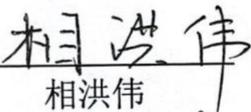

任迎春

# 其他高级管理人员签字：

张廷兵

聂玉涛

任炳章

朱长春

乔海兵

耿正

seal

普联软件股份有限公司
3701120104588

# 发行人审计委员会委员声明

公司全体审计委员会委员承诺本募集说明书内容真实、准确、完整，不存在虚假记载、误导性陈述或重大遗漏，按照诚信原则履行承诺，并承担相应的法律责任。

审计委员会委员签名：

text_image

石碧泉

石贵泉

text_image

张超春

任迎春

  
李科兵

seal

普联软件股份有限公司
3701120104588

# 二、发行人控股股东、实际控制人声明

本人承诺本募集说明书内容真实、准确、完整，不存在虚假记载、误导性陈述或重大遗漏，按照诚信原则履行承诺，并承担相应的法律责任。

控股股东、实际控制人签字：

周国强

蔺国强

瑰

王 虎

普联软件股份有限公司
2025年12月3日

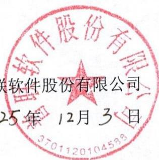

seal

成都软件股份有限公司
3701120104533

# 三、保荐人（主承销商）声明

本公司已对募集说明书进行了核查，确认本募集说明书内容真实、准确、完整，不存在虚假记载、误导性陈述或重大遗漏，并承担相应的法律责任。

项目协办人： 李民昊
李民昊

保荐代表人： 唐听良 丁志皓

法定代表人： 王洪

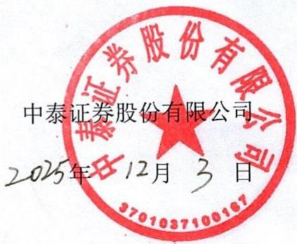

seal

中泰证券股份有限公司
3701037100167

# 保荐人董事长、总经理声明

本人已认真阅读普联软件股份有限公司本次向不特定对象发行可转换公司债券募集说明书的全部内容，确认募集说明书不存在虚假记载、误导性陈述或者重大遗漏，并对募集说明书真实性、准确性、完整性、及时性承担相应法律责任。

总经理：

冯艺东

董事长：

王洪

中泰证券股份有限公司
2025年12月3日

seal

中泰证券股份有限公司
3701037100167

# 四、发行人律师声明

本所及经办律师已阅读募集说明书，确认募集说明书内容与本所出具的法律意见书不存在矛盾。本所及经办律师对发行人在募集说明书中引用的法律意见书的内容无异议，确认募集说明书不因引用上述内容而出现虚假记载、误导性陈述或重大遗漏，并承担相应的法律责任。

经办律师：

孙子彩

顾平宽

即：

刘允豪

律师事务所负责人：

张海燕

张学兵

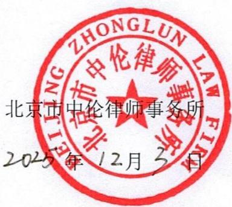

seal

北京市中伦律师事务所
BEIJING ZHONGLUN LAW FIRM

# 五、会计师事务所声明

本所及签名注册会计师已阅读募集说明书，确认募集说明书内容与本所出具的审计报告等文件不存在矛盾。本所及签名注册会计师对发行人在募集说明书中引用的审计报告等文件的内容无异议，确认募集说明书不因引用上述内容而出现虚假记载、误导性陈述或重大遗漏，并承担相应的法律责任。

会计师事务所负责人：

text_image

李惠琦
李惠琦

签字注册会计师：

seal

中国注册会计师
刘佳
1000159

seal

中国注册会计师
赵燕廷
10101800722

刘健

seal

中国注册会计师
江涛
370100150002

赵燕廷

seal

中国注册会计师
郭冬梅
110101310010

郭冬梅

致同会计师事务所（特殊普通合伙）

2025年12月3日

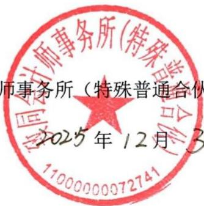

seal

致同会计师事务所(特殊普通合伙)
11000000072741

# 六、债券信用评级机构声明

本机构及签字资信评级人员已阅读募集说明书，确认募集说明书内容与本机构出具的资信评级报告不存在矛盾。本机构及签字资信评级人员对发行人在募集说明书中引用的评估报告的内容无异议，确认募集说明书不因引用上述内容而出现虚假记载、误导性陈述或重大遗漏，并承担相应的法律责任。

资信评级机构负责人签名：

text_image

张剑文

签字评级人员：

text_image

陈琳

陈良玮

王玉婷

中证鹏元资信评估股份有限公司

seal

中鹏资信评估股份有限公司
4403011021965

# 七、发行人董事会声明

本次发行摊薄即期回报的，发行人董事会按照国务院和中国证监会有关规定作出的承诺并兑现填补回报的具体措施。

# （一）关于填报摊薄即期回报所采取的措施

为了保护广大投资者的利益，降低本次发行可转债可能摊薄即期回报的影响，公司拟采取多种措施保证本次向不特定对象发行可转债募集资金有效使用、防范即期回报被摊薄的风险，以提高对股东的即期回报。公司拟采取的具体措施如下：

# 1、完善公司法人治理结构，加强经营管理和内部控制

公司已根据法律法规和规范性文件的规定建立健全了管理结构，夯实了公司经营管理和内部控制的基础。未来几年，公司将继续严格遵循《中华人民共和国公司法》《中华人民共和国证券法》《上市公司治理准则》等法律、法规和规范性文件的要求，不断完善公司法人治理结构。同时，公司将全面有效地控制公司经营和管控风险，继续不断完善并强化各项程序，提升公司的经营管理水平，加强公司内部控制。

# 2、加强募集资金管理，保障募集资金合理规范使用

为规范募集资金的管理和使用，保护投资者的合法权益，公司已根据相关法律法规要求制定了《募集资金管理制度》。本次可转债募集资金到位后，公司将与保荐人、募集资金专户开户行签署募集资金专户监管协议，对募集资金进行专户专储，以保证募集资金合理规范使用。

# 3、加快募投项目建设进度，提高募集资金使用效率

公司已对本次募集资金投资项目的可行性进行了充分论证，募投项目符合产业发展趋势和国家产业政策，具有较好的市场前景和盈利能力。公司将积极调配资源，实施好募投项目的建设工作，争取募投项目早日达产并实现预期效益。随着本次募集资金投资项目的实施，预计公司的持续经营能力和盈利能力将进一步增强，本次发行导致的股东即期回报摊薄风险将持续降低。

# 4、不断完善利润分配制度，强化投资者回报机制

为完善和健全公司科学、持续、稳定、透明的分红政策和监督机制，积极有效地回报投资者，根据中国证券监督管理委员会《关于进一步落实上市公司现金分红有关事项的通知》《上市公司监管指引第3号——上市公司现金分红》等规定，公司已经制定和完善了《公司章程》中有关利润分配的相关条款，制定了《普联软件股份有限公司未来三年（2025年-2027年）股东分红回报规划》，并提交股东大会审议，明确了公司利润分配尤其是现金分红的具体条件、比例、分配形式和股票股利分配条件等，完善了公司利润分配的决策程序和机制以及利润分配政策的调整原则，强化了中小投资者权益保障机制。本次发行后，公司将依据相关法律规定，严格执行落实现金分红的相关制度和股东分红回报规划，保障投资者的利益。

# （二）公司控股股东、实际控制人、董事及高级管理人员对公司填补回报措施能够得到切实履行的承诺

公司全体董事和高级管理人员关于切实履行公司填补即期回报措施的承诺参见“第四节 发行人基本情况”之“四、承诺事项及履行情况”之“(二)本次发行所作出的重要承诺”。

公司控股股东、实际控制人关于切实履行公司填补即期回报措施的承诺参见“第四节 发行人基本情况”之“四、承诺事项及履行情况”之“(二)本次发行所作出的重要承诺”。

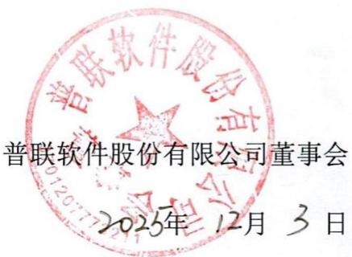

seal

普联软件股份有限公司
董事会
01201775

# 第十节 备查文件

# 一、备查文件

投资者可查阅与本次发行有关的相关正式文件，具体包括：

（一）公司最近三年的财务报告及审计报告；  
（二）保荐人出具的发行保荐书、发行保荐工作报告和尽职调查报告；  
（三）董事会编制、股东大会批准的关于前次募集资金使用情况的报告以及会计师出具的鉴证报告；  
（四）法律意见书和律师工作报告；  
（五）资信评级报告；  
（六）其他与本次发行有关的重要文件。

# 二、备查文件查阅时间和地点

# （一）查阅时间

发行期间每周一至周五上午九点至十一点，下午三点至五点。

# （二）查阅地点

# 1、普联软件股份有限公司

地址：山东省济南市高新区舜泰北路789号B座20层

电话：0531-88897389

传真：0531-88897389

联系人：乔海兵

# 2、中泰证券股份有限公司

地址：山东省济南市市中区经七路86号

电话：0531-68889038

传真：0531-68889001

联系人：唐听良、丁志皓

附件一：发行人及其子公司拥有的软件著作权清单

<table><tr><td>序号</td><td>著作权人</td><td>软件名称</td><td>取得方式</td><td>权利范围</td><td>开发完成日</td><td>首次发表日</td><td>登记号</td></tr><tr><td>1</td><td>普联软件</td><td>普联异构数据交换平台软件[简称:PanXI]V1.0</td><td>原始取得</td><td>全部权利</td><td>——</td><td>2006-7-21</td><td>2006SR12445</td></tr><tr><td>2</td><td>普联软件</td><td>普联数据综合应用平台软件[简称:PanBI]V1.0</td><td>原始取得</td><td>全部权利</td><td>——</td><td>2006-7-5</td><td>2006SR12446</td></tr><tr><td>3</td><td>普联软件</td><td>普联应用开发平台软件[简称:PanSchema]V1.0</td><td>原始取得</td><td>全部权利</td><td>——</td><td>2007-9-30</td><td>2008SR06168</td></tr><tr><td>4</td><td>普联软件</td><td>普联物资管理信息平台软件[简称:PanMM]V1.0</td><td>原始取得</td><td>全部权利</td><td>——</td><td>2007-9-20</td><td>2008SR06171</td></tr><tr><td>5</td><td>普联软件</td><td>普联运输管理信息系统软件[简称:PanTM]V1.0</td><td>原始取得</td><td>全部权利</td><td>——</td><td>2007-9-1</td><td>2008SR06176</td></tr><tr><td>6</td><td>普联软件</td><td>普联PanSchema企业管理软件MountainEast[简称:MountainEast]V1.0</td><td>原始取得</td><td>全部权利</td><td>——</td><td>2007-9-30</td><td>2008SR06177</td></tr><tr><td>7</td><td>普联软件</td><td>普联固定资产条码管理软件[简称:PanABMS]V1.0</td><td>原始取得</td><td>全部权利</td><td>2008-10-1</td><td>2008-10-8</td><td>2010SR008743</td></tr><tr><td>8</td><td>普联软件</td><td>普联集中财务管理系统软件[简称:PanCF]V1.0</td><td>原始取得</td><td>全部权利</td><td>2007-6-30</td><td>2007-7-5</td><td>2010SR008782</td></tr><tr><td>9</td><td>普联软件</td><td>普联企业内控管理系统软件[简称:PanICS]V1.0</td><td>原始取得</td><td>全部权利</td><td>2009-6-20</td><td>2009-7-30</td><td>2010SR010329</td></tr><tr><td>10</td><td>普联软件</td><td>普联企业资源综合管控平台软件[简称:PanERM]V1.0</td><td>原始取得</td><td>全部权利</td><td>2009-8-20</td><td>2009-9-20</td><td>2010SR011698</td></tr><tr><td>11</td><td>普联软件</td><td>普联全面预算管理系统软件[简称:PanBMIS]V1.0</td><td>原始取得</td><td>全部权利</td><td>2009-7-10</td><td>2009-12-10</td><td>2010SR012954</td></tr><tr><td>12</td><td>普联软件</td><td>普联银企互联平台软件[简称:Pansoft BankBroker]V1.0</td><td>原始取得</td><td>全部权利</td><td>2011-3-30</td><td>2011-6-30</td><td>2012SR077144</td></tr><tr><td>13</td><td>普联软件</td><td>普联XBRL验证软件[简称:PanXV]V1.0</td><td>原始取得</td><td>全部权利</td><td>2010-9-30</td><td>2011-10-31</td><td>2012SR077229</td></tr><tr><td>14</td><td>普联软件</td><td>普联资金集中管理系统软件[简称:PanTMS]V1.0</td><td>原始取得</td><td>全部权利</td><td>2008-11-30</td><td>2009-1-1</td><td>2012SR077528</td></tr><tr><td>15</td><td>普联软件</td><td>普联XBRL报告系统软件[简称:PanXBRL]V1.0</td><td>原始取得</td><td>全部权利</td><td>2010-8-30</td><td>2011-10-31</td><td>2012SR078150</td></tr><tr><td>16</td><td>普联软件</td><td>普联对标管理信息系统[简称:PanBMS]V2.0</td><td>原始取得</td><td>全部权利</td><td>2011-1-31</td><td>2011-2-1</td><td>2012SR080320</td></tr><tr><td>17</td><td>普联软件</td><td>普联业务集成系统平台软件[简称:BIS]V3.0</td><td>原始取得</td><td>全部权利</td><td>2009-1-30</td><td>2009-6-30</td><td>2012SR107322</td></tr><tr><td>18</td><td>石化盈科信息技术有限责任公司、普联软件</td><td>“云资金”管理平台软件[简称:MCTOM]V1.0</td><td>原始取得</td><td>全部权利</td><td>2012-9-30</td><td>2012-10-1</td><td>2013SR041739</td></tr><tr><td>19</td><td>普联软件</td><td>普联人力资源管理软件V9.5</td><td>原始取得</td><td>全部权利</td><td>2013-6-26</td><td>2013-6-28</td><td>2013SR074488</td></tr><tr><td>20</td><td>普联软件</td><td>普联移动WEB应用平台软件[简称:PanMWP]V3.0</td><td>原始取得</td><td>全部权利</td><td>2013-3-30</td><td>2013-5-30</td><td>2013SR090680</td></tr><tr><td>21</td><td>普联软件</td><td>普联XBRL报表统计系统软件[简称:PanXStatements]V3.0</td><td>原始取得</td><td>全部权利</td><td>2013-5-9</td><td>2013-5-10</td><td>2013SR090746</td></tr><tr><td>22</td><td>普联软件</td><td>普联XBRL监管报送系统软件[简称:PanXSubmitting]V3.0</td><td>原始取得</td><td>全部权利</td><td>2013-5-9</td><td>2013-5-10</td><td>2013SR092203</td></tr><tr><td>23</td><td>普联软件</td><td>普联XBRL人工辅助校验系统软件[简称:PanXVArtificial]V3.0</td><td>原始取得</td><td>全部权利</td><td>2013-5-30</td><td>2013-6-25</td><td>2013SR092221</td></tr><tr><td>24</td><td>普联软件</td><td>普联企业云服务平台软件[简称:ESPCloud]V3.0</td><td>原始取得</td><td>全部权利</td><td>2013-11-1</td><td>2013-11-10</td><td>2013SR162936</td></tr><tr><td>25</td><td>普联软件</td><td>普联数据集成平台软件[简称:PanDIS]V3.0</td><td>原始取得</td><td>全部权利</td><td>2013-11-1</td><td>2013-11-10</td><td>2014SR018144</td></tr><tr><td>26</td><td>普联软件</td><td>普联供应链管理系统软件[简称:PanSCM]V3.0</td><td>原始取得</td><td>全部权利</td><td>2013-11-1</td><td>2013-11-6</td><td>2014SR018252</td></tr><tr><td>27</td><td>普联软件</td><td>普联工程安监管理平台软件[简称:PanESM]V3.0</td><td>原始取得</td><td>全部权利</td><td>2013-11-1</td><td>2013-11-8</td><td>2014SR019966</td></tr><tr><td>28</td><td>普联软件</td><td>普联制药行业ERP软件[简称:PanPERP]V1.0</td><td>原始取得</td><td>全部权利</td><td>2013-12-31</td><td>2014-4-30</td><td>2014SR148147</td></tr><tr><td>29</td><td>普联软件</td><td>普联XBRL通用分析系统[简称:PanXAnalysis]V1.0</td><td>原始取得</td><td>全部权利</td><td>2014-4-30</td><td>2014-5-30</td><td>2014SR148957</td></tr><tr><td>30</td><td>普联软件</td><td>普联高校人事管理系统软件[简称:普联高校Webhr]V9.5</td><td>原始取得</td><td>全部权利</td><td>2014-9-27</td><td>2014-9-30</td><td>2015SR033118</td></tr><tr><td>31</td><td>普联软件</td><td>普联工程造价管理系统[简称:PAN.Ecms]V1.0</td><td>原始取得</td><td>全部权利</td><td>2015-1-5</td><td>2015-1-6</td><td>2015SR061010</td></tr><tr><td>32</td><td>普联软件</td><td>普联装配式建筑标准化部品物联网系统[简称:PanAIS]V2.0</td><td>原始取得</td><td>全部权利</td><td>2015-4-20</td><td>2015-4-27</td><td>2015SR129829</td></tr><tr><td>33</td><td>普联软件</td><td>普联财务共享服务平台软件[简称:PansoftFSSP]V2.0</td><td>原始取得</td><td>全部权利</td><td>2015-7-18</td><td>2015-7-18</td><td>2015SR154481</td></tr><tr><td>34</td><td>普联软件</td><td>普联绩效管理系统V6.0</td><td>原始取得</td><td>全部权利</td><td>2015-6-2</td><td>2015-6-4</td><td>2015SR167384</td></tr><tr><td>35</td><td>普联软件</td><td>普联超高分辨率实时渲染系统[简称:PanSR]V1.0</td><td>原始取得</td><td>全部权利</td><td>2015-8-31</td><td>未发表</td><td>2015SR236137</td></tr><tr><td>36</td><td>普联软件</td><td>普联极速三维渲染系统[简称:PTRS]V1.0</td><td>原始取得</td><td>全部权利</td><td>2015-8-31</td><td>未发表</td><td>2015SR236141</td></tr><tr><td>37</td><td>普联软件、北京中瑞</td><td>普联偿二代XBRL编报系统V1.0</td><td>原始取得</td><td>全部权利</td><td>2015-10-25</td><td>2015-11-30</td><td>2015SR289179</td></tr><tr><td>38</td><td>普联软件</td><td>普联企业年金XBRL编报系统V1.0</td><td>原始取得</td><td>全部权利</td><td>2015-9-30</td><td>2015-10-26</td><td>2016SR034584</td></tr><tr><td>39</td><td>普联软件、中国石油化工股份有限公司中原油田分公司信息化管理中心</td><td>普联财务供应链集成服务系统[简称:普联财务供应链]V2.0</td><td>原始取得</td><td>全部权利</td><td>2015-11-5</td><td>未发表</td><td>2016SR042810</td></tr><tr><td>40</td><td>普联软件</td><td>普联集中财务管理系统软件V7.0</td><td>原始取得</td><td>全部权利</td><td>2015-9-25</td><td>2015-10-23</td><td>2016SR056934</td></tr><tr><td>41</td><td>普联软件</td><td>普联资金集中管理系统软件[简称:PanTMS]V6.0</td><td>原始取得</td><td>全部权利</td><td>2015-9-10</td><td>2015-10-10</td><td>2016SR056941</td></tr><tr><td>42</td><td>普联软件</td><td>普联油气零售管理信息系统[简称:PanGRMIS]V3.0</td><td>原始取得</td><td>全部权利</td><td>2015-9-30</td><td>2015-10-15</td><td>2016SR058862</td></tr><tr><td>43</td><td>普联软件</td><td>普联油气采购管理信息系统[简称:PanMMIS]V3.0</td><td>原始取得</td><td>全部权利</td><td>2015-11-20</td><td>2016-1-18</td><td>2016SR175895</td></tr><tr><td>44</td><td>普联软件</td><td>普联加盟管理信息系统[简称:PanLMIS]V3.0</td><td>原始取得</td><td>全部权利</td><td>2015-11-2</td><td>2015-12-31</td><td>2016SR175900</td></tr><tr><td>45</td><td>普联软件</td><td>普联交易结算管理信息系统[简称:PanTSMIS]V3.0</td><td>原始取得</td><td>全部权利</td><td>2015-12-10</td><td>2016-1-20</td><td>2016SR175905</td></tr><tr><td>46</td><td>普联软件</td><td>普联主数据管理信息系统[简称:PanMDM]V3.0</td><td>原始取得</td><td>全部权利</td><td>2015-9-30</td><td>2016-1-1</td><td>2016SR175908</td></tr><tr><td>47</td><td>普联软件</td><td>普联企业即时通讯软件[简称:办公助手]V1.0</td><td>原始取得</td><td>全部权利</td><td>2016-3-1</td><td>2016-3-23</td><td>2016SR255828</td></tr><tr><td>48</td><td>普联软件</td><td>普联偿二代XBRL分类监管报送系统V2.0</td><td>原始取得</td><td>全部权利</td><td>2016-7-29</td><td>2016-8-2</td><td>2016SR278224</td></tr><tr><td>49</td><td>普联软件、山东鲁财教育科技有限公司</td><td>鲁财行政事业单位内控管理系统[简称:AIICS]V3.0</td><td>原始取得</td><td>全部权利</td><td>2016-7-31</td><td>2016-9-1</td><td>2016SR361072</td></tr><tr><td>50</td><td>普联软件</td><td>普联基于商务信息仓库的报表管理软件V2.0</td><td>原始取得</td><td>全部权利</td><td>2016-10-10</td><td>2016-10-24</td><td>2016SR378707</td></tr><tr><td>51</td><td>普联软件</td><td>普联集团财务集中管控云平台软件[简称:Pan FMIS8]V2.0</td><td>原始取得</td><td>全部权利</td><td>2016-10-15</td><td>2016-10-20</td><td>2016SR378755</td></tr><tr><td>52</td><td>普联软件</td><td>普联偿二代XBRL自动化编报系统V2.0</td><td>原始取得</td><td>全部权利</td><td>2016-10-21</td><td>2016-10-25</td><td>2016SR379588</td></tr><tr><td>53</td><td>普联软件</td><td>普联油企互联网应用平台软件V2.0</td><td>原始取得</td><td>全部权利</td><td>2016-10-10</td><td>2016-10-20</td><td>2016SR379592</td></tr><tr><td>54</td><td>普联软件</td><td>普联智能移动终端开放式服务平台软件[简称:Pan OpenServer]V2.0</td><td>原始取得</td><td>全部权利</td><td>2016-9-30</td><td>2016-10-8</td><td>2016SR380208</td></tr><tr><td>55</td><td>普联软件</td><td>普联移动新媒体广播平台软件V2.0</td><td>原始取得</td><td>全部权利</td><td>2016-8-1</td><td>2016-8-5</td><td>2016SR380735</td></tr><tr><td>56</td><td>普联软件</td><td>普联云办公智能增效系统V2.0</td><td>原始取得</td><td>全部权利</td><td>2016-10-15</td><td>2016-10-28</td><td>2016SR380892</td></tr><tr><td>57</td><td>普联软件</td><td>普联增值税管理平台软件[简称:普联增值税系统]V2.0</td><td>原始取得</td><td>全部权利</td><td>2016-9-30</td><td>2016-12-28</td><td>2016SR388753</td></tr><tr><td>58</td><td>普联软件</td><td>普联快速应用开发框架系统[简称:Pan.SmartWeb]V2.0</td><td>原始取得</td><td>全部权利</td><td>2016-10-10</td><td>2016-10-18</td><td>2016SR389242</td></tr><tr><td>59</td><td>普联软件</td><td>普联极速三维渲染系统[简称:PTRS]V2.0</td><td>原始取得</td><td>全部权利</td><td>2016-10-1</td><td>2016-10-31</td><td>2016SR393796</td></tr><tr><td>60</td><td>普联软件</td><td>普联资金管理信息系统[简称:PanSmartTMS]V2.0</td><td>原始取得</td><td>全部权利</td><td>2016-9-17</td><td>2016-10-8</td><td>2016SR394541</td></tr><tr><td>61</td><td>普联软件</td><td>普联超高分辨率实时渲染系统[简称:PanSR]V2.0</td><td>原始取得</td><td>全部权利</td><td>2016-10-1</td><td>2016-10-31</td><td>2016SR396398</td></tr><tr><td>62</td><td>普联软件</td><td>普联油气一卡通管理信息系统[简称:PanGCMIS]V3.0</td><td>原始取得</td><td>全部权利</td><td>2015-12-10</td><td>2016-1-20</td><td>2017SR007624</td></tr><tr><td>63</td><td>普联软件</td><td>普联加油站管理信息系统[简称:PanBOS]V3.0</td><td>原始取得</td><td>全部权利</td><td>2015-11-18</td><td>2016-1-15</td><td>2017SR008020</td></tr><tr><td>64</td><td>普联软件</td><td>普联偿二代风险综合评级信息管理系统[简称:偿二代IRR系统]V2.0</td><td>原始取得</td><td>全部权利</td><td>2017-3-10</td><td>2017-3-10</td><td>2017SR214133</td></tr><tr><td>65</td><td>普联软件</td><td>普联压力测试XBRL编报系统[简称:压力测试编报系统]V2.0</td><td>原始取得</td><td>全部权利</td><td>2017-5-10</td><td>2017-5-10</td><td>2017SR384267</td></tr><tr><td>66</td><td>普联软件</td><td>普联市场信息采集软件V3.0</td><td>原始取得</td><td>全部权利</td><td>2017-6-6</td><td>2017-6-6</td><td>2017SR490064</td></tr><tr><td>67</td><td>普联软件</td><td>普联在线考试软件V3.0</td><td>原始取得</td><td>全部权利</td><td>2017-6-6</td><td>2017-7-6</td><td>2017SR490072</td></tr><tr><td>68</td><td>普联软件</td><td>普联银行理财信息登记XBRL报送系统[简称:银行理财登记系统]V2.0</td><td>原始取得</td><td>全部权利</td><td>2017-8-15</td><td>2017-8-15</td><td>2017SR538551</td></tr><tr><td>69</td><td>普联软件</td><td>普联“飞票”共享平台应用软件 V5.0</td><td>原始取得</td><td>全部权利</td><td>2017-5-10</td><td>2017-5-10</td><td>2017SR673683</td></tr><tr><td>70</td><td>普联软件</td><td>普联SARMRA评估管理信息系统 V2.0</td><td>原始取得</td><td>全部权利</td><td>2017-8-10</td><td>2017-8-10</td><td>2017SR704623</td></tr><tr><td>71</td><td>普联软件</td><td>普联偿二代风险管理信息系统[简称:偿二代风险管理系统]V2.0</td><td>原始取得</td><td>全部权利</td><td>2017-11-1</td><td>2017-11-1</td><td>2017SR742813</td></tr><tr><td>72</td><td>普联软件</td><td>普联充值圈存一体机系统[简称:一体机系统]V3.0</td><td>原始取得</td><td>全部权利</td><td>2017-9-26</td><td>2017-10-31</td><td>2017SR743034</td></tr><tr><td>73</td><td>普联软件</td><td>普联资产负债XBRL编报系统[简称:普联资产负债编报系统]V2.0</td><td>原始取得</td><td>全部权利</td><td>2017-12-10</td><td>2017-12-10</td><td>2018SR170730</td></tr><tr><td>74</td><td>普联软件</td><td>普联资产负债能力评估系统[简称:Pan.ALM]V2.0</td><td>原始取得</td><td>全部权利</td><td>2018-1-12</td><td>2018-1-12</td><td>2018SR225177</td></tr><tr><td>75</td><td>普联软件</td><td>普联代理记账软件V2.0</td><td>原始取得</td><td>全部权利</td><td>2018-2-10</td><td>2018-2-10</td><td>2018SR307917</td></tr><tr><td>76</td><td>普联软件</td><td>普联智能化票据影像管理软件[简称:影像平台]V3.0</td><td>原始取得</td><td>全部权利</td><td>2018-3-17</td><td>2018-3-17</td><td>2018SR368383</td></tr><tr><td>77</td><td>普联软件</td><td>普联电子档案管理系统[简称:电子档案系统]V2.0</td><td>原始取得</td><td>全部权利</td><td>2018-1-31</td><td>2018-1-31</td><td>2018SR381422</td></tr><tr><td>78</td><td>普联软件</td><td>普联行政事业单位内控管理信息系统[简称:PANGOVICS]V6.0</td><td>原始取得</td><td>全部权利</td><td>2018-1-30</td><td>2018-1-30</td><td>2018SR486502</td></tr><tr><td>79</td><td>普联软件</td><td>普联财务报表合并系统 V3.0</td><td>原始取得</td><td>全部权利</td><td>2018-3-10</td><td>2018-3-10</td><td>2018SR687226</td></tr><tr><td>80</td><td>普联软件</td><td>普联人力资本管理系统[简称:PanHCM]V2.0</td><td>原始取得</td><td>全部权利</td><td>2018-5-28</td><td>2018-5-28</td><td>2018SR687282</td></tr><tr><td>81</td><td>普联软件</td><td>普联TurboChain涡链区块链平台软件 V3.0</td><td>原始取得</td><td>全部权利</td><td>2018-6-1</td><td>2018-6-1</td><td>2018SR742075</td></tr><tr><td>82</td><td>普联软件</td><td>普联油气产品销售分析系统[简称:油气销售分析]V2.0</td><td>原始取得</td><td>全部权利</td><td>2018-8-31</td><td>2018-8-31</td><td>2018SR747191</td></tr><tr><td>83</td><td>普联软件</td><td>普联资金集中管理系统软件[简称:PanTMS]V7.0</td><td>原始取得</td><td>全部权利</td><td>2018-7-10</td><td>2018-7-10</td><td>2018SR770159</td></tr><tr><td>84</td><td>普联软件</td><td>普联全面预算管理系统软件[简称:PanBMIS]V6.0</td><td>原始取得</td><td>全部权利</td><td>2018-7-9</td><td>2018-7-9</td><td>2018SR770781</td></tr><tr><td>85</td><td>普联软件</td><td>普联集中财务管理系统软件 V9.0</td><td>原始取得</td><td>全部权利</td><td>2018-5-17</td><td>2018-5-17</td><td>2018SR770787</td></tr><tr><td>86</td><td>普联软件</td><td>普联政府会计财务管理系统[简称:PANGOVFMIS]V3.0</td><td>原始取得</td><td>全部权利</td><td>2018-8-31</td><td>2018-8-31</td><td>2018SR847893</td></tr><tr><td>87</td><td>普联软件</td><td>普联企业云服务平台软件[简称:ESPCloud]V6.0</td><td>原始取得</td><td>全部权利</td><td>2018-12-29</td><td>2018-12-29</td><td>2019SR0212804</td></tr><tr><td>88</td><td>普联软件</td><td>普联财务共享服务平台软件[简称:Pansoft FSSP]V3.0</td><td>原始取得</td><td>全部权利</td><td>2018-12-28</td><td>2018-12-28</td><td>2019SR0225548</td></tr><tr><td>89</td><td>普联软件</td><td>普联环境保护税管理系统V2.0</td><td>原始取得</td><td>全部权利</td><td>2018-9-30</td><td>2018-10-15</td><td>2019SR0243082</td></tr><tr><td>90</td><td>普联软件</td><td>普联企业大数据分析展示系统[简称:企业大数据分析展示平台]V2.0</td><td>原始取得</td><td>全部权利</td><td>2019-1-25</td><td>2019-1-25</td><td>2019SR0273814</td></tr><tr><td>91</td><td>普联软件</td><td>普联内部控制管理系统[简称:普联内控系统]V2.0</td><td>原始取得</td><td>全部权利</td><td>2019-1-18</td><td>2019-1-18</td><td>2019SR0274523</td></tr><tr><td>92</td><td>普联软件</td><td>普联企业资产管理系统[简称:Pan EAM]V2.0</td><td>原始取得</td><td>全部权利</td><td>2019-3-1</td><td>2019-3-1</td><td>2019SR0384463</td></tr><tr><td>93</td><td>普联软件</td><td>普联绩效管理系统[简称:Pan PMS]V8.0</td><td>原始取得</td><td>全部权利</td><td>2019-2-18</td><td>2019-2-18</td><td>2019SR0384670</td></tr><tr><td>94</td><td>普联软件</td><td>普联国际金融资本管理信息系统[简称:IFC]V2.0</td><td>原始取得</td><td>全部权利</td><td>2019-1-31</td><td>2019-1-31</td><td>2019SR0492643</td></tr><tr><td>95</td><td>普联软件</td><td>普联个人所得税管理系统[简称:Pan PTS]V2.0</td><td>原始取得</td><td>全部权利</td><td>2018-12-20</td><td>2018-12-20</td><td>2019SR1080366</td></tr><tr><td>96</td><td>普联软件</td><td>普联关联交易管理系统V2.0</td><td>原始取得</td><td>全部权利</td><td>2019-9-23</td><td>2019-9-23</td><td>2019SR1154358</td></tr><tr><td>97</td><td>普联软件</td><td>普联培训评估综合管理系统[简称:Pansoft TTS]V2.0</td><td>原始取得</td><td>全部权利</td><td>2019-6-20</td><td>2019-6-20</td><td>2020SR0029448</td></tr><tr><td>98</td><td>普联软件</td><td>普联OSP企业PaaS云平台软件[简称:OSP PaaS]V2.0</td><td>原始取得</td><td>全部权利</td><td>2018-12-31</td><td>2019-2-1</td><td>2020SR0282836</td></tr><tr><td>99</td><td>普联软件</td><td>普联RPA机器人流程自动化平台软件[简称:SmartMate]V2.0</td><td>原始取得</td><td>全部权利</td><td>2018-12-31</td><td>2019-2-1</td><td>2020SR0282842</td></tr><tr><td>100</td><td>普联软件</td><td>普联多渠道支付平台软件[简称:PanMCP]V2.0</td><td>原始取得</td><td>全部权利</td><td>2019-8-10</td><td>2019-8-10</td><td>2020SR0547236</td></tr><tr><td>101</td><td>普联软件</td><td>普联安全可控的区块链智能应用服务系统V1.0</td><td>原始取得</td><td>全部权利</td><td>2020-1-3</td><td>2020-1-16</td><td>2020SR0599334</td></tr><tr><td>102</td><td>普联软件</td><td>普联信息安全数据融合智能服务系统V1.0</td><td>原始取得</td><td>全部权利</td><td>2020-1-10</td><td>2020-1-24</td><td>2020SR0599439</td></tr><tr><td>103</td><td>普联软件</td><td>普联便利店零售管理系统[简称:PanCSS]V6.22</td><td>原始取得</td><td>全部权利</td><td>2019-9-15</td><td>2019-9-15</td><td>2020SR0627125</td></tr><tr><td>104</td><td>普联软件</td><td>普联数据管理平台系统V2.0</td><td>原始取得</td><td>全部权利</td><td>2019-9-23</td><td>2019-9-23</td><td>2020SR0657301</td></tr><tr><td>105</td><td>普联软件</td><td>普联SmartMate机器人执行器软件[简称:Smart Mate Robot]V2.0</td><td>原始取得</td><td>全部权利</td><td>2018-12-31</td><td>2019-2-1</td><td>2020SR0752896</td></tr><tr><td>106</td><td>普联软件</td><td>普联SmartMate机器人流程设计器软件[简称:Smart Mate Studio]V2.0</td><td>原始取得</td><td>全部权利</td><td>2018-12-31</td><td>2019-2-1</td><td>2020SR0752903</td></tr><tr><td>107</td><td>普联软件</td><td>普联SmartMate机器人流程控制器软件[简称:Smart Mate Control]V2.0</td><td>原始取得</td><td>全部权利</td><td>2018-12-31</td><td>2019-2-1</td><td>2020SR0752910</td></tr><tr><td>108</td><td>普联软件</td><td>普联企业云盘软件[简称:普联云盘]V2.0</td><td>原始取得</td><td>全部权利</td><td>2020-5-30</td><td>2020-5-30</td><td>2020SR1022379</td></tr><tr><td>109</td><td>普联软件</td><td>普联智能税务管控系统V2.0</td><td>原始取得</td><td>全部权利</td><td>2020-2-20</td><td>2020-4-15</td><td>2020SR1037548</td></tr><tr><td>110</td><td>普联软件</td><td>普联税企直联云系统V2.0</td><td>原始取得</td><td>全部权利</td><td>2020-2-17</td><td>2020-4-15</td><td>2020SR1037603</td></tr><tr><td>111</td><td>普联软件</td><td>普联视频流媒体平台软件[简称:OSPMediaCenter]V1.0</td><td>原始取得</td><td>全部权利</td><td>2019-12-31</td><td>2020-5-4</td><td>2020SR1595829</td></tr><tr><td>112</td><td>普联软件</td><td>普联企业物联网平台软件[简称:OSPIOT]V1.0</td><td>原始取得</td><td>全部权利</td><td>2019-12-31</td><td>2020-5-4</td><td>2020SR1595830</td></tr><tr><td>113</td><td>普联软件</td><td>普联统一身份与访问控制管理系统[简称:Pan.OSPIam]V1.0</td><td>原始取得</td><td>全部权利</td><td>2020-10-9</td><td>2020-10-9</td><td>2020SR1845025</td></tr><tr><td>114</td><td>普联软件</td><td>普联经营分析平台软件[简称:PanBAP]V2.0</td><td>原始取得</td><td>全部权利</td><td>2020-7-31</td><td>2020-8-10</td><td>2021SR0034968</td></tr><tr><td>115</td><td>普联软件</td><td>普联盈亏平衡点分析系统[简称:PanBEP]V2.0</td><td>原始取得</td><td>全部权利</td><td>2020-5-29</td><td>2020-10-30</td><td>2021SR0041503</td></tr><tr><td>116</td><td>普联软件</td><td>普联环球银行报文信息服务系统[简称:Pan.GBS]V2.0</td><td>原始取得</td><td>全部权利</td><td>2020-5-4</td><td>2020-5-4</td><td>2021SR0159792</td></tr><tr><td>117</td><td>普联软件</td><td>普联会计电子档案管理系统V1.0</td><td>原始取得</td><td>全部权利</td><td>2020-11-30</td><td>2020-11-30</td><td>2021SR0159993</td></tr><tr><td>118</td><td>普联软件</td><td>普联新一代报表平台系统[简称:Pan.NextGen]</td><td>原始取得</td><td>全部权利</td><td>2020-4-30</td><td>2020-4-30</td><td>2021SR0159994</td></tr><tr><td>119</td><td>普联软件</td><td>普联区块链平台软件V2.0</td><td>原始取得</td><td>全部权利</td><td>2020-4-28</td><td>2020-4-28</td><td>2021SR0165505</td></tr><tr><td>120</td><td>普联软件</td><td>普联国际金融资本管理信息系统[简称:IFC]V3.0</td><td>原始取得</td><td>全部权利</td><td>2020-12-2</td><td>2020-12-2</td><td>2021SR0186548</td></tr><tr><td>121</td><td>普联软件</td><td>普联业务集成系统平台软件[简称:PanBIS]V4.0</td><td>原始取得</td><td>全部权利</td><td>2020-10-31</td><td>2020-10-31</td><td>2021SR0191062</td></tr><tr><td>122</td><td>普联软件</td><td>普联企业资产管理系统[简称:PanEAM]V3.0</td><td>原始取得</td><td>全部权利</td><td>2020-11-1</td><td>2020-11-1</td><td>2021SR0191063</td></tr><tr><td>123</td><td>普联软件</td><td>普联偿二代二期信息管理系统[简称:偿二代二期信息系统]V1.0</td><td>原始取得</td><td>全部权利</td><td>2021-6-29</td><td>2021-6-30</td><td>2021SR1109290</td></tr><tr><td>124</td><td>普联软件</td><td>普联偿二代二期编报系统[简称:偿二代二期系统]V1.0</td><td>原始取得</td><td>全部权利</td><td>2021-6-29</td><td>2021-6-30</td><td>2021SR1212711</td></tr><tr><td>125</td><td>普联软件</td><td>普联电子档案管理系统[简称:电子档案系统]V3.0</td><td>原始取得</td><td>全部权利</td><td>2021-9-6</td><td>2021-9-6</td><td>2021SR1578420</td></tr><tr><td>126</td><td>普联软件</td><td>普联业财一体化平台软件[简称:PanICS]V2.0</td><td>原始取得</td><td>全部权利</td><td>2020-12-20</td><td>2020-12-29</td><td>2021SR1592471</td></tr><tr><td>127</td><td>普联软件</td><td>普联企业云服务平台软件[简称:ESPCloud]V6.5</td><td>原始取得</td><td>全部权利</td><td>2021-8-20</td><td>2021-8-20</td><td>2021SR1592472</td></tr><tr><td>128</td><td>普联软件</td><td>普联资金集中管理系统[简称:PanTMS]V8.0</td><td>原始取得</td><td>全部权利</td><td>2021-6-10</td><td>2021-8-9</td><td>2021SR1592473</td></tr><tr><td>129</td><td>普联软件</td><td>普联智能移动终端开放式服务平台软件[简称:PanOpenServer]V3.0</td><td>原始取得</td><td>全部权利</td><td>2021-8-15</td><td>2021-8-15</td><td>2021SR1592537</td></tr><tr><td>130</td><td>普联软件</td><td>普联集中财务管理系统软件[简称:PanFMIS]V10.0</td><td>原始取得</td><td>全部权利</td><td>2021-6-1</td><td>2021-6-1</td><td>2021SR1592538</td></tr><tr><td>131</td><td>普联软件</td><td>普联智能化票据影像管理软件[简称:影像平台]V4.0</td><td>原始取得</td><td>全部权利</td><td>2021-9-6</td><td>2021-9-6</td><td>2021SR1592539</td></tr><tr><td>132</td><td>普联软件</td><td>普联数据集成平台软件[简称:PanDIS]V4.0</td><td>原始取得</td><td>全部权利</td><td>2021-4-30</td><td>2021-4-30</td><td>2021SR1796110</td></tr><tr><td>133</td><td>普联软件</td><td>普联智能共享服务平台软件[简称:PanIFSSP]V5.0</td><td>原始取得</td><td>全部权利</td><td>2021-1-1</td><td>2021-3-31</td><td>2021SR1796208</td></tr><tr><td>134</td><td>普联软件</td><td>普联快速应用开发框架系统[简称:Pan.SmartWeb]V3.0</td><td>原始取得</td><td>全部权利</td><td>2021-1-4</td><td>2021-3-31</td><td>2022SR0012640</td></tr><tr><td>135</td><td>普联软件</td><td>普联移动WEB应用平台软件[简称:PanMWP]V4.0</td><td>原始取得</td><td>全部权利</td><td>2021-1-4</td><td>2021-3-31</td><td>2022SR0012641</td></tr><tr><td>136</td><td>普联软件</td><td>普联环球银行报文信息服务系统[简称:Pan.GBS]V3.0</td><td>原始取得</td><td>全部权利</td><td>2021-9-15</td><td>2021-10-15</td><td>2022SR0144506</td></tr><tr><td>137</td><td>普联软件</td><td>普联OSP开发平台软件[简称:OSPLCDP]V6.5</td><td>原始取得</td><td>全部权利</td><td>2022-4-10</td><td>2022-4-10</td><td>2022SR0497665</td></tr><tr><td>138</td><td>普联软件</td><td>普联国际金融资本管理信息系统[简称:IFC]V4.0</td><td>原始取得</td><td>全部权利</td><td>2021-12-31</td><td>2021-12-31</td><td>2022SR0551321</td></tr><tr><td>139</td><td>普联软件</td><td>普联人力资本管理系统V3.0</td><td>原始取得</td><td>全部权利</td><td>2021-9-16</td><td>2021-9-16</td><td>2022SR0624213</td></tr><tr><td>140</td><td>普联软件</td><td>普联建筑智慧安全软件[简称:ComSaftMS]V2.0</td><td>原始取得</td><td>全部权利</td><td>2021-6-30</td><td>2021-9-1</td><td>2022SR0632471</td></tr><tr><td>141</td><td>普联软件</td><td>普联OSP容器云平台软件[简称:OSPCaaS]V2.0</td><td>原始取得</td><td>全部权利</td><td>2022-3-21</td><td>2022-3-21</td><td>2022SR0636342</td></tr><tr><td>142</td><td>普联软件</td><td>普联偿二代风险管理信息系统[简称:偿二代风险管理系统]V3.0</td><td>原始取得</td><td>全部权利</td><td>2022-3-31</td><td>2022-3-31</td><td>2022SR0979305</td></tr><tr><td>143</td><td>普联软件</td><td>普联偿二代二期风险综合评级信息管理系统[简称:偿二代二期风险综合评级系统]V2.0</td><td>原始取得</td><td>全部权利</td><td>2022-6-30</td><td>2022-6-30</td><td>2022SR1352290</td></tr><tr><td>144</td><td>普联软件</td><td>普联全面预算管理系统软件[简称:PanBMIS]V7.0</td><td>原始取得</td><td>全部权利</td><td>2022-7-31</td><td>2022-8-1</td><td>2022SR1361924</td></tr><tr><td>145</td><td>普联软件</td><td>普联指标管理平台系统[简称:指标管理平台系统]V1.0</td><td>原始取得</td><td>全部权利</td><td>2022-6-30</td><td>2022-6-30</td><td>2022SR1376562</td></tr><tr><td>146</td><td>普联软件</td><td>普联科技信息管理系统[简称:科技管理系统]V2.0</td><td>原始取得</td><td>全部权利</td><td>2022-6-30</td><td>2022-6-30</td><td>2022SR1438516</td></tr><tr><td>147</td><td>普联软件</td><td>普联司库数据中台软件[简称:普联司库中台]V3.0</td><td>原始取得</td><td>全部权利</td><td>2022-9-30</td><td>2022-10-1</td><td>2022SR1571049</td></tr><tr><td>148</td><td>普联软件</td><td>普联OSP流程引擎软件[简称:OSP FLOW]V2.0</td><td>原始取得</td><td>全部权利</td><td>2022-4-10</td><td>2022-4-10</td><td>2023SR0110995</td></tr><tr><td>149</td><td>普联软件</td><td>普联OSP大数据平台软件[简称:Pan.PDH]V2.0</td><td>原始取得</td><td>全部权利</td><td>2022-4-10</td><td>2022-4-10</td><td>2023SR0110996</td></tr><tr><td>150</td><td>普联软件</td><td>普联OSP三维图形引擎软件[简称:OSP3DEngine]V1.0</td><td>原始取得</td><td>全部权利</td><td>2022-9-10</td><td>2022-9-10</td><td>2023SR0110997</td></tr><tr><td>151</td><td>普联软件</td><td>普联OSP集成平台软件[简称:OSP ING]V5.0</td><td>原始取得</td><td>全部权利</td><td>2022-8-30</td><td>2022-8-30</td><td>2023SR0110998</td></tr><tr><td>152</td><td>普联软件</td><td>普联OSP BIM轻量化for Revit软件[简称:OSP BIMExporter]V1.0</td><td>原始取得</td><td>全部权利</td><td>2022-9-22</td><td>2022-9-22</td><td>2023SR0110999</td></tr><tr><td>153</td><td>普联软件</td><td>普联财务报告管理系统[简称:普联财务报告系统]V7.0</td><td>原始取得</td><td>全部权利</td><td>2022-8-31</td><td>2022-9-1</td><td>2023SR0111000</td></tr><tr><td>154</td><td>普联软件</td><td>普联风险指标监测管理系统[简称:风险指标监测系统]V2.0</td><td>原始取得</td><td>全部权利</td><td>2022-9-30</td><td>2022-10-10</td><td>2023SR0169206</td></tr><tr><td>155</td><td>普联软件</td><td>普联资产分类评价系统[简称:Pan ACE]V2.0</td><td>原始取得</td><td>全部权利</td><td>2022-9-30</td><td>2022-10-31</td><td>2023SR0329636</td></tr><tr><td>156</td><td>普联软件</td><td>普联油气销售智能预测系统 V2.0</td><td>原始取得</td><td>全部权利</td><td>2022-10-31</td><td>2022-10-31</td><td>2023SR0329637</td></tr><tr><td>157</td><td>普联软件</td><td>普联油气井措施效益跟踪评价系统[简称:Pan MBE] V2.0</td><td>原始取得</td><td>全部权利</td><td>2022-4-30</td><td>2022-4-30</td><td>2023SR0329638</td></tr><tr><td>158</td><td>普联软件</td><td>普联计量自动化报表系统 V2.0</td><td>原始取得</td><td>全部权利</td><td>2022-11-30</td><td>2022-11-30</td><td>2023SR0549068</td></tr><tr><td>159</td><td>普联软件</td><td>普联数据可视化分析平台软件[简称:PanBIP] V2.0</td><td>原始取得</td><td>全部权利</td><td>2023-3-31</td><td>2023-3-31</td><td>2023SR0652894</td></tr><tr><td>160</td><td>普联软件</td><td>普联期货 XBRL 编报系统[简称:期货XBRL 编报系统] V2.0</td><td>原始取得</td><td>全部权利</td><td>2022-11-15</td><td>2022-11-15</td><td>2023SR0694846</td></tr><tr><td>161</td><td>普联软件</td><td>普联油气物联网二三维一体化地理信息系统[简称:油气物联网地理信息系统] V2.0</td><td>原始取得</td><td>全部权利</td><td>2022-12-31</td><td>2022-12-31</td><td>2023SR0713913</td></tr><tr><td>162</td><td>普联软件</td><td>普联新一代 XBRL 报告系统[简称:新一代XBRL 报告系统] V2.0</td><td>原始取得</td><td>全部权利</td><td>2022-12-31</td><td>2023-3-31</td><td>2023SR0736010</td></tr><tr><td>163</td><td>普联软件</td><td>普联三维地理信息平台软件[简称:PanGIS3D] V1.0</td><td>原始取得</td><td>全部权利</td><td>2023-5-15</td><td>2023-5-15</td><td>2023SR0761257</td></tr><tr><td>164</td><td>普联软件</td><td>普联物联网智能网关系统[简称:PanTSG] V1.0</td><td>原始取得</td><td>全部权利</td><td>2023-5-15</td><td>2023-5-15</td><td>2023SR0761258</td></tr><tr><td>165</td><td>普联软件</td><td>普联工业互联网平台软件[简称:PanIIP] V1.0</td><td>原始取得</td><td>全部权利</td><td>2023-5-29</td><td>2023-5-29</td><td>2023SR0761262</td></tr><tr><td>166</td><td>普联软件</td><td>普联Web自动化组态系统[简称:PanWebScada] V1.0</td><td>原始取得</td><td>全部权利</td><td>2023-5-15</td><td>2023-5-15</td><td>2023SR0761263</td></tr><tr><td>167</td><td>普联软件</td><td>普联二维地理信息平台软件[简称:PanGIS2D] V1.0</td><td>原始取得</td><td>全部权利</td><td>2023-5-15</td><td>2023-5-15</td><td>2023SR0761299</td></tr><tr><td>168</td><td>普联软件</td><td>普联智能AI语音调度系统[简称:PanIVDS] V1.0</td><td>原始取得</td><td>全部权利</td><td>2023-5-15</td><td>2023-5-15</td><td>2023SR0763061</td></tr><tr><td>169</td><td>普联软件</td><td>普联环球银行报文信息服务系统[简称:Pan.GBS] V5.0</td><td>原始取得</td><td>全部权利</td><td>2020-4-14</td><td>2020-5-30</td><td>2023SR1015064</td></tr><tr><td>170</td><td>普联软件</td><td>普联 DevOps 统一管理平台软件[简称:Pan.DevOps] V2.0</td><td>原始取得</td><td>全部权利</td><td>2022-9-28</td><td>2022-9-28</td><td>2023SR1144110</td></tr><tr><td>171</td><td>普联软件</td><td>普联运维监控平台软件 V1.0</td><td>原始取得</td><td>全部权利</td><td>2022-5-20</td><td>2022-5-20</td><td>2023SR1243850</td></tr><tr><td>172</td><td>普联软件</td><td>普联数据监控预警系统 V2.0</td><td>原始取得</td><td>全部权利</td><td>2023-7-10</td><td>2023-7-10</td><td>2023SR1322607</td></tr><tr><td>173</td><td>普联软件</td><td>普联统一消息发送平台软件 V2.0</td><td>原始取得</td><td>全部权利</td><td>2022-11-30</td><td>2022-11-30</td><td>2023SR1322626</td></tr><tr><td>174</td><td>普联软件</td><td>普联数据资产管理系统 V2.0</td><td>原始取得</td><td>全部权利</td><td>2023-7-10</td><td>2023-7-10</td><td>2023SR1322683</td></tr><tr><td>175</td><td>普联软件</td><td>普联集团财务核心总账管理系统[简称:普联核心总账系统]V7.0</td><td>原始取得</td><td>全部权利</td><td>2023-6-30</td><td>2023-7-1</td><td>2023SR1342542</td></tr><tr><td>176</td><td>普联软件</td><td>普联集团财务资产管理系统[简称:普联资产管理系统]V7.0</td><td>原始取得</td><td>全部权利</td><td>2023-4-30</td><td>2023-5-1</td><td>2023SR1343754</td></tr><tr><td>177</td><td>普联软件</td><td>普联资产负债XBRL编报系统[简称:普联资产负债编报系统]V3.0</td><td>原始取得</td><td>全部权利</td><td>2023-7-30</td><td>2023-8-31</td><td>2023SR1482351</td></tr><tr><td>178</td><td>普联软件</td><td>普联偿二代二期信息管理系统[简称:偿二代二期信息系统]V2.0</td><td>原始取得</td><td>全部权利</td><td>2023-7-30</td><td>2023-9-1</td><td>2023SR1483393</td></tr><tr><td>179</td><td>普联软件</td><td>普联数字化设备检测管理系统[简称:设备检测管理系统]V2.0</td><td>原始取得</td><td>全部权利</td><td>2023-6-1</td><td>2023-7-1</td><td>2023SR1546680</td></tr><tr><td>180</td><td>普联软件</td><td>普联数据采集交换平台软件[简称:PanDEP]V2.0</td><td>原始取得</td><td>全部权利</td><td>2023-9-1</td><td>2023-9-1</td><td>2023SR1546702</td></tr><tr><td>181</td><td>普联软件</td><td>普联数据中台系统[简称:PanDMP]V2.0</td><td>原始取得</td><td>全部权利</td><td>2023-8-30</td><td>2023-8-30</td><td>2023SR1547343</td></tr><tr><td>182</td><td>普联软件</td><td>普联数据加工计算平台软件[简称:PanDCP]V2.0</td><td>原始取得</td><td>全部权利</td><td>2023-9-1</td><td>2023-9-1</td><td>2023SR1547454</td></tr><tr><td>183</td><td>普联软件</td><td>普联数字化合同管理系统[简称:合同管理系统]V2.0</td><td>原始取得</td><td>全部权利</td><td>2022-12-1</td><td>2023-2-1</td><td>2023SR1550841</td></tr><tr><td>184</td><td>普联软件</td><td>普联共享云系统[简称:共享云]V3.0</td><td>原始取得</td><td>全部权利</td><td>2023-1-1</td><td>2023-3-1</td><td>2023SR1558889</td></tr><tr><td>185</td><td>普联软件</td><td>普联国际金融资本管理信息系统[简称:IFC]V6.0</td><td>原始取得</td><td>全部权利</td><td>2022-12-31</td><td>2022-12-31</td><td>2023SR1642049</td></tr><tr><td>186</td><td>普联软件</td><td>普联API网关平台软件[简称:普联API网关]V5.0</td><td>原始取得</td><td>全部权利</td><td>2023-8-31</td><td>2023-9-10</td><td>2023SR1659130</td></tr><tr><td>187</td><td>普联软件</td><td>普联微服务平台软件[简称:PanSF]V2.0</td><td>原始取得</td><td>全部权利</td><td>2022-1-1</td><td>2022-1-1</td><td>2023SR1675418</td></tr><tr><td>188</td><td>普联软件</td><td>普联企业端电子税务系统[简称:企业端电子税务系统]V4.0</td><td>原始取得</td><td>全部权利</td><td>2023-5-26</td><td>2023-5-26</td><td>2023SR1696521</td></tr><tr><td>189</td><td>普联软件</td><td>普联智慧设备管理系统[简称:PaniEAM]V2.0</td><td>原始取得</td><td>全部权利</td><td>2023-9-30</td><td>2023-9-30</td><td>2024SR0200579</td></tr><tr><td>190</td><td>普联软件</td><td>普联智慧供应链系统软件[简称:PanSCM]V3.0</td><td>原始取得</td><td>全部权利</td><td>2023-11-1</td><td>2024-1-1</td><td>2024SR0419861</td></tr><tr><td>191</td><td>普联软件</td><td>普联财务报告管理系统[简称:普联财务报告系统]V8.0</td><td>原始取得</td><td>全部权利</td><td>——</td><td>——</td><td>2024SR0574328</td></tr><tr><td>192</td><td>普联软件</td><td>普联集团财务资产管理系统[简称:普联资产管理系统] V8.0</td><td>原始取得</td><td>全部权利</td><td>——</td><td>——</td><td>2024SR0579404</td></tr><tr><td>193</td><td>普联软件</td><td>普联集团财务核心总账管理系统[简称:普联核心总账系统] V8.0</td><td>原始取得</td><td>全部权利</td><td>——</td><td>——</td><td>2024SR0584243</td></tr><tr><td>194</td><td>普联软件</td><td>普联分类监管信息管理系统[简称:普联分类监管系统] V2.0</td><td>原始取得</td><td>全部权利</td><td>——</td><td>——</td><td>2024SR0671912</td></tr><tr><td>195</td><td>普联软件</td><td>普联银企互联平台软件[简称:普联银企互联平台] V5.0</td><td>原始取得</td><td>全部权利</td><td>——</td><td>——</td><td>2024SR0800915</td></tr><tr><td>196</td><td>普联软件</td><td>普联全球司库管理系统[简称:普联司库管理系统] V9.0</td><td>原始取得</td><td>全部权利</td><td>——</td><td>——</td><td>2024SR0801638</td></tr><tr><td>197</td><td>普联软件</td><td>普联智能助手软件[简称:PanMate] V2.0</td><td>原始取得</td><td>全部权利</td><td>——</td><td>——</td><td>2024SR0882087</td></tr><tr><td>198</td><td>普联软件</td><td>普联智能体软件[简称:PanAgent] V2.0</td><td>原始取得</td><td>全部权利</td><td>——</td><td>——</td><td>2024SR0882097</td></tr><tr><td>199</td><td>普联软件</td><td>普联大模型软件[简称:PanGPT] V2.0</td><td>原始取得</td><td>全部权利</td><td>——</td><td>——</td><td>2024SR0885187</td></tr><tr><td>200</td><td>普联软件</td><td>普联业务管控智能体系统[简称:业务管控智能体] V2.0</td><td>原始取得</td><td>全部权利</td><td>——</td><td>——</td><td>2024SR0955491</td></tr><tr><td>201</td><td>普联软件</td><td>普联全面预算管理系统软件[简称:PanBMIS] V8.0</td><td>原始取得</td><td>全部权利</td><td>——</td><td>——</td><td>2024SR1087282</td></tr><tr><td>202</td><td>普联软件</td><td>普联指标管理系统V8.0</td><td>原始取得</td><td>全部权利</td><td>——</td><td>——</td><td>2024SR1094883</td></tr><tr><td>203</td><td>普联软件</td><td>普联企业端电子凭证接收服务系统[简称:企业端电子凭证接收服务系统] V2.0</td><td>原始取得</td><td>全部权利</td><td>——</td><td>——</td><td>2024SR1120134</td></tr><tr><td>204</td><td>普联软件</td><td>普联偿二代风险管理信息系统[简称:偿二代风险管理系统] V4.0</td><td>原始取得</td><td>全部权利</td><td>——</td><td>——</td><td>2024SR1121627</td></tr><tr><td>205</td><td>普联软件</td><td>普联协同办公应用集成门户软件 V2.0</td><td>原始取得</td><td>全部权利</td><td>——</td><td>——</td><td>2024SR1441550</td></tr><tr><td>206</td><td>普联软件</td><td>普联投资项目过程管理系统 V2.0</td><td>原始取得</td><td>全部权利</td><td>——</td><td>——</td><td>2024SR1442741</td></tr><tr><td>207</td><td>普联软件</td><td>普联远程桌面及远程协助软件 V2.0</td><td>原始取得</td><td>全部权利</td><td>——</td><td>——</td><td>2024SR1442745</td></tr><tr><td>208</td><td>普联软件</td><td>普联油气运销移动应用软件 V2.0</td><td>原始取得</td><td>全部权利</td><td>——</td><td>——</td><td>2024SR1445605</td></tr><tr><td>209</td><td>普联软件</td><td>普联就餐预约系统V2.0</td><td>原始取得</td><td>全部权利</td><td>——</td><td>——</td><td>2024SR1655208</td></tr><tr><td>210</td><td>普联软件</td><td>普联银企报文交互前置系统[简称:PanBFS] V3.0</td><td>原始取得</td><td>全部权利</td><td>——</td><td>——</td><td>2024SR1753693</td></tr><tr><td>211</td><td>普联软件</td><td>普联信息往来系统V2.0</td><td>原始取得</td><td>全部权利</td><td>——</td><td>——</td><td>2024SR2010599</td></tr><tr><td>212</td><td>普联软件</td><td>普联新会计准则管理系统[简称:新会计准则管理系统] V1.0</td><td>原始取得</td><td>全部权利</td><td>——</td><td>——</td><td>2024SR2073103</td></tr><tr><td>213</td><td>普联软件</td><td>普联轻资产结算权限精细化管理系统 V2.0</td><td>原始取得</td><td>全部权利</td><td>——</td><td>——</td><td>2025SR0138668</td></tr><tr><td>214</td><td>普联软件</td><td>普联操作风险管理系统 V2.0</td><td>原始取得</td><td>全部权利</td><td>——</td><td>——</td><td>2025SR0463811</td></tr><tr><td>215</td><td>普联软件</td><td>普联全面风险管理系统 V2.0</td><td>原始取得</td><td>全部权利</td><td>——</td><td>——</td><td>2025SR0466934</td></tr><tr><td>216</td><td>普联软件</td><td>普联保险资产管理评级管理系统 V2.0</td><td>原始取得</td><td>全部权利</td><td>——</td><td>——</td><td>2025SR0467048</td></tr><tr><td>217</td><td>普联软件</td><td>普联消费者权益保护评价管理系统 V2.0</td><td>原始取得</td><td>全部权利</td><td>——</td><td>——</td><td>2025SR0467063</td></tr><tr><td>218</td><td>普联软件</td><td>普联表单定制流转及统计软件 V2.0</td><td>原始取得</td><td>全部权利</td><td>——</td><td>——</td><td>2025SR0587344</td></tr><tr><td>219</td><td>普联软件</td><td>普联文件在线签批系统 V2.0</td><td>原始取得</td><td>全部权利</td><td>——</td><td>——</td><td>2025SR0587348</td></tr><tr><td>220</td><td>普联软件</td><td>普联资产配置与资产负债管理系统 V2.0</td><td>原始取得</td><td>全部权利</td><td>——</td><td>——</td><td>2025SR0587351</td></tr><tr><td>221</td><td>普联软件</td><td>普联内控合规管理信息系统 V2.0</td><td>原始取得</td><td>全部权利</td><td>——</td><td>——</td><td>2025SR0587352</td></tr><tr><td>222</td><td>普联软件</td><td>普联受托资产管理系统 V2.0</td><td>原始取得</td><td>全部权利</td><td>——</td><td>——</td><td>2025SR0587354</td></tr><tr><td>223</td><td>普联软件</td><td>普联智联移动办公系统 V1.0</td><td>原始取得</td><td>全部权利</td><td>——</td><td>——</td><td>2025SR0602608</td></tr><tr><td>224</td><td>普联软件</td><td>普联受托资产穿透数据管理系统 V2.0</td><td>原始取得</td><td>全部权利</td><td>——</td><td>——</td><td>2025SR0669516</td></tr><tr><td>225</td><td>普联软件巴州分公司</td><td>普联IPCom 星际通讯应用软件 V3.0</td><td>受让取得</td><td>全部权利</td><td>2018/6/1</td><td>2018/6/1</td><td>2023SR0636506</td></tr><tr><td>226</td><td>北京中瑞</td><td>艾特数字办公平台系统 V2.0</td><td>原始取得</td><td>全部权利</td><td>2014-3-24</td><td>2014-7-15</td><td>2014SR167965</td></tr><tr><td>227</td><td>北京中瑞</td><td>艾特 XBRL 财务报告数据应用软件 V1.0</td><td>原始取得</td><td>全部权利</td><td>2014-10-21</td><td>2014-10-21</td><td>2014SR168386</td></tr><tr><td>228</td><td>北京中瑞</td><td>艾特报表服务平台软件 V3.0</td><td>原始取得</td><td>全部权利</td><td>2014-10-21</td><td>2014-10-21</td><td>2014SR168390</td></tr><tr><td>229</td><td>北京中瑞</td><td>艾特运输管理系统 V2.0</td><td>原始取得</td><td>全部权利</td><td>2014-6-30</td><td>2014-7-15</td><td>2014SR168395</td></tr><tr><td>230</td><td>北京中瑞</td><td>艾特 XBRL 分类标准编辑软件 V1.0</td><td>原始取得</td><td>全部权利</td><td>2014-10-21</td><td>2014-10-21</td><td>2014SR168438</td></tr><tr><td>231</td><td>北京中瑞</td><td>艾特企业年金运营监控软件 V1.0</td><td>原始取得</td><td>全部权利</td><td>2014-10-21</td><td>2014-10-21</td><td>2014SR168446</td></tr><tr><td>232</td><td>合肥朗霁</td><td>世纪朗新大型企业集团综合统计与决策支持系统 V2.0</td><td>原始取得</td><td>全部权利</td><td>——</td><td>2007-12-10</td><td>2008SR22569</td></tr><tr><td>233</td><td>合肥朗霁</td><td>世纪朗新人力资源管理系统 V1.0</td><td>原始取得</td><td>全部权利</td><td>——</td><td>2007-12-1</td><td>2008SR22570</td></tr><tr><td>234</td><td>合肥朗霁</td><td>朗霁党员干部管理系统 V1.0</td><td>原始取得</td><td>全部权利</td><td>——</td><td>2008-8-20</td><td>2009SR03746</td></tr><tr><td>235</td><td>合肥朗霁</td><td>职工股权信息管理系统V1.0</td><td>原始取得</td><td>全部权利</td><td>——</td><td>2008-7-30</td><td>2009SR03747</td></tr><tr><td>236</td><td>合肥朗霁</td><td>世纪朗新考勤管理系统V1.0</td><td>原始取得</td><td>全部权利</td><td>——</td><td>2008-6-1</td><td>2009SR03748</td></tr><tr><td>237</td><td>合肥朗霁</td><td>朗霁人力资源管理系统[简称:人力资源管理系统]V9.0</td><td>原始取得</td><td>全部权利</td><td>2009-7-30</td><td>2009-8-10</td><td>2009SR048516</td></tr><tr><td>238</td><td>合肥朗霁</td><td>朗霁矿井安全监测考勤系统V9.0</td><td>原始取得</td><td>全部权利</td><td>2010-5-25</td><td>2010-6-1</td><td>2010SR056205</td></tr><tr><td>239</td><td>合肥朗霁</td><td>朗霁全员业绩考核系统V9.0</td><td>原始取得</td><td>全部权利</td><td>2012-3-30</td><td>未发表</td><td>2012SR064802</td></tr><tr><td>240</td><td>合肥朗霁</td><td>朗霁考勤管理系统V9.0</td><td>原始取得</td><td>全部权利</td><td>2012-3-30</td><td>未发表</td><td>2012SR067022</td></tr><tr><td>241</td><td>合肥朗霁</td><td>朗霁考勤管理系统V9.5</td><td>原始取得</td><td>全部权利</td><td>2013-7-25</td><td>2013-7-29</td><td>2014SR098926</td></tr><tr><td>242</td><td>合肥朗霁</td><td>朗霁全员业绩考核系统V9.5</td><td>原始取得</td><td>全部权利</td><td>2013-8-26</td><td>2013-8-29</td><td>2014SR104510</td></tr><tr><td>243</td><td>合肥朗霁</td><td>朗霁人力资源管理系统V9.5</td><td>原始取得</td><td>全部权利</td><td>2013-5-24</td><td>2013-5-28</td><td>2014SR104511</td></tr><tr><td>244</td><td>合肥朗霁</td><td>朗霁职业技能鉴定系统V3.0</td><td>原始取得</td><td>全部权利</td><td>2014-9-19</td><td>未发表</td><td>2014SR205044</td></tr><tr><td>245</td><td>合肥朗霁</td><td>朗霁招聘管理系统V3.0</td><td>原始取得</td><td>全部权利</td><td>2014-10-24</td><td>未发表</td><td>2014SR205344</td></tr><tr><td>246</td><td>合肥朗霁</td><td>朗霁劳动保护系统V3.0</td><td>原始取得</td><td>全部权利</td><td>2014-9-23</td><td>未发表</td><td>2014SR205449</td></tr><tr><td>247</td><td>合肥朗霁</td><td>朗霁培训管理系统V3.0</td><td>原始取得</td><td>全部权利</td><td>2014-10-15</td><td>未发表</td><td>2014SR206744</td></tr><tr><td>248</td><td>合肥朗霁</td><td>普联朗霁综合统计与商业智能系统V3.0</td><td>原始取得</td><td>全部权利</td><td>2015-7-15</td><td>未发表</td><td>2015SR176361</td></tr><tr><td>249</td><td>合肥朗霁</td><td>普联朗霁人力资源管理系统V10.0</td><td>原始取得</td><td>全部权利</td><td>2017-7-31</td><td>2017-8-2</td><td>2017SR503547</td></tr><tr><td>250</td><td>合肥朗霁</td><td>普联朗霁经费核算管理系统V3.0</td><td>原始取得</td><td>全部权利</td><td>2018-4-30</td><td>2018-5-2</td><td>2018SR722398</td></tr><tr><td>251</td><td>合肥朗霁</td><td>普联朗霁数据集成与共享平台V4.0</td><td>原始取得</td><td>全部权利</td><td>2018-2-28</td><td>2018-3-2</td><td>2018SR722417</td></tr><tr><td>252</td><td>合肥朗霁</td><td>普联朗霁人事档案管理系统V3.0</td><td>原始取得</td><td>全部权利</td><td>2018-1-30</td><td>2018-2-2</td><td>2018SR722428</td></tr><tr><td>253</td><td>合肥朗霁</td><td>普联朗霁行政管理系统V3.0</td><td>原始取得</td><td>全部权利</td><td>2018-5-16</td><td>2018-5-18</td><td>2018SR722613</td></tr><tr><td>254</td><td>合肥朗霁</td><td>普联朗霁工私伤管理系统V3.0</td><td>原始取得</td><td>全部权利</td><td>2018-3-30</td><td>2018-4-2</td><td>2018SR723752</td></tr><tr><td>255</td><td>合肥朗霁</td><td>普联朗霁社会保险管理系统V3.0</td><td>原始取得</td><td>全部权利</td><td>2018-2-28</td><td>2018-3-2</td><td>2018SR723758</td></tr><tr><td>256</td><td>合肥朗霁</td><td>普联朗霁WebHr移动应用系统V3.0</td><td>原始取得</td><td>全部权利</td><td>2018-3-30</td><td>2018-4-2</td><td>2018SR723766</td></tr><tr><td>257</td><td>合肥朗霁</td><td>普联朗霁劳动定额管理系统V3.0</td><td>原始取得</td><td>全部权利</td><td>2018-1-30</td><td>2018-2-2</td><td>2018SR723949</td></tr><tr><td>258</td><td>合肥朗霁</td><td>普联朗霁离退休管理系统V3.0</td><td>原始取得</td><td>全部权利</td><td>2015-6-30</td><td>2018-7-2</td><td>2018SR749021</td></tr><tr><td>259</td><td>合肥朗霁</td><td>普联朗霁矿井安全监测考勤系统V10.0</td><td>原始取得</td><td>全部权利</td><td>2018-5-16</td><td>2018-5-18</td><td>2018SR753882</td></tr><tr><td>260</td><td>合肥朗霁</td><td>普联朗霁考勤管理系统V10.0</td><td>原始取得</td><td>全部权利</td><td>2018-6-30</td><td>2018-7-2</td><td>2018SR753891</td></tr><tr><td>261</td><td>合肥朗霁</td><td>普联朗霁客户关系管理系统V3.0</td><td>原始取得</td><td>全部权利</td><td>2018-5-30</td><td>2018-6-1</td><td>2018SR789219</td></tr><tr><td>262</td><td>合肥朗霁</td><td>普联朗霁职称评审管理系统V3.0</td><td>原始取得</td><td>全部权利</td><td>2018-6-15</td><td>2018-6-19</td><td>2018SR791713</td></tr><tr><td>263</td><td>合肥朗霁</td><td>普联朗霁测试管理系统V3.0</td><td>原始取得</td><td>全部权利</td><td>2018-5-30</td><td>2018-6-1</td><td>2018SR791918</td></tr><tr><td>264</td><td>合肥朗霁</td><td>普联朗霁人才申报管理系统V3.0</td><td>原始取得</td><td>全部权利</td><td>2018-7-16</td><td>2018-7-18</td><td>2018SR793886</td></tr><tr><td>265</td><td>合肥朗霁</td><td>普联朗霁招聘管理系统V4.0</td><td>原始取得</td><td>全部权利</td><td>2018-5-15</td><td>2018-5-19</td><td>2018SR799428</td></tr><tr><td>266</td><td>合肥朗霁</td><td>普联朗霁干部管理系统V3.0</td><td>原始取得</td><td>全部权利</td><td>2018-7-16</td><td>2018-7-18</td><td>2018SR808158</td></tr><tr><td>267</td><td>合肥朗霁</td><td>普联朗霁人力资本管理系统V3.0</td><td>原始取得</td><td>全部权利</td><td>2019-11-21</td><td>2019-11-21</td><td>2019SR1315770</td></tr><tr><td>268</td><td>合肥朗霁</td><td>普联朗霁考勤监测平台V4.0</td><td>原始取得</td><td>全部权利</td><td>2019-8-22</td><td>2019-8-22</td><td>2019SR1316061</td></tr><tr><td>269</td><td>合肥朗霁</td><td>普联朗霁教职工综合管理服务平台V5.0</td><td>原始取得</td><td>全部权利</td><td>2019-7-18</td><td>2019-7-18</td><td>2019SR1339480</td></tr><tr><td>270</td><td>合肥朗霁</td><td>普联朗霁个税管理系统V3.0</td><td>原始取得</td><td>全部权利</td><td>2019-1-10</td><td>2019-1-10</td><td>2019SR1339891</td></tr><tr><td>271</td><td>合肥朗霁</td><td>普联朗霁外部用工管理系统V3.0</td><td>原始取得</td><td>全部权利</td><td>2019-9-4</td><td>2019-9-4</td><td>2019SR1409671</td></tr><tr><td>272</td><td>合肥朗霁</td><td>普联朗霁人力资本管理系统V4.0</td><td>原始取得</td><td>全部权利</td><td>2020-10-20</td><td>2020-10-20</td><td>2020SR1659808</td></tr><tr><td>273</td><td>合肥朗霁</td><td>普联朗霁全员业绩考核系统V10.0</td><td>原始取得</td><td>全部权利</td><td>2020-5-6</td><td>2020-5-6</td><td>2020SR1659809</td></tr><tr><td>274</td><td>合肥朗霁</td><td>普联朗霁人力资源自助服务系统V4.0</td><td>原始取得</td><td>全部权利</td><td>2020-6-2</td><td>2020-6-2</td><td>2020SR1680295</td></tr><tr><td>275</td><td>合肥朗霁</td><td>普联朗霁数据集成与共享平台V5.0</td><td>原始取得</td><td>全部权利</td><td>2020-1-10</td><td>2020-1-10</td><td>2020SR1680296</td></tr><tr><td>276</td><td>合肥朗霁</td><td>普联朗霁智能化考勤管理系统V4.0</td><td>原始取得</td><td>全部权利</td><td>2020-9-2</td><td>2020-9-2</td><td>2020SR1812404</td></tr><tr><td>277</td><td>合肥朗霁</td><td>普联朗霁项目管理系统V4.0</td><td>原始取得</td><td>全部权利</td><td>2020-7-8</td><td>2020-7-8</td><td>2020SR1812423</td></tr><tr><td>278</td><td>合肥朗霁</td><td>普联朗霁劳动定额管理系统[简称:劳动定额管理系统]V4.0</td><td>原始取得</td><td>全部权利</td><td>2021-6-2</td><td>2021-6-2</td><td>2021SR1506922</td></tr><tr><td>279</td><td>合肥朗霁</td><td>生产日报管理系统V3.0</td><td>原始取得</td><td>全部权利</td><td>2021-6-7</td><td>2021-6-7</td><td>2021SR1506923</td></tr><tr><td>280</td><td>合肥朗霁</td><td>普联朗霁考勤监测平台[简称:考勤监测平台]V5.0</td><td>原始取得</td><td>全部权利</td><td>2021-7-2</td><td>2021-7-2</td><td>2021SR1573057</td></tr><tr><td>281</td><td>合肥朗霁</td><td>电子档案管理系统V3.0</td><td>原始取得</td><td>全部权利</td><td>2021-7-5</td><td>2021-7-5</td><td>2021SR1573069</td></tr><tr><td>282</td><td>合肥朗霁</td><td>综合统计分析系统V3.0</td><td>原始取得</td><td>全部权利</td><td>2021-8-5</td><td>2021-8-5</td><td>2021SR1598781</td></tr><tr><td>283</td><td>合肥朗霁</td><td>报表管理系统 V3.0</td><td>原始取得</td><td>全部权利</td><td>2021-8-13</td><td>2021-8-13</td><td>2021SR1827057</td></tr><tr><td>284</td><td>合肥朗霁</td><td>普联 WebHrN2 人力资源管理系统 V5.0</td><td>原始取得</td><td>全部权利</td><td>2021-8-18</td><td>2021-8-18</td><td>2021SR2010817</td></tr><tr><td>285</td><td>合肥朗霁</td><td>普联日清日结管理系统 V3.0</td><td>原始取得</td><td>全部权利</td><td>2022-11-18</td><td>2022-11-18</td><td>2023SR0934149</td></tr><tr><td>286</td><td>合肥朗霁</td><td>普联 WebHrN2 移动应用系统 V3.0</td><td>原始取得</td><td>全部权利</td><td>2022-10-15</td><td>2022-10-15</td><td>2023SR0935273</td></tr><tr><td>287</td><td>合肥朗霁</td><td>普联 WebHrN2 社保管理系统 V3.0</td><td>原始取得</td><td>全部权利</td><td>2022-9-16</td><td>2022-9-16</td><td>2023SR0941461</td></tr><tr><td>288</td><td>合肥朗霁</td><td>普联 WebHrN2 人力资源管理系统 V6.0</td><td>原始取得</td><td>全部权利</td><td>2022-8-15</td><td>未发表</td><td>2023SR1143500</td></tr><tr><td>289</td><td>合肥朗霁</td><td>普联职业健康管理系统 V3.0</td><td>原始取得</td><td>全部权利</td><td>2022-12-18</td><td>2022-12-18</td><td>2023SR1158448</td></tr><tr><td>290</td><td>合肥朗霁</td><td>普联 API 集成平台 V3.0</td><td>原始取得</td><td>全部权利</td><td>2023-3-12</td><td>2023-3-12</td><td>2023SR1297473</td></tr><tr><td>291</td><td>合肥朗霁</td><td>普联内部市场化管理系统 V3.0</td><td>原始取得</td><td>全部权利</td><td>2023-2-16</td><td>2023-2-16</td><td>2023SR1297476</td></tr><tr><td>292</td><td>合肥朗霁</td><td>普联 ODP 开发平台 V3.0</td><td>原始取得</td><td>全部权利</td><td>2023-4-5</td><td>2023-4-5</td><td>2023SR1298686</td></tr><tr><td>293</td><td>合肥朗霁</td><td>普联 WebHrN2 绩效管理系统 V3.0</td><td>原始取得</td><td>全部权利</td><td>2023-3-18</td><td>2023-3-18</td><td>2023SR1298939</td></tr><tr><td>294</td><td>合肥朗霁</td><td>普联电子合同管理系统 V3.0</td><td>原始取得</td><td>全部权利</td><td>2023-3-24</td><td>2023-3-24</td><td>2023SR1299017</td></tr><tr><td>295</td><td>合肥朗霁</td><td>普联 VR 招聘实训系统 V3.0</td><td>原始取得</td><td>全部权利</td><td>2023-5-9</td><td>2023-5-9</td><td>2023SR1299661</td></tr><tr><td>296</td><td>合肥朗霁</td><td>普联人才考核积分管理系统 V3.0</td><td>原始取得</td><td>全部权利</td><td>2023-3-25</td><td>2023-3-25</td><td>2023SR1299917</td></tr><tr><td>297</td><td>合肥朗霁</td><td>普联访客管理系统 V3.0</td><td>原始取得</td><td>全部权利</td><td>——</td><td>——</td><td>2024SR0943355</td></tr><tr><td>298</td><td>合肥朗霁</td><td>普联 WebHrN2 社保管理系统 V4.0</td><td>原始取得</td><td>全部权利</td><td>——</td><td>——</td><td>2024SR1155188</td></tr><tr><td>299</td><td>合肥朗霁</td><td>普联 WebHrN2 绩效管理系统 V4.0</td><td>原始取得</td><td>全部权利</td><td>——</td><td>——</td><td>2025SR0254389</td></tr><tr><td>300</td><td>普联数建</td><td>普联数建 CRM 系统 V1.0</td><td>原始取得</td><td>全部权利</td><td>2021-9-30</td><td>未发表</td><td>2021SR1714020</td></tr><tr><td>301</td><td>普联数建</td><td>普联数建劳务实名制系统 V1.0</td><td>原始取得</td><td>全部权利</td><td>2021-10-20</td><td>未发表</td><td>2021SR1714022</td></tr><tr><td>302</td><td>普联数建</td><td>普联数建计划管理系统 V1.0</td><td>原始取得</td><td>全部权利</td><td>2021-10-10</td><td>2021-10-21</td><td>2021SR1714023</td></tr><tr><td>303</td><td>普联数建</td><td>普联数建即时通讯平台(iOS 版)V1.0</td><td>原始取得</td><td>全部权利</td><td>2021-10-20</td><td>未发表</td><td>2021SR1714024</td></tr><tr><td>304</td><td>普联数建</td><td>普联数建成本引擎系统 V1.0</td><td>原始取得</td><td>全部权利</td><td>2021-10-26</td><td>2021-10-26</td><td>2021SR1714033</td></tr><tr><td>305</td><td>普联数建</td><td>普联数建 Devops 平台 V1.0</td><td>原始取得</td><td>全部权利</td><td>2021-10-25</td><td>未发表</td><td>2021SR1714034</td></tr><tr><td>306</td><td>普联数建</td><td>普联数建报表管理系统 V1.0</td><td>原始取得</td><td>全部权利</td><td>2021-10-20</td><td>未发表</td><td>2021SR1714035</td></tr><tr><td>307</td><td>普联数建</td><td>普联数建集团门户系统[简称:集团门户]V1.0</td><td>原始取得</td><td>全部权利</td><td>2021-10-30</td><td>2021-10-31</td><td>2021SR1714036</td></tr><tr><td>308</td><td>普联数建</td><td>普联数建知识库系统V1.0</td><td>原始取得</td><td>全部权利</td><td>2021-10-20</td><td>2021-10-22</td><td>2021SR1714037</td></tr><tr><td>309</td><td>普联数建</td><td>普联数建微服务治理平台V1.0</td><td>原始取得</td><td>全部权利</td><td>2021-9-30</td><td>未发表</td><td>2021SR1714038</td></tr><tr><td>310</td><td>普联数建</td><td>普联数建容器云平台V1.0</td><td>原始取得</td><td>全部权利</td><td>2021-10-29</td><td>未发表</td><td>2021SR1714041</td></tr><tr><td>311</td><td>普联数建</td><td>普联数建防疫卫士系统[简称:防疫卫士]V1.0</td><td>原始取得</td><td>全部权利</td><td>2021-10-21</td><td>2021-10-22</td><td>2021SR1714042</td></tr><tr><td>312</td><td>普联数建</td><td>普联数建大数据平台V1.0</td><td>原始取得</td><td>全部权利</td><td>2021-9-30</td><td>2021-9-30</td><td>2021SR1714043</td></tr><tr><td>313</td><td>普联数建</td><td>普联数建SRM系统V1.0</td><td>原始取得</td><td>全部权利</td><td>2021-10-29</td><td>未发表</td><td>2021SR1714062</td></tr><tr><td>314</td><td>普联数建</td><td>普联数建即时通讯平台(Android版)V1.0</td><td>原始取得</td><td>全部权利</td><td>2021-10-20</td><td>未发表</td><td>2021SR1714064</td></tr><tr><td>315</td><td>普联数建</td><td>普联数建供应商协同云平台V1.0</td><td>原始取得</td><td>全部权利</td><td>2021-10-29</td><td>未发表</td><td>2021SR1714065</td></tr><tr><td>316</td><td>普联数建</td><td>普联数建物资管理系统V1.0</td><td>原始取得</td><td>全部权利</td><td>2021-12-2</td><td>未发表</td><td>2022SR0693865</td></tr><tr><td>317</td><td>普联数建</td><td>普联数建合同管理系统V1.0</td><td>原始取得</td><td>全部权利</td><td>2021-10-31</td><td>2021-10-31</td><td>2022SR0693866</td></tr><tr><td>318</td><td>普联数建</td><td>普联数建工程项目管理系统[简称:Pansoft PM] V1.0</td><td>原始取得</td><td>全部权利</td><td>2022-5-18</td><td>2022-5-18</td><td>2022SR0693867</td></tr><tr><td>319</td><td>普联数建</td><td>普联数建规则中心管理系统[简称:规则中心] V1.0</td><td>原始取得</td><td>全部权利</td><td>2022-5-13</td><td>2022-5-13</td><td>2022SR0693901</td></tr><tr><td>320</td><td>普联数建</td><td>普联数建业财转换引擎系统[简称:Pansoft Convert Server] V1.0</td><td>原始取得</td><td>全部权利</td><td>2021-10-20</td><td>2022-3-22</td><td>2022SR0693902</td></tr><tr><td>321</td><td>普联数建</td><td>普联数建设备管理系统V1.0</td><td>原始取得</td><td>全部权利</td><td>2022-5-20</td><td>2022-5-20</td><td>2022SR0693933</td></tr><tr><td>322</td><td>普联数建</td><td>普联数建工程项目管理系统[简称:Pansoft PM] V2.0</td><td>原始取得</td><td>全部权利</td><td>2022-12-30</td><td>2022-12-30</td><td>2023SR0427729</td></tr><tr><td>323</td><td>普联数建</td><td>普联数建业财转换引擎系统[简称:Pansoft Convert Server] V2.0</td><td>原始取得</td><td>全部权利</td><td>2022-10-20</td><td>2022-10-22</td><td>2023SR0427730</td></tr><tr><td>324</td><td>普联数建</td><td>普联数建规则中心管理系统[简称:规则中心] V2.0</td><td>原始取得</td><td>全部权利</td><td>2022-12-20</td><td>2022-12-21</td><td>2023SR0427731</td></tr><tr><td>325</td><td>普联数建</td><td>普联数建物资管理系统V2.0</td><td>原始取得</td><td>全部权利</td><td>2022-12-20</td><td>未发表</td><td>2023SR0427732</td></tr><tr><td>326</td><td>普联数建</td><td>普联数建大数据平台V2.0</td><td>原始取得</td><td>全部权利</td><td>2023-2-1</td><td>2023-2-2</td><td>2023SR0427733</td></tr><tr><td>327</td><td>普联数建</td><td>普联数建SRM系统[简称:Pansoft SRM]V2.0</td><td>原始取得</td><td>全部权利</td><td>2022-12-20</td><td>2022-12-21</td><td>2023SR0427734</td></tr><tr><td>328</td><td>普联数建</td><td>普联数建知识库系统[简称:Pansoft WiFi] V2.0</td><td>原始取得</td><td>全部权利</td><td>2023-2-15</td><td>2023-2-16</td><td>2023SR0427736</td></tr><tr><td>329</td><td>普联数建</td><td>普联数建机械设备管理系统V2.0</td><td>原始取得</td><td>全部权利</td><td>2022-12-21</td><td>2022-12-22</td><td>2023SR0427951</td></tr><tr><td>330</td><td>普联数建</td><td>普联数建合同管理系统V2.0</td><td>原始取得</td><td>全部权利</td><td>2022-10-9</td><td>未发表</td><td>2023SR0427952</td></tr><tr><td>331</td><td>普联数建</td><td>普联数建报表管理系统V2.0</td><td>原始取得</td><td>全部权利</td><td>2022-10-20</td><td>未发表</td><td>2023SR0427953</td></tr><tr><td>332</td><td>普联数建</td><td>普联数建供应商协同云平台V2.0</td><td>原始取得</td><td>全部权利</td><td>2023-1-31</td><td>未发表</td><td>2023SR0427987</td></tr><tr><td>333</td><td>普联数建</td><td>普联数建劳务实名制系统V2.0</td><td>原始取得</td><td>全部权利</td><td>2022-11-20</td><td>2022-11-21</td><td>2023SR0477845</td></tr><tr><td>334</td><td>普联数建</td><td>普联数建计划管理系统[简称:Pansoft Project Manager] V2.0</td><td>原始取得</td><td>全部权利</td><td>2022-10-20</td><td>2022-10-21</td><td>2023SR0477848</td></tr><tr><td>335</td><td>普联数建</td><td>普联数建商业智能分析平台V1.0</td><td>原始取得</td><td>全部权利</td><td>2023-3-30</td><td>2023-4-1</td><td>2023SR0575189</td></tr><tr><td>336</td><td>北京世圭谷</td><td>石油化工企业投资系统V1.0</td><td>原始取得</td><td>全部权利</td><td>2008-4-30</td><td>2008-5-1</td><td>2009SRBJ2382</td></tr><tr><td>337</td><td>北京世圭谷</td><td>炼油化工企业销售系统V1.0</td><td>原始取得</td><td>全部权利</td><td>2007-12-29</td><td>2007-12-30</td><td>2009SRBJ2383</td></tr><tr><td>338</td><td>北京世圭谷</td><td>炼油化工企业生产统计系统V1.0</td><td>原始取得</td><td>全部权利</td><td>2007-12-29</td><td>2007-12-30</td><td>2009SRBJ2384</td></tr><tr><td>339</td><td>北京世圭谷</td><td>炼油化工企业全面预算系统V1.0</td><td>原始取得</td><td>全部权利</td><td>2008-7-31</td><td>2008-8-1</td><td>2009SRBJ2385</td></tr><tr><td>340</td><td>北京世圭谷</td><td>炼油化工企业计量系统V1.0</td><td>原始取得</td><td>全部权利</td><td>2008-5-31</td><td>2008-6-1</td><td>2009SRBJ2386</td></tr><tr><td>341</td><td>北京世圭谷</td><td>炼化生产运行数据系统V1.0</td><td>原始取得</td><td>全部权利</td><td>2008-2-29</td><td>2008-3-1</td><td>2009SRBJ2387</td></tr><tr><td>342</td><td>北京世圭谷</td><td>ERP配套综合统计核算平台V1.0</td><td>原始取得</td><td>全部权利</td><td>2010-10-20</td><td>2010-11-1</td><td>2010SR070511</td></tr><tr><td>343</td><td>北京世圭谷</td><td>金森特数据库搜索软件[简称:金森特搜索]V1.0</td><td>原始取得</td><td>全部权利</td><td>2010-11-10</td><td>2010-11-10</td><td>2010SR070701</td></tr><tr><td>344</td><td>北京世圭谷</td><td>企业综合信息发布管理系统[简称:企业综合信息发布]V1.0</td><td>原始取得</td><td>全部权利</td><td>2011-11-10</td><td>2011-11-10</td><td>2011SR098005</td></tr><tr><td>345</td><td>北京世圭谷</td><td>企业设备物资采购管理信息平台[简称:设备物资采购管理信息平台]V1.0</td><td>原始取得</td><td>全部权利</td><td>2011-11-1</td><td>2011-11-2</td><td>2011SR098006</td></tr><tr><td>346</td><td>北京世圭谷</td><td>炼油板块生产经营监控系统V1.0</td><td>原始取得</td><td>全部权利</td><td>2011-8-10</td><td>2011-8-10</td><td>2011SR098008</td></tr><tr><td>347</td><td>北京世圭谷</td><td>企业数据上报系统V1.0</td><td>原始取得</td><td>全部权利</td><td>2011-10-9</td><td>2011-10-9</td><td>2011SR098010</td></tr><tr><td>348</td><td>北京世圭谷</td><td>企业MIS系统数据库管理平台V1.0</td><td>原始取得</td><td>全部权利</td><td>2011-5-19</td><td>2011-5-19</td><td>2011SR099874</td></tr><tr><td>349</td><td>北京世圭谷</td><td>钢铁行业信息管理系统V1.0</td><td>原始取得</td><td>全部权利</td><td>2011-11-15</td><td>2011-11-15</td><td>2011SR099877</td></tr><tr><td>350</td><td>北京世圭谷</td><td>原油资源配置管理信息系统[简称:原油资源配置系统]V1.0</td><td>原始取得</td><td>全部权利</td><td>2013-2-28</td><td>2013-2-28</td><td>2013SR028926</td></tr><tr><td>351</td><td>北京世圭谷</td><td>财务核算管理信息系统[简称:财务核算系统]V1.0</td><td>原始取得</td><td>全部权利</td><td>2012-10-16</td><td>2012-10-29</td><td>2013SR041586</td></tr><tr><td>352</td><td>北京世圭谷</td><td>炼化企业统计测算管理信息系统V1.0</td><td>原始取得</td><td>全部权利</td><td>2012-10-16</td><td>2012-10-29</td><td>2013SR041589</td></tr><tr><td>353</td><td>北京世圭谷</td><td>综合统计分析系统[简称:统计分析系统]V1.0</td><td>原始取得</td><td>全部权利</td><td>2012-12-8</td><td>2013-1-8</td><td>2013SR042099</td></tr><tr><td>354</td><td>北京世圭谷</td><td>炼化生产统计平台[简称:生产统计平台]V1.0</td><td>原始取得</td><td>全部权利</td><td>2012-10-19</td><td>2012-11-29</td><td>2013SR044154</td></tr><tr><td>355</td><td>北京世圭谷</td><td>大中型炼化建设项目生产准备及试车管理系统[简称:生产准备及试车管理系统]V1.0</td><td>原始取得</td><td>全部权利</td><td>2012-12-31</td><td>2012-12-31</td><td>2013SR062352</td></tr><tr><td>356</td><td>北京世圭谷</td><td>炼化企业生产数据分析系统V1.0</td><td>原始取得</td><td>全部权利</td><td>2017-12-20</td><td>2017-12-20</td><td>2018SR392853</td></tr><tr><td>357</td><td>北京世圭谷</td><td>炼化企业三剂精细化管理系统V1.0</td><td>原始取得</td><td>全部权利</td><td>2017-8-16</td><td>2017-8-16</td><td>2018SR399230</td></tr><tr><td>358</td><td>北京世圭谷</td><td>统计+移动客户端系统V1.0</td><td>原始取得</td><td>全部权利</td><td>2018-2-14</td><td>2018-3-14</td><td>2018SR399235</td></tr><tr><td>359</td><td>北京世圭谷</td><td>投资管理系统V1.0</td><td>原始取得</td><td>全部权利</td><td>2017-9-21</td><td>2017-9-21</td><td>2018SR399316</td></tr><tr><td>360</td><td>北京世圭谷</td><td>生产经营管理统计系统V1.0</td><td>原始取得</td><td>全部权利</td><td>2017-11-27</td><td>2017-11-27</td><td>2018SR399321</td></tr><tr><td>361</td><td>北京世圭谷</td><td>企业通用分析平台V1.0</td><td>原始取得</td><td>全部权利</td><td>2015-11-25</td><td>2015-11-25</td><td>2018SR399327</td></tr><tr><td>362</td><td>北京世圭谷</td><td>原油计量管理信息系统V1.0</td><td>原始取得</td><td>全部权利</td><td>2016-12-29</td><td>2016-12-30</td><td>2018SR399353</td></tr><tr><td>363</td><td>北京世圭谷</td><td>炼化生产统计平台V2.0</td><td>原始取得</td><td>全部权利</td><td>2018-11-21</td><td>2018-11-21</td><td>2020SR1796866</td></tr><tr><td>364</td><td>北京世圭谷</td><td>能源行业三剂精细化管理系统V1.0</td><td>原始取得</td><td>全部权利</td><td>2019-10-11</td><td>2019-10-11</td><td>2020SR1798633</td></tr><tr><td>365</td><td>北京世圭谷</td><td>化工企业投入产出系统V1.0</td><td>原始取得</td><td>全部权利</td><td>2020-8-5</td><td>2020-8-5</td><td>2020SR1798865</td></tr><tr><td>366</td><td>北京世圭谷</td><td>能源行业投资项目前期管理信息系统V1.0</td><td>原始取得</td><td>全部权利</td><td>2019-12-30</td><td>2019-12-30</td><td>2020SR1798888</td></tr><tr><td>367</td><td>北京世圭谷</td><td>能源行业会议接待管理系统V1.0</td><td>原始取得</td><td>全部权利</td><td>2018-12-30</td><td>2018-12-30</td><td>2020SR1798954</td></tr><tr><td>368</td><td>北京世圭谷</td><td>炼化企业经济普查系统V1.0</td><td>原始取得</td><td>全部权利</td><td>2020-9-9</td><td>2020-9-9</td><td>2020SR1798955</td></tr><tr><td>369</td><td>北京世圭谷</td><td>能源行业在线培训系统V1.0</td><td>原始取得</td><td>全部权利</td><td>2020-3-1</td><td>2020-3-1</td><td>2020SR1798972</td></tr><tr><td>370</td><td>北京世圭谷</td><td>能源行业综合计划管理信息系统V1.0</td><td>原始取得</td><td>全部权利</td><td>2019-12-30</td><td>2019-12-30</td><td>2020SR1800464</td></tr><tr><td>371</td><td>北京世圭谷</td><td>企业投资项目管理与执行一体化系统V1.0</td><td>原始取得</td><td>全部权利</td><td>2021-5-10</td><td>2021-5-11</td><td>2022SR0983310</td></tr><tr><td>372</td><td>北京世圭谷</td><td>生产经营管理平台V1.0</td><td>原始取得</td><td>全部权利</td><td>2021-6-5</td><td>2021-6-6</td><td>2022SR0983335</td></tr><tr><td>373</td><td>北京世圭谷</td><td>企业数据集成任务平台V1.0</td><td>原始取得</td><td>全部权利</td><td>2021-3-9</td><td>2021-3-10</td><td>2022SR0983336</td></tr><tr><td>374</td><td>北京世圭谷</td><td>企业战略合作管理系统V1.0</td><td>原始取得</td><td>全部权利</td><td>——</td><td>——</td><td>2024SR1067841</td></tr><tr><td>375</td><td>北京世圭谷</td><td>企业造价管理平台V1.0</td><td>原始取得</td><td>全部权利</td><td>——</td><td>——</td><td>2024SR1068619</td></tr><tr><td>376</td><td>北京世圭谷</td><td>业投资项目后评价管理系统V1.0</td><td>原始取得</td><td>全部权利</td><td>——</td><td>——</td><td>2024SR1071538</td></tr><tr><td>377</td><td>北京世圭谷</td><td>企业经营计划管理平台V1.0</td><td>原始取得</td><td>全部权利</td><td>——</td><td>——</td><td>2024SR1238027</td></tr><tr><td>378</td><td>北京世圭谷</td><td>企业报表平台V1.0</td><td>原始取得</td><td>全部权利</td><td>——</td><td>——</td><td>2024SR1238036</td></tr><tr><td>379</td><td>北京世圭谷</td><td>企业战略规划管理系统V1.0</td><td>原始取得</td><td>全部权利</td><td>——</td><td>——</td><td>2024SR1240774</td></tr><tr><td>380</td><td>北京世圭谷</td><td>企业综合分析与预警管理系统V1.0</td><td>原始取得</td><td>全部权利</td><td>——</td><td>——</td><td>2024SR1378708</td></tr><tr><td>381</td><td>北京思源</td><td>思源时代诚易企业会计核算系统软件[简称:诚易会计核算]V1.0</td><td>原始取得</td><td>全部权利</td><td>——</td><td>未发表</td><td>2007SRBJ0699</td></tr><tr><td>382</td><td>北京思源</td><td>思源时代应用系统开发平台软件V1.0.1</td><td>原始取得</td><td>全部权利</td><td>2011-9-1</td><td>未发表</td><td>2013SR002986</td></tr><tr><td>383</td><td>北京思源、中铁四局集团有限公司</td><td>债务集中管理系统V1.0</td><td>原始取得</td><td>全部权利</td><td>2014-7-21</td><td>未发表</td><td>2014SR144250</td></tr><tr><td>384</td><td>北京思源</td><td>思源时代业务流程管理平台[简称:SYBPM]V1.0.0.23</td><td>原始取得</td><td>全部权利</td><td>2013-3-1</td><td>未发表</td><td>2014SR171287</td></tr><tr><td>385</td><td>北京思源</td><td>思源网上费用报销系统V2.1</td><td>原始取得</td><td>全部权利</td><td>2015-5-30</td><td>未发表</td><td>2015SR153946</td></tr><tr><td>386</td><td>北京思源</td><td>思源车辆管理信息系统V1.0</td><td>原始取得</td><td>全部权利</td><td>2015-6-30</td><td>未发表</td><td>2015SR153948</td></tr><tr><td>387</td><td>北京思源</td><td>思源即时通信平台V1.0.0</td><td>原始取得</td><td>全部权利</td><td>2013-4-20</td><td>未发表</td><td>2015SR154025</td></tr><tr><td>388</td><td>北京思源</td><td>LHAF 施工现场人员管理系统[简称:施工现场人员管理系统]V1.0.0</td><td>原始取得</td><td>全部权利</td><td>2012-12-10</td><td>未发表</td><td>2015SR154031</td></tr><tr><td>389</td><td>北京思源</td><td>思源时代机械设备管理信息系统V1.0.0.0</td><td>原始取得</td><td>全部权利</td><td>2016-12-1</td><td>未发表</td><td>2017SR276959</td></tr><tr><td>390</td><td>北京思源</td><td>思源时代业务流程管理平台[简称:SYBPM]V2.0</td><td>原始取得</td><td>全部权利</td><td>2016-11-4</td><td>未发表</td><td>2017SR277517</td></tr><tr><td>391</td><td>北京思源</td><td>思源移动微门户平台V1.0</td><td>原始取得</td><td>全部权利</td><td>2017-12-31</td><td>2017-12-31</td><td>2018SR606728</td></tr><tr><td>392</td><td>北京思源</td><td>思源机械现场管理系统V1.0</td><td>原始取得</td><td>全部权利</td><td>2018-3-15</td><td>2018-3-15</td><td>2018SR607812</td></tr><tr><td>393</td><td>北京思源</td><td>思源物资管理系统V1.0</td><td>原始取得</td><td>全部权利</td><td>2017-11-30</td><td>2017-11-30</td><td>2018SR607821</td></tr><tr><td>394</td><td>北京思源</td><td>智慧工地人员管理信息系统V1.0</td><td>原始取得</td><td>全部权利</td><td>2018-3-31</td><td>2018-3-31</td><td>2018SR608059</td></tr><tr><td>395</td><td>北京思源</td><td>思源大数据分析平台V1.0</td><td>原始取得</td><td>全部权利</td><td>2017-12-31</td><td>2017-12-31</td><td>2018SR608065</td></tr><tr><td>396</td><td>北京思源</td><td>思源成本管理系统V1.3</td><td>原始取得</td><td>全部权利</td><td>2017-12-20</td><td>2017-12-20</td><td>2018SR608429</td></tr><tr><td>397</td><td>北京思源</td><td>思源时代业务流管理快速开发平台[简称:SY.BMP] V2.6</td><td>原始取得</td><td>全部权利</td><td>2017-12-31</td><td>2017-12-31</td><td>2018SR608451</td></tr><tr><td>398</td><td>北京思源</td><td>思源财务共享服务平台核算系统[简称:核算系统] V1.0</td><td>原始取得</td><td>全部权利</td><td>2017-12-31</td><td>2017-12-31</td><td>2018SR610919</td></tr><tr><td>399</td><td>北京思源</td><td>思源财务共享服务中心-共享网报系统[简称:共享网报系统] V1.0</td><td>原始取得</td><td>全部权利</td><td>2016-11-30</td><td>2016-11-30</td><td>2018SR612080</td></tr><tr><td>400</td><td>北京思源</td><td>自动取数报表系统[简称:报表系统] V1.0</td><td>原始取得</td><td>全部权利</td><td>2018-5-31</td><td>2018-5-31</td><td>2018SR612087</td></tr><tr><td>401</td><td>北京思源</td><td>思源时代业务流管理快速开发平台[简称:SYCloud] V3.0</td><td>原始取得</td><td>全部权利</td><td>2019-4-30</td><td>未发表</td><td>2019SR0472573</td></tr><tr><td>402</td><td>中铁四局集团有限公司、北京思源</td><td>公务用车管理信息系统V1.0</td><td>原始取得</td><td>全部权利</td><td>2017-3-20</td><td>未发表</td><td>2019SR0759797</td></tr><tr><td>403</td><td>北京思源</td><td>思源大数据管理平台V1.0</td><td>原始取得</td><td>全部权利</td><td>2018-12-31</td><td>未发表</td><td>2019SR1205019</td></tr><tr><td>404</td><td>北京思源</td><td>分布式流程平台V1.0</td><td>原始取得</td><td>全部权利</td><td>2018-12-1</td><td>未发表</td><td>2019SR1208163</td></tr><tr><td>405</td><td>北京思源</td><td>微表单数据收集系统V1.0</td><td>原始取得</td><td>全部权利</td><td>2018-12-1</td><td>未发表</td><td>2019SR1209508</td></tr><tr><td>406</td><td>北京思源</td><td>思源时代建企云易管理平台[简称:建企云易]V1.0.0.1</td><td>原始取得</td><td>全部权利</td><td>2019-11-18</td><td>未发表</td><td>2019SR1259843</td></tr><tr><td>407</td><td>北京思源</td><td>思源元数据管理平台V1.0</td><td>原始取得</td><td>全部权利</td><td>2019-12-31</td><td>未发表</td><td>2020SR0934226</td></tr><tr><td>408</td><td>北京思源</td><td>思源云自动化平台V2.0</td><td>原始取得</td><td>全部权利</td><td>2020-5-20</td><td>未发表</td><td>2020SR0934234</td></tr><tr><td>409</td><td>北京思源</td><td>移动应用平台V1.0</td><td>原始取得</td><td>全部权利</td><td>2020-12-1</td><td>未发表</td><td>2020SR0934828</td></tr><tr><td>410</td><td>北京思源</td><td>移动数据中心软件[简称:移动数据中心] V1.0</td><td>原始取得</td><td>全部权利</td><td>2020-6-30</td><td>2020-7-3</td><td>2021SR0491934</td></tr><tr><td>411</td><td>北京思源</td><td>思源指标管理平台V1.0</td><td>原始取得</td><td>全部权利</td><td>2020-12-31</td><td>2021-1-8</td><td>2021SR0491935</td></tr><tr><td>412</td><td>北京思源</td><td>智能审单系统1.0</td><td>原始取得</td><td>全部权利</td><td>2020-12-31</td><td>未发表</td><td>2021SR1730506</td></tr><tr><td>413</td><td>北京思源</td><td>思源时代账户实时监控平台V1.0</td><td>原始取得</td><td>全部权利</td><td>2020-12-31</td><td>未发表</td><td>2021SR1867703</td></tr><tr><td>414</td><td>北京思源</td><td>企业智慧财务报账系统[简称:报账系统] V3.0</td><td>原始取得</td><td>全部权利</td><td>2021-11-18</td><td>未发表</td><td>2022SR1468899</td></tr><tr><td>415</td><td>北京思源</td><td>企业智慧财务核算系统[简称:核算系统] V3.0</td><td>原始取得</td><td>全部权利</td><td>2021-12-23</td><td>未发表</td><td>2022SR1469682</td></tr><tr><td>416</td><td>北京思源</td><td>思源时代薪酬管理系统V3.0</td><td>原始取得</td><td>全部权利</td><td>2023-10-31</td><td>未发表</td><td>2024SR0014880</td></tr><tr><td>417</td><td>北京思源</td><td>思源时代资产管理系统V3.0</td><td>原始取得</td><td>全部权利</td><td>2023-6-30</td><td>未发表</td><td>2024SR0014882</td></tr><tr><td>418</td><td>北京思源</td><td>思源OCR文字识别引擎系统V1.0</td><td>原始取得</td><td>全部权利</td><td>——</td><td>——</td><td>2024SR1593457</td></tr><tr><td>419</td><td>北京思源</td><td>思源业务影像管理系统V1.0</td><td>原始取得</td><td>全部权利</td><td>——</td><td>——</td><td>2024SR1594733</td></tr><tr><td>420</td><td>北京思源</td><td>思源一体化集成部署平台V1.0</td><td>原始取得</td><td>全部权利</td><td>——</td><td>——</td><td>2024SR1600590</td></tr><tr><td>421</td><td>北京思源</td><td>思源移动快速开发平台V1.0</td><td>原始取得</td><td>全部权利</td><td>——</td><td>——</td><td>2024SR1603515</td></tr><tr><td>422</td><td>北京思源</td><td>思源表单引擎系统(信创版)V1.0</td><td>原始取得</td><td>全部权利</td><td>——</td><td>——</td><td>2024SR2172343</td></tr><tr><td>423</td><td>北京思源</td><td>思源时代中小企业成本管理系统V1.0</td><td>原始取得</td><td>全部权利</td><td>——</td><td>——</td><td>2024SR2176358</td></tr><tr><td>424</td><td>北京思源</td><td>思源流程引擎系统(信创版)V1.0</td><td>原始取得</td><td>全部权利</td><td>——</td><td>——</td><td>2024SR2178303</td></tr><tr><td>425</td><td>北京思源</td><td>思源业务开发平台(信创版)V1.0</td><td>原始取得</td><td>全部权利</td><td>——</td><td>——</td><td>2024SR2178764</td></tr><tr><td>426</td><td>普联奥飞</td><td>普联奥飞系统集成软件V1.0</td><td>原始取得</td><td>全部权利</td><td>2023-7-30</td><td>2023-8-8</td><td>2023SR1269253</td></tr><tr><td>427</td><td>普联奥飞</td><td>普联奥飞设备管理软件V1.0</td><td>原始取得</td><td>全部权利</td><td>2023-7-30</td><td>2023-8-8</td><td>2023SR1276647</td></tr><tr><td>428</td><td>普联奥飞</td><td>普联奥飞物联网软件V1.0</td><td>原始取得</td><td>全部权利</td><td>2023-8-5</td><td>2023-9-1</td><td>2023SR1534802</td></tr><tr><td>429</td><td>普联奥飞</td><td>普联奥飞报表设计软件V1.0</td><td>原始取得</td><td>全部权利</td><td>2023-7-30</td><td>2023-8-30</td><td>2023SR1639409</td></tr><tr><td>430</td><td>普联奥飞</td><td>普联奥飞数据治理软件V1.0</td><td>原始取得</td><td>全部权利</td><td>2023-7-30</td><td>2023-8-8</td><td>2023SR1706131</td></tr><tr><td>431</td><td>普联奥飞</td><td>普联奥飞IT设备运行监控平台V1.0</td><td>原始取得</td><td>全部权利</td><td>——</td><td>——</td><td>2025SR0044093</td></tr><tr><td>432</td><td>北京联方</td><td>矿山数字孪生一张图监测预警系统V1.0</td><td>原始取得</td><td>全部权利</td><td>2021-5-15</td><td>2021-5-25</td><td>2022SR0436637</td></tr><tr><td>433</td><td>北京联方</td><td>矿山智能双控管理信息系统V1.0</td><td>原始取得</td><td>全部权利</td><td>2021-4-25</td><td>2021-5-30</td><td>2022SR0436638</td></tr><tr><td>434</td><td>北京联方</td><td>矿山智能安全管控大数据平台V1.0</td><td>原始取得</td><td>全部权利</td><td>2021-5-10</td><td>2021-5-18</td><td>2022SR0441674</td></tr><tr><td>435</td><td>北京联方</td><td>矿山智能综合管控平台V1.0</td><td>原始取得</td><td>全部权利</td><td>2021-4-1</td><td>2021-4-30</td><td>2022SR0441675</td></tr><tr><td>436</td><td>北京联方</td><td>交通运输运营企业多级协同智能安全双控系统(基层单位级WEB版)V1.0</td><td>原始取得</td><td>全部权利</td><td>2022-6-12</td><td>2022-6-18</td><td>2022SR1516591</td></tr><tr><td>437</td><td>北京联方</td><td>交通运输运营企业多级协同智能安全双控系统(集团公司级WEB版)V1.0</td><td>原始取得</td><td>全部权利</td><td>2022-6-12</td><td>2022-6-18</td><td>2022SR1519388</td></tr><tr><td>438</td><td>北京联方</td><td>交通运输运营企业多级协同智能安全双控系统(基层单位级APP版)V1.0</td><td>原始取得</td><td>全部权利</td><td>2022-6-12</td><td>2022-6-18</td><td>2022SR1519389</td></tr><tr><td>439</td><td>北京联方</td><td>交通运输运营企业多级协同智能安全双控系统(集团公司级APP版)V1.0</td><td>原始取得</td><td>全部权利</td><td>2022-6-12</td><td>2022-6-18</td><td>2022SR1519390</td></tr><tr><td>440</td><td>北京联方</td><td>化工安全生产信息化公共平台V1.0</td><td>原始取得</td><td>全部权利</td><td>2022-4-25</td><td>2022-5-9</td><td>2023SR0034201</td></tr><tr><td>441</td><td>北京联方</td><td>煤矿AI视频智能监控系统[简称:煤矿智能AI]V1.0</td><td>原始取得</td><td>全部权利</td><td>2023-10-8</td><td>2023-11-9</td><td>2024SR0437293</td></tr><tr><td>442</td><td>普联香港</td><td>普联企业云协同办公系统[简称:EOA]V1.0</td><td>原始取得</td><td>全部权利</td><td>2020-8-31</td><td>2020-8-31</td><td>2021SR0504409</td></tr><tr><td>443</td><td>普联香港</td><td>普联银企报文交互前置系统[简称:PanBFS]V1.0</td><td>原始取得</td><td>全部权利</td><td>2021-7-30</td><td>2021-7-30</td><td>2021SR2132011</td></tr></table>

注：①除第 225 项系普联软件巴州分公司受让自普联软件外，其余各项计算机软件著作权均系现时持有人原始取得；  
②除部分计算机软件著作权存在共有人（上表已列示）外，其余各项现时均不存在质押或其他受限情形。