# 广东省广晟控股集团有限公司

（住所：广东省广州市天河区珠江西路 17 号广晟国际大厦50-58楼）

## 2026年面向专业投资者公开发行

# 科技创新公司债券（第一期）

募集说明书

<table><tr><td>本期债券发行金额</td><td>不超过10亿元(含10亿元)</td></tr><tr><td>增信情况</td><td>无增信</td></tr><tr><td>发行人</td><td>广东省广晟控股集团有限公司</td></tr><tr><td>主体信用评级/债项信用评级</td><td>AAA/-</td></tr></table>

牵头主承销商/受托管理人/簿记管理人

## 中信证券股份有限公司

## CITIC Securities Company Limited

（住所：广东省深圳市福田区中心三路 8 号卓越时代广场（二期）北座）

## 联席主承销商

## 华泰联合证券

## HUATALUNITED SECURITIES

（住所：深圳市前海深港合作区南山街道桂湾五路128号前海深港基金小镇 B7栋401）

## 国泰海通证券

##

（住所：中国（上海）自由贸易试验区商城路618号）

## 万联证券

## WANLIAN SECURITIES

（住所：广州市天河区珠江东路11 号 18、19 楼全层）

## 广发证券

## GE SECURITIES

（住所：广东省广州市黄埔区中新广州知识城腾飞一街2号618 室）

## 中信建投证券

## CHINA SECURITIES

（住所：北京市朝阳区安立路66号4号楼）

## 中国银河证券

## CHIHA GALANY SECURITIES

（住所：北京市丰台区西营街 8号院 1 号楼 7 至 18 层 101）

## CICC中金公司

（住所：北京市朝阳区建国门外大街12 27 28

## 中银证券

（住所：上海市浦东新区银城中200 39

## 声明

发行人承诺将及时、公平地履行信息披露义务。

发行人及其全体董事、高级管理人员或履行同等职责的人员承诺本募集说明书信息披露的真实、准确、完整，不存在虚假记载、误导性陈述或重大遗漏，且将持续履行相关职责，确保每期债券发行文件真实、准确、完整。

主承销商已对本募集说明书进行了核查，确认不存在虚假记载、误导性陈述和重大遗漏，并对其真实性、准确性和完整性承担相应的法律责任。

发行人承诺在本期债券发行环节，不直接或者间接认购自己发行的债券。债券发行的利率或者价格应当以询价、协议定价等方式确定，发行人不会操纵发行定价、暗箱操作，不以代持、信托等方式谋取不正当利益或向其他相关利益主体输送利益，不直接或通过其他利益相关方向参与认购的投资者提供财务资助、变相返费，不出于利益交换的目的通过关联金融机构相互持有彼此发行的债券，不实施其他违反公平竞争、破坏市场秩序等行为，发行人的控股股东、实际控制人不组织、指使发行人实施上述行为。

发行人如有董事、高级管理人员、持股比例超过 5%的股东及其他关联方参与本期债券认购，发行人将在发行结果公告中就相关认购情况进行披露。

中国证监会、深圳证券交易所对债券发行的注册或审核，不代表对债券的投资价值作出任何评价，也不表明对债券的投资风险作出任何判断。凡欲认购本期债券的投资者，应当认真阅读本募集说明书全文及有关的信息披露文件，对信息披露的真实性、准确性和完整性进行独立分析，并据以独立判断投资价值，自行承担与其有关的任何投资风险。

投资者认购或持有本期债券视作同意募集说明书关于权利义务的约定，包括债券受托管理协议、债券持有人会议规则及债券募集说明书中其他有关发行人、债券持有人、债券受托管理人等主体权利义务的相关约定。

发行人承诺根据法律法规和本募集说明书约定履行义务，接受投资者监督。

投资者参与债券投资，应当遵守审慎原则，按照法律法规，制定科学合理的投资策略和风险管理制度，有效防范和控制风险。投资者不得协助发行人从事违反公平竞争、破坏市场秩序等行为。投资者不得通过合谋集中资金等方式协助发行人直接或者间接认购自己发行的债券，不得为发行人认购自己发行的债券提供通道服务，不得直接或者变相收取债券发行人承销服务、融资顾问、咨询服务等形式的费用。资管产品管理人及其股东、合伙人、实际控制人、员工不得直接或间接参与上述行为。

## 重大事项提示

请投资者关注以下重大事项，并仔细阅读本募集说明书中“第一节风险提示及说明”等有关章节。

## 一、发行人基本财务情况

本期债券发行前，发行人最近一期末净资产为 5,839,674.72 万元（截至2025年6月30日未经审计的合并报表中所有者权益合计数）；最近一期末发行人合并口径资产负债率为68.06%，母公司资产负债率为70.02%。

发行人最近三个会计年度实现的年均可分配利润为18.08亿元（2022年度、2023年度和 2024年度实现的归属于母公司所有者的净利润 172,292.03万元、161,266.76万元和 208,716.41万元的平均值），预计不少于本期债券一年利息的1倍。发行人发行前的财务指标符合相关规定。

2025 年 10 月 31 日，发行人于银行间市场网站（www.cfae.cn）披露了 2025年三季度财务报表。截至 2025年 9月末，发行人合并口径总资产为 1,834.85亿元，较 2024年末增长 2.68%；合并口径净资产为 586.38亿元，较 2024年末增长 2.20%。2025 年 1-9 月，发行人营业收入为 803.13 亿元，同比增长 6.35%；净利润为 24.40亿元，同比减少11.01%；归属于母公司所有者的净利润为 17.50亿元，同比增长 3.80%，不存在重大不利变化或者其他特殊情形。发行人 2025年三季度财务报表详见本募集说明书“第五节财务会计信息”之“十、发行人2025年三季度财务报表”。

发行人 2025年度财务报表仍在编制过程当中，为提高本期债券发行工作效率，根据《深圳证券交易所公司债券发行上市审核业务指引第 3号——优化审核安排（2023年修订）》第八条第三项的规定，发行人及主承销商已出具《广东省广晟控股集团有限公司 2026年面向专业投资者公开发行科技创新公司债券（第一期）财务报表有效期延期申请》文件，申请本期债券财务报告有效期延长至 2026年 4月 30日。截至募集说明书签署日，发行人生产经营情况正常，发行人业绩未出现大幅下滑或出现亏损的情形，也未发生影响公司经营或偿债能力的其他不利变化的情况，仍符合面向专业投资者公开发行公司债券的条件，不存在禁止发行公司债券的情形。后续财务报表或者财务报告的披露不影响本期债券的发行。

## 二、评级情况

根据联合资信评估股份有限公司于2025年6月17日出具的《广东省广晟控股集团有限公司 2025年跟踪评级报告》〔联合〔2025〕4284号〕，发行人主体信用等级为AAA，评级展望为稳定。

在本期债券的存续期内，资信评级机构每年将对公司主体信用等级进行一次跟踪评级。

## 三、发行人报告期内发生的其他重大交易

为进一步深化国有企业改革，优化资源配置，践行保障国家战略资源安全责任，根据发行人的相关决议，2023年 12月 29日，发行人与中国稀土集团有限公司进行如下交易，发行人将持有的广东省稀土产业集团有限公司 100%股权无偿划转给中国稀土集团有限公司。截至 2023年末，广东省稀土产业集团有限公司的总资产和净资产分别为 887,521.91万元和 406,157.98万元，分别占发行人合并财务报表口径的 4.89%和 6.61%；2023年度，广东省稀土产业集团有限公司的营业收入和净利润分别为 2,107,247.23万元和 3,189.87万元，分别占发行人合并财务报表口径的 16.50%和 1.36%，上述事项对于发行人财务状况将造成一定程度的影响。

为进一步深化国有企业改革，优化资源配置，践行保障国家战略资源安全责任，推动发行人与中国稀土集团有限公司开展稀土领域更深层次的合作，促进我国稀土产业高质量发展。2024年4月25日，发行人与中国稀土集团有限公司签署《关于中国稀土集团资源科技股份有限公司股份无偿划转协议》，发行人拟通过国有股权无偿划转方式取得中国稀土集团有限公司持有的中国稀土100,587,368股股份（约占中国稀土股份总数的 9.48%）。本次股权划转后，发行人直接持有中国稀土100,587,368股普通股，约占中国稀土股份总数的 9.48%。截至 2023 年末，中国稀土的总资产和净资产分别为 553,672.28 万元和502,716.79 万元；2023 年度，中国稀土的营业收入和净利润分别为 398,831.01万元和43,943.18万元。上述事项对发行人的偿债能力带来一定的提升。

## 四、发行人属于投资控股型企业

发行人为投资控股型公司，主要承担资产管理职能以及集团内部资金统筹安排，具体业务由各控股子公司负责经营。关于受限资产，发行人母公司资产受限主要系质押其持有的子公司股权，截至 2025年6月末，将持有的东江环保占总股本 2.01%的股票质押给中国建设银行进行质押融资，将持有的风华高科占总股本 6.79%的股票质押给国家开发银行进行质押融资。关于资金拆借，截至 2025年 6月末，发行人母公司其他应收款项账面余额为 94.88亿元，主要是对子公司的内部拆借款。关于有息债务，截至 2025年 6月末，发行人母公司有息债务余额为 436.14亿元。关于股权质押，发行人股东未将其持有的发行人股权进行质押。关于子公司分红政策，发行人对上市子公司的分红政策有较强的控制力，上市子公司均于章程中对分红政策作出合理规定。关于报告期内实际分红，2022-2024年及 2025年 1-6月，发行人母公司取得投资收益收到的现金分别为 22.82亿元、16.38亿元、20.89亿元和 9.46亿元。如果其相关子公司盈利能力及分红政策发生重大变化，或者内部治理结构发生变化，将对发行人的偿付能力产生一定影响。

## 五、重要投资者保护条款

（一）遵照《公司法》《公司债券发行与交易管理办法》等法律、法规的规定以及本募集说明书的约定，为维护债券持有人享有的法定权利和债券募集说明书约定的权利，发行人已制定《债券持有人会议规则》，投资者通过认购、交易或其他合法方式取得本次债券，即视作同意发行人制定的《债券持有人会议规则》。债券持有人会议根据《债券持有人会议规则》审议通过的决议对全体本次债券持有人（包括未出席会议、出席会议但明确表达不同意见或弃权以及无表决权的债券持有人）具有同等的效力和约束力。在本次债券存续期间，债券持有人会议在其职权范围内通过的任何有效决议的效力优先于包含债券受托管理人在内的其他任何主体就该有效决议内容做出的决议和主张。

（二）为明确约定发行人、债券持有人及债券受托管理人之间的权利、义务及违约责任，发行人聘任了中信证券担任本次债券的债券受托管理人，并订立了《债券受托管理协议》，投资者认购、交易或者其他合法方式取得本次债券视作同意公司制定的《债券受托管理协议》。

## 六、投资者适当性条款

根据《证券法》等相关规定，本期债券仅面向专业投资者中的机构投资者发行，普通投资者和专业投资者中的个人投资者不得参与发行认购。本期债券上市后将被实施投资者适当性管理，仅专业投资者中的机构投资者参与交易，普通投资者和专业投资者中的个人投资者认购或买入的交易行为无效。

## 七、上市情况

本期发行结束后，公司将尽快向深圳证券交易所提出关于本期债券上市交易的申请。本期债券符合深圳证券交易所的上市条件，将采取匹配成交、点击成交、询价成交、竞买成交及协商成交的交易方式。但本期债券上市前，公司财务状况、经营业绩、现金流和信用评级等情况可能出现重大变化，公司无法保证本期债券的上市申请能够获得深圳证券交易所同意，若届时本期债券无法上市，投资者有权选择将本期债券回售予本公司。因公司经营与收益等情况变化引致的投资风险和流动性风险，由债券投资者自行承担。

本期债券不能在除深圳证券交易所以外的其他交易场所上市。

## 八、本期债券满足债券通用质押式回购条件

本公司的主体信用等级为 AAA。本公司认为本期债券符合通用质押式回购交易的基本条件，具体回购资格及折算率等事宜以证券登记机构的相关规定为准。

## 九、合规发行承诺

发行人承诺合规发行，不从事《关于进一步规范债券发行业务有关事项的通知》第三条第二款规定的行为；投资者向承销机构承诺审慎合理投资，不从事《关于进一步规范债券发行业务有关事项的通知》第八条第二款、第三款规定的行为。

## 目录

重大事项提示 ...............................................

释义 ............................... ........... 9

第一节 风险提示及说明 ..............................

一、与本期债券相关的投资风险........ ......... 12  
二、发行人的相关风险.... ......... 13

一、本期发行的基本情况...... ......... 25  
二、认购人承诺 ............................. .......... 28

第三节 募集资金运用 .................................. ............. 30

一、募集资金运用计划......... .......... 30  
二、前次公司债券募集资金使用情况.... .......... 35  
三、发行人关于本期债券募集资金的承诺....... .......... 35

第四节 发行人基本情况 .............................. ........... 36

一、发行人概况...... ...... 36  
二、发行人历史沿革.... ......... 36  
三、发行人股权结构......... ........ 41  
四、发行人权益投资情况........ .......... 42  
五、发行人的治理结构及独立性... ......... 51  
六、现任董事和高级管理人员的基本情况....... .......... 53  
七、发行人主营业务情况.... ...... 54  
八、其他与发行人主体相关的重要情况和违法违规及受处罚情况.........110  
九、发行人违法违规及受处罚情况... ...... 110

第五节 财务会计信息 ............................................................................................. 111

一、会计政策/会计估计调整对财务报表的影响....... ........... 112  
  
三、公司报告期内合并及母公司财务报表....... ........ 129  
四、报告期内主要财务指标.... ...... 138  
五、管理层讨论与分析........ .......... 140  
六、公司有息负债情况.... ...... 159

七、关联方及关联交易.... ....... 162  
八、重大或有事项或承诺事项... ....... 170  
九、资产抵押、质押和其他限制用途安排..... ...... 175  
十、发行人 2025年三季度财务报表........ ........ 175

## 第六节 发行人及本期债券的资信状况 ................................................................. 181

一、报告期历次主体评级、变动情况及原因...... ....... 181  
二、信用评级报告的主要事项.... ...... 182  
三、其他重要事项 ......... .......... 183  
四、发行人主要资信情况...... ........ 184

## 第七节 增信情况 ................................

##

一、投资者所缴纳的税项...... .......... 197  
二、声明 ....................................... ................ 198

##

一、信息披露制度 ........... ....... 199  
二、投资者关系管理的制度安排........ ........ 201  
三、定期报告披露... ........ 205  
  
五、本息兑付披露 .......... .......... 205

## 第十节 投资者保护机制 ......................................................................................... 206

一、偿债计划和保障措施........ ........... 206  
二、违约事项及纠纷解决机制........ ........ 207  
三、持有人会议规则 ........... .......... 209  
四、受托管理人 ......... .......... 226

## 第十一节 本期债券发行的有关机构及利害关系 ................................................. 253

一、本期发行的有关机构...... ........ 253  
二、发行人与本期债券的有关机构、人员的利害关系..... ............ 257

## 第十二节 发行人、中介机构及相关人员声明 ..................................................... 262

## 第十三节 备查文件 ............................... ........... 309

一、备查文件清单.... ...... 309  
二、备查文件查阅地点及查询网址......... ........ 309

## 释义

本募集说明书中，除非文意另有所指，下列简称具有如下特定意义：

<table><tr><td>广晟控股集团、发行人、发行主体、公司、本公司</td><td>指</td><td>广东省广晟控股集团有限公司(曾用名:广东省广晟资产经营有限公司)</td></tr><tr><td>本次债券、本次公司债券、本次发行</td><td>指</td><td>根据发行人2025年6月27日召开的公司广晟董字(2025)43号董事会会议的有关决议,向专业投资者公开发行的不超过人民币190亿元(含人民币190亿元)的公司债券</td></tr><tr><td>本期债券、本期公司债券、本期发行</td><td>指</td><td>广东省广晟控股集团有限公司2026年面向专业投资者公开发行科技创新公司债券(第一期)</td></tr><tr><td>募集说明书</td><td>指</td><td>发行人根据有关法律法规为发行本期债券而制作的《广东省广晟控股集团有限公司2026年面向专业投资者公开发行科技创新公司债券(第一期)募集说明书》</td></tr><tr><td>《债券持有人会议规则》</td><td>指</td><td>《广东省广晟控股集团有限公司2025年面向专业投资者公开发行公司债券债券持有人会议规则》</td></tr><tr><td>《受托管理协议》《债券受托管理协议》、债券受托管理协议、受托管理协议</td><td>指</td><td>《广东省广晟控股集团有限公司2025年面向专业投资者公开发行公司债券受托管理协议》</td></tr><tr><td>债券持有人、投资人</td><td>指</td><td>就本期债券而言,通过认购、受让、接受赠与、继承等合法途径取得并持有本期债券的主体</td></tr><tr><td>中信证券、受托管理人、债券受托管理人、牵头主承销商、簿记管理人</td><td>指</td><td>中信证券股份有限公司</td></tr><tr><td>联席主承销商</td><td>指</td><td>万联证券、广发证券、中金公司、华泰联合、银河证券、中银证券、中信建投、国泰海通</td></tr><tr><td>万联证券</td><td>指</td><td>万联证券股份有限公司</td></tr><tr><td>广发证券</td><td>指</td><td>广发证券股份有限公司</td></tr><tr><td>中金公司</td><td>指</td><td>中国国际金融股份有限公司</td></tr><tr><td>华泰联合</td><td>指</td><td>华泰联合证券有限责任公司</td></tr><tr><td>银河证券</td><td>指</td><td>中国银河证券股份有限公司</td></tr><tr><td>中银证券</td><td>指</td><td>中银国际证券股份有限公司</td></tr><tr><td>中信建投</td><td>指</td><td>中信建投证券股份有限公司</td></tr><tr><td>国泰海通</td><td>指</td><td>国泰海通证券股份有限公司</td></tr><tr><td>天职国际</td><td>指</td><td>天职国际会计师事务所(特殊普通合伙)</td></tr><tr><td>致同</td><td>指</td><td>致同会计师事务所(特殊普通合伙)</td></tr><tr><td>审计机构、会计师事务所</td><td>指</td><td>天职国际会计师事务所(特殊普通合伙)和/或致同会计师事务所(特殊普通合伙)</td></tr><tr><td>律师、发行人律师</td><td>指</td><td>北京德恒律师事务所</td></tr><tr><td>评级机构、联合资信</td><td>指</td><td>联合资信评估股份有限公司</td></tr><tr><td>中国证监会、证监会</td><td>指</td><td>中国证券监督管理委员会</td></tr><tr><td>证券登记机构、中国证券登记公司</td><td>指</td><td>中国证券登记结算有限责任公司深圳分公司</td></tr><tr><td>深交所</td><td>指</td><td>深圳证券交易所</td></tr><tr><td>《公司法》</td><td>指</td><td>《中华人民共和国公司法》</td></tr><tr><td>《证券法》</td><td>指</td><td>《中华人民共和国证券法》</td></tr><tr><td>《管理办法》</td><td>指</td><td>《公司债券发行与交易管理办法》</td></tr><tr><td>《增值税通知》</td><td>指</td><td>《关于全面推开营业税改征增值税试点的通知》(财税[2016]36号)</td></tr><tr><td>《公司章程》</td><td>指</td><td>《广东省广晟控股集团有限公司章程》</td></tr><tr><td>报告期、最近三年及一期</td><td>指</td><td>2022-2024年度及2025年1-6月</td></tr><tr><td>工作日</td><td>指</td><td>中华人民共和国商业银行的对公营业日(不包括法定节假日)</td></tr><tr><td>交易日</td><td>指</td><td>深圳证券交易所的营业日</td></tr><tr><td>法定节假日或休息日</td><td>指</td><td>中华人民共和国的法定及政府指定节假日或休息日(不包括香港特别行政区、澳门特别行政区和台湾地区的法定节假日和/或休息日)</td></tr><tr><td>元/万元/亿元</td><td>指</td><td>如无特别说明,为人民币元/万元/亿元</td></tr><tr><td>佩利雅公司</td><td>指</td><td>澳大利亚佩利雅公司(PERILYA LIMITED)</td></tr><tr><td>泛澳公司</td><td>指</td><td>澳大利亚泛澳公司(PANAUST LIMITED)</td></tr><tr><td>香港能源</td><td>指</td><td>广东省广晟香港能源投资(控股)有限公司</td></tr><tr><td>全球星矿业公司</td><td>指</td><td>加拿大全球星矿业公司(GlobeStar Mining Corporation)</td></tr><tr><td>中金岭南</td><td>指</td><td>深圳市中金岭南有色金属股份有限公司</td></tr><tr><td>风华高科</td><td>指</td><td>广东风华高新科技股份有限公司</td></tr><tr><td>国星光电</td><td>指</td><td>佛山市国星光电股份有限公司</td></tr><tr><td>佛山照明</td><td>指</td><td>佛山电器照明股份有限公司</td></tr><tr><td>东江环保</td><td>指</td><td>东江环保股份有限公司</td></tr><tr><td>香港控股</td><td>指</td><td>广东省广晟香港控股有限公司</td></tr><tr><td>广晟地产</td><td>指</td><td>广东省广晟产城发展集团有限公司(曾用名:广东省广晟地产集团有限公司)</td></tr><tr><td>电子集团</td><td>指</td><td>广东省电子信息产业集团有限公司</td></tr><tr><td>广晟建设</td><td>指</td><td>广东省广晟建设投资集团有限公司</td></tr><tr><td>广晟置业</td><td>指</td><td>广东省广晟置业集团有限公司</td></tr><tr><td>广晟资本</td><td>指</td><td>广东省广晟资本投资有限公司(曾用名:广东省广晟金融控股有限公司)</td></tr><tr><td>广晟财务公司</td><td>指</td><td>广东省广晟财务有限公司</td></tr></table>

本募集说明书中，部分合计数与各加数直接相加之和在尾数上可能略有差异，该等差异系因四舍五入所致。

## 第一节 风险提示及说明

投资者在评价和购买本期债券时，除本募集说明书披露的其他各项资料外，应特别认真考虑下述各项风险因素。

## 一、与本期债券相关的投资风险

## （一）利率风险

受国民经济总体运行状况、国家宏观经济环境、金融货币政策以及国际经济环境变化等因素的影响，市场利率存在波动的可能性。由于本期债券可能跨越一个以上的利率波动周期，债券的投资价值在其存续期内可能随着市场利率的波动而发生变动，从而使本期债券投资者持有的债券价值具有一定的不确定性。

## （二）流动性风险

本期债券发行结束后，发行人将积极申请本期债券在深交所上市流通。由于具体上市审批或注册事宜需要在本期债券发行结束后方能进行，并依赖于有关主管部门的审批或注册，发行人目前无法保证本期债券一定能够按照预期在深交所交易流通，且具体上市进程在时间上存在不确定性。

此外，证券交易市场的交易活跃程度受到宏观经济环境、投资者分布及其交易意愿等多种因素的影响，发行人亦无法保证本期债券上市后本期债券的持有人能够随时并足额交易其所持有的债券。

因此，本期债券的投资者在购买本期债券后，可能面临由于债券不能及时上市流通而无法立即出售本期债券的流动性风险，或者由于债券上市流通后交易不活跃甚至出现无法持续成交的情况，而不能以某一价格足额出售其希望出售的本期债券所带来的流动性风险。

## （三）偿付风险

发行人目前经营和财务状况良好。在本期债券存续期间内，宏观经济环境、资本市场状况、国家相关政策等外部因素以及发行人本身的生产经营存在着一定的不确定性。这些因素的变化会影响到发行人的运营状况、盈利能力和现金流量，可能导致发行人无法如期从预期的还款来源获得足够的资金按期支付本期债券本息，从而使投资者面临一定的偿付风险。

## （四）资信风险

发行人目前资信状况良好，能够按时偿付债务本息，在最近三年及一期与其主要客户发生的重要业务往来中，未曾发生任何严重违约行为。在未来的业务经营中，发行人将秉承诚信经营的原则，严格履行所签订的合同、协议或其他承诺。但在本期债券存续期内，如因客观原因导致发行人资信状况发生不利变化，将可能使本期债券投资者的利益受到不利影响。

## （五）评级风险

发行人目前资信情况良好，经联合资信评估股份有限公司综合评定发行人主体信用等级为 AAA，评级展望稳定，本期债券无债项评级。发行人无法保证主体信用在本期债券存续期内不会发生负面变化。如果发行人的主体信用在本期债券存续期内发生负面变化，本期债券的市场交易价格可能发生剧烈波动，甚至导致本期债券无法在深交所进行上市交易。

## 二、发行人的相关风险

## （一）财务风险

## 1、发行人盈利能力依赖投资收益及盈利波动的风险

发行人主要盈利来自于下属各板块的经营利润和中国电信、易方达等投资产生的投资收益。2022 年-2024 年及 2025 年 1-6 月，发行人营业利润分别为358,736.21 万元、291,534.97 万元、388,829.38 万元和 262,448.56 万元，投资收益分别为 300,061.13 万元、274,099.20 万元、322,792.67 万元和 211,236.36 万元，占营业利润的比例分别为 83.64%、94.02%、83.02%和 80.49%；发行人 2022年-2024 年及 2025 年 1-6 月的营业毛利率分别为 8.24%、7.47%、10.05%和9.57%，主要是由于公司环保和工程地产业务板块周期性较强，易受宏观经济及行业政策影响。如经济形势持续低迷下行，发行人不能采取积极有效的应对措施，毛利率的下降可能带来一定风险。

## 2、应收款项发生坏账的风险

随着发行人业务规模扩大，2022年-2024年末及 2025年 6月末，发行人应收账款与其他应收款净额合计分别为 999,687.94 万元、1,108,878.13 万元、1,188,292.93 万元和 1,208,201.08 万元，分别占流动资产的 17.90%、17.98%、18.81%和18.10%。如应收款项发生坏账将对发行人流动资产价值产生负面影响。

## 3、债务偿还能力波动的风险

2022 年-2024 年末及 2025 年 6 月末，发行人流动负债分别为 5,549,388.32万元、5,362,053.90 万元、5,765,533.61 万元和 6,417,144.52 万元，分别占负债总额的 50.20%、44.63%、47.52%和 51.56%，仍有一定的债务偿还压力。如果发行人因债务管理不当出现债务偿付问题，影响到发行人生产经营业务，将对发行人资产状况、持续经营能力产生影响。

## 4、未来资本支出较大的风险

2022年-2024年及 2025年 1-6 月，发行人投资活动的现金净流量分别为-336,804.11 万元、-729,891.76 万元、-360,749.98 万元和-331.16 万元，2022 年至今均呈持续净流出状态。发行人未来将有持续的投入，资本支出较大，如果发行人不能妥善安排各项投资的资金投入，将对发行人资金管理产生一定压力，带来一定风险。

## 5、存货跌价的风险

稀土产品价格受市场供需关系、宏观经济形势、行业周期等因素影响较大。近年来，稀土市场供需失衡导致产品价格持续波动。特别是在新能源、风电等主要需求领域增长不及预期的情况下，稀土产品的需求疲软导致存在存货跌价风险。电子产品在近年来的发展过程中，受全球经济影响，产业结构不断优化，高端产品保持快速增长，部分非专有技术及专利等资产因取得时间较早，如果技术过时将被淘汰，现有库存中电子材料的跌价会导致发行人提取存货跌价准备增加，对发行人经营业绩带来一定风险。

## 6、汇率变化风险

目前，人民币与主要外币的汇率是以市场需求为基础的、统一的、有管理的浮动汇率。发行人的部分铅锌精矿原料需要进口，电子元器件和白银等产品有一定量的出口。而且随着发行人的发展，进出口贸易等外汇业务还将不断扩大。因此，汇率波动直接影响发行人的进口成本和出口收入，并使外币资产和外币负债产生汇兑损益，在一定程度上影响发行人的盈利水平。

## 7、营业外收入波动的风险

发行人 2022 年-2024 年及 2025 年 1-6 月的营业外收入分别为 19,895.26 万元、25,376.10 万元、7,431.50 万元以及 2,091.82 万元，占利润总额比例分别为5.77%、8.42%、1.94%及 0.80%。近三年及一期，发行人营业外收入及其占利润总额比例呈先升后降的趋势。若未来营业外收入有所波动，将对发行人当年利润产生一定影响。

## 8、经营性现金流波动的风险

发行人 2022 年-2024 年及 2025 年 1-6 月的经营活动现金流入分别为11,320,233.36 万元、12,977,166.06 万元、11,437,790.96 万元和 5,547,468.16 万元，经 营 活 动 现 金 流 出 分 别 为 10,997,859.98 万 元 、 12,389,975.23 万 元 、10,976,699.24 万元以及 5,390,355.01 万元，经营性净现金流分别为 322,373.38 万元、587,190.83 万元、461,091.73 万元以及 157,113.15 万元。最近三个会计年度，发行人经营性净现金流波动增长，若未来经营性现金流出现大幅波动将对发行人经营产生一定影响。

## 9、未分配利润连续为负的风险

2022 年-2024 年及 2025 年 6 月末，发行人未分配利润分别为-375,942.67 万元、-390,082.82 万元、-339,213.05 万元以及-236,205.75 万元。发行人未分配利润为负，主要是由于前期计提大额资产减值损失和拨备所致。如果未分配利润为负且不断扩大的话，将对发行人经营产生不利影响。

## 10、衍生品金融交易风险

发行人控股子公司中金岭南于 2003年6月经中国证监会批准，获得《国有企业从事境外期货业务的许可证》，成为自 1998年国家对境外期货业务实行许可证管理以来，国内铅锌行业首家拥有境外期货业务资格的企业。开展境外期货业务进行套期保值对于规避进出口产品价格波动风险具有重要意义。同时，中金岭南2009年收购的佩利雅公司也对有色金属和外汇进行期货套期保值交易。2015年以来，中金岭南（包括佩利雅公司）从事金属期货套期保值交易持有的合约产生的浮动盈利难以保持稳定，因此在金融市场剧烈波动的情况下，如果不严格执行套期保值的管理制度和操作办法，进行超买、超卖、投机，境外期货业务也会带来较大的风险。

## 11、净资产收益率波动的风险

报告期内，发行人净资产收益率分别为 4.71%、3.88%、5.01%和 3.66%，呈波动下降趋势。报告期内，发行人资产减值损失分别为-74,779.10 万元、-52,542.33 万 元 、 -70,474.31 万 元 和 -13,375.01 万 元 ； 资 产 处 置 收 益 分 别 为9,992.98 万元、16,466.35 万元、3,777.79 万元和-786.70 万元。发行人的盈利主要依靠下属各板块公司的经营利润和中国电信、易方达等投资产生的投资收益，且导致资产减值的坏账风险较大，若被投资企业盈利下降或资产减值损失上升，将对发行人盈利水平造成不利影响。

## 12、其他应收款的坏账风险

2022 年-2024 年及 2025 年 6 月末，发行人其他应收款分别为 259,084.96 万元、266,121.69 万元、235,722.44 万元和 242,040.11 万元，在流动资产中分别占比 4.64%、4.31%、3.73%和 3.63%。若发行人未来其他应收款相关坏账无法收回，发行人财务状况将受到不利影响。

## 13、受限资产规模较大的风险

截至 2025年6月末，发行人资产抵押、质押及其他权利受限制账面价值合计 1,464,515.54万元。发行人的受限资产规模占比较大，本期债券存续期间，如发行人的经营状况发生变化，受限资产将面临转移风险，进而发行人的偿债能力将受到一定影响。

## 14、财务内控的风险

发行人为控股型集团公司，旗下子公司众多，且每年不再纳入合并报表范围与新增纳入合并报表范围的子公司较多，子公司变化较大，给公司经营管理带来了较大挑战。虽然发行人已有针对合并报表范围的内部控制程序，但近年来前期会计差错更正较多，对财务内控管理造成不利影响。

## 15、控股型集团公司的风险

发行人为投资控股型公司，主要承担资产管理职能以及集团内部资金统筹安排，具体业务由各控股子公司负责经营。关于受限资产，发行人母公司资产受限主要系质押其持有的子公司股权，截至 2025年6月末，将持有的东江环保占总股本 2.01%的股票质押给中国建设银行进行质押融资，将持有的风华高科占总股本 6.79%的股票质押给国家开发银行进行质押融资。关于资金拆借，截至 2025年 6月末，发行人母公司其他应收款项账面余额为 94.88亿元，主要是对子公司的内部拆借款。关于有息债务，截至 年 月末，发行人母公司有息债务余额为 436.14亿元。关于股权质押，发行人股东未将其持有的发行人股权进行质押。关于子公司分红政策，发行人对上市子公司的分红政策有较强的控制力，上市子公司均于章程中对分红政策作出合理规定。关于报告期内实际分红，2022-2024年及 2025年 1-6月，发行人母公司取得投资收益收到的现金分别为 22.82亿元、16.38亿元、20.89亿元和 9.46亿元。如果其相关子公司盈利能力及分红政策发生重大变化，或者内部治理结构发生变化，将对发行人的偿付能力产生一定影响。

## 16、无形资产规模较大及减值的风险

截至报告期末，发行人无形资产 2,341,053.04万元，规模较大，占总资产比重 12.80%，占比较高。无形资产主要是商标权、土地使用权、特许权等。虽然无形资产按成本进行初始计量、并在其预计使用寿命（如有）内采用直线法分期平均摊销，但若未来出现无形资产减值的情况，发行人财务状况将受到不利影响。

## 17、发行人资产负债率升高，流动比率和速动比率相对较低的风险

2022 年-2024 年末及 2025 年 6 月末，发行人资产负债率分别为 65.15%、66.15%、67.89%和 68.06%，流动比率分别为 1.01、1.15、1.10 和 1.04，速动比率分别为 0.68、0.72、0.68和 0.66。报告期内，发行人资产负债率升高，流动比率和速动比率指标相对较低，偿债能力需进一步提升。

## 18、发行人商誉减值损失较高的风险

2022 年-2024 年及 2025 年 1-6 月，发行人分别产生资产减值损失-74,779.10万元、-52,542.33 万元、-70,474.31 万元和-13,375.01 万元。其中，2022 年-2024年，发行人分别产生商誉减值损失 26,042.44 万元、13,671.39 万元和 31,103.18万元，分别占同期资产减值损失的 34.83%、26.02%和 44.13%。若未来出现商誉持续减值的情况，发行人财务状况将受到不利影响。

## 19、少数股东权益及少数股东损益占比较大风险

截至 2022-2024年末及 2025年 6月末，发行人少数股东权益的金额分别为4,469,121.15 万元、4,894,060.26 万元、4,608,303.19 万元和 4,538,673.47 万元，占所有者权益比重分别为 75.57%、79.61%、80.32%和 77.72%。报告期内，发行人少数股东损益的金额分别为 98,071.27 万元、72,625.85 万元、89,111.75 万元 和 56,548.68 万 元， 占 净利 润 的比 重 分别 为 36.27% 、 31.05% 、 29.92%和26.70%。少数股东权益占所有者权益比重较高，主要是由于发行人主要子公司为上市公司，发行人非全资持股，导致少数股东权益占比较大，少数股东权益较大可能对发行人对子公司控制、以及收益分配产生不利影响。

## （二）经营风险

## 1、经济及行业周期波动风险

经济及行业的周期性波动对发行人生产经营影响较大。近年来，受全球经济危机的影响，欧美经济复苏缓慢，国内经济增速放缓，矿业、电子信息行业需求有所下降，发行人经营业绩受到影响。因此经济及行业周期的波动有可能对发行人经营业绩带来一定风险。

## 2、原材料及燃料价格波动风险

发行人的原材料主要为矿业板块中的锌精矿、铅精矿、钨矿石和稀土原矿，以及煤、焦炭等主要燃料。原材料价格上升对发行人采购成本造成一定影响，若原材料价格持续呈现波动趋势，可能会给发行人经营业绩带来一定影响。

## 3、铅锌产品市场价格波动的风险

发行人矿业板块的主要产品为铅锌精矿及铅、锌冶炼产品，因此，铅锌产品价格是影响公司利润水平的重要因素。目前，国际、国内市场的铅锌价格已经接轨，导致铅锌价格波动的主要因素包括全球铅锌供需状况、主要生产国家的生产情况和重大经济、政治事件以及市场投机因素等。未来若铅锌产品价格波动剧烈，将给发行人经营业绩带来一定影响。

## 4、电子信息板块业务的技术研发风险

电子信息产品的科技含量较高，企业能否在该行业保持较强的竞争力关键在于核心技术的研发创新能力。发行人的电子信息板块业务主要是新型电子元器件制造，LED及其应用产品的研发、生产与销售，高品质绿色节能照明产品和电工产品的研发、生产和销售等，优势领域包括电子元器件、超高亮度发光二极管和 IC封装制造、LED封装等。如果发行人的技术研发优势无法保持，在科技人才储备、新产品开发等方面落后于其他竞争者，电子信息板块业务的长期盈利能力将受到一定影响。

## 5、工程地产板块业务经营风险

发行人的房地产开发业务与工程建筑业务受到国家政策的调控、经济周期的变动等因素的制约。近年来，国家为引导和规范房地产行业的健康发展，出台了一系列的政策法规，在房地产信贷、商品房供应结构、土地供应、税收等方面，进行政策调控并加大了原有政策的执行力度。中央出台了一系列房地产调控政策，未来一段时期内国家仍可能加强对房地产行业的调控，如果发行人不能及时适应国家的宏观调控政策并及时做出相应的业务策略调整，工程地产板块企业的经营业绩将会受到一定影响。

## 6、海外投资风险

发行人收购了泛澳公司、佩利雅公司、全球星矿业公司，海外投资所在国政治、经济、法律、文化等方面与国内存在差异，若不能良好处理差异，海外投资运营不善有可能带来一定的经营风险。

## 7、节能环保控制的风险

发行人主营业务中的矿业板块涉及节能环保因素，特别是有色金属选冶面临一定节能环保压力。在勘探、选矿、冶炼及精炼过程中，同样存在发生意外事故、技术问题、机械故障或损坏的可能。2017年国家加大环境保护力度，环保督查卓有成效，发行人环保压力加大。如果发行人在节能环保控制方面的工作不够完善，将有可能带来一定经营风险。

## 8、突发事件引起的经营风险

发行人生产经营过程中，存在发生自然灾害、安全事故灾害等突发事件的可能性，虽然发行人对于各类突发事件有相应的应急预案及处理措施，但是如果发生突发事件可能造成发行人的经济损失或对发行人的生产经营产生一定影响。

## 9、内部管理风险

发行人为控股型集团公司，拥有数量众多的控股和参股子公司，巩固和提升发行人对各级子公司的管控能力，保证管理工作的合理性和效率性，是发行人面临的重要挑战。尽管发行人在运营过程中及时调整和优化管控模式及制度，但发行人现有的组织模式和相应的管理制度在某些方面可能不满足当前市场的变化，这可能导致发行人的经济损失或对发行人的生产经营产生一定影响。

## 10、股权质押风险

截至 2025年6月末，发行人控股中金岭南、风华高科、佛山照明、国星光电和东江环保等上市子公司，并将其持有的部分上市公司的部分股权进行质押融资。基于发行人对上述子公司的持股比例均未超过 50%，如未来股权份额发生变动可能会对有关子公司的控制权带来不利影响。

## 11、未决诉讼风险

截至 2024年末，发行人下属子公司及子公司旗下企业涉及多起未决诉讼或仲裁事件，虽然上述未决诉讼或仲裁事项涉及金额较小，不会对本期债券发行构成实质性影响，但仍然存在未决诉讼导致发行人或有负债增加，导致财务管理出现相应风险。

## （三）管理风险

## 1、多元化经营的管理风险

发行人成立之初由原广东省军队、武警部队、政法机关移交企业，原省电子工业总公司和中央下放广东省的有色金属企业三部分划拨资产组成，所涉及行业关联度较小。经营领域包括矿业、电子信息、环保、工程地产等业务板块，涉及有色金属、微电子、锂电池、建设、环保、金融等多个细分行业，多元化的经营加大了企业管理难度。如后续发行人管理不善，将有可能带来一定经营风险。

## 2、对外投资的管理风险

截至 2024年末，发行人纳入合并报表范围的二级子公司有 21家，主要涉及四大产业板块，这对发行人开发新产品、丰富产品链条、分散对单一产品的依赖风险具有重要作用。但随着发行人控股及参股公司的增多，也增大了管理宽度和管理难度。如对外投资不当，或控股公司经营不善，则将对发行人经营业绩造成不良影响。

## 3、安全生产风险

报告期内，发行人所属的中金岭南、广晟有色等企业从事有色金属采、选、冶、加工等业务。随着矿区开采深度的增加，受地质和其他自然因素的影响，存在一定的安全风险，从而给发行人造成一定经济损失。

发行人下属子公司从事有色金属采、选、冶、加工一体化，工艺流程复杂，设备众多。发行人及相关子公司高度重视安全生产工作，不断加大安全生产建设投入，改进和完善各种安全预防措施，但在某些生产环节上，突发安全事件出现的可能性依然存在。一旦防范措施执行不到位，不但会给企业造成直接经济损失，也可能导致国家对事故发生单位进行处罚，进而给企业带来间接损失。特别是位于海外的矿产，由于文化、语言、生产经验的关系，相较国内生产基地管理难度更大，在勘测和估计上难度也更大。因此，海外矿产在安全生产上较国内矿产更需要引起投资者注意。

## 4、突发事件引起的风险

发行人制定了内部控制手册，对突发事件应急管理进行了流程设置，制定了详尽的应对措施。但若发行人发生严重突发事件，将有可能对发行人生产经营产生一定影响，存在突发事件引发的经营风险。

## 5、关联交易的风险

2024年，发行人与关联方之间购买商品、接受劳务的关联交易合计 1.02亿元，销售商品、提供劳务的关联交易合计 1.31亿元，应收关联方账面余额合计6.57亿元，应付关联方账面余额合计 21.18亿元。相关款项主要系发行人与下属子公司合作方股东、合营企业、联营企业间等发生的往来，虽然发行人披露了相关信息，但发行人关联方往来金额较大，若未来发行人关联交易管理不到位、与关联方交易未按照市场化原则定价等情况，可能给发行人带来一定的经营、财税和法律风险，并进而对发行人的生产经营活动和市场声誉造成不利影响。

## （四）政策风险

## 1、有色金属行业受宏观调控政策影响的风险

我国对国内铅锌等有色金属行业实行较严格的行业准入制度和管制措施，公司的业务遵守国家对行业的相关法律、法规及政策。若国家相关产业政策在未来进行调整或更改，对矿产开发的行业标准和相关政策作出更加严格的规定，将会给公司的业务产生一定影响。同时，国家在诸如宏观调控政策、财政货币政策、税收政策、贸易政策等方面的变化，都将可能对发行人的经营产生一定影响。

## 2、电子信息行业受宏观调控政策影响的风险

2021年，中央网络安全和信息化委员会发布的《“十四五”国家信息化规划》对我国“十四五”时期信息化发展作出部署安排，为“十四五”期间电子信息制造业发展指明方向，明确了发展目标、主要任务和保障措施，是“十四五”期间电子信息制造业发展的指导性文件。如果发行人不能根据宏观调控政策及时调整发展战略，有可能对电子信息板块业务形成不利影响。

## 3、建筑房地产行业受宏观调控政策影响的风险

建筑房地产行业对国家宏观调控政策具有较高的敏感性，导致该行业在市场需求和成本方面存在诸多政策引发的不确定性。近年来建筑房地产行业属国家重点调控对象，为抑制资产泡沫，遏制房价快速上涨，促使房地产市场平稳健康发展，国家近年来从金融、税收、土地、拆迁等方面实施了一系列严格的、差异化的建筑房地产行业调控政策，2016年以来针对一线城市和部分房价上涨较快的二线城市实施限购政策和提高非首套房首付比例等政策，建筑房地产行业融资方面中央则通过“三道红线”、“房地产贷款集中度管理制度”等宏观调控进一步完善行业长效机制与房地产金融监管体系，且 2020年以来中央坚持“房住不炒”的基调未改变，随着宏观调控政策的加强及行业内部整合的日益加剧，若未来建筑房地产行业政策继续调整趋严，需求端下滑等因素将影响到发行人所属建筑房地产子企业的经营发展，加大销售和资金回笼压力。

## 4、环保及安全责任风险

作为发行人主要业务之一的铅锌等有色金属冶炼，在生产过程中会产生粉尘、废气和废水，是环保重点监测对象。发行人一贯严格执行有关环境保护的法律、法规和规章，并已按国家要求配备了相应的环保设施，建立起一整套控制排污的制度，以处理废料并防止污染环境的意外事故发生，这些污染经综合治理后已经达到国家及广东省规定的有关排放标准。随着国家环境治理标准的提高，如发行人不能及时适应环保标准和要求的变化，发行人的生产和发展将会受到限制，从而对经营业绩产生一定影响。

## 第二节 发行概况

## 一、本期发行的基本情况

## （一）本次发行的内部批准情况及注册情况

2025年6月27日，发行人召开董事会并作出决议，同意注册发行公司债券（含可续期公司债券），采取储架发行模式，发行规模不超过人民币 190亿元。

根据广东省国资委印发的《广东省国资委授权放权清单（2020年版）》，对各省属企业的授权放权事项包括“授权资产负债率低于预警线的省属企业董事会决定纳入年度全面预算范围内直接债务融资方案”。截至 2024年末，发行人资产负债率 67.89%，低于广东省国资委核定的资产负债率预警线，根据广东省国资委的上述授权，本次债券发行由发行人董事会决议。

本公司于 2025年12月 30日获得中国证监会“证监许可〔2025〕3016号”文注册批复，同意公司面向专业投资者发行面值不超过（含）190亿元的公司债券。公司将综合市场等各方面情况确定债券的发行时间、发行规模及其他具体发行条款。

本公司于 2025年 9月 23日获得深交所《关于广东省广晟控股集团有限公司适用“深圳证券交易所公司债券优化审核安排”的确认函》，同意公司向深交所申请面向专业（普通）投资者公开发行公司债券并上市审核并经中国证监会同意注册，可在批复文件载明的额度和有效期内，自主选择公司债券品种发行并在深交所上市。公司可就发行一般公司债券及短期公司债券、可交换公司债券、绿色公司债券、可续期公司债券、科技创新公司债券及其他专项公司债券编制同一申报文件，统一进行申报，申报的公司债券发行规模等应当符合公司债券的法定发行条件；公司可在每期公司债券发行时，明确该期公司债券的具体品种、发行方案、募集资金用途及受托管理人等。

## （二）本期债券的主要条款

发行主体：广东省广晟控股集团有限公司。

债券名称：广东省广晟控股集团有限公司 2026年面向专业投资者公开发行科技创新公司债券（第一期）（债券简称：26广晟K1）。

发行规模：本期债券发行规模不超过人民币10亿元（含10亿元）。

债券期限：本期债券期限为 5年期。

票面金额及发行价格：本期债券面值为100元，按面值平价发行。

增信措施：本期债券无增信。

债券形式：实名制记账式公司债券。投资者认购的本期债券在证券登记机构开立的托管账户托管记载。本期债券发行结束后，债券认购人可按照有关主管机构的规定进行债券的转让、质押等操作。

债券利率及其确定方式：本期债券票面利率为固定利率，票面利率将根据网下询价簿记结果，由公司与簿记管理人、主承销商按照有关规定，在利率询价区间内协商一致确定。债券票面利率采取单利按年计息，不计复利。

发行方式：本期债券发行采取网下发行的方式面向专业机构投资者询价、根据簿记建档情况进行配售的发行方式。

发行对象：本期债券发行对象为在中国证券登记结算有限责任公司深圳分公司开立A股证券账户的专业机构投资者（法律、法规禁止购买者除外）。

承销方式：本期债券由主承销商以余额包销方式承销。

配售原则：与发行公告一致。

网下配售原则：与发行公告一致。

起息日期：本期债券的起息日为2026年4月24日。

兑付及付息的债权登记日：本期债券兑付的债权登记日为付息日的前 1个交易日，在债权登记日当日收市后登记在册的本期债券持有人，均有权获得上一计息期间的债券利息。

付息、兑付方式：本期债券按年付息，到期一次还本。本息支付将按照债券登记机构的有关规定统计债券持有人名单，本息支付方式及其他具体安排按照债券登记机构的相关规定办理。

付息日：本期债券的付息日期为 2027年至 2031年每年的 4月 24日，如遇法定节假日或休息日，则顺延至其后的第 1个交易日；顺延期间付息款项不另计利息。

兑付日：本期债券的兑付日期为 2031年 4月 24日，如遇法定节假日或休息日，则顺延至其后的第1个交易日；顺延期间兑付款项不另计利息。

支付金额：本期债券于每年的付息日向投资者支付的利息为投资者截至利息登记日收市时所持有的本期债券票面总额与票面利率的乘积，于兑付日向投资者支付的本息金额为投资者截至兑付登记日收市时投资者持有的本期债券最后一期利息及所持有的本期债券票面总额的本金。

本息支付将按照债券登记机构的有关规定统计债券持有人名单，本息支付方式及其他具体安排按照债券登记机构的相关规定办理。

偿付顺序：本期债券在破产清算时的清偿顺序等同于发行人普通债务。

信用评级机构及信用评级结果：经联合资信评估股份有限公司综合评定，公司的主体信用等级为 AAA。本期债券无债项评级。在发行人已发行债券的存续期内，资信评级机构每年将对公司主体信用等级进行一次跟踪评级。

拟上市交易场所：深圳证券交易所。

募集资金用途：本期债券募集资金扣除发行费用后拟用于偿还有息债务。

募集资金专项账户：发行人将根据《公司债券发行与交易管理办法》《债券受托管理协议》《公司债券受托管理人执业行为准则》等相关规定，指定专项账户，用于公司债券募集资金的接收、存储、划转。

<table><tr><td>账户名</td><td>广东省广晟控股集团有限公司</td><td>广东省广晟控股集团有限公司</td><td>广东省广晟控股集团有限公司</td></tr><tr><td>开户银行</td><td>中国光大银行股份有限公司广州分行</td><td>广东华兴银行股份有限公司广州分行</td><td>兴业银行股份有限公司广州海珠支行</td></tr><tr><td>银行账户</td><td>38610188001291617</td><td>210000300728</td><td>391100100152788888</td></tr></table>

## 受托管理人、牵头主承销商、簿记管理人：中信证券股份有限公司

联席主承销商：万联证券股份有限公司、广发证券股份有限公司、中国国际金融股份有限公司、华泰联合证券有限责任公司、中国银河证券股份有限公司、中银国际证券股份有限公司、中信建投证券股份有限公司、国泰海通证券股份有限公司

通用质押式回购安排：发行人主体长期信用等级为AAA，评级展望为稳定。本公司认为本期债券符合通用质押式回购交易的基本条件，具体折算率等事宜将按证券登记机构的相关规定执行。

税务提示：根据国家有关税收法律、法规的规定，投资者认购本期债券所应缴纳的税款由投资者承担。

## （三）本期债券发行及上市安排

## 1、本期债券发行时间安排

发行公告刊登日期：2026年4月21日。

发行首日：2026年 4月 23日。

预计发行期限：2026年4月23日至2026年4月24日，共2个交易日。

网下发行期限：2026年4月23日至2026年4月24日，共2个交易日。

## 2、本期债券上市安排

本期债券发行结束后，发行人将尽快向深圳证券交易所提出关于本期债券上市交易的申请，具体上市时间将另行公告。

## 二、认购人承诺

购买本期债券的投资者（包括本期债券的初始购买人和二级市场的购买人，及以其他方式合法取得本期债券的人，下同）被视为作出以下承诺：

接受本募集说明书对本期债券项下权利义务的所有规定并受其约束；本期债券的发行人依有关法律、法规的规定发生合法变更，在经有关主管部门批准后并依法就该等变更进行信息披露时，投资者同意并接受该等变更；本期债券发行结束后，发行人将申请本期债券在深圳证券交易所上市交易，并由主承销商代为办理相关手续，投资者同意并接受此安排。

## 第三节 募集资金运用

## 一、募集资金运用计划

## （一）本次债券的募集资金规模

经发行人董事会审议通过，并经中国证监会（证监许可〔2025〕3016号）同意注册，发行人获准在中国境内向专业投资者公开发行面值总额不超过 190亿元（含190亿元）的公司债券。

## （二）本期债券募集资金的使用计划

本期公司债券募集资金不超过 10亿元，扣除发行费用后拟用于偿还有息债务，具体明细如下：

单位：亿元

<table><tr><td>债务类型</td><td>债务人</td><td>债权人</td><td>借款起始日</td><td>借款到期日</td><td>借款余额</td><td>拟使用募集资金金额</td></tr><tr><td>银行借款</td><td>广东省广晟控股集团有限公司</td><td>华兴银行</td><td>2026-4-14</td><td>2026-7-13</td><td>3.00</td><td>3.00</td></tr><tr><td>银行借款</td><td>广东省广晟控股集团有限公司</td><td>江苏银行</td><td>2026-4-14</td><td>2026-7-13</td><td>7.00</td><td>7.00</td></tr></table>

因本次债券的发行时间及实际发行规模尚有一定不确定性，发行人将综合考虑本次债券发行时间及实际发行规模、募集资金的到账情况、相关债务本息偿付要求、公司债务结构调整计划等因素，本着有利于优化公司债务结构和节省财务费用的原则，未来可能在履行相关内部程序、由公司总经理或分管副总经理批准后，调整偿还有息债务的具体明细，并及时进行信息披露。

在有息债务偿付日前，发行人在不影响偿债计划的前提下，可将闲置的债券募集资金用于补充流动资金（单次补充流动资金最长不超过 12个月，若发行短期公司债券的临时补充流动资金期限不得长于债券期限）。

临时用于补充流动资金的，发行人将根据法律法规、公司财务管理制度和本募集说明书的约定完成决策程序，单次补充流动资金最长不超过 12 个月，使用自有资金进行回收。

发行人的主体条件认定如下：

《深圳证券交易所公司债券发行上市审核业务指引第 7号——专项品种公司债券》（2026年修订）（以下简称“《7号指引》”）第八十一条规定：“发行人申请发行科技创新公司债券并在本所上市或者挂牌的，最近一期末资产负债率原则上不高于80%。”。

发行人具有健全的公司治理框架且运行规范。截至 2025年 6月末，发行人资产负债率为68.06%，低于80%。

《7号指引》第八十二条规定：“科技创新类发行人应当具有显著的科技创新属性，并符合下列情形之一：（一）报告期内年均营业收入不足 50亿元的，报告期内各年度累计研发投入占累计营业收入的 5%以上；年均营业收入 50亿元以上的，报告期内各年度累计研发投入占营业收入的 2%以上，且原则上相关成果所属主营业务板块报告期内各年度累计营业收入或者毛利润占比达 30%以上。（二）报告期内各年度科技创新领域累计营业收入占营业总收入的 50%以上。（三）发行人形成核心技术和应用于主营业务，并能够产业化的发明专利（含国防专利）合计 20项以上。（四）发行人至少具备 1项经有关部门认定的科技创新称号，包括但不限于高新技术企业、企业技术中心、创新型企业、科改示范企业、科技型中小企业、“专精特新”中小企业（含专精特新“小巨人”企业）、国家技术创新示范企业以及制造业单项冠军企业；或者是科技贷款支持范围内的企业，包括但不限于“科技创新再贷款”“创新积分制”白名单等支持的企业。 9

公司属于科技创新类发行人，具有显著的科技创新属性，报告期内各年度科技创新领域累计营业收入占营业总收入的 50%以上，符合《7号指引》第八十二条规定，具体情况如下：

发行人的矿业板块和电子信息板块业务具有较强的科技创新属性。2022-2024 年，发行人矿业板块营业收入分别为 941.58 亿元、1,019.87 亿元和 772.57亿元，累计 2,734.02亿元；电子信息板块营业收入分别为 125.90亿元、130.60亿元和 139.62亿元，累计 396.12亿元。报告期内各年度科技创新领域累计营业收入为 3,130.14 亿元，累计营业总收入为 3,511.13 亿元，占比 89.15%，超过50%。

截至目前，发行人共有高新技术企业 62家、专精特新企业 41家（含 3家国家级“小巨人”企业）、制造业单项冠军企业 10家（含 2家国家级），拥有各类研发机构 93个（其中国家级研发机构 14个）；累计授权专利 5391项，其中发明专利1240项；累计获得省部级以上奖项 225项，其中国家级奖项24项。目前，发行人矿业板块已成为广东省促进资源优化升级的重要平台，控制的矿产资源分布在 4大洲 9个国家，铅锌铜采、选、冶综合能力稳居全国前列。电子信息板块在省属企业独树一帜，具有自主知识产权及核心产品关键技术，拥有国内大型新型元器件及电子信息基础产品科研、生产和出口基地；拥有国内第一家以 LED为主业首发上市、LED封装行业的龙头企业；拥有综合实力和品牌价值位居行业前列的照明企业。发行人矿业和电子信息板块的科技创新属性的具体披露如下：

## 1、矿业板块

报告期内，发行人的矿业（有色金属为主）业务的科技创新企业主要包括中金岭南及其下属企业。

中金岭南是国家级高新技术企业和国家企业技术中心，坚持创新是第一动力的理念，先后荣获省部级以上科技奖励160余项，其中国家级科技奖励 15项，包括国家科技进步一等奖 2项、二等奖 8项、三等奖 3项、四等奖 1项，国家技术发明二等奖 1项；拥有国家专利 595项、国家高新技术企业 10家、“专精特新”中小企业 9家，其中专精特新“小巨人”企业 1家。公司主要技术指标位居全国同行前列，先后荣获中国工业领域最高奖项——中国工业大奖、全国五一劳动奖状、全国文明单位、全国工人先锋号、中国有色金属工业年度绿色发展领军企业等荣誉，连续 16年入选《财富》中国 500强，2025年位列第 287位。

2022-2024 年，中金岭南的营业收入分别为 553.39 亿元、655.96 亿元和598.12 亿元。

## 2、电子信息板块

报告期内，发行人的电子信息板块业务的科技创新企业主要包括风华高科和国星光电及其下属企业。

风华高科是中国最大的电子元器件制造及电子基础材料的科研、生产和出口基地之一，是全球八大片式元器件制造商之一、中国电子百强企业，主要业务为研制、生产、销售电子元器件、电子材料、机电一体化的电子专用设备，主要产品为电子元器件等。风华高科构建了较为完善的技术创新体系，拥有较强的自主研发实力，拥有 6个国家级创新研发平台、1个院士工作站、1个博士后工作站，并在肇庆和苏州设立了研究院，围绕核心关键材料、工艺技术和制造设备，加强高效创新，协同产业链上下游优势，推进产品结构向高端转型，实现高可靠产品的技术迭代。截至 2024年末，风华高科获得国家、省部级以上科技奖 23项，其中国家科技进步二等奖 1项，广东省科技进步一等奖 2项，广东省技术发明一等奖 1项;获得国际先进水平评价技术成果 17项。2024年度，风华高科成功申请专利54件，其中发明专利39件，实用新型专利15件。

国星光电专业从事研发、生产、销售 LED及 LED应用产品，创立于 1969年，是国内第一家以 LED为主业首发上市的企业，也是最早生产 LED的企业之一。国星光电已形成相对完备的科技创新体系，搭建博士后科研工作站、半导体照明材料及器件国家地方联合工程实验室等 14个省部级以上科研平台；累计实施国家重点研发计划项目、“863”计划项目等国家级科研项目超 30项，实施省部及市级项目超 100项，聚焦 Mini&Micro显示、第三代半导体、智能穿戴等产品的研制、生产，狠抓关键核心技术攻坚，着力破解半导体领域“卡脖子”难题。截至目前，国星光电已申请专利超 1,200项，已授权专利超 800项，参与编制并实施各类标准 90项，先后荣获国家科学技术进步奖一等奖、中国专利金奖、中国专利优秀奖、国家级“专精特新”企业等重要荣誉，2023年入选国务院国资委“标杆”科改示范企业名单，2024年获评国家级制造业单项冠军企业。

2022-2024 年内，风华高科的营业收入分别为 38.74 亿元、42.21 亿元和49.39亿元，国星光电的营业收入分别为35.80亿元、35.42亿元和34.73亿元。

综上，发行人目前拥有行业领先的科技创新能力和完善的科技管理体系，同时在未来长期的发展规划中，科技创新也始终属于发行人发展的重点方向，因此在本次债券存续期内，发行人将能够持续保持技术创新能力和科创属性。发行人符合《7号指引》关于科技创新类发行人认定标准。依据中国证券监督管理委员会、深圳证券交易所出具的相关法律和规范性文件，结合发行人所处行业及业务发展目标等因素，发行人可认定为科技创新类发行人。

## （三）募集资金的现金管理

在不影响募集资金使用计划正常进行的情况下，发行人经公司董事会或者内设有权机构批准，可将暂时闲置的募集资金进行现金管理，投资于安全性高、流动性好的产品，如国债、政策性银行金融债、地方政府债、交易所债券逆回购等。

## （四）募集资金使用计划变更的授权、决策和风险控制措施

发行人变更募集资金用途的（按募集说明书约定调整偿还有息债务的具体明细除外），将经债券持有人会议审议通过，并及时进行信息披露，且变更后的募集资金用途依然符合相关规则关于募集资金使用的规定。

## （五）本期债券募集资金专项账户管理安排

公司将于本期债券发行前在账户及资金监管银行开立募集资金专项账户，用于本期债券募集资金的存放、使用及监管。本期债券的资金监管安排包括募集资金管理制度的设立、债券受托管理人根据《债券受托管理协议》等的约定对募集资金的监管进行持续的监督等措施。

## 1、募集资金管理制度的设立

为了加强规范发行人发行债券募集资金的管理，提高其使用效率和效益，根据《中华人民共和国公司法》《中华人民共和国证券法》《公司债券发行与交易管理办法》等相关法律法规的规定，公司制定了募集资金管理制度。公司将按照发行申请文件中承诺的募集资金用途计划使用募集资金。

## 2、债券受托管理人的持续监督

根据《债券受托管理协议》，受托管理人应当对发行人专项账户募集资金的接收、存储、划转与本息偿付进行监督。受托管理人应当每年检查发行人募集资金的使用情况是否与募集说明书约定一致。

根据公司资金管理规定，发行人及下属各单位应通过广东省广晟财务有限公司实施资金集中管理，提高资金周转速度和使用效率。发行人存续的公司债券募集资金均存放于在监管银行处开立的募集资金专项账户中，不参与广晟财务公司的资金归集。上述资金集中归集安排事项不会影响发行人自由支配自有资金的能力，对发行人自身偿债能力无不利影响。发行人在广东省广晟财务有限公司的存款不存在限制支取等非市场交易条款，不存在控股股东变相占用资金的情形，不存在银行账户资金通过协议被自动归集至控股股东及其关联方账户的情形，发行人可以自主经营管理，根据实际资金需求，灵活地从广东省广晟财务有限公司支取所需资金，资金归集对发行人偿债能力未产生重大不利影响。

## 二、前次公司债券募集资金使用情况

前次公司债券募集资金与募集说明书披露的用途一致，具体使用情况如下：

2025年3月21日，公司面向专业机构投资者公开发行了广东省广晟控股集团有限公司 2025年面向专业投资者公开发行科技创新公司债券（第一期）（品种一）（以下简称“25广晟K01”），发行规模 15亿元，发行期限 3年。根据约定，25广晟 K01公司债募集资金在扣除发行费用后拟用于置换公司债券“2广晟 01”回售部分本金。该期债券募集资金的使用与募集说明书的相关承诺一致。募集资金专项账户运作规范。

## 三、发行人关于本期债券募集资金的承诺

发行人承诺将严格按照募集说明书约定的用途使用本期债券的募集资金，不用于弥补亏损和非生产性支出，不用于缴纳土地出让金。

发行人承诺本期债券不涉及新增地方政府债务，不用于偿还地方政府债务或违规用于公益性项目建设，且地方政府对本期债券不承担任何偿债责任。

发行人承诺，如因特殊情形确需在发行前变更公开发行公司债券募集资金用途的，或在存续期间变更募集资金用途的（按募集说明书约定调整偿还有息债务的具体明细除外），将履行相关程序并及时披露有关信息，且调整后的募集资金用途依然符合相关规则关于募集资金使用的规定。

## 第四节 发行人基本情况

## 一、发行人概况

<table><tr><td>公司注册名称</td><td>广东省广晟控股集团有限公司</td></tr><tr><td>英文名称</td><td>Guangdong Rising Holdings Group Co., Ltd</td></tr><tr><td>法定代表人</td><td>吕永钟</td></tr><tr><td>注册资本</td><td>100亿元人民币</td></tr><tr><td>实缴资本</td><td>100亿元人民币</td></tr><tr><td>成立日期</td><td>1999年12月23日</td></tr><tr><td>统一社会信用代码</td><td>91440000719283849E</td></tr><tr><td>注册地址</td><td>广东省广州市天河区珠江西路17号广晟国际大厦50-58楼</td></tr><tr><td>办公地址</td><td>广东省广州市天河区珠江西路17号广晟国际大厦50-58楼</td></tr><tr><td>邮政编码</td><td>510623</td></tr><tr><td>信息披露事务负责人</td><td>蓝汝宁</td></tr><tr><td>信息披露事务负责人职位</td><td>党委委员、副总经理</td></tr><tr><td>电话</td><td>020-83939933</td></tr><tr><td>传真</td><td>020-29110900</td></tr><tr><td>所属行业</td><td>综合-综合(S90)</td></tr><tr><td>经营范围</td><td>一般项目:企业总部管理;以自有资金从事投资活动;自有资金投资的资产管理服务;住房租赁;非居住房地产租赁;信息技术咨询服务;信息系统集成服务;软件开发;业务培训(不含教育培训、职业技能培训等需取得许可的培训);采购代理服务。(除依法须经批准的项目外,凭营业执照依法自主开展经营活动)</td></tr><tr><td>网站</td><td>www.gdrising.com.cn</td></tr></table>

## 二、发行人历史沿革

## （一）历史沿革信息

<table><tr><td colspan="4">发行人历史沿革信息</td></tr><tr><td>序号</td><td>发生时间</td><td>事件类型</td><td>基本情况</td></tr><tr><td>1</td><td>1999-12-23</td><td>设立</td><td>广东省广晟资产经营有限公司在原军队武警部队政法机关455户移交企业和省电子工业总公司的21户企业基础上组建,注册资本10亿元</td></tr><tr><td>2</td><td>2001-9-10</td><td>其他</td><td>公司正式接纳管理“中央下放广东省有色金属企业”共29户</td></tr><tr><td>3</td><td>2001-11</td><td>增资</td><td>中国有色金属工业广州公司将持有的中金岭南国家股20,160万股(占总股本的46.66%)无偿划入</td></tr><tr><td>4</td><td>2002-9</td><td>其他</td><td>原广东省农村电话局按净资产179.16亿元折价107.50亿元入股中国电信股份有限公司,该事项使得公司成为中国电信股份有限公司股东</td></tr><tr><td>5</td><td>2008-4-2</td><td>增资</td><td>风华集团100%股权无偿划转,公司成为风华高科实际控制人</td></tr><tr><td>6</td><td>2008-5-9</td><td>增资</td><td>广东省大宝山矿业有限公司、广东广业冶金有限公司(后更名为广东省广晟冶金集团有限公司)整体无偿划转至公司</td></tr><tr><td>7</td><td>2014-1</td><td>增资</td><td>公司注册资本变更为1,000,000.00万元</td></tr><tr><td>8</td><td>2014-10</td><td>其他</td><td>公司子公司广东省电子信息产业集团有限公司成为上市公司国星光电实际控制人</td></tr><tr><td>9</td><td>2015-7</td><td>其他</td><td>公司完成对澳大利亚泛澳公司全面要约收购</td></tr><tr><td>10</td><td>2015-9</td><td>其他</td><td>广东省电子信息产业集团有限公司成为佛山照明控股股东,公司成为佛山照明实际控制人</td></tr><tr><td>11</td><td>2016-7</td><td>其他</td><td>公司分阶段受让张维仰持有的东江环保14%股权,成为东江环保控股股东</td></tr><tr><td>12</td><td>2021-3-12</td><td>更名</td><td>经广东省人民政府同意,广东省国资委批复,并经广东省市场监督管理局核准通过,公司名称由原“广东省广晟资产经营有限公司”变更为“广东省广晟控股集团有限公司”</td></tr><tr><td>13</td><td>2021-8-6</td><td>其他</td><td>公司股东及持股比例变更,广东省财政厅受让10%股权</td></tr><tr><td>14</td><td>2023-12-29</td><td>其他</td><td>广晟控股集团与中国稀土集团有限公司签署《关于广东省稀土产业集团有限公司股权无偿划转协议》,将广晟控股集团持有的广东省稀土产业集团有限公司100%股权无偿划转给中国稀土集团有限公司。</td></tr></table>

广晟控股集团是按照党中央国务院关于军队、武警部队、政法机关不再从事经商活动的决定，在原军队武警部队政法机关 455户移交企业和省电子工业总公司的 21户企业基础上组建，经广东省人民政府以粤府函[1999]463号文批准，于 1999 年 12 月 23 日挂牌成立，注册资金 10 亿元，是广东省人民政府100%控股的国有独资公司，由广东省国有资产监督管理委员会履行出资人职责。

2001年，根据广东省人民政府《关于中央下放我省有色金属企业管理体制问题的批复》（粤府函〔2001〕347号）等文件，深圳市中金岭南有色金属股份有限公司、中国有色金属公司广州分公司、中国有色金属工业第十六冶金建设公司等企业由广晟控股集团管理。2001年 9月 10日，公司正式接纳管理“中央下放广东省有色金属企业”共29户。

2001年 11月，根据广东省人民政府及财政部批复，中国有色金属工业广州公司将持有的中金岭南国家股 21,420万股（占总股本的 49.58%）中的20,160万股（占总股本的 46.66%）无偿划转给广晟控股集团持有，广晟控股集团成为中金岭南第一大股东。中金岭南于1997年1月在深圳证券交易所挂牌交易。

原广东省农村电话局于2002年9月经国家财政部财企[2002]369号文批复，按净资产 179.16亿元折价 107.50亿元入股中国电信股份有限公司，该事项使得广晟控股集团成为中国电信股份有限公司第二大股东（不考虑香港中央結算（代理人）有限公司）。

2008年4月2日，广晟控股集团与肇庆市人民政府签署战略合作框架协议，正式入主风华高科，成为风华高科的实际控制人。风华高科大股东广东风华高新科技集团有限公司的控股股东为肇庆市能源实业有限公司，与广晟控股集团签署了《关于广东风华高新科技集团有限公司股权无偿划转协议》，肇庆市能源实业有限公司将其所持有的风华集团 100%股权无偿划转给广晟控股集团。本次股权划转完成后，广晟控股集团持有风华集团100%的股权，风华集团持有风华高科 122,484,170股股票，占风华高科总股本的 18.25%，风华集团仍为风华高科大股东，广晟控股集团成为风华高科实际控制人。风华高科于 1996年 11月在深圳证券交易所挂牌交易。

2008年 5月 9日，广东省大宝山矿业有限公司、广东广业冶金有限公司（后更名为广东省广晟冶金集团有限公司）整体无偿划转至广晟控股集团。

2014年 1月，根据广东省人民政府国有资产监督管理委员会《关于同意广晟公司将资本公积转增实收资本的批复》（粤国资函〔2014〕14号），公司将资本公积转增实收资本，增资后注册资本金为 100亿元。2014年1月14日，广东省工商行政管理局向发行人核发增资后注册号为 440000000098139的《企业法人营业执照》，登记的注册资本为人民币 100亿元。2015年9月23日，广东省工商行政管理局向发行人核发统一社会信用代码为 91440000719283849E的《企业法人营业执照》，登记的注册资本为人民币 100亿元。本次变更后各股东出资情况如下：

<table><tr><td>股东名称</td><td>持股数量（万元）</td><td>持股比例（%）</td></tr><tr><td>广东省人民政府</td><td>1,000,000.00</td><td>100.00</td></tr><tr><td>合计</td><td>1,000,000.00</td><td>100.00</td></tr></table>

2014年10月，公司子公司电子集团成为上市公司国星光电实际控制人。

2015年7月，公司完成对澳大利亚泛澳公司全面要约收购。

2015年 9月 9日，佛山照明第一大股东欧司朗控股有限公司的控股股东OSRAMGmbH与电子集团就转让欧司朗控股有限公司 100%股份一事签署了股份买卖协议。本次交易完成后，电子集团成为佛山照明控股股东，公司成为佛山照明实际控制人。

2016 年 7 月，公司分阶段受让张维仰持有的东江环保 14%股权（对应121,713,495股），成为可支配东江环保最大单一表决权的股东。2016年10月，广晟控股集团提名的董事候选人获得东江环保董事会多数席位，成为东江环保控股股东。

2021年，因战略发展需要，发行人名称由原“广东省广晟资产经营有限公司”变更为“广东省广晟控股集团有限公司”。此变更事项经广东省市场监督管理局核准通过，于2021年3月12日完成工商变更登记手续。

2020年 12月 31日，根据《广东省财政厅广东省人力资源和社会保障厅广东省人民政府国有资产监督管理委员会关于划转部分国有资本充实社保基金有关事项的通知》，将纳入划转范围企业10%的国有股权一次性划转给省财政厅。2021年 8月 4日，根据广东省人民政府国有资产监督管理委员会《关于广东省广晟控股集团有限公司修订章程的批复》，同意修改公司章程中公司股东及持股比例。2021年 8月 6日，广东省市场监督管理局核发《核准变更登记通知书》，核准本次变更。

本次变更后各股东出资情况如下：

<table><tr><td>股东名称</td><td>持股数量（万元）</td><td>持股比例（%）</td></tr><tr><td>广东省人民政府</td><td>900,000.00</td><td>90.00</td></tr><tr><td>广东省财政厅</td><td>100,000.00</td><td>10.00</td></tr><tr><td>合计</td><td>1,000,000.00</td><td>100.00</td></tr></table>

截至募集说明书签署日，发行人注册资本为人民币 100亿元。广东省人民政府持有90%股权，广东省财政厅持有10%股权。

公司经历的股本变动情况如下：

## 1、第一次股本变动

2014年 1月，根据广东省人民政府国有资产监督管理委员会《关于同意广晟公司将资本公积转增实收资本的批复》（粤国资函〔2014〕14号），公司将资本公积转增实收资本，增资后注册资本金为 100亿元。2014年1月14日，广东省工商行政管理局向发行人核发增资后注册号为 440000000098139的《企业法人营业执照》，登记的注册资本为人民币 100亿元。2015年9月23日，广东省工商行政管理局向发行人核发统一社会信用代码为 91440000719283849E的《企业法人营业执照》，登记的注册资本为人民币 100亿元。本次变更后各股东出资情况如下：

<table><tr><td>股东名称</td><td>持股数量（万元）</td><td>持股比例（%）</td></tr><tr><td>广东省人民政府</td><td>1,000,000.00</td><td>100.00</td></tr><tr><td>合计</td><td>1,000,000.00</td><td>100.00</td></tr></table>

## 2、第二次股本变动

2020年 12月 31日，根据《广东省财政厅广东省人力资源和社会保障厅广东省人民政府国有资产监督管理委员会关于划转部分国有资本充实社保基金有关事项的通知》，将纳入划转范围企业10%的国有股权一次性划转给省财政厅。2021年 8月 4日，根据广东省人民政府国有资产监督管理委员会《关于广东省广晟控股集团有限公司修订章程的批复》，同意修改公司章程中公司股东及持股比例。2021年 8月 6日，广东省市场监督管理局核发《核准变更登记通知书》，核准本次变更。

本次变更后各股东出资情况如下：

<table><tr><td>股东名称</td><td>持股数量（万元）</td><td>持股比例（%）</td></tr><tr><td>广东省人民政府</td><td>900,000.00</td><td>90.00</td></tr><tr><td>广东省财政厅</td><td>100,000.00</td><td>10.00</td></tr><tr><td>合计</td><td>1,000,000.00</td><td>100.00</td></tr></table>

## （二）重大资产重组

报告期内，发行人不存在重大资产重组的情形。

## 三、发行人股权结构

## （一）股权结构

截至报告期末，发行人股权结构图如下：

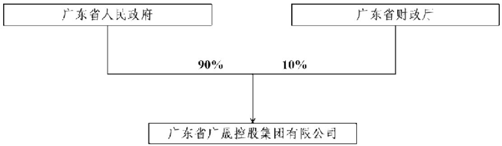

## （二）控股股东及实际控制人

发行人控股股东及实际控制人的具体情况如下：

截至本募集说明书出具之日，广东省人民政府持有公司 90%股权，为公司控股股东及实际控制人。广东省国资委代表广东省人民政府履行出资人的职责。

广东省国资委于 2004年 6月 26日正式挂牌成立，作为广东省人民政府的直属特设机构，代表其履行出资人的职责，按照管资产与管人、管事相结合，权力、义务和责任相统一的原则，行使资产的占有、使用、处分、收益的权力，更好地实现广东省国有资产的保值增值。

截至募集说明书出具之日，发行人控股股东及实际控制人持有的公司股份不存在质押或争议情形。

报告期内，发行人控股股东及实际控制人未发生变更。

## 四、发行人权益投资情况

## （一）发行人主要子公司情况

2024年度/末总资产、净资产、营业收入任一指标占发行人合并报表范围相应指标的比重达 30%的各级子公司包括深圳市中金岭南有色金属股份有限公司和广东省电子信息产业集团有限公司。

## 1、主要子公司基本情况及主营业务

## （1）深圳市中金岭南有色金属股份有限公司

该公司成立于 1984年 9月，前身是中国有色金属工业深圳公司。1997年 1月23日在深圳证券交易所上市，股票代码 000060.SZ。截至 2025年 6月末，该公司注册资本 373,760.18万元，发行人合计持有中金岭南 35.72%的股权。该公司主要经营范围：兴办实业（具体项目另行申报）；国内贸易（不含专营、专控、专卖商品）；经济信息咨询（不含限制项目）；经营进出口业务；在韶关市设立分公司从事采选、冶炼、制造、加工：有色金属矿产品、冶炼产品、深加工产品、综合利用产品(含硫酸、氧气、硫磺、镓、锗、电炉锌粉的生产)及包装物、容器（含钢提桶、塑料编织袋）(以上经营范围仅限于分支机构生产，其营业执照另行申报)；建筑材料、机械设备及管道安装、维修；工程建设、地测勘探、科研设计；从事境内外期货业务；成品油零售、过磅；房屋出租；收购、加工有色金属矿石；矿物及选矿药剂的计量、检验检测；质检技术服务。

## （2）广东省电子信息产业集团有限公司

该公司成立于 2000 年 10 月。截至 2025 年 6 月末，该公司注册资本116,200.00万元，发行人合计持有该公司100.00%的股权。该公司主要经营范围：电子信息技术产品和电器产品的研制、生产、销售，电子信息网络和计算机运营，电子计算机技术服务，设备、场地租赁服务；销售：电子计算机及配件，电子元件，电子器件，电器机械及器材；煤炭批发经营；合同能源管理服务，节能技术研发与咨询，节能设备制造与安装；停车场经营（经营地址：广州市天河区粤垦路 188号）；货物进出口；专业技术人员培训（仅限于分支机构经营）；技术服务。（依法须经批准的项目，经相关部门批准后方可开展经营活动）。

## 2、主要子公司财务情况

发行人主要子公司2024年度/末主要财务数据如下：

单位：万元

<table><tr><td>公司名称</td><td>资产</td><td>负债</td><td>所有者权益</td><td>收入</td><td>净利润</td><td>重大增减变动的情况及原因</td></tr><tr><td>深圳市中金岭南有色金属股份有限公司</td><td>4,583,650.27</td><td>2,824,878.77</td><td>1,758,771.50</td><td>5,986,236.24</td><td>132,080.37</td><td>不适用</td></tr><tr><td>广东省电子信息产业集团有限公司</td><td>3,625,042.83</td><td>1,464,501.82</td><td>2,160,541.01</td><td>1,060,141.82</td><td>5,895.39</td><td>净利润较上年下降44.51%,主要系2024年佛山照明对国星光电计提了商誉减值损失1.42亿元所致</td></tr></table>

## （二）发行人其他有重要影响的参股公司、合营企业和联营企业情况

2024年度/末，发行人持有的参股公司、合营企业和联营企业账面价值占发行人总资产比例超过 10%的，或获得的投资收益占发行人当年实现的营业收入超过10%的，为中国电信股份有限公司。

中国电信股份有限公司成立于 2002年9月，是广晟控股集团的重要参股公司。中国电信股份有限公司的经营范围为：基础电信业务：在全国范围内经营800MHzCDMA第二代数字蜂窝移动通信业务，CDMA2000第三代数字蜂窝移动通信业务，LTE/第四代数字蜂窝移动通信业务（TD—LTE/LTEFDD），第五代数字蜂窝移动通信业务，卫星移动通信业务，卫星固定通信业务，卫星转发器出租，出售业务。在北京，上海，江苏，浙江，安徽，福建，江西，湖北，湖南，广东，广西，海南，重庆，四川，贵州，云南，陕西，甘肃，青海，宁夏，新疆 21省（自治区，直辖市）经营固定网本地通信业务（含本地无线环路业务），固定网国内长途通信业务，固定网国际长途通信业务，互联网国际数据传送业务，国际数据通信业务，公众电报和用户电报业务，26GHz无线接入设施服务业务，国内通信设施服务业务。在南京，合肥，昆明，湖北，湖南，海南，四川，贵州，甘肃范围内经营 3.5GHz无线接入设施服务业务。增值电信业务：在北京，上海，江苏，浙江，安徽，福建，江西，湖北，湖南，广东，广西，海南，重庆，四川，贵州，云南，陕西，甘肃，青海，宁夏，新疆经营固定网国内数据传送业务，用户驻地网业务，网络托管业务，国内互联网虚拟专用网业务，互联网接入服务业务，在线数据处理与交易处理业务，存储转发类业务，国内呼叫中心业务，信息服务业务（不含移动网信息服务和互联网信息服务），无线数据传送业务，在全国经营国内甚小口径终端地球站通信业务，互联网数据中心业务，内容分发网络业务，国内多方通信服务业务，信息服务业务（仅限移动网信息服务），经营信息服务业务（仅限互联网信息服务），互联网域名解析服务业务。IPTV传输服务：服务内容为 IPTV集成播控平台与电视用户端之间提供信号传输和相应技术保障，传输网络为利用固定通信网络（含互联网）架设 IPTV信号专用传输网络，IPTV传输服务在限定的地域范围内开展。互联网地图服务。一般经营项目：经营与通信及信息业务相关的系统集成，技术开发，技术服务，技术咨询，信息咨询，设备及计算机软硬件等的生产，销售，安装和设计与施工；房屋租赁；通信设施租赁；安全技术防范系统的设计，施工和维修；广告业务。

2024年度/末中国电信股份有限公司主要财务数据如下：

单位：万元

<table><tr><td>公司名称</td><td>资产</td><td>负债</td><td>所有者权益</td><td>收入</td><td>净利润</td><td>重大增减变动的情况及原因</td></tr><tr><td>中国电信股份有限公司</td><td>86,662,520.07</td><td>41,007,339.75</td><td>45,655,180.33</td><td>52,356,892.00</td><td>3,297,502.47</td><td>不适用</td></tr></table>

## （三）发行人持股比例未达 50%但纳入合并报表范围的公司，以及持股比例大于50%但未纳入合并范围的公司

根据发行人经审计的财务报告，截至 2024年末，发行人持股比例大于 50%但未纳入合并范围的情况如下：

<table><tr><td>序号</td><td>企业名称</td><td>享有的表决权(%)</td><td>未纳入合并范围原因</td></tr><tr><td>1</td><td>广州安畅投资管理合伙企业(有限合伙)</td><td>88.42</td><td>债权投资,不享有控制权</td></tr><tr><td>2</td><td>广州风华明禾创业投资基金合伙企业(有限合伙)</td><td>50.05</td><td>无法控制投委会,不享受控制权</td></tr></table>

根据发行人经审计的财务报告，截至 2024年末，发行人持股比例小于 50%但纳入合并范围的情况如下：

<table><tr><td>序号</td><td>企业名称</td><td>享有的表决权(%)</td><td>纳入合并范围原因</td></tr><tr><td>1</td><td>广东金弘丰冶金科技发展有限公司</td><td>45.00</td><td>该单位的实际经营管理由广东省广晟冶金集团有限公司控制,有实际经营管理权</td></tr><tr><td>2</td><td>佛山电器照明股份有限公司</td><td>31.31</td><td>上市公司企业,广东省广晟控股集团有限公司持股8.38%,广东省电子信息产业集团有限公司持股8.54%,香港华晟控股有限公司持股12.74%,广晟投资发展有限公司持股1.65%,合计持股31.31%,董事会占多数,达到实质控股地位;佛山照明及其下属子公司均应纳入合并范围。</td></tr><tr><td>3</td><td>深圳市中金岭南有色金属股份有限公司</td><td>34.90</td><td>上市公司,达到实际控制,中金岭南及其下属子公司均应纳入合并范围。</td></tr><tr><td>4</td><td>广东风华高新科技股份有限公司</td><td>23.59</td><td>上市公司,达到实际控制,风华高科及其下属子公司均应纳入合并范围。</td></tr><tr><td>5</td><td>东江环保股份有限公司</td><td>24.09</td><td>上市公司,达到实际控制,东江环保及其下属子公司均应纳入合并范围。</td></tr><tr><td>6</td><td>广州市增城明珠农业有限公司</td><td>39.60</td><td>该单位的实际经营管理由广东永晟集团有限公司控制,有实际经营管理权</td></tr><tr><td>7</td><td>佛山市国星光电股份有限公司</td><td>6.37</td><td>上市公司企业,佛山电器照明股份有限公司持股8.58%,佛山市西格玛创业投资有限公司持股12.90%,合计持股21.48%,董事会占多数,达到实质控股地位,国星光电及其子公司均应纳入合并范围。</td></tr><tr><td>8</td><td>浙江沪乐电气设备制造有限公司</td><td>20.66</td><td>佛山照明持股66%,董事会占多数,达到实际控制。</td></tr><tr><td>9</td><td>广东国华新材料科技股份有限公司</td><td>45.82</td><td>风华高科持股45.82%,董事会占多数,达到实际控制。</td></tr><tr><td>10</td><td>广东高端元器件创新科技有限公司</td><td>45.72</td><td>风华高科持股45.72%,董事会占多数,达到实际控制。</td></tr><tr><td>11</td><td>广东骏基房地产开发有限公司</td><td>49.00</td><td>因广东骏基房地产开发有限公司原控股股东涉黑,2019年3月5日根据粤国资函[2019]267号文件由广东华建企业集团有限公司受托代管,有实际经营管理权,将其纳入合并范围</td></tr></table>

## （四）投资控股型架构相关情况

发行人为投资控股型公司，主要承担资产管理职能以及集团内部资金统筹安排，具体业务由各控股子公司负责经营。

关于受限资产，发行人母公司资产受限主要系质押其持有的子公司股权，截至 2025年 6月末，将持有的东江环保占总股本 2.01%的股票质押给中国建设银行进行质押融资，将持有的风华高科占总股本 6.79%的股票质押给国家开发银行进行质押融资。

关于资金拆借，截至 2025年 6月末，发行人母公司其他应收款项账面余额为 94.88亿元，主要是对子公司的内部拆借款。其中，截至 2025年 6月末，按欠款方归集的期末余额前五名的其他应收款情况如下：

单位：万元

<table><tr><td>债务人名称</td><td>款项性质</td><td>账面余额</td><td>账龄(年)</td><td>占其他应收款项合计的比例(%)</td><td>坏账准备</td></tr><tr><td>广晟(澳大利亚)控股有限公司</td><td>合并内关联方往来</td><td>340,507.81</td><td>3</td><td>22.31</td><td>340,507.81</td></tr><tr><td>广东省广晟香港控股有限公司</td><td>合并内关联方往来</td><td>300,000.00</td><td>3</td><td>19.65</td><td>0</td></tr><tr><td>广东省广晟香港能源投资(控股)有限公司</td><td>合并内关联方往来</td><td>208,083.39</td><td>2</td><td>13.63</td><td>208,083.39</td></tr><tr><td>广东省凯旋企业集团有限公司</td><td>合并内关联方往来</td><td>33,121.12</td><td>3</td><td>2.17</td><td>0</td></tr><tr><td>广晟投资发展有限公司</td><td>合并内关联方往来</td><td>10,269.31</td><td>3</td><td>0.67</td><td>0</td></tr><tr><td>合计</td><td>-</td><td>891,981.64</td><td>-</td><td>58.43</td><td>548,591.20</td></tr></table>

关于有息债务，截至 2025年 6月末，发行人母公司有息债务余额为 436.14亿元。

关于股权质押，发行人股东未将其持有的发行人股权进行质押。

关于子公司分红政策，发行人对上市子公司的分红政策有较强的控制力，上市子公司均于章程中对分红政策作出合理规定。上市子公司章程中对分红政策的规定主要包括：

<table><tr><td>公司名称</td><td>分红政策</td></tr><tr><td>中金岭南</td><td>公司的利润分配政策为:(一)公司实行持续、稳定的利润分配政策,公司的利润分配应重视对投资者的合理回报。(二)公司拟实施利润分配时应同时满足以下条件:1、当年度盈利。2、审计机构对公司的该年度财务报告出具标准无保留意见的审计报告。(三)在满足前款条件的情况下,公司采取现金方式或者现金与股票相结合的方式分配股利,具备现金分红条件的,公司应当优先采用现金分红进行利润分配。公司每年度进行一次现金分红,公司董事会可以根据公司盈利情况及资金状况提议公司进行中期现金分红。(四)股票股利分配的条件:若公司营业收入和净利润增长快速,且董事会认为公司处于发展成长阶段、净资产水平较高以及股票价格与公司股本规模不匹配时,可以在满足上述现金股利分配之余,提出并实施股票股利分配预案。(五)公司依据《公司法》等有关法律法规及《公司章程》的规定,在弥补亏损、足额提取法定公积金、任意公积金以后,每年以现金方式分配的利润不少于当年实现的可分配利润的10%,最近三年以现金方式累计分配的利润不少于该三年实现的年均可分配利润的30%。公司在确定以现金方式分配利润的具体金额时,应充分考虑未来经营活动和投资活动的影响,并充分关注社会资金成本、银行信贷和债权融资环境,以确保分配方案符合全体股东的整体利益。(六)公司董事会应当综合考虑所处行业特点、发展阶段、自身经营模式、盈利水平以及是否有重大资金支出安排等因素,区分下列情形,并按照本章程规定的程序,提出差异化的现金分红政策:1、公司发展阶段属成熟期且无重大资金支出安排的,进行利润分配时,现金分红在本次利润分配中所占比例最低应达到80%;2、公司发展阶段属成熟期且有重大资金支出安排的,进行利润分配时,现金分红在本次利润分配中所占比例最低应达到40%;3、公司发展阶段属成长期且有重大资金支出安排的,进行利润分配时,现金分红在本次利润分配中所占比例最低应达到20%;当本公司发展阶段不易区分但有重大资金支出安排的,可以按照前项规定处理。</td></tr><tr><td>风华高科</td><td>公司利润分配政策为:(一)公司应实施积极的利润分配政策并重视对投资者的合理回报。(二)公司将采取以现金分红为主的分红方式,亦可采取现金与股票相结合的分红方式,以及国家法律法规许可的方式分配股利。(三)公司采取现金方式分配利润,每年以现金方式分配的利润应不低于当年实现的可分配利润的15%。若公司最近三年以现金方式累计分配的利润少于最近三年实现的年均可分配利润的45%的,则不得向社会公众增发新股、发行可转换公司债券或向原股东配售股份。(四)现金分红需满足的条件:1、公司该年度实现的可分配利润(即公司弥补亏损、提取公积金后所余的税后利润)为正值;2、审计机构对公司该年度财务报告出具标准无保留意见的审计报告;3、公司在未来十二个月内无重大投资计划或重大现金支出等事项发生(募集资金项目除外)。重大投资计划或重大现金支出是指:公司未来十二个月内拟对外投资、收购资产或者购买设备的累计支出达到或者超过公司最近一期经审计总资产的30%,且超过5000万元人民币。(五)发放股票股利的条件在满足上述现金分红的条件下,公司经营情况良好,并且董事会认为公司股票价格与公司股本规模不匹配、发放股票股利有利于公司全体股东整体利益时,可以提出股票股利分配预案,并经股东大会审议通过后实施。(六)公司董事会可以根据公司盈利情况及资金需求状况建议公司进行年度分配或中期分配。(七)公司应严格按照有关规定在年报、半年报中披露利润分配预案和现金分红政策执行情况。若公司年度盈利但未提出现金分红预案,应在年报中详细说明未分红的原因、未用于分红的资金留存公司的用途和使用计划。监事会应对董事会和管理层执行公司利润分配政策和股东回报规划的情况及决策程序进行监督,并应对年度内盈利但未提出利润分配的预案,就相关政策、规划执行情况发表专项说明和意见。(八)若存在股东违规占用公司资金的,公司应当扣减该股东所获分配的现金红利,以偿还其占用的资金。</td></tr><tr><td>国星光电</td><td>公司利润分配政策为:(一)公司应实施积极的利润分配政策并重视对投资者的合理回报。(二)公司将采取以现金分红为主的分红方式,亦可采取现金与股票相结合的分红方式,以及国家法律法规许可的方式分配股利。(三)公司采取现金方式分配利润,每年以现金方式分配的利润应不低于当年实现的可分配利润的15%。若公司最近三年以现金方式累计分配的利润少于最近三年实现的年均可分配利润的45%的,则不得向社会公众增发新股、发行可转换公司债券或向原股东配售股份。(四)现金分红需满足的条件:1、公司该年度实现的可分配利润(即公司弥补亏损、提取公积金后所余的税后利润)为正值;2、审计机构对公司该年度财务报告出具标准无保留意见的审计报告;3、公司在未来十二个月内无重大投资计划或重大现金支出等事项发生(募集资金项目除外)。重大投资计划或重大现金支出是指:公司未来十二个月内拟对外投资、收购资产或者购买设备的累计支出达到或者超过公司最近一期经审计总资产的30%,且超过5000万元人民币。(五)发放股票股利的条件在满足上述现金分红的条件下,公司经营情况良好,并且董事会认为公司股票价格与公司股本规模不匹配、发放股票股利有利于公司全体股东整体利益时,可以提出股票股利分配预案,并经股东大会审议通过后实施。(六)公司董事会可以根据公司盈利情况及资金需求状况建议公司进行年度分配或中期分配。(七)公司应严格按照有关规定在年报、半年报中披露利润分配预案和现金分红政策执行情况。若公司年度盈利但未提出现金分红预案,应在年报中详细说明未分红的原因、未用于分红的资金留存公司的用途和使用计划。监事会应对董事会和管理层执行公司利润分配政策和股东回报规划的情况及决策程序进行监督,并应对年度内盈利但未提出利润分配的预案,就相关政策、规划执行情况发表专项说明和意见。(八)若存在股东违规占用公司资金的, 公司应当扣减该股东所分配的现金股利以偿还其占用的资金。</td></tr><tr><td>佛山照明</td><td>公司的利润分配政策为:(一)公司实行持续、稳定、积极的利润分配政策。利润分配应重视对投资者的合理投资回报兼顾公司的可持续发展;分配利润不得超过公司累计可分配利润的范围,不得损害公司的持续经营能力。(二)公司可以采取现金、股票或者现金和股票相结合的方式分配。A股和B股同股同权,同股同利。采用现金方式分配股利时,B股红利折成港币支付,折算率按股东大会决议日后的下一个营业日中国人民银行公布的港币现汇兑人民币的中间价计算。(三)公司利润分配不得超过累计可分配利润的范围。(四)公司可以进行中期现金分红。(五)公司发放股票股利应注重股本扩张与业绩增长保持同步。若公司利润增长快速,在满足上述现金股利分配之余,公司可以以股票方式分配股利。(六)利润分配方案由董事会拟定,董事会应根据当期的经营情况和项目投资的资金需求计划,在充分考虑股东利益的基础上,制定合理的利润分配方案。(七)独立董事应在利润分配方案提交董事会审议前,就利润分配的提案提出明确意见。(八)利润分配方案经过上述程序后,由董事会报请股东大会批准。公司切实保障社会公众股股东参与股东大会的权利,董事会、独立董事和符合一定条件的股东可以在股东大会召开前向公司公众股股东征集其在股东大会上的投票权,但不得采取有偿或变相有偿方式进行征集。独立董事行使上述职权应当取得全体独立董事的二分之一以上同意。(九)股东大会对现金分红方案进行审议时,应当通过多种渠道与股东(特别是中小股东)进行沟通与交流,充分听取中小股东的意见和诉求,除安排在股东大会上听取股东的意见外,还通过股东热线电话、投资者关系互动平台等方式与股东特别是中小股东进行沟通和交流,及时答复中小股东关心的问题。(十)公司董事会应在年度报告、半年度报告中披露利润分配方案。若公司当年盈利,董事会未做出现金利润分配方案的,在当年的定期报告中披露未进行现金分红的原因,未用于现金分红的资金留存公司的用途和使用计划,独立董事应当对此发表独立意见。(十一)公司根据生产经营情况、投资规划和长期发展等需要确需调整利润分配政策的,调整后的利润分配政策不得违反中国证监会和深圳证券交易所的有关规定,有关调整利润分配政策的议案应事先征求独立董事及监事会意见并经公司董事会审议后提交公司股东大会审议,由出席股东大会的股东所持表决权的2/3以上通过方可实施。</td></tr><tr><td>东江环保</td><td>公司的利润分配政策为:(一)利润分配的原则:公司实行持续、稳定的利润分配政策,公司的利润分配应重视对社会公众投资者的合理投资回报,以可持续发展和维护股东权益为宗旨,保持利润分配政策的连续性和稳定性,并符合法律、法规的有关规定。公司利润分配不得超过累计可分配利润的范围,不得损害公司持续经营能力。(二)利润分配的程序:公司董事会应结合公司盈利情况、资金需求和股东回报规划提出合理的分红建议和预案,由独立董事及监事会进行审核并出具书面意见,经董事会审议通过后提请股东大会审议。(三)利润分配的形式:公司可以采取现金、股票、现金及股票相结合或者法律、法规允许的其他方式分配利润,但优先采用现金分红的利润分配方式。(四)现金分红的比例及时间间隔:在符合利润分配原则、保证公司正常经营和长远发展的前提下,公司原则上每年年度股东大会召开后进行一次现金分红,公司董事会可以根据公司的盈利状况及资金需求状况提议公司进行中期现金分红。在满足现金分红条件时,每年以现金方式分配的利润应不低于当年实现的可分配利润的20%,且任何三个连续年度内,公司以现金方式累计分配的利润不少于该三年实现的年均可分配利润的30%。(五)现金分红的条件:1、公司该年度实现的可分配利润(即公司弥补亏损、提取公积金后所余的税后利润)为正值、现金流充裕且合并报表经营活动产生的现金流量净额为正数,实施现金分红不会影响公司后续持续经营;2、审计机构对公司的该年度财务报告出具标准无保留意见的审计报告;3、公司无重大投资计划或重大现金支出等事项发生(募集资金项目除外)。重大投资计划或重大现金支出是指:公司未来十二个月内拟对外投资、收购资产或者购买设备的累计支出达到或者超过公司最近一期经审计总资产的50%,同时存在账面值和评估值的,以高者为准。4、公司董事会应当综合考虑所处行业特点、发展阶段、自身经营模式、盈利水平以及是否有重大资金支出安排等因素,区分下列情形,并按照本章程规定的程序,提出差异化的现金分红政策:(1)公司发展阶段属成熟期且无重大资金支出安排的,进行利润分配时,现金分红在本次利润分配中所占比例最低应达到80%;(2)公司发展阶段属成熟期且有重大资金支出安排的,进行利润分配时,现金分红在本次利润分配中所占比例最低应达到40%;(3)公司发展阶段属成长期且有重大资金支出安排的,进行利润分配时,现金分红在本次利润分配中所占比例最低应达到20%;公司发展阶段不易区分但有重大资金支出安排的,按照前项规定处理。(六)股利分配的条件:在满足上述现金分红条件情况下,公司将积极采取现金方式分配股利,原则上每年度进行一次现金分红。在保证公司股本规模和股权结构合理的前提下,基于回报投资者和分享企业价值考虑,当公司股票估值处于合理范围内,公司可以发放股票股利;(七)利润分配的决策程序和机制:公司每年利润分配预案由公司管理层、董事会结合公司章程的规定、盈利情况、资金需求情况,并充分考虑股东特别是中小投资者、独立董事和监事的意见后提出、拟订,独立董事及监事会应对利润分配预案发表明确意见并随董事会决议一并公开披露。利润分配预案经董事会审议通过后提交股东大会批准。股东大会对现金分红具体方案进行审议时,应当通过多种渠道主动与股东特别是中小股东进行沟通和交流,充分听取中小股东的意见和诉求,并及时答复中小股东关心的问题。(八)利润分配的信息披露原则:1、公司应严格按照有关规定在定期报告中详细披露现金分红政策的制定及执行情况,说明是否符合公司章程的规定或者股东大会决议的要求。2、公司当年盈利,董事会未做出年度现金利润分配预案的,应当在定期报告中披露未分红的原因、未用于分红的资金留存公司的用途,独立董事、监事应当对此发表独立意见;公司董事会未做出年度现金利润分配预案,或者现金方式分配的利润少于当年实现的可分配利润的百分之二十,公司召开股东大会审议该年度利润分配的议案时,应当提供网络投票表决方式为股东参加股东大会提供便利;(九)利润分配政策的调整原则:公司根据生产经营情况、投资规划和长期发展的需要确需调整利润分配政策时,有关调整利润分配政策的议案需经公司董事会审议后提交公司股东大会,并经出席股东大会的股东所持表决权的2/3以上通过。公司同时应提供网络投票方式以方便广大中小投资者参与股东大会的表决,独立董事、监事会应当对此发表独立意见,且调整后的利润分配政策不得违反中国证监会和公司上市的证券交易所的有关规定。</td></tr></table>

关于报告期内实际分红，2022-2024年及 2025年 1-6月，发行人母公司取得投资收益收到的现金分别为 22.82亿元、16.38亿元、20.89亿元和9.46亿元。

发行人主要资产和业务集中于下属上市公司，剔除下属上市公司（包括中金岭南、东江环保、风华高科和佛山电器照明股份有限公司（“佛山照明”））后2024年度/末主要财务数据如下：

单位：亿元

<table><tr><td>2024年度/末</td><td>合并口径</td><td>剔除后</td></tr><tr><td>总资产</td><td>1,786.95</td><td>881.68</td></tr><tr><td>总负债</td><td>1,213.22</td><td>750.67</td></tr><tr><td>净资产</td><td>573.73</td><td>131.01</td></tr><tr><td>营业收入</td><td>1,026.26</td><td>253.40</td></tr><tr><td>经营活动产生的现金流量净额</td><td>46.11</td><td>26.39</td></tr></table>

注：上述剔除为简单算术计算，不考虑合并抵消。

由上可见，发行人母公司资产质量良好，拥有合理的盈利能力，能有效控制子公司分红，实际获得分红金额充裕，投资控股型架构对自身偿债能力不会造成重大不利影响。

## 五、发行人的治理结构及独立性

## （一）发行人的治理结构、组织机构及内部管理制度设置和运行情况

发行人的组织结构图如下：

广东省广晟控股集团有限公司组织架构图  
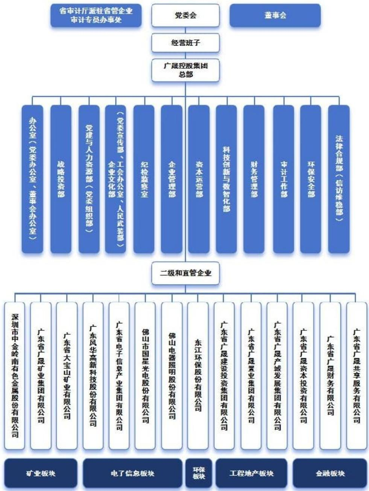

发行人已按照《公司法》等要求，制定了公司章程，建立和完善了规范的法人治理结构，设置了合理的组织机构，制定了包括财务管理、信息披露事务管理、关联交易等多项内部管理制度，目前发行人治理结构、组织机构和内部管理制度运行正常。逐步形成科学的决策机制、执行机制和监督机制，能够有效维护公司和债权人的合法权益。

报告期内，发行人不存在特殊或运行异常的应详细披露及说明的情形。

发行人根据《公司法》对公司章程进行了修订，按照修订后的公司章程，发行人不设监事会、监事，由董事组成的审计、合规与风险管理委员会行使相关职权。

## （二）发行人的独立性

发行人严格按照《公司法》《证券法》等有关法律、法规和公司章程的要求规范运作，与控股股东及实际控制人在资产、人员、机构、财务、业务经营等方面均保持独立性，不存在影响公司自主经营能力的情况。

## 六、现任董事和高级管理人员的基本情况

## （一）基本情况

截至本募集说明书签署日，发行人董事及高级管理人员基本情况如下：

<table><tr><td>姓名</td><td>现任职务</td><td>任期</td><td>设置是否符合《公司法》等相关法律法规及公司章程相关要求</td><td>是否存在重大违纪违法情况</td></tr><tr><td>吕永钟</td><td>党委书记、董事长</td><td>2023年6月至今</td><td>是</td><td>否</td></tr><tr><td>刘立斌</td><td>党委副书记、董事、总经理</td><td>2026年3月至今</td><td>是</td><td>否</td></tr><tr><td>汪东兵</td><td>党委副书记、董事、工会主席</td><td>2021年1月至今</td><td>是</td><td>否</td></tr><tr><td>罗健凯</td><td>董事</td><td>2024年1月至今</td><td>是</td><td>否</td></tr><tr><td>贾颖伟</td><td>董事</td><td>2019年8月至今</td><td>是</td><td>否</td></tr><tr><td>黄冬林</td><td>董事</td><td>2019年6月至今</td><td>是</td><td>否</td></tr><tr><td>彭燎原</td><td>董事</td><td>2019年6月至今</td><td>是</td><td>否</td></tr><tr><td>蓝汝宁</td><td>党委委员、副总经理</td><td>2024年9月至今</td><td>是</td><td>否</td></tr><tr><td>郑任发</td><td>党委委员、副总经理</td><td>2022年3月至今</td><td>是</td><td>否</td></tr><tr><td>苏权捷</td><td>党委委员、副总经理</td><td>2022年3月至今</td><td>是</td><td>否</td></tr><tr><td>吴圣辉</td><td>党委委员、副总经理</td><td>2023年12月至今</td><td>是</td><td>否</td></tr><tr><td>万山</td><td>党委委员、副总经理</td><td>2025年6月至今</td><td>是</td><td>否</td></tr></table>

2022年初，发行人董事和高级管理人员合计 10名，报告期内，该等董事和高级管理人员中 6名离任，新增 7名。该等变动主要原因为控股股东广东省人民政府任命安排，是正常人事调动，对自身组织机构运行无重大不利影响。

## （二）发行人董事和高级管理人员违法违规情况和严重失信情况

截至本募集说明书签署日，发行人董事和高级管理人员均不存在重大违法违规情况和严重失信情况。

## 七、发行人主营业务情况

## （一）所在行业概况

## 1、有色金属业

有色金属行业属于国家大力扶持的战略性行业之一，此行业不仅关系到国家经济建设，而且在提高战略产品技术，升级现代产品和提高居民生活质量上扮演着重要角色。有色金属属于不可再生的稀有资源，作为重要的生产和生活资料，其需求变化主要取决于国民经济的发展速度，尤其是作为国民经济支柱的工业的发展速度。有色金属工业是资源密集型产业，产业发展受矿产资源、能源供应条件及环境承载能力的限制。近年来，有色金属行业快速发展，形成上下游贯通的完整产业链，重点品种冶炼及压延加工产能产量全球过半，冶炼技术成熟，单位产品能耗和污染物排放达到国际先进水平。

## （1）行业政策

2021年 12月，工信部、科技部、自然资源部联合发布《“十四五”原材料工业发展规划》，围绕发展目标，从供给水平、产业结构、绿色低碳、数字转型、产业安全等 5个方面，提出了高端化、合理化、绿色化、数字化、安全化等“五化”重点任务。

2022年 11月，工信部、发改委、生态环境部联合发布《有色金属行业碳达峰实施方案》（简称《碳达峰方案》），指出到 2025年再生铜、再生铝产量分别达到 400万吨、1,150万吨，再生金属供应占比达 24%以上；确保 2030年前有色金属行业实现碳达峰；加快产业数字化转型，推进重点领域智能矿山和智能工厂建设，探索运用工业互联网、云计算、第五代移动通信（5G）等技术加强对企业碳排放在线实时检测。《碳达峰方案》有助于全行业统一思想、提高认识，加快绿色低碳转型，确保2030年实现碳达峰。

2023 年 3 月，工信部发布《有色金属行业智能制造标准体系建设指南（2023版）》（简称“《指南》”），提出到 2025年，基本形成有色金属行业智能制造标准体系，智能制造标准有色金属行业体系建设的核心包括“CIA基础综合”、“CIB装备与系统”、“CIC智能工厂”、“CID评价”等四个部分，体现相应标准在有色金属行业采选、冶炼和加工领域的落地应用。《指南》明确了有色金属行业智能制造标准体系结构和有色金属行业智能制造标准体系框架。

2024年 5月 23日，国务院印发《2024-2025年节能降碳行动方案》，《行动方案》在有色金属行业节能降碳行动方面提出三项重要任务。一是优化有色金属产能布局。严格落实电解铝产能置换，从严控制铜、氧化铝等冶炼新增产能，合理布局硅、锂、镁等行业新增产能。大力发展再生金属产业。到 2025年底，再生金属供应占比达到 24%以上，铝水直接合金化比例提高到 90%以上。二是严格新增有色金属项目准入。新建和改扩建电解铝项目须达到能效标杆水平和环保绩效 A级水平，新建和改扩建氧化铝项目能效须达到强制性能耗限额标准先进值。新建多晶硅、锂电池正负极项目能效须达到行业先进水平。三是推进有色金属行业节能降碳改造。推广高效稳定铝电解、铜锍连续吹炼、竖式还原炼镁、大型矿热炉制硅等先进技术，加快有色金属行业节能降碳改造。到2025年底，电解铝行业能效标杆水平以上产能占比达到 30%，可再生能源使用比例达到 25%以上；铜、铅、锌冶炼能效标杆水平以上产能占比达到 50%；有色金属行业能效基准水平以下产能完成技术改造或淘汰退出。2024-2025年，有色金属行业节能降碳改造形成节能量约 500万吨标准煤、减排二氧化碳约 1,300万吨。

## （2）行业运行现状

2023年我国有色金属行业克服宏观环境不利影响，把握国内和国际市场复苏机遇，持续深化供给侧结构性改革，保障产业链供应链有效供给，加快推进传统产业智能化、绿色化、高端化。2023年我国光伏、风电、新能源汽车、动力及储能电池等产量，国内新能源装机量、以及上述领域产品出口量均大幅度增长，成为拉动铜、铝、锌等有色金属消费主要增长领域。

生产保持平稳。据国家统计局数据，2024年，有色金属行业工业增加值同比增长8.9%，增幅较工业平均水平高 2.9个百分点。十种有色金属产量为 7,919万吨，同比增长 4.3%。其中，精炼铜产量 1,364万吨，同比增长 4.1%；电解铝产量 4,400万吨，同比增长 4.6%。价格出现分化。2024年，铜、铅现货均价分别为 73,182 元/吨、17,249 元/吨，同比分别增长 6.9%、10.4%；铝、锌现货均价分别为 20,110 元/吨、25,939 元/吨，同比分别增加 4.3%、14.0%。

矿产品进口增长，铝产品出口同比下降。2024年，有色金属进出口贸易总额 3,687.9亿美元，同比增长 11.4%。进口方面，铜精矿、铝土矿进口实物量分别为 2,800 万吨、15,545,998.38 吨，同比分别增长 1.5%、34.36%；出口方面，未锻轧铝及铝材出口量666.5万吨，同比增长17.4%。

2024年，有色金属工业完成固定资产投资比上年增长 24.7%。2024年，光伏、风电、动力及储能电池、新能源汽车等所需有色金属材料投资及有色金属矿山投资增幅较快，是拉动有色金属工业固定资产投资增长的重要因素。

## （3）行业发展前景

《有色金属行业碳达峰实施方案》提出，为实现有色金属行业碳达峰目标，到2030年，我国要建立起资源循环型产业体系，大幅提高再生资源利用效率，再生资源对原生资源的替代比例将进一步提高，循环经济对资源安全的支撑保障作用进一步凸显。其中，有色金属行业是实现双碳目标的重要推手，在清洁能源的生产、存储和应用方面，有色金属将扮演重要的角色，对坚持走资源循环利用之路，大力发展循环经济对保障国家资源安全，推动实现碳达峰、碳中和，促进生态文明建设具有重大意义。面对碳达峰、碳中和的新形势，发展循环经济、提高资源利用效率和再生资源利用水平的需求十分迫切，且空间巨大。有色金属行业需加快行业自身绿色转型升级，推广应用智能制造和“互联网+”，采用科技手段减少碳排放和增加碳的使用量；在重点领域，开展数字化生产、智能制造示范工厂试点，提升研发、生产和服务的智能化水平，提高产品性能稳定性和质量一致性；要鼓励业态创新和模式创新，促进“互联网+”与生产经营全过程融合，推广个性化定制、柔性化制造，满足多样化、多层次需求。

供给方面，由于国内环保政策逐渐趋严，企业环保投入不断增加，行业准入门槛逐步提高，有色金属行业产能提升空间有限，短期内产量释放难度较大。

需求方面，工业金属呈现高性能、高精度、低能耗的发展趋势，随着新能源等新兴产业的快速发展，市场对部分工业金属的需求量将会显著增长，而需求结构也将随之发生明显变化。

我国工业金属矿产资源存在不同程度的对外依赖，近年来，国家出台了多项政策鼓励再生有色金属产业发展，有利于降低对外依存度，提高资源综合利用率，推进我国“双碳”目标实现。此外，近些年，国内部分矿企开始积极走出国门，开展海外矿产资源并购，进行全球化资源布局，行业国际化进程正在加快。

## 2、电子信息产业

电子信息产业是我国经济最具活力、最具创新的行业之一。上世纪 90年代开始电子信息产业的增速就超前于国民经济发展，拉动国民经济的发展，成为国民经济基础性、先导性、战略性、支柱性产业，成为我国抢占国际经济制高点的重要引擎。随后，电子信息产业在全球互联网发展浪潮的推动下，依靠科技进步走出了一条市场主导，政府推动，引进、消化、吸收、不断创新之路，取得了跨越式发展。

## （1）行业政策

2023年 8月 10日，工信部印发《电子信息制造业 2023—2024年稳增长行动方案》，2023—2024年计算机、通信和其他电子设备制造业增加值平均增速5%左右，电子信息制造业规模以上企业营业收入突破 24万亿元。2024年，我国手机市场 5G手机出货量占比超过 85%，75英寸及以上彩色电视机市场份额超过 25%，太阳能电池产量超过 450吉瓦，高端产品供给能力进一步提升，新增长点不断涌现；产业结构持续优化，产业集群建设不断推进，形成上下游贯通发展、协同互促的良好局面。

## （2）行业运行现状

2024年我国电子信息制造业整体运行良好，生产、出口、效益和投资等多项指标均表现出积极趋势。

生产恢复向好。2024年，规模以上电子信息制造业增加值同比增长 11.8%，增速分别比同期工业高6个百分点，比高技术制造业高 2.9个百分点。12月份，规模以上电子信息制造业增加值同比增长 8.7%。2024年，主要产品中，手机产量 16.7亿台，同比增长 7.8%，其中智能手机产量 12.5亿台，同比增长 8.2%；微型计算机设备产量 3.4亿台，同比增长 2.7%；集成电路产量 4,514亿块，同比增长 22.2%。

出口有所增加。2024年，规模以上电子信息制造业出口交货值同比增长1.3%，高于同期工业增长水平。12月份，规模以上电子信息制造业出口交货值同比增长 2.2%。据海关统计，2024年，我国出口笔记本电脑 1.3亿台，同比增长 1.5%；出口手机 15.04亿台，同比增长 8.9%；出口集成电路 3953亿个，同比增长 23.1%。效益逐步恢复。2024年，规模以上电子信息制造业实现营业收入 16.19万亿元，同比增长 7.3%；营业成本 14.11万亿元，同比增长 7.5%；实现利润总额6,408亿元，同比增长3.4%；营业收入利润率为4.0%。

投资平稳增长。2024年，电子信息制造业固定资产投资同比增长 13.2%，比同期工业投资增速高0.9个百分点。

多区域营收实现增长。2024年，规模以上电子信息制造业东部地区实现营业收入 113,595亿元，同比增长 10.1%；中部地区实现营业收入 26,949亿元，同比增长 6.2%；西部地区实现营业收入 20,494亿元，同比下降 3.8%；东北地区实现营业收入 897.8亿元，同比下降 12.4%。四个地区电子信息制造业营业收入占全国比重分别为 70.2%、16.6%、12.7%和 0.6%。2024年，规模以上电子信息制造业京津冀地区实现营业收入 6,921亿元、同比增长 16.6%，营收占全国比重 5.3%；长三角地区实现营业收入 36,751亿元、同比增长 7.5%，营收占全国比重 28.4%。

预计随着 2024年 AI、数字化技术在电子设备、新能源汽车等领域广泛应用，电子信息产业将持续回暖。

## （3）行业发展前景

随着智能制造技术的不断发展，未来的电子元器件制造将更加智能化、自动化。这将提高生产效率、降低成本，同时也对企业的技术水平提出了更高的要求。因此，拥有技术实力和自动化生产能力的企业将更具竞争力。随着 5G、物联网、人工智能等新兴技术的不断发展，电子元器件的需求也将不断增长。这些领域的发展将带来巨大的商业机会，同时也需要企业不断加强技术研发，提高产品品质和服务水平。

## 3、环保行业

《第十四个五年规划和 2035年远景目标纲要》明确提出，要坚持绿水青山就是金山银山理念，通过提升生态系统质量和稳定性，完善生态文明领域统筹协调机制，持续改善环境质量，推动经济社会发展全面绿色转型，建设美丽中国。“十四五”期间，我国环境产业仍处于战略发展机遇期，科技创新、产业变革、乡村振兴、绿色发展、区域合作升级等都将全面利好环境产业，环保投资有望继续爆发式增长，市场前景广阔。

发改委等 12部门印发《促进工业经济平稳增长的若干政策的通知》，明确提出推动废钢、废有色、废纸等再生资源综合利用，提高“城市矿山”对资源的保障能力。同步地，“无废城市”步入快速复制阶段，从 2019年的 11+5城市试点，到 2022年的发改委等 18部门要求建设百余座无废城市。我们观测到国家对城市再生资源利用的重视程度持续提升，对应的，泛再生资源（动力电池回收、金属危废资源化、塑料再生、废电拆解、汽车拆解）、固废处置（垃圾焚烧发电、餐厨处置提油）均为重点方向，将成为“城市矿山”和“无废城市”的核心载体。

国务院办公厅发布《强化危险废物监管和利用处置能力改革实施方案》指出应推动省域内危险废物处置能力与产废情况总体匹配；促进危险废物利用处置产业高质量发展，鼓励企业通过兼并重组等方式做大做强，开展专业化建设运营服务。2023年以来，多地出台了多项利好环保产业发展的政策，包括加快补齐县级地区生活污水处理设施的短板、提升环境基础设施建设水平等。此外，工业和信息化部、生态环境部编制发布了《国家鼓励发展的重大环保技术装备目录（2023年版）》，旨在加快先进环保技术装备的研发和推广应用，提升环保装备制造业的整体水平和供给质量。

目前我国环保行业已经形成了充分竞争的市场格局，行业发展呈现以下特点：

一是污染防治攻坚战已进入“深化”阶段。“十四五”规划提出，扎实做好碳达峰、碳中和各项工作，优化产业结构和能源结构，坚持源头防治、综合施策，强化多污染物协同控制和区域协同治理，以主要产业基地为重点布局危险废弃物集中利用处置设施，全面提升环境基础设施水平。生态环境部提出，要着力构建源头治理、系统治理、整体治理的生态环境保护工作格局，将更加注重源头预防和源头治理，更加突出精准治污、科学治污、依法治污。

二是行业竞争已进入白热化阶段。截至 2023年底，全国危险废物许可证持证单位核准收集和利用处置能力达到 2.31亿吨/年，同比增长 10%，实际收集和利用处置量为 1.10亿吨，同比增长 9.6%，实际产能利用率约为 35%，其中：资源化利用 4390万吨，同比增长 15%；填埋 2195万吨，同比增长 10%；焚烧2195万吨，同比增长 12%；水泥窑协同处置 1097万吨，同比增长 20%。尽管行业处置能力较 2019年增长近80%，但产能利用率仍处于较低水平，反映出当前危废行业产能整体过剩、区域错配现象依然存在，部分领域如废矿物油利用、废包装桶清洗等产能利用率不足 15%，低价竞争导致行业利润率持续承压。

三是综合环境服务模式成为迫切需要，源头治理需求凸显。随着绿色低碳循环发展、“无废城市”等宏观发展布局不断深入，我国将重点构建集污水、垃圾、固废、危废、医废处理处置设施和监测监管能力于一体的环境基础设施体系，并推行生产企业“逆向回收”等模式，建立健全线上线下融合、流向可控的资源回收体系。尤其是源头治理的主流需求将推动行业发生结构性变化，固废危废企业和产废企业将持续加强在源头实施减量化和资源化的业务比重和资源方面的投入。

四是技术创新驱动和项目运营能力成为关键竞争力。当前环保行业正处于深度变革期，随着监管趋严，行业标准提升，大批项目投入运营，行业竞争格局面临重塑。从投建阶段转入运营阶段以及竞争加剧都是环保行业发展的必然趋势，给整个环保产业带来多重挑战。环保企业将逐步由投资型产业转向技术型和运营型产业，技术驱动能力和项目运营能力将占据更显著的位置，坚持科技创新是环保企业未来发展的关键战略举措。

2023年以来，环保行业在政策支持、市场需求增长、技术创新等方面均展现出积极的发展态势。预计未来行业竞争将有望逐步缓解，危废处置行业格局将得以重塑。

## 4、工程地产

## （1）建筑业

建筑业是国民经济的物质生产部门，是其它各行业赖以发展的基础性产业。近年来随着国民经济的持续高速发展，建筑业也得到了快速发展。1978年以来，建筑市场规模不断扩大，成为拉动国民经济快速增长的重要力量。

据国家统计局公布的数据显示，2024年全年国内生产总值1,349,084亿元，按不变价格计算，比上年增长 5.0%。分产业看，第一产业增加值 91,414亿元，比上年增长 3.5%；第二产业增加值 492,087亿元，增长 5.3%；第三产业增加值765,583亿元，增长 5.0%。分季度看，一季度国内生产总值同比增长 5.3%，二季度增长 4.7%，三季度增长 4.6%，四季度增长 5.4%。从环比看，四季度国内生产总值增长 1.6%。全部工业增加值 405,442亿元，比上年增长 5.7%。规模以上工业增加值增长5.8%。

2024 年，全国建筑业企业完成建筑业总产值 326,501.11 亿元，同比增长3.85%；完成竣工产值 135,238.80 亿元，同比下降 1.65%；签订合同总额727,219.17 亿元，同比下降 0.22%，其中新签合同额 337,500.52 亿元，同比下降5.29%；房屋建筑施工面积 136.83亿平方米，同比减少 10.62%；房屋建筑竣工面积 34.37亿平方米，同比减少 12.63%；实现利润 7,513亿元，按可比口径计算比上年下降9.8%。截至2024年底，全国有施工活动的建筑业企业168,011个，同比增长 5.57%；直接从事生产经营活动的平均人数 5,962.07万人，同比减少12.26%；按建筑业总产值计算的劳动生产率为547,630元/人，同比提高15.15%。

## （2）房地产业

我国房地产行业宏观管理的职能部门主要包括国家住房和城乡建设部、自然资源部、商务部、国家发改委及央行等部门。住房和城乡建设部主要负责规范住房和城乡建设管理秩序，制定和发布工程建设行业标准，研究拟订城市建设的政策等；自然资源部主要负责土地资源的规划、管理、保护与合理利用；商务部主要负责外商投资国内房地产市场的监管、审批及相关政策的制定；国家发改委主要负责综合研究拟订房地产发展政策，进行总量平衡，宏观调控房地产行业改革与发展；央行主要负责房地产信贷相关政策的制定。地方政府对房地产行业管理的机构主要为地方发展和改革委员会、各级建设委员会、自然资源部、房屋交易和管理部门及规划管理部门，其机构设置和具体管理职能大致相同但存在一定的地区差异性。

目前，我国房地产行业管理体制主要分为对房地产开发企业的资质管理和对房地产开发项目的审批管理两个方面。

房地产开发企业的资质管理，统一由住建部负责。根据住建部《房地产开发企业资质管理规定》，未取得房地产开发资质等级证书的企业，不得从事房地产开发经营业务；各资质等级企业应当在规定的业务范围内从事房地产开发经营业务，不得越级承担业务。其中，一级资质的房地产开发企业承担房地产项目的建设规模不受限制，可以在全国范围内承揽房地产开发项目；二级资质及以下的房地产开发企业可以承担建筑面积 25万平方米以下的开发建设项目，承担业务的具体范围由省、直辖市、自治区人民政府建设行政主管部门确定。

房地产开发项目的审批管理，不同环节由不同行政部门进行审批监管。由于各城市的机构设置和各管理部门的具体管理职能并非完全一致，房地产开发项目的审批管理存在一定的地区差异性。

自上世纪 90年代以来，随着福利分房政策的退出和住房货币化的推广，在国家积极的财政政策刺激之下，全国房地产固定投资快速增长，房地产投资占全国 GDP的比例逐年上升。2000年以来，我国城市化进程进入加速发展的阶段，城镇居民的收入水平持续提升，借助良好的经济形势，国内房地产行业也得到飞速发展，在国民经济中占据了重要地位，房地产市场整体表现活跃，房产价格与销售量快速增长，各地市场全面扩张。2005年以后，为了促进房地产行业健康有序的发展，国家推出了一系列行业调控政策，这些政策对行业产生了较为显著的影响，房地产行业在整体保持快速增长的同时出现了阶段性的波动。在房地产宏观调控下，市场出现一定程度的回调，其后整个市场处于平稳发展态势。

2022年末，房企融资政策迎来转向，纾困方向从此前“救项目”转换至“救项目与救企业并存”，为楼市全面解绑。进入2023年，先后有多个部门陆续强调，要促进金融与房地产正常循环、落实“金融16条”等。2023年下半年，房企融资面利好政策力度持续加大，尤其是民营房企的融资支持力度不断加大。7月 10日人民银行、金融监管总局发布通知，将此前《关于做好当前金融支持房地产市场平稳健康发展工作的通知》的适用期限延长至 2024年 12月 31日。7月 19日中共中央、国务院发布《关于促进民营经济发展壮大的意见》，围绕民营经济提出 31条措施，包含了完善融资支持政策制度、完善市场化重整机制、鼓励民营企业盘活存量资产回收资金等。10月中央金融工作会议强调，促进金融与房地产良性循环，一视同仁满足不同所有制房地产企业合理融资需求等。

2023年 12月 11日召开的中央经济工作会议明确指出，要在积极稳妥化解房地产风险的基础上，加快构建房地产发展新模式。其中，保障性住房建设、“平急两用”公共基础设施建设、城中村改造等“三大工程”的推进成为主要任务。之后化解房地产风险仍是政策主线，供需两端政策均有发力空间。需求端，降低购房成本、降低购房门槛仍是政策优化聚焦点；供给端，企业资金支持政策有望继续细化落实，各地土拍规则或继续放宽，“保交楼”资金和配套举措有望进一步跟进，为房地产行业的稳定提供新的支持。

根据国家统计局公布数据，房地产开发投资方面，2024年，全国房地产开发投资100,280亿元，比上年下降10.6%（按可比口径计算）；其中，住宅投资76,040 亿元，下降 10.5%。2024 年，房地产开发企业房屋施工面积 733,247 万平方米，比上年下降 12.7%。其中，住宅施工面积 513,330 万平方米，下降13.1%。房屋新开工面积 73,893万平方米，下降 23.0%。其中，住宅新开工面积53,660万平方米，下降23.0%。房屋竣工面积73,743万平方米，下降27.7%。其中，住宅竣工面积53,741万平方米，下降27.4%。

商品房销售和待售方面，2024年，新建商品房销售面积 97,385万平方米，比上年下降12.9%，其中住宅销售面积下降14.1%；商品房销售额96,750亿元，下降 17.1%，其中住宅销售额下降 17.6%。2024年末，商品房待售面积 75,327万平方米，比上年末增长10.6%。其中，住宅待售面积增长16.2%。

房地产开发企业到位资金方面，2024 年，房地产开发企业到位资金107,661 亿元，比上年下降 17.0%。其中，国内贷款 15,217 亿元，下降 6.1%；利用外资 32亿元，下降 26.7%；自筹资金 37,746亿元，下降 11.6%；定金及预收款 33,571亿元，下降 23.0%；个人按揭贷款 15,661亿元，下降 27.9%。

## （二）公司所处行业地位

广晟控股集团是广东省属国有独资重点企业，经过 25年的改革发展，广晟控股集团已成长为以矿产资源、电子信息为主业，环保、工程地产、金融协同发展的大型跨国企业集团，入选国务院国资委国企改革“双百企业”名单。截至2024年底，广晟控股集团资产总额1786.9亿元；全年实现营业收入1027.4亿元、利润总额 38.3亿元，净利润 29.8亿元。目前，广晟控股集团控股 5家上市公司（中金岭南、风华高科、国星光电、佛山照明、东江环保），是中国电信、中国稀土等 2家上市公司的第二大股东；现有员工 5万余人，其中海外员工 5000多人，中共党员 6000多人；位居 2024中国企业 500强第 203位、中国战略性新兴产业领军企业100强第29位、中国跨国公司100大第88位。

## （三）公司面临的主要竞争状况

公司资源按产业集聚，结构按产业链模式衍生，逐步形成了四大比较优势。

## 1、资源优势

公司所属全资或控股有色金属企业，从资源的占有、矿种的齐全到产量、产值和利润水平等多方面，都处在广东省同行业中的首位。公司在广东省政府的大力支持下，已成为广东省促进资源优化升级的重要平台，控制的矿产资源分布在 4大洲 9个国家。控股上市公司中金岭南在中国、澳大利亚、多米尼加拥有 4座矿山，掌控已探明的铅、锌、铜以及“三稀”等有色金属资源金属量超千万吨，潜在价值超千亿元。

## 2、技术优势

截至 2024年末，广晟控股集团共有高新技术企业 62家、专精特新企业 41家（含 3家国家级“小巨人”企业）、制造业单项冠军企业 10家（含 2家国家级），拥有各类研发机构 93个（其中国家级研发机构 14个）；累计授权专利5391项，其中发明专利1240项；累计获得省部级以上奖项225项，其中国家级奖项24项。

## 3、产业优势

公司矿业板块铅锌铜采、选、冶综合能力稳居全国前列，乘用车天窗铝导轨型材销量占全国细分市场第一，电池锌粉国内市场占有率第一，镍氢镍镉电池极板材料国内市场占有率第一，热双金属国内市场占有率第一。电子信息板块在省属企业独树一帜，具有自主知识产权及核心产品关键技术，拥有国内大型新型元器件及电子信息基础产品科研、生产和出口基地；拥有国内第一家以LED为主业首发上市、LED封装行业的龙头企业；拥有综合实力和品牌价值位居行业前列的照明企业。环保板块拥有国内首家深港两地上市、危废处理处置能力名列前茅的龙头企业，在全国危废行业领先优势明显。工程地产板块拥有从设计、施工、监理、销售到物业管理的全产业链。金融板块已成为广晟控股集团整合内外部金融资源和支持实体经济发展的重要平台，拥有财务公司，参股易方达基金、海晟金融租赁公司、南粤银行、万联证券。

## 4、股权投资优势

公司是上市公司中金岭南、风华高科、佛山照明、国星光电和东江环保的控股股东；是中国电信第二大股东，合计持有中国电信约 56.05亿股A股股份；参股易方达、中国稀土集团资源科技股份有限公司、广东南粤银行股份有限公司、佛山海晟金融租赁股份有限公司。公司拥有的上市公司、金融机构股权质地优良，有稳定而丰厚的投资收益，而且有利于公司拓展融资渠道。

## （四）公司经营方针及战略

广晟控股集团坚持以习近平新时代中国特色社会主义思想为指导，深入学习贯彻党的二十大精神、习近平总书记视察广东重要讲话重要指示精神，认真落实广东省委“1310”具体部署和广东省高质量发展大会精神，坚持党对国有企业的全面领导，坚持稳中求进工作总基调，坚持实体经济为本、制造业当家，践行 FAITH经营理念，大力推动科技创新和国企改革，完整、准确、全面贯彻新发展理念，找准广晟的连接点切入点发力点，以新担当新作为努力走在高质量发展前列，加快建设世界一流企业，为广东在推进中国式现代化建设中走在前列贡献广晟力量。

注重提升企业增加值，提高对广东省经济增长的贡献度。公司在高质量发展进程中，既追求“质”，也确保“量”，进一步树牢正确发展观、政绩观，坚定不移提高发展质量效益，努力实现投资有回报、企业有利润、员工有收入、国家有税收的高质量发展，为全省经济稳定增长作出更大贡献。  
——注重提升功能价值，更好体现在服务广东省现代化建设全局中的地位作用。公司进一步强化战略意识和功能导向，对承担的战略性矿产资源增储上产、重要电子元器件战略性储备、国家卡脖子技术攻关等功能价值做到心中有数、胸中有图、手中有招、脚下有力，更好发挥科技创新、产业控制、安全支撑作用，实现经济属性、政治属性、社会属性的有机统一。  
注重提升经济增加值，提高企业经营效率和质量。公司坚持“先算再投”的理念，将更加关注债务资本和股权资本在内的“完全成本”，优化资本投向和布局，减少低效无效资本占用，提升长期价值创造能力。  
注重提升战略性新兴产业收入和增加值占比，加快形成新质生产力。战略性新兴产业与未来产业是形成新质生产力的主阵地，战略性新兴产业对新旧动能转换发挥着引领性作用，未来产业代表着科技创新和产业发展的新方向。公司将主动适应行业产业发展新趋势新要求，积极布局新领域、开辟新赛道、塑造新优势，加快转向创新驱动的内涵式增长，打造新的产业增长点，抢占未来竞争制高点，推动新兴产业和未来产业成为广晟加快高质量发展的重要动力。

——注重提升品牌价值，加快培育具有附加值、美誉度的广晟企业品牌。品牌是企业重要的无形资产，是体现核心竞争力的名片。面对国际经济合作和竞争的新变化，党和国家不断提高对品牌的重视，将品牌建设上升为国家战略。公司把品牌建设摆在突出位置，聚力提升企业品牌管理能力，从品牌架构、品牌识别、品牌传播、品牌保护、品牌考核、价值管理等方面着手，不断提高企业品牌附加值和品牌引领力，着力培育一批具有“引领力”“附加值”“含金量”的企业品牌。

## （五）公司主营业务概况

## 1、公司经营范围及主营业务

公司经核准的一般性经营项目为：企业总部管理；以自有资金从事投资活动；自有资金投资的资产管理服务；住房租赁；非居住房地产租赁；信息技术咨询服务；信息系统集成服务；软件开发；业务培训（不含教育培训、职业技能培训等需取得许可的培训）；采购代理服务。（除依法须经批准的项目外，凭营业执照依法自主开展经营活动）

目前公司主要以矿产资源、电子信息为主业，环保、工程地产、金融协同发展。公司主营业务包括矿业、电子信息、环保、工程地产四大业务板块。

报告期内，发行人矿业板块收入除来自于中金岭南与广晟有色两家上市公司外，还来自于广东省稀土产业集团有限公司、广东广晟有色金属集团有限公司、广东省广晟矿产资源投资发展有限公司、广东省大宝山矿业有限公司、广东韶关瑶岭矿业有限公司、广东省广晟冶金集团有限公司等非上市公司。电子信息板块的主营业务收入主要来自上市子公司，主要为风华高科、佛山照明、国星光电。环保板块的主营业务收入主要来自于上市子公司东江环保。工程地产板块的主营业务收入主要来源于非上市子公司。剔除上市公司后，发行人主营业务收入主要来自于矿业板块以及工程地产板块。

## 2、发行人报告期内主营业务收入、主营业务毛利润构成及毛利率

2022-2024 年及 2025 年 1-6 月，公司主营业务收入分别为 1,193.84 亿元、1,275.99 亿元、1,026.26 亿元和 522.93 亿元。

图表：报告期内发行人的营业收入构成  
单位：亿元

<table><tr><td rowspan="2">业务板块</td><td colspan="2">2025年1-6月</td><td colspan="2">2024年</td><td colspan="2">2023年</td><td colspan="2">2022年</td></tr><tr><td>金额</td><td>占比</td><td>金额</td><td>占比</td><td>金额</td><td>占比</td><td>金额</td><td>占比</td></tr><tr><td>矿业</td><td>403.41</td><td>77.15%</td><td>772.57</td><td>75.28%</td><td>1,019.87</td><td>79.93%</td><td>941.58</td><td>78.87%</td></tr><tr><td>电子信息</td><td>72.20</td><td>13.81%</td><td>139.62</td><td>13.60%</td><td>130.60</td><td>10.24%</td><td>125.90</td><td>10.55%</td></tr><tr><td>工程地产</td><td>23.51</td><td>4.50%</td><td>50.61</td><td>4.93%</td><td>61.78</td><td>4.84%</td><td>77.20</td><td>6.47%</td></tr><tr><td>环保</td><td>15.00</td><td>2.87%</td><td>34.43</td><td>3.36%</td><td>39.72</td><td>3.11%</td><td>38.45</td><td>3.22%</td></tr><tr><td>其他</td><td>8.80</td><td>1.68%</td><td>29.03</td><td>2.83%</td><td>24.03</td><td>1.88%</td><td>10.71</td><td>0.89%</td></tr><tr><td>主营业务收入合计</td><td>522.93</td><td>100.00%</td><td>1,026.26</td><td>100.00%</td><td>1,275.99</td><td>100.00%</td><td>1,193.84</td><td>100.00%</td></tr></table>

注：自 2023年起，“其他”业务板块不再包含利息收入和手续费及佣金收入。

2022-2024 年及 2025 年 1-6 月，公司主营业务毛利润分别为 98.36 亿元、95.36 亿元、103.14 亿元和 50.04 亿元。

图表：报告期内发行人主营业务毛利润构成  
单位：亿元

<table><tr><td rowspan="2">业务板块</td><td colspan="2">2025年1-6月</td><td colspan="2">2024年</td><td colspan="2">2023年</td><td colspan="2">2022年</td></tr><tr><td>金额</td><td>占比</td><td>金额</td><td>占比</td><td>金额</td><td>占比</td><td>金额</td><td>占比</td></tr><tr><td>矿业</td><td>29.66</td><td>59.27%</td><td>59.35</td><td>57.54%</td><td>54.64</td><td>57.30%</td><td>52.29</td><td>53.16%</td></tr><tr><td>电子信息</td><td>13.24</td><td>26.46%</td><td>25.87</td><td>25.08%</td><td>22.69</td><td>23.79%</td><td>21.09</td><td>21.44%</td></tr><tr><td>工程地产</td><td>3.81</td><td>7.62%</td><td>5.84</td><td>5.66%</td><td>9.09</td><td>9.53%</td><td>14.62</td><td>14.87%</td></tr><tr><td>环保</td><td>0.48</td><td>0.96%</td><td>1.72</td><td>1.67%</td><td>1.48</td><td>1.55%</td><td>5.9</td><td>6.00%</td></tr><tr><td>其他</td><td>2.84</td><td>5.67%</td><td>10.36</td><td>10.05%</td><td>7.48</td><td>7.84%</td><td>4.45</td><td>4.53%</td></tr><tr><td>主营业务毛利润合计</td><td>50.04</td><td>100.00%</td><td>103.14</td><td>100.00%</td><td>95.36</td><td>100.00%</td><td>98.36</td><td>100.00%</td></tr></table>

2022-2024年及2025年1-6月，公司主营业务毛利率分别为8.24%、7.47%、10.05%和9.57%。

图表：报告期内主营业务毛利率分类明细

<table><tr><td>业务板块</td><td>2025年1-6月</td><td>2024年度</td><td>2023年度</td><td>2022年度</td></tr><tr><td>矿业</td><td>7.35%</td><td>7.68%</td><td>5.36%</td><td>5.55%</td></tr><tr><td>电子信息</td><td>18.34%</td><td>18.53%</td><td>17.37%</td><td>16.75%</td></tr><tr><td>工程地产</td><td>16.22%</td><td>11.54%</td><td>14.71%</td><td>18.94%</td></tr><tr><td>环保</td><td>3.24%</td><td>5.01%</td><td>3.73%</td><td>15.36%</td></tr><tr><td>其他</td><td>32.23%</td><td>35.70%</td><td>31.13%</td><td>41.60%</td></tr><tr><td>主营业务毛利率</td><td>9.57%</td><td>10.05%</td><td>7.47%</td><td>8.24%</td></tr></table>

## （六）公司主要业务板块运营情况

## 1、矿业（有色金属为主）板块

## （1）经营模式

报告期内，发行人的矿业（有色金属为主）业务主要集中在中金岭南及其下属企业和广晟有色及其下属企业。

中金岭南主要是从事铅锌铜等有色金属的采矿、选矿、冶炼和深加工一体化生产的企业，目前已形成铅锌采选年产金属量 30万吨、锌铅冶炼年产金属量42万吨生产能力。中金岭南通过一系列收购兼并、资源整合，直接掌控的已探明的铅锌铜等有色金属资源总量近千万吨，逐步成长为具有一定影响力的跨国矿业企业。

广晟有色主要从事稀土矿开采、冶炼分离、深加工以及有色金属贸易业务，生产产品包括稀土精矿、混合稀土、稀土氧化物、稀土金属、稀土永磁材料等。多年来，广晟有色通过横向构筑“稀土、钨、铜”三大产业布局，纵向打造“矿山开采、冶炼分离、精深加工、贸易流通与进出口”完整的稀土产业链，形成了“12345+1”的产业格局。2023年 12月 29日，发行人与中国稀土集团有限公司签订《关于广东省稀土产业集团有限公司股权无偿划转协议》，将持有的广东省稀土产业集团有限公司 100%股权无偿划转给中国稀土集团有限公司，2024年4月，无偿划转事项取得国家市场监督管理总局审批通过，并完成股权划转。由于广晟控股集团通过广东省稀土产业集团有限公司对广晟有色持有 38.45%的股份，本次无偿划转事项完成后，广晟控股集团不再对广晟有色享有控制权。

## （2）盈利模式

中金岭南主要生产活动为铜铅锌矿的开采、铜铅锌矿的选矿和铜铅锌金属的冶炼，主要产品为铅精矿、锌精矿、冶炼产品铅、冶炼产品锌及锌制品（锌合金）、阴极铜。中金岭南的生产模式为：直属凡口铅锌矿、子公司广西中金岭南矿业公司和澳大利亚佩利雅公司负责铅锌矿的开采、选矿，公司直属韶关冶炼厂和丹霞冶炼厂负责将铅锌精矿冶炼为铅锭、锌锭和锌制品（热镀锌等锌合金），两大生产环节分别由上述企业实施，彼此相对独立。凡口铅锌矿和澳大利亚佩利雅公司生产出来的铅锌精矿部分供给韶关冶炼厂和丹霞冶炼厂，部分销售给国内外其他铅锌冶炼企业；韶关冶炼厂和丹霞冶炼厂生产使用的铅锌精矿主要来源于上述铅锌矿采选企业，同时根据生产工艺需求，冶炼厂也外购铅锌精矿、粗铅、粗锌等原料和中间产品，以保证冶炼产能的综合效率。中金岭南采取上述集中管理、统筹安排的生产模式将采选、冶炼两大生产环节有机结合，保证了铅锌精矿、铅锌金属冶炼两大生产系统的高效运行。中金岭南主要销售产品为铅锌精矿、金属铅、金属锌及锌制品、银锭等。销售模式为直销方式，采取长约与现货销售结合，顺价销售、全产全销、公开报价、定金定价、款到发货等销售策略。

## （3）板块具体经营情况

中金岭南主要是从事铅锌铜等有色金属的采矿、选矿、冶炼和深加工一体化生产的企业，目前已形成铅锌采选年产金属量 30万吨生产能力。中金岭南通过一系列收购兼并、资源整合，直接掌控的已探明的铅锌铜等有色金属资源总量超过千万吨，逐步成长为具有一定影响力的跨国矿业企业。

中金岭南主要产品有铅锭、锌锭及锌合金、阴极铜、白银、黄金、粗铜、电镓、锗精矿、工业硫酸、硫磺等产品。

铅金属主要用于铅酸蓄电池、铅材和铅合金，其他用途还包括氧化铅、铅盐、电缆等其他铅产品。

锌金属主要用于镀锌、压铸合金、氧化锌、黄铜、电池等领域。

阴极铜具有广泛的用途，可以应用于电子工业、机械工业、建筑工业、化工工业、航空航天工业和食品工业等领域。

2024年，中金岭南其他产品包括铝门窗、铝型材、电池锌粉、片状锌粉、冲孔镀镍钢带、复合金属材料和双金属元件、电工触头材料及元件等，广泛运用于建筑工程、汽车部件、轨道交通及电池材料。

资源储量方面，中金岭南拥有凡口铅锌矿、广西盘龙铅锌矿及佩利雅公司在国外拥有的矿山。截至 2024年底，中金岭南所属矿山保有金属资源量锌 713万吨，铅 366万吨，铜 143万吨，银 6607吨，金 90吨，镍 9.24万吨，镓 717吨，锗 240 吨，钨 1.65 万吨。其中国内矿山保有金属资源量锌 388万吨，铅204万吨，铜 9万吨，银 2881吨，镓 717吨，锗 240吨，钨 1.65万吨。国外矿山保有金属资源量锌 325万吨，铅 162万吨，银 3726吨，铜 134万吨，金 90吨，镍9.24万吨。

图表：截至 2024年底中金岭南保有金属资源量表

<table><tr><td rowspan="2">地区</td><td rowspan="2">矿区</td><td>锌</td><td>铅</td><td>铜</td><td>镍</td><td>银</td><td>金</td><td>镓</td><td>锗</td><td>钨</td></tr><tr><td colspan="3">万吨</td><td colspan="6">吨</td></tr><tr><td rowspan="4">国内</td><td>凡口矿</td><td>185</td><td>115</td><td>-</td><td>-</td><td>2,093</td><td>-</td><td>717</td><td>240</td><td>-</td></tr><tr><td>盘龙矿</td><td>184</td><td>45</td><td>-</td><td>-</td><td>385</td><td>-</td><td>-</td><td>-</td><td>-</td></tr><tr><td>万侯矿</td><td>2</td><td>2</td><td>-</td><td>-</td><td>403</td><td>-</td><td>-</td><td>-</td><td>16,500</td></tr><tr><td>天堂矿</td><td>17</td><td>42</td><td>9</td><td>-</td><td>-</td><td>-</td><td>-</td><td>-</td><td>-</td></tr><tr><td rowspan="2">国外</td><td>迈蒙矿</td><td>94</td><td>-</td><td>134</td><td>92,400</td><td>1,751</td><td>90</td><td>-</td><td>-</td><td>-</td></tr><tr><td>布罗肯山矿</td><td>231</td><td>162</td><td>-</td><td>-</td><td>1,975</td><td>-</td><td>-</td><td>-</td><td>-</td></tr><tr><td colspan="2">合计</td><td>713</td><td>366</td><td>143</td><td>92,400</td><td>6,607</td><td>90</td><td>717</td><td>240</td><td>16,500</td></tr></table>

图表：凡口铅锌矿保有资源储量情况表（截至 2024年12月31日）

<table><tr><td>矿区</td><td>资源类别</td><td colspan="2">单位</td><td>铅</td><td>锌</td><td>银</td><td>镓</td><td>锗</td></tr><tr><td rowspan="4">凡口铅锌矿采矿权</td><td rowspan="2">证实储量</td><td>矿石量</td><td>(万吨)</td><td>244.68</td><td>244.68</td><td>-</td><td>-</td><td>-</td></tr><tr><td colspan="2">金属量(吨)</td><td>135,282</td><td>251,211</td><td>-</td><td>-</td><td>-</td></tr><tr><td rowspan="2">探明资源量</td><td>矿石量</td><td>(万吨)</td><td>602.46</td><td>602.46</td><td>-</td><td>-</td><td>-</td></tr><tr><td colspan="2">金属量(吨)</td><td>290,788.14</td><td>552,597.37</td><td>-</td><td>-</td><td>-</td></tr><tr><td rowspan="6"></td><td rowspan="2">控制资源量</td><td>矿石量</td><td>(万吨)</td><td>728.11</td><td>728.11</td><td>1,285.06</td><td>-</td><td>-</td></tr><tr><td colspan="2">金属量(吨)</td><td>439,618.00</td><td>682,391.00</td><td>1,255.68</td><td>-</td><td>-</td></tr><tr><td rowspan="2">推断资源量</td><td>矿石量</td><td>(万吨)</td><td>271.23</td><td>271.23</td><td>361.84</td><td>1,473.00</td><td>1,383.00</td></tr><tr><td colspan="2">金属量(吨)</td><td>170,197.00</td><td>234,324.00</td><td>385.58</td><td>717.00</td><td>240.00</td></tr><tr><td rowspan="2">资源量合计</td><td>矿石量</td><td>(万吨)</td><td>1,601.80</td><td>1,601.80</td><td>1,646.90</td><td>1,473.00</td><td>1,383.00</td></tr><tr><td colspan="2">金属量(吨)</td><td>900,603.14</td><td>1,469,312.37</td><td>1,641.26</td><td>717.00</td><td>240.00</td></tr><tr><td rowspan="4">凡口铁石岭探矿权</td><td rowspan="2">推断资源量</td><td>矿石量</td><td>(万吨)</td><td>48.6</td><td>48.6</td><td>48.6</td><td>-</td><td>-</td></tr><tr><td colspan="2">金属量(吨)</td><td>2.98</td><td>3.16</td><td>53.66</td><td>-</td><td>-</td></tr><tr><td rowspan="2">资源量合计</td><td>矿石量</td><td>(万吨)</td><td>48.60</td><td>48.60</td><td>48.60</td><td>-</td><td>-</td></tr><tr><td colspan="2">金属量(吨)</td><td>2.98</td><td>3.16</td><td>53.66</td><td>-</td><td>-</td></tr><tr><td rowspan="6">凡口外围探矿权</td><td rowspan="2">控制资源量</td><td>矿石量</td><td>(万吨)</td><td>947.61</td><td>947.61</td><td>-</td><td>-</td><td>-</td></tr><tr><td colspan="2">金属量(吨)</td><td>74,232.52</td><td>128,939.93</td><td>-</td><td>-</td><td>-</td></tr><tr><td rowspan="2">推断资源量</td><td>矿石量</td><td>(万吨)</td><td>2,394.03</td><td>2,394.03</td><td>3,341.64</td><td>-</td><td>-</td></tr><tr><td colspan="2">金属量(吨)</td><td>171,106.94</td><td>251,494.82</td><td>397.92</td><td>-</td><td>-</td></tr><tr><td rowspan="2">资源量合计</td><td>矿石量</td><td>(万吨)</td><td>3,341.64</td><td>3,341.64</td><td>3,341.64</td><td>-</td><td>-</td></tr><tr><td colspan="2">金属量(吨)</td><td>245,339.46</td><td>380,434.75</td><td>397.92</td><td>-</td><td>-</td></tr><tr><td rowspan="3">凡口铅锌矿</td><td rowspan="2">证实储量</td><td>矿石量</td><td>(万吨)</td><td>244.68</td><td>244.68</td><td>-</td><td>-</td><td>-</td></tr><tr><td colspan="2">金属量(吨)</td><td>135,282.00</td><td>251,211.00</td><td>-</td><td>-</td><td>-</td></tr><tr><td>探明资源</td><td>矿石量</td><td>(万吨)</td><td>602.46</td><td>602.46</td><td>-</td><td>-</td><td>-</td></tr><tr><td rowspan="7"></td><td>量</td><td colspan="2">金属量(吨)</td><td>290,788.14</td><td>552,597.37</td><td>-</td><td>-</td><td>-</td></tr><tr><td rowspan="2">控制资源量</td><td>矿石量</td><td>(万吨)</td><td>1,675.72</td><td>1,675.72</td><td>1,285.06</td><td>-</td><td>-</td></tr><tr><td colspan="2">金属量(吨)</td><td>513,850.52</td><td>811,330.93</td><td>1,255.68</td><td>-</td><td>-</td></tr><tr><td rowspan="2">推断资源量</td><td>矿石量</td><td>(万吨)</td><td>2,713.86</td><td>2,713.86</td><td>3,752.08</td><td>1,473.00</td><td>1,383.00</td></tr><tr><td colspan="2">金属量(吨)</td><td>341,306.92</td><td>485,821.98</td><td>837.16</td><td>717.00</td><td>240.00</td></tr><tr><td rowspan="2">资源量合计</td><td>矿石量</td><td>(万吨)</td><td>4,992.04</td><td>4,992.04</td><td>5,037.14</td><td>1,473.00</td><td>1,383.00</td></tr><tr><td colspan="2">金属量(吨)</td><td>1,145,945.58</td><td>1,849,750.28</td><td>2,092.84</td><td>717.00</td><td>240.00</td></tr></table>

注：根据广东省矿产资源储量评审中心 2022年 5月通过的广东省仁化县凡口矿区铅锌多金属矿资源储量核实报告（粤自然资储备字【2022】62号）和 2021年广东省自然资源厅储量评审中心《关于〈广东省仁化县凡口矿外围铁石岭矿区铅锌矿普查（最终）报告〉矿产资源储量评审意见书》（粤资储评审字【2021】170号）。结合之后进行的勘探活动所增加的资源储量、开采活动所消耗的资源储量情况，得出的截至 2024年 12月 31日保有资源储量情况。根据新的固体矿产资源储量分类标准（GB/T17766-2020）。

图表：盘龙铅锌矿保有资源储量情况表（截至 2024年12月31日）

<table><tr><td rowspan="2">矿石工业类型</td><td rowspan="2">单位</td><td rowspan="2">矿产资源储量类型</td><td colspan="3">本年度年末保有金属资源量</td></tr><tr><td>Pb</td><td>Zn</td><td>Ag</td></tr><tr><td rowspan="10">铅锌矿石</td><td>金属量(吨)</td><td rowspan="2">证实储量</td><td>39,785.97</td><td>155,150.27</td><td>-</td></tr><tr><td>矿石量(万吨)</td><td>433.05</td><td>433.055</td><td>-</td></tr><tr><td>金属量(吨)</td><td rowspan="2">可信储量</td><td>109,246.41</td><td>496,685.31</td><td>-</td></tr><tr><td>矿石量(万吨)</td><td>1,459.001</td><td>1,459.001</td><td>-</td></tr><tr><td>金属量(吨)</td><td rowspan="2">探明资源量</td><td>44,206.63</td><td>172,389.19</td><td>-</td></tr><tr><td>矿石量(万吨)</td><td>481.167</td><td>481.167</td><td>-</td></tr><tr><td>金属量(吨)</td><td rowspan="2">控制资源量</td><td>121,384.9</td><td>551,872.57</td><td>-</td></tr><tr><td>矿石量(万吨)</td><td>1,621.112</td><td>1,621.112</td><td>-</td></tr><tr><td>金属量(吨)</td><td rowspan="2">推断资源量</td><td>284,909.11</td><td>1,113,018.75</td><td>385.31</td></tr><tr><td>矿石量(万吨)</td><td>3,296.148</td><td>3,296.148</td><td>5,178.864</td></tr><tr><td rowspan="2">合计</td><td>金属量(吨)</td><td rowspan="2">-</td><td>450,500.64</td><td>1,837,280.51</td><td>385.31</td></tr><tr><td>矿石量(万吨)</td><td>5,398.427</td><td>5,398.427</td><td>5,178.864</td></tr></table>

注：以上资源量情况依据 2024年 12月《广西中金岭南矿业有限责任公司盘龙铅锌矿 2024年度矿山储量年报》填报，资源储量截止日期 2024年 12月 31日。根据新的固体矿产资源储量分类标准（GB/T17766-2020）。

图表：多米尼加迈蒙矿资源储量表（截至2024年10月31日）

<table><tr><td colspan="13">多米尼加迈蒙矿北矿床井下资源量/储量表(截至2024年10月31日)</td></tr><tr><td rowspan="2" colspan="3">北矿床-井下资源量</td><td>矿石量</td><td>铜</td><td>锌</td><td>银</td><td>黄金</td><td>铜金属</td><td>锌金属</td><td>银金属</td><td>黄金金属</td><td></td></tr><tr><td>万吨</td><td>%</td><td>%</td><td>g/t</td><td>g/t</td><td>万吨</td><td>万吨</td><td>吨</td><td>千克</td><td></td></tr><tr><td rowspan="4">资源量</td><td rowspan="4">硫化矿</td><td>探明资源量</td><td>72</td><td>2.40</td><td>2.7</td><td>51</td><td>1.40</td><td>1.72</td><td>1.94</td><td>36.57</td><td>1,004</td><td></td></tr><tr><td>推定资源量</td><td>47</td><td>1.90</td><td>2.1</td><td>38</td><td>1.20</td><td>0.90</td><td>0.99</td><td>17.97</td><td>568</td><td></td></tr><tr><td>推测资源量</td><td>61</td><td>1.00</td><td>1.2</td><td>12</td><td>0.70</td><td>0.61</td><td>0.73</td><td>7.26</td><td>424</td><td></td></tr><tr><td>合计</td><td>180</td><td>1.80</td><td>2.0</td><td>34</td><td>1.10</td><td>3.22</td><td>3.66</td><td>61.80</td><td>1,995</td><td></td></tr><tr><td colspan="13">多米尼加迈蒙矿南矿床井下资源量/储量表(截至2024年10月31日)</td></tr><tr><td rowspan="2" colspan="3">南矿床-井下资源量</td><td>矿石量</td><td>铜</td><td>锌</td><td>银</td><td>黄金</td><td>铜金属</td><td>锌金属</td><td>银金属</td><td>黄金金属</td><td></td></tr><tr><td>万吨</td><td>%</td><td>%</td><td>g/t</td><td>g/t</td><td>万吨</td><td>万吨</td><td>吨</td><td>千克</td><td></td></tr><tr><td rowspan="5">资源量</td><td rowspan="5">硫化矿</td><td>探明资源量</td><td>610</td><td>2.44</td><td>3.22</td><td>45.84</td><td>1.43</td><td>15</td><td>20</td><td>280</td><td>8,725</td><td></td></tr><tr><td>推定资源量</td><td>483</td><td>2.23</td><td>2.75</td><td>41.42</td><td>1.38</td><td>11</td><td>13</td><td>200</td><td>6,666</td><td></td></tr><tr><td>推测资源量</td><td>2,261</td><td>2.07</td><td>2.40</td><td>38.80</td><td>1.24</td><td>47</td><td>54</td><td>877</td><td>28,041</td><td></td></tr><tr><td>库存</td><td>11</td><td>1.60</td><td>-</td><td>-</td><td>2.34</td><td>-</td><td>-</td><td>-</td><td>247</td><td></td></tr><tr><td>合计</td><td>3,365</td><td>-</td><td>-</td><td>-</td><td>-</td><td>73</td><td>87</td><td>1,357</td><td>43,679</td><td></td></tr></table>

图表：多米尼加探矿项目资源量

<table><tr><td colspan="12">(1) LomaPesada 远景区</td></tr><tr><td colspan="3" rowspan="2"></td><td>矿石量</td><td>铜品位</td><td>银品位</td><td>金品位</td><td>锌品位</td><td>铜金属量</td><td>银金属量</td><td>金金属量</td><td>锌金属量</td></tr><tr><td>万吨</td><td>%</td><td>g/t</td><td>g/t</td><td>%</td><td>万吨</td><td>吨</td><td>千克</td><td>万吨</td></tr><tr><td>资源</td><td>硫化</td><td>推定资源量</td><td>86.5</td><td>2</td><td>5.3</td><td>0.1</td><td>0.6</td><td>1.73</td><td>4.58</td><td>86.5</td><td>0.52</td></tr><tr><td rowspan="2">量</td><td rowspan="2">矿</td><td>推测资源量</td><td>61.1</td><td>1.6</td><td>6</td><td>0.1</td><td>0.5</td><td>0.98</td><td>3.67</td><td>61.1</td><td>0.31</td></tr><tr><td>合计</td><td>147.6</td><td>1.84</td><td>5.59</td><td>0.1</td><td>0.56</td><td>2.72</td><td>8.25</td><td>147.6</td><td>0.83</td></tr></table>

注：边界品位铜大于 0.5%

<table><tr><td colspan="12">(2) LomaBarbuito 远景区</td></tr><tr><td rowspan="2" colspan="3"></td><td>矿石量</td><td>铜品位</td><td>银品位</td><td>金品位</td><td>锌品位</td><td>铜金属量</td><td>银金属量</td><td>金金属量</td><td>锌金属量</td></tr><tr><td>万吨</td><td>%</td><td>g/t</td><td>g/t</td><td>%</td><td>万吨</td><td>吨</td><td>千克</td><td>万吨</td></tr><tr><td rowspan="2">资源量</td><td rowspan="2">硫化矿</td><td>推测资源量</td><td>184.00</td><td>0.60</td><td>16.30</td><td>1.10</td><td>1.30</td><td>1.10</td><td>29.99</td><td>2,024</td><td>2.39</td></tr><tr><td>合计</td><td>184.00</td><td>0.60</td><td>16.30</td><td>1.10</td><td>1.30</td><td>1.10</td><td>29.99</td><td>2,024</td><td>2.39</td></tr></table>

注：边界品位铜大于 0.5%

<table><tr><td colspan="10">(3) CerroKiosko 远景区</td></tr><tr><td rowspan="2" colspan="3"></td><td>矿石量</td><td>铜品位</td><td>银品位</td><td>金品位</td><td>铜金属量</td><td>银金属量</td><td>金金属量</td></tr><tr><td>万吨</td><td>%</td><td>g/t</td><td>g/t</td><td>万吨</td><td>吨</td><td>千克</td></tr><tr><td rowspan="2">资源量</td><td rowspan="2">硫化矿</td><td>推测资源量</td><td>279.00</td><td>0.60</td><td>4.70</td><td>2.20</td><td>1.67</td><td>13.11</td><td>6,138</td></tr><tr><td>合计</td><td>279.00</td><td>0.60</td><td>4.70</td><td>2.20</td><td>1.67</td><td>13.11</td><td>6,138</td></tr></table>

注：边界品位铜大于 0.5%

<table><tr><td colspan="10">(4) DonaAmanda 远景区</td></tr><tr><td rowspan="2" colspan="3"></td><td>矿石量</td><td>铜品位</td><td>银品位</td><td>金品位</td><td>铜金属量</td><td>银金属量</td><td>金金属量</td></tr><tr><td>万吨</td><td>%</td><td>g/t</td><td>g/t</td><td>万吨</td><td>吨</td><td>千克</td></tr><tr><td rowspan="2">资源量</td><td rowspan="2">硫化矿</td><td>推测资源量</td><td>16,500.00</td><td>0.37</td><td>1.40</td><td>0.23</td><td>53</td><td>281</td><td>36,302</td></tr><tr><td>合计</td><td>16,500.00</td><td>0.37</td><td>1.40</td><td>0.23</td><td>53</td><td>281</td><td>36,302</td></tr></table>

注：边界品位铜大于 0.5%

<table><tr><td colspan="4">(5)坎背山项目</td></tr><tr><td rowspan="2"></td><td>矿石量</td><td>镍品位</td><td>镍金属量</td></tr><tr><td>万吨</td><td>%</td><td>万吨</td></tr><tr><td>推定资源量</td><td>300</td><td>1.49</td><td>4.47</td></tr><tr><td>推测资源量</td><td>320</td><td>1.49</td><td>4.77</td></tr><tr><td>合计</td><td>620</td><td>1.49</td><td>9.24</td></tr></table>

注：采用的边界品位镍大于 1%  
图表：澳大利亚资源量和储备表

<table><tr><td colspan="9">(1) 澳大利亚布罗肯山资源量和储量表</td></tr><tr><td rowspan="2" colspan="2"></td><td>矿石量</td><td>锌品位</td><td>铅品位</td><td>银品位</td><td>锌金属量</td><td>铅金属量</td><td>银金属量</td></tr><tr><td>万吨</td><td>%</td><td>%</td><td>克/吨</td><td>万吨</td><td>万吨</td><td>吨</td></tr><tr><td rowspan="4">资源量</td><td>探明资源量</td><td>1,027.63</td><td>9.36</td><td>7.69</td><td>99.36</td><td>96.19</td><td>79.07</td><td>1,021.06</td></tr><tr><td>推定资源量</td><td>1,067.25</td><td>8.52</td><td>6.87</td><td>80.52</td><td>90.93</td><td>73.31</td><td>859.31</td></tr><tr><td>推测资源量</td><td>305.39</td><td>6.71</td><td>2.81</td><td>30.93</td><td>20.50</td><td>8.57</td><td>94.45</td></tr><tr><td>合计</td><td>2,400.27</td><td>-</td><td>-</td><td>-</td><td>207.62</td><td>160.94</td><td>1974.83</td></tr><tr><td rowspan="2">储量</td><td>证实储量</td><td>481.70</td><td>5.90</td><td>3.99</td><td>47.38</td><td>28.44</td><td>19.23</td><td>228.22</td></tr><tr><td>概实储量</td><td>603.40</td><td>4.76</td><td>3.31</td><td>35.00</td><td>28.75</td><td>19.95</td><td>211.22</td></tr><tr><td colspan="2">合计</td><td>1,085.10</td><td>-</td><td>-</td><td>-</td><td>57.19</td><td>39.18</td><td>439.43</td></tr></table>

注：1、根据 JORC2012。

<table><tr><td colspan="7">(2)弗林德斯运营点资源量表</td></tr><tr><td rowspan="2" colspan="2"></td><td>矿石量</td><td>锌</td><td>铅</td><td>锌金属量</td><td>铅金属量</td></tr><tr><td>万吨</td><td>%</td><td>%</td><td>万吨</td><td>万吨</td></tr><tr><td rowspan="3">资源量</td><td>推定资源量</td><td>56.90</td><td>35.00</td><td>1.40</td><td>19.90</td><td>0.80</td></tr><tr><td>推测资源量</td><td>12.50</td><td>28.30</td><td>1.20</td><td>3.50</td><td>0.20</td></tr><tr><td>合计</td><td>69.40</td><td>33.70</td><td>1.40</td><td>23.40</td><td>1.00</td></tr></table>

注：采用的边际品位为锌 10%。

2024年，公司矿山企业生产精矿铅锌金属量 26.50万吨，同比增长0.84%；其中国内矿山企业生产铅锌矿金属量 16.13万吨，同比下降 5.33%。公司冶炼企业生产铜铅锌产品 87.15万吨，同比增长 3.26%；其中生产阴极铜 43.17万吨，较上年同期增长 7.11%；铅锌产品 43.98 万吨，同比下降 0.27%；工业硫酸173.77万吨，硫磺 3.38万吨，白银 153吨，黄金 267千克，电镓17吨、锗精矿含锗 18吨、粗铜 1561吨。2024年，公司深加工企业生产铝型材 1.81万吨；生产电池锌粉 1.97万吨；冲孔镀镍钢（铜）带 1475吨，复合材料 1239吨，热双金属等2190吨。

2024年，中金岭南向前五名采购供应商采购总金额 212.56亿元，占其年度采购总额的 35.70%。

## 图表：2024年中金岭南向其前五名供应商的采购情况

<table><tr><td>序号</td><td>供应商名称</td><td>采购额(亿元)</td><td>占年度采购总额比例</td><td>是否为关联方</td></tr><tr><td>1</td><td>第一名</td><td>93.13</td><td>15.64%</td><td>否</td></tr><tr><td>2</td><td>第二名</td><td>41.09</td><td>6.90%</td><td>否</td></tr><tr><td>3</td><td>第三名</td><td>35.38</td><td>5.94%</td><td>否</td></tr><tr><td>4</td><td>第四名</td><td>22.75</td><td>3.82%</td><td>否</td></tr><tr><td>5</td><td>第五名</td><td>20.21</td><td>3.39%</td><td>否</td></tr><tr><td>合计</td><td>——</td><td>212.56</td><td>35.70%</td><td>——</td></tr></table>

销售方面，公司直属凡口铅锌矿、子公司广西中金岭南矿业公司和澳大利亚佩利雅公司负责铅锌矿的开采、选矿，公司直属韶关冶炼厂和丹霞冶炼厂负责将铅锌精矿冶炼为铅锭、锌锭和锌制品（热镀锌等锌合金）；两大生产环节分别由上述企业实施，彼此相对独立，凡口铅锌矿和佩利雅公司生产出来的铅锌精矿部分供给韶关冶炼厂和丹霞冶炼厂，部分销售给国内外其他铅锌冶炼企业，韶关冶炼厂和丹霞冶炼厂生产使用的铅锌精矿主要来源于上述铅锌采选企业，同时根据生产工艺安排，冶炼厂也外购铅锌精矿、粗铅、粗锌等原料和中间产品，以保证冶炼产能的综合效率；公司采取上述集中管理、统筹安排的生产模式将采选、冶炼两大生产环节有机结合，保证了铅锌精矿、铅锌金属冶炼两大生产系统的高效运行。

2024年，中金岭南向前五名销售客户销售总金额 219.84亿元，占其年度销售总额的 36.73%。

图表：2024年中金岭南向其前五名客户的销售情况

<table><tr><td>序号</td><td>客户名称</td><td>销售额(亿元)</td><td>占年度销售总额比例</td><td>是否为关联方</td></tr><tr><td>1</td><td>第1位</td><td>81.38</td><td>13.60%</td><td>否</td></tr><tr><td>2</td><td>第2位</td><td>44.04</td><td>7.36%</td><td>否</td></tr><tr><td>3</td><td>第3位</td><td>39.96</td><td>6.68%</td><td>否</td></tr><tr><td>4</td><td>第4位</td><td>34.19</td><td>5.71%</td><td>否</td></tr><tr><td>5</td><td>第5位</td><td>20.26</td><td>3.39%</td><td>否</td></tr><tr><td>合计</td><td>——</td><td>219.84</td><td>36.73%</td><td>——</td></tr></table>

图表：中金岭南主要产品产销量及库存情况

<table><tr><td>行业分类</td><td>项目</td><td>单位</td><td>2024年</td><td>2023年</td><td>2022年</td></tr><tr><td>精矿含铅锌金属量</td><td>销售量</td><td>吨</td><td>262,832</td><td>262,193</td><td>277,938</td></tr><tr><td rowspan="2"></td><td>生产量</td><td>吨</td><td>264,955</td><td>262,738</td><td>274,010</td></tr><tr><td>库存量</td><td>吨</td><td>7,329</td><td>5,206</td><td>4,661</td></tr><tr><td rowspan="3">精矿含铜金属量</td><td>销售量</td><td>吨</td><td>12,191</td><td>9,789</td><td>5,468</td></tr><tr><td>生产量</td><td>吨</td><td>11,956</td><td>9,673</td><td>5,360</td></tr><tr><td>库存量</td><td>吨</td><td>129</td><td>364</td><td>480</td></tr><tr><td rowspan="3">冶炼产品铅、锌及锌制品</td><td>销售量</td><td>吨</td><td>439,533</td><td>441,237</td><td>353,868</td></tr><tr><td>生产量</td><td>吨</td><td>439,769</td><td>440,950</td><td>353,921</td></tr><tr><td>库存量</td><td>吨</td><td>1,878</td><td>1,642</td><td>1,929</td></tr><tr><td rowspan="3">铜冶炼产品</td><td>销售量</td><td>吨</td><td>431,990</td><td>401,699</td><td>-</td></tr><tr><td>生产量</td><td>吨</td><td>431,690</td><td>403,026</td><td>-</td></tr><tr><td>库存量</td><td>吨</td><td>43</td><td>343</td><td>-</td></tr></table>

总体看，中金岭南仍保持较丰富的资源储备，2024年市场较为平稳，公司业绩增长稳定，制造品库存量有所上升。

图表：发行人主要到期采矿权的续期情况

<table><tr><td>所属企业</td><td>矿山名称</td><td>主要品种</td><td>许可证/采矿权有效期</td><td>续期情况</td><td>正在办理续期证照的情况说明</td></tr><tr><td rowspan="11">深圳市中金岭南有色金属股份有限公司</td><td>广西盘龙铅锌矿</td><td>铅、锌</td><td>有效期至2051.9.9</td><td>已续期</td><td>——</td></tr><tr><td>韶关凡口铅锌矿</td><td>铅、锌、银、黄铁矿</td><td>有效期至2029.11.11</td><td>已续期</td><td>——</td></tr><tr><td>多米尼加迈蒙矿C-1号矿权地块</td><td>金、银、铜、锌</td><td>有效期至2028.4.11</td><td>已续期</td><td>——</td></tr><tr><td rowspan="8">澳大利亚布罗肯山铅锌矿</td><td>铅锌银CML4</td><td>有效期至2045.6.23</td><td>已续期</td><td>——</td></tr><tr><td>铅锌银CML5</td><td>有效期至2038.6.6</td><td>已续期</td><td>——</td></tr><tr><td>铅锌银CML6</td><td>有效期至2038.1.23</td><td>已续期</td><td>——</td></tr><tr><td>铅锌银CML8</td><td>有效期至2045.6.29</td><td>已续期</td><td>——</td></tr><tr><td>铅锌银CML9</td><td>有效期至2034.7.2</td><td>已续期</td><td>——</td></tr><tr><td>铅锌银CML10</td><td>有效期至2042.9.4</td><td>已续期</td><td>——</td></tr><tr><td>铅锌银CML11</td><td>有效期至2038.5.28</td><td>已续期</td><td>——</td></tr><tr><td>铅锌银CML12</td><td>有效期至2035.12.8</td><td>已续期</td><td>——</td></tr><tr><td></td><td></td><td>铅锌银ML1249</td><td>有效期至2036.1.6</td><td>已续期</td><td>——</td></tr></table>

发行人矿业（有色金属）板块生产销售的有色金属主要包括稀土、钨、铅锌、铜、银、黄金等，自乌克兰与俄罗斯冲突事件以来，以金属镍为首的金属商品期货经历了剧烈的波动，公司的有色金属生产经营进行了部分商品期货的套期保值，目前公司套保仓位尚未出现重大金额的损失，本次有色金属期货市场的大幅波动未对公司的经营和盈利能力造成不利影响。

## （4）有色金属贸易业务相关情况

为及时了解主要有色金属产品市场供求状况和价格趋势的变化，提高公司经营决策、定价策略的合理性和效率，同时扩大销售规模，进一步提升公司在国内外主要有色金属市场上的影响力和产品议价能力，中金岭南开展有色金属贸易业务，符合国内外有色金属行业惯例。

有色金属贸易业务为采购材料后未经加工直接进行销售的业务，目前有色金属贸易业务的品种主要为铅锌、电解铜、白银等。

中金岭南的有色金属贸易业务的经营模式为：签订贸易合同前，开展贸易业务的子公司业务、商务、财务等部门按照“业务、货权、资金三权分离”原则，对业务方案、合同条款等进行审批，确保交易风险可控。在执行合同交货条款时，以正本提货单或者仓单进行交割，同时结算货款，并对货权及资金风险进行管控。中金岭南有色金属贸易具体业务模式主要如下：

<table><tr><td>贸易类型</td><td>具体业务模式</td><td>是否承担物流运输</td></tr><tr><td>标准仓单</td><td>公司通过具备该资质的服务商(如BNP、BOCI等经纪公司)买卖LME注册的标准仓单。标准仓单的交易标的一般是电解铜、锌锭等标准产品。采购时,公司通过服务商购买标准仓单,服务商将该笔仓单转移至公司名下,相应存货控制权转移至公司。销售时,公司通过服务商出售标准仓单,服务商将该笔仓单从公司名下转出,相应存货控制权转出。货款结算按服务商提供的采购/销售发票金额的100%与服务商结算,标准仓单上货物的存放仓库主要为LME认可的各个国家仓库。相关交易的资金收付和结算在公司于LME清算会员处开立的账户中进行。</td><td>不承担</td></tr></table>

<table><tr><td colspan="2">贸易类型</td><td>具体业务模式</td><td>是否承担物流运输</td></tr><tr><td rowspan="2">一般贸易</td><td>仓单/提单</td><td>公司自行线下寻找供应商/客户,分别与供应商/客户签订购销合同。销售时,公司主要采取先款后货的方式进行,先按合同100%收款,再提供仓单/船单给客户,货权发生转移;采购时,公司采取先款后货或先货后款的方式进行,与供应商交割仓单/船单。</td><td>不承担</td></tr><tr><td>供应链服务贸易</td><td>厂对厂送货业务,货款结算按合同价预付/预收100%,供应商通知公司到厂提货,公司安排运输车辆送到客户厂内。</td><td>承担</td></tr></table>

最近三年，中金岭南在有色金属贸易板块的各类贸易产品中，以铜精矿、电解铜、锌锭、铜锭等产品为主，各主要产品的收入构成如下：

图表：2022-2024年发行人有色金属贸易业务收入构成情况  
单位：万元

<table><tr><td rowspan="2">产品</td><td colspan="2">2024年</td><td colspan="2">2023年</td><td colspan="2">2022年</td></tr><tr><td>金额</td><td>占比</td><td>金额</td><td>占比</td><td>金额</td><td>占比</td></tr><tr><td>铜精矿</td><td>107,187.46</td><td>8.63%</td><td>137,347.17</td><td>5.31%</td><td>564,856.68</td><td>12.79%</td></tr><tr><td>电解铜</td><td>251,631.96</td><td>20.27%</td><td>109,922.28</td><td>4.25%</td><td>1,058,124.02</td><td>23.95%</td></tr><tr><td>白银</td><td>634,613.37</td><td>51.11%</td><td>828,464.80</td><td>32.05%</td><td>206,003.64</td><td>4.66%</td></tr><tr><td>锌锭</td><td>68,247.79</td><td>5.50%</td><td>283,914.69</td><td>10.98%</td><td>967,040.11</td><td>21.89%</td></tr><tr><td>铝锭</td><td>15,652.91</td><td>1.26%</td><td>10,038.47</td><td>0.39%</td><td>217,277.79</td><td>4.92%</td></tr><tr><td>电解镍</td><td>1.82</td><td>0.00%</td><td>-</td><td>-</td><td>3,200.62</td><td>0.07%</td></tr><tr><td>铜锭</td><td>-</td><td>-</td><td>575,270.16</td><td>22.25%</td><td>932,995.59</td><td>21.12%</td></tr><tr><td>锡</td><td>98,301.48</td><td>7.92%</td><td>598,863.68</td><td>23.16%</td><td>383,260.31</td><td>8.68%</td></tr><tr><td>其他</td><td>66,049.41</td><td>5.32%</td><td>41,401.78</td><td>1.60%</td><td>84,569.01</td><td>1.91%</td></tr><tr><td>合计</td><td>1,241,686.21</td><td>100.00%</td><td>2,585,223.03</td><td>100.00%</td><td>4,417,327.77</td><td>100.00%</td></tr></table>

发行人境内贸易采购占比约 15%，境外贸易采购占比约 85%，在与采购商进行结算中，通常采用货到付款进行结算。

图表：2022-2024年发行人有色金属供应商情况表  
单位：万元

<table><tr><td>年份</td><td>供应商</td><td>是否关联方</td><td>采购项目</td><td>采购金额</td><td>占有色金属贸易营业成本比例</td></tr><tr><td rowspan="3">2022年</td><td>供应商1</td><td>否</td><td>铅锌铜产品</td><td>850,415.62</td><td>19.27%</td></tr><tr><td>供应商2</td><td>否</td><td>铅锌铜产品</td><td>590,399.42</td><td>13.38%</td></tr><tr><td>供应商3</td><td>否</td><td>铅锌铜产品</td><td>371,718.78</td><td>8.42%</td></tr><tr><td rowspan="3"></td><td>供应商4</td><td>否</td><td>铅锌铜产品</td><td>325,860.94</td><td>7.38%</td></tr><tr><td>供应商5</td><td>否</td><td>铅锌铜产品</td><td>213,043.69</td><td>4.83%</td></tr><tr><td colspan="3">前五大供应商合计</td><td>2,351,438.44</td><td>53.28%</td></tr><tr><td rowspan="6">2023年</td><td>供应商1</td><td>否</td><td>铅锌铜产品</td><td>822,235.23</td><td>31.81%</td></tr><tr><td>供应商2</td><td>否</td><td>铅锌铜产品</td><td>552,932.00</td><td>21.39%</td></tr><tr><td>供应商3</td><td>否</td><td>铅锌铜产品</td><td>349,505.21</td><td>13.52%</td></tr><tr><td>供应商4</td><td>否</td><td>铅锌铜产品</td><td>323,197.21</td><td>12.50%</td></tr><tr><td>供应商5</td><td>否</td><td>铅锌铜产品</td><td>293,379.81</td><td>11.35%</td></tr><tr><td colspan="3">前五大供应商合计</td><td>2,341,249.45</td><td>90.56%</td></tr><tr><td rowspan="6">2024年</td><td>供应商1</td><td>否</td><td>有色金属产品</td><td>410,890.09</td><td>33.20%</td></tr><tr><td>供应商2</td><td>否</td><td>有色金属产品</td><td>202,130.07</td><td>16.33%</td></tr><tr><td>供应商3</td><td>否</td><td>有色金属产品</td><td>158,491.15</td><td>12.80%</td></tr><tr><td>供应商4</td><td>否</td><td>有色金属产品</td><td>113,357.12</td><td>9.16%</td></tr><tr><td>供应商5</td><td>否</td><td>有色金属产品</td><td>96,347.49</td><td>7.78%</td></tr><tr><td colspan="3">前五大供应商合计</td><td>981,215.92</td><td>79.27%</td></tr></table>

目前发行人有色金属贸易以境外贸易销售为主。发行人依据自身原材料的采购价格和持有量制定销售计划，通过不同渠道间的价格差异获得一定的中间利润。在销售方面结算方式上，发行人与下游客户的主要结算方式为款到发货。

图表：2022-2024年发行人有色金属主要销售客户情况表  
单位：万元

<table><tr><td>年份</td><td>销售客户</td><td>是否关联方</td><td>销售产品</td><td>销售金额</td><td>占总销售金额比例</td></tr><tr><td rowspan="6">2022年</td><td>客户1</td><td>否</td><td>铅锌铜产品</td><td>850,438.19</td><td>19.25%</td></tr><tr><td>客户2</td><td>否</td><td>铅锌铜产品</td><td>590,745.96</td><td>13.37%</td></tr><tr><td>客户3</td><td>否</td><td>铅锌铜产品</td><td>392,265.27</td><td>8.88%</td></tr><tr><td>客户4</td><td>否</td><td>铅锌铜产品</td><td>225,746.89</td><td>5.11%</td></tr><tr><td>客户5</td><td>否</td><td>铅锌铜产品</td><td>176,925.32</td><td>4.01%</td></tr><tr><td colspan="3">前五大销售客户合计</td><td>2,236,121.63</td><td>50.62%</td></tr><tr><td rowspan="4">2023年</td><td>客户1</td><td>否</td><td>铅锌铜产品</td><td>825,226.53</td><td>31.87%</td></tr><tr><td>客户2</td><td>否</td><td>铅锌铜产品</td><td>477,474.81</td><td>18.44%</td></tr><tr><td>客户3</td><td>否</td><td>铅锌铜产品</td><td>407,129.57</td><td>15.72%</td></tr><tr><td>客户4</td><td>否</td><td>铅锌铜产品</td><td>265,648.62</td><td>10.26%</td></tr><tr><td rowspan="2"></td><td>客户5</td><td>否</td><td>铅锌铜产品</td><td>112,119.27</td><td>4.33%</td></tr><tr><td colspan="3">前五大销售客户合计</td><td>2,087,598.80</td><td>80.63%</td></tr><tr><td rowspan="6">2024年</td><td>客户1</td><td>否</td><td>有色金属产品</td><td>440,416.71</td><td>35.47%</td></tr><tr><td>客户2</td><td>否</td><td>有色金属产品</td><td>159,144.16</td><td>12.82%</td></tr><tr><td>客户3</td><td>否</td><td>有色金属产品</td><td>110,451.85</td><td>8.90%</td></tr><tr><td>客户4</td><td>否</td><td>有色金属产品</td><td>79,880.88</td><td>6.43%</td></tr><tr><td>客户5</td><td>否</td><td>有色金属产品</td><td>66,027.87</td><td>5.32%</td></tr><tr><td colspan="3">前五大销售客户合计</td><td>855,921.47</td><td>68.94%</td></tr></table>

报告期内，发行人有色金属贸易业务前五大销售客户与前五大供应商中存在重复的情形，主要系中金岭南下属子公司中金岭南香港有限公司（曾用名：深业有色金属有限公司）开展的标准仓单贸易通过大宗商品经纪商买卖伦敦金属交易所注册的标准仓单，上述经纪商在贸易环节承担中介角色，而非交易的实际对手方，具备商业合理性。除上述情况外，发行人前五大销售客户与前五大供应商不存在重复、互为关联方或者其他异常情形。

综上所述，中金岭南开展有色金属贸易业务，具备经营基础和优势，具有商业合理性以及必要性。

有色金属贸易业务的收入确认方式，发行人基于谨慎性原则，对具有瞬时性、过渡性特征的部分贸易业务收入确认方法采取“净额法”核算，并结合业务特征和监管导向，逐步提高采用净额法确认收入的比例，对瞬时性、过渡性特征的认定标准趋于从严，相关认定标准合理、审慎。对于其余贸易业务，则按照总额法确认收入，主要原因如下：发行人将特定商品转让给客户之前能够控制该商品；能够对客户承担主要责任、能够承担存货风险、能够拥有定价权；发行人按照有权向客户收取的对价金额确定交易价格，并计量收入。因此，发行人在贸易业务中的角色为主要责任人，按照总额法确认收入具备合理性，符合会计准则要求。

## 2、电子信息板块

## （1）经营模式及盈利模式

公司电子信息板块的业务主要集中在风华高科、国星光电和佛山照明等企业，主要从事新型电子元器件制造，LED及其应用产品的研发、生产与销售，高品质绿色节能照明产品和电工产品的研发、生产和销售等。优势领域包括电子元器件、超高亮度发光二极管和IC封装制造、LED封装等。

风华高科是中国最大的电子元器件制造及电子基础材料的科研、生产和出口基地之一，是全球八大片式元器件制造商之一、中国电子百强企业，主要业务为研制、生产、销售电子元器件、电子材料、机电一体化的电子专用设备，主要产品为电子元器件等。

国星光电是集研发、设计、生产和销售中高端半导体发光二极管（LED）及其应用产品为一体的国家高新技术企业。主要产品分为 LED外延片及芯片（包括各种功率及尺寸的外延片、LED芯片产品）、器件类产品（包括显示屏用器件产品、白光器件产品、特种器件产品、指示器件产品）、组件类产品（包括显示模块与背光源）及照明应用类产品（包括光源与灯具产品等）。

佛山照明主要产品包括LED光源、LED灯具、LED汽车照明、传统照明、开关、插座等产品，形成了照明、电工、汽车照明三大板块业务。“FSL”和“汾江”品牌被认定为中国驰名商标。

## （2）板块具体经营情况

## 1）风华高科

风华高科于 1996年在深交所上市，经过多年的发展，已成为我国最大的新型元器件、电子元器件制造装备及电子基础材料的科研、生产和出口基地，是全球八大片式元器件制造商之一。风华高科为深圳证券交易所上市公司，其股票代码为 000636.SZ。截至 2024年 12月末，该公司资产总计 162.52亿元，负债总额 38.85亿元，所有者权益合计 123.67 亿元，2024 年全年实现营业收入49.39 亿元；净利润 3.31 亿元。

风华高科的主营业务为研制、生产、销售电子元器件及电子材料等。主营产品包括 、片式电阻器、电感器、压敏电阻器、热敏电阻器、铝电解电容器、圆片电容器、陶瓷滤波器、超级电容器等，产品广泛应用于包括汽车电子、通讯、消费电子、工业及控制自动化、家电、PC、物联网、新能源、AI算力、无人机、医疗等领域。另外，公司产品还包括电子浆料、瓷粉等电子功能材料系列产品。

公司深耕电子元件行业四十年，是国内品种系列齐全、规模较大的新型元器件及电子信息基础产品科研、生产和出口基地，入选中国电子元件行业骨干企业及国务院国资委创建世界一流专业领军示范企业名单，现已成长为国内被动电子元件行业龙头。公司的核心产品 MLCC、片式电阻器均为“国家级制造业单项冠军产品”。报告期，公司持续聚焦主业发展，围绕中长期改革发展战略，聚焦“改变、精益”的年度经营主题，以项目化管理模式全面推进“极致降本”“高效创新”“全面质量管理”“数字化变革”“产业优化”“新兴市场开拓”等专项工作，加快高端转型，企业发展韧性和核心竞争力持续增强，行业地位持续巩固；同时，公司高度关注新兴市场应用领域的发展，致力于为AI算力、机器人、低空经济等前沿科技提供高性能、高品质的电子元件解决方案，通过技术创新及加大市场开拓，已与 AI算力、无人机等国内头部客户开展合作，助力国内电子信息产业链的协同发展和转型升级。

图表：风华高科主要产品产销量及库存情况  
单位：亿只

<table><tr><td>行业分类</td><td>项目</td><td>2024年</td><td>2023年</td><td>2022年</td></tr><tr><td rowspan="3">电子元器件制造业</td><td>销售量</td><td>9,648.31</td><td>7,525.77</td><td>5,666.18</td></tr><tr><td>生产量</td><td>9,756.14</td><td>7,561.69</td><td>5,528.73</td></tr><tr><td>库存量</td><td>884.65</td><td>624.91</td><td>437.39</td></tr></table>

主要销售客户和主要供应商情况如下：

图表：2024年风华高科主要销售客户情况

<table><tr><td>前五名客户合计销售金额（万元）</td><td>100,628.22</td></tr><tr><td>前五名客户合计销售金额占年度销售总额比例</td><td>20.37%</td></tr><tr><td>前五名客户销售额中关联方销售额占年度销售总额比例</td><td>0.00%</td></tr></table>

图表：2024年风华高科前五大销售客户资料

单位：万元

<table><tr><td>序号</td><td>客户名称</td><td>销售额</td><td>占年度销售总额比例</td></tr><tr><td>1</td><td>第一名</td><td>26,741.11</td><td>5.41%</td></tr><tr><td>2</td><td>第二名</td><td>24,299.08</td><td>4.92%</td></tr><tr><td>3</td><td>第三名</td><td>19,778.35</td><td>4.00%</td></tr><tr><td>4</td><td>第四名</td><td>16,547.78</td><td>3.35%</td></tr><tr><td>5</td><td>第五名</td><td>13,261.89</td><td>2.69%</td></tr><tr><td>合计</td><td>——</td><td>100,628.22</td><td>20.37%</td></tr></table>

图表：2024年风华高科主要供应商情况

<table><tr><td>前五名供应商合计采购金额（万元）</td><td>76,599.81</td></tr><tr><td>前五名供应商合计采购金额占年度采购总额比例</td><td>21.27%</td></tr><tr><td>前五名供应商采购额中关联方采购额占年度采购总额比例</td><td>0.00%</td></tr></table>

图表：2024年风华高科前五大供应商资料

单位：万元

<table><tr><td>序号</td><td>供应商名称</td><td>采购额</td><td>占年度采购总额比例</td></tr><tr><td>1</td><td>第一名</td><td>18,110.12</td><td>5.03%</td></tr><tr><td>2</td><td>第二名</td><td>17,097.74</td><td>4.75%</td></tr><tr><td>3</td><td>第三名</td><td>16,922.08</td><td>4.70%</td></tr><tr><td>4</td><td>第四名</td><td>13,700.57</td><td>3.80%</td></tr><tr><td>5</td><td>第五名</td><td>10,769.31</td><td>2.99%</td></tr><tr><td>合计</td><td>——</td><td>76,599.81</td><td>21.27%</td></tr></table>

## 2）国星光电

国星光电为深圳证券交易所上市公司，其股票代码为 002449.SZ。国星光电是集研发、设计、生产和销售中高端半导体发光二极管（LED）及其应用产品于一体的国家高新技术企业，主要从事电子元器件研发、制造与销售，主要产品分为 LED外延片及芯片产品、LED封装及组件产品、集成电路封测产品及第三代化合物半导体封测产品等。国星光电深耕电子及 LED行业 50余年，产品广泛应用于消费类电子产品、家电产品、计算机、通讯、显示及亮化产品、通用照明、车用照明、杀菌净化、植物照明等领域，技术实力领先、产品制造精益，拥有完善的生产和质量管理认证体系。

国星光电于1976年开始涉足LED封装，是国内最早生产LED的企业之一，国内第一家以 LED封装为主业首发上市的企业，是国内最大的 LED制造企业之一。

主要产品销量及库存情况如下：

图表：国星光电主要产品销量及库存情况  
单位：万只

<table><tr><td>项目</td><td>项目</td><td>2024年</td><td>2023年</td><td>2022年</td></tr><tr><td rowspan="3">电子元器件制造业</td><td>销售量</td><td>15,692,588</td><td>18,219,061</td><td>21,582,719</td></tr><tr><td>生产量</td><td>15,693,050</td><td>18,815,038</td><td>20,960,964</td></tr><tr><td>库存量</td><td>3,505,239</td><td>3,504,777</td><td>2,908,800</td></tr></table>

主要销售客户和主要供应商情况如下：

图表：2024年国星光电主要销售客户情况

<table><tr><td>前五名客户合计销售金额（万元）</td><td>66,232.92</td></tr><tr><td>前五名客户合计销售金额占年度销售总额比例</td><td>19.07%</td></tr><tr><td>前五名客户销售额中关联方销售额占年度销售总额比例</td><td>0.00%</td></tr></table>

图表：2024年国星光电前五大销售客户资料

单位：万元

<table><tr><td>序号</td><td>客户名称</td><td>销售额</td><td>占年度销售总额比例</td><td>是否为关联方</td></tr><tr><td>1</td><td>第一名</td><td>15,081.82</td><td>4.34%</td><td>否</td></tr><tr><td>2</td><td>第二名</td><td>15,053.92</td><td>4.33%</td><td>否</td></tr><tr><td>3</td><td>第三名</td><td>13,325.31</td><td>3.84%</td><td>否</td></tr><tr><td>4</td><td>第四名</td><td>13,169.38</td><td>3.79%</td><td>否</td></tr><tr><td>5</td><td>第五名</td><td>9,602.49</td><td>2.77%</td><td>否</td></tr><tr><td>合计</td><td>——</td><td>66,232.92</td><td>19.07%</td><td>——</td></tr></table>

图表：2024年国星光电主要供应商情况

<table><tr><td>前五名供应商合计采购金额（万元）</td><td>62,264.58</td></tr><tr><td>前五名供应商合计采购金额占年度采购总额比例</td><td>25.92%</td></tr><tr><td>前五名供应商采购额中关联方采购额占年度采购总额比例</td><td>0.00%</td></tr></table>

图表：2024年国星光电前五大供应商资料

单位：万元

<table><tr><td>序号</td><td>供应商名称</td><td>采购额</td><td>占年度采购总额比例</td><td>是否为关联方</td></tr><tr><td>1</td><td>第一名</td><td>21,451.80</td><td>8.93%</td><td>否</td></tr><tr><td>2</td><td>第二名</td><td>11,285.75</td><td>4.70%</td><td>否</td></tr><tr><td>3</td><td>第三名</td><td>10,739.35</td><td>4.47%</td><td>否</td></tr><tr><td>4</td><td>第四名</td><td>9,556.85</td><td>3.98%</td><td>否</td></tr><tr><td>5</td><td>第五名</td><td>9,230.83</td><td>3.84%</td><td>否</td></tr><tr><td>合计</td><td>——</td><td>62,264.58</td><td>25.92%</td><td>——</td></tr></table>

## 3）佛山照明

佛山照明是最早从事照明产品生产销售的企业之一，产品主要包括传统照明产品和 LED照明产品。佛山照明为深圳证券交易所上市公司，其股票简称为佛山照明/粤照明 B，股票代码为 000541.SZ/200541.SZ。截至 2024 年末，该公司资产总计 171.6亿元；负债总额 69.93亿元；所有者权益合计 101.67亿元；2024年全年实现营业收入90.48亿元；净利润5.23亿元。

主要产品销量及库存情况如下：

图表：2024年佛山照明主要产品产销量及库存情况

<table><tr><td colspan="2">项目</td><td>单位</td><td>2024年</td></tr><tr><td rowspan="3">照明器材及灯具</td><td>销售量</td><td>万只</td><td>71,322.47</td></tr><tr><td>生产量</td><td>万只</td><td>71,888.95</td></tr><tr><td>库存量</td><td>万只</td><td>12,140.08</td></tr><tr><td rowspan="3">电子元器件制造业</td><td>销售量</td><td>亿只</td><td>1,569.26</td></tr><tr><td>生产量</td><td>亿只</td><td>1,569.31</td></tr><tr><td>库存量</td><td>亿只</td><td>350.52</td></tr></table>

主要销售客户和主要供应商情况如下：

图表：2024年佛山照明主要销售客户情况

<table><tr><td>前五名客户合计销售金额（万元）</td><td>212,389.45</td></tr><tr><td>前五名客户合计销售金额占年度销售总额比例</td><td>23.47%</td></tr><tr><td>前五名客户销售额中关联方销售额占年度销售总额比例</td><td>0.00%</td></tr></table>

图表：2024年佛山照明前五大销售客户资料

单位：万元

<table><tr><td>序号</td><td>客户名称</td><td>销售额</td><td>占年度销售总额比例</td><td>是否为关联方</td></tr><tr><td>1</td><td>第一名</td><td>58,765.03</td><td>6.49%</td><td>否</td></tr><tr><td>2</td><td>第二名</td><td>51,990.70</td><td>5.75%</td><td>否</td></tr><tr><td>3</td><td>第三名</td><td>40,651.25</td><td>4.49%</td><td>否</td></tr><tr><td>4</td><td>第四名</td><td>35,547.49</td><td>3.93%</td><td>否</td></tr><tr><td>5</td><td>第五名</td><td>25,434.98</td><td>2.81%</td><td>否</td></tr><tr><td>合计</td><td>——</td><td>212,389.45</td><td>23.47%</td><td>——</td></tr></table>

图表：2024年佛山照明主要供应商情况

<table><tr><td>前五名供应商合计采购金额（万元）</td><td>62,264.58</td></tr><tr><td>前五名供应商合计采购金额占年度采购总额比例</td><td>10.06%</td></tr><tr><td>前五名供应商采购额中关联方采购额占年度采购总额比例</td><td>0.00%</td></tr></table>

图表：2024年佛山照明前五大供应商资料

单位：万元

<table><tr><td>序号</td><td>供应商名称</td><td>采购额</td><td>占年度采购总额比例</td><td>是否为关联方</td></tr><tr><td>1</td><td>第一名</td><td>21,451.80</td><td>3.47%</td><td>否</td></tr><tr><td>2</td><td>第二名</td><td>11,285.75</td><td>1.82%</td><td>否</td></tr><tr><td>3</td><td>第三名</td><td>10,739.35</td><td>1.74%</td><td>是</td></tr><tr><td>4</td><td>第四名</td><td>9,556.85</td><td>1.54%</td><td>否</td></tr><tr><td>5</td><td>第五名</td><td>9,230.83</td><td>1.49%</td><td>否</td></tr><tr><td>合计</td><td>——</td><td>62,264.58</td><td>10.06%</td><td>——</td></tr></table>

## 3、环保板块

2016年公司成为东江环保股份有限公司的控股股东，将其纳入公司合并报表范围内，新增环保板块收入，对公司主营业务收入形成了有益的补充。东江环保主要业务包括工业和市政废物的资源化利用与无害化处理（铜盐产品及其副产品等主要产品为资源化利用产物），配套发展水治理、环境工程、环境检测及PPP等，产业链完整。

东江环保坚持“践行生态文明，服务美丽中国”的使命，持续深耕工业和市政废物的资源化利用与无害化处理、稀贵金属回收利用业务，并配套开展水治理、环境工程、环境检测等业务，以成为“一流的生态环境治理服务商”为目标不断奋进。

截至 2024年末，该公司资产总计 112.78亿元；负债总额 71.28亿元；所有者权益合计 41.51亿元；2024年全年实现营业收入 34.87亿元；净利润-8.88亿元，主要原因为国内经济形势影响，危废市场竞争格局无明显好转，危废企业仍面临严峻挑战，东江环保无害化业务处置价格大幅下降，资源化业务受收运折率上升影响，毛利率同比降低，另外考虑所处行业及经营环境变化、东江环保计提资产减值损失及信用减值损失。

东江环保已深耕工业危险废物业务二十余年，在不断强化危废资源化综合利用和无害化处置业务的基础上，积极开拓含危废前端管理和危废处置设施托管服务在内的“环保管家”服务，打造了贯通废物收集运输、资源化综合处理、无害化处理处置的一体化产业链条，危险废物经营资质总量、种类、处理能力位居行业前列。

东江环保控股子公司雄风环保为稀贵金属回收利用细分领域领先企业，其已形成对含有色金属的废料、废渣等废弃资源及其他物料回收再利用的成熟生产工艺，可实现对锌冶炼、铅冶炼、铜冶炼、钢铁冶炼企业及其它有色金属回收行业二次资源的综合利用。

市政废物业务方面，东江环保已形成从前端城市生活垃圾、市政污水等市政废物的处理处置到沼气发电再生资源利用的业务模式，并积极开拓生活垃圾回收处理业务及资源化利用领域的资质规模。

为客户提供一站式环保服务是东江环保的追求和承诺。东江环保将设计、建设、运营等资源高效地整合在一起，为不同类型的客户提供环境工程设计、建设和运营管理的一站式服务。目前东江环保已成功实施了百余项环境工程项目，并不断完善环境检测、项目工程建设、设备集成设计等业务。合理的流程设计，加上科学的管理及严格的技术控制，有效地保证了工程项目的质量，并实现成本的节约。

## 图表：东江环保主营业务收入情况

单位：万元

<table><tr><td rowspan="2">项目</td><td colspan="2">2024年</td><td colspan="2">2023年</td></tr><tr><td>金额</td><td>占营业收入比重</td><td>金额</td><td>占营业收入比重</td></tr><tr><td>工业废物资源化利用</td><td>130,125.28</td><td>37.32%</td><td>112,914.91</td><td>28.07%</td></tr><tr><td>工业废物处理处置</td><td>93,540.15</td><td>26.83%</td><td>91,365.66</td><td>22.71%</td></tr><tr><td>稀贵金属回收利用</td><td>85,801.51</td><td>24.61%</td><td>150,143.41</td><td>37.33%</td></tr><tr><td>市政废物处理处置</td><td>10,609.29</td><td>3.04%</td><td>15,612.98</td><td>3.88%</td></tr><tr><td>再生能源利用</td><td>2,806.67</td><td>0.80%</td><td>3,094.95</td><td>0.77%</td></tr><tr><td>环境工程及服务</td><td>9,752.65</td><td>2.80%</td><td>9,257.80</td><td>2.30%</td></tr><tr><td>电子废弃物拆解</td><td>11,700.21</td><td>3.36%</td><td>15,073.72</td><td>3.75%</td></tr><tr><td>其他业务</td><td>4,330.30</td><td>1.24%</td><td>4,783.36</td><td>1.19%</td></tr><tr><td>合计</td><td>348,666.07</td><td>100%</td><td>402,246.81</td><td>100%</td></tr></table>

主要销售客户和主要供应商情况如下：

图表：2024年东江环保主要销售客户情况

<table><tr><td>前五名客户合计销售金额（万元）</td><td>82,759.35</td></tr><tr><td>前五名客户合计销售金额占年度销售总额比例</td><td>23.74%</td></tr><tr><td>前五名客户销售额中关联方销售额占年度销售总额比例</td><td>0.00%</td></tr></table>

图表：2024年东江环保前五大销售客户资料

单位：万元

<table><tr><td>序号</td><td>客户名称</td><td>销售额</td><td>占年度销售总额比例</td></tr><tr><td>1</td><td>第一名</td><td>42,546.00</td><td>12.20%</td></tr><tr><td>2</td><td>第二名</td><td>10,783.43</td><td>3.09%</td></tr><tr><td>3</td><td>第三名</td><td>10,670.07</td><td>3.06%</td></tr><tr><td>4</td><td>第四名</td><td>10,272.37</td><td>2.95%</td></tr><tr><td>5</td><td>第五名</td><td>8,487.49</td><td>2.43%</td></tr><tr><td>合计</td><td>——</td><td>82,759.35</td><td>23.74%</td></tr></table>

图表：2024年东江环保主要供应商情况

<table><tr><td>前五名供应商合计采购金额（万元）</td><td>51,982.44</td></tr><tr><td>前五名供应商合计采购金额占年度采购总额比例</td><td>20.36%</td></tr><tr><td>前五名供应商采购额中关联方采购额占年度采购总额比例</td><td>0.00%</td></tr></table>

图表：2024年东江环保前五大供应商资料

单位：万元

<table><tr><td>序号</td><td>供应商名称</td><td>采购额</td><td>占年度采购总额比例</td><td>是否为关联方</td></tr><tr><td>1</td><td>第一名</td><td>21,228.52</td><td>8.32%</td><td>否</td></tr><tr><td>2</td><td>第二名</td><td>10,863.60</td><td>4.26%</td><td>否</td></tr><tr><td>3</td><td>第三名</td><td>8,078.24</td><td>3.16%</td><td>否</td></tr><tr><td>4</td><td>第四名</td><td>5,927.50</td><td>2.32%</td><td>否</td></tr><tr><td>5</td><td>第五名</td><td>5,884.58</td><td>2.31%</td><td>否</td></tr><tr><td>合计</td><td>-</td><td>51,982.44</td><td>20.36%</td><td>——</td></tr></table>

## 4、工程地产板块

公司工程地产板块业务主要分布在广东省广晟产城发展集团有限公司、广东华建企业集团有限公司、广东省广晟置业集团有限公司、广东省广晟建设投资集团有限公司等子公司及其下属企业，是公司主业的有效补充。

## （1）建筑业

公司从事建筑业的子公司主要为广东中人集团建设有限公司、深圳广晟幕墙科技有限公司、广东中南建设有限公司、广东一新长城建筑集团有限公司、广东珠源建设工程有限公司、广东省冶金建筑安装有限公司、广东广晟南方建设有限公司、广东省华建工程建设有限公司等企业。主要业务包括地产开发、旧城改造、幕墙装饰等，2024年度公司施工业务量保持稳定，业务遍布全国。

发行人建筑板块主要业务包括地产开发、旧城改造、幕墙装饰等，也适当参与房地产开发建设，但基于对宏观经济和房地产市场环境的分析，目前公司在房地产开发方面严格控制投资规模，严格控制上新项目，致力于加强对现有项目的管理和妥善运作，加快项目转让和资金回笼，防范风险。公司从事房地产开发业务的子公司主要为广州市晟都投资发展有限公司、深圳市粤鹏建设有限公司、广州市万舜投资管理有限公司、湖南楚盛园置业发展有限公司和深圳市粤宝实业发展有限公司等。

工程建筑企业拥有资质类别和数量 100余项，其中：总承包一级资质包括房屋建筑、市政公用、机电安装、公路、冶炼、矿山等约 12项，专业承包一级资质包括房屋建筑、装修装饰、幕墙、爆破与拆除、电子与智能化、地基与基础、园林古建筑、机电安装、防水防腐保温等约 12项；总承包二级资质包括房屋建筑、市政公用、通信工程等约 7项，专业承包二级资质包括装修装饰、地基与基础、幕墙、机电设备安装、电子与智能化、环保、钢结构、城市及道路照明、防水防腐保温、消防设施等约22项。具有建筑工程、防火设计甲级资质、冶炼工程设计乙级资质、人防工程设计乙级资质、工程招标代理甲级资质、房屋建筑工程监理甲级资质、市政公用工程监理乙级资质、机电安装工程监理乙级资质。

发行人建筑业主要子公司取得的主要业务资质情况如下：

图表：建筑业主要子公司资质情况

<table><tr><td>序号</td><td>资质主体</td><td>资质名称</td><td>资质证书号</td><td>发证日期</td></tr><tr><td rowspan="17">1</td><td rowspan="17">广东中人集团建设有限公司</td><td>建筑工程施工总承包一级</td><td>D144062817</td><td>2025/6/18</td></tr><tr><td>公路工程施工总承包一级</td><td>D144062817</td><td>2025/6/18</td></tr><tr><td>通信工程施工总承包一级</td><td>D144062817</td><td>2025/6/18</td></tr><tr><td>石油化工工程施工总承包二级</td><td>D244042866</td><td>2025/6/18</td></tr><tr><td>矿山工程专业承包二级</td><td>D244042866</td><td>2025/6/18</td></tr><tr><td>市政公用工程专业承包二级</td><td>D244042866</td><td>2025/6/18</td></tr><tr><td>电子与智能化工程专业承包一级</td><td>D244042866</td><td>2025/6/18</td></tr><tr><td>建筑装修装饰工程专业承包一级</td><td>D244042866</td><td>2025/6/18</td></tr><tr><td>电力工程施工总承包二级</td><td>D244042866</td><td>2025/6/18</td></tr><tr><td>建筑机电安装工程专业承包二级</td><td>D344183564</td><td>2025/6/18</td></tr><tr><td>钢结构工程施工总承包二级</td><td>D344183564</td><td>2025/6/18</td></tr><tr><td>环保工程专业承包二级</td><td>D344183564</td><td>2025/6/18</td></tr><tr><td>设计施工维护能力四级</td><td>粤A40172号</td><td>2025/6/18</td></tr><tr><td>电力设施承装类三级</td><td>6-1-00188-2023</td><td>2025/6/20</td></tr><tr><td>电力设施承修类三级</td><td>6-1-00188-2023</td><td>2025/6/20</td></tr><tr><td>电力设施承试类三级</td><td>6-1-00188-2023</td><td>2025/6/20</td></tr><tr><td>爆破作业单位许可证</td><td>4400001300003</td><td>2025/6/24</td></tr><tr><td>2</td><td>深圳广晟幕墙科技有限公司</td><td>建筑幕墙工程专业承包一级</td><td>D244117105</td><td>2023/12/4</td></tr><tr><td rowspan="3">3</td><td rowspan="3">广东中南建设有限公司</td><td>建筑工程施工总承包一级</td><td>D144030547</td><td>2024/4/26</td></tr><tr><td>建筑机电安装工程专业承包一级</td><td>D244015416</td><td>2025/10/9</td></tr><tr><td>地基基础工程专业承包一级</td><td>D244015416</td><td>2025/10/9</td></tr><tr><td rowspan="4"></td><td rowspan="4"></td><td>起重设备安装工程专业承包一级</td><td>D244015416</td><td>2025/10/9</td></tr><tr><td>市政公用工程施工总承包三级</td><td>D244015416</td><td>2025/10/9</td></tr><tr><td>建筑装修装饰工程专业承包一级</td><td>D244015416</td><td>2025/10/9</td></tr><tr><td>消防设施工程专业承包二级</td><td>D344067005</td><td>2025/10/9</td></tr><tr><td rowspan="7">4</td><td rowspan="7">广东一新长城建筑集团有限公司</td><td>建筑工程施工总承包一级</td><td>D144096149</td><td>2024/4/22</td></tr><tr><td>市政公用工程施工总承包一级</td><td>D144096149</td><td>2024/4/22</td></tr><tr><td>机电工程施工总承包一级</td><td>D144096149</td><td>2024/4/22</td></tr><tr><td>特种工程(结构补强)专业承包不分等级</td><td>D244102337</td><td>2024/4/25</td></tr><tr><td>建筑装修装饰工程专业承包一级</td><td>D244102337</td><td>2024/4/25</td></tr><tr><td>古建筑工程专业承包一级</td><td>D244102337</td><td>2024/4/25</td></tr><tr><td>钢结构工程专业承包二级</td><td>D344086173</td><td>2024/4/24</td></tr><tr><td rowspan="9">5</td><td rowspan="9">广东珠源建设工程有限公司</td><td>建筑工程施工总承包二级</td><td>D244115975</td><td>2023/11/28</td></tr><tr><td>市政公用工程施工总承包二级</td><td>D244115975</td><td>2023/11/28</td></tr><tr><td>建筑装修装饰工程专业承包二级</td><td>D344103714</td><td>2024/12/10</td></tr><tr><td>钢结构工程专业承包二级</td><td>D344103714</td><td>2024/12/10</td></tr><tr><td>城市及道路照明工程专业承包二级</td><td>D344103714</td><td>2024/12/10</td></tr><tr><td>建筑幕墙工程专业承包二级</td><td>D344103714</td><td>2024/12/10</td></tr><tr><td>建筑机电安装工程专业承包二级</td><td>D344103714</td><td>2024/12/10</td></tr><tr><td>输变电工程专业承包三级</td><td>D344103714</td><td>2024/12/10</td></tr><tr><td>施工劳务不分等级</td><td>DL34408886</td><td>2023/2/23</td></tr><tr><td rowspan="6">6</td><td rowspan="6">广东省冶金建筑安装有限公司</td><td>建筑工程施工总承包一级</td><td>D144199822</td><td>2025/8/14</td></tr><tr><td>市政公用工程施工总承包二级</td><td>D244073554</td><td>2025/8/12</td></tr><tr><td>建筑装修装饰工程专业承包二级</td><td>D344058431</td><td>2025/8/12</td></tr><tr><td>建筑机电安装工程专业承包二级</td><td>D344058431</td><td>2025/8/12</td></tr><tr><td>钢结构工程专业承包二级</td><td>D344058431</td><td>2025/8/12</td></tr><tr><td>地基基础工程专业承包二级</td><td>D344058431</td><td>2025/8/12</td></tr><tr><td rowspan="6">7</td><td rowspan="6">广东广晟南方建设有限公司</td><td>建筑工程施工总承包一级</td><td>D144199638</td><td>2023/12/28</td></tr><tr><td>防水防腐保温工程专业承包一级</td><td>D244037572</td><td>2025/5/30</td></tr><tr><td>机电工程施工总承包二级</td><td>D244037572</td><td>2025/5/30</td></tr><tr><td>市政公用工程施工总承包二级</td><td>D244037572</td><td>2025/5/30</td></tr><tr><td>钢结构工程专业承包三级</td><td>D344063153</td><td>2025/5/27</td></tr><tr><td>环保工程专业承包三级</td><td>D344063153</td><td>2025/5/27</td></tr><tr><td rowspan="4"></td><td rowspan="4"></td><td>城市及道路照明工程专业承包三级</td><td>D344063153</td><td>2025/5/27</td></tr><tr><td>地基基础工程专业承包二级</td><td>D344063153</td><td>2025/5/27</td></tr><tr><td>建筑装修装饰工程专业承包二级</td><td>D344063153</td><td>2025/5/27</td></tr><tr><td>施工劳务不分等级</td><td>DL34405630</td><td>2023/5/23</td></tr><tr><td rowspan="5">8</td><td rowspan="5">广东省华建工程建设有限公司</td><td>市政公用工程施工总承包一级</td><td>D144186558</td><td>2024/4/28</td></tr><tr><td>建筑工程施工总承包二级</td><td>D244013366</td><td>2024/5/10</td></tr><tr><td>建筑装修装饰工程专业承包二级</td><td>D344039023</td><td>2024/10/29</td></tr><tr><td>城市及道路照明工程专业承包三级</td><td>D344039023</td><td>2024/10/29</td></tr><tr><td>建筑机电安装工程专业承包三级</td><td>D344039023</td><td>2024/10/29</td></tr><tr><td rowspan="4">9</td><td rowspan="4">深圳市粤鹏建设有限公司</td><td>房地产开发企业资质二级</td><td>粤房开证字贰0200606</td><td>2025/6/6</td></tr><tr><td>房屋建筑工程监理甲级</td><td>E144061429</td><td>2023/12/29</td></tr><tr><td>机电安装工程监理乙级</td><td>E244061426</td><td>2024/8/12</td></tr><tr><td>市政公用工程监理乙级</td><td>E244061426</td><td>2024/8/12</td></tr><tr><td>10</td><td>广州市晟都投资发展有限公司</td><td>房地产开发企业资质二级</td><td>粤房开证字贰0100558</td><td>2025/7/2</td></tr><tr><td>11</td><td>湖南楚盛园置业发展有限公司</td><td>房地产开发企业资质二级</td><td>湘建房开(新)字第36200108号</td><td>2024/7/1</td></tr></table>

关于结算方式和回款模式，为了及时有效地回收项目工程款，发行人及其下属企业严格执行国家住房与城乡建设部关于项目建设回款的相关制度，在承接项目时严格按照工程进度对项目进行结算和回款。在项目竣工结算之时，要求业主支付项目进程款的 85%至 90%，项目完全结算之后，按照国家相关规定预留 5%至 10%的工程款作为质量保证金，质量保证金预留的时间因项目的不同而异，通常为 1至 3年，如果在预留期间，未出现质量问题，发行人及时要求业主支付质量保证金。这样的回款模式有效保证了发行人建设工程款的及时回笼，有利于公司经营资金周转，有效控制了项目工程款回款风险。

关于盈利模式，发行人所属企业作为施工方承担工程建设、建筑施工任务，包括房屋建造工程、市政公用工程等，工程储备量较充足，预计将来不会影响发行人建筑施工业务的营业收入情况。下属物业管理公司收入主要来源是物业管理费。

## （2）房地产开发业务

公司也适当参与房地产开发建设，但基于对宏观经济和房地产市场环境的分析，目前公司在房地产开发方面严格控制投资规模，严格控制上新项目，致力于加强对现有项目的管理和妥善运作，加快项目转让和资金回笼，防范风险。公司从事房地产开发业务的子公司主要为深圳市粤鹏建设有限公司、广州市万舜投资管理有限公司、湖南楚盛园置业发展有限公司和深圳市粤宝实业发展有限公司等。

公司在房地产开发情况如下：

①房地产项目开发主体具备相应资质；  
②公司在信息披露中不存在未披露或者失实披露违法违规行为，或者该违法行为重大、受到行政处罚或受到刑事处罚；  
③企业诚信合法经营，不存在“囤地”、“捂盘惜售”、“哄抬房价”、“信贷违规”、“销售违规”、“无证开发”等问题，从未受到监管机构处分的记录或造成严重社会负面的事件出现。

公司在商业地产开发运营的企业，不存在以下情况：

①违反供地政策（限制用地目录或禁止用地目录）；  
②违法违规取得土地使用权，包括以租代征农民用地、应当有偿而无偿、应当招拍挂而协议、转让未达到规定条件或出让主体为开发区管委会、分割等；  
③拖欠土地款，包括未按合同定时缴纳、合同期满仍未缴清且数额较大、未缴清地价款但取得土地证；

④土地权属存在问题；

⑤未经国土部门同意且未补缴出让金而改变容积率和规划；

⑥项目用地违反闲置用地规定，包括“项目超过出让合同约定动工日满一年，完成开发面积不足1/3或投资不足 1/4”等情况；

⑦所开发的项目的合法合规性，如相关批文不齐全或先建设后办证，自有资金比例不符合要求、未及时到位等。

截至2024年末，公司房地产开发项目具体情况如下表所示：

图表：公司房地产开发项目情况

<table><tr><td>项目名称</td><td>土地用途</td><td>土地面积(万平米)</td><td>计划总投资(亿元)</td><td>截至2024年末累计已投资(亿元)</td><td>项目进展</td><td>可售面积(万平米)</td><td>已售面积(万平米)</td></tr><tr><td>湖南楚盛园江山帝景项目</td><td>房地产开发</td><td>55.80</td><td>80.45</td><td>75.10</td><td>项目分12个组团进行,2022年末已完成全部组团的开发,目前在进行尾盘的销售。</td><td>136.49</td><td>134.05</td></tr><tr><td>广晟花都产业基地配套项目</td><td>建设用地</td><td>18.46</td><td>99.75</td><td>49.16</td><td>1、销售情况:截至2024年末,花都项目可售面积13.98万平米,已售面积8.87万平米,累计签约811套,签约金额17.75亿元,累计销售回款16.9亿元。2、工程建设进展:(1)截至2024年末,项目分地块一(B)B1-4栋已交楼,B5-8栋外墙涂料已完成,公区精装已完成。(2)分地块二(安置房)装修工程已取得联合验收意见书。(3)分地块三(学校)装修工程已取得联合验收意见书。(4)分地块四(写字楼)主楼正负零梁板施工。(5)医院项目发热门诊楼已封顶,行政楼二层墙柱钢筋绑扎,其余区域地下室主体结构施工。(6)医院项目完成超前钻58孔,完成360根支护桩。</td><td>13.98</td><td>8.87</td></tr><tr><td>广晟万博城</td><td>批发零售用地、商务金融用地</td><td>4.09</td><td>41.75</td><td>41.75</td><td>已竣工验收。</td><td>26.42</td><td>14.31</td></tr><tr><td>南沙广晟沁园</td><td>商住用地</td><td>2.4</td><td>4.84</td><td>4.80</td><td>已竣工交付。</td><td>5.31</td><td>5.31</td></tr><tr><td>广东省广晟棚改投资有限公司曲江马坝项目</td><td>城镇住宅用地、其他商服用地</td><td>9.24</td><td>9.94</td><td>9.42</td><td>一期于2021.6.1竣工验收,已安置分配1620户,其中完成签约1564户;二期于2023.9.14竣工验收,已安置分配497户,其中完成签约388户。</td><td>-</td><td>-</td></tr><tr><td>广东省广晟棚改投资有限公司曲江大宝山项目</td><td>二类居住用地兼容商业用地</td><td>2.33</td><td>2.39</td><td>1.70</td><td>全部竣工验收,已安置分配408户,其中完成签约408户。</td><td>-</td><td>-</td></tr><tr><td>广东省广晟棚改投资有限公司浈江机械厂项目</td><td>城镇住宅用地、其他商服用地</td><td>1.01</td><td>1.66</td><td>1.52</td><td>全部竣工验收,已安置分配340户,其中完成签约323户。</td><td>-</td><td>-</td></tr><tr><td>广东省广晟棚改投资有限公司浈江精选厂项目</td><td>城镇住宅用地、其他商服用地</td><td>0.93</td><td>1.56</td><td>1.50</td><td>全部竣工验收,已安置分配357户,其中完成签约339户。</td><td>-</td><td>-</td></tr><tr><td>广东省广晟棚改投资有限公司始兴项目</td><td>城镇住宅用地、其他商服用地</td><td>6.67</td><td>4.81</td><td>3.68</td><td>全部竣工验收,已安置分配1209户,其中完成签约1184户。</td><td>-</td><td>-</td></tr><tr><td>广东省广晟棚改投资有限公司仁化项目</td><td>城镇住宅用地、其他商服用地</td><td>3.27</td><td>5.98</td><td>6.01</td><td>全部竣工验收,已安置分配1700户,其中完成签约1692户。</td><td>-</td><td>-</td></tr><tr><td>中堂骏颐花园</td><td>商住</td><td>1.83</td><td>2.72</td><td>3.78</td><td>1、住宅、商铺及车位在售,截至2024年12月31日,成交情况:住宅及商铺累计成交470套,累计成交面积45,927.14平方米,成交金额75,764.47万元;车位累计成交224个,成交金额2,842万元;住宅商铺车位无成交;项目住宅与商铺与车位(合计成交694套,合计成交金额78,606.47万元)。签约情况:住宅及商铺累计签约470套,签约面积45,927.14平方米,签约金额75,764.47万元;车位累计签约224个,签约金额2,842万元;住宅商铺车位无签约;项目住宅与商铺与车位(合计签约694套,合计签约金额78,606.47万元)。进度方面,总包工程已全部竣工验收,交楼中(已交楼住宅444套,商铺26套,车位224个)。</td><td>4.69</td><td>4.59</td></tr><tr><td>谢岗骏雅苑</td><td>商住</td><td>2.13</td><td>2.55</td><td>0.49</td><td>(1)谢岗骏雅苑项目根据现行要求和规范调整设计方案(外立面、取消底商),已办理工程规划许可变更和工程施工许可变更。(2)骏雅苑项目根据东莞容积率计算新规正进行设计方案调整,已递交工程规划许可证变更。</td><td>-</td><td>-</td></tr><tr><td>瑞泽佳园</td><td>商住混合用地</td><td>4.64</td><td>6.75</td><td>6.74</td><td>尾盘销售。</td><td>9.08</td><td>8.94</td></tr><tr><td>中金岭南国际贸易中心(鑫贸大厦)</td><td>商务金融</td><td>1.49</td><td>10.93</td><td>11.44</td><td>已竣备,进行租售运营。</td><td>6.06</td><td>-</td></tr><tr><td>广晟科创大厦</td><td>工业</td><td>5.50</td><td>4.68</td><td>3.60</td><td>已完工结算中。</td><td>-</td><td>-</td></tr></table>

注：以上项目均合法合规。

截至2024年末，以上项目的相关审批情况如下：

图表：房地产开发项目审批情况

<table><tr><td>项目名称</td><td>国有土地使用权证号</td><td>建设用地规划许可证号</td><td>建设工程规划许可证号</td><td>建筑工程施工许可证号</td><td>销售许可证号</td></tr><tr><td>湖南楚盛园江山帝景项目</td><td>长国用(2013)第063901-063911号</td><td>望城县规划局0411120</td><td>长先建1(2012)0023号、建字第201308059号、建字第201308060号、建字第201308061号、长先建1(2013)0064号、长先建2(2013)0022号、长先建2(2013)0043号、长先建1(2014)0050号、长先建1(2014)0051号、长先建1(2014)0058号、长先建2(2014)0034号、湘新建1(2015)0101号、岳临(2015)004号、湘新建1(2016)0070号、湘新建1(2016)0013号、湘新建1(2016)0056号、湘新建1(2017)0045号、湘新建1(2017)0035号、湘新建1(2017)0034号、湘新建1(2018)0046号、湘新建1(2019)0127号、湘新建1(2019)0128号、湘新建2(2019)0169号、湘新建2(2019)0170号、望规建副</td><td>430112201405140101、430112201405160101、430112201504210201、430112201504210101、430112201603250201、430112201608300201、430112201608300301、430112201610270101、430112201610260101、430112201710270201、430112201710270101、430112201712220101、430112201401260201、430112201112090101、430112201408140101、430112201204280201、430112201204280301、430191201912310101、430191201912270301、430191201911290101、430109200706223301、430109200706223401、430109200706223201、430109200706223101、430109201007163201、430109201004222201、430109201012294801、430112201810310101、430112201308140201、430112201406060301、430112201406060201、430112201711240101、包括雅典一、二、三、四、五、六期,哈佛一、二、三、四、五期,商务中心,中学,北区幼儿园、南区幼儿园、普罗旺斯洋房(项目全部施工证都已取得)。</td><td>湘新住建委售许字(xx14)第0084号、湘新住建委售许字(xx14)第0085号、湘新住建委售许字(xx14)第0086号、湘新住建委售许字(xx14)第0087号、湘新住建委售许字(xx14)第0088号、湘新住建委售许字(xx14)第0089号、湘新住建委售许字(xx16)第0113号、湘新住建委售许字(xx16)第0114号、湘新住建委售许字(xx16)第0222号、湘新住建委售许字(xx16)第0223号、湘新住建委售许字(xx16)第0224号、湘新住建委售许字(xx16)第0225号、湘新住建委售许字(xx16)第0250号、湘新住建委售许字(xx17)第0023号、湘新住建委售许字(xx17)第0028号、</td></tr><tr><td></td><td></td><td></td><td>字第200803008号、望规建副字第201012126号、430101202020269、雅典一、二、三、四、五、六期,哈佛一、二、三、四、五期,商务中心,中学,北区幼儿园、南区幼儿园、普罗旺斯洋房项目全部规划许可证。</td><td></td><td>湘新住建委售许字(xx17)第0050号、湘新住建委售许字(xx17)第0056号、湘新住建委售许字(xx17)第0175号、湘新住建委售许字(xx18)第0048号、湘新住建委售许字(xx18)第0049号、湘新住建委售许字(xx18)第0050号、湘新住建委售许字(xx18)第0174号、湘新住建委售许字(xx18)第0272号、湘新住建委售许字(xx18)第0273号、湘新住建委售许字(xx18)第0274号等全部项目预售证</td></tr><tr><td>广晟花都产业基地配套项目</td><td>粤(2021)广州市不动产权第08051622号、粤(2021)广州市不动产权第08051623号</td><td>穗规划资源地证〔2021〕366号</td><td>穗规划资源建证〔2021〕6163号、穗规划资源建证〔2021〕6098号、穗规划资源建证〔2022〕722号、穗规划资源建证〔2022〕676号、穗规划资源建证〔2022〕766号、穗规划资源建证〔2022〕664号、穗规划资源建证〔2022〕673号、穗规划资源建证(2021)5794号、穗规划资源建证(2021)5791号、穗规划资源建证(2021)5831号、穗规划资源建证(2021)6401号、穗规划资源建证(2021)5950号、穗规划资源建证(2021)6086号、穗规划资源建证(2023)2868号、穗规划资源建证(2023)2869号、穗规划资源建证(2023)5660号、穗规划资源建证(2022)739号、穗规划资源建证(2022)1313号、穗规划资源建证(2022)4054号、穗规划资源建证(2022)5063号、穗规划资源建证(2023)298号、</td><td>440114202112100201、440114202112100101、440114202203300201、440114202203220101、440114202203300301、440114202203220301、440114202203220201、440114202110090101、440114202111160101、440114202204080101、440114202205310201、440114202208220101、440114202211090101、440114202208050101、440114202208080101、440114202312210201、</td><td>穗房预(网)字第20220420号、穗房预(网)字第20220243号、穗房预(网)字第20230224号、穗房预(网)字第20230454号、穗房预(网)字第20240138号、</td></tr><tr><td>广晟万博城</td><td>土地证号-G05-000605</td><td>穗规函(2015)3213号</td><td>穗规建证(2016)291号、穗规建证(2016)119号、穗规建证(2016)68号</td><td>440126201604290101、440126201603170101、440126201704060101</td><td>穗房预(网)字第20160964号、穗房预(网)字第20170443号、穗房预(网)字第20181225号</td></tr><tr><td>南沙广晟</td><td>番国府用(2002)字</td><td>穗规南地证(2007)20号</td><td>穗规南建证[2012]288号</td><td>440199201406250201</td><td>穗房预(网)字第20150807号</td></tr><tr><td>沁园</td><td>第13-002145、13-000127号</td><td></td><td></td><td></td><td></td></tr><tr><td>广东省广晟棚改投资有限公司曲江马坝项目</td><td>粤(2019)曲江区不动产权第0008056-59号</td><td>地字第440205201900099-102号</td><td>一期建字第440205202000003-05号二期:建字第4402052023GG0019384号建字第4402052023GG0020311号</td><td>一期440205202001160101;二期440205202111230101</td><td>-</td></tr><tr><td>广东省广晟棚改投资有限公司曲江大宝山项目</td><td>粤(2017)曲江区不动产权第0000757137号</td><td>地字第201703005号</td><td>建字第440205202210007号</td><td>440205201706130101</td><td>-</td></tr><tr><td>广东省广</td><td>粤(2017)韶关市不动</td><td>地字第440204201700029</td><td>建字第440204202200022号</td><td>440204202003240101</td><td>-</td></tr><tr><td>晟棚改投资有限公司浈江机械厂项目</td><td>产权第0014223号</td><td>号</td><td></td><td></td><td></td></tr><tr><td>广东省广晟棚改投资有限公司浈江精选厂项目</td><td>粤(2017)韶关市不动产权第0014225号</td><td>地字第440204201700030号</td><td>建字第440204202200043号</td><td>440204202001150101</td><td>-</td></tr><tr><td>广东省广晟棚改投资有限公司始兴项目</td><td>一期粤(2021)始兴县不动产权第000850号二期粤(2017)始兴县不动产权第0001830号</td><td>一期建字第4402222015129号;二期4402222017019号</td><td>一期建字第4402222016009号;二期4402222017008号</td><td>一期440222201608190101;二期440222201707190101</td><td>-</td></tr><tr><td>广东省广晟棚改投资有限公司仁化项目</td><td>粤(2016)仁化不动产权第0000005号</td><td>地字第440224201608005号</td><td>建字第440224201609004号</td><td>440224201610280101</td><td>-</td></tr><tr><td>中堂骏颐花园</td><td>东府国用(2012)第特56号</td><td>地字第2015-04-1001号</td><td>建字第2016-04-1001号建字第2016-04-1002号建字第2016-04-1003号建字第2016-04-1004号建字第2016-04-1005号建字第2016-04-1006号以上包括骏颐花1号商业、住宅楼,2号住宅楼,3号商业、住宅楼,4号商业、住宅楼,1号地下室,2号地下室</td><td>441900201611210101、441900201611210201、441900201611210401、441900201611210501、441900201611210301、441900201611210601,以上包括骏颐花园1号商业、住宅楼,2号住宅楼,3号商业、住宅楼,4号商业、住宅楼,1号地下室,2号地下室</td><td>东莞商房预证字第201800097号、东莞商房预证字第201900424号、东莞商房预证字第202000659号、东莞商房预证字第202000660号、东莞商房现证字第202100017号、以上包括骏颐花园1号商业、住宅楼,2号住宅楼,3号商业、住宅楼,4号商业、住宅楼,2号地下室</td></tr><tr><td>谢岗骏雅苑</td><td>东府国用(2011)第特214号</td><td>地字第2017-21-1001号</td><td>建字第2018-21-1006号、建字第2018-21-1007号、建字第2018-21-1008号,以上包括骏雅苑1号商业、住宅楼、2号办公楼、1号地下室</td><td>441900201805070301、441900201805070401、441900201805070501,以上包括骏雅苑1号商业、住宅楼、2号办公楼、1号地下室</td><td>-</td></tr><tr><td>瑞泽佳园</td><td>G07202-0077</td><td>深规许LG-2009-0045</td><td>深规土建许字LG-2010-0101、LG-2010-0102、LG-2010-0111</td><td>44030720100001002</td><td>深房许字(2012)龙岗002号、深房许字(2013)龙岗039号</td></tr><tr><td>中金岭南国际贸易中心(鑫贸大厦)</td><td>粤2018广州市不动产权11800126号</td><td>穗南审批地证〔2018〕2号</td><td>穗规划资源建证〔2019〕958号</td><td>440115201907180101</td><td>待办</td></tr><tr><td>广晟科创大厦</td><td>深房地字第4000481774</td><td>深规土许ZG-2011-0037</td><td>深规土建许字ZG-2014-0005(改1)号</td><td>2018-15872019-0573</td><td>-</td></tr></table>

## 5、在建工程、拟建工程情况

## （1）在建工程情况

图表：主要在建工程情况  
单位：万元

<table><tr><td>序号</td><td>工程名称</td><td>预算数</td><td>账面余额</td><td>工程投入占预算比例(%)</td><td>工程进度(%)</td><td>资金</td></tr><tr><td>1</td><td>祥和工业园高端电容基地项目</td><td>727,486.00</td><td>4,505.03</td><td>67.98</td><td>67.98</td><td>自筹资金、借款、募集资金</td></tr><tr><td>2</td><td>多米尼加矿业公司迈蒙矿年产200万吨采选工程项目</td><td>209,100.00</td><td>5,118.35</td><td>84.74</td><td>84.74</td><td>募集资金</td></tr><tr><td>3</td><td>生态城项目</td><td>298,497.15</td><td>13,389.44</td><td>4.29</td><td>4.29</td><td>自筹资金</td></tr><tr><td>4</td><td>吉利产业园项目</td><td>171,454.67</td><td>20,381.13</td><td>37.43</td><td>37.43</td><td>自筹资金、借款</td></tr><tr><td></td><td>合计</td><td>1,406,537.82</td><td>43,393.95</td><td></td><td></td><td></td></tr></table>

续表

<table><tr><td>工程名称</td><td>地理位置</td><td>建设期</td><td>未来三年投资计划(亿元)</td><td>土地许可</td><td>立项审批</td><td>环评批复</td><td>项目资本金到位情况</td></tr><tr><td>祥和工业园高端电容基地项目</td><td>广东省肇庆市</td><td>28个月</td><td>17.50</td><td>肇自然利用城区建〔2020〕10号</td><td>端州区发展和改革局《广东省企业投资项目备案证》,项目代码:201202406130004,201202406130005,201202406130006,2020-441202-39-03-026065,2020-441202-39-03-030468</td><td>肇环端建〔2020〕54号</td><td>根据项目进度陆续到位</td></tr><tr><td>多米尼加矿业公司迈蒙矿年产200万吨采选工程项目</td><td>多米尼加共和国迈蒙镇迈蒙矿</td><td>36个月</td><td>3.69</td><td>不涉及</td><td>《境外投资项目备案通知书》(深发改境外备〔2019〕470号)、深发改函(2020)120号</td><td>多米尼加共和国环境和自然资源部出具的《环境许可证》</td><td>已到位</td></tr><tr><td>生态城项目</td><td>广东省清远市</td><td>10-15年</td><td>0</td><td>不涉及</td><td>1.粤国资函[2010]681号;2.粤发改社会函[2012]2647号</td><td>不涉及</td><td>根据项目需求陆续到位</td></tr><tr><td>吉利产业园项目</td><td>佛山市禅城区佛山一环东侧、利源二路北侧</td><td>2021-2025</td><td>0</td><td>不动产编号:粤(2021)佛禅不动产权第0100455号</td><td>佛山市禅城区发展和改革局《广东省企业投资项目备案证》,备案证代码:2403-440604-04-02-127859;佛山市禅城区经济和科技促进局《广东省技术改造投资项目备案证》,备案证代码:2405-440604-04-02-936607。</td><td>佛禅环审[2024]9号</td><td></td></tr></table>

## 1）多米尼加矿业公司迈蒙矿年产200万吨采选工程项目

该项目由子公司中金岭南所属的多米尼加矿业公司作为实施主体。本项目拟开发建设多米尼加矿业公司迈蒙矿地下矿山，设计生产规模 200万吨/年，矿山服务年限 19年。本项目实施后，预计每年平均可生产精矿含锌、铜、银、金等多种金属合计约 6万吨，有利于提高中金岭南在国际有色金属市场的市场地位，增强在全球市场的影响力，强化国际化运营水平。迈蒙矿金属品种的价值及资源量均较高，较国内同类型矿山资源优势明显，预期未来盈利能力较强。

## 2）祥和工业园高端电容基地建设项目

自2018年贸易战以来，提高国产自主核心基础零部件（元器件）及关键材料保障率已上升为国家战略，风华高科与部分战略客户的合作在此背景下得以全面深入推进，国内大客户均明确提出要求风华高科加快国内配套，市场需求将出现翻番式增长。面对政策性、结构性、市场性供需不平衡局面，预计未来3年风华高科 MLCC（电容器，下同）产能缺口将达到 450亿只/月，目前风华高科的实际产能与国内大客户的要求相距甚远，风华高科将迎来非常关键的历史性发展机遇，须加快扩产步伐。

本项目将实现月设计产能规模约 450亿只 MLCC（年设计产能规模可达到5400亿只），通过实施本项目，提升我国新型元器件产业规模，提高我国核心关键零部件（元器件）自给能力，降低对进口材料和元器件的依赖程度。项目主要分为风华高科祥和工业园高端电容基地建设项目及加固工程，以及高端电容基地技术改造项目一至三期。

## 3）生态城项目

广晟生态城前身为广州军区军马养殖场，位于英德市浛洸镇境内，占地9,981亩，原属于广晟控股集团直属项目。2010年，广晟控股集团为盘活广晟生态城万亩土地，与英德市政府签订了《招商引资协议》，设立广东广晟生态城有限公司作为实施主体，前期开展了边界围蔽、道路、引水工程等基础设施建设，收回土地6000多亩。

## 4）吉利产业园项目

本项目规划建筑面积 16.14万平米，其中 LED封装车间 10.32万平米，研发科技楼 3.21万平米，员工宿舍及餐厅 2.56万平米，动力站 540平米，另建设地下车库 3.23万平米。项目计划于 5年内完成各项建设内容，项目达产后实现LED器件及应用产品月产能 60.5亿只，产品主要用于超高清及新型智能显示、智能车灯、智能家居、紫外杀菌等领域。未来计划将公司吉利产业园打造成为超高清显示示范基地。

公司对在建项目进行严格管理，在科学论证、严格预算和落实资金来源的基础上审批立项，获得有权机构的批文，办理环境影响评价手续等，符合国家产业政策和相关的法律法规。

## （2）拟建工程情况

发行人当前暂无重大拟建工程。

## 八、其他与发行人主体相关的重要情况和违法违规及受处罚情况

2022年 9月 4日，中共广东省纪律检查委员会、广东省监察委员会网站通报，时任广东省广晟控股集团有限公司党委书记、董事长刘卫东涉嫌严重违纪违法，接受广东省纪委监委纪律审查和监察调查。公告后，广晟控股集团收到广东省人民政府于 2022年 11月 21日的通知，通知省国资委、广晟控股集团，省人民政府批准：免去刘卫东的广东省广晟控股集团有限公司董事长职务。2023年 1月 6日，据广东省纪委监委网站消息，经广东省委批准，广东省纪委监委对刘卫东严重违纪违法问题进行了立案审查调查；依据《中国共产党纪律处分条例》《中华人民共和国监察法》《中华人民共和国公职人员政务处分法》等有关规定，经广东省纪委常委会会议研究并报广东省委批准，由广东省监委给予其开除公职处分，收缴其违纪违法所得，将其涉嫌犯罪问题移送检察机关依法审查起诉，所涉财物一并移送。截至募集说明书签署日，公司各项业务均正常运转，上述董事涉嫌违法违规被调查事项不会对公司生产经营、财务状况及偿债能力产生重大不利影响。公司各项秩序良好，并将严格按照相关法律法规及内部控制制度开展工作，切实履行发行人义务、及时披露相关信息，保障债权人权益。

除上述事项以外，截至本募集说明书签署日，发行人、发行人控股股东或实际控制人不存在重大负面舆情或被媒体质疑事项及其对发行人偿债能力产生影响的情况。发行人不存在因违反相关法律法规而受到有关主管部门重大行政处罚的情况。

## 九、发行人违法违规及受处罚情况

报告期内，本公司不存在因违反相关法律法规而受到有关主管部门重大行政处罚的情形。

## 第五节 财务会计信息

本募集说明书中的财务数据均来源于发行人 2022年、2023年、2024年经审计的财务报告及 2025年 1-6月未经审计的财务报表。请投资者注意阅读该等审计报告全文及相关财务报表附注，发行人对相关事项已作详细说明。除特别说明外，本募集说明书中所涉及的 2022年、2023年、2024年经审计的审计报告及2025年1-6月财务数据均为合并报表口径。

发行人财务报表以持续经营为基础，根据实际发生的交易和事项，按照企业会计准则编制。

发行人2024年审计机构发生变更，原因为公司前次审计合同到期，重新招标确定新的事务所，变更前后会计政策和会计估计不存在重大变化。主承销商和申报会计师已对前述事项进行核查，认为上述变更预计不会对公司日常管理、生产经营和偿债能力产生不利影响。

发行人2024年合并及母公司会计报表由致同会计师事务所（特殊普通合伙）审计，出具了致同审字（2025）第440A021946号标准无保留意见审计报告。发行人2023年合并及母公司会计报表由天职国际会计师事务所（特殊普通合伙）审计，出具了天职业字[2024]34781号标准无保留意见审计报告。发行人2022年合并及母公司会计报表由天职国际会计师事务所（特殊普通合伙）审计，出具了天职业字[2023]26382号标准无保留意见审计报告。2025年1-6月财务数据均摘引自未经审计的财务报表。如无特别说明，本章节引用的财务数据摘自上述标准2022-2024年度无保留意见审计报告和2025年1-6月未经审计的财务报表。

最近三年，发行人财务报表审计意见均为标准无保留意见。

2025 年 10 月 31 日，发行人于银行间市场网站（www.cfae.cn）披露了 2025年三季度财务报表。截至 2025年 9月末，发行人合并口径总资产为 1,834.85亿元，较 2024年末增长 2.68%；合并口径净资产为 586.38亿元，较 2024年末增长 2.20%。2025 年 1-9 月，发行人营业收入为 803.13 亿元，同比增长 6.35%；净利润为 24.40亿元，同比减少11.01%；归属于母公司所有者的净利润为 17.50亿元，同比增长 3.80%，不存在重大不利变化或者其他特殊情形。截至募集说明书签署日，发行人依然满足公开发行公司债券的条件，不存在禁止发行公司债券的情形。发行人 2025年三季度财务报表详见本募集说明书“第五节财务会计信息”之“十、发行人2025年三季度财务报表”。

## 一、会计政策/会计估计调整对财务报表的影响

## （一）2022年度财务报告主要会计政策、会计估计变更及会计差错更正情况

## 1、会计政策变更

（1）因执行《企业会计准则解释第 15号》（财会〔2021〕35号）导致的会计政策变更

财政部于 2021年 12月 31日发布了《企业会计准则解释第 15号》（财会2021〕35号）（上述准则统称“15号解释”）。发行人于 2022年 1月 1日起开始执行前述15号解释。

15号解释为规范关于资金集中管理相关列报，企业根据相关法规制度，通过内部结算中心、财务公司等对母公司及成员单位资金实行集中统一管理的，对于成员单位归集至集团母公司账户的资金，成员单位应当在资产负债表“其他应收款”项目中列示，或者根据重要性原则并结合本企业的实际情况，在“其他应收款”项目之上增设“应收资金集中管理款”项目单独列示。

15号解释为规范固定资产达到预定可使用状态前或者研发过程中产出的产品或副产品对外销售或形成存货的，需要确认当期损益或者相关资产；对于测试固定资产可否正常运转而发生的支出属于固定资产达到预定可使用状态前的必要支出，计入该固定资产成本。发行人重新评估主要固定资产的确认和计量、核算和列报等方面。根据 15号解释的规定，发行人选择对于在首次施行本解释的财务报表列报最早期间的期初至本解释施行日之间发生的试运行销售进行追溯调整。

执行15号解释的主要变化和影响如下：

——发行人将资金集中管理款从其他应收款项目调整至应收资金集中管理款项目。  
——发行人将固定资产达到预定可使用状态前或者研发过程中产出的产品或副产品对外销售的，将该部分对应的收入成本从固定资产项目调整至留存收益项目。  
——发行人将固定资产达到预定可使用状态前或者研发过程中产出的产品或副产品未对外销售的，将该部分项目从固定资产项目重分类至存货项目。

对2022年1月1日财务报表的影响

执行15号解释对发行人2022年1月1日财务报表无重大影响。

②对 2022 年 12 月 31 日/2022 年度的影响

执行 15号解释对发行人 2022年 12月 31日/2022年度的财务报表无重大影响。

（2）执行《企业会计准则解释第 16号》（财会〔2022〕31号）导致的会计政策变更

财政部于 2022年 11月 30日发布了《企业会计准则解释第 16号》（财会2022〕31号）（以下简称“16号解释”）。发行人于 2022年 1月 1日起开始执行16号解释。

16号解释为规范分类为权益工具的金融工具，相关股利支出按照税收政策相关规定在企业所得税税前扣除的，企业应当在要与过去产生可供分配利润的交易或事项时所采用的会计处理相一致的方式。为执行 16号解释的上述规定，发行人重新评估了相关股利支出对应的所得税影响的确认和计量、核算和列报等方面。根据 16号解释的规定，发行人选择仅对确认应付股利发生在 2022年

1月 1日之前且相关金融工具在 2022年 1月 1日尚未终止确认的，涉及所得税影响且未按照以上规定进行处理的累积影响数进行追溯调整。

另外 16号解释还规定了对于修改以现金结算的股份支付协议中的条款和条件，使其成为以权益结算的股份支付的，在修改日，企业应当按照所授予权益工具当日的公允价值计量以权益结算的股份支付，将已取得的服务计入资本公积，同时终止确认以现金结算的股份支付在修改日已确认的负债，两者之间的差额计入当期损益。为执行 16号解释的上述规定，发行人重新评估了相关股利支出对应的所得税影响的确认和计量、核算和列报等方面。根据 16号解释的规定，发行人选择对于 2022年 1月1日之前发生的本解释规定的上述交易，未按照以上规定进行处理的进行调整，将累积影响数调整 2022年 1月 1日留存收益及其他相关财务报表项目，对可比期间信息不予调整。

执行16号解释的主要变化和影响如下：

——对于所分配的利润来源于以前确认在所有者权益中的交易或事项，发行人该股利的所得税影响应当计入所有者权益项目

①对2022年1月1日财务报表的影响

执行16号解释对发行人2022年1月1日财务报表无重大影响。

对 2022 年 12 月 31 日/2022 年度的影响

执行 16号解释对发行人 2022年 12月 31日/2022年度的财务报表无重大影响。

## 2、会计估计变更

2022年发行人无会计估计变更。

## 3、前期差错更正及影响

（1）前期差错更正及影响汇总如下表

<table><tr><td>项目</td><td>金额(元)</td></tr><tr><td>资产总额</td><td>-504,089,222.14</td></tr><tr><td>负债总额</td><td>-390,571,079.74</td></tr><tr><td>归属于母公司所有者权益总额</td><td>-128,109,509.76</td></tr><tr><td>资本公积</td><td>5,185,995.37</td></tr><tr><td>其他综合收益</td><td>132,777,315.14</td></tr><tr><td>未分配利润</td><td>-266,628,688.01</td></tr><tr><td>少数股东权益</td><td>14,591,367.36</td></tr><tr><td>营业总收入</td><td>24,113,946.73</td></tr><tr><td>利润总额</td><td>-5,439,933.27</td></tr><tr><td>净利润</td><td>-11,337,038.88</td></tr><tr><td>归属于母公司所有者的净利润</td><td>-13,533,878.48</td></tr><tr><td>少数股东损益</td><td>2,196,839.60</td></tr></table>

## （2）前期差错更正说明

广东省广晟建设投资集团有限公司及其下属单位期初补计提股权转让款坏账准备、其他往来款坏账准备、调整茶滘项目以前年度确认的收入及成本等事项，导致期初调减资产总额 192,096,240.32 元、负债总额 95,765,440.23 元、调增专项储备 555,867.74 元、调减未分配利润 91,495,865.00 元、调减少数股东权益 5,390,802.83 元。

广东华建企业集团有限公司及其下属单位因合同纠纷民终判决事项、中堂骏颐花园项目前期归集的开发成本有误、多计提绩效工资等事项，导致期初调减资产总额 704,601,475.58 元、调减负债总额 699,887,191.56 元、调增资本公积5,185,995.37 元 、 调 减 未 分 配 利 润 15,638,240.34 元 、 调 增 少 数 股 东 权 益5,737,960.95 元。

广东省广晟置业集团有限公司及其下属单位因对金晟大厦资产和债权债务进行清理、南新公司借款纠纷案事项、补缴员工社保费用和国宏地下空间投资建设有限公司 2021年度已成立未纳入合并范围等事项，导致期初调增资产总额

3,512,402.85 元、调增负债总额 7,901,552.07 元、调减未分配利润 3,942,210.41元、调减少数股东权益446,938.81元。

广东广晟有色金属集团有限公司及其下属公司因前期差错更正调整期初事项，导致调增资产总额 370,029,653.05 元、调增负债总额 393,731,848.35 元、调减未分配利润 38,627,712.99 元、调增少数股东权益 14,925,517.69 元。

广东省电子信息产业集团有限公司及其下属公司因以前年度计算外币折算有误、往来款计提坏账不足等事项，导致期初调减资产总额 2,306,724.09元、调增负债总额 436,087.90 元、调增其他综合收益 132,777,315.14 元；调减未分配利润 135,285,757.49 元、调减少数股东权益 234,369.64 元。

## （二）2023年度财务报告主要会计政策、会计估计变更及会计差错更正情况

## 1、会计政策变更情况

（1）执行《企业会计准则解释第 16号》（财会〔2022〕31号）导致的会计政策变更

财政部于 2022年 11月 30日发布了《企业会计准则解释第 16号》（财会2022〕31号）（以下简称“16号解释”）。公司于 2023年 1月 1日起开始执行16号解释中关于单项交易产生的资产和负债相关的递延所得税不适用初始确认豁免的规定。

16号解释规定了单项交易产生的资产和负债相关的递延所得税不适用初始确认豁免的规定。企业对该交易因资产和负债的初始确认所产生的应纳税暂时性差异和可抵扣暂时性差异，应当根据《企业会计准则第 18号——所得税》等有关规定，在交易发生时分别确认相应的递延所得税负债和递延所得税资产。为执行 16号解释的上述规定，公司重新评估了单项交易对应的所得税影响的确认和计量、核算和列报等方面。根据 16号解释的规定，公司将累积影响数调整至财务报表列报最早期间的期初留存收益及其他相关财务报表项目。

会计政策变更导致影响如下：

单位：元

<table><tr><td>受影响的报表项目名称</td><td>期初/上期变更前</td><td>变更金额</td><td>期初/上期变更后</td></tr><tr><td>递延所得税资产</td><td>1,286,082,157.72</td><td>58,825,879.00</td><td>1,344,908,036.72</td></tr><tr><td>递延所得税负债</td><td>1,759,579,082.79</td><td>51,069,925.31</td><td>1,810,649,008.10</td></tr><tr><td>未分配利润</td><td>-3,759,426,726.14</td><td>5,448,244.63</td><td>-3,753,978,481.51</td></tr><tr><td>少数股东权益</td><td>44,691,211,468.93</td><td>2,307,709.06</td><td>44,693,519,177.99</td></tr><tr><td>所得税费用</td><td>742,033,252.64</td><td>-7,237,822.87</td><td>734,795,429.77</td></tr></table>

## 2、会计估计变更情况

2023年公司无会计估计变更。

## 3、重要前期差错更正

## （1）前期差错更正及影响汇总如下表

单位：元

<table><tr><td>项目</td><td>金额</td></tr><tr><td>资产总额</td><td>-224,113,456.83</td></tr><tr><td>负债总额</td><td>-285,047,566.76</td></tr><tr><td>归属于母公司所有者权益总额</td><td>96,522,692.99</td></tr><tr><td>其中:资本公积</td><td>49,054.30</td></tr><tr><td>其他综合收益</td><td>824,095.05</td></tr><tr><td>未分配利润</td><td>95,661,488.53</td></tr><tr><td>少数股东权益</td><td>-35,588,583.06</td></tr></table>

## （2）主要前期差错更正说明

1）广东省广晟香港控股有限公司期初调整减值转回确认的评估增值递延所得 税 ， 导 致 期 初 调 减 负 债 总 额 340,262,303.17 元 、 调 增 未 分 配 利 润340,262,303.17 元。  
2）广东省稀土产业集团有限公司期初调整对江苏广晟健发再生资源股份有限公司及其下属单位应收款项的坏账准备、预计负债，导致期初调减资产总额85,829,201.25 元 、 调 增 负 债 总 额 29,645,000.00 元 、 调 减 未 分 配 利 润115,474,201.25 元。

3）广东华建企业集团有限公司期初调整粤港大厦减值、科联项目税收款项预计缴纳、湛江 PPP项目税率调整导致的负债增加等，导致期初调减资产总额29,855,518.82 元 、 调 增 负 债 总 额 51,570,490.59 元 、 调 减 未 分 配 利 润79,458,953.97 元、调减少数股东权益 1,967,055.44 元。  
4）广东省广晟建设投资集团有限公司期初调整结转以前年度累计少结转的合同履约成本，导致期初调减资产总额 58,000,000.00 元、调减未分配利润54,531,600.00 元、调减少数股东权益 3,468,400.00 元。  
5）广东省广晟置业集团有限公司期初调整在建工程减值准备，导致期初调减资产总额 52,341,027.37 元、调减未分配利润 23,107,512.67 元、调减少数股东权益 29,233,514.70 元。

## （三）2024年度财务报告主要会计政策、会计估计变更及会计差错更正情况

## 1、会计政策变更

## （1）企业会计准则解释第17号

财政部于2023年11月发布了《企业会计准则解释第17号》（财会〔202321号，解释第17号）。

售后租回交易的会计处理：

解释第 17号规定，对于资产转让属于销售的售后租回交易中形成的使用权资产和租赁负债，应当按照《企业会计准则第 21号——租赁》中的相关规定进行后续计量。承租人在对售后租回所形成的租赁负债进行后续计量时，确定租赁付款额或变更后租赁付款额的方式不得导致其确认与租回所获得的使用权有关的利得或损失。租赁变更导致租赁范围缩小或租赁期缩短的，承租人仍应当按照《企业会计准则第 21号——租赁》的规定将部分终止或完全终止租赁的相关利得或损失计入当期损益，不受前款规定的限制。

本公司自 2024年 1月 1日起执行该规定，并进行追溯调整。执行上述会计政策对本公司合并资产负债表、利润表的影响如下：

<table><tr><td>影响报表项目</td><td>影响金额(元)</td></tr><tr><td>2024年1月1日资产负债表项目</td><td></td></tr><tr><td>使用权资产</td><td>4,383,853.08</td></tr><tr><td>递延所得税资产</td><td>1,056,620.00</td></tr><tr><td>租赁负债</td><td>3,148,405.79</td></tr><tr><td>递延收益</td><td>-520,346.80</td></tr><tr><td>递延所得税负债</td><td>826,444.64</td></tr><tr><td>未分配利润</td><td>1,985,969.45</td></tr><tr><td>2023年度利润表项目</td><td></td></tr><tr><td>主营业务成本</td><td>-86,494.12</td></tr><tr><td>财务费用</td><td>129,773.90</td></tr><tr><td>所得税费用</td><td>-10,819.92</td></tr></table>

## （2）企业会计准则解释第18号

2024年 12月 31日，财政部发布了《企业会计准则解释第 18号》（财会2024〕24号，解释第 18号）。

不属于单项履约义务的保证类质量保证的会计处理：

解释第 18号规定，在对不属于单项履约义务的保证类质量保证产生的预计负债进行会计核算时，企业应当根据《企业会计准则第 13号——或有事项》有关规定，按确定的预计负债金额，借记“主营业务成本”、“其他业务成本”等科目，贷记“预计负债”科目，并相应在利润表中的“营业成本”和资产负债表中的“其他流动负债”、“一年内到期的非流动负债”、“预计负债”等项目列示。

本公司自解释第 18号印发之日起执行该规定，并进行追溯调整。执行上述会计政策对本公司合并利润表的影响如下：

<table><tr><td>影响报表项目</td><td>影响金额(元)</td></tr><tr><td>2023年度利润表项目</td><td></td></tr><tr><td>营业成本</td><td>16,823,338.28</td></tr><tr><td>销售费用</td><td>-16,823,338.28</td></tr></table>

## 2、会计估计变更

无。

## 3、重要前期差错更正

## （1）子公司茂名市电白金盛矿业有限公司

子公司茂名市电白金盛矿业有限公司被茂名市电白区税务局核定需补缴2015 年度至 2023 年度的房产税 396,680.74 元、土地使用税 781,346.95 元，同时需缴纳相关税收滞纳金 1,162,966.41 元，上述三项合计 2,340,994.10 元，追溯调整期初数，主要影响如下：

<table><tr><td>影响报表项目</td><td>影响金额(元)</td></tr><tr><td>2024年1月1日资产负债表项目</td><td></td></tr><tr><td>应交税费</td><td>2,340,994.10</td></tr><tr><td>未分配利润</td><td>-2,340,994.10</td></tr><tr><td>2023年度利润表项目</td><td></td></tr><tr><td>税金及附加</td><td>1,178,027.69</td></tr><tr><td>营业外支出</td><td>1,162,966.41</td></tr></table>

## （2）子公司广东省广晟建设投资集团有限公司

2024年 12月，本公司子公司广东省广晟建设投资集团有限公司与业主方确定，汕头市广晟建设投资有限公司金平工业园区现代产业集聚区西片区道路建设 PPP项目自 2023年7月1日进入运营期、汕头市广晟基础设施建设投资有限公司陈沙大道改建工程 PPP项目自 2023年 1月 1日进入运营期，公司对 PPP项目进行追溯调整，影响 2023年度净利润-48,000,482.16元，2023年度以前的净利润为 12,461,217.72 元，合计-35,539,264.44 元。

本公司子公司广东一新长城建筑集团有限公司 2024年度支付广东省广晟置业集团站西广场有限公司利息共 6,914,050.00 元，其中 2023 年度的金额为391,300.00 元，2023 年度以前的金额为 6,522,750.00 元，合计 6,914,050.00 元。

主要影响如下：

<table><tr><td>影响报表项目</td><td>影响金额(元)</td></tr><tr><td>2024年1月1日资产负债表项目</td><td></td></tr><tr><td>应收账款</td><td>271,884,062.49</td></tr><tr><td>合同资产</td><td>3,626,686,012.41</td></tr><tr><td>在建工程</td><td>-3,527,993,648.75</td></tr><tr><td>应付账款</td><td>87,412,291.80</td></tr><tr><td>其他应付款</td><td>6,914,050.00</td></tr><tr><td>其他流动负债</td><td>318,703,398.79</td></tr><tr><td>未分配利润</td><td>-40,961,748.58</td></tr><tr><td>少数所有者权益</td><td>-1,491,565.86</td></tr><tr><td>2023年利润表项目</td><td></td></tr><tr><td>营业收入</td><td>279,924,283.07</td></tr><tr><td>营业成本</td><td>336,175,176.91</td></tr><tr><td>税金及附加</td><td>-8,019,544.48</td></tr><tr><td>管理费用</td><td>6,956,669.87</td></tr><tr><td>财务费用</td><td>-6,853,964.49</td></tr><tr><td>利润总额</td><td>-48,334,054.74</td></tr><tr><td>所得税费用</td><td>57,727.42</td></tr><tr><td>净利润</td><td>-48,391,782.16</td></tr><tr><td>其中:归属于母公司所有者的净利润</td><td>-49,429,176.38</td></tr><tr><td>少数股东损益</td><td>1,037,394.22</td></tr></table>

## （3）子公司广东省广晟矿业集团有限公司

本公司子公司广东省广晟矿业集团有限公司调整信用减值损失，调减 2023年净利润 950,105.42 元，其中调减 2023 年度净利润 950,105.42 元。主要影响如下：

<table><tr><td>影响报表项目</td><td>影响金额(元)</td></tr><tr><td>2024年1月1日资产负债表项目</td><td></td></tr><tr><td>其他应收款</td><td>-924,317.23</td></tr><tr><td>应收账款</td><td>-23,196.42</td></tr><tr><td>预付款项</td><td>-2,591.77</td></tr><tr><td>未分配利润</td><td>-950,105.42</td></tr><tr><td>2023年利润表项目</td><td></td></tr><tr><td>信用减值损失</td><td>-950,105.42</td></tr></table>

## （4）子公司广东省广晟置业集团有限公司前期差错更正事项

1）孙公司广东长城建设集团有限公司（以下简称“长城集团”）多起诉讼调整事项

截至 2024 年 12 月 31 日，长城集团未结被执行案件共 65 项，涉案本金26,142.66万元。未审结案件共 19项，预计可能承担的债务 364.25万元。其中以前年度已计提或有负债 2,696.34万元。结合公司债务人案件的实际情况，通过公司管理层深入研讨，对长城集团作为唯一债务人的案件以及未审结案件，按未计提入账金额全部计提入账，增加年初负债 2,378.91万元；对长城集团作为被挂靠人成为债务人以及因提供担保或作为连带责任人成为债务人的案件，按未执行金额一定的分摊比例计提入账，增加年初负债 10,203.43万元，合计增加年初其他应付款12,523.11万元，年初预计负债59.23万元。

2）孙公司广州凯旋大酒店有限公司分公司凯旋华美达大酒店应收款项调整事项

依据《企业会计准则第 12号——债务重组》第六条“以资产清偿债务方式进行债务重组的，债权人初始确认受让的金融资产以外的资产时，应当按照下列原则以成本计量：放弃债权的公允价值与账面价值之间的差额，应当计入当期损益”以及《企业会计准则应用指南》第十三章债务重组“六（二）债务重组采用以修改其他条款方式进行的，如果修改其他条款导致全部债权终止确认，债权人应当按照修改后的条款以公允价值初始计量重组债权，重组债权的确认金额与债权终止确认日账面价值之间的差额，记入‘投资收益’科目”的规定。审计厅意见提出凯旋大酒店挂账本金及违约金等应收账款 12,420,216.68元，法院判决支持金额 4,548,242.99 元，导致多计 2023 年投资收益和利润7,871,973.69元。由于该诉讼事项金额是 2022年及以前年度发生，调整以前年度损益（调整2023年当期数）处理。主要影响如下：

<table><tr><td>影响报表项目</td><td>影响金额(元)</td></tr><tr><td>2024年1月1日资产负债表项目</td><td></td></tr><tr><td>应收账款</td><td>-11,213,930.69</td></tr><tr><td>其他应付款</td><td>125,231,100.00</td></tr><tr><td>预计负债</td><td>592,300.00</td></tr><tr><td>未分配利润</td><td>-137,037,330.69</td></tr><tr><td>2023年利润表项目</td><td></td></tr><tr><td>投资收益</td><td>-7,871,973.69</td></tr><tr><td>信用减值损失</td><td>-3,341,957.00</td></tr></table>

## （5）本公司前期差错更正事项

1）2023 年增资中国电信享有的净资产份额与投资成本产生的负商誉138,053,815.27 元，将 2023 年因增资产生负商誉计入营业外收入 138,053,815.27元调整至其他综合收益。  
2）本公司原账面列报交易性金融资产的三个投资项目：白天鹅酒店集团、广东逸涛万国房地产有限公司、广东广晟新材料创业投资基金（有限合伙），账面价值合计为 394,929,974.74元。本公司持有该三笔投资的目的并非在近期内出售获利，根据流动性分类将该三笔投资调整至“其他非流动金融资产”列报，并根据公允价值变动，调整 2023年其他非流动金融资产724,078,691.25元、公允价值变动收益 38,277,178.26 元、所得税费用 9,569,294.56 元、递延所得税负债 86,321,582.37 元、未分配利润 48,044,404.11 元。  
3）截至 2023年 12月 31日，其他权益工具投资中西藏林芝宾馆有限责任公司累计公允价值变动为-49,728,193.70元，前期未对该可抵扣暂时性差异确认递延税资产，追溯调整递延所得税资产 12,432,048.43元，同时调整其他综合收益-12,432,048.43 元。  
4）本公司持有广东南粤银行股份有限公司 1.39%股份，指定为其他权益工具投资，按公允价值计量，追溯调整期初公允价值，调整其他权益工具投资-204,029,490.00 元 ， 其 他 综 合 收 益 -153,022,117.50 元 ， 递 延 所 得 税 资 产51,007,372.50 元。  
5）本公司于 2023年 4月发行可交换公司债券 20亿元，债券发行时计入应付债券 20亿元，采用摊余成本法进行后续计量，发行手续费按普通债券发行时会计处理。因债券持有人可以交换股票或要求回售，发行人不能无条件地避免

交付现金，可交换债券合同属于金融负债，因嵌入了其他权益如换股权等，属于复合金融工具，需要根据风险性质对债券及换股权进行分别核算，采用换股权公允价值计量衍生部分，剩余部分作为应付债券。调整应付债券的摊余成本-107,325,827.10 元，确认交易性金融负债 89,046,000.00 元，根据实际利率法核算应付债券摊余成本，调整财务费用51,290,172.90元；根据 2023年 12月 31日期权估值调整 2023年当期公允价值变动收益 69,570,000.00元，递延所得税负债 17,392,500.00 元。

上述事项主要影响如下：

<table><tr><td>影响报表项目</td><td>影响金额(元)</td></tr><tr><td>2024年1月1日资产负债表项目</td><td></td></tr><tr><td>交易性金融资产</td><td>-394,929,974.74</td></tr><tr><td>其他权益工具投资</td><td>-204,029,490.00</td></tr><tr><td>其他非流动金融资产</td><td>724,078,691.25</td></tr><tr><td>递延所得税资产</td><td>63,439,420.93</td></tr><tr><td>交易性金融负债</td><td>89,046,000.00</td></tr><tr><td>应付债券</td><td>-107,325,827.10</td></tr><tr><td>递延所得税负债</td><td>103,714,082.37</td></tr><tr><td>未分配利润</td><td>105,660,645.97</td></tr><tr><td>其他综合收益</td><td>-2,536,253.80</td></tr><tr><td>2023年利润表项目</td><td></td></tr><tr><td>公允价值变动收益</td><td>107,847,178.26</td></tr><tr><td>财务费用</td><td>51,290,172.90</td></tr><tr><td>营业外收入</td><td>-138,053,815.27</td></tr><tr><td>所得税费用</td><td>26,961,794.56</td></tr></table>

## （四）2025年1-6月财务报表主要会计政策、会计估计变更及会计差错更正情况

1、会计政策变更

无。

2、会计估计变更

无。

## 3、重要前期差错更正

无。

二、合并报表范围的变化

<table><tr><td colspan="3">2025年1-6月新纳入合并的子公司</td></tr><tr><td>序号</td><td>名称</td><td>纳入/不再纳入合并范围原因</td></tr><tr><td>1</td><td>山东中金新材料科技有限公司</td><td>吸收合并</td></tr><tr><td>2</td><td>北京航信助航科技有限公司</td><td>吸收合并</td></tr><tr><td>3</td><td>艾尔斯特(天津)光电有限公司</td><td>吸收合并</td></tr><tr><td>4</td><td>东营市亿德金属制品有限公司</td><td>吸收合并</td></tr><tr><td>5</td><td>利津天仁金属有限公司</td><td>吸收合并</td></tr><tr><td>6</td><td>东营开发区方圆有色金属工贸有限公司</td><td>吸收合并</td></tr><tr><td>7</td><td>东营汇筑建筑工程有限公司</td><td>吸收合并</td></tr><tr><td>8</td><td>东营冠宇物流有限公司</td><td>吸收合并</td></tr><tr><td>9</td><td>东营隆越金属材料有限公司</td><td>吸收合并</td></tr><tr><td>10</td><td>东营方圆有色金属有限公司</td><td>吸收合并</td></tr><tr><td>11</td><td>山东方圆有色金属科技有限公司</td><td>吸收合并</td></tr><tr><td>12</td><td>东营方泰金属回收利用有限公司</td><td>吸收合并</td></tr><tr><td>13</td><td>广冶国贸(海南)有限公司</td><td>投资设立</td></tr><tr><td>14</td><td>佛山照明(泰国)光电科技有限公司</td><td>投资设立</td></tr><tr><td>15</td><td>东江汽车资源循环(湖北)有限公司</td><td>投资设立</td></tr><tr><td colspan="3">2025年1-6月不再纳入合并的子公司</td></tr><tr><td>序号</td><td>名称</td><td>纳入/不再纳入合并范围原因</td></tr><tr><td>1</td><td>广东广晟创业投资基金(有限合伙)</td><td>注销</td></tr><tr><td>2</td><td>深圳广晟数码技术有限公司</td><td>出售股权</td></tr><tr><td colspan="3">2024年新纳入合并的子公司</td></tr><tr><td>序号</td><td>名称</td><td>纳入/不再纳入合并范围原因</td></tr><tr><td>1</td><td>广东省广晟共享服务有限公司</td><td>投资设立</td></tr><tr><td>2</td><td>广东省晟世华创文化产业发展有限公司</td><td>投资设立</td></tr><tr><td>3</td><td>浙江沪乐电气设备制造有限公司</td><td>非同一控制下的企业合并</td></tr><tr><td>4</td><td>上海乐莱特电气设备有限公司</td><td>非同一控制下的企业合并</td></tr><tr><td>5</td><td>佛照华光(茂名)科技有限公司</td><td>投资设立</td></tr><tr><td>6</td><td>高州市国星光电科技有限公司</td><td>投资设立</td></tr><tr><td>7</td><td>燎旺车灯(苏州)有限责任公司</td><td>投资设立</td></tr><tr><td>8</td><td>广东高端元器件创新科技有限公司</td><td>投资设立</td></tr><tr><td>9</td><td>风华高科(香港)发展有限公司</td><td>投资设立</td></tr><tr><td>10</td><td>广东风华中新元器件股权投资合伙企业(有限合伙)</td><td>投资设立</td></tr><tr><td>11</td><td>广东广晟数智科技有限公司</td><td>投资设立</td></tr><tr><td colspan="3">2024年不再纳入合并的子公司</td></tr><tr><td>序号</td><td>名称</td><td>纳入/不再纳入合并范围原因</td></tr><tr><td>1</td><td>广东晟建机械设备安装有限公司</td><td>吸收合并</td></tr><tr><td>2</td><td>珠海市清新工业环保有限公司</td><td>股权转让</td></tr><tr><td>3</td><td>广州金冶硬质合金工模具有限公司</td><td>股权转让</td></tr><tr><td>4</td><td>广东晟源矿业有限公司</td><td>破产清算</td></tr><tr><td>5</td><td>广东省稀土产业集团有限公司</td><td>无偿划拨</td></tr><tr><td>6</td><td>广东清远晟远稀土有限公司</td><td>无偿划拨</td></tr><tr><td>7</td><td>广晟有色金属股份有限公司</td><td>无偿划拨</td></tr><tr><td>8</td><td>韶关石人嶂矿业有限责任公司</td><td>无偿划拨</td></tr><tr><td>9</td><td>龙南市和利稀土冶炼有限公司</td><td>无偿划拨</td></tr><tr><td>10</td><td>广东晟丰资源发展有限责任公司</td><td>无偿划拨</td></tr><tr><td>11</td><td>翁源红岭矿业有限责任公司</td><td>无偿划拨</td></tr><tr><td>12</td><td>广东省富远稀土有限公司</td><td>无偿划拨</td></tr><tr><td>13</td><td>平远县华企稀土实业有限公司</td><td>无偿划拨</td></tr><tr><td>14</td><td>新丰广晟稀土开发有限公司</td><td>无偿划拨</td></tr><tr><td>15</td><td>大埔县新诚基工贸有限公司</td><td>无偿划拨</td></tr><tr><td>16</td><td>广东省南方稀土储备供应链管理有限公司</td><td>无偿划拨</td></tr><tr><td>17</td><td>德庆兴邦稀土新材料有限公司</td><td>无偿划拨</td></tr><tr><td>18</td><td>清远市嘉禾稀有金属有限公司</td><td>无偿划拨</td></tr><tr><td>19</td><td>梅州市铁三角实业有限公司</td><td>无偿划拨</td></tr><tr><td>20</td><td>梅州润达投资开发有限公司</td><td>无偿划拨</td></tr><tr><td>21</td><td>深圳市福义乐磁性材料有限公司</td><td>无偿划拨</td></tr><tr><td>22</td><td>惠州市福益乐永磁科技有限公司</td><td>无偿划拨</td></tr><tr><td>23</td><td>广东广晟有色金属进出口有限公司</td><td>无偿划拨</td></tr><tr><td>24</td><td>广晟有色(香港)贸易有限公司</td><td>无偿划拨</td></tr><tr><td>25</td><td>广东晟源永磁材料有限责任公司</td><td>无偿划拨</td></tr><tr><td>26</td><td>广东晟惠表面处理科技有限公司</td><td>无偿划拨</td></tr><tr><td>27</td><td>英德市广晟有色矿冶有限公司</td><td>无偿划拨</td></tr><tr><td>28</td><td>广州南燕实业有限公司</td><td>注销</td></tr><tr><td>29</td><td>韶关市天晟有色金属有限公司</td><td>注销</td></tr><tr><td>30</td><td>深圳前海腾飞贰号合伙企业(有限合伙)</td><td>注销</td></tr><tr><td>31</td><td>广州粤宝投资管理合伙企业(有限合伙)</td><td>注销</td></tr><tr><td>32</td><td>广东省广晟国宏地下空间投资建设有限公司</td><td>注销</td></tr><tr><td>33</td><td>绍兴东江环保工程有限公司</td><td>注销</td></tr><tr><td>34</td><td>浙江江联环保投资有限公司</td><td>注销</td></tr><tr><td>35</td><td>湖北天银报废汽车回收拆解有限公司</td><td>注销</td></tr><tr><td>36</td><td>泛澳缅甸有限公司(新加坡)</td><td>注销</td></tr><tr><td>37</td><td>泛澳智利控股有限公司(新加坡)</td><td>注销</td></tr><tr><td>38</td><td>文梭资源有限公司(缅甸)</td><td>注销</td></tr><tr><td colspan="3">2023年新纳入合并的子公司</td></tr><tr><td>序号</td><td>名称</td><td>纳入/不再纳入合并范围原因</td></tr><tr><td>1</td><td>山东中金岭南铜业有限责任公司</td><td>收购新增子企业</td></tr><tr><td>2</td><td>佛山通宝精密合金股份有限公司</td><td>收购股权</td></tr><tr><td>3</td><td>东营方圆铜业有限公司</td><td>收购股权</td></tr><tr><td>4</td><td>塞萨纳SK矿业有限公司</td><td>投资新设</td></tr><tr><td>5</td><td>广东广晟氢能有限公司</td><td>投资新设</td></tr><tr><td>6</td><td>广晟氢能(佛山)有限公司</td><td>收购股权</td></tr><tr><td>7</td><td>信宜市中人建设有限公司</td><td>收购股权</td></tr><tr><td>8</td><td>广州晟丰饮食管理服务有限公司</td><td>投资新设</td></tr><tr><td>9</td><td>广州市晟城商业管理有限公司</td><td>投资新设</td></tr><tr><td>10</td><td>广东广晟创业投资基金(有限合伙)</td><td>投资新设</td></tr><tr><td>11</td><td>广州粤宝投资管理合伙企业(有限合伙)</td><td>投资新设</td></tr><tr><td colspan="3">2023年不再纳入合并的子公司</td></tr><tr><td>序号</td><td>名称</td><td>纳入/不再纳入合并范围原因</td></tr><tr><td>1</td><td>广晟国际有限公司(GRAM International Limited)</td><td>注销</td></tr><tr><td>2</td><td>香港佳和(凯旋)通讯有限公司</td><td>注销</td></tr><tr><td>3</td><td>广东省中科宏微半导体设备有限公司</td><td>注销</td></tr><tr><td>4</td><td>佛山照明欧洲有限责任公司(FSL Lighting GmbH)</td><td>注销</td></tr><tr><td>5</td><td>广东省电子技术研究所</td><td>无偿划转</td></tr><tr><td>6</td><td>中山市晟华城市更新有限公司</td><td>注销</td></tr><tr><td>7</td><td>广东长城大厦有限公司</td><td>注销</td></tr><tr><td>8</td><td>珠海市万里驾驶员培训有限公司</td><td>破产清算</td></tr><tr><td>9</td><td>江西华保科技有限公司</td><td>注销</td></tr><tr><td>10</td><td>力信服务有限公司</td><td>注销</td></tr><tr><td>11</td><td>黄石东江环保科技有限公司</td><td>注销</td></tr><tr><td>12</td><td>江西康泰环保股份有限公司</td><td>注销</td></tr><tr><td>13</td><td>南储仓储管理集团有限公司</td><td>丧失控制权</td></tr><tr><td>14</td><td>常州市南储仓储管理有限公司</td><td>丧失控制权</td></tr><tr><td>15</td><td>佛山市南储仓储管理有限公司</td><td>丧失控制权</td></tr><tr><td>16</td><td>广东南储运输管理有限公司</td><td>丧失控制权</td></tr><tr><td>17</td><td>天津市南储仓储管理有限公司</td><td>丧失控制权</td></tr><tr><td>18</td><td>广东南储商务信息有限公司</td><td>丧失控制权</td></tr><tr><td>19</td><td>广州南储供应链管理有限公司</td><td>丧失控制权</td></tr><tr><td>20</td><td>汕尾南储食品冷链有限公司</td><td>丧失控制权</td></tr><tr><td>21</td><td>南储供应链管理有限公司</td><td>丧失控制权</td></tr><tr><td colspan="3">2022年新纳入合并的子公司</td></tr><tr><td>序号</td><td>名称</td><td>纳入/不再纳入合并范围原因</td></tr><tr><td>1</td><td>中金岭南(东营)供应链有限公司</td><td>新投资设立</td></tr><tr><td>2</td><td>中金岭南荣晟(东营)投资有限公司</td><td>新投资设立</td></tr><tr><td>3</td><td>广东晟丰资源发展有限责任公司</td><td>新投资设立</td></tr><tr><td>4</td><td>广东晟惠表面处理科技有限公司</td><td>新投资设立</td></tr><tr><td>5</td><td>南储供应链管理有限公司</td><td>新投资设立</td></tr><tr><td>6</td><td>风华(苏州)高新科技有限公司</td><td>新投资设立</td></tr><tr><td>7</td><td>广东嘉晟新材料科技有限公司</td><td>新投资设立</td></tr><tr><td>8</td><td>梅州市嘉晟城市投资建设有限公司</td><td>新投资设立</td></tr><tr><td>9</td><td>中山市晟华城市更新有限公司</td><td>新投资设立</td></tr><tr><td>10</td><td>广东省广晟国宏地下空间投资建设有限公司</td><td>新投资设立</td></tr><tr><td>11</td><td>广州市晟城商业管理有限公司</td><td>新投资设立</td></tr><tr><td>12</td><td>江西康泰环保股份有限公司</td><td>恢复注销的法人身份</td></tr><tr><td>13</td><td>珠海市东江恺安运输有限公司</td><td>新投资设立</td></tr><tr><td colspan="3">2022年不再纳入合并的子公司</td></tr><tr><td>序号</td><td>名称</td><td>纳入/不再纳入合并范围原因</td></tr><tr><td>1</td><td>广东中金岭南设备科技有限公司</td><td>吸收合并</td></tr><tr><td>2</td><td>广东广晟智威稀土新材料有限公司</td><td>已注销</td></tr><tr><td>3</td><td>深圳市远望科工贸有限公司</td><td>破产清算</td></tr><tr><td>4</td><td>广东华晟数据固态存储有限公司</td><td>破产清算</td></tr><tr><td>5</td><td>深圳市远望投资发展有限公司</td><td>出售股权</td></tr><tr><td>6</td><td>广州市广晟微电子有限公司</td><td>破产清算</td></tr><tr><td>7</td><td>东莞市华建丽苑房地产开发有限公司</td><td>股权转让</td></tr><tr><td>8</td><td>广东广晟产业投资私募基金管理有限公司</td><td>丧失控制权</td></tr><tr><td>9</td><td>惠州市东投环保有限公司</td><td>股权转让</td></tr><tr><td>10</td><td>韶关市东江环保技术有限公司</td><td>股权转让</td></tr><tr><td>11</td><td>深圳市东江汇圆小额贷款有限公司</td><td>已注销</td></tr><tr><td>12</td><td>江苏广晟健发再生资源股份有限公司</td><td>丧失控制权</td></tr><tr><td>13</td><td>连云港市兆昱新材料实业有限公司</td><td>丧失控制权</td></tr><tr><td>14</td><td>江苏健博粉体材料有限公司</td><td>丧失控制权</td></tr><tr><td>15</td><td>广州健发瀚海新材料有限公司</td><td>丧失控制权</td></tr><tr><td>16</td><td>泛澳IDO公司(智利)</td><td>已注销</td></tr><tr><td>17</td><td>广东中人建设工程有限公司</td><td>已注销</td></tr></table>

注：2022年 5月，子公司中金岭南审议通过《关于参与方圆系企业破产重整竞价遴选的议案》。2022年 8月，中金岭南通过控股子公司中金岭南荣晟（东营）投资有限公司持有东营鲁方金属材料有限公司（已更名为山东中金岭南铜业有限责任公司）股权 61.30%，2023年内，相关的股权变更工商登记手续已完成。

## 三、公司报告期内合并及母公司财务报表

发行人报告期内的合并资产负债表、合并利润表、合并现金流量表如下：

发行人报告期内合并资产负债表  
单位：万元

<table><tr><td>项目</td><td>2025年6月末</td><td>2024年末</td><td>2023年末</td><td>2022年末</td></tr><tr><td>流动资产:</td><td></td><td></td><td></td><td></td></tr><tr><td>货币资金</td><td>1,561,171.55</td><td>1,333,420.06</td><td>1,627,605.28</td><td>1,752,885.35</td></tr><tr><td>交易性金融资产</td><td>151,638.05</td><td>127,654.30</td><td>238,361.75</td><td>215,579.43</td></tr><tr><td>衍生金融资产</td><td>345.65</td><td>18,709.94</td><td>2,563.03</td><td>2,307.97</td></tr><tr><td>应收票据</td><td>135,687.36</td><td>159,047.28</td><td>170,468.07</td><td>146,115.05</td></tr><tr><td>应收账款</td><td>966,160.97</td><td>952,570.49</td><td>842,756.44</td><td>740,602.98</td></tr><tr><td>应收款项融资</td><td>105,865.21</td><td>95,798.32</td><td>90,885.19</td><td>88,032.87</td></tr><tr><td>预付款项</td><td>167,114.30</td><td>130,329.53</td><td>108,517.72</td><td>132,407.31</td></tr><tr><td>其他应收款</td><td>242,040.11</td><td>235,722.44</td><td>266,121.69</td><td>259,084.96</td></tr><tr><td>买入返售金融资产</td><td>-</td><td>-</td><td>-</td><td>3,899.80</td></tr><tr><td>存货</td><td>2,432,276.95</td><td>2,417,338.43</td><td>2,328,938.35</td><td>1,784,419.37</td></tr><tr><td>合同资产</td><td>511,398.73</td><td>527,736.89</td><td>241,034.76</td><td>214,840.25</td></tr><tr><td>划分为持有待售的资产</td><td>1,714.73</td><td>1,714.73</td><td>1,714.73</td><td>1,714.73</td></tr><tr><td>一年内到期的非流动资产</td><td>65,203.82</td><td>32,805.97</td><td>13,829.91</td><td>14,988.33</td></tr><tr><td>其他流动资产</td><td>196,003.14</td><td>190,728.47</td><td>162,530.45</td><td>161,153.29</td></tr><tr><td>其他金融类流动资产</td><td>136,734.01</td><td>94,127.89</td><td>72,685.00</td><td>67,535.03</td></tr><tr><td>流动资产合计</td><td>6,673,354.60</td><td>6,317,704.77</td><td>6,168,012.39</td><td>5,585,566.71</td></tr><tr><td>非流动资产:</td><td></td><td></td><td></td><td></td></tr><tr><td>发放贷款及垫款</td><td>19,779.13</td><td>19,359.44</td><td>34,161.76</td><td>151,422.72</td></tr><tr><td>其他债权投资</td><td>121,721.92</td><td>163,495.73</td><td>100,955.07</td><td>-</td></tr><tr><td>其他权益工具投资</td><td>226,198.60</td><td>214,770.48</td><td>225,188.33</td><td>242,720.42</td></tr><tr><td>其他非流动金融资产</td><td>95,641.76</td><td>100,509.67</td><td>19,102.66</td><td>18,263.07</td></tr><tr><td>长期应收款</td><td>169,543.99</td><td>155,934.47</td><td>104,768.88</td><td>107,098.78</td></tr><tr><td>长期股权投资</td><td>3,598,181.97</td><td>3,471,826.64</td><td>3,361,356.66</td><td>3,201,379.29</td></tr><tr><td>投资性房地产</td><td>202,449.80</td><td>228,730.71</td><td>211,201.63</td><td>109,949.22</td></tr><tr><td>固定资产</td><td>3,707,378.69</td><td>3,772,874.88</td><td>3,735,178.78</td><td>2,924,583.72</td></tr><tr><td>在建工程</td><td>457,298.62</td><td>399,561.50</td><td>983,930.67</td><td>1,345,035.82</td></tr><tr><td>生产性生物资产</td><td>216.64</td><td>216.64</td><td>233.24</td><td>317.26</td></tr><tr><td>使用权资产</td><td>19,485.77</td><td>24,564.99</td><td>26,687.88</td><td>41,270.05</td></tr><tr><td>无形资产</td><td>2,341,053.04</td><td>2,353,682.35</td><td>2,494,258.58</td><td>2,493,448.06</td></tr><tr><td>开发支出</td><td>184,802.42</td><td>173,359.53</td><td>147,479.81</td><td>144,689.81</td></tr><tr><td>商誉</td><td>120,857.17</td><td>123,995.10</td><td>185,418.59</td><td>198,641.33</td></tr><tr><td>长期待摊费用</td><td>117,190.07</td><td>121,736.50</td><td>139,374.09</td><td>141,921.18</td></tr><tr><td>递延所得税资产</td><td>148,952.83</td><td>148,805.64</td><td>154,102.06</td><td>128,608.22</td></tr><tr><td>其他非流动资产</td><td>81,155.48</td><td>78,370.77</td><td>70,895.96</td><td>132,766.51</td></tr><tr><td>非流动资产合计</td><td>11,611,907.89</td><td>11,551,795.03</td><td>11,994,294.64</td><td>11,382,115.45</td></tr><tr><td>资产总计</td><td>18,285,262.49</td><td>17,869,499.80</td><td>18,162,307.03</td><td>16,967,682.16</td></tr><tr><td>流动负债:</td><td></td><td></td><td></td><td></td></tr><tr><td>短期借款</td><td>1,227,612.94</td><td>1,108,678.16</td><td>1,383,313.99</td><td>1,145,069.25</td></tr><tr><td>交易性金融负债</td><td>34,780.60</td><td>34,808.13</td><td>-</td><td>467.90</td></tr><tr><td>衍生金融负债</td><td>27,698.64</td><td>6,476.90</td><td>19,862.09</td><td>1,620.71</td></tr><tr><td>应付票据</td><td>684,792.32</td><td>553,964.80</td><td>542,536.98</td><td>500,594.55</td></tr><tr><td>应付账款</td><td>1,147,007.22</td><td>1,189,415.68</td><td>1,216,759.98</td><td>1,105,957.20</td></tr><tr><td>预收款项</td><td>16,423.59</td><td>19,764.03</td><td>28,410.03</td><td>39,467.23</td></tr><tr><td>合同负债</td><td>256,015.59</td><td>254,265.28</td><td>274,163.51</td><td>213,436.44</td></tr><tr><td>应付手续费及佣金</td><td>63.26</td><td>171.11</td><td>131.97</td><td>322.43</td></tr><tr><td>应付职工薪酬</td><td>115,816.30</td><td>120,842.18</td><td>115,576.68</td><td>120,286.60</td></tr><tr><td>应交税费</td><td>115,923.09</td><td>138,538.63</td><td>161,390.50</td><td>174,572.48</td></tr><tr><td>其他应付款</td><td>877,486.65</td><td>820,144.32</td><td>743,832.59</td><td>698,005.01</td></tr><tr><td>一年内到期的非流动负债</td><td>1,770,162.81</td><td>1,365,077.26</td><td>568,828.38</td><td>1,307,475.12</td></tr><tr><td>其他流动负债</td><td>131,537.70</td><td>146,501.06</td><td>285,544.85</td><td>237,393.28</td></tr><tr><td>其他金融类流动负债</td><td>11,823.81</td><td>6,886.06</td><td>21,702.36</td><td>4,720.13</td></tr><tr><td>流动负债合计</td><td>6,417,144.52</td><td>5,765,533.61</td><td>5,362,053.90</td><td>5,549,388.32</td></tr><tr><td>非流动负债:</td><td></td><td></td><td></td><td></td></tr><tr><td>长期借款</td><td>3,299,258.92</td><td>2,984,606.83</td><td>3,744,927.17</td><td>2,830,369.19</td></tr><tr><td>应付债券</td><td>2,210,599.39</td><td>2,686,531.88</td><td>2,086,096.09</td><td>2,026,982.02</td></tr><tr><td>租赁负债</td><td>11,127.77</td><td>13,304.01</td><td>16,338.07</td><td>23,607.60</td></tr><tr><td>长期应付款</td><td>96,695.01</td><td>101,317.20</td><td>217,359.75</td><td>158,899.62</td></tr><tr><td>长期应付职工薪酬</td><td>53,555.79</td><td>57,115.74</td><td>52,936.34</td><td>50,391.53</td></tr><tr><td>预计负债</td><td>133,610.63</td><td>130,715.90</td><td>130,753.99</td><td>132,522.23</td></tr><tr><td>递延所得税负债</td><td>142,827.50</td><td>140,043.29</td><td>138,955.11</td><td>175,957.91</td></tr><tr><td>递延收益-非流动负债</td><td>77,309.35</td><td>77,812.49</td><td>85,240.33</td><td>89,726.93</td></tr><tr><td>其他非流动负债</td><td>3,458.90</td><td>175,173.25</td><td>180,370.41</td><td>15,882.76</td></tr><tr><td>非流动负债合计</td><td>6,028,443.25</td><td>6,366,620.59</td><td>6,652,977.27</td><td>5,504,339.78</td></tr><tr><td>负债合计</td><td>12,445,587.77</td><td>12,132,154.20</td><td>12,015,031.17</td><td>11,053,728.10</td></tr><tr><td>所有者权益:</td><td></td><td></td><td></td><td></td></tr><tr><td>实收资本</td><td>1,000,000.00</td><td>1,000,000.00</td><td>1,000,000.00</td><td>1,000,000.00</td></tr><tr><td>其他权益工具</td><td>218,167.55</td><td>218,167.55</td><td>418,167.55</td><td>418,168.74</td></tr><tr><td>资本公积金</td><td>236,302.20</td><td>163,406.42</td><td>184,621.25</td><td>350,233.52</td></tr><tr><td>其他综合收益</td><td>-8,983.83</td><td>-4,443.66</td><td>-22,954.19</td><td>8,407.56</td></tr><tr><td>专项储备</td><td>6,668.12</td><td>6,072.19</td><td>5,872.00</td><td>4,583.53</td></tr><tr><td>盈余公积金</td><td>69,724.82</td><td>69,724.82</td><td>42,263.67</td><td>24,054.10</td></tr><tr><td>一般风险准备</td><td>15,328.13</td><td>15,328.13</td><td>15,328.13</td><td>15,328.13</td></tr><tr><td>未分配利润</td><td>-236,205.75</td><td>-339,213.05</td><td>-390,082.82</td><td>-375,942.67</td></tr><tr><td>归属于母公司所有者权益合计</td><td>1,301,001.24</td><td>1,129,042.41</td><td>1,253,215.60</td><td>1,444,832.91</td></tr><tr><td>少数股东权益</td><td>4,538,673.47</td><td>4,608,303.19</td><td>4,894,060.26</td><td>4,469,121.15</td></tr><tr><td>所有者权益合计</td><td>5,839,674.72</td><td>5,737,345.60</td><td>6,147,275.86</td><td>5,913,954.06</td></tr><tr><td>负债和所有者权益总计</td><td>18,285,262.49</td><td>17,869,499.80</td><td>18,162,307.03</td><td>16,967,682.16</td></tr></table>

发行人报告期内合并利润表

单位：万元

<table><tr><td>项目</td><td>2025年1-6月</td><td>2024年度</td><td>2023年度</td><td>2022年度</td></tr><tr><td>营业总收入</td><td>5,233,705.28</td><td>10,274,462.72</td><td>12,773,108.85</td><td>12,063,704.15</td></tr><tr><td>营业收入</td><td>5,229,262.18</td><td>10,262,646.28</td><td>12,759,938.25</td><td>12,046,275.40</td></tr><tr><td>利息收入、手续费及佣金收入</td><td>4,443.10</td><td>11,816.45</td><td>13,170.59</td><td>17,428.75</td></tr><tr><td>营业总成本</td><td>5,168,818.30</td><td>10,133,896.48</td><td>12,744,953.59</td><td>11,918,192.05</td></tr><tr><td>营业成本</td><td>4,728,908.28</td><td>9,231,215.88</td><td>11,806,303.99</td><td>11,028,216.51</td></tr><tr><td>税金及附加</td><td>53,096.36</td><td>96,666.60</td><td>113,042.04</td><td>111,854.45</td></tr><tr><td>销售费用</td><td>43,880.50</td><td>83,035.25</td><td>83,711.59</td><td>84,469.17</td></tr><tr><td>管理费用</td><td>141,900.25</td><td>341,009.36</td><td>339,969.35</td><td>325,543.87</td></tr><tr><td>研发费用</td><td>78,732.53</td><td>168,647.14</td><td>161,868.01</td><td>148,165.77</td></tr><tr><td>财务费用</td><td>120,832.91</td><td>209,847.36</td><td>236,880.96</td><td>212,523.88</td></tr><tr><td>其中:利息费用</td><td>129,397.24</td><td>284,869.51</td><td>283,082.37</td><td>249,495.91</td></tr><tr><td>减:利息收入</td><td>14,988.79</td><td>62,475.66</td><td>45,044.46</td><td>31,798.78</td></tr><tr><td>其他业务成本</td><td>1,467.47</td><td>3,474.89</td><td>3,177.65</td><td>7,418.40</td></tr><tr><td>加:其他收益</td><td>17,039.09</td><td>42,156.99</td><td>40,857.43</td><td>32,871.22</td></tr><tr><td>投资净收益</td><td>211,236.36</td><td>322,792.67</td><td>274,099.20</td><td>300,061.13</td></tr><tr><td>公允价值变动净收益</td><td>-1,974.07</td><td>-5,723.05</td><td>-3,290.24</td><td>-12,011.91</td></tr><tr><td>资产减值损失</td><td>-13,375.01</td><td>-70,474.31</td><td>-52,542.33</td><td>-74,779.10</td></tr><tr><td>信用减值损失</td><td>-14,578.10</td><td>-44,266.94</td><td>-12,210.70</td><td>-42,910.20</td></tr><tr><td>资产处置收益</td><td>-786.70</td><td>3,777.79</td><td>16,466.35</td><td>9,992.98</td></tr><tr><td>汇兑净收益</td><td>-</td><td>-0.01</td><td>-</td><td>-</td></tr><tr><td>营业利润</td><td>262,448.56</td><td>388,829.38</td><td>291,534.97</td><td>358,736.21</td></tr><tr><td>加:营业外收入</td><td>2,091.82</td><td>7,431.50</td><td>25,376.10</td><td>19,895.26</td></tr><tr><td>减:营业外支出</td><td>4,119.72</td><td>13,145.64</td><td>15,416.39</td><td>34,064.85</td></tr><tr><td>利润总额</td><td>260,420.65</td><td>383,115.24</td><td>301,494.68</td><td>344,566.62</td></tr><tr><td>减:所得税</td><td>48,644.29</td><td>85,287.08</td><td>67,602.07</td><td>74,203.33</td></tr><tr><td>净利润</td><td>211,776.36</td><td>297,828.16</td><td>233,892.61</td><td>270,363.29</td></tr><tr><td>持续经营净利润</td><td>211,776.36</td><td>297,828.16</td><td>233,892.61</td><td>270,363.29</td></tr><tr><td>减:少数股东损益</td><td>56,548.68</td><td>89,111.75</td><td>72,625.85</td><td>98,071.27</td></tr><tr><td>归属于母公司所有者的净利润</td><td>155,227.68</td><td>208,716.41</td><td>161,266.76</td><td>172,292.03</td></tr><tr><td>加:其他综合收益</td><td>20,956.75</td><td>23,764.87</td><td>-41,812.31</td><td>61,544.13</td></tr><tr><td>综合收益总额</td><td>232,733.10</td><td>321,593.03</td><td>192,080.30</td><td>331,907.42</td></tr><tr><td>减:归属于少数股东的综合收益总额</td><td>82,045.59</td><td>96,159.49</td><td>59,940.64</td><td>91,812.66</td></tr><tr><td>归属于母公司普通股东综合收益总额</td><td>150,687.51</td><td>225,433.54</td><td>132,139.65</td><td>240,094.76</td></tr></table>

发行人报告期内合并现金流量表

单位：万元

<table><tr><td>项目</td><td>2025年1-6月</td><td>2024年度</td><td>2023年度</td><td>2022年度</td></tr><tr><td>经营活动产生的现金流量:</td><td></td><td></td><td></td><td></td></tr><tr><td>销售商品、提供劳务收到的现金</td><td>5,336,828.55</td><td>10,612,750.36</td><td>12,535,357.85</td><td>10,886,009.20</td></tr><tr><td>收到的税费返还</td><td>14,519.41</td><td>33,188.01</td><td>54,670.77</td><td>101,951.79</td></tr><tr><td>收到其他与经营活动有关的现金</td><td>203,434.36</td><td>762,542.80</td><td>355,776.19</td><td>336,394.22</td></tr><tr><td>经营活动现金流入(金融类)</td><td>-7,314.16</td><td>29,309.79</td><td>31,361.26</td><td>-4,121.85</td></tr><tr><td>经营活动现金流入小计</td><td>5,547,468.16</td><td>11,437,790.96</td><td>12,977,166.06</td><td>11,320,233.36</td></tr><tr><td>购买商品、接受劳务支付的现金</td><td>4,579,241.31</td><td>9,114,239.08</td><td>10,930,105.08</td><td>9,549,214.92</td></tr><tr><td>支付给职工以及为职工支付的现金</td><td>396,664.95</td><td>809,722.47</td><td>834,336.29</td><td>804,351.52</td></tr><tr><td>支付的各项税费</td><td>155,265.23</td><td>300,536.76</td><td>469,708.42</td><td>325,040.83</td></tr><tr><td>支付其他与经营活动有关的现金</td><td>245,858.83</td><td>766,174.90</td><td>271,662.84</td><td>244,532.97</td></tr><tr><td>经营活动现金流出(金融类)</td><td>13,324.68</td><td>-13,973.97</td><td>-115,837.40</td><td>74,719.75</td></tr><tr><td>经营活动现金流出小计</td><td>5,390,355.01</td><td>10,976,699.24</td><td>12,389,975.23</td><td>10,997,859.98</td></tr><tr><td>经营活动产生的现金流量净额</td><td>157,113.15</td><td>461,091.73</td><td>587,190.83</td><td>322,373.38</td></tr><tr><td>投资活动产生的现金流量:</td><td></td><td></td><td></td><td></td></tr><tr><td>收回投资收到的现金</td><td>230,765.45</td><td>395,122.74</td><td>356,472.80</td><td>167,868.19</td></tr><tr><td>取得投资收益收到的现金</td><td>77,561.62</td><td>204,428.27</td><td>163,277.71</td><td>214,457.43</td></tr><tr><td>处置固定资产、无形资产和其他长期资产收回的现金净额</td><td>188.45</td><td>44,800.08</td><td>20,051.80</td><td>17,559.13</td></tr><tr><td>处置子公司及其他营业单位收到的现金净额</td><td>55,547.06</td><td>143.04</td><td>0</td><td>1,513.18</td></tr><tr><td>收到其他与投资活动有关的现金</td><td>9,907.94</td><td>10,836.60</td><td>15,215.70</td><td>199,694.85</td></tr><tr><td>投资活动现金流入小计</td><td>373,970.52</td><td>655,330.73</td><td>555,018.01</td><td>601,092.79</td></tr><tr><td>购建固定资产、无形资产和其他长期资产支付的现金</td><td>148,159.59</td><td>394,734.12</td><td>495,983.75</td><td>691,153.19</td></tr><tr><td>投资支付的现金</td><td>223,742.80</td><td>488,754.29</td><td>468,622.04</td><td>157,791.12</td></tr><tr><td>取得子公司及其他营业单位支付的现金净额</td><td>0</td><td>11,286.12</td><td>310,162.41</td><td>4,153.28</td></tr><tr><td>支付其他与投资活动有关的现金</td><td>2,399.28</td><td>121,306.18</td><td>10,141.57</td><td>84,799.31</td></tr><tr><td>投资活动现金流出小计</td><td>374,301.67</td><td>1,016,080.72</td><td>1,284,909.77</td><td>937,896.90</td></tr><tr><td>投资活动产生的现金流量净额</td><td>-331.16</td><td>-360,749.98</td><td>-729,891.76</td><td>-336,804.11</td></tr><tr><td>筹资活动产生的现金流量:</td><td></td><td></td><td></td><td></td></tr><tr><td>吸收投资收到的现金</td><td>2,264.26</td><td>10,164.03</td><td>292,681.70</td><td>462,412.34</td></tr><tr><td>取得借款收到的现金</td><td>2,726,585.63</td><td>4,621,829.62</td><td>5,346,935.95</td><td>4,749,259.88</td></tr><tr><td>收到其他与筹资活动有关的现金</td><td>110,675.50</td><td>489,802.49</td><td>598,084.49</td><td>68,082.97</td></tr><tr><td>筹资活动现金流入小计</td><td>2,839,525.40</td><td>5,121,796.14</td><td>6,237,702.13</td><td>5,279,755.19</td></tr><tr><td>偿还债务支付的现金</td><td>2,416,380.91</td><td>4,592,282.11</td><td>4,917,167.61</td><td>3,747,902.61</td></tr><tr><td>分配股利、利润或偿付利息支付的现金</td><td>194,453.71</td><td>479,421.77</td><td>461,164.13</td><td>627,261.07</td></tr><tr><td>支付其他与筹资活动有关的现金</td><td>269,367.44</td><td>311,854.65</td><td>940,834.94</td><td>391,287.24</td></tr><tr><td>筹资活动现金流出小计</td><td>2,880,202.06</td><td>5,383,558.53</td><td>6,319,166.68</td><td>4,766,450.92</td></tr><tr><td>筹资活动产生的现金流量净额</td><td>-40,676.67</td><td>-261,762.39</td><td>-81,464.55</td><td>513,304.27</td></tr><tr><td>汇率变动对现金的影响</td><td>476.27</td><td>11,691.13</td><td>7,295.78</td><td>27,306.95</td></tr><tr><td>现金及现金等价物净增加额</td><td>116,581.60</td><td>-149,729.52</td><td>-216,869.71</td><td>526,180.49</td></tr><tr><td>期初现金及现金等价物余额</td><td>1,086,352.87</td><td>1,236,082.39</td><td>1,452,952.10</td><td>926,771.61</td></tr><tr><td>期末现金及现金等价物余额</td><td>1,202,934.47</td><td>1,086,352.87</td><td>1,236,082.39</td><td>1,452,952.10</td></tr></table>

发行人报告期内母公司资产负债表、母公司利润表、母公司现金流量表如下：

发行人报告期内母公司资产负债表  
单位：万元

<table><tr><td>项目</td><td>2025年6月末</td><td>2024年末</td><td>2023年末</td><td>2022年末</td></tr><tr><td>流动资产:</td><td></td><td></td><td></td><td></td></tr><tr><td>货币资金</td><td>63,028.87</td><td>88,731.18</td><td>93,284.11</td><td>89,325.09</td></tr><tr><td>交易性金融资产</td><td>-</td><td>-</td><td>39,493.00</td><td>40,493.00</td></tr><tr><td>应收账款</td><td>357.46</td><td>389.37</td><td>390.69</td><td>1,554.90</td></tr><tr><td>预付款项</td><td>257.08</td><td>72.26</td><td>-</td><td>-</td></tr><tr><td>其他应收款</td><td>948,796.87</td><td>944,357.49</td><td>1,137,274.46</td><td>1,342,132.95</td></tr><tr><td>存货</td><td>75.70</td><td>133.43</td><td>110.19</td><td>125.81</td></tr><tr><td>其他流动资产</td><td>447.32</td><td>255.19</td><td>2.34</td><td>60.61</td></tr><tr><td>流动资产合计</td><td>1,012,963.29</td><td>1,033,938.92</td><td>1,270,554.78</td><td>1,473,692.37</td></tr><tr><td>非流动资产:</td><td></td><td></td><td></td><td></td></tr><tr><td>其他权益工具投资</td><td>46,003.49</td><td>46,003.49</td><td>56,091.50</td><td>56,091.50</td></tr><tr><td>其他非流动金融资产</td><td>77,174.00</td><td>77,174.00</td><td>-</td><td>-</td></tr><tr><td>长期股权投资</td><td>5,414,131.83</td><td>5,265,334.48</td><td>5,292,066.96</td><td>5,059,765.10</td></tr><tr><td>投资性房地产</td><td>234.88</td><td>247.61</td><td>274.67</td><td>308.28</td></tr><tr><td>固定资产</td><td>101,412.08</td><td>103,347.94</td><td>104,266.26</td><td>109,336.25</td></tr><tr><td>在建工程</td><td>2,612.57</td><td>2,276.99</td><td>2,109.31</td><td>465.23</td></tr><tr><td>使用权资产</td><td>-</td><td>-</td><td>-</td><td>29.98</td></tr><tr><td>无形资产</td><td>1,155.83</td><td>1,171.69</td><td>1,308.95</td><td>1,655.12</td></tr><tr><td>长期待摊费用</td><td>1,003.53</td><td>1,003.53</td><td>-</td><td>-</td></tr><tr><td>递延所得税资产</td><td>12,776.79</td><td>12,776.79</td><td>5,483.08</td><td>5,483.08</td></tr><tr><td>非流动资产合计</td><td>5,656,504.99</td><td>5,509,336.51</td><td>5,461,600.72</td><td>5,233,134.54</td></tr><tr><td>资产总计</td><td>6,669,468.28</td><td>6,543,275.44</td><td>6,732,155.51</td><td>6,706,826.90</td></tr><tr><td>流动负债:</td><td></td><td></td><td></td><td></td></tr><tr><td>短期借款</td><td>70,000.00</td><td>110,073.20</td><td>183,391.28</td><td>234,161.82</td></tr><tr><td>交易性金融负债</td><td>34,780.60</td><td>34,780.60</td><td>-</td><td>-</td></tr><tr><td>应付账款</td><td>810.13</td><td>755.07</td><td>16.88</td><td>50.16</td></tr><tr><td>预收款项</td><td>0.33</td><td>29.31</td><td>654.77</td><td>614.57</td></tr><tr><td>合同负债</td><td>624.24</td><td>609.58</td><td>-</td><td>-</td></tr><tr><td>应付职工薪酬</td><td>80.39</td><td>382.97</td><td>268.52</td><td>145.44</td></tr><tr><td>应交税费</td><td>298.53</td><td>485.29</td><td>417.82</td><td>592.36</td></tr><tr><td>其他应付款</td><td>358,251.76</td><td>336,053.03</td><td>366,877.21</td><td>367,873.06</td></tr><tr><td>一年内到期的非流动负债</td><td>1,097,652.49</td><td>895,985.48</td><td>220,400.00</td><td>849,089.73</td></tr><tr><td>其他流动负债</td><td>-</td><td>-</td><td>201,110.14</td><td>100,258.79</td></tr><tr><td>流动负债合计</td><td>1,562,498.48</td><td>1,379,154.54</td><td>973,136.61</td><td>1,552,785.92</td></tr><tr><td>非流动负债:</td><td></td><td></td><td></td><td></td></tr><tr><td>长期借款</td><td>1,580,401.50</td><td>1,198,716.53</td><td>1,771,748.39</td><td>1,293,091.09</td></tr><tr><td>应付债券</td><td>1,515,288.00</td><td>2,065,142.11</td><td>1,781,420.23</td><td>1,682,067.94</td></tr><tr><td>租赁负债</td><td>-</td><td>-</td><td>-</td><td>25.49</td></tr><tr><td>长期应付款</td><td>1,817.86</td><td>1,872.30</td><td>1,872.75</td><td>1,992.26</td></tr><tr><td>递延所得税负债</td><td>9,823.69</td><td>9,823.69</td><td>-</td><td>-</td></tr><tr><td>非流动负债合计</td><td>3,107,331.06</td><td>3,275,554.62</td><td>3,555,041.37</td><td>2,977,176.78</td></tr><tr><td>负债合计</td><td>4,669,829.54</td><td>4,654,709.16</td><td>4,528,177.98</td><td>4,529,962.71</td></tr><tr><td>所有者权益:</td><td></td><td></td><td></td><td></td></tr><tr><td>实收资本</td><td>1,000,000.00</td><td>1,000,000.00</td><td>1,000,000.00</td><td>1,000,000.00</td></tr><tr><td>其他权益工具</td><td>200,000.00</td><td>200,000.00</td><td>400,000.00</td><td>400,000.00</td></tr><tr><td>资本公积金</td><td>394,654.90</td><td>353,907.02</td><td>507,402.32</td><td>518,326.05</td></tr><tr><td>其他综合收益</td><td>-5,472.16</td><td>-5,472.16</td><td>-4,166.70</td><td>-7,002.03</td></tr><tr><td>盈余公积金</td><td>69,724.82</td><td>69,724.82</td><td>42,263.67</td><td>24,054.10</td></tr><tr><td>未分配利润</td><td>340,731.18</td><td>270,406.60</td><td>258,478.24</td><td>241,486.08</td></tr><tr><td>所有者权益合计</td><td>1,999,638.74</td><td>1,888,566.28</td><td>2,203,977.53</td><td>2,176,864.20</td></tr><tr><td>负债和所有者权益总计</td><td>6,669,468.28</td><td>6,543,275.44</td><td>6,732,155.51</td><td>6,706,826.90</td></tr></table>

发行人报告期内母公司利润表

单位：万元

<table><tr><td>项目</td><td>2025年1-6月</td><td>2024年度</td><td>2023年度</td><td>2022年度</td></tr><tr><td>营业总收入</td><td>3,672.15</td><td>7,713.78</td><td>8,837.13</td><td>7,827.12</td></tr><tr><td>营业收入</td><td>3,672.15</td><td>7,713.78</td><td>8,837.13</td><td>7,827.12</td></tr><tr><td>营业总成本</td><td>64,112.61</td><td>138,330.29</td><td>144,844.63</td><td>131,551.32</td></tr><tr><td>营业成本</td><td>947.20</td><td>2,027.77</td><td>2,097.54</td><td>2,038.23</td></tr><tr><td>税金及附加</td><td>84.46</td><td>1,323.54</td><td>1,276.39</td><td>1,118.93</td></tr><tr><td>管理费用</td><td>7,454.43</td><td>15,563.22</td><td>14,964.33</td><td>14,309.95</td></tr><tr><td>财务费用</td><td>55,626.51</td><td>119,415.76</td><td>126,506.37</td><td>114,084.21</td></tr><tr><td>其中:利息费用</td><td>-</td><td>132,304.85</td><td>133,889.36</td><td>142,230.74</td></tr><tr><td>减:利息收入</td><td>-</td><td>13,045.72</td><td>7,601.01</td><td>29,569.45</td></tr><tr><td>加:其他收益</td><td>9.87</td><td>-</td><td>10.81</td><td>19.99</td></tr><tr><td>投资净收益</td><td>183,196.72</td><td>309,604.68</td><td>306,484.51</td><td>320,218.10</td></tr><tr><td>公允价值变动净收益</td><td>-</td><td>-6,229.87</td><td>-</td><td>1,613.76</td></tr><tr><td>信用减值损失</td><td>-</td><td>-19,263.59</td><td>-579.50</td><td>-162,767.57</td></tr><tr><td>资产处置收益</td><td>-</td><td>-</td><td>-</td><td>4.54</td></tr><tr><td>营业利润</td><td>122,766.14</td><td>153,494.70</td><td>169,908.32</td><td>35,364.61</td></tr><tr><td>加:营业外收入</td><td>9.51</td><td>206.38</td><td>13,828.45</td><td>750.79</td></tr><tr><td>减:营业外支出</td><td>230.23</td><td>1,271.09</td><td>1,639.15</td><td>1,611.60</td></tr><tr><td>利润总额</td><td>122,545.41</td><td>152,429.99</td><td>182,097.62</td><td>34,503.80</td></tr><tr><td>减:所得税</td><td>0.46</td><td>-1,556.11</td><td>1.89</td><td>0.78</td></tr><tr><td>净利润</td><td>122,544.95</td><td>153,986.10</td><td>182,095.73</td><td>34,503.02</td></tr><tr><td>加:其他综合收益</td><td>-</td><td>-1,035.37</td><td>2,835.33</td><td>3,751.29</td></tr><tr><td>综合收益总额</td><td>122,544.95</td><td>152,950.73</td><td>184,931.06</td><td>38,254.31</td></tr></table>

发行人报告期内母公司现金流量表

单位：万元

<table><tr><td>项目</td><td>2025年1-6月</td><td>2024年度</td><td>2023年度</td><td>2022年度</td></tr><tr><td>经营活动产生的现金流量:</td><td></td><td></td><td></td><td></td></tr><tr><td>销售商品、提供劳务收到的现金</td><td>3,867.76</td><td>8,062.36</td><td>10,209.09</td><td>6,391.00</td></tr><tr><td>收到其他与经营活动有关的现金</td><td>1,943.35</td><td>34,824.04</td><td>14,009.78</td><td>9,621.42</td></tr><tr><td>经营活动现金流入小计</td><td>5,811.11</td><td>42,886.40</td><td>24,218.87</td><td>16,012.42</td></tr><tr><td>购买商品、接受劳务支付的现金</td><td>985.67</td><td>2,408.01</td><td>2,086.41</td><td>1,990.43</td></tr><tr><td>支付给职工以及为职工支付的现金</td><td>4,814.01</td><td>7,244.77</td><td>7,583.94</td><td>7,966.56</td></tr><tr><td>支付的各项税费</td><td>320.10</td><td>1,774.82</td><td>2,783.96</td><td>1,362.09</td></tr><tr><td>支付其他与经营活动有关的现金</td><td>9,200.33</td><td>58,795.23</td><td>11,845.04</td><td>10,987.24</td></tr><tr><td>经营活动现金流出小计</td><td>15,320.11</td><td>70,222.83</td><td>24,299.35</td><td>22,306.33</td></tr><tr><td>经营活动产生的现金流量净额</td><td>-9,509.00</td><td>-27,336.43</td><td>-80.48</td><td>-6,293.91</td></tr><tr><td>投资活动产生的现金流量:</td><td></td><td></td><td></td><td></td></tr><tr><td>收回投资收到的现金</td><td>-</td><td>-</td><td>6,205.76</td><td>37,271.70</td></tr><tr><td>取得投资收益收到的现金</td><td>94,647.26</td><td>208,875.79</td><td>163,817.62</td><td>228,205.30</td></tr><tr><td>处置固定资产、无形资产和其他长期资产收回的现金净额</td><td>-</td><td>-</td><td>-</td><td>4.92</td></tr><tr><td>投资活动现金流入小计</td><td>94,647.26</td><td>208,875.79</td><td>170,023.38</td><td>265,481.92</td></tr><tr><td>购建固定资产、无形资产和其他长期资产支付的现金</td><td>778.94</td><td>4,434.72</td><td>1,815.55</td><td>362.19</td></tr><tr><td>投资支付的现金</td><td>20,500.00</td><td>27,006.38</td><td>106,089.13</td><td>195,698.90</td></tr><tr><td>支付其他与投资活动有关的现金</td><td>-</td><td>-</td><td>191.44</td><td>-</td></tr><tr><td>投资活动现金流出小计</td><td>21,278.94</td><td>31,441.11</td><td>108,096.11</td><td>196,061.10</td></tr><tr><td>投资活动产生的现金流量净额</td><td>73,368.32</td><td>177,434.68</td><td>61,927.27</td><td>69,420.82</td></tr><tr><td>筹资活动产生的现金流量:</td><td></td><td></td><td></td><td></td></tr><tr><td>吸收投资收到的现金</td><td>1,000.00</td><td>-</td><td>-</td><td>-</td></tr><tr><td>取得借款收到的现金</td><td>1,141,125.00</td><td>2,125,000.00</td><td>1,844,485.15</td><td>2,722,618.75</td></tr><tr><td>收到其他与筹资活动有关的现金</td><td>8,198.96</td><td>201,565.88</td><td>776,384.07</td><td>175,170.56</td></tr><tr><td>筹资活动现金流入小计</td><td>1,150,323.96</td><td>2,326,565.88</td><td>2,620,869.22</td><td>2,897,789.31</td></tr><tr><td>偿还债务支付的现金</td><td>1,110,280.00</td><td>2,144,770.00</td><td>1,845,080.00</td><td>2,275,837.70</td></tr><tr><td>分配股利、利润或偿付利息支付的现金</td><td>113,063.64</td><td>252,235.79</td><td>282,750.33</td><td>404,909.58</td></tr><tr><td>支付其他与筹资活动有关的现金</td><td>16,541.95</td><td>84,020.00</td><td>570,165.97</td><td>224,692.53</td></tr><tr><td>筹资活动现金流出小计</td><td>1,239,885.59</td><td>2,481,025.79</td><td>2,697,996.30</td><td>2,905,439.81</td></tr><tr><td>筹资活动产生的现金流量净额</td><td>-89,561.63</td><td>-154,459.91</td><td>-77,127.08</td><td>-7,650.50</td></tr><tr><td>汇率变动对现金的影响</td><td>-</td><td>-</td><td>-</td><td>4.20</td></tr><tr><td>现金及现金等价物净增加额</td><td>-25,702.31</td><td>-4,361.65</td><td>-15,280.29</td><td>55,480.61</td></tr><tr><td>期初现金及现金等价物余额</td><td>63,331.08</td><td>67,692.74</td><td>82,973.03</td><td>27,492.42</td></tr><tr><td>期末现金及现金等价物余额</td><td>37,628.77</td><td>63,331.08</td><td>67,692.74</td><td>82,973.03</td></tr></table>

## 四、报告期内主要财务指标

报告期内，发行人合并口径主要财务指标情况如下：

<table><tr><td>财务数据及指标</td><td>2025年6月末/2025年1-6月</td><td>2024年末/度</td><td>2023年末/度</td><td>2022年末/度</td></tr><tr><td>总资产(亿元)</td><td>1,828.53</td><td>1,786.95</td><td>1,816.23</td><td>1,696.77</td></tr><tr><td>总负债(亿元)</td><td>1,244.56</td><td>1,213.22</td><td>1,201.50</td><td>1,105.37</td></tr><tr><td>全部债务(亿元)</td><td>922.72</td><td>873.37</td><td>865.24</td><td>817.19</td></tr><tr><td>所有者权益(亿元)</td><td>583.97</td><td>573.73</td><td>614.73</td><td>591.40</td></tr><tr><td>营业总收入(亿元)</td><td>523.37</td><td>1,027.45</td><td>1,277.31</td><td>1,206.37</td></tr><tr><td>利润总额(亿元)</td><td>26.04</td><td>38.31</td><td>30.15</td><td>34.46</td></tr><tr><td>净利润(亿元)</td><td>21.18</td><td>29.78</td><td>23.39</td><td>27.04</td></tr><tr><td>扣除非经常性损益后净利润(亿元)</td><td>20.83</td><td>26.10</td><td>17.56</td><td>23.25</td></tr><tr><td>归属于母公司所有者的净利润(亿元)</td><td>15.52</td><td>20.87</td><td>16.13</td><td>17.23</td></tr><tr><td>经营活动产生现金流量净额(亿元)</td><td>15.71</td><td>46.11</td><td>58.72</td><td>32.24</td></tr><tr><td>投资活动产生现金流量净额(亿元)</td><td>-0.03</td><td>-36.07</td><td>-72.99</td><td>-33.68</td></tr><tr><td>筹资活动产生现金流量净额(亿元)</td><td>-4.07</td><td>-26.18</td><td>-8.15</td><td>51.33</td></tr><tr><td>流动比率(倍)</td><td>1.04</td><td>1.10</td><td>1.15</td><td>1.01</td></tr><tr><td>速动比率(倍)</td><td>0.66</td><td>0.68</td><td>0.72</td><td>0.68</td></tr><tr><td>资产负债率(%)</td><td>68.06</td><td>67.89</td><td>66.15</td><td>65.15</td></tr><tr><td>债务资本比率(%)</td><td>61.24</td><td>60.35</td><td>57.53</td><td>56.91</td></tr><tr><td>营业毛利率(%)</td><td>9.57</td><td>10.05</td><td>7.47</td><td>8.24</td></tr><tr><td>平均总资产报酬率(%)</td><td>2.16</td><td>3.71</td><td>3.33</td><td>3.66</td></tr><tr><td>加权平均净资产收益率(%)</td><td>3.66</td><td>5.01</td><td>3.88</td><td>4.71</td></tr><tr><td>扣除非经常性损益后加权平均净资产收益率(%)</td><td>3.60</td><td>4.40</td><td>2.91</td><td>4.05</td></tr><tr><td>EBITDA(亿元)</td><td>66.88</td><td>118.34</td><td>107.90</td><td>91.96</td></tr><tr><td>EBITDA全部债务比</td><td>7.25</td><td>13.55</td><td>12.96</td><td>11.77</td></tr><tr><td>EBITDA利息倍数</td><td>4.86</td><td>3.62</td><td>3.13</td><td>3.35</td></tr><tr><td>应收账款周转率(次)</td><td>5.45</td><td>11.45</td><td>16.12</td><td>16.83</td></tr><tr><td>存货周转率(次)</td><td>1.95</td><td>3.89</td><td>5.75</td><td>6.44</td></tr></table>

注：2025年 1-6月数据未经年化处理。

（1）全部债务＝长期借款+应付债券+短期借款+交易性金融负债+应付票据+应付短期债券+一年内到期的非流动负债；  
（2）流动比率=流动资产/流动负债；  
（3）速动比率=（流动资产-存货）/流动负债；  
（4）债务资本比率（%）＝全部债务/（全部债务+所有者权益）×100%；  
（5）资产负债率=（负债总额/资产总额）×100%；

（6）EBITDA＝利润总额+计入财务费用的利息支出＋固定资产折旧＋摊销（无形资产摊销＋长期待摊费用摊销）；  
（7）EBITDA 全部债务比（%）=EBITDA/全部债务×100%；  
（8）EBITDA 利息保障倍数=（利润总额+计入财务费用的利息支出+折旧+摊销）/（计入财务费用的利息支出+资本化利息支出）；  
（9）营业毛利率=（主营业务收入-主营业务成本）/主营业务收入×100%；  
（10）平均总资产回报率（%）＝（利润总额+计入财务费用的利息支出）/[（年初资产总额+年末资产总额）÷2]×100%  
（11）平均净资产收益率=净利润/平均净资产×100%；  
（12）扣除非经常性损益后平均净资产收益率=扣除非经常性损益后净利润/平均净资产×100%；  
（13）总资产收益率=净利润/平均总资产×100%；  
（14）应收账款周转率=营业收入/应收账款平均余额；  
（15）存货周转率=营业成本/存货平均余额；  
（16）总资产周转率=营业收入/平均总资产

## 五、管理层讨论与分析

## （一）资产结构分析

报告期各期末，发行人资产构成情况如下：

图表：报告期各期末发行人资产构成情况表  
单位：万元

<table><tr><td rowspan="2">项目</td><td colspan="2">2025年6月末</td><td colspan="2">2024年末</td><td colspan="2">2023年末</td><td colspan="2">2022年末</td></tr><tr><td>金额</td><td>占比</td><td>金额</td><td>占比</td><td>金额</td><td>占比</td><td>金额</td><td>占比</td></tr><tr><td>流动资产:</td><td></td><td></td><td></td><td></td><td></td><td></td><td></td><td></td></tr><tr><td>货币资金</td><td>1,561,171.55</td><td>8.54%</td><td>1,333,420.06</td><td>7.46%</td><td>1,627,605.28</td><td>8.96%</td><td>1,752,885.35</td><td>10.33%</td></tr><tr><td>交易性金融资产</td><td>151,638.05</td><td>0.83%</td><td>127,654.30</td><td>0.71%</td><td>238,361.75</td><td>1.31%</td><td>215,579.43</td><td>1.27%</td></tr><tr><td>衍生金融资产</td><td>345.65</td><td>0.00%</td><td>18,709.94</td><td>0.10%</td><td>2,563.03</td><td>0.01%</td><td>2,307.97</td><td>0.01%</td></tr><tr><td>应收票据</td><td>135,687.36</td><td>0.74%</td><td>159,047.28</td><td>0.89%</td><td>170,468.07</td><td>0.94%</td><td>146,115.05</td><td>0.86%</td></tr><tr><td>应收账款</td><td>966,160.97</td><td>5.28%</td><td>952,570.49</td><td>5.33%</td><td>842,756.44</td><td>4.64%</td><td>740,602.98</td><td>4.36%</td></tr><tr><td>应收款项融资</td><td>105,865.21</td><td>0.58%</td><td>95,798.32</td><td>0.54%</td><td>90,885.19</td><td>0.50%</td><td>88,032.87</td><td>0.52%</td></tr><tr><td>预付款项</td><td>167,114.30</td><td>0.91%</td><td>130,329.53</td><td>0.73%</td><td>108,517.72</td><td>0.60%</td><td>132,407.31</td><td>0.78%</td></tr><tr><td>其他应收款</td><td>242,040.11</td><td>1.32%</td><td>235,722.44</td><td>1.32%</td><td>266,121.69</td><td>1.47%</td><td>259,084.96</td><td>1.53%</td></tr><tr><td>买入返售金融资产</td><td>-</td><td>-</td><td>-</td><td>-</td><td>-</td><td>-</td><td>3,899.80</td><td>0.02%</td></tr><tr><td>存货</td><td>2,432,276.95</td><td>13.30%</td><td>2,417,338.43</td><td>13.53%</td><td>2,328,938.35</td><td>12.82%</td><td>1,784,419.37</td><td>10.52%</td></tr><tr><td>合同资产</td><td>511,398.73</td><td>2.80%</td><td>527,736.89</td><td>2.95%</td><td>241,034.76</td><td>1.33%</td><td>214,840.25</td><td>1.27%</td></tr><tr><td>划分为持有待售的资产</td><td>1,714.73</td><td>0.01%</td><td>1,714.73</td><td>0.01%</td><td>1,714.73</td><td>0.01%</td><td>1,714.73</td><td>0.01%</td></tr><tr><td>一年内到期的非流动资产</td><td>65,203.82</td><td>0.36%</td><td>32,805.97</td><td>0.18%</td><td>13,829.91</td><td>0.08%</td><td>14,988.33</td><td>0.09%</td></tr><tr><td>其他流动资产</td><td>196,003.14</td><td>1.07%</td><td>190,728.47</td><td>1.07%</td><td>162,530.45</td><td>0.89%</td><td>161,153.29</td><td>0.95%</td></tr><tr><td>其他金融类流动资产</td><td>136,734.01</td><td>0.75%</td><td>94,127.89</td><td>0.53%</td><td>72,685.00</td><td>0.40%</td><td>67,535.03</td><td>0.40%</td></tr><tr><td>流动资产合计</td><td>6,673,354.60</td><td>36.50%</td><td>6,317,704.77</td><td>35.35%</td><td>6,168,012.39</td><td>33.96%</td><td>5,585,566.71</td><td>32.92%</td></tr><tr><td>非流动资产:</td><td></td><td></td><td></td><td></td><td></td><td></td><td></td><td></td></tr><tr><td>发放贷款及垫款</td><td>19,779.13</td><td>0.11%</td><td>19,359.44</td><td>0.11%</td><td>34,161.76</td><td>0.19%</td><td>151,422.72</td><td>0.89%</td></tr><tr><td>其他债权投资</td><td>121,721.92</td><td>0.67%</td><td>163,495.73</td><td>0.91%</td><td>100,955.07</td><td>0.56%</td><td>-</td><td>-</td></tr><tr><td>其他权益工具投资</td><td>226,198.60</td><td>1.24%</td><td>214,770.48</td><td>1.20%</td><td>225,188.33</td><td>1.24%</td><td>242,720.42</td><td>1.43%</td></tr><tr><td>其他非流动金融资产</td><td>95,641.76</td><td>0.52%</td><td>100,509.67</td><td>0.56%</td><td>19,102.66</td><td>0.11%</td><td>18,263.07</td><td>0.11%</td></tr><tr><td>长期应收款</td><td>169,543.99</td><td>0.93%</td><td>155,934.47</td><td>0.87%</td><td>104,768.88</td><td>0.58%</td><td>107,098.78</td><td>0.63%</td></tr><tr><td>长期股权投资</td><td>3,598,181.97</td><td>19.68%</td><td>3,471,826.64</td><td>19.43%</td><td>3,361,356.66</td><td>18.51%</td><td>3,201,379.29</td><td>18.87%</td></tr><tr><td>投资性房地产</td><td>202,449.80</td><td>1.11%</td><td>228,730.71</td><td>1.28%</td><td>211,201.63</td><td>1.16%</td><td>109,949.22</td><td>0.65%</td></tr><tr><td>固定资产</td><td>3,707,378.69</td><td>20.28%</td><td>3,772,874.88</td><td>21.11%</td><td>3,735,178.78</td><td>20.57%</td><td>2,924,583.72</td><td>17.24%</td></tr><tr><td>在建工程</td><td>457,298.62</td><td>2.50%</td><td>399,561.50</td><td>2.24%</td><td>983,930.67</td><td>5.42%</td><td>1,345,035.82</td><td>7.93%</td></tr><tr><td>生产性生物资产</td><td>216.64</td><td>0.00%</td><td>216.64</td><td>0.00%</td><td>233.24</td><td>0.00%</td><td>317.26</td><td>0.00%</td></tr><tr><td>使用权资产</td><td>19,485.77</td><td>0.11%</td><td>24,564.99</td><td>0.14%</td><td>26,687.88</td><td>0.15%</td><td>41,270.05</td><td>0.24%</td></tr><tr><td>无形资产</td><td>2,341,053.04</td><td>12.80%</td><td>2,353,682.35</td><td>13.17%</td><td>2,494,258.58</td><td>13.73%</td><td>2,493,448.06</td><td>14.70%</td></tr><tr><td>开发支出</td><td>184,802.42</td><td>1.01%</td><td>173,359.53</td><td>0.97%</td><td>147,479.81</td><td>0.81%</td><td>144,689.81</td><td>0.85%</td></tr><tr><td>商誉</td><td>120,857.17</td><td>0.66%</td><td>123,995.10</td><td>0.69%</td><td>185,418.59</td><td>1.02%</td><td>198,641.33</td><td>1.17%</td></tr><tr><td>长期待摊费用</td><td>117,190.07</td><td>0.64%</td><td>121,736.50</td><td>0.68%</td><td>139,374.09</td><td>0.77%</td><td>141,921.18</td><td>0.84%</td></tr><tr><td>递延所得税资产</td><td>148,952.83</td><td>0.81%</td><td>148,805.64</td><td>0.83%</td><td>154,102.06</td><td>0.85%</td><td>128,608.22</td><td>0.76%</td></tr><tr><td>其他非流动资产</td><td>81,155.48</td><td>0.44%</td><td>78,370.77</td><td>0.44%</td><td>70,895.96</td><td>0.39%</td><td>132,766.51</td><td>0.78%</td></tr><tr><td>非流动资产合计</td><td>11,611,907.89</td><td>63.50%</td><td>11,551,795.03</td><td>64.65%</td><td>11,994,294.64</td><td>66.04%</td><td>11,382,115.45</td><td>67.08%</td></tr><tr><td>资产总计</td><td>18,285,262.49</td><td>100.00%</td><td>17,869,499.80</td><td>100.00%</td><td>18,162,307.03</td><td>100.00%</td><td>16,967,682.16</td><td>100.00%</td></tr></table>

2022-2024 年及 2025 年 6 月末，公司资产总额分别为 16,967,682.16 万元、18,162,307.03 万元、17,869,499.80 万元和 18,285,262.49 万元。截至 2025 年 6 月末，发行人资产总额为18,285,262.49万元，其中流动资产占比为 36.50%，非流动资产占比为63.50%。

总体来看，近年来发行人整体资产规模呈上升趋势，总体运营保持平稳，发展状况良好。资产结构合理，存货、货币资金占流动资产总额的比例较高，公司流动资金较为充沛，资产流动性较好。

## （1）货币资金

2022-2024 年及 2025 年 6 月末，公司货币资金分别为 1,752,885.35 万元、1,627,605.28 万元、1,333,420.06 万元和 1,561,171.55 万元，占总资产的比例分别为 10.33%、8.96%、7.46%和 8.54%。公司 2023 年末货币资金余额较 2022 年末减少 125,280.07 万元，降幅为 7.15%。公司 2024 年末货币资金余额较 2023 年末减少 294,185.22万元，降幅为 18.07%。公司 2025年 6月末货币资金余额较2024 年末增加 227,751.49 万元，增幅为 17.08%。

图表：发行人报告期末货币资金情况表  
单位：万元

<table><tr><td>项目</td><td>余额</td></tr><tr><td>库存现金</td><td>433.81</td></tr><tr><td>银行存款</td><td>1,196,627.28</td></tr><tr><td>其他货币资金</td><td>364,110.46</td></tr><tr><td>合计</td><td>1,561,171.55</td></tr><tr><td>其中:存放在境外的款项总额</td><td>323,160.15</td></tr></table>

## （2）存货

2022-2024 年及 2025 年 6 月末，公司存货账面价值分别为 1,784,419.37 万元、2,328,938.35 万元、2,417,338.43 万元和 2,432,276.95 万元，在总资产中占比分别达到了 10.52%、12.82%、13.53%和 13.30%。公司 2023 年末存货余额较2022年末增加 544,518.98万元，增幅为 30.52%，主要原因为新增铜冶炼企业增加存货。公司 2024 年末存货余额较 2023 年末增加 88,400.08 万元，增幅为

3.80%。公司 2025 年 6 月末存货余额较 2024 年末增加 14,938.52 万元，增幅为0.62%。

图表：发行人截至报告期末存货分类情况表  
单位：万元

<table><tr><td>项目</td><td>账面余额</td><td>跌价准备</td><td>账面价值</td></tr><tr><td>原材料</td><td>986,274.99</td><td>19,588.58</td><td>966,686.41</td></tr><tr><td>自制半成品及在产品</td><td>700,548.41</td><td>6,365.60</td><td>694,182.81</td></tr><tr><td>库存商品(产成品)</td><td>597,564.81</td><td>36,361.60</td><td>561,203.21</td></tr><tr><td>周转材料(包装物、低值易耗品等)</td><td>18,852.57</td><td>76.64</td><td>18,775.93</td></tr><tr><td>合同履约成本</td><td>60,212.22</td><td>1,021.93</td><td>59,190.29</td></tr><tr><td>其他</td><td>135,578.58</td><td>3,340.29</td><td>132,238.29</td></tr><tr><td>合计</td><td>2,499,031.59</td><td>66,754.64</td><td>2,432,276.95</td></tr></table>

## （3）长期股权投资

2022-2024 年及 2025 年 6 月末，公司长期股权投资分别为 3,201,379.29 万元、3,361,356.66 万元、3,471,826.64 万元和 3,598,181.97 万元，在总资产中分别占比为 18.87%、18.51%、19.43%和 19.68%。公司 2023 年末长期股权投资余额较 2022 年末增加 159,977.37 万元，增幅为 5.00%。公司 2024 年末长期股权投资余额较 2023 年末增加 110,469.98 万元，增幅为 3.29%。公司 2025 年 6 月末长期股权投资余额较2024年末增加126,355.33万元，增幅为3.64%。

图表：报告期末发行人长期股权投资构成情况表  
单位：万元

<table><tr><td>项目</td><td>余额</td></tr><tr><td>对合营企业投资</td><td>33,266.81</td></tr><tr><td>对联营企业投资</td><td>3,597,111.00</td></tr><tr><td>小计</td><td>3,630,377.81</td></tr><tr><td>减:长期股权投资减值准备</td><td>32,195.84</td></tr><tr><td>合计</td><td>3,598,181.97</td></tr></table>

## （4）固定资产

2022-2024 年及 2025 年 6 月末，公司固定资产分别为 2,924,583.72 万元、3,735,178.78 万元、3,772,874.88 万元和 3,707,378.69 万元，在总资产中分别占比为 17.24%、20.57%、21.11%和 20.28%。公司 2023 年末固定资产余额较 2022年末增加 810,595.06万元，增幅为 27.72%，主要原因为新增铜冶炼企业纳入合并报表范围增加固定资产，以及本年在建工程项目完工转入固定资产增加所致。公司 2024年末固定资产余额较 2023年末增加 37,696.10万元，增幅为 1.01%。公司 2025 年 6 月末固定资产余额较 2024 年末减少 65,496.19 万元，降幅为1.74%。

## （5）无形资产

2022-2024 年及 2025 年 6 月末，公司无形资产账面价值余额分别为2,493,448.06 万元、2,494,258.58 万元、2,353,682.35 万元和 2,341,053.04 万元，在总资产中分别占比为 14.70%、13.73%、13.17%和 12.80%。公司 2023 年末无形资产余额较 2022年末增加 810.52万元，增幅为 0.03%。公司 2024年末无形资产余额较 2023 年末减少 140,576.23 万元，降幅为 5.64%。公司 2025 年 6 月末无形资产余额较2024年末减少12,629.31万元，降幅为0.54%。

图表：报告期末发行人无形资产构成情况表  
单位：万元

<table><tr><td>项目</td><td>账面价值</td></tr><tr><td>软件</td><td>13,784.31</td></tr><tr><td>土地使用权</td><td>550,950.27</td></tr><tr><td>专利权</td><td>-1,033.58</td></tr><tr><td>非专利技术</td><td>30,214.91</td></tr><tr><td>商标权</td><td>1,374,607.46</td></tr><tr><td>著作权</td><td>390.37</td></tr><tr><td>特许权</td><td>350,680.31</td></tr><tr><td>探矿权</td><td>20,855.20</td></tr><tr><td>出租车运营牌照</td><td>21.02</td></tr><tr><td>排污权</td><td>438.88</td></tr><tr><td>水电站水资源经营权</td><td>68.28</td></tr><tr><td>水电站土地使用权</td><td>20.64</td></tr><tr><td>其他</td><td>54.98</td></tr><tr><td>合计</td><td>2,341,053.04</td></tr></table>

总体看，发行人资产规模较大，主要以非流动资产为主，流动资产中现金类资产占比较高，非流动资产中长期股权投资、固定资产、在建工程和无形资产占比较高，资产结构符合行业特点，整体资产质量较好。

## （二）负债结构分析

报告期各期末，发行人负债情况如下：

图表：发行人报告期各期末总体负债结构表  
单位：万元

<table><tr><td rowspan="2">项目</td><td colspan="2">2025年6月末</td><td colspan="2">2024年末</td><td colspan="2">2023年末</td><td colspan="2">2022年末</td></tr><tr><td>金额</td><td>占比</td><td>金额</td><td>占比</td><td>金额</td><td>占比</td><td>金额</td><td>占比</td></tr><tr><td>流动负债:</td><td></td><td></td><td></td><td></td><td></td><td></td><td></td><td></td></tr><tr><td>短期借款</td><td>1,227,612.94</td><td>9.86%</td><td>1,108,678.16</td><td>9.14%</td><td>1,383,313.99</td><td>11.51%</td><td>1,145,069.25</td><td>10.36%</td></tr><tr><td>交易性金融负债</td><td>34,780.60</td><td>0.28%</td><td>34,808.13</td><td>0.29%</td><td>-</td><td>-</td><td>467.90</td><td>0.00%</td></tr><tr><td>衍生金融负债</td><td>27,698.64</td><td>0.22%</td><td>6,476.90</td><td>0.05%</td><td>19,862.09</td><td>0.17%</td><td>1,620.71</td><td>0.01%</td></tr><tr><td>应付票据</td><td>684,792.32</td><td>5.50%</td><td>553,964.80</td><td>4.57%</td><td>542,536.98</td><td>4.52%</td><td>500,594.55</td><td>4.53%</td></tr><tr><td>应付账款</td><td>1,147,007.22</td><td>9.22%</td><td>1,189,415.68</td><td>9.80%</td><td>1,216,759.98</td><td>10.13%</td><td>1,105,957.20</td><td>10.01%</td></tr><tr><td>预收款项</td><td>16,423.59</td><td>0.13%</td><td>19,764.03</td><td>0.16%</td><td>28,410.03</td><td>0.24%</td><td>39,467.23</td><td>0.36%</td></tr><tr><td>合同负债</td><td>256,015.59</td><td>2.06%</td><td>254,265.28</td><td>2.10%</td><td>274,163.51</td><td>2.28%</td><td>213,436.44</td><td>1.93%</td></tr><tr><td>应付手续费及佣金</td><td>63.26</td><td>0.00%</td><td>171.11</td><td>0.00%</td><td>131.97</td><td>0.00%</td><td>322.43</td><td>0.00%</td></tr><tr><td>应付职工薪酬</td><td>115,816.30</td><td>0.93%</td><td>120,842.18</td><td>1.00%</td><td>115,576.68</td><td>0.96%</td><td>120,286.60</td><td>1.09%</td></tr><tr><td>应交税费</td><td>115,923.09</td><td>0.93%</td><td>138,538.63</td><td>1.14%</td><td>161,390.50</td><td>1.34%</td><td>174,572.48</td><td>1.58%</td></tr><tr><td>其他应付款</td><td>877,486.65</td><td>7.05%</td><td>820,144.32</td><td>6.76%</td><td>743,832.59</td><td>6.19%</td><td>698,005.01</td><td>6.31%</td></tr><tr><td>一年内到期的非流动负债</td><td>1,770,162.81</td><td>14.22%</td><td>1,365,077.26</td><td>11.25%</td><td>568,828.38</td><td>4.73%</td><td>1,307,475.12</td><td>11.83%</td></tr><tr><td>其他流动负债</td><td>131,537.70</td><td>1.06%</td><td>146,501.06</td><td>1.21%</td><td>285,544.85</td><td>2.38%</td><td>237,393.28</td><td>2.15%</td></tr><tr><td>其他金融类流动负债</td><td>11,823.81</td><td>0.10%</td><td>6,886.06</td><td>0.06%</td><td>21,702.36</td><td>0.18%</td><td>4,720.13</td><td>0.04%</td></tr><tr><td>流动负债合计</td><td>6,417,144.52</td><td>51.56%</td><td>5,765,533.61</td><td>47.52%</td><td>5,362,053.90</td><td>44.63%</td><td>5,549,388.32</td><td>50.20%</td></tr><tr><td>非流动负债:</td><td></td><td></td><td></td><td></td><td></td><td></td><td></td><td></td></tr><tr><td>长期借款</td><td>3,299,258.92</td><td>26.51%</td><td>2,984,606.83</td><td>24.60%</td><td>3,744,927.17</td><td>31.17%</td><td>2,830,369.19</td><td>25.61%</td></tr><tr><td>应付债券</td><td>2,210,599.39</td><td>17.76%</td><td>2,686,531.88</td><td>22.14%</td><td>2,086,096.09</td><td>17.36%</td><td>2,026,982.02</td><td>18.34%</td></tr><tr><td>租赁负债</td><td>11,127.77</td><td>0.09%</td><td>13,304.01</td><td>0.11%</td><td>16,338.07</td><td>0.14%</td><td>23,607.60</td><td>0.21%</td></tr><tr><td>长期应付款</td><td>96,695.01</td><td>0.78%</td><td>101,317.20</td><td>0.84%</td><td>217,359.75</td><td>1.81%</td><td>158,899.62</td><td>1.44%</td></tr><tr><td>长期应付职工薪酬</td><td>53,555.79</td><td>0.43%</td><td>57,115.74</td><td>0.47%</td><td>52,936.34</td><td>0.44%</td><td>50,391.53</td><td>0.46%</td></tr><tr><td>预计负债</td><td>133,610.63</td><td>1.07%</td><td>130,715.90</td><td>1.08%</td><td>130,753.99</td><td>1.09%</td><td>132,522.23</td><td>1.20%</td></tr><tr><td>递延所得税负债</td><td>142,827.50</td><td>1.15%</td><td>140,043.29</td><td>1.15%</td><td>138,955.11</td><td>1.16%</td><td>175,957.91</td><td>1.59%</td></tr><tr><td>递延收益-非流动负债</td><td>77,309.35</td><td>0.62%</td><td>77,812.49</td><td>0.64%</td><td>85,240.33</td><td>0.71%</td><td>89,726.93</td><td>0.81%</td></tr><tr><td>其他非流动负债</td><td>3,458.90</td><td>0.03%</td><td>175,173.25</td><td>1.44%</td><td>180,370.41</td><td>1.50%</td><td>15,882.76</td><td>0.14%</td></tr><tr><td>非流动负债合计</td><td>6,028,443.25</td><td>48.44%</td><td>6,366,620.59</td><td>52.48%</td><td>6,652,977.27</td><td>55.37%</td><td>5,504,339.78</td><td>49.80%</td></tr><tr><td>负债合计</td><td>12,445,587.77</td><td>100.00%</td><td>12,132,154.20</td><td>100.00%</td><td>12,015,031.17</td><td>100.00%</td><td>11,053,728.10</td><td>100.00%</td></tr></table>

2022-2024 年及 2025 年 6 月末，发行人负债合计分别为 11,053,728.10 万元、12,015,031.17 万元、12,132,154.20 万元和 12,445,587.77 万元。截至 2025 年 6 月末，发行人流动负债占比51.56%，非流动负债占比48.44%。

## （1）短期借款

2022-2024 年及 2025 年 6 月末，公司短期借款分别为 1,145,069.25 万元、1,383,313.99 万元、1,108,678.16 万元和 1,227,612.94 万元，占总负债的比例分别为 10.36%、11.51%、9.14%和 9.86%。公司 2024 年末短期借款余额较 2023 年末减少 274,635.83万元，降幅为 19.85%。公司 2025年 6月末短期借款余额较2024 年末增加 118,934.77 万元，增幅为 10.73%。

图表：发行人报告期末短期借款分类情况表  
单位：万元

<table><tr><td>借款类别</td><td>余额</td></tr><tr><td>质押借款</td><td>3,571.00</td></tr><tr><td>抵押借款</td><td>59,124.00</td></tr><tr><td>保证借款</td><td>68,008.39</td></tr><tr><td>信用借款</td><td>1,096,909.55</td></tr><tr><td>合计</td><td>1,227,612.94</td></tr></table>

## （2）应付账款

2022-2024 年及 2025 年 6 月末，公司应付账款分别为 1,105,957.20 万元、1,216,759.98 万元、1,189,415.68 万元和 1,147,007.22 万元，占总负债的比例分别为 10.01%、10.13%、9.80%和 9.22%。发行人 2023 年末应付账款余额较 2022年末增加 110,802.78万元，增幅为 10.02%。发行人 2024年末应付账款余额较2023 年末减少 27,344.30 万元，降幅为 2.25%。发行人 2025 年 6 月末应付账款余额较 2024 年末减少 42,408.46 万元，降幅为 3.57%。

## （3）一年内到期的非流动负债

2022-2024 年及 2025 年 6 月末，公司一年内到期的非流动负债分别为1,307,475.12 万元、568,828.38 万元、1,365,077.26 万元和 1,770,162.81 万元，占总负债的比例分别为 11.83%、4.73%、11.25%和 14.22%。公司 2023 年末一年内到期的非流动负债余额较 2022年末减少 738,646.74万元，降幅为 56.49%，主要系一年内到期的长期借款与应付债券减少所致。公司 2024年末一年内到期的非流动负债余额较 2023年末增加 796,248.88万元，增幅为 139.98%，主要系一年内到期的长期借款增加所致。公司 2025年6月末一年内到期的非流动负债余额较 2024年末增加 405,085.54万元，增幅为 29.67%，主要系一年内到期的应付债券增加所致。

图表：发行人报告期末一年内到期的非流动负债明细  
单位：万元

<table><tr><td>项目</td><td>余额</td></tr><tr><td>1年内到期的长期借款</td><td>1,222,809.29</td></tr><tr><td>1年内到期的应付债券</td><td>406,707.70</td></tr><tr><td>1年内到期的长期应付款</td><td>10,495.28</td></tr><tr><td>1年内到期的其他长期负债</td><td>122,120.20</td></tr><tr><td>1年内到期的租赁负债</td><td>8,030.33</td></tr><tr><td>合计</td><td>1,770,162.81</td></tr></table>

## （4）长期借款

2022-2024 年及 2025 年 6 月末，公司长期借款分别为 2,830,369.19 万元、3,744,927.17 万元、2,984,606.83 万元和 3,299,258.92 万元，占总负债的比例分别为 25.61%、31.17%、24.60%和 26.51%。公司 2023 年末长期借款余额较 2022年末增加 914,557.98万元，增幅为 32.31%，主要系发行人母公司因经营发展需要增加长期借款和中金岭南本期因扩大生产经营需要增加长期借款所致。公司2024 年末长期借款余额较 2023 年末减少 760,320.34 万元，降幅为 20.30%。公司 2025 年 6 月末长期借款余额较 2024 年末增加 314,652.09 万元，增幅为10.54%。

图表：报告期末发行人长期借款明细  
单位：万元

<table><tr><td>借款类别</td><td>余额</td></tr><tr><td>质押借款</td><td>357,832.56</td></tr><tr><td>抵押借款</td><td>427,017.20</td></tr><tr><td>保证借款</td><td>322,115.83</td></tr><tr><td>信用借款</td><td>2,192,293.33</td></tr><tr><td>合计</td><td>3,299,258.92</td></tr></table>

## （5）应付债券

2022-2024 年及 2025 年 6 月末，公司应付债券分别为 2,026,982.02 万元、2,086,096.09 万元、2,686,531.88 万元和 2,210,599.39 万元，占总负债的比例分别为 18.34%、17.36%、22.14%和 17.76%。公司 2023 年末应付债券余额较 2022年末增加 59,114.07万元，增幅为 2.92%。公司 2024年末应付债券余额较 2023年末增加 600,435.79万元，增幅为 28.78%。公司 2025年 6月末应付债券余额较 2024 年末减少 475,932.49 万元，降幅为 17.72%。

## （三）盈利能力分析

单位：万元

<table><tr><td>项目</td><td>2025年1-6月</td><td>2024年度</td><td>2023年度</td><td>2022年度</td></tr><tr><td>营业总收入</td><td>5,233,705.28</td><td>10,274,462.72</td><td>12,773,108.85</td><td>12,063,704.15</td></tr><tr><td>营业收入</td><td>5,229,262.18</td><td>10,262,646.28</td><td>12,759,938.25</td><td>12,046,275.40</td></tr><tr><td>利息收入、手续费及佣金收入</td><td>4,443.10</td><td>11,816.45</td><td>13,170.59</td><td>17,428.75</td></tr><tr><td>营业总成本</td><td>5,168,818.30</td><td>10,133,896.48</td><td>12,744,953.59</td><td>11,918,192.05</td></tr><tr><td>营业成本</td><td>4,728,908.28</td><td>9,231,215.88</td><td>11,806,303.99</td><td>11,028,216.51</td></tr><tr><td>税金及附加</td><td>53,096.36</td><td>96,666.60</td><td>113,042.04</td><td>111,854.45</td></tr><tr><td>销售费用</td><td>43,880.50</td><td>83,035.25</td><td>83,711.59</td><td>84,469.17</td></tr><tr><td>管理费用</td><td>141,900.25</td><td>341,009.36</td><td>339,969.35</td><td>325,543.87</td></tr><tr><td>研发费用</td><td>78,732.53</td><td>168,647.14</td><td>161,868.01</td><td>148,165.77</td></tr><tr><td>财务费用</td><td>120,832.91</td><td>209,847.36</td><td>236,880.96</td><td>212,523.88</td></tr><tr><td>其中:利息费用</td><td>129,397.24</td><td>284,869.51</td><td>283,082.37</td><td>249,495.91</td></tr><tr><td>减:利息收入</td><td>14,988.79</td><td>62,475.66</td><td>45,044.46</td><td>31,798.78</td></tr><tr><td>其他业务成本</td><td>1,467.47</td><td>3,474.89</td><td>3,177.65</td><td>7,418.40</td></tr><tr><td>加:其他收益</td><td>17,039.09</td><td>42,156.99</td><td>40,857.43</td><td>32,871.22</td></tr><tr><td>投资净收益</td><td>211,236.36</td><td>322,792.67</td><td>274,099.20</td><td>300,061.13</td></tr><tr><td>公允价值变动净收益</td><td>-1,974.07</td><td>-5,723.05</td><td>-3,290.24</td><td>-12,011.91</td></tr><tr><td>资产减值损失</td><td>-13,375.01</td><td>-70,474.31</td><td>-52,542.33</td><td>-74,779.10</td></tr><tr><td>信用减值损失</td><td>-14,578.10</td><td>-44,266.94</td><td>-12,210.70</td><td>-42,910.20</td></tr><tr><td>资产处置收益</td><td>-786.70</td><td>3,777.79</td><td>16,466.35</td><td>9,992.98</td></tr><tr><td>汇兑净收益</td><td>-</td><td>-0.01</td><td>-</td><td>-</td></tr><tr><td>营业利润</td><td>262,448.56</td><td>388,829.38</td><td>291,534.97</td><td>358,736.21</td></tr><tr><td>加:营业外收入</td><td>2,091.82</td><td>7,431.50</td><td>25,376.10</td><td>19,895.26</td></tr><tr><td>减:营业外支出</td><td>4,119.72</td><td>13,145.64</td><td>15,416.39</td><td>34,064.85</td></tr><tr><td>利润总额</td><td>260,420.65</td><td>383,115.24</td><td>301,494.68</td><td>344,566.62</td></tr><tr><td>减:所得税</td><td>48,644.29</td><td>85,287.08</td><td>67,602.07</td><td>74,203.33</td></tr><tr><td>净利润</td><td>211,776.36</td><td>297,828.16</td><td>233,892.61</td><td>270,363.29</td></tr><tr><td>持续经营净利润</td><td>211,776.36</td><td>297,828.16</td><td>233,892.61</td><td>270,363.29</td></tr><tr><td>减:少数股东损益</td><td>56,548.68</td><td>89,111.75</td><td>72,625.85</td><td>98,071.27</td></tr><tr><td>归属于母公司所有者的净利润</td><td>155,227.68</td><td>208,716.41</td><td>161,266.76</td><td>172,292.03</td></tr><tr><td>加:其他综合收益</td><td>20,956.75</td><td>23,764.87</td><td>-41,812.31</td><td>61,544.13</td></tr><tr><td>综合收益总额</td><td>232,733.10</td><td>321,593.03</td><td>192,080.30</td><td>331,907.42</td></tr><tr><td>减:归属于少数股东的综合收益总额</td><td>82,045.59</td><td>96,159.49</td><td>59,940.64</td><td>91,812.66</td></tr><tr><td>归属于母公司普通股东综合收益总额</td><td>150,687.51</td><td>225,433.54</td><td>132,139.65</td><td>240,094.76</td></tr></table>

发行人主营业务收入主要来源于有色金属业、电子信息业等方面。报告期内随着发行人业务规模持续扩大、主营业务收入持续稳健增长。

## 1、营业收入、成本和毛利润分析

关于发行人报告期内的营业收入、成本和毛利润分析，具体参见“第四节发行人基本情况”之“七、发行人主营业务情况”之“（五）公司主营业务概况”。

## 2、期间费用分析

报告期内，发行人期间费用合计分别为770,702.69万元、822,429.92万元、802,539.11 万元和 385,346.19 万元，分别占各期营业收入总额 6.40%、6.45%、7.81%和7.36%，发行人期间费用构成情况如下：

单位：万元

<table><tr><td rowspan="2">项目</td><td colspan="2">2025年1-6月</td><td colspan="2">2024年度</td><td colspan="2">2023年度</td><td colspan="2">2022年度</td></tr><tr><td>金额</td><td>占营业总收入比例</td><td>金额</td><td>占营业总收入比例</td><td>金额</td><td>占营业总收入比例</td><td>金额</td><td>占营业总收入比例</td></tr><tr><td>销售费用</td><td>43,880.50</td><td>0.84%</td><td>83,035.25</td><td>0.81%</td><td>83,711.59</td><td>0.66%</td><td>84,469.17</td><td>0.70%</td></tr><tr><td>管理费用</td><td>141,900.25</td><td>2.71%</td><td>341,009.36</td><td>3.32%</td><td>339,969.35</td><td>2.66%</td><td>325,543.87</td><td>2.70%</td></tr><tr><td>研发费用</td><td>78,732.53</td><td>1.50%</td><td>168,647.14</td><td>1.64%</td><td>161,868.01</td><td>1.27%</td><td>148,165.77</td><td>1.23%</td></tr><tr><td>财务费用</td><td>120,832.91</td><td>2.31%</td><td>209,847.36</td><td>2.04%</td><td>236,880.96</td><td>1.86%</td><td>212,523.88</td><td>1.76%</td></tr><tr><td>合计</td><td>385,346.19</td><td>7.36%</td><td>802,539.11</td><td>7.81%</td><td>822,429.92</td><td>6.45%</td><td>770,702.69</td><td>6.40%</td></tr></table>

## 3、投资收益分析

2022-2024 年及 2025 年 1-6 月，发行人投资收益分别为 300,061.13 万元、274,099.20 万元、322,792.67 万元和 211,236.36 万元，占营业利润的比例分别为83.64%、94.02%、83.02%和 80.49%。

公司利润水平对投资收益依赖程度较高。公司对外主要以股权投资为主，涉及范围广。公司投资收益主要源于权益法核算的长期股权投资收益、投资分红和处置长期股权投资。关于公司利润水平对投资收益依赖程度较高的风险，具体参见“第一节风险提示及说明”之“二、发行人的相关风险”之“（一）财务风险”之“1、发行人盈利能力依赖投资收益及盈利波动的风险”。

图表：发行人报告期内投资收益构成情况表  
单位：万元

<table><tr><td>项目</td><td>2025年1-6月</td><td>2024年度</td><td>2023年度</td><td>2022年度</td></tr><tr><td>权益法核算的长期股权投资收益</td><td>161,554.35</td><td>289,529.56</td><td>255,807.12</td><td>260,219.39</td></tr><tr><td>处置长期股权投资产生的投资收益</td><td>41,312.38</td><td>10,647.00</td><td>10,949.13</td><td>30,188.96</td></tr><tr><td>交易性金融资产持有期间的投资收益</td><td>715.65</td><td>2,555.78</td><td>1,255.55</td><td>-407.22</td></tr><tr><td>处置交易性金融资产取得的投资收益</td><td>913.56</td><td>7,483.40</td><td>-101.03</td><td>1,002.71</td></tr><tr><td>其他权益工具投资持有期间的投资收益</td><td>1,281.31</td><td>4,770.64</td><td>2,195.56</td><td>7,373.20</td></tr><tr><td>其他债权投资持有期间的投资收益</td><td>2,358.17</td><td>4,880.74</td><td>1,759.62</td><td>-</td></tr><tr><td>处置其他债权投资取得的投资收益</td><td>-</td><td>63.14</td><td>1,154.75</td><td>-</td></tr><tr><td>现金流量套期的无效部分的已实现收益(损失)</td><td>-</td><td>1,316.42</td><td>-647.48</td><td>-527.47</td></tr><tr><td>债务重组产生的投资收益</td><td>-</td><td>-25.48</td><td>-</td><td>569.75</td></tr><tr><td>套期保值业务非高度有效部分</td><td>390.98</td><td>-</td><td>-</td><td>-</td></tr><tr><td>其他</td><td>2,709.96</td><td>1,571.47</td><td>1,725.99</td><td>1,641.81</td></tr><tr><td>合计</td><td>211,236.36</td><td>322,792.67</td><td>274,099.20</td><td>300,061.13</td></tr></table>

## 4、盈利指标情况

图表：公司报告期盈利能力指标表

<table><tr><td>项目</td><td>2025年1-6月</td><td>2024年度</td><td>2023年度</td><td>2022年度</td></tr><tr><td>营业毛利率(%)</td><td>9.57</td><td>10.05</td><td>7.47</td><td>8.24</td></tr><tr><td>平均总资产回报率(%)</td><td>2.16</td><td>3.71</td><td>3.33</td><td>3.66</td></tr><tr><td>平均净资产收益率(%)</td><td>3.66</td><td>5.01</td><td>3.88</td><td>4.71</td></tr></table>

从盈利指标看，2022-2024年度及2025年1-6月，发行人营业毛利率分别为8.24%、7.47%、10.05%和9.57%；发行人平均总资产回报率分别为3.66%、3.33%、3.71%和2.16%；发行人平均净资产收益率分别为4.71%、3.88%、5.01%和3.66%，均呈现波动上升的趋势。

## （四）现金流量分析

报告期内，发行人现金流量表主要数据如下：

图表：发行人报告期内的现金流情况表  
单位：万元

<table><tr><td>项目</td><td>2025年1-6月</td><td>2024年度</td><td>2023年度</td><td>2022年度</td></tr><tr><td>经营活动现金流入小计</td><td>5,547,468.16</td><td>11,437,790.96</td><td>12,977,166.06</td><td>11,320,233.36</td></tr><tr><td>经营活动现金流出小计</td><td>5,390,355.01</td><td>10,976,699.24</td><td>12,389,975.23</td><td>10,997,859.98</td></tr><tr><td>经营活动产生的现金流量净额</td><td>157,113.15</td><td>461,091.73</td><td>587,190.83</td><td>322,373.38</td></tr><tr><td>投资活动现金流入小计</td><td>373,970.52</td><td>655,330.73</td><td>555,018.01</td><td>601,092.79</td></tr><tr><td>投资活动现金流出小计</td><td>374,301.67</td><td>1,016,080.72</td><td>1,284,909.77</td><td>937,896.90</td></tr><tr><td>投资活动产生的现金流量净额</td><td>-331.16</td><td>-360,749.98</td><td>-729,891.76</td><td>-336,804.11</td></tr><tr><td>筹资活动现金流入小计</td><td>2,839,525.40</td><td>5,121,796.14</td><td>6,237,702.13</td><td>5,279,755.19</td></tr><tr><td>筹资活动现金流出小计</td><td>2,880,202.06</td><td>5,383,558.53</td><td>6,319,166.68</td><td>4,766,450.92</td></tr><tr><td>筹资活动产生的现金流量净额</td><td>-40,676.67</td><td>-261,762.39</td><td>-81,464.55</td><td>513,304.27</td></tr><tr><td>汇率变动对现金的影响</td><td>476.27</td><td>11,691.13</td><td>7,295.78</td><td>27,306.95</td></tr><tr><td>现金及现金等价物净增加额</td><td>116,581.60</td><td>-149,729.52</td><td>-216,869.71</td><td>526,180.49</td></tr></table>

## 1、经营活动现金流量分析

2022-2024 年及 2025 年 1-6 月，发行人的经营活动现金流入分别为11,320,233.36 万元、12,977,166.06 万元、11,437,790.96 万元和 5,547,468.16 万元，经 营 活 动 现 金 流 出 分 别 为 10,997,859.98 万 元 、 12,389,975.23 万 元 、10,976,699.24 万元和 5,390,355.01 万元，经营活动现金流净额分别为 322,373.38万元、587,190.83 万元、461,091.73 万元以及 157,113.15 万元。2023 年发行人经营活动现金流量净额较 2022年增加 264,817.45万元，增幅 82.15%，主要系经营性应付项目的增加所致。2024年发行人经营活动现金流量净额较 2023年减少 126,099.10 万元，降幅 21.48%。

关于公司经营活动现金流波动的风险，具体参见“第一节风险提示及说明”之“二、发行人的相关风险”之“（一）财务风险”之“8、经营性现金流波动的风险”。

## 2、投资活动现金流量分析

2022-2024年及 2025年 1-6月，发行人的投资活动产生的现金流量净额分别为-336,804.11 万元、-729,891.76 万元、-360,749.98 万元和-331.16 万元。发行人近年来投资活动现金流均为净流出， 年发行人投资活动现金流量净额较2022年减少 393,087.65万元，主要原因为中金岭南参与东营方圆有色金属有限公司等20家公司破产重整事项、并购取得子公司支付的现金净额增加所致。

2022-2024年及2025年1-6月，发行人合并口径投资活动产生的现金流量净额均为负，主要系下属上市子公司中金岭南、东江环保、风华高科，投资活动现金流大额净流出所致，具体如下：

## 图表：发行人报告期内部分投资活动现金流量表情况

单位：万元

<table><tr><td>公司名称</td><td>2025年1-6月</td><td>2024年度</td><td>2023年度</td><td>2022年度</td></tr><tr><td>中金岭南</td><td>-61,970.34</td><td>-228,297.29</td><td>-515,473.38</td><td>-237,201.44</td></tr><tr><td>东江环保</td><td>-7,396.76</td><td>-12,437.12</td><td>-49,355.18</td><td>-55,532.79</td></tr><tr><td>风华高科</td><td>-10,523.43</td><td>-27,112.72</td><td>-56,391.12</td><td>-60,267.65</td></tr><tr><td>广晟有色</td><td>-</td><td>-</td><td>-23,557.21</td><td>-82,574.35</td></tr><tr><td>小计</td><td>-79,890.52</td><td>-267,847.13</td><td>-644,776.89</td><td>-435,576.22</td></tr><tr><td>发行人(合并)</td><td>-331.16</td><td>-360,749.98</td><td>-729,891.76</td><td>-336,804.11</td></tr><tr><td>占比</td><td>24,124.71%</td><td>74.25%</td><td>88.34%</td><td>129.33%</td></tr></table>

注：2023年 12月 29日，发行人与中国稀土集团有限公司签署《关于广东省稀土产业集团有限公司股权无偿划转协议》，发行人将持有的广东省稀土产业集团有限公司 100%股权无偿划转给中国稀土集团有限公司。截至本募集说明书签署日上述交易已全部完成，对广晟有色已不再实施控制，故 2024年度与 2025年 1-6月投资活动现金流量占比计算不纳入广晟有色投资活动现金流情况。

中金岭南投资活动现金流大额净流出，主要原因为：（1）2022年在建工程投入较大、重要在建工程项目分别比年初新增投入 32.77亿元，（2）2023年收回结构性存款减少、取得子公司支付的现金净额增加，和（3）2024年取得子公司及其他营业单位支付的现金净额减少。

东江环保投资活动现金流大额净流出，主要原因为：（1）2022年在建工程投入较大及购置无形资产，东江环保重要在建工程项目新增投入 3.84亿元，购置土地、特许经营权等无形资产支出为 0.29亿元；（2）2023年和 2024年在建工程投入较大，东江环保重要在建工程项目新增投入分别为 3.47亿元和 0.93亿元。

风华高科投资活动现金流大额净流出，主要系在建工程投入较大所致，2022-2024年度，风华高科重要在建工程项目新增投入分别为 11.70亿元、2.95亿元和0.77亿元。

广晟有色投资活动现金流大额净流出，主要系购置固定资产、投资在建工程和购置无形资产所致。2022年度，广晟有色购置无形资产投入为 6.53亿元。2023年，广晟有色购买办公楼、富远公司异地搬迁升级改造工程、晟源公司项目投资建设增加。

该等投资活动现金流出均为生产性支出，具有合理的预计收益实现方式与回收周期，对本期债券偿付不会造成重大不利影响。

## 3、筹资活动现金流量分析

2022-2024年及 2025年 1-6月，发行人筹资活动产生的现金流量净额分别为 513,304.27 万元、-81,464.55 万元、-261,762.39 万元和-40,676.67 万元。2023年发行人筹资活动现金流量净额比 2022年减少 594,768.82万元，降幅 115.87%，主要系公司偿还到期债务增加所致。2024年发行人筹资活动现金流量净额比2023年减少180,297.84万元，主要系压降短期借款与可续期公司债券余额所致。报告期内，发行人筹资活动现金流量金额大幅波动，但均为正常经营行为，对自身偿债能力无重大不利影响。

## （五）偿债能力分析

报告期内，发行人主要偿债能力指标如下：

<table><tr><td>项目</td><td>2025年6月末/2025年1-6月</td><td>2024年末/度</td><td>2023年末/度</td><td>2022年末/度</td></tr><tr><td>流动比率(倍)</td><td>1.04</td><td>1.10</td><td>1.15</td><td>1.01</td></tr><tr><td>速动比率(倍)</td><td>0.66</td><td>0.68</td><td>0.72</td><td>0.68</td></tr><tr><td>资产负债率(%)</td><td>68.06</td><td>67.89</td><td>66.15</td><td>65.15</td></tr><tr><td>EBITDA(亿元)</td><td>66.88</td><td>118.34</td><td>107.90</td><td>91.96</td></tr><tr><td>EBITDA全部债务比(%)</td><td>7.25</td><td>13.55</td><td>12.96</td><td>11.77</td></tr><tr><td>EBITDA利息倍数(倍)</td><td>4.86</td><td>3.62</td><td>3.13</td><td>3.35</td></tr></table>

## 1、长期偿债能力

2022-2024 年及 2025 年 1-6 月，发行人资产负债率分别为 65.15%、66.15%、67.89%和 68.06%，资产负债率基本保持稳定。

2022-2024 年及 2025 年 1-6 月，发行人 EBITDA 利息保障倍数分别为 3.35倍、3.13倍、3.62倍和4.86倍，保持稳定水平。

考虑到发行人是广东省属国有控股重点企业，多业务板块协同发展的大型跨国企业集团，资产规模排名省属国有企业前列，且广东省作为经济发达省份，地方经济及财政实力均处于全国前列，具有很强的外部支持力度。

## 2、短期偿债能力

2022-2024 年及 2025 年 1-6 月，发行人的流动比率分别为 1.01、1.15、1.10和 1.04，速动比率分别为 0.68、0.72、0.68和 0.66。整体来看，发行人流动比率和速动比率较低，但比较稳定。同时，公司较为充裕的经营活动现金流和较大规模的现金类资产为短期偿债能力提供了有力保障，公司短期偿债能力的各项指标在报告期内均保持在适宜的水平。

## 六、公司有息负债情况

截至2025年6月末，发行人有息负债余额为8,746,327.48万元，占同期末总负债的比例为70.28%。截至2025年6月末，发行人银行借款余额为5,548,142.17万元，占有息负债余额的比例为63.43%；银行借款与公司债券外其他公司信用类债券余额之和为7,124,440.17万元，占有息负债余额的比例为81.46%。报告期各期末，发行人有息债务按债务类型的分类情况如下：

单位：亿元

<table><tr><td rowspan="2">项目</td><td colspan="2">一年以内(含1年)</td><td colspan="2">2025年6月末</td><td colspan="2">2024年末</td><td colspan="2">2023年末</td><td colspan="2">2022年末</td></tr><tr><td>金额</td><td>占比</td><td>金额</td><td>占比</td><td>金额</td><td>占比</td><td>金额</td><td>占比</td><td>金额</td><td>占比</td></tr><tr><td>银行贷款</td><td>244.78</td><td>84.49%</td><td>554.81</td><td>63.43%</td><td>505.68</td><td>59.74%</td><td>533.56</td><td>63.32%</td><td>451.55</td><td>59.21%</td></tr><tr><td>其中担保贷款</td><td>10.22</td><td>3.53%</td><td>60.91</td><td>6.96%</td><td>59.47</td><td>7.03%</td><td>60.51</td><td>7.18%</td><td>68.65</td><td>9.00%</td></tr><tr><td>其中:政策性银行</td><td>16.00</td><td>5.52%</td><td>71.53</td><td>8.18%</td><td>77.35</td><td>9.14%</td><td>87.25</td><td>10.35%</td><td>120.00</td><td>15.73%</td></tr><tr><td>国有六大行</td><td>112.15</td><td>38.71%</td><td>273.82</td><td>31.31%</td><td>219.21</td><td>25.90%</td><td>230.64</td><td>27.37%</td><td>179.59</td><td>23.55%</td></tr><tr><td>股份制银行</td><td>61.54</td><td>21.24%</td><td>88.04</td><td>10.07%</td><td>87.06</td><td>10.29%</td><td>107.86</td><td>12.80%</td><td>112.67</td><td>14.77%</td></tr><tr><td>地方城商行</td><td>31.17</td><td>10.76%</td><td>75.64</td><td>8.65%</td><td>69.79</td><td>8.25%</td><td>65.28</td><td>7.75%</td><td>32.09</td><td>4.21%</td></tr><tr><td>地方农商行</td><td>19.45</td><td>6.71%</td><td>39.40</td><td>4.50%</td><td>40.94</td><td>4.84%</td><td>37.65</td><td>4.47%</td><td>2.30</td><td>0.30%</td></tr><tr><td>其他银行</td><td>4.47</td><td>1.54%</td><td>6.38</td><td>0.73%</td><td>11.33</td><td>1.34%</td><td>4.88</td><td>0.58%</td><td>4.92</td><td>0.64%</td></tr><tr><td>债券融资</td><td>40.00</td><td>13.81%</td><td>282.20</td><td>32.27%</td><td>302.86</td><td>35.78%</td><td>268.86</td><td>31.91%</td><td>269.16</td><td>35.29%</td></tr><tr><td>其中:公司债券</td><td>20.00</td><td>6.90%</td><td>124.57</td><td>14.24%</td><td>157.23</td><td>18.66%</td><td>152.23</td><td>18.06%</td><td>77.23</td><td>10.13%</td></tr><tr><td>企业债券</td><td>0.00</td><td>0.00%</td><td>45.63</td><td>5.22%</td><td>45.63</td><td>5.41%</td><td>45.63</td><td>5.41%</td><td>45.63</td><td>5.98%</td></tr><tr><td>债务融资工具</td><td>20.00</td><td>6.90%</td><td>112.00</td><td>12.81%</td><td>100.00</td><td>11.87%</td><td>71.00</td><td>8.43%</td><td>146.30</td><td>19.18%</td></tr><tr><td>非标融资</td><td>0.04</td><td>0.00%</td><td>20.04</td><td>2.29%</td><td>20.04</td><td>2.37%</td><td>27.15</td><td>3.22%</td><td>23.18</td><td>3.04%</td></tr><tr><td>其中:信托融资</td><td>0.00</td><td>0.00%</td><td>0.00</td><td>0.00%</td><td>0.00</td><td>0.00%</td><td>0.00</td><td>0.00%</td><td>0.00</td><td>0.00%</td></tr><tr><td>融资租赁</td><td>0.04</td><td>0.00%</td><td>0.04</td><td>0.00%</td><td>0.04</td><td>0.00%</td><td>2.48</td><td>0.29%</td><td>3.14</td><td>0.41%</td></tr><tr><td>保险融资计划</td><td>0.00</td><td>0.00%</td><td>20.00</td><td>2.29%</td><td>20.00</td><td>2.36%</td><td>20.00</td><td>2.37%</td><td>20.04</td><td>2.63%</td></tr><tr><td>区域股权市场融资</td><td>0.00</td><td>0.00%</td><td>0.00</td><td>0.00%</td><td>0.00</td><td>0.00%</td><td>0.00</td><td>0.00%</td><td>0.00</td><td>0.00%</td></tr><tr><td>其他融资</td><td>4.90</td><td>1.69%</td><td>17.58</td><td>2.01%</td><td>17.83</td><td>1.70%</td><td>13.11</td><td>1.56%</td><td>18.78</td><td>2.46%</td></tr><tr><td>农发基金</td><td>0.00</td><td>0.00%</td><td>0.00</td><td>0.00%</td><td>0.00</td><td>0.00%</td><td>0.00</td><td>0.00%</td><td>0.00</td><td>0.00%</td></tr><tr><td>平滑基金</td><td>0.00</td><td>0.00%</td><td>0.00</td><td>0.00%</td><td>0.00</td><td>0.00%</td><td>0.00</td><td>0.00%</td><td>0.00</td><td>0.00%</td></tr><tr><td>其他国有企业借款</td><td>4.90</td><td>1.69%</td><td>12.15</td><td>1.39%</td><td>12.08</td><td>1.43%</td><td>12.27</td><td>1.46%</td><td>14.28</td><td>1.87%</td></tr><tr><td>其中股东借款</td><td>0.00</td><td>0.00%</td><td>0.00</td><td>0.00%</td><td>0.00</td><td>0.00%</td><td>0.00</td><td>0.00%</td><td>0.00</td><td>0.00%</td></tr><tr><td>地方专项债券转贷等</td><td>0.00</td><td>0.00%</td><td>0.00</td><td>0.00%</td><td>0.00</td><td>0.00%</td><td>0.00</td><td>0.00%</td><td>0.00</td><td>0.00%</td></tr><tr><td>合计</td><td>289.72</td><td>100.00%</td><td>874.63</td><td>100.00%</td><td>846.41</td><td>100.00%</td><td>842.68</td><td>100.00%</td><td>762.68</td><td>100.00%</td></tr></table>

截至 2025年 6月末，发行人一年内到期的有息负债为 2,897,184.35万元，占总负债的23.28%。有息债务期限结构如下：

单位：万元

<table><tr><td>项目</td><td>1年以内</td><td>1-2年</td><td>2-3年</td><td>3-4年</td><td>4-5年</td><td>5年以上</td><td>合计</td></tr><tr><td>短期借款</td><td>1,225,199.47</td><td>0.00</td><td>0.00</td><td>0.00</td><td>0.00</td><td>0.00</td><td>1,225,199.47</td></tr><tr><td>一年内到期的非流动负债</td><td>1,629,482.33</td><td>0.00</td><td>0.00</td><td>0.00</td><td>0.00</td><td>0.00</td><td>1,629,482.33</td></tr><tr><td>长期借款</td><td>0.00</td><td>1,444,213.34</td><td>1,230,133.19</td><td>140,926.99</td><td>143,682.22</td><td>341,431.32</td><td>3,300,387.06</td></tr><tr><td>应付票据</td><td>34,454.66</td><td>0.00</td><td>0.00</td><td>0.00</td><td>0.00</td><td>0.00</td><td>34,454.66</td></tr><tr><td>应付债券</td><td>0.00</td><td>688,847.83</td><td>590,000.00</td><td>50,000.00</td><td>430,000.00</td><td>456,298.00</td><td>2,215,145.83</td></tr><tr><td>其他应付款</td><td>8,047.89</td><td>112,882.30</td><td>1,324.00</td><td>702.01</td><td>0.00</td><td>4,864.84</td><td>127,821.04</td></tr><tr><td>租赁负债</td><td>0.00</td><td>3,158.76</td><td>2,104.65</td><td>753.39</td><td>686.99</td><td>278.10</td><td>6,981.89</td></tr><tr><td>其他权益工具</td><td>0.00</td><td>6,855.20</td><td>0.00</td><td>0.00</td><td>0.00</td><td>200,000.00</td><td>206,855.20</td></tr><tr><td>合计</td><td>2,897,184.35</td><td>2,255,957.43</td><td>1,823,561.85</td><td>192,382.39</td><td>574,369.21</td><td>1,002,872.25</td><td>8,746,327.48</td></tr></table>

截至2025年6月末，发行人有息负债信用融资与担保融资的结构如下：

单位：万元，%

<table><tr><td>借款类别</td><td>金额</td><td>占比</td></tr><tr><td>信用</td><td>7,526,010.28</td><td>86.05</td></tr><tr><td>保证</td><td>811,882.04</td><td>9.28</td></tr><tr><td>抵押</td><td>224,693.38</td><td>2.57</td></tr><tr><td>质押</td><td>183,741.78</td><td>2.10</td></tr><tr><td>保证+质押</td><td>-</td><td>-</td></tr><tr><td>保证+抵押</td><td>-</td><td>-</td></tr><tr><td>质押+抵押</td><td>-</td><td>-</td></tr><tr><td>保证+抵押+质押</td><td>-</td><td>-</td></tr><tr><td>合计</td><td>8,746,327.48</td><td>100.00</td></tr></table>

发行人已发行尚未兑付的债券明细情况详见本募集说明书第六节之“四、发行人主要资信情况”之“（五）发行人及子公司报告期末存续的境内外债券情况”。

## 七、关联方及关联交易

2024年度/末，发行人的关联方及关联交易相关情况主要如下：

## （一）发行人的股东

图表：公司的股东

<table><tr><td>序号</td><td>关联方名称</td><td>持股比例与表决权比例</td></tr><tr><td>1</td><td>广东省人民政府</td><td>90%</td></tr><tr><td>2</td><td>广东省财政厅</td><td>10%</td></tr></table>

## （二）发行人的实际控制人

图表：公司的实际控制人

<table><tr><td>序号</td><td>关联方名称</td><td>与本公司关系</td></tr><tr><td>1</td><td>广东省人民政府</td><td>控股本公司</td></tr></table>

## （三）发行人的合营、联营企业与其他关联方

图表：公司的合营、联营企业与其他关联方情况

<table><tr><td>序号</td><td>关联方名称</td><td>与发行人的关系</td></tr><tr><td>1</td><td>江苏健博粉体材料有限公司</td><td>其他关联方</td></tr><tr><td>2</td><td>广东省南方稀土储备供应链管理有限公司</td><td>其他关联方</td></tr><tr><td>3</td><td>韶关市广氮化工有限公司</td><td>其他关联方</td></tr><tr><td>4</td><td>华晟电子有限公司</td><td>其他关联方</td></tr><tr><td>5</td><td>南储仓储管理集团有限公司上海分公司</td><td>其他关联方</td></tr><tr><td>6</td><td>广东省半导体电阻率计量检定测试站</td><td>其他关联方</td></tr><tr><td>7</td><td>韶关石人嶂矿业有限责任公司</td><td>其他关联方</td></tr><tr><td>8</td><td>广东省电子工业总公司</td><td>其他关联方</td></tr><tr><td>9</td><td>英德市广晟有色矿冶有限公司</td><td>其他关联方</td></tr><tr><td>10</td><td>广东南方富达进出口有限公司</td><td>其他关联方</td></tr><tr><td>11</td><td>广东省中科宏微半导体设备有限公司</td><td>其他关联方</td></tr><tr><td>12</td><td>广东省广贵贵金属贸易中心有限公司</td><td>其他关联方</td></tr><tr><td>13</td><td>南储仓储管理集团有限公司湖南分公司</td><td>其他关联方</td></tr><tr><td>14</td><td>连云港市兆昱新材料实业有限公司</td><td>其他关联方</td></tr><tr><td>15</td><td>广东晟源矿业有限公司</td><td>其他关联方</td></tr><tr><td>16</td><td>深圳市福义乐磁性材料有限公司</td><td>其他关联方</td></tr><tr><td>17</td><td>南储仓储管理集团有限公司广西分公司</td><td>其他关联方</td></tr><tr><td>18</td><td>南储仓储管理集团有限公司湖北分公司</td><td>其他关联方</td></tr><tr><td>19</td><td>江苏广晟健发再生资源股份有限公司</td><td>联营企业</td></tr><tr><td>20</td><td>广东中银置业有限公司</td><td>其他关联方</td></tr><tr><td>21</td><td>佛山市南储仓储管理有限公司</td><td>其他关联方</td></tr><tr><td>22</td><td>广东广晟有色金属进出口有限公司</td><td>其他关联方</td></tr><tr><td>23</td><td>南储仓储管理集团有限公司福建分公司</td><td>其他关联方</td></tr><tr><td>24</td><td>南储仓储管理集团有限公司天津分公司</td><td>其他关联方</td></tr><tr><td>25</td><td>广东风华特种新材料股份有限公司</td><td>联营企业</td></tr><tr><td>26</td><td>光颉科技股份有限公司</td><td>联营企业</td></tr><tr><td>27</td><td>肇庆科华电子科技有限公司</td><td>联营企业</td></tr><tr><td>28</td><td>华日轻金(深圳)有限公司</td><td>联营企业</td></tr><tr><td>29</td><td>广西贺州金广稀土新材料有限公司</td><td>联营企业</td></tr><tr><td>30</td><td>佑昌灯光器材有限公司</td><td>其他关联方</td></tr><tr><td>31</td><td>A&amp;GCERAMICSCO.,LTD.</td><td>联营企业</td></tr><tr><td>32</td><td>惠州东江威立雅环境服务有限公司</td><td>合营企业</td></tr><tr><td>33</td><td>赣州齐畅新材料有限公司</td><td>联营企业</td></tr><tr><td>34</td><td>光颉电子(无锡)有限公司</td><td>其他关联方</td></tr><tr><td>35</td><td>广州海晟明物流有限公司</td><td>联营企业</td></tr><tr><td>36</td><td>保定市满城华保稀土有限公司</td><td>联营企业</td></tr><tr><td>37</td><td>广东风华特种元器件股份有限公司</td><td>联营企业</td></tr><tr><td>38</td><td>东莞市丰业固体废物处理有限公司</td><td>联营企业</td></tr><tr><td>39</td><td>甘肃广晟稀土新材料有限公司</td><td>联营企业</td></tr><tr><td>40</td><td>广东广晟创业投资管理有限公司</td><td>联营企业</td></tr><tr><td>41</td><td>广东东电化广晟稀土高新材料有限公司</td><td>联营企业</td></tr><tr><td>42</td><td>广东广晟产业投资私募基金管理有限公司</td><td>联营企业</td></tr><tr><td>43</td><td>河源市国润投资服务中心(有限合伙)</td><td>其他关联方</td></tr><tr><td>44</td><td>珠海市世运精密电路有限公司</td><td>其他关联方</td></tr><tr><td>45</td><td>广东华欣环保科技有限公司</td><td>其他关联方</td></tr><tr><td>46</td><td>华日轻金(深圳)有限公司</td><td>联营企业</td></tr><tr><td>47</td><td>深圳亮视医疗投资有限公司</td><td>其他关联方</td></tr><tr><td>48</td><td>佛山海晟金融租赁股份有限公司</td><td>其他关联方</td></tr><tr><td>49</td><td>佑昌灯光器材有限公司</td><td>其他关联方</td></tr><tr><td>50</td><td>光颉科技股份有限公司</td><td>联营企业</td></tr><tr><td>51</td><td>光颉电子(无锡)有限公司</td><td>其他关联方</td></tr><tr><td>52</td><td>A&amp;GCERAMICSCO.,LTD.</td><td>合营企业</td></tr><tr><td>53</td><td>广东风华特种元器件股份有限公司</td><td>联营企业</td></tr><tr><td>54</td><td>广东广晟有色金属进出口有限公司</td><td>其他关联方</td></tr><tr><td>55</td><td>深圳华加日幕墙科技有限公司</td><td>其他关联方</td></tr><tr><td>56</td><td>深圳市华加日金属制品有限公司</td><td>联营企业</td></tr><tr><td>57</td><td>广东风华特种新材料股份有限公司</td><td>联营企业</td></tr><tr><td>58</td><td>广东肇庆微硕电子有限公司</td><td>其他关联方</td></tr><tr><td>59</td><td>韶关石人嶂矿业有限责任公司</td><td>其他关联方</td></tr><tr><td>60</td><td>肇庆科华电子科技有限公司</td><td>联营企业</td></tr><tr><td>61</td><td>甘肃广晟稀土新材料有限公司</td><td>联营企业</td></tr><tr><td>62</td><td>广东东电化广晟稀土高新材料有限公司</td><td>联营企业</td></tr><tr><td>63</td><td>赣州齐畅新材料有限公司</td><td>联营企业</td></tr><tr><td>64</td><td>长春光华微电子设备工程中心有限公司</td><td>其他关联方</td></tr><tr><td>65</td><td>广西贺州金广稀土新材料有限公司</td><td>联营企业</td></tr><tr><td>66</td><td>惠州东江威立雅环境服务有限公司</td><td>合营企业</td></tr><tr><td>67</td><td>光颉电子(无锡)有限公司</td><td>其他关联方</td></tr><tr><td>68</td><td>珠海市世运精密电路有限公司</td><td>其他关联方</td></tr><tr><td>69</td><td>温州市环境发展有限公司</td><td>其他关联方</td></tr><tr><td>70</td><td>广东安佳泰环保科技有限公司</td><td>其他关联方</td></tr><tr><td>71</td><td>欧晟绿色燃料(揭阳)有限公司</td><td>联营企业</td></tr><tr><td>72</td><td>广东广晟产业投资私募基金管理有限公司</td><td>联营企业</td></tr><tr><td>73</td><td>江苏汇鸿国际展览装饰工程有限公司</td><td>其他关联方</td></tr></table>

## （四）关联方交易情况

## 1、关联交易情况

公司与纳入合并报表范围的子公司之间的关联交易，以及其相互间的关联交易已在合并报表编制过程中按相关会计政策与制度对冲抵销。报告期内，发行人主要关联交易情况如下：

图表：2024年购买商品、接受劳务的关联交易  
单位：万元

<table><tr><td>企业名称</td><td>关联方关系性质</td><td>2024年度交易金额</td><td>定价政策</td></tr><tr><td>江苏健博粉体材料有限公司</td><td>其他关联方</td><td>5,735.02</td><td>市价</td></tr><tr><td>广东省南方稀土储备供应链管理有限公司</td><td>其他关联方</td><td>1,667.71</td><td>市价</td></tr><tr><td>韶关市广氮化工有限公司</td><td>其他关联方</td><td>973.76</td><td>市价</td></tr><tr><td>华晟电子有限公司</td><td>其他关联方</td><td>508.93</td><td>市价</td></tr><tr><td>南储仓储管理集团有限公司上海分公司</td><td>其他关联方</td><td>418.30</td><td>市价</td></tr><tr><td>广东省半导体电阻率计量检定测试站</td><td>其他关联方</td><td>209.34</td><td>市价</td></tr><tr><td>韶关石人嶂矿业有限责任公司</td><td>其他关联方</td><td>200.31</td><td>市价</td></tr><tr><td>广东省电子工业总公司</td><td>其他关联方</td><td>197.56</td><td>市价</td></tr><tr><td>英德市广晟有色矿冶有限公司</td><td>其他关联方</td><td>107.56</td><td>市价</td></tr><tr><td>广东南方富达进出口有限公司</td><td>其他关联方</td><td>47.58</td><td>市价</td></tr><tr><td>广东省中科宏微半导体设备有限公司</td><td>其他关联方</td><td>31.63</td><td>市价</td></tr><tr><td>广东省广贵贵金属贸易中心有限公司</td><td>其他关联方</td><td>28.67</td><td>市价</td></tr><tr><td>南储仓储管理集团有限公司湖南分公司</td><td>其他关联方</td><td>24.61</td><td>市价</td></tr><tr><td>连云港市兆昱新材料实业有限公司</td><td>其他关联方</td><td>15.65</td><td>市价</td></tr><tr><td>广东晟源矿业有限公司</td><td>其他关联方</td><td>13.47</td><td>市价</td></tr><tr><td>深圳市福义乐磁性材料有限公司</td><td>其他关联方</td><td>8.18</td><td>市价</td></tr><tr><td>南储仓储管理集团有限公司广西分公司</td><td>其他关联方</td><td>7.95</td><td>市价</td></tr><tr><td>南储仓储管理集团有限公司湖北分公司</td><td>其他关联方</td><td>4.45</td><td>市价</td></tr><tr><td>江苏广晟健发再生资源股份有限公司</td><td>联营企业</td><td>2.83</td><td>市价</td></tr><tr><td>广东中银置业有限公司</td><td>其他关联方</td><td>2.33</td><td>市价</td></tr><tr><td>佛山市南储仓储管理有限公司</td><td>其他关联方</td><td>2.26</td><td>市价</td></tr><tr><td>广东广晟有色金属进出口有限公司</td><td>其他关联方</td><td>2.10</td><td>市价</td></tr><tr><td>南储仓储管理集团有限公司福建分公司</td><td>其他关联方</td><td>1.95</td><td>市价</td></tr><tr><td>南储仓储管理集团有限公司天津分公司</td><td>其他关联方</td><td>1.88</td><td>市价</td></tr><tr><td>其他关联方汇总</td><td>其他关联方</td><td>3.70</td><td>市价</td></tr><tr><td>合计</td><td>-</td><td>10,217.74</td><td>-</td></tr></table>

图表：2024年销售商品、提供劳务的关联交易情况表

单位：万元

<table><tr><td>企业名称</td><td>关联方关系性质</td><td>2024年度交易金额</td><td>定价政策</td></tr><tr><td>华日轻金(深圳)有限公司</td><td>联营企业</td><td>4,479.54</td><td>市价</td></tr><tr><td>深圳亮视医疗投资有限公司</td><td>其他关联方</td><td>3,505.66</td><td>市价</td></tr><tr><td>佛山海晟金融租赁股份有限公司</td><td>其他关联方</td><td>1,478.35</td><td>市价</td></tr><tr><td>佑昌灯光器材有限公司</td><td>其他关联方</td><td>1,046.62</td><td>市价</td></tr><tr><td>光颉科技股份有限公司</td><td>联营企业</td><td>1,043.30</td><td>市价</td></tr><tr><td>光颉电子(无锡)有限公司</td><td>其他关联方</td><td>752.96</td><td>市价</td></tr><tr><td>A&amp;GCERAMICSCO.,LTD.</td><td>合营企业</td><td>300.88</td><td>市价</td></tr><tr><td>广东风华特种元器件股份有限公司</td><td>联营企业</td><td>197.61</td><td>市价</td></tr><tr><td>广东广晟有色金属进出口有限公司</td><td>其他关联方</td><td>143.01</td><td>市价</td></tr><tr><td>深圳华加日幕墙科技有限公司</td><td>其他关联方</td><td>91.70</td><td>市价</td></tr><tr><td>深圳市华加日金属制品有限公司</td><td>联营企业</td><td>33.67</td><td>市价</td></tr><tr><td>广东风华特种新材料股份有限公司</td><td>联营企业</td><td>30.28</td><td>市价</td></tr><tr><td>广东肇庆微硕电子有限公司</td><td>其他关联方</td><td>22.32</td><td>市价</td></tr><tr><td>韶关石人嶂矿业有限责任公司</td><td>其他关联方</td><td>3.18</td><td>市价</td></tr><tr><td>肇庆科华电子科技有限公司</td><td>联营企业</td><td>0.49</td><td>市价</td></tr><tr><td>其他关联方汇总</td><td>其他关联方</td><td>0.36</td><td>市价</td></tr><tr><td>合计</td><td>-</td><td>13,129.92</td><td>-</td></tr></table>

## 2、关联方应收应付款项

图表：截至2024年末关联方应收款项  
单位：万元

<table><tr><td>项目名称</td><td>关联方</td><td>账面余额</td><td>坏账准备</td></tr><tr><td>应收账款</td><td>华日轻金(深圳)有限公司</td><td>924.37</td><td>-</td></tr><tr><td>应收账款</td><td>光颉科技股份有限公司</td><td>151.31</td><td>7.57</td></tr><tr><td>应收账款</td><td>光颉电子(无锡)有限公司</td><td>189.88</td><td>9.49</td></tr><tr><td>应收账款</td><td>广东风华特种元器件股份有限公司</td><td>39.33</td><td>1.97</td></tr><tr><td>应收账款</td><td>广东肇庆微硕电子有限公司</td><td>1.02</td><td>0.05</td></tr><tr><td>应收账款</td><td>A&amp;GCERAMICSCO.,LTD.</td><td>373.01</td><td>258.22</td></tr><tr><td>应收账款</td><td>广东风华特种新材料股份有限公司</td><td>307.07</td><td>28.58</td></tr><tr><td>应收账款</td><td>深圳亮视医疗投资有限公司</td><td>2,746.28</td><td>-</td></tr><tr><td>应收账款</td><td>广东南方富达进出口有限公司</td><td>276.39</td><td>276.39</td></tr><tr><td>应收账款</td><td>广晟有色金属股份有限公司</td><td>5.51</td><td>-</td></tr><tr><td>其他应收款</td><td>邱明</td><td>7,000.00</td><td>7,000.00</td></tr><tr><td>其他应收款</td><td>冯小健</td><td>20.69</td><td>20.69</td></tr><tr><td>其他应收款</td><td>欧晟绿色燃料(香港)有限公司</td><td>1,669.10</td><td>-</td></tr><tr><td>其他应收款</td><td>天津新氢动力科技有限公司</td><td>11.22</td><td>-</td></tr><tr><td>其他应收款</td><td>广东风华特种元器件股份有限公司</td><td>3.50</td><td>0.17</td></tr><tr><td>其他应收款</td><td>广东肇庆微硕电子有限公司</td><td>7.26</td><td>0.68</td></tr><tr><td>其他应收款</td><td>肇庆科华电子科技有限公司</td><td>29.29</td><td>-</td></tr><tr><td>其他应收款</td><td>广东风华特种新材料股份有限公司</td><td>20.41</td><td>1.02</td></tr><tr><td>其他应收款</td><td>光颉电子(无锡)有限公司</td><td>6.29</td><td>0.31</td></tr><tr><td>其他应收款</td><td>广东华晟数据固态存储有限公司</td><td>168.60</td><td>168.60</td></tr><tr><td>其他应收款</td><td>和平县源泰房地产开发有限公司</td><td>1.05</td><td>-</td></tr><tr><td>其他应收款</td><td>深圳广晟信源技术有限公司</td><td>1,149.68</td><td>1,149.68</td></tr><tr><td>其他应收款</td><td>广东中银置业有限公司</td><td>121.73</td><td>-</td></tr><tr><td>其他应收款</td><td>广东晟戎能源有限公司</td><td>6,746.97</td><td>6,746.97</td></tr><tr><td>其他应收款</td><td>广东中人爆破工程有限公司</td><td>62.60</td><td>62.60</td></tr><tr><td>其他应收款</td><td>汕头市建安集团公司</td><td>26.10</td><td>-</td></tr><tr><td>其他应收款</td><td>广东逸涛万国房地产有限公司</td><td>5,200.00</td><td>1,560.00</td></tr><tr><td>其他应收款</td><td>湛江市骏基房地产开发有限公司</td><td>852.82</td><td>-</td></tr><tr><td>其他应收款</td><td>广东长城聚怡针织服装有限公司</td><td>211.81</td><td>-</td></tr><tr><td>其他应收款</td><td>中铁建南沙投资发展有限公司</td><td>37,350.00</td><td>-</td></tr><tr><td>其他应收款</td><td>广东水东离退休管理站</td><td>50.00</td><td>-</td></tr><tr><td>其他应收款</td><td>佛山海晟金融租赁股份有限公司</td><td>20.08</td><td>-</td></tr></table>

图表：截至2024年末关联方应付款项

单位：万元

<table><tr><td>项目名称</td><td>关联方</td><td>账面余额</td></tr><tr><td>合同负债</td><td>广东风华特种新材料股份有限公司</td><td>7.92</td></tr><tr><td>合同负债</td><td>佑昌灯光器材有限公司</td><td>5.94</td></tr><tr><td>其他应付款</td><td>中铁建南沙投资发展有限公司</td><td>172,411.35</td></tr><tr><td>其他应付款</td><td>深圳亮视医疗投资有限公司</td><td>7,327.64</td></tr><tr><td>其他应付款</td><td>广东逸涛万国房地产有限公司</td><td>4,062.13</td></tr><tr><td>其他应付款</td><td>深圳市众福星珠宝金饰有限公司</td><td>2,689.53</td></tr><tr><td>其他应付款</td><td>和平县宝发房地产开发有限公司</td><td>2,172.37</td></tr><tr><td>其他应付款</td><td>广州华立颜料化工有限公司</td><td>1,000.00</td></tr><tr><td>其他应付款</td><td>深圳市康世实业有限公司</td><td>982.88</td></tr><tr><td>其他应付款</td><td>中德(香港)投资控股有限公司</td><td>705.34</td></tr><tr><td>其他应付款</td><td>江苏新氢动力科技有限公司</td><td>600.00</td></tr><tr><td>其他应付款</td><td>广东中银置业有限公司</td><td>429.65</td></tr><tr><td>其他应付款</td><td>天津新氢动力科技有限公司</td><td>392.97</td></tr><tr><td>其他应付款</td><td>天津合力氢城科技合伙企业(有限合伙)</td><td>100.00</td></tr><tr><td>其他应付款</td><td>华日轻金(深圳)有限公司</td><td>88.95</td></tr><tr><td>其他应付款</td><td>湛江城发置地有限公司</td><td>41.32</td></tr><tr><td>其他应付款</td><td>肇庆科华电子科技有限公司</td><td>17.10</td></tr><tr><td>其他应付款</td><td>广东风华特种元器件股份有限公司</td><td>14.01</td></tr><tr><td>其他应付款</td><td>广东广晟产业投资有限公司</td><td>13.47</td></tr><tr><td>其他应付款</td><td>广东风华特种新材料股份有限公司</td><td>12.57</td></tr><tr><td>其他应付款</td><td>广东长城聚怡针织服装有限公司</td><td>7.01</td></tr><tr><td>其他应付款</td><td>广东南方富达进出口有限公司</td><td>3.20</td></tr><tr><td>其他应付款</td><td>佛山海晟金融租赁股份有限公司</td><td>1.93</td></tr><tr><td>其他应付款</td><td>广东广晟矿业工程有限公司</td><td>1.42</td></tr><tr><td>其他应付款</td><td>南储仓储管理集团有限公司</td><td>0.45</td></tr><tr><td>其他应付款</td><td>南储仓储管理集团有限公司河南分公司</td><td>0.05</td></tr><tr><td>其他应付款</td><td>广州半导体材料研究所</td><td>0.04</td></tr><tr><td>其他应付款</td><td>广东省冶金技工学校</td><td>0.02</td></tr><tr><td>其他应付款</td><td>广东省钢铁研究所</td><td>0.01</td></tr><tr><td>其他应付款</td><td>广东省冶金科技教育中心</td><td>0.01</td></tr><tr><td>其他应付款</td><td>广东穗高水处理技术有限公司</td><td>0.01</td></tr><tr><td>其他应付款</td><td>广东南储运输管理有限公司</td><td>0.01</td></tr><tr><td>应付账款</td><td>汕头市建安(集团)有限公司</td><td>10,626.44</td></tr><tr><td>应付账款</td><td>肇庆科华电子科技有限公司</td><td>4,919.98</td></tr><tr><td>应付账款</td><td>天津新氢动力科技有限公司</td><td>1,784.72</td></tr><tr><td>应付账款</td><td>长春光华微电子设备工程中心有限公司</td><td>1,245.75</td></tr><tr><td>应付账款</td><td>广东风华特种新材料股份有限公司</td><td>25.57</td></tr><tr><td>应付账款</td><td>光颉电子(无锡)有限公司</td><td>23.66</td></tr><tr><td>应付账款</td><td>深圳市华加日金属制品有限公司</td><td>9.64</td></tr><tr><td>应付账款</td><td>广东广晟光电科技有限公司</td><td>5.67</td></tr><tr><td>应付账款</td><td>广东省电子技术研究所</td><td>5.28</td></tr><tr><td>应付账款</td><td>广东肇庆微硕电子有限公司</td><td>5.19</td></tr><tr><td>预收账款</td><td>广东广晟有色金属进出口有限公司</td><td>20.00</td></tr><tr><td>预收账款</td><td>中国有色金属进出口深圳公司</td><td>1.21</td></tr><tr><td>其他应付款</td><td>其他零散主体</td><td>合计小于0.01</td></tr></table>

## 八、重大或有事项或承诺事项

## （一）发行人对外担保情况

截至 2025年6月末，发行人对外担保（不含发行人与子公司之间的担保，以及发行人房地产业务阶段性按揭担保）余额为 4,533.16万元，占 2025年 6月末净资产的比例为0.08%。情况如下：

图表：2025年 6月末发行人对外担保情况  
单位：万元

<table><tr><td>序号</td><td>担保人</td><td>被担保人</td><td>担保方式</td><td>担保余额</td><td>到期时间</td></tr><tr><td>1</td><td>东江环保股份有限公司</td><td>福建兴业东江环保科技有限公司</td><td>连带责任保证</td><td>1,561.24</td><td>2026-09-15</td></tr><tr><td>2</td><td>东江环保股份有限公司</td><td>东莞市丰业固体废物处理有限公司</td><td>连带责任保证</td><td>2,971.92</td><td>2033-10-15</td></tr><tr><td colspan="4">合计</td><td>4,533.16</td><td>-</td></tr></table>

除上述对外担保情况以外，发行人在经营房地产业务的过程中，根据正常业务需要，不时为按揭贷款购房人提供阶段性按揭担保。该等阶段性按揭担保对发行人的偿债能力无重大不利影响。

## （二）未决诉讼、仲裁情况

截至2024年末，发行人的未决诉讼、仲裁形成情况如下：

<table><tr><td>原告</td><td>被告</td><td>案由</td><td>受理机构</td><td>标的额(万元)</td><td>截至2024年末案件进展情况</td><td>备注</td></tr><tr><td>陈某某、郭某某</td><td>本公司、广晟建设投资</td><td>股权转让纠纷</td><td>广州仲裁委员会</td><td>4,597.57</td><td>等待开庭</td><td>注1</td></tr><tr><td>江西环保股份有限公司</td><td>东江环保、桂建平、周玥</td><td>合同纠纷</td><td>共青城市人民法院</td><td>9,631.76</td><td>一审审理中</td><td>注2</td></tr><tr><td>佛山世纪互联产业园投资开发有限公司</td><td>佛山电器照明股份有限公司</td><td>合同纠纷</td><td>佛山市人民法院</td><td>1,154.92</td><td>一审审理中</td><td>注3</td></tr><tr><td>华域视觉科技(重庆)有限公司</td><td>重庆桂诺光电科技有限公司</td><td>合同纠纷</td><td>重庆市渝北区人民法院</td><td>1,043.39</td><td>一审审理中</td><td>注4</td></tr><tr><td>河源市友诚房地产开发有限公司(以下简称“友诚房地产”)、河源市友诚香车水业有限公司(以下简称“友诚香车”)</td><td>深圳市长城惠华集团有限公司(以下简称“惠华集团”)、河源惠华万乐投资有限公司(以下简称“河源惠华”)、河源市源城区新江街道办(以下简称“河源源城”)</td><td>合同纠纷</td><td>河源市人民法院</td><td>6,897.56</td><td>上诉中</td><td>注5</td></tr><tr><td>叶某鸿</td><td>广东广晟南方建设有限公司(以下简称“南方公司”)、广东省冶金建筑安装有限公司(以下简称“冶金公司”)、广东晟源永磁材料有限公司(以下简称“晟源公司”)、广晟建设投资</td><td>建设工程合同纠纷</td><td>广州市人民法院</td><td>2,925.00</td><td>管辖权异议上诉中</td><td>注6</td></tr><tr><td>长江岩土工程有限公司(以下简称“岩土公司”)</td><td>中人集团</td><td>建设工程合同纠纷</td><td>广州市天河区人民法院</td><td>2,006.00</td><td>诉前调解阶段</td><td>注7</td></tr><tr><td>怀化荣鑫房地产有限公司(以下简称“荣鑫公司”)</td><td>中人集团</td><td>合同纠纷</td><td>怀化市鹤城区人民法院</td><td>540.60</td><td>一审审理中</td><td>注8</td></tr></table>

注 1：陈某某、郭某某从广晟控股收购某建设公司股权，陈某某、郭某某认为广晟控股未如实履行披露债务的义务，要求本公司、广晟建设投资承担违约责任支付约 4,597.57万元。截至财务报表批准报出日，该案件等待开庭。  
注 2：东江环保收到共青城市人民法院送达的《民事起诉状》及《应诉通知书》等相关材料，因合同纠纷，原告江西环保股份有限公司（下称“江西环保公司”）以东江环保、桂建平、周玥为被告向法院提请诉讼，请求判令三被告连带承担各类费用、资金占用利息及诉讼相关费用，暂合计为人民币 96,317,554.88元。基于上述诉讼，江西环保公司已同步向共青城市人民法院申请了财产诉前保全，公司募集资金专项账户部分资金被冻结，金额为人

民币 96,317,554.88元。具体内容详见公司于 2024年 8月 21日披露的《关于公司涉及诉讼暨募集资金专项账户部分资金被冻结的公告》。该案件已于 2025年 3月 12日开庭审理，截至财务报表批准报出日，尚未收到一审判决结果。

注 3：佛山世纪互联产业园投资开发有限公司（以下简称“世纪互联公司”）于 2010年10月与佛山市国土资源局签订《国有建设用地使用权出让合同》受让两地块，2015年 2月世纪互联公司与佛山市国土资源局签订《国有建设用地使用权出让合同的补充合同》，约定世纪互联公司可将受让的地块分割为八宗地，后世纪互联公司于 2016年 4月和佛山科联新能源产业科技有限公司（以下简称“佛山科联”）签订《国有建设用地使用权转让合同书》，将其中的地块七转让给佛山科联。2023年 6月佛山市自然资源局向世纪互联公司出具了《关于佛禅(挂)2010-017地块(世纪滨江项目)须缴交逾期竣工违约金的通知》，称此八宗地的竣工时限为 2017年 8月 6日，但实际竣工时限为 2021年 8月 19日，需要征缴相应逾期竣工违约金 5,522.16万元人民币。世纪互联公司依据通知缴纳违约金，后起诉佛山电器照明股份有限公司，要求按比例承担此违约金 1,144.92 万元及律师费 10 万，合计1,154.92万元。2024年 12月本公司收到法院送达诉讼材料，2025年 1月本案一审开庭审理。截至财务报表批准报出日，该案件仍处于一审程序中。

注 4：本公司的孙公司重庆桂诺光电科技有限公司与华域视觉科技（重庆）有限公司（以下简称“华域视觉”）存在租赁合同纠纷。2023年 12月华域视觉向重庆市渝北区人民法院提起诉讼，涉诉金额 1,043.39万元。2024年 8月本案一审开庭审理，同年 9月进行二次庭审，截至财务报表批准报出日，该案件仍处于一审程序中。

注 5：2020年 2月友诚房地产公司在源城区法院提起诉讼，主张:《产权交易合同》、解除《合作框架协议》及《补充协议》、惠华集团将合作范围内已征好的 270,492.55平方米的土地砌好围墙交付给友诚房地产公司、赔偿友诚房地产公司的损失 2,282.04万元及以 6,339万元为基数的利息、惠华集团及万乐公司承担诉讼费用等；因上述主张诉讼标的额超过亿元，惠华集团两次提起管辖权异议，主张案件应由河源市中级人民法院（以下简称“河源中院”）审理，河源中院支持了惠华集团的主张，并于 2021年 3月 22日开庭审理。

友诚房地产公司根据 2020年 6月 4日，河源市人民政府发布了河府征启[2020]1 号文件《河源市人民政府关于启动源西片区土地储备项目土地征收的公告》(该文件河源市人民政府决定对包括新江工业园项目范围内的 3313亩土地实施储备），于 2021年 7月 20日向河源中院提出撤诉申请，河源中院裁定准予。

2021年 7月底，友诚房地产公司和友诚香车公司在源城区法院另案起诉，诉请 1.确认惠华集团与新江街道办签订的《招商引资协议书》及《招商引资协议书之补充合同》无效;2.判令本案合作项目范围内已征土地处置所得收益优先返还友诚房方投资款人民币68,975,600.00元；3.判令本案合作项目范围内已征土地处置所得收益先赔偿友诚方利息损失人民币 9,311,706.00 元（利息自 2019 年 4 月 5 日暂计至 2021 年 7 月 4 日，2021 年 7 月 5日起的利息以 68,975,600.00元为基数按年利率 6%计至付清款日止），合计约 7,828.73万元。

2021年 8月 18日，惠华集团针对友诚方的另案起诉涉案总金额为 1.78亿元，以诉讼标的额超过 1亿元，提起管辖权异议，主张案件应由河源市中级人民法院，河源中院于 2022年1月 24日裁决支持了惠华集团的主张。

河源中院分别于 2022年 8月 9日和 2022年 10月 14日两次开庭审理，惠华集团庭上也明确申请法院尽快判决，现待法院判决。

法院于 2023年 6月 19日判决惠华败诉，于该判决生效之日起十日内向友诚房地产、友诚香车公司返还投资款 6,897.56万元及利息等。同时判令惠华集团及河源万乐承担案件受理费 933,236.53元，目前惠华集团已上诉，待广东省高院通知开庭。

注 6：2022年 1月 18日，晟源公司、冶金公司与案外人中国恩菲工程技术有限公司签订《广东晟源永磁材料有限责任公司 8000t/a高性能钕铁硼永磁材料项目(一期)工程总承包(EPC)合同》，合同约定：由冶金公司、案外人中国恩菲工程技术有限公司承包位于河源市东源县新材料产业园的晟源公司 8000t/a高性能钕铁硼永磁材料项目(一期)工程总承包(EPC)工程。该项目暂定合同价(含税)36,532.22万元。预计开工日期 2021年 12月 30日，竣工日期 2022年 12月 31日。2022年 3月冶金公司与南方公司签订《广东晟源永磁材料项目钢结构工程专业分包合同》合同总价暂定 6,039.80万元。2022年 3月，叶某鸿与南方公司签订《内部承包协议》，后与南方建设进行结算《工程结算书》，要求支付工程余款 2,787.53万元，因广晟建设持南方建设 100%股份，叶某鸿请求法院判决广晟建设承担连带责任。广晟建设提起管辖权异议，法院驳回，目前提起上诉。

注 7：该纠纷由安徽周六高速公路项目引起，2004年岩土公司与中人集团双方签订《联合协议书》合作承揽工程。2004年 10月 18日，双方就广东鹤山双和公路路面工程签订了《双和公路路面工程施工合作协议》，协议约定双方以中人集团名义投标，若中标，由岩土公司全权负责工程并筹集邀标保证金 2,000 万元，若未中标则一个月内退还岩土公司2,000万元。若在合同签订后四个月内，岩土公司不能进场施工的，中人集团一周内退还2,000万元。2005年 12月，中人集团投标了安徽省周集至六安高速公路路面工程施工项目，中人集团中标后与业主安徽瑞通交通开发有限公司签订《安徽省周六高速公路合同协议书》。2006年 2月 8日，原中人集团双方签订了协议，协议约定由岩土公司负责施工，并承担履约保证金 3,000万元，其中 2,000万元是广东鹤山双和公路项目履约保证金，额外岩土公司又另行支付了 1,000万元履约保证金，该项目由于业主方原因未能顺利实施。另外。岩土公司与中人企业集团 2004年 9月 16日签订《内蒙通道工程合作协议》，岩土公司完成施工后，双方于 2009年 6 月 18 日办理结算并签订结算协议，约定该项目结算金额为400万元。岩土公司曾催讨上述款项，中人集团至今已返还 1,500万元保证金剩余 1,500万元保证金及内蒙古项目 400万元未支付，现岩土公司向广州市天河区人民法院提出诉讼，该案件目前处于诉前调解阶段。

注 8：该纠纷因中人建设公司怀化锦绣山河三期项目引起。荣鑫公司系怀化锦绣山河三期项目的建设单位，中人集团是该项目施工单位， 年在湖南省高院的协调下达成 号民事调解书，调解书生效后荣鑫公司称将剩余房产网签至中人集团名下，根据调解协议与实际产生的费用显示，荣鑫公司认为在已支付的费用中有多支付的 5,238,685.8元应返还，且需支付资金占有利息 167,834.4元，共计 5,406,520.2元，现荣鑫公司已向怀化市鹤城区人民法院提出上诉，该案件将于 年 月 日开庭，目前案件一审审理中。

上述未决诉讼、仲裁标的额较小，可能产生的损失金额较小，对发行人的偿债能力不会造成重大不利影响。

## （三）重大承诺

截至2024年末，发行人不存在重大承诺。

## 九、资产抵押、质押和其他限制用途安排

截至 2025年6月末，发行人资产抵押、质押及其他权利受限制账面价值合计1,464,515.54万元，占期末总资产的比例为8.01%，具体情况如下表：

图表：2025年6月末发行人受限资产情况  
单位：万元

<table><tr><td>受限资产类别</td><td>资产受限金额</td><td>受限原因</td></tr><tr><td>货币资金</td><td>345,618.55</td><td>法定存款准备金;监管账户资金;诉讼冻结款;信用证、履约、票据、保函等各类保证金</td></tr><tr><td>应收票据</td><td>106,359.61</td><td>票据质押、票据贴现</td></tr><tr><td>应收账款</td><td>22,995.52</td><td>贷款质押</td></tr><tr><td>应收款项融资</td><td>7,952.05</td><td>应收账款质押</td></tr><tr><td>存货</td><td>192,892.77</td><td>借款抵押</td></tr><tr><td>固定资产</td><td>419,127.64</td><td>借款抵押、涉诉查封</td></tr><tr><td>无形资产</td><td>163,841.11</td><td>借款抵押</td></tr><tr><td>投资性房地产</td><td>137,856.02</td><td>借款抵押</td></tr><tr><td>长期应收款</td><td>67,872.22</td><td>质押借款</td></tr><tr><td>其他非流动资产</td><td>0.07</td><td>受冻结资金</td></tr><tr><td>合计</td><td>1,464,515.54</td><td>-</td></tr></table>

## 十、发行人 2025年三季度财务报表

发行人 2025年三季度的合并及母公司资产负债表、合并利润表、合并现金流量表如下：

发行人 2025年三季度合并及母公司资产负债表  
单位：万元

<table><tr><td>项目</td><td>合并</td><td>母公司</td></tr><tr><td>流动资产:</td><td></td><td></td></tr><tr><td>货币资金</td><td>1,642,147.99</td><td>81,886.85</td></tr><tr><td>交易性金融资产</td><td>169,466.94</td><td>-</td></tr><tr><td>衍生金融资产</td><td>553.20</td><td>-</td></tr><tr><td>应收票据</td><td>149,415.22</td><td>-</td></tr><tr><td>应收账款</td><td>920,969.05</td><td>373.37</td></tr><tr><td>应收款项融资</td><td>126,046.71</td><td>-</td></tr><tr><td>预付款项</td><td>171,802.42</td><td>31.03</td></tr><tr><td>其他应收款</td><td>265,590.52</td><td>951,427.87</td></tr><tr><td>买入返售金融资产</td><td>-</td><td>-</td></tr><tr><td>存货</td><td>2,451,149.88</td><td>67.96</td></tr><tr><td>合同资产</td><td>504,443.42</td><td>-</td></tr><tr><td>划分为持有待售的资产</td><td>1,714.73</td><td>-</td></tr><tr><td>一年内到期的非流动资产</td><td>65,641.08</td><td>-</td></tr><tr><td>其他流动资产</td><td>238,772.30</td><td>1,256.57</td></tr><tr><td>其他金融类流动资产</td><td>95,648.96</td><td>-</td></tr><tr><td>流动资产合计</td><td>6,803,362.43</td><td>1,035,043.65</td></tr><tr><td>非流动资产:</td><td></td><td></td></tr><tr><td>发放贷款及垫款</td><td>19,894.90</td><td>-</td></tr><tr><td>其他债权投资</td><td>132,527.68</td><td>-</td></tr><tr><td>其他权益工具投资</td><td>194,820.00</td><td>35,928.49</td></tr><tr><td>其他非流动金融资产</td><td>87,728.31</td><td>77,174.00</td></tr><tr><td>长期应收款</td><td>164,136.45</td><td>-</td></tr><tr><td>长期股权投资</td><td>3,493,939.05</td><td>5,306,648.80</td></tr><tr><td>投资性房地产</td><td>295,295.54</td><td>228.58</td></tr><tr><td>固定资产</td><td>3,691,001.95</td><td>100,525.18</td></tr><tr><td>在建工程</td><td>448,923.44</td><td>2,837.97</td></tr><tr><td>生产性生物资产</td><td>216.64</td><td>-</td></tr><tr><td>使用权资产</td><td>17,400.35</td><td>-</td></tr><tr><td>无形资产</td><td>2,329,821.53</td><td>1,121.67</td></tr><tr><td>开发支出</td><td>191,698.73</td><td>-</td></tr><tr><td>商誉</td><td>120,857.17</td><td>-</td></tr><tr><td>长期待摊费用</td><td>121,052.71</td><td>905.21</td></tr><tr><td>递延所得税资产</td><td>149,598.40</td><td>12,776.79</td></tr><tr><td>其他非流动资产</td><td>86,215.62</td><td>-</td></tr><tr><td>非流动资产合计</td><td>11,545,128.48</td><td>5,538,146.69</td></tr><tr><td>资产总计</td><td>18,348,490.91</td><td>6,573,190.34</td></tr><tr><td>流动负债:</td><td></td><td></td></tr><tr><td>短期借款</td><td>1,439,642.41</td><td>70,000.00</td></tr><tr><td>交易性金融负债</td><td>34,780.60</td><td>34,780.60</td></tr><tr><td>衍生金融负债</td><td>33,559.50</td><td>-</td></tr><tr><td>应付票据</td><td>698,401.57</td><td>-</td></tr><tr><td>应付账款</td><td>1,186,363.01</td><td>885.16</td></tr><tr><td>预收款项</td><td>15,281.45</td><td>-</td></tr><tr><td>合同负债</td><td>279,342.69</td><td>596.99</td></tr><tr><td>应付手续费及佣金</td><td>202.86</td><td>-</td></tr><tr><td>应付职工薪酬</td><td>123,537.61</td><td>80.39</td></tr><tr><td>应交税费</td><td>128,600.40</td><td>115.81</td></tr><tr><td>其他应付款</td><td>856,073.13</td><td>340,500.67</td></tr><tr><td>一年内到期的非流动负债</td><td>1,890,440.32</td><td>1,009,086.50</td></tr><tr><td>其他流动负债</td><td>140,026.14</td><td>-</td></tr><tr><td>其他金融类流动负债</td><td>12,548.25</td><td>-</td></tr><tr><td>流动负债合计</td><td>6,838,799.94</td><td>1,456,046.12</td></tr><tr><td>非流动负债:</td><td></td><td></td></tr><tr><td>长期借款</td><td>3,005,634.47</td><td>1,370,781.50</td></tr><tr><td>应付债券</td><td>2,112,881.71</td><td>1,712,953.98</td></tr><tr><td>租赁负债</td><td>13,669.20</td><td>-</td></tr><tr><td>长期应付款</td><td>96,056.38</td><td>2,312.00</td></tr><tr><td>长期应付职工薪酬</td><td>53,603.04</td><td>-</td></tr><tr><td>预计负债</td><td>144,785.42</td><td>-</td></tr><tr><td>递延所得税负债</td><td>140,702.24</td><td>9,823.69</td></tr><tr><td>递延收益-非流动负债</td><td>75,116.19</td><td>-</td></tr><tr><td>其他非流动负债</td><td>3,452.18</td><td>-</td></tr><tr><td>非流动负债合计</td><td>5,645,900.84</td><td>3,095,871.17</td></tr><tr><td>负债合计</td><td>12,484,700.78</td><td>4,551,917.29</td></tr><tr><td>所有者权益:</td><td></td><td></td></tr><tr><td>实收资本</td><td>1,000,000.00</td><td>1,000,000.00</td></tr><tr><td>其他权益工具</td><td>218,167.55</td><td>200,000.00</td></tr><tr><td>资本公积金</td><td>276,512.29</td><td>358,457.63</td></tr><tr><td>其他综合收益</td><td>10,043.77</td><td>-5,472.16</td></tr><tr><td>专项储备</td><td>6,849.17</td><td>-</td></tr><tr><td>盈余公积金</td><td>69,724.82</td><td>69,724.82</td></tr><tr><td>一般风险准备</td><td>15,328.13</td><td>-</td></tr><tr><td>未分配利润</td><td>-215,153.06</td><td>398,562.77</td></tr><tr><td>归属于母公司所有者权益合计</td><td>1,381,472.67</td><td>2,021,273.05</td></tr><tr><td>少数股东权益</td><td>4,482,317.46</td><td>-</td></tr><tr><td>所有者权益合计</td><td>5,863,790.13</td><td>2,021,273.05</td></tr><tr><td>负债和所有者权益总计</td><td>18,348,490.91</td><td>6,573,190.34</td></tr></table>

发行人2025年三季度合并及母公司利润表

单位：万元

<table><tr><td>项目</td><td>合并</td><td>母公司</td></tr><tr><td>营业总收入</td><td>8,039,034.05</td><td>5,759.72</td></tr><tr><td>营业收入</td><td>8,031,321.40</td><td>5,759.72</td></tr><tr><td>利息收入、手续费及佣金收入</td><td>7,712.66</td><td>-</td></tr><tr><td>营业总成本</td><td>7,947,424.05</td><td>93,954.05</td></tr><tr><td>营业成本</td><td>7,278,763.24</td><td>1,493.23</td></tr><tr><td>税金及附加</td><td>79,309.45</td><td>188.93</td></tr><tr><td>销售费用</td><td>65,926.25</td><td>-</td></tr><tr><td>管理费用</td><td>220,363.76</td><td>10,302.87</td></tr><tr><td>研发费用</td><td>123,847.21</td><td>-</td></tr><tr><td>财务费用</td><td>176,338.07</td><td>81,969.02</td></tr><tr><td>其中:利息费用</td><td>-</td><td>-</td></tr><tr><td>减:利息收入</td><td>-</td><td>-</td></tr><tr><td>其他业务成本</td><td>2,876.06</td><td>-</td></tr><tr><td>加:其他收益</td><td>24,482.46</td><td>9.87</td></tr><tr><td>投资净收益</td><td>283,450.02</td><td>267,474.18</td></tr><tr><td>公允价值变动净收益</td><td>5,967.81</td><td>-</td></tr><tr><td>资产减值损失</td><td>-33,476.39</td><td>-</td></tr><tr><td>信用减值损失</td><td>-42,176.64</td><td>-</td></tr><tr><td>资产处置收益</td><td>-496.21</td><td>-</td></tr><tr><td>汇兑净收益</td><td>-</td><td>-</td></tr><tr><td>营业利润</td><td>329,361.05</td><td>179,289.72</td></tr><tr><td>加:营业外收入</td><td>2,655.84</td><td>11.44</td></tr><tr><td>减:营业外支出</td><td>17,281.46</td><td>235.24</td></tr><tr><td>利润总额</td><td>314,735.43</td><td>179,065.92</td></tr><tr><td>减:所得税</td><td>70,714.81</td><td>1.15</td></tr><tr><td>净利润</td><td>244,020.62</td><td>179,064.77</td></tr><tr><td>持续经营净利润</td><td>244,020.62</td><td>179,064.77</td></tr><tr><td>减:少数股东损益</td><td>69,052.03</td><td>-</td></tr><tr><td>归属于母公司所有者的净利润</td><td>174,968.60</td><td>179,064.77</td></tr><tr><td>加:其他综合收益</td><td>44,857.86</td><td>-</td></tr><tr><td>综合收益总额</td><td>288,878.49</td><td>179,064.77</td></tr><tr><td>减:归属于少数股东的综合收益总额</td><td>99,422.46</td><td>-</td></tr><tr><td>归属于母公司普通股东综合收益总额</td><td>189,456.03</td><td>179,064.77</td></tr></table>

发行人 2025年三季度合并及母公司现金流量表

单位：万元

<table><tr><td>项目</td><td>合并</td><td>母公司</td></tr><tr><td>经营活动产生的现金流量:</td><td></td><td></td></tr><tr><td>销售商品、提供劳务收到的现金</td><td>8,380,702.54</td><td>6,022.12</td></tr><tr><td>收到的税费返还</td><td>19,870.12</td><td>-</td></tr><tr><td>收到其他与经营活动有关的现金</td><td>280,447.99</td><td>2,712.10</td></tr><tr><td>经营活动现金流入(金融类)</td><td>6,746.42</td><td>-</td></tr><tr><td>经营活动现金流入小计</td><td>8,687,767.07</td><td>8,734.22</td></tr><tr><td>购买商品、接受劳务支付的现金</td><td>7,200,734.48</td><td>1,536.51</td></tr><tr><td>支付给职工以及为职工支付的现金</td><td>599,013.69</td><td>6,270.68</td></tr><tr><td>支付的各项税费</td><td>226,022.67</td><td>755.05</td></tr><tr><td>支付其他与经营活动有关的现金</td><td>280,480.60</td><td>11,465.97</td></tr><tr><td>经营活动现金流出(金融类)</td><td>14,618.81</td><td>-</td></tr><tr><td>经营活动现金流出小计</td><td>8,320,870.26</td><td>20,028.21</td></tr><tr><td>经营活动产生的现金流量净额</td><td>366,896.81</td><td>-11,293.99</td></tr><tr><td>投资活动产生的现金流量:</td><td></td><td></td></tr><tr><td>收回投资收到的现金</td><td>367,549.37</td><td>44,469.66</td></tr><tr><td>取得投资收益收到的现金</td><td>193,669.51</td><td>221,815.80</td></tr><tr><td>处置固定资产、无形资产和其他长期资产收回的现金净额</td><td>848.55</td><td>-</td></tr><tr><td>处置子公司及其他营业单位收到的现金净额</td><td>55,540.20</td><td>-</td></tr><tr><td>收到其他与投资活动有关的现金</td><td>9,825.49</td><td>-</td></tr><tr><td>投资活动现金流入小计</td><td>627,433.12</td><td>266,285.46</td></tr><tr><td>购建固定资产、无形资产和其他长期资产支付的现金</td><td>217,670.41</td><td>1,198.53</td></tr><tr><td>投资支付的现金</td><td>346,051.53</td><td>25,500.00</td></tr><tr><td>取得子公司及其他营业单位支付的现金净额</td><td>-</td><td>-</td></tr><tr><td>支付其他与投资活动有关的现金</td><td>6,997.40</td><td>-</td></tr><tr><td>投资活动现金流出小计</td><td>570,719.35</td><td>26,698.53</td></tr><tr><td>投资活动产生的现金流量净额</td><td>56,713.77</td><td>239,586.94</td></tr><tr><td>筹资活动产生的现金流量:</td><td></td><td></td></tr><tr><td>吸收投资收到的现金</td><td>21,395.55</td><td>1,000.00</td></tr><tr><td>取得借款收到的现金</td><td>3,807,758.34</td><td>1,560,605.00</td></tr><tr><td>收到其他与筹资活动有关的现金</td><td>111,495.82</td><td>9,897.84</td></tr><tr><td>筹资活动现金流入小计</td><td>3,940,649.70</td><td>1,571,502.84</td></tr><tr><td>偿还债务支付的现金</td><td>3,424,999.17</td><td>1,630,700.00</td></tr><tr><td>分配股利、利润或偿付利息支付的现金</td><td>301,585.97</td><td>155,621.22</td></tr><tr><td>支付其他与筹资活动有关的现金</td><td>426,855.83</td><td>20,318.89</td></tr><tr><td>筹资活动现金流出小计</td><td>4,153,440.97</td><td>1,806,640.12</td></tr><tr><td>筹资活动产生的现金流量净额</td><td>-212,791.27</td><td>-235,137.27</td></tr><tr><td>汇率变动对现金的影响</td><td>-115.24</td><td>-</td></tr><tr><td>现金及现金等价物净增加额</td><td>210,704.07</td><td>-6,844.33</td></tr><tr><td>期初现金及现金等价物余额</td><td>1,086,352.87</td><td>63,331.08</td></tr><tr><td>期末现金及现金等价物余额</td><td>1,297,056.95</td><td>56,486.75</td></tr></table>

## 第六节 发行人及本期债券的资信状况

## 一、报告期历次主体评级、变动情况及原因

报告期内，发行人主体评级情况如下：

发行人报告期内债务融资的历史主体评级情况表

<table><tr><td>评级日期</td><td>主体评级</td><td>评级展望</td><td>评级机构</td><td>较前次变动的主要原因</td></tr><tr><td>2025-06-17</td><td>AAA</td><td>稳定</td><td>联合资信评估股份有限公司</td><td>不适用</td></tr><tr><td>2025-03-12</td><td>AAA</td><td>稳定</td><td>联合资信评估股份有限公司</td><td>不适用</td></tr><tr><td>2024-08-29</td><td>AAA</td><td>稳定</td><td>联合资信评估股份有限公司</td><td>不适用</td></tr><tr><td>2024-06-17</td><td>AAA</td><td>稳定</td><td>联合资信评估股份有限公司</td><td>不适用</td></tr><tr><td>2024-06-07</td><td>AAA</td><td>稳定</td><td>联合资信评估股份有限公司</td><td>不适用</td></tr><tr><td>2024-03-15</td><td>AAA</td><td>稳定</td><td>联合资信评估股份有限公司</td><td>不适用</td></tr><tr><td>2023-08-29</td><td>AAA</td><td>稳定</td><td>联合资信评估股份有限公司</td><td>不适用</td></tr><tr><td>2023-06-25</td><td>AAA</td><td>稳定</td><td>联合资信评估股份有限公司</td><td>不适用</td></tr><tr><td>2022-08-29</td><td>AAA</td><td>稳定</td><td>联合资信评估股份有限公司</td><td>不适用</td></tr><tr><td>2022-06-27</td><td>AAA</td><td>稳定</td><td>联合资信评估股份有限公司</td><td>不适用</td></tr></table>

经联合资信评估股份有限公司评定，发行人的主体长期信用等级为 AAA，评级展望为稳定。

发行人主体信用等级 AAA，评级展望稳定，该标识代表的涵义为受评对象偿还债务的能力极强，基本不受不利经济环境的影响，违约风险极低。

本期债券无债项评级。

## 二、信用评级报告的主要事项

## （一）信用评级结论及标识所代表的涵义

经联合资信评估股份有限公司评定，根据《广东省广晟控股集团有限公司主体长期信用评级报告》，发行人的主体信用等级为AAA，评级展望为稳定。

发行人主体信用等级 AAA，评级展望稳定，该标识代表的涵义为受评对象偿还债务的能力极强，基本不受不利经济环境的影响，违约风险极低。

## （二）评级报告揭示的主要风险

1、控股经营产业周期性较强，存在行业波动风险；下属环保业务持续亏损。公司矿业、环保和工程地产等主要业务所属行业周期性较强，易受宏观经济和行业政策影响，存在景气度波动风险。此外，下属子公司东江环保股份有限公司2024年净利润持续亏损。

2、权益质量一般。由于公司下属上市公司较多，公司所有者权益中少数股东权益占比高，截至 2025年 3月底少数股东权益占比为 80.51%，未分配利润持续为负。

## （三）跟踪评级的有关安排

根据相关监管法规和联合资信有关业务规范，联合资信将在发行人已发行债券存续期内持续进行跟踪评级，跟踪评级包括定期跟踪评级和不定期跟踪评级。

公司应按联合资信跟踪评级资料清单的要求及时提供相关资料。联合资信将按照有关监管政策要求和委托评级合同约定在本期债项评级有效期内完成跟踪评级工作。

公司或本期债项如发生重大变化，或发生可能对公司或本期债项信用评级产生较大影响的重大事项，公司应及时通知联合资信并提供有关资料。

联合资信将密切关注公司的经营管理状况、外部经营环境及本期债项相关信息，如发现有重大变化，或出现可能对公司或本期债项信用评级产生较大影响的事项时，联合资信将进行必要的调查，及时进行分析，据实确认或调整信用评级结果，出具跟踪评级报告，并按监管政策要求和委托评级合同约定报送及披露跟踪评级报告和结果。

如公司不能及时提供跟踪评级资料，或者出现监管规定、委托评级合同约定的其他情形，联合资信可以终止或撤销评级。

发行人将确保在本期债券的存续期内，发行人具备持续有效的主体信用评级。在本期债券的存续期内，资信评级机构每年将对公司主体信用等级进行一次跟踪评级。

发行人本期债券发行阶段未进行信用评级。

## 三、其他重要事项

为进一步深化国有企业改革，优化资源配置，践行保障国家战略资源安全责任，根据发行人的相关决议，2023年 12月 29日，发行人与中国稀土集团有限公司进行如下交易，发行人将持有的广东省稀土产业集团有限公司 100%股权无偿划转给中国稀土集团有限公司。截至 2023年末，广东省稀土产业集团有限公司的总资产和净资产分别为 887,521.91万元和 406,157.98万元，分别占发行人合并财务报表口径的 4.89%和 6.61%；2023年度，广东省稀土产业集团有限公司的营业收入和净利润分别为 2,107,247.23万元和 3,189.87万元，分别占发行人合并财务报表口径的 16.50%和 1.36%，上述事项对于发行人财务状况将造成一定程度的影响。

为进一步深化国有企业改革，优化资源配置，践行保障国家战略资源安全责任，推动发行人与中国稀土集团有限公司开展稀土领域更深层次的合作，促进我国稀土产业高质量发展。2024年4月25日，发行人与中国稀土集团有限公司签署《关于中国稀土集团资源科技股份有限公司股份无偿划转协议》，发行人通过国有股权无偿划转方式取得中国稀土集团有限公司持有的中国稀土

100,587,368股股份（约占中国稀土股份总数的 9.48%）。本次股权划转后，发行人直接持有中国稀土100,587,368股普通股，约占中国稀土股份总数的 9.48%。截至 2023 年末，中国稀土的总资产和净资产分别为 553,672.28 万元和502,716.79 万元；2023 年度，中国稀土的营业收入和净利润分别为 398,831.01万元和 43,943.18万元。截至募集说明书出具日，上述无偿划转事项已完成，对发行人的偿债能力带来一定的提升。

为贯彻落实新《中华人民共和国公司法》和广东省国资委关于监事会改革的相关要求，经公司研究同意，报股东批准，撤销公司监事会和监事，由董事会审计、合规与风险管理委员会行使相关职权。欧景慧同志和林晓青同志不再担任公司职工代表监事。

截至本募集说明书签署日，公司各项业务均正常运转，上述事项不会对公司生产经营、财务状况及还本付息能力产生重大不利影响。

除上述情况外，截至报告期末，发行人无其他需要披露的重要事项。

## 四、发行人主要资信情况

## （一）发行人获得主要贷款银行的授信情况及使用情况

发行人在各大银行等金融机构的信用情况良好，与国内主要商业银行一直保持长期合作伙伴关系，获得较高的授信额度，间接债务融资能力较强。

截至 2025 年 6 月末，发行人共获得各银行及其他金融机构授信额度2,371.09亿元，其中已使用额度为 895.14亿元，未使用额度为 1,475.95亿元。发行人与国内多家银行合作关系稳固，间接融资渠道畅通。

具体授信及使用情况如下：

单位：万元

<table><tr><td>序号</td><td>银行名称</td><td>授信额度</td><td>已使用额度</td><td>未使用额度</td></tr><tr><td>1</td><td>国开银行</td><td>2,600,000.00</td><td>1,031,200.00</td><td>1,568,800.00</td></tr><tr><td>2</td><td>建设银行</td><td>2,100,000.00</td><td>1,481,331.33</td><td>618,668.67</td></tr><tr><td>3</td><td>工商银行</td><td>1,636,000.00</td><td>699,900.00</td><td>936,100.00</td></tr><tr><td>4</td><td>进出口银行</td><td>1,525,000.00</td><td>438,000.00</td><td>1,087,000.00</td></tr><tr><td>5</td><td>民生银行</td><td>1,200,000.00</td><td>62,960.00</td><td>1,137,040.00</td></tr><tr><td>6</td><td>中国银行</td><td>1,050,000.00</td><td>540,600.51</td><td>509,399.49</td></tr><tr><td>7</td><td>华夏银行</td><td>1,150,000.00</td><td>53,100.00</td><td>1,096,900.00</td></tr><tr><td>8</td><td>浦发银行</td><td>1,155,700.00</td><td>132,337.70</td><td>1,023,362.30</td></tr><tr><td>9</td><td>中信银行</td><td>1,050,000.00</td><td>234,510.72</td><td>815,489.28</td></tr><tr><td>10</td><td>光大银行</td><td>1,000,000.00</td><td>521,400.00</td><td>478,600.00</td></tr><tr><td>11</td><td>平安银行</td><td>900,000.00</td><td>359,370.45</td><td>540,629.55</td></tr><tr><td>12</td><td>交通银行</td><td>790,500.00</td><td>321,200.00</td><td>469,300.00</td></tr><tr><td>13</td><td>浙商银行</td><td>907,900.00</td><td>15,357.00</td><td>892,543.00</td></tr><tr><td>14</td><td>广州银行</td><td>700,000.00</td><td>490,422.08</td><td>209,577.92</td></tr><tr><td>15</td><td>兴业银行</td><td>700,000.00</td><td>450,900.00</td><td>249,100.00</td></tr><tr><td>16</td><td>广州农商银行</td><td>545,000.00</td><td>376,616.09</td><td>168,383.91</td></tr><tr><td>17</td><td>广发银行</td><td>400,000.00</td><td>160,002.00</td><td>239,998.00</td></tr><tr><td>18</td><td>农业银行</td><td>522,240.00</td><td>373,856.00</td><td>148,384.00</td></tr><tr><td>19</td><td>邮储银行</td><td>480,000.00</td><td>140,956.46</td><td>339,043.54</td></tr><tr><td>20</td><td>招商银行</td><td>375,500.00</td><td>167,147.03</td><td>208,352.97</td></tr><tr><td>21</td><td>渤海银行</td><td>300,000.00</td><td>8,387.00</td><td>291,613.00</td></tr><tr><td>22</td><td>华兴银行</td><td>300,000.00</td><td>43,000.00</td><td>257,000.00</td></tr><tr><td>23</td><td>北京银行</td><td>381,800.00</td><td>156,200.00</td><td>225,600.00</td></tr><tr><td>24</td><td>东莞银行</td><td>430,000.00</td><td>260,247.00</td><td>169,753.00</td></tr><tr><td>25</td><td>农业发展银行</td><td>56,749.10</td><td>42,084.97</td><td>14,664.13</td></tr><tr><td>26</td><td>上海银行</td><td>313,500.00</td><td>138,900.00</td><td>174,600.00</td></tr><tr><td>27</td><td>汇丰银行</td><td>306,000.00</td><td>30,963.22</td><td>275,036.78</td></tr><tr><td>28</td><td>恒丰银行</td><td>210,000.00</td><td>47,000.00</td><td>163,000.00</td></tr><tr><td>29</td><td>宁波银行</td><td>196,000.00</td><td>8,498.18</td><td>187,501.82</td></tr><tr><td>30</td><td>华润银行</td><td>112,000.00</td><td>68,230.94</td><td>43,769.06</td></tr><tr><td>31</td><td>南洋商业银行</td><td>81,586.00</td><td>4,000.00</td><td>77,586.00</td></tr><tr><td>32</td><td>江苏银行</td><td>55,000.00</td><td>20,098.25</td><td>34,901.75</td></tr><tr><td>33</td><td>创兴银行-香港分行</td><td>42,951.60</td><td>8,235.84</td><td>34,715.76</td></tr><tr><td>34</td><td>广东南粤银行</td><td>28,000.00</td><td>11,543.30</td><td>16,456.70</td></tr><tr><td>35</td><td>上海银行(香港)</td><td>27,431.10</td><td>11,004.00</td><td>16,427.10</td></tr><tr><td>36</td><td>顺德农村商业银行</td><td>25,000.00</td><td>7,683.00</td><td>17,317.00</td></tr><tr><td>37</td><td>厦门国际银行</td><td>16,000.00</td><td>16,000.00</td><td>0.00</td></tr><tr><td>38</td><td>厦门银行</td><td>10,888.00</td><td>6,208.96</td><td>4,679.04</td></tr><tr><td>39</td><td>南海农商行</td><td>10,000.00</td><td>0.00</td><td>10,000.00</td></tr><tr><td>40</td><td>深圳农商银行</td><td>8,000.00</td><td>5,642.12</td><td>2,357.88</td></tr><tr><td>41</td><td>东莞农商银行</td><td>5,000.00</td><td>2,000.00</td><td>3,000.00</td></tr><tr><td>42</td><td>农村信用社</td><td>2,180.00</td><td>600.00</td><td>1,580.00</td></tr><tr><td>43</td><td>湖北农商银行</td><td>2,000.00</td><td>1,995.00</td><td>5.00</td></tr><tr><td>44</td><td>韶关农村商业银行</td><td>2,000.00</td><td>1,750.00</td><td>250.00</td></tr><tr><td>45</td><td>九江银行</td><td>1,000.00</td><td>0.00</td><td>1,000.00</td></tr><tr><td colspan="2">合计</td><td>23,710,925.80</td><td>8,951,439.15</td><td>14,759,486.65</td></tr></table>

## （二）发行人及主要子公司报告期内债务违约记录及有关情况

报告期内，发行人及其主要子公司不存在债务违约记录。

## （三）发行人及主要子公司报告期内已发行的境内外债券情况（含已兑付债券）

报告期内，发行人及子公司（剔除募集说明书签署日前已经因无偿划转而失去控制权的广东省稀土产业集团有限公司及其子公司）已发行的境内外债券情况如下：

单位：亿元、年、%

<table><tr><td>序号</td><td>债券简称</td><td>发行场所</td><td>发行方式</td><td>发行日期</td><td>回售日期</td><td>到期日期</td><td>债券期限</td><td>发行规模</td><td>发行利率</td><td>报告期末债券余额</td><td>募集资金用途</td><td>存续及偿还情况</td></tr><tr><td>1</td><td>25广晟K01</td><td>深交所</td><td>公募</td><td>2025/3/19</td><td>-</td><td>2028/3/21</td><td>3</td><td>15.00</td><td>2.15</td><td>15.00</td><td>置换公司债券"22广晟01"回售部分本金</td><td>正常存续</td></tr><tr><td>2</td><td>24广晟KY02</td><td>深交所</td><td>公募</td><td>2024/6/18</td><td>-</td><td>2029/6/20</td><td>5+N</td><td>5.00</td><td>2.40</td><td>5.00</td><td>置换前期偿还的可续期公司债券本金</td><td>正常存续</td></tr><tr><td>3</td><td>24广晟KY01</td><td>深交所</td><td>公募</td><td>2024/4/15</td><td>-</td><td>2027/4/17</td><td>3+N</td><td>15.00</td><td>2.56</td><td>15.00</td><td>置换前期偿还的可续期公司债券本金</td><td>正常存续</td></tr><tr><td>4</td><td>24广晟K01</td><td>深交所</td><td>公募</td><td>2024/3/5</td><td>-</td><td>2027/3/7</td><td>3</td><td>15.00</td><td>2.55</td><td>15.00</td><td>偿还有息债务</td><td>正常存续</td></tr><tr><td>5</td><td>23广晟K03</td><td>深交所</td><td>公募</td><td>2023/9/6</td><td>-</td><td>2028/9/8</td><td>5</td><td>5.00</td><td>3.18</td><td>5.00</td><td>偿还有息债务</td><td>正常存续</td></tr><tr><td>6</td><td>23广晟KD</td><td>深交所</td><td>公募</td><td>2023/8/4</td><td>-</td><td>2024/8/8</td><td>1</td><td>10.00</td><td>2.35</td><td>-</td><td>偿还有息债务</td><td>已兑付</td></tr><tr><td>7</td><td>22广晟03</td><td>深交所</td><td>公募</td><td>2022/3/24</td><td>2025/3/28</td><td>2027/3/28</td><td>3+2</td><td>22.00</td><td>3.40</td><td>-</td><td>偿还有息债务</td><td>已兑付</td></tr><tr><td>8</td><td>22广晟01</td><td>深交所</td><td>公募</td><td>2022/3/10</td><td>2025/3/14</td><td>2027/3/14</td><td>3+2</td><td>25.00</td><td>3.40</td><td>-</td><td>偿还有息债务</td><td>已兑付</td></tr><tr><td colspan="2">公募公司债券小计</td><td>-</td><td>-</td><td>-</td><td>-</td><td>-</td><td>-</td><td>112.00</td><td>-</td><td>55.00</td><td>-</td><td>-</td></tr><tr><td>1</td><td>25中金岭南MTN001(科创债)</td><td>银行间</td><td>公募</td><td>2025/5/28</td><td>-</td><td>2028/5/29</td><td>3</td><td>8.00</td><td>2.03</td><td>8.00</td><td>偿还发行人到期信用证</td><td>正常存续</td></tr><tr><td>2</td><td>25中金岭南SCP001</td><td>银行间</td><td>公募</td><td>2025/1/22</td><td>-</td><td>2025/5/23</td><td>0.33</td><td>10.00</td><td>2.06</td><td>-</td><td>偿还发行人到期信用证</td><td>已兑付</td></tr><tr><td>3</td><td>25东江环保MTN001</td><td>银行间</td><td>公募</td><td>2025/3/27</td><td>2027/03/28</td><td>2028/3/28</td><td>2+1</td><td>4.00</td><td>2.66</td><td>4.00</td><td>偿还发行人本部即将到期的银行借款本金</td><td>正常存续</td></tr><tr><td>4</td><td>24东江环保MTN001</td><td>银行间</td><td>公募</td><td>2024/11/19</td><td>2026/11/20</td><td>2027/11/20</td><td>2+1</td><td>5.00</td><td>2.77</td><td>5.00</td><td>偿还银行借款</td><td>正常存续</td></tr><tr><td>5</td><td>24广晟MTN002</td><td>银行间</td><td>公募</td><td>2024/8/21</td><td>-</td><td>2029/8/22</td><td>5</td><td>15.00</td><td>2.19</td><td>15.00</td><td>偿还有息负债</td><td>正常存续</td></tr><tr><td>6</td><td>24中金岭南MTN004</td><td>银行间</td><td>公募</td><td>2024/8/8</td><td>-</td><td>2029/8/9</td><td>5</td><td>8.00</td><td>2.29</td><td>8.00</td><td>偿还24中金岭南SCP002</td><td>正常存续</td></tr><tr><td>7</td><td>24广晟MTN001</td><td>银行间</td><td>公募</td><td>2024/7/24</td><td>-</td><td>2029/7/25</td><td>5</td><td>15.00</td><td>2.23</td><td>15.00</td><td>偿还有息负债</td><td>正常存续</td></tr><tr><td>8</td><td>24中金岭南SCP002</td><td>银行间</td><td>公募</td><td>2024/5/16</td><td>-</td><td>2024/8/15</td><td>90D</td><td>8.00</td><td>1.98</td><td>-</td><td>偿还发行人本部到期债券[24中金岭南SCP001[科创票据]]</td><td>已兑付</td></tr><tr><td>9</td><td>24中金岭南MTN003</td><td>银行间</td><td>公募</td><td>2024/4/18</td><td>-</td><td>2029/4/19</td><td>5</td><td>5.00</td><td>2.88</td><td>5.00</td><td>偿还发行人本部国际信用证</td><td>正常存续</td></tr><tr><td>10</td><td>24广晟SCP001</td><td>银行间</td><td>公募</td><td>2024/3/26</td><td>-</td><td>2024/6/25</td><td>0.25</td><td>12.00</td><td>2.04</td><td>-</td><td>偿还有息负债</td><td>已兑付</td></tr><tr><td>11</td><td>24中金岭南SCP001(科创票据)</td><td>银行间</td><td>公募</td><td>2024/2/21</td><td>-</td><td>2024/5/22</td><td>90D</td><td>8.00</td><td>2.36</td><td>-</td><td>偿还有息债务</td><td>已兑付</td></tr><tr><td>12</td><td>24中金岭南MTN002(科创票据)</td><td>银行间</td><td>公募</td><td>2024/1/25</td><td>-</td><td>2027/1/26</td><td>3</td><td>10.00</td><td>2.94</td><td>10.00</td><td>偿还有息债务</td><td>正常存续</td></tr><tr><td>13</td><td>24中金岭南MTN001(科创票据)</td><td>银行间</td><td>公募</td><td>2024/1/10</td><td>-</td><td>2026/1/11</td><td>2</td><td>5.00</td><td>2.89</td><td>5.00</td><td>偿还有息债务</td><td>已兑付</td></tr><tr><td>14</td><td>23广晟SCP003</td><td>银行间</td><td>公募</td><td>2023/12/6</td><td>-</td><td>2024/6/4</td><td>180D</td><td>10.00</td><td>2.65</td><td>-</td><td>偿还有息债务</td><td>已兑付</td></tr><tr><td>15</td><td>23中金岭南SCP003</td><td>银行间</td><td>公募</td><td>2023/7/31</td><td>-</td><td>2023/11/29</td><td>120D</td><td>5.00</td><td>2.34</td><td>-</td><td>偿还有息债务</td><td>已兑付</td></tr><tr><td>16</td><td>23中金岭南SCP002(科创票据)</td><td>银行间</td><td>公募</td><td>2023/6/6</td><td>-</td><td>2023/12/4</td><td>180D</td><td>10.00</td><td>2.32</td><td>-</td><td>偿还有息债务</td><td>已兑付</td></tr><tr><td>17</td><td>23中金岭南SCP001</td><td>银行间</td><td>公募</td><td>2023/5/4</td><td>-</td><td>2023/8/3</td><td>90D</td><td>5.00</td><td>2.65</td><td>-</td><td>偿还有息债务</td><td>已兑付</td></tr><tr><td>18</td><td>23广晟SCP002</td><td>银行间</td><td>公募</td><td>2023/3/1</td><td>-</td><td>2023/8/29</td><td>180D</td><td>10.00</td><td>2.34</td><td>-</td><td>偿还有息债务</td><td>已兑付</td></tr><tr><td>19</td><td>23广晟SCP001</td><td>银行间</td><td>公募</td><td>2023/2/21</td><td>-</td><td>2023/6/25</td><td>120D</td><td>15.00</td><td>2.19</td><td>-</td><td>偿还有息债务</td><td>已兑付</td></tr><tr><td>20</td><td>23东江环保SCP001</td><td>银行间</td><td>公募</td><td>2023/1/18</td><td>-</td><td>2023/7/18</td><td>180D</td><td>5.00</td><td>3.29</td><td>-</td><td>偿还有息债务</td><td>已兑付</td></tr><tr><td>21</td><td>22广晟SCP002</td><td>银行间</td><td>公募</td><td>2022/11/11</td><td>-</td><td>2023/8/11</td><td>270D</td><td>10.00</td><td>2.04</td><td>-</td><td>偿还有息债务</td><td>已兑付</td></tr><tr><td>22</td><td>22东江环保SCP002</td><td>银行间</td><td>公募</td><td>2022/9/29</td><td>-</td><td>2023/3/29</td><td>180D</td><td>5.00</td><td>2.30</td><td>-</td><td>偿还有息债务</td><td>已兑付</td></tr><tr><td>23</td><td>22广晟MTN002</td><td>银行间</td><td>公募</td><td>2022/9/13</td><td>-</td><td>2027/9/15</td><td>5</td><td>12.00</td><td>3.08</td><td>12.00</td><td>偿还有息债务</td><td>正常存续</td></tr><tr><td>24</td><td>22广晟MTN001</td><td>银行间</td><td>公募</td><td>2022/8/4</td><td>-</td><td>2027/8/8</td><td>5</td><td>10.00</td><td>3.20</td><td>10.00</td><td>偿还有息债务</td><td>正常存续</td></tr><tr><td>25</td><td>22广晟SCP001</td><td>银行间</td><td>公募</td><td>2022/1/14</td><td>-</td><td>2022/8/25</td><td>220D</td><td>10.00</td><td>2.62</td><td>-</td><td>偿还有息债务</td><td>已兑付</td></tr><tr><td>26</td><td>22东江环保SCP001</td><td>银行间</td><td>公募</td><td>2022/1/12</td><td>-</td><td>2022/10/11</td><td>270D</td><td>5.00</td><td>3.20</td><td>-</td><td>偿还有息债务</td><td>已兑付</td></tr><tr><td colspan="2">债务融资工具小计</td><td>-</td><td>-</td><td>-</td><td>-</td><td>-</td><td>-</td><td>225.00</td><td>-</td><td>97.00</td><td>-</td><td>-</td></tr><tr><td>1</td><td>24广晟EB</td><td>上交所</td><td>私募</td><td>2024/5/29</td><td>-</td><td>2027/5/31</td><td>3</td><td>20.00</td><td>0.01</td><td>19.35</td><td>偿还公司债券本金和其他有息债务</td><td>正常存续</td></tr><tr><td>2</td><td>23广晟EB</td><td>上交所</td><td>私募</td><td>2023/4/14</td><td>-</td><td>2026/4/18</td><td>3</td><td>20.00</td><td>0.50</td><td>20.00</td><td>偿还有息债务</td><td>正常存续</td></tr><tr><td colspan="2">其他小计</td><td>-</td><td>-</td><td>-</td><td>-</td><td>-</td><td>-</td><td>40.00</td><td>-</td><td>39.35</td><td>-</td><td>-</td></tr><tr><td colspan="2">合计</td><td>-</td><td>-</td><td>-</td><td>-</td><td>-</td><td>-</td><td>377.00</td><td>-</td><td>191.35</td><td>-</td><td>-</td></tr></table>

## （四）发行人及子公司已申报尚未发行的债券情况（含境外）

截至本募集说明书签署日，发行人及其合并范围内子公司（剔除募集说明书签署日前已经因无偿划转而失去控制权的广东省稀土产业集团有限公司及其子公司）已注册/备案尚未发行的债券情况如下：

单位：亿元

<table><tr><td>主体名称</td><td>获取批文场所</td><td>债券产品类型</td><td>批文额度</td><td>剩余未发行额度</td><td>募集资金用途</td><td>批文到期日</td></tr><tr><td>广晟控股集团</td><td>深圳证券交易所</td><td>公司债券</td><td>190.00</td><td>190.00</td><td>偿还有息债务、补充流动资金、项目建设等</td><td>2027/12/30</td></tr><tr><td>广晟控股集团</td><td>银行间</td><td>DFI</td><td>不适用</td><td>不适用</td><td>补充营运资金、偿还到期债务、项目建设及其他</td><td>2026/6/5</td></tr></table>

截至本募集说明书签署日，发行人及其合并范围内子公司已申报尚未获批的债券情况如下：

<table><tr><td>主体名称</td><td>申报场所</td><td>申报时间</td><td>申报额度</td><td>募集资金用途</td><td>申报进展</td><td>终止原因(如有)</td></tr><tr><td>广晟控股集团</td><td>银行间交易商协会</td><td>2026/3/24</td><td>品种为DFI,无额度限制</td><td>包括补充营运资金、偿还到期债务、项目建设及其他符合交易商协会规则指引要求的用途</td><td>预评中</td><td>不适用</td></tr></table>

## （五）发行人及子公司报告期末存续的境内外债券情况

截至报告期末，发行人及子公司（剔除募集说明书签署日前已经因无偿划转而失去控制权的广东省稀土产业集团有限公司及其子公司）已发行尚未兑付的债券情况如下：

单位：亿元、年、%

<table><tr><td>序号</td><td>债券简称</td><td>发行场所</td><td>发行方式</td><td>发行日期</td><td>回售日期</td><td>到期日期</td><td>债券期限</td><td>发行规模</td><td>发行利率</td><td>报告期末债券余额</td><td>募集资金用途</td><td>存续及偿还情况</td></tr><tr><td>1</td><td>25广晟K01</td><td>深交所</td><td>公募</td><td>2025/3/19</td><td>-</td><td>2028/3/21</td><td>3</td><td>15.00</td><td>2.15</td><td>15.00</td><td>置换公司债券"22广晟01"回售部分本金</td><td>正常存续</td></tr><tr><td>2</td><td>24广晟KY02</td><td>深交所</td><td>公募</td><td>2024/6/18</td><td>-</td><td>2029/6/20</td><td>5+N</td><td>5.00</td><td>2.40</td><td>5.00</td><td>置换前期偿还的可续期公司债券本金</td><td>正常存续</td></tr><tr><td>3</td><td>24广晟KY01</td><td>深交所</td><td>公募</td><td>2024/4/15</td><td>-</td><td>2027/4/17</td><td>3+N</td><td>15.00</td><td>2.56</td><td>15.00</td><td>置换前期偿还的可续期公司债券本金</td><td>正常存续</td></tr><tr><td>4</td><td>24广晟K01</td><td>深交所</td><td>公募</td><td>2024/3/5</td><td>-</td><td>2027/3/7</td><td>3</td><td>15.00</td><td>2.55</td><td>15.00</td><td>偿还有息债务</td><td>正常存续</td></tr><tr><td>5</td><td>23广晟K03</td><td>深交所</td><td>公募</td><td>2023/9/6</td><td>-</td><td>2028/9/8</td><td>5</td><td>5.00</td><td>3.18</td><td>5.00</td><td>偿还有息债务</td><td>正常存续</td></tr><tr><td colspan="2">公募公司债券小计</td><td>-</td><td>-</td><td>-</td><td>-</td><td>-</td><td>-</td><td>55.00</td><td>-</td><td>55.00</td><td>-</td><td>-</td></tr><tr><td>1</td><td>25中金岭南MTN001(科创债)</td><td>银行间</td><td>公募</td><td>2025/5/28</td><td>-</td><td>2028/5/29</td><td>3</td><td>8.00</td><td>2.03</td><td>8.00</td><td>偿还发行人到期信用证</td><td>正常存续</td></tr><tr><td>2</td><td>25东江环保MTN001</td><td>银行间</td><td>公募</td><td>2025/3/27</td><td>2027-03-28</td><td>2028/3/28</td><td>2+1</td><td>4.00</td><td>2.66</td><td>4.00</td><td>偿还发行人本部即将到期的银行借款本金</td><td>正常存续</td></tr><tr><td>3</td><td>24东江环保MTN001</td><td>银行间</td><td>公募</td><td>2024/11/19</td><td>2026-11-20</td><td>2027/11/20</td><td>2+1</td><td>5.00</td><td>2.77</td><td>5.00</td><td>偿还银行借款</td><td>正常存续</td></tr><tr><td>4</td><td>24广晟MTN002</td><td>银行间</td><td>公募</td><td>2024/8/21</td><td>-</td><td>2029/8/22</td><td>5</td><td>15.00</td><td>2.19</td><td>15.00</td><td>偿还有息负债</td><td>正常存续</td></tr><tr><td>5</td><td>24中金岭南MTN004</td><td>银行间</td><td>公募</td><td>2024/8/8</td><td>-</td><td>2029/8/9</td><td>5</td><td>8.00</td><td>2.29</td><td>8.00</td><td>偿还24中金岭南SCP002</td><td>正常存续</td></tr><tr><td>6</td><td>24广晟MTN001</td><td>银行间</td><td>公募</td><td>2024/7/24</td><td>-</td><td>2029/7/25</td><td>5</td><td>15.00</td><td>2.23</td><td>15.00</td><td>偿还有息负债</td><td>正常存续</td></tr><tr><td>7</td><td>24中金岭南MTN003</td><td>银行间</td><td>公募</td><td>2024/4/18</td><td>-</td><td>2029/4/19</td><td>5</td><td>5.00</td><td>2.88</td><td>5.00</td><td>偿还发行人本部国际信用证</td><td>正常存续</td></tr><tr><td>8</td><td>24中金岭南MTN002(科创票据)</td><td>银行间</td><td>公募</td><td>2024/1/25</td><td>-</td><td>2027/1/26</td><td>3</td><td>10.00</td><td>2.94</td><td>10.00</td><td>偿还有息债务</td><td>正常存续</td></tr><tr><td>9</td><td>24中金岭南MTN001(科创票据)</td><td>银行间</td><td>公募</td><td>2024/1/10</td><td>-</td><td>2026/1/11</td><td>2</td><td>5.00</td><td>2.89</td><td>5.00</td><td>偿还有息债务</td><td>已兑付</td></tr><tr><td>10</td><td>22广晟MTN002</td><td>银行间</td><td>公募</td><td>2022/9/13</td><td>-</td><td>2027/9/15</td><td>5</td><td>12.00</td><td>3.08</td><td>12.00</td><td>偿还有息债务</td><td>正常存续</td></tr><tr><td>11</td><td>22广晟MTN001</td><td>银行间</td><td>公募</td><td>2022/8/4</td><td>-</td><td>2027/8/8</td><td>5</td><td>10.00</td><td>3.20</td><td>10.00</td><td>偿还有息债务</td><td>正常存续</td></tr><tr><td>12</td><td>20广晟MTN003</td><td>银行间</td><td>公募</td><td>2020/8/6</td><td>-</td><td>2025/8/10</td><td>5</td><td>15.00</td><td>4.20</td><td>15.00</td><td>偿还有息债务</td><td>已兑付</td></tr><tr><td colspan="2">债务融资工具小计</td><td>-</td><td>-</td><td>-</td><td>-</td><td>-</td><td>-</td><td>112.00</td><td>-</td><td>112.00</td><td>-</td><td>-</td></tr><tr><td>1</td><td>16广晟债03</td><td>银行间/上交所</td><td>公募</td><td>2016/11/9</td><td>2026/11/10</td><td>2031/11/10</td><td>5+5+5</td><td>12.00</td><td>3.60</td><td>11.99</td><td>认缴基金份额,补充流动资金.</td><td>正常存续</td></tr><tr><td>2</td><td>16广晟债02</td><td>银行间/上交所</td><td>公募</td><td>2016/7/20</td><td>2026/7/21</td><td>2031/7/21</td><td>5+5+5</td><td>14.00</td><td>3.75</td><td>14.00</td><td>认缴基金份额,补充流动资金.</td><td>正常存续</td></tr><tr><td>3</td><td>16广晟债01</td><td>银行间/上交所</td><td>公募</td><td>2016/3/10</td><td>2026/3/11</td><td>2026/3/11</td><td>5+5+5</td><td>20.00</td><td>3.70</td><td>19.64</td><td>认缴基金份额,补充流动资金.</td><td>已兑付</td></tr><tr><td colspan="2">企业债券小计</td><td>-</td><td>-</td><td>-</td><td>-</td><td>-</td><td>-</td><td>46.00</td><td>-</td><td>45.63</td><td>-</td><td>-</td></tr><tr><td>1</td><td>24广晟EB</td><td>上交所</td><td>私募</td><td>2024/5/29</td><td>-</td><td>2027/5/31</td><td>3</td><td>20.00</td><td>0.01</td><td>19.35</td><td>偿还公司债券本金和其他有息债务</td><td>正常存续</td></tr><tr><td>2</td><td>23广晟EB</td><td>上交所</td><td>私募</td><td>2023/4/14</td><td>-</td><td>2026/4/18</td><td>3</td><td>20.00</td><td>0.50</td><td>20.00</td><td>偿还有息债务</td><td>正常存续</td></tr><tr><td>3</td><td>中金转债</td><td>深交所</td><td>优先配售和网上定价</td><td>2020/7/20</td><td>-</td><td>2026/7/20</td><td>6</td><td>38.00</td><td>0.20</td><td>30.23</td><td>项目投资</td><td>正常存续</td></tr><tr><td colspan="2">其他小计</td><td>-</td><td>-</td><td>-</td><td>-</td><td>-</td><td>-</td><td>78.00</td><td>-</td><td>69.57</td><td>-</td><td>-</td></tr><tr><td colspan="2">合计</td><td>-</td><td>-</td><td>-</td><td>-</td><td>-</td><td>-</td><td>291.00</td><td>-</td><td>282.20</td><td>-</td><td>-</td></tr></table>

## （六）发行人及重要子公司失信情况

报告期内，发行人在与主要客户发生业务往来时，未发生过严重违约现象。

## （七）本期发行后累计公开发行公司债券余额及其占发行人报告期末净资产的比例

假设本期发行规模 10.00亿元且全部发行完毕，发行人累计公开发行公司债券余额为65.00亿元，占发行人报告期末净资产的比例为 11.08%。

## 第七节 增信情况

本期债券无增信措施。

## 第八节 税项

根据国家有关税收法律法规的规定，投资者投资本期债券所应缴纳的税款由投资者承担。本期债券的投资人应遵守我国有关税务方面的法律、法规。本节是依据我国现行的税务法律、法规及国家税务总局有关规范性文件的规定作出的。如果相关的法律、法规发生变更，其中所提及的税务事项将按变更后的法律法规执行。

## 一、投资者所缴纳的税项

## （一）增值税

根据 2026年 1月 1日起施行的《中华人民共和国增值税法》，在中华人民共和国境内销售货物、服务、无形资产、不动产（以下称应税交易），以及进口货物的单位和个人（包括个体工商户），为增值税的纳税人，应当依法缴纳增值税。在境内发生的销售金融商品的，金融商品在境内发行，或者销售方为境内单位和个人的交易属于应税交易。投资人应按相关规定缴纳增值税。投资人应按相关规定缴纳增值税。

## （二）所得税

根据 2018年 12月 29日生效的《中华人民共和国企业所得税法》及其他相关的法律、法规，一般企业投资者来源于债券的利息所得应缴纳企业所得税。企业应将当期应收取的债券利息计入企业当期收入，核算当期损益后缴纳企业所得税。

## （三）印花税

2021年6月10日，第十三届全国人民代表大会常务委员会第二十九次会议通过的《中华人民共和国印花税法》规定，在中华人民共和国境内书立应税凭证、进行证券交易的单位和个人，为印花税的纳税人，应当依照本法规定缴纳印花税，该法自 2022年7月1日起施行，1988年 8月6日国务院发布的《中华人民共和国印花税暂行条例》同时废止。截至本募集说明书签署日，对本期债券在证券交易所进行的上市交易，《中华人民共和国印花税法》尚未列举对其征收印花税。发行人无法预测国家是否或将会于何时决定对有关债券交易征收印花税，也无法预测将会适用的税率水平。

## 二、声明

上述税项说明不构成对投资者的纳税建议和投资者纳税依据，也不涉及投资本期债券可能出现的税务后果。投资者如果准备购买本期债券，并且投资者又属于按照法律规定需要遵守特别税务规定的投资者，发行人建议投资者应向其专业顾问咨询有关的税务责任，发行人不承担由此产生的任何责任。投资者应缴纳的税项与本期债券的各项支付不构成抵消。

## 第九节 信息披露安排

发行人承诺，在债券存续期内，将按照法律法规规定和募集说明书的约定，及时、公平地履行信息披露义务，保证信息披露内容的真实、准确、完整，简明清晰，通俗易懂。

## 一、信息披露制度

## （一）未公开信息的传递、审核、披露流程

1、公司董事、高级管理人员或具有同等职责的人员知悉重大事项发生或将要发生时，应立即报告公司董事长、信息披露事务负责人并通知债券信息披露事务归口管理部门。公司各部门及各所属企业未公开重大事项的报告程序为：公司各部门或各所属企业接触未公开重大信息的第一责任人应在获知该信息时毫不迟延地汇报给部门或所属企业负责人，并由部门或所属企业负责人毫不迟延地报告公司债券信息披露事务归口管理部门。公司债券信息披露事务归口管理部门需要进一步材料时，相关部门或所属企业应当根据其要求的时限和内容提交。公司债券信息披露事务归口管理部门因工作需要要求提供资料的，相关部门或所属企业应当积极配合。所报重大事项如有文字资料，应连同文字资料一同报告。报告人应对提交材料的真实性、准确性、完整性负责。  
2、公司债券信息披露事务归口管理部门评估、审查相关材料，认为确需尽快履行信息披露义务的，应立即组织起草信息披露文件，由信息披露事务负责人初审、总经理审核、董事长审定。董事长审定后，由董事会办公室立即向董事会成员通报，由债券信息披露事务归口管理部门向高级管理人员或履行同等职责的人员进行通报，并由债券信息披露事务归口管理部门组织重大事项的对外披露工作。  
3、上述事项发生重大进展或变化的，相关人员应及时报告公司债券信息披露事务归口管理部门，公司债券信息披露事务归口管理部门应及时做好相关信息披露工作。

## （二）信息披露事务负责人在信息披露中的具体职责及其履职保障

公司债券信息披露事务由董事会统一领导。公司分管财务的领导是债券信息披露事务负责人，负责组织和协调债券信息披露相关工作，接受投资者问询，维护投资者关系。公司财务管理部门为债券信息披露事务归口管理部门，协助信息披露事务负责人开展信息披露工作。其主要职责有：

1、负责公司债券信息披露事务管理，汇集公司应予披露的信息，跟进信息披露的审核流程；  
2、负责牵头组织起草、编制信息披露文件，组织对外发布信息；  
3、持续关注媒体对公司的报道并主动求证报道的真实情况；  
4、负责保管信息披露文件；  
5、负责组织修订公司债券信息披露事务管理制度。  
6、负责债券投资者关系的日常管理及与投资者、中介机构等信息沟通。

## （三）董事和董事会、高级管理人员等的报告、审议和披露的职责

1、公司信息披露义务人包括公司董事、高级管理人员或具有同等职责的人员；各部门、各所属企业的主要负责人及其他因工作关系接触到应披露信息的相关人员。  
2、涉及债券发行及其他事务的相关文件及定期报告由公司财务管理部门具体经办人员起草、编制，履行公司内部审核程序后，由债券信息披露事务归口管理部门组织披露工作。其中，涉及债券发行的相关文件由债券信息披露事务归口管理部门组织编写，并向公司董事（由董事会办公室负责）、高级管理人员或履行同等职责的人员报送。公司董事、高级管理人员或履行同等职责的人员应及时给予意见反馈。

## （四）对外发布信息的申请、审核、发布流程

1、债券存续期内，公司应当按以下要求披露定期报告：

（1）应当在每个会计年度结束之日后 4个月内披露上一年年度报告。年度报告应当包含报告期内企业主要情况、审计机构出具的审计报告、经审计的财务报表、附注以及其他必要信息；  
（2）应当在每个会计年度的上半年结束之日后2个月内披露半年度报告；  
（3）如债券主管部门有季度财务报表披露要求的，还应当在每个会计年度前3个月、9个月结束后的1个月内披露季度财务报表，第一季度财务报表的披露时间不得早于上一年年度报告的披露时间；  
（4）定期报告的财务报表部分应当至少包含资产负债表、利润表和现金流量表。除提供合并财务报表外，还应当披露母公司财务报表。

2、债券存续期内，公司发生可能影响偿债能力或投资者权益的重大事项时，应当及时披露临时公告，并说明事项的起因、目前的状态和可能产生的影响。

## （五）涉及子公司的信息披露事务管理和报告制度

1、发行人各所属企业发生《信披管理办法》第十三条规定的重大事项，可能对公司偿债能力产生较大影响的，应按本办法规定的程序上报发行人。  
2、公司各部门或各所属企业接触未公开重大信息的第一责任人应在获知该信息时毫不迟延地汇报给部门或所属企业负责人，并由部门或所属企业负责人毫不迟延地报告公司债券信息披露事务归口管理部门。公司债券信息披露事务归口管理部门需要进一步材料时，相关部门或所属企业应当根据其要求的时限和内容提交。公司债券信息披露事务归口管理部门因工作需要要求提供资料的，相关部门或所属企业应当积极配合。

## 二、投资者关系管理的制度安排

发行人将遵循真实、准确、完整、及时的信息披露原则，按照《中华人民共和国证券法》《公司债券发行与交易管理办法》及中国证券监督管理委员会、中国证券业协会及有关交易场所的有关规定进行重大事项信息披露，使公司偿债能力、募集资金使用等情况受到债券持有人、债券受托管理人和股东的监督，防范偿债风险。

## （一）发行前的信息披露安排

本期公司债券发行日前，发行人将通过证券交易所认可的网站披露如下文件：

1、发行人最近三年经审计的财务报告和最近一期会计报表；  
2、募集说明书；  
3、信用评级报告（如有）；  
4、证监会、证券交易所要求的其他文件。

## （二）存续期内定期信息披露

发行人在本期公司债券存续期内，向市场定期公开披露以下信息：

1、每个会计年度结束之日起四个月内披露上一年年度报告。年度报告包含报告期内发行人主要情况、审计机构出具的审计报告、经审计的财务报表、附注以及其他必要信息；  
2、每个会计年度的上半年结束之日起两个月内披露半年度报告；

发行人披露的定期报告的财务报表部分包含资产负债表、利润表和现金流量表等内容。除提供合并财务报表外，发行人将同时披露母公司财务报表。

## （三）存续期内重大事项的信息披露

发行人在本期公司债券存续期间，发行人发生可能影响其偿债能力的重大事项时，应及时向市场披露，包括但不限于：

（1）发行人经营方针、经营范围、股权结构或生产经营外部条件等发生重大变化  
（2）发行人名称、主体评级或发行人发行的债券信用评级发生变化；

（3）发行人及其合并范围内子公司主要资产被查封、扣押、冻结或者被抵押、质押、出售、转让、报废、发生重大资产重组或者进行重大投资等；  
（4）发行人及其合并范围内子公司发生或预计发生未能清偿到期债务的违约情况，以及发行人发行的公司债券违约或转移债券清偿义务；  
（5）发行人及其合并范围内子公司当年累计新增借款或者对外提供担保超过上年末净资产的百分之二十，承担他人债务超过上年末净资产百分之十；  
（6）发行人及其合并范围内子公司放弃债权或财产、出售或转让资产，资产金额超过上年末净资产的百分之十；  
（7）发行人及其合并范围内子公司发生超过上年末净资产百分之十的重大损失，发行人丧失对重要子公司的实际控制权；  
（8）发行人分配股利，发行人及其主要子公司作出减资、合并、分立、分拆、解散的决定，股权、经营权等被委托管理，被托管或接管，或者申请破产及依法进入破产程序、被责令关闭、停产停业、被暂扣或者吊销许可证；  
（9）发行人及其合并范围内子公司涉及重大诉讼、仲裁事项或者受到重大行政处罚、行政监管措施或自律组织纪律处分；  
（10）保证人、担保物、增信措施或者其他偿债保障措施发生变化、变更等；  
（11）发行人情况发生重大变化导致可能不符合公司债券上市条件；  
（12）发行人及其主要子公司、发行人的控股股东、实际控制人涉嫌犯罪被司法机关立案调查或者发行人的控股股东、实际控制人发生变更，发行人董事、高级管理人员涉嫌犯罪被司法机关采取强制措施或涉嫌重大违法违纪被有权机关调查的，或上述相关人员违法失信、无法履行职责、发生变更或涉及重大变动；  
（13）发行人拟变更募集说明书的约定；  
（14）发行人不能按期支付到期债务本息等违约情形；  
（15）发行人管理层不能正常履行职责，以及发行人董事长或者总经理、

三分之一以上董事、三分之二以上监事发生变动的；

（16）发行人及其主要子公司提出债务重组方案的；发行人及其主要子公司在日常经营活动之外购买、出售资产或者通过其他方式进行资产交易，导致其业务、资产、收入发生重大变化，达到下列标准之一的：购买、出售的资产总额占发行人最近一个会计年度经审计的合并财务会计报告期末资产总额的50%以上；购买、出售的资产在最近一个会计年度的营业收入占发行人同期经审计的合并财务会计报告营业收入的比例达到 50%以上；购买、出售的资产净额占发行人最近一个会计年度经审计的合并财务会计报告期末净资产额的比例达到50%以上；  
（17）本期债券可能被暂停或者终止提供交易或转让服务、债券停牌的，以及债券暂停上市后恢复上市的、债券停牌后复牌的；  
（18）发行人及其主要子公司涉及需要说明的市场传闻；  
（19）发行人的偿债能力、信用状况、经营与财务状况发生重大变化，发行人遭遇自然灾害、发生生产安全事故，可能影响如期偿还本期债券本息的或其他偿债保障措施发生重大变化；  
（20）发行人聘请的会计师事务所发生变更的，发行人为发行的公司债券聘请的债券受托管理人、资信评级机构发生变更的；  
（21）发生其他对债券持有人权益有重大影响的事项；  
（22）发生其他对投资者作出投资决策有重大影响的事项；  
（23）发生持有人会议规则规定应召开持有人会议的事项；  
（24）公司董监高、持股比例超过 5%的股东及其他关联方交易或转让公司发行的公司债券；  
（25）公司信息披露事务负责人发生变更；  
（26）法律、行政法规、部门规章、规范性文件规定或者中国证监会、证券交易所要求的其他事项。

## 三、定期报告披露

发行人承诺，将于每一会计年度结束之日起四个月内披露年度报告，每一会计年度的上半年结束之日起二个月内披露半年度报告，且年度报告和半年度报告的内容与格式符合法律法规的规定和深圳证券交易所相关定期报告编制要求。

## 四、重大事项披露

发行人承诺，当发生影响发行人偿债能力、债券价格、投资者权益的重大事项或募集说明书约定发行人应当履行信息披露义务的其他事项时，或者存在关于发行人及其债券的重大市场传闻时，发行人将按照法律法规的规定和募集说明书的约定及时履行信息披露义务，说明事件的起因、目前的状态和可能产生的后果，并持续披露事件的进展情况。

## 五、本息兑付披露

发行人承诺，将按照《深圳证券交易所公司债券上市规则》和深圳证券交易所其他业务要求及时披露本息兑付安排。

## 六、科技创新公司债券特殊安排

本期债券存续期内，发行人将在定期报告中披露科技创新公司债券募集资金使用情况、促进科技创新发展效果。

## 第十节 投资者保护机制

## 一、偿债计划和保障措施

本期债券发行后，本公司将根据债务结构进一步加强资产负债管理、流动性管理和募集资金运用管理，保证资金按计划使用，及时、足额准备资金用于每年的利息支付和到期的本金兑付，以充分保障投资者的利益。

为了充分、有效地维护本期债券持有人的合法权益，发行人为本期债券的按时、足额偿付制定了一系列工作计划，努力形成一套确保债券安全兑付的保障措施。

## （一）专门部门负责偿付工作

发行人指定财务管理部牵头负责协调本期债券的偿付工作，并协调公司其他相关部门在每年的财务预算中落实安排本期债券本息的偿付资金，保证本息的如期偿付，保障债券持有人的利益。

## （二）设立专项账户并严格执行资金管理计划

发行人于发行前指定募集资金监管专项账户，用于公司债券募集资金的接收、存储、划转及本息偿付，并进行专项管理。偿债资金将主要来源于稳定的营业收入和经营性现金流、外部融资及其他法律法规允许的途径。本期债券发行后，发行人将根据债务结构情况进一步优化公司的资产负债管理、加强公司的流动性管理和募集资金使用等资金管理，并将根据债券本息未来到期应付情况制定年度资金运用计划，保证资金按计划调度，及时、足额地准备偿债资金用于每年的利息支付以及到期本金的兑付，保障投资者的利益。

## （三）制定债券持有人会议规则

发行人已与债券受托管理人为本次债券制定了《债券持有人会议规则》，约定债券持有人通过债券持有人会议行使权利的范围、程序和其他重要事项，为保障本次公司债券本息及时足额偿付做出了合理的制度安排。

有关债券持有人会议规则的具体内容，详见本募集说明书第十节“投资者保护机制”之“三、持有人会议规则”。

## （四）充分发挥债券受托管理人的作用

发行人按照《管理办法》的要求，聘请中信证券担任本次债券的债券受托管理人，并订立了《受托管理协议》。在本次债券存续期限内，由债券受托管理人依照协议的约定维护债券持有人的利益。

## （五）严格信息披露

发行人将遵循真实、准确、完整的信息披露原则，按《管理办法》《受托管理协议》及中国证监会的有关规定进行重大事项信息披露，使公司偿债能力、募集资金使用等情况受到债券持有人、债券受托管理人和股东的监督，防范偿债风险。

发行人保证按照本募集说明书约定的还本付息安排向债券持有人支付本期债券利息及兑付本期债券本金。

## 二、违约事项及纠纷解决机制

## （一）违约情形及认定

以下情形构成本期债券项下的违约：

（1）发行人违反募集说明书或其他相关约定，未能按期足额偿还本期债券的本金（包括但不限于分期偿还、债券回售、债券赎回、债券置换、债券购回、到期兑付等，下同）或利息（以下合称还本付息），但增信机构或其他主体已代为履行偿付义务的除外。  
（2）发行人触发募集说明书中有关约定，导致发行人应提前还本付息而未足额偿付的，但增信机构或其他主体已代为履行偿付义务的除外。  
（3）本期债券未到期，但有充分证据证明发行人不能按期足额支付债券本金或利息，经法院判决或仲裁机构裁决，发行人应提前偿还债券本息且未按期

足额偿付的，但增信机构或其他主体已代为履行偿付义务的除外。

（4）发行人违反募集说明书关于交叉保护的约定且未按持有人要求落实负面事项救济措施的。  
（5）发行人违反募集说明书金钱给付义务外的其他承诺事项且未按持有人要求落实负面事项救济措施的。  
（6）发行人被法院裁定受理破产申请的。

## （二）违约责任及免除

本期债券发生违约的，发行人承担如下违约责任：

（1）继续履行。本期债券构成被法院裁定受理破产申请外的其他违约情形的，发行人应当按照募集说明书和相关约定，继续履行相关承诺或给付义务，法律法规另有规定的除外。  
（2）协商变更履行方式。本期债券构成被法院裁定受理破产申请外的其他违约情形的，发行人可以与本期债券持有人协商变更履行方式，以新达成的方式履行。

发行人的违约责任可因如下事项免除：

（1）法定免除。违约行为系因不可抗力导致的，该不可抗力适用《民法典》关于不可抗力的相关规定。  
（2）约定免除。发行人违约的，发行人可与本期债券持有人通过协商或其他方式免除发行人违约责任。

## （三）争议解决方式

发行人、本期债券持有人及受托管理人等因履行募集说明书、受托管理协议或其他相关协议的约定发生争议的，争议各方应在平等、自愿基础上就相关事项的解决进行友好协商，积极采取措施消除或减少因违反约定导致的不良影响。如协商不成的，应提交广州仲裁委员会提起仲裁。双方同意适用仲裁普通程序，仲裁庭由三人组成。仲裁裁决是终局的，对双方均有约束力。

## 三、持有人会议规则

为规范本次债券的债券持有人会议的组织和行为，界定债券持有人会议的职权，保障债券持有人的合法权益，根据《中华人民共和国公司法》、《中华人民共和国证券法》、《公司债券发行与交易管理办法》等有关法律、法规、部门规章和规范性文件的规定，制定了《债券持有人会议规则》。

## （一）债券持有人行使权利的形式

《债券持有人会议规则》中规定的债券持有人会议职责范围内的事项，债券持有人应通过债券持有人会议维护自身的利益；其他事项，债券持有人应依据法律、法规和《募集说明书》的规定行使权利，维护自身的利益。投资者通过认购、交易或其他合法方式取得本次公司债券，即视作同意公司制定的《债券持有人会议规则》。债券持有人会议根据《债券持有人会议规则》审议通过的决议，对全体本次债券持有人（包括未出席会议、出席会议但明确表达不同意见或弃权以及无表决权的债券持有人）具有同等的效力和约束力。在本次债券存续期间，债券持有人会议在其职权范围内通过的任何有效决议的效力优先于包含债券受托管理人在内的其他任何主体就该有效决议内容做出的决议和主张。

## （二）《债券持有人会议规则》的内容

本次债券的持有人会议规则的全文内容如下：

## 第一章 总则

1.1为规范广东省广晟控股集团有限公司 2025年面向专业投资者 公开发行公司债券（“本次债券”）债券持有人会议的组织和决策行为，明确债券持有人会议的职权与义务，维护本期债券持有人的权益，根据《中华人民共和国证券法》《中华人民共和国公司法》《公司债券发行与交易管理办法》《关于深化债券注册制改革的指导意见》等法律、行政法规、部门规章、规范性文件及深圳证券交易所相关业务规则的规定，结合本期债券的实际情况，制订本规则。“本期债券”是指按照募集说明书约定的采用分期发行（如有）的本次债券中的任一期；若本次债券不涉及分期发行，“本期债券”指本次债券。

债券简称及代码、发行日、兑付日、发行利率、发行规模、含权条款及投资者权益保护条款设置情况等本期债券的基本要素和重要约定以本期债券募集说明书等文件载明的内容为准。

1.2债券持有人会议自本期债券完成发行起组建，至本期债券债权债务关系终止后解散。债券持有人会议由持有本期债券未偿还份额的持有人（包括通过认购、交易、受让、继承或其他合法方式持有本期债券的持有人）组成。

债券上市/挂牌期间，前述持有人范围以中国证券登记结算有限责任公司登记在册的债券持有人为准，法律法规另有规定的除外。

1.3债券持有人会议依据本规则约定的程序召集、召开，对本规则约定权限范围内的事项进行审议和表决。

债券持有人应当配合受托管理人等会议召集人的相关工作，积极参加债券持有人会议，审议会议议案，行使表决权，配合推动债券持有人会议生效决议的落实，依法维护自身合法权益。出席会议的持有人不得利用出席会议获取的相关信息从事内幕交易、操纵市场、利益输送和证券欺诈等违法违规活动，损害其他债券持有人的合法权益。

投资者通过认购、交易、受让、继承或其他合法方式持有本期债券的，视为同意并接受本规则相关约定，并受本规则之约束。

1.4债券持有人会议依据本规则约定程序审议通过的生效决议对本期债券全体持有人均有同等约束力。债券受托管理人依据债券持有人会议生效决议行事的结果由全体持有人承担。法律法规另有规定或者本规则另有约定的，从其规定或约定。

1.5债券持有人会议应当由律师见证。

见证律师应当针对会议的召集、召开、表决程序，出席会议人员资格，有效表决权的确定、决议的效力及其合法性等事项出具法律意见书。法律意见书应当与债券持有人会议决议一同披露。

1.6债券持有人出席债券持有人会议而产生的差旅费用、食宿费用等，均由债券持有人自行承担。因召开债券持有人会议产生的相关会务费用、广告费、律师费等必要费用由发行人承担。本规则、债券受托管理协议或者其他协议另有约定的除外。  
1.7本规则中使用的词语与《广东省广晟控股集团有限公司 2025 年面向专业投资者公开发行公司债券之受托管理协议》（“《债券受托管理协议》”）中定义的词语具有相同的含义。

## 第二章债券持有人会议的权限范围

2.1本期债券存续期间，债券持有人会议按照本规则第 2.2条约定的权限范围，审议并决定与本期债券持有人利益有重大关系的事项。

除本规则第 2.2条约定的事项外，受托管理人为了维护本期债券持有人利益，按照债券受托管理协议之约定履行受托管理职责的行为无需债券持有人会议另行授权。

2.2本期债券存续期间，出现下列情形之一的，应当通过债券持有人会议决议方式进行决策：  
2.2.1拟变更债券募集说明书的重要约定：

a.变更债券偿付基本要素（包括偿付主体、期限、票面利率调整机制等）；  
b.变更增信或其他偿债保障措施及其执行安排；  
c.变更债券投资者保护措施及其执行安排；  
d.变更募集说明书约定的募集资金用途；  
e.其他涉及债券本息偿付安排及与偿债能力密切相关的重大事项变更。

2.2.2拟修改债券持有人会议规则；

2.2.3拟解聘、变更债券受托管理人或者变更债券受托管理协议的主要内容（包括但不限于受托管理事项授权范围、利益冲突风险防范解决机制、与债券持有人权益密切相关的违约责任等约定）；

2.2.4发生下列事项之一，需要决定或授权采取相应措施（包括但不限于与发行人等相关方进行协商谈判，提起、参与仲裁或诉讼程序，处置担保物或者其他有利于投资者权益保护的措施等）的：

a.发行人已经或预计不能按期支付本期债券的本金或者利息；  
b.发行人已经或预计不能按期支付除本期债券以外的其他有息负债，未偿金额超过 5000万元且达到发行人母公司最近一期经审计净资产 10 %以上，且可能导致本期债券发生违约的；  
c.发行人及其合并报表范围内的重要子公司（指最近一期经审计的总资产、净资产或营业收入占发行人合并报表相应科目 30%以上的子公司）发生减资、合并、分立、被责令停产停业、被暂扣或者吊销许可证、被托管、解散、申请破产或者依法进入破产程序的；

d.发行人管理层不能正常履行职责，导致发行人偿债能力面临严重不确定性的；

e.发行人或其控股股东、实际控制人因无偿或以明显不合理对价转让资产或放弃债权、对外提供大额担保等行为导致发行人偿债能力面临严重不确定性的；

f.增信主体、增信措施或者其他偿债保障措施发生重大不利变化的；

g.发生其他对债券持有人权益有重大不利影响的事项。

2.2.5.发行人提出债务重组方案的；

2.2.6法律、行政法规、部门规章、规范性文件规定或者本期债券募集说明书、本规则约定的应当由债券持有人会议作出决议的其他情形。

第三章债券持有人会议的筹备

第一节会议的召集

3.1.1债券持有人会议主要由受托管理人负责召集。

本期债券存续期间，出现本规则第 2.2条约定情形之一且具有符合本规则约定要求的拟审议议案的，受托管理人原则上应于 15个交易日内召开债券持有人会议，经单独或合计持有本期未偿债券总额【30%】以上的债券持有人书面同意延期召开的除外。延期时间原则上不超过【15】个交易日。

3.1.2发行人、单独或者合计持有本期债券未偿还份额 10%以上的债券持有人、保证人或者其他提供增信或偿债保障措施的机构或个人（如有）（以下统称“提议人”）有权提议受托管理人召集债券持有人会议。

提议人拟提议召集债券持有人会议的，应当以书面形式告知受托管理人，提出符合本规则约定权限范围及其他要求的拟审议议案。受托管理人应当自收到书面提议之日起 5个交易日内向提议人书面回复是否召集债券持有人会议，并说明召集会议的具体安排或不召集会议的理由。同意召集会议的，应当于书面回复日起15个交易日内召开债券持有人会议，提议人同意延期召开的除外。

合计持有本期债券未偿还份额 10%以上的债券持有人提议召集债券持有人会议时，可以共同推举【1】名代表作为联络人，协助受托管理人完成会议召集相关工作。

3.1.3受托管理人不同意召集会议或者应当召集而未召集会议的，发行人、单独或者合计持有本期债券未偿还份额 10%以上的债券持有人、保证人或者其他提供增信或偿债保障措施的机构或个人（如有）有权自行召集债券持有人会议，受托管理人应当为召开债券持有人会议提供必要协助，包括：协助披露债券持有人会议通知及会议结果等文件、代召集人查询债券持有人名册并提供联系方式、协助召集人联系应当列席会议的相关机构或人员等。

## 第二节议案的提出与修改

3.2.1提交债券持有人会议审议的议案应当符合法律、行政法规、部门规章、规范性文件、证券交易场所业务规则及本规则的相关规定或者约定，具有明确并切实可行的决议事项。

债券持有人会议审议议案的决议事项原则上应包括需要决议的具体方案或措施、实施主体、实施时间及其他相关重要事项。

3.2.2召集人披露债券持有人会议通知后，受托管理人、发行人、单独或者合计持有本期债券未偿还份额 10%以上的债券持有人、保证人或者其他提供增信或偿债保障措施的机构或个人（如有）（以下统称“提案人”）均可以书面形式提出议案，召集人应当将相关议案提交债券持有人会议审议。

召集人应当在会议通知中明确提案人提出议案的方式及时限要求。

3.2.3受托管理人、债券持有人提出的拟审议议案需要发行人或其控股股东和实际控制人、债券清偿义务承继方、保证人或者其他提供增信或偿债保障措施的机构或个人等履行义务或者推进、落实的，召集人、提案人应当提前与相关机构或个人充分沟通协商，尽可能形成切实可行的议案。

受托管理人、发行人、保证人或者其他提供增信或偿债保障措施的机构或个人（如有）提出的拟审议议案需要债券持有人同意或者推进、落实的，召集人、提案人应当提前与主要投资者充分沟通协商，尽可能形成切实可行的议案。

3.2.4债券持有人会议拟授权受托管理人或推选代表人代表债券持有人与发行人或其控股股东和实际控制人、债券清偿义务承继方、保证人或者其他提供增信或偿债保障措施的机构或个人等进行谈判协商并签署协议，代表债券持有人提起或参加仲裁、诉讼程序的，提案人应当在议案的决议事项中明确下列授权范围供债券持有人选择：

a.特别授权受托管理人或推选的代表人全权代表债券持有人处理相关事务的具体授权范围，包括但不限于：达成协商协议或调解协议、在破产程序中就发行人重整计划草案和和解协议进行表决等实质影响甚至可能减损、让渡债券持有人利益的行为。

b.授权受托管理人或推选的代表人代表债券持有人处理相关事务的具体授权范围，并明确在达成协商协议或调解协议、在破产程序中就发行人重整计划草案和和解协议进行表决时，特别是作出可能减损、让渡债券持有人利益的行为时，应当事先征求债券持有人的意见或召集债券持有人会议审议并依债券持有人有效决议行事。

3.2.5召集人应当就全部拟提交审议的议案与相关提案人、议案涉及的利益相关方进行充分沟通，对议案进行修改完善或协助提案人对议案进行修改完善，尽可能确保提交审议的议案符合本规则第 3.2.1条的约定，且同次债券持有人会

议拟审议议案间不存在实质矛盾。

召集人经与提案人充分沟通，仍无法避免同次债券持有人会议拟审议议案的待决议事项间存在实质矛盾的，则相关议案应当按照本规则第 4.2.6条的约定进行表决。召集人应当在债券持有人会议通知中明确该项表决涉及的议案、表决程序及生效条件。

3.2.6提交同次债券持有人会议审议的全部议案应当最晚于债权登记日前一交易日公告。议案未按规定及约定披露的，不得提交该次债券持有人会议审议。

第三节会议的通知、变更及取消

3.3.1召集人应当最晚于债券持有人会议召开日前第【10】个交易日披露召开债券持有人会议的通知公告。受托管理人认为需要紧急召集债券持有人会议以有利于债券持有人权益保护的，应最晚于现场会议（包括现场、非现场相结合形式召开的会议）召开日前第【3】个交易日或者非现场会议召开日前第【2】个交易日披露召开债券持有人会议的通知公告。

前款约定的通知公告内容包括但不限于债券基本情况、会议时间、会议召开形式、会议地点（如有）、会议拟审议议案、债权登记日、会议表决方式及表决时间等议事程序、委托事项、召集人及会务负责人的姓名和联系方式等。

3.3.2根据拟审议议案的内容，债券持有人会议可以以现场（包括通过网络方式进行现场讨论的形式，下同）、非现场或者两者相结合的形式召开。召集人应当在债券持有人会议的通知公告中明确会议召开形式和相关具体安排。会议以网络投票方式进行的，召集人还应当披露网络投票办法、投票方式、计票原则、计票方式等信息。

3.3.3召集人拟召集债券持有人现场会议的，可以在会议召开日前设置参会反馈环节，征询债券持有人参会意愿，并在会议通知公告中明确相关安排。

拟出席该次债券持有人会议的债券持有人应当及时反馈参会情况。债券持有人未反馈的，不影响其在该次债券持有人会议行使参会及表决权。

3.3.4债券持有人对债券持有人会议通知具体内容持有异议或有补充意见的，

可以与召集人沟通协商，由召集人决定是否调整通知相关事项。

3.3.5召集人决定延期召开债券持有人会议或者变更债券持有人会议通知涉及的召开形式、会议地点及拟审议议案内容等事项的，应当最迟于原定债权登记日前一交易日，在会议通知发布的同一信息披露平台披露会议通知变更公告。  
3.3.6已披露的会议召开时间原则上不得随意提前。因发生紧急情况，受托管理人认为如不尽快召开债券持有人会议可能导致持有人权益受损的除外，但应当确保会议通知时间符合本规则第3.3.1条的约定。  
3.3.7债券持有人会议通知发出后，除召开债券持有人会议的事由消除、发生不可抗力的情形或本规则另有约定的，债券持有人会议不得随意取消。

召集人拟取消该次债券持有人会议的，原则上应不晚于原定债权登记日前一交易日在会议通知发布的同一信息披露平台披露取消公告并说明取消理由。

如债券持有人会议设置参会反馈环节，反馈拟出席会议的持有人所代表的本期债券未偿还份额不足本规则第 4.1.1条约定的会议成立的最低要求，且召集人已在会议通知中提示该次会议可能取消风险的，召集人有权决定直接取消该次会议。

3.3.8因出席人数未达到本规则第 4.1.1条约定的债券持有人会议成立的最低要求，召集人决定再次召集会议的，可以根据前次会议召集期间债券持有人的相关意见适当调整拟审议议案的部分细节，以寻求获得债券持有人会议审议通过的最大可能。

召集人拟就实质相同或相近的议案再次召集会议的，应最晚于现场会议召开日前【3】个交易日或者非现场会议召开日前【2】个交易日披露召开债券持有人会议的通知公告，并在公告中详细说明以下事项：

a.前次会议召集期间债券持有人关于拟审议议案的相关意见；  
b.本次拟审议议案较前次议案的调整情况及其调整原因；  
c.本次拟审议议案通过与否对投资者权益可能产生的影响；  
d.本次债券持有人会议出席人数如仍未达到约定要求，召集人后续取消或

者再次召集会议的相关安排，以及可能对投资者权益产生的影响。

第四章债券持有人会议的召开及决议

第一节债券持有人会议的召开

4.1.1债券持有人会议应当由代表本期债券未偿还份额且享有表决权的【二分之一】以上债券持有人出席方能召开。债券持有人在现场会议中的签到行为或者在非现场会议中的投票行为即视为出席该次持有人会议。  
4.1.2债权登记日登记在册的、持有本期债券未偿还份额的持有人均有权出席债券持有人会议并行使表决权，本规则另有约定的除外。

前款所称债权登记日为债券持有人会议召开日的前 1个交易日。债券持有人会议因故变更召开时间的，债权登记日相应调整。

4.1.3本期债券受托管理人应当出席并组织召开债券持有人会议或者根据本规则第3.1.3条约定为相关机构或个人自行召集债券持有人会议提供必要的协助，在债券持有人现场会议中促进债券持有人之间、债券持有人与发行人或其控股股东和实际控制人、债券清偿义务承继方、保证人或者其他提供增信或偿债保障措施的机构或个人等进行沟通协商，形成有效的、切实可行的决议等。  
4.1.4拟审议议案需要发行人或其控股股东和实际控制人、债券清偿义务承继方、保证人或者其他提供增信或偿债保障措施的机构或个人等履行义务或者推进、落实的，上述机构或个人应按照受托管理人或召集人的要求，安排具有相应权限的人员按时出席债券持有人现场会议，向债券持有人说明相关情况，接受债券持有人等的询问，与债券持有人进行沟通协商，并明确拟审议议案决议事项的相关安排。  
4.1.5资信评级机构可以应召集人邀请列席债券持有人现场会议，持续跟踪发行人或其控股股东和实际控制人、债券清偿义务承继方、保证人或者其他提供增信或偿债保障措施的机构或个人等的资信情况，及时披露跟踪评级报告。  
4.1.6债券持有人可以自行出席债券持有人会议并行使表决权，也可以委托受托管理人、其他债券持有人或者其他代理人（以下统称“代理人”）出席债

券持有人会议并按授权范围行使表决权。

债券持有人自行出席债券持有人现场会议的，应当按照会议通知要求出示能够证明本人身份及享有参会资格的证明文件。债券持有人委托代理人出席债券持有人现场会议的，代理人还应当出示本人身份证明文件、被代理人出具的载明委托代理权限的委托书（债券持有人法定代表人亲自出席并表决的除外）。

债券持有人会议以非现场形式召开的，召集人应当在会议通知中明确债券持有人或其代理人参会资格确认方式、投票方式、计票方式等事项。

4.1.7受托管理人可以作为征集人，征集债券持有人委托其代理出席债券持有人会议，并按授权范围行使表决权。征集人应当向债券持有人客观说明债券持有人会议的议题和表决事项，不得隐瞒、误导或者以有偿方式征集。征集人代理出席债券持有人会议并行使表决权的，应当取得债券持有人的委托书。

4.1.8债券持有人会议的会议议程可以包括但不限于：

a.召集人介绍召集会议的缘由、背景及会议出席人员；

b.召集人或提案人介绍所提议案的背景、具体内容、可行性等；

c.享有表决权的债券持有人针对拟审议议案询问提案人或出席会议的其他利益相关方，债券持有人之间进行沟通协商，债券持有人与发行人或其控股股东和实际控制人、债券清偿义务承继方、保证人或者其他提供增信或偿债保障措施的机构或个人等就属于本规则第 3.2.3条约定情形的拟审议议案进行沟通协商；

d.享有表决权的持有人依据本规则约定程序进行表决。

第二节债券持有人会议的表决

4.2.1债券持有人会议采取记名方式投票表决。

4.2.2 债券持有人进行表决时，每一张未偿还的债券享有一票表决权，但下列机构或人员直接持有或间接控制的债券份额除外：

a.发行人及其关联方，包括发行人的控股股东、实际控制人、合并范围内子公司、同一实际控制人控制下的关联公司（仅同受国家控制的除外）等；

b.本期债券的保证人或者其他提供增信或偿债保障措施的机构或个人；  
c.债券清偿义务承继方；  
d.其他与拟审议事项存在利益冲突的机构或个人。

债券持有人会议表决开始前，上述机构、个人或者其委托投资的资产管理产品的管理人应当主动向召集人申报关联关系或利益冲突有关情况并回避表决。

4.2.3出席会议且享有表决权的债券持有人需按照“同意”“反对”“弃权”三种类型进行表决，表决意见不可附带相关条件。无明确表决意见、附带条件的表决就同一议案的多项表决意见、字迹无法辨认的表决或者出席现场会议但未提交表决票的，原则上均视为选择“弃权”。

4.2.4债券持有人会议原则上应当连续进行，直至完成所有议案的表决。除因不可抗力等特殊原因导致债券持有人会议中止、不能作出决议或者出席会议的持有人一致同意暂缓表决外，债券持有人会议不得对会议通知载明的拟审议事项进行搁置或不予表决。

因网络表决系统、电子通讯系统故障等技术原因导致会议中止或无法形成决议的，召集人应采取必要措施尽快恢复召开会议或者变更表决方式，并及时公告。

4.2.5出席会议的债券持有人按照会议通知中披露的议案顺序，依次逐项对提交审议的议案进行表决。

4.2.6发生本规则第 3.2.5条第二款约定情形的，召集人应就待决议事项存在矛盾的议案内容进行特别说明，并将相关议案同次提交债券持有人会议表决。债券持有人仅能对其中一项议案投“同意”票，否则视为对所有相关议案投“弃权”票。

## 第三节债券持有人会议决议的生效

4.3.1债券持有人会议对下列属于本规则第 2.2条约定权限范围内的重大事项之一的议案作出决议，经全体有表决权的债券持有人所持表决权的【三分之二】以上同意方可生效：

a.拟同意第三方承担本期债券清偿义务；  
b.发行人拟下调票面利率的，债券募集说明书已明确约定发行人单方面享有相应决定权的除外；  
c.发行人或其他负有偿付义务的第三方提议减免、延缓偿付本期债券应付本息的，债券募集说明书已明确约定发行人单方面享有相应决定权的除外；

d.拟减免、延缓增信主体或其他负有代偿义务第三方的金钱给付义务；

e.拟减少抵押/质押等担保物数量或价值，导致剩余抵押/质押等担保物价值不足以覆盖本期债券全部未偿本息；

f.拟修改债券募集说明书、本规则相关约定以直接或间接实现本款第 a至 e项目的；

g.拟修改本规则关于债券持有人会议权限范围的相关约定。

4.3.2除本规则第 4.3.1条约定的重大事项外，债券持有人会议对本规则第2.2条约定范围内的其他一般事项议案作出决议，经超过出席债券持有人会议且有表决权的持有人所持表决权的【二分之一】同意方可生效。本规则另有约定的，从其约定。

召集人就实质相同或相近的前款一般事项议案连续召集【三】次债券持有人会议且每次会议出席人数均未达到本规则第 4.1.1条约定的会议召开最低要求的，则相关决议经出席第【三】次债券持有人会议的债券持有人所持表决权的【二分之一】以上同意即可生效。

4.3.3债券持有人会议议案需要发行人或其控股股东和实际控制人、债券清偿义务承继方、保证人或者其他提供增信或偿债保障措施的机构或个人等履行义务或者推进、落实，但未与上述相关机构或个人协商达成一致的，债券持有人会议可以授权受托管理人、上述相关机构或个人、符合条件的债券持有人按照本规则提出采取相应措施的议案，提交债券持有人会议审议。

4.3.4债券持有人会议拟审议议案涉及授权受托管理人或推选的代表人代表债券持有人提起或参加要求发行人或增信主体偿付债券本息或履行增信义务、

申请或参与发行人破产重整或破产清算、参与发行人破产和解等事项的仲裁或诉讼，如全部债券持有人授权的，受托管理人或推选的代表人代表全部债券持有人提起或参加相关仲裁或诉讼程序；如仅部分债券持有人授权的，受托管理人或推选的代表人仅代表同意授权的债券持有人提起或参加相关仲裁或诉讼程序。

4.3.5债券持有人会议的表决结果，由召集人指定代表及见证律师共同负责清点、计算，并由受托管理人负责载入会议记录。召集人应当在会议通知中披露计票、监票规则，并于会议表决前明确计票、监票人选。

债券持有人会议表决结果原则上不得早于债券持有人会议决议公告披露日前公开。如召集人现场宣布表决结果的，应当将有关情况载入会议记录。

4.3.6债券持有人对表决结果有异议的，可以向召集人等申请查阅会议表决票、表决计算结果、会议记录等相关会议材料，召集人等应当配合。

第五章债券持有人会议的会后事项与决议落实

5.1债券持有人会议均由受托管理人负责记录，并由召集人指定代表及见证律师共同签字确认。

会议记录应当记载以下内容：

（一）债券持有人会议名称（含届次）、召开及表决时间、召开形式、召开地点（如有）；

（二）出席（包括现场、非现场方式参加）债券持有人会议的债券持有人及其代理人（如有）姓名、身份、代理权限，所代表的本期未偿还债券面值总额及占比，是否享有表决权；

（三）会议议程；

（四）债券持有人询问要点，债券持有人之间进行沟通协商简要情况，债券持有人与发行人或其控股股东和实际控制人、债券清偿义务承继方、保证人或者其他提供增信或偿债保障措施的机构或个人等就属于本规则第 3.2.3条约定情形的拟审议议案沟通协商的内容及变更的拟决议事项的具体内容（如有）；

（五）表决程序（如为分批次表决）；  
（六）每项议案的表决情况及表决结果；

债券持有人会议记录、表决票、债券持有人参会资格证明文件、代理人的委托书及其他会议材料由债券受托管理人保存。保存期限至少至本期债券债权债务关系终止后的5年。

债券持有人有权申请查阅其持有本期债券期间的历次会议材料，债券受托管理人不得拒绝。

5.2债券持有人会议形成的决议自通过之日起生效。召集人应最晚于债券持有人会议表决截止日次一交易日披露会议决议公告，会议决议公告包括但不限于以下内容：

（一）债券持有人会议召开情况，包括名称（含届次）、召开及表决时间、召开形式、召开地点（如有）等；

（二）出席会议的债券持有人所持表决权情况及会议有效性；

（三）各项议案的议题及决议事项、表决结果及决议生效情况；

（四）其他需要公告的重要事项。

5.3按照本规则约定的权限范围及会议程序形成的债券持有人会议生效决议，受托管理人应当积极落实，及时告知发行人或其他相关方并督促其进行回复。

债券持有人会议生效决议需要发行人或其控股股东和实际控制人、债券清偿义务承继方、保证人或者其他提供增信或偿债保障措施的机构或个人等履行义务或者推进、落实的，上述相关机构或个人应当按照规定、约定或有关承诺切实履行相应义务，推进、落实生效决议事项，并及时披露决议落实的进展情况。相关机构或个人未按规定、约定或有关承诺落实债券持有人会议生效决议的，受托管理人应当采取进一步措施，切实维护债券持有人权益。

债券持有人应当积极配合受托管理人、发行人或其他相关方推动落实债券持有人会议生效决议有关事项。

5.4债券持有人授权受托管理人提起、参加债券违约合同纠纷仲裁、诉讼或者申请、参加破产程序的，受托管理人应当按照授权范围及实施安排等要求，勤勉履行相应义务。受托管理人因提起、参加仲裁、诉讼或破产程序产生的合理费用，由作出授权的债券持有人承担。债券受托管理协议另有约定的，从其约定。

受托管理人依据授权仅代表部分债券持有人提起、参加债券违约合同纠纷仲裁、诉讼或者申请、参加破产程序的，其他债券持有人后续明确表示委托受托管理人提起、参加仲裁或诉讼的，受托管理人应当一并代表其提起、参加仲裁或诉讼。受托管理人也可以参照本规则第 4.1.7条约定，向之前未授权的债券持有人征集由其代表其提起、参加仲裁或诉讼。受托管理人不得因授权时间与方式不同而区别对待债券持有人，但非因受托管理人主观原因导致债券持有人权利客观上有所差异的除外。

未委托受托管理人提起、参加仲裁或诉讼的其他债券持有人可以自行提起、参加仲裁或诉讼，或者委托、推选其他代表人提起、参加仲裁或诉讼。

受托管理人未能按照授权文件约定勤勉代表债券持有人提起、参加仲裁或诉讼，或者在过程中存在其他怠于行使职责的行为，债券持有人可以单独、共同或推选其他代表人提起、参加仲裁或诉讼。

## 第六章 特别约定

## 第一节关于表决机制的特别约定

6.1.1因债券持有人行使回售选择权或者其他法律规定或募集说明书约定的权利，导致部分债券持有人对发行人享有的给付请求权与其他同期债券持有人不同的，具有相同请求权的债券持有人可以就不涉及其他债券持有人权益的事项进行单独表决。

前款所涉事项由受托管理人、所持债券份额占全部具有相同请求权的未偿还债券余额【10%】以上的债券持有人或其他符合条件的提案人作为特别议案提出，仅限受托管理人作为召集人，并由利益相关的债券持有人进行表决。

受托管理人拟召集持有人会议审议特别议案的，应当在会议通知中披露议案内容、参与表决的债券持有人范围、生效条件，并明确说明相关议案不提交全体债券持有人进行表决的理由以及议案通过后是否会对未参与表决的投资者产生不利影响。

特别议案的生效条件以受托管理人在会议通知中明确的条件为准。见证律师应当在法律意见书中就特别议案的效力发表明确意见。

## 第二节简化程序

6.2.1发生本规则第 2.2条约定的有关事项且存在以下情形之一的，受托管理人可以按照本节约定的简化程序召集债券持有人会议，本规则另有约定的从其约定：

a.发行人拟变更债券募集资金用途，且变更后不会影响发行人偿债能力的；  
b.发行人因实施股权激励计划等回购股份导致减资，且累计减资金额低于本期债券发行时最近一期经审计合并口径净资产的【10】%的；  
c.债券受托管理人拟代表债券持有人落实的有关事项预计不会对债券持有人权益保护产生重大不利影响的；

d.债券募集说明书、本规则、债券受托管理协议等文件已明确约定相关不利事项发生时，发行人、受托管理人等主体的义务，但未明确约定具体执行安排或者相关主体未在约定时间内完全履行相应义务，需要进一步予以明确的；

e. 受托管理人、提案人已经就拟审议议案与有表决权的债券持有人沟通协商，且超过出席债券持有人会议且有表决权的持有人所持表决权的【二分之一】（如为第 4.3.2条约定的一般事项）或者达到全体有表决权的债券持有人所持表决权的【三分之二】以上（如为第 4.3.1条约定的重大事项）的债券持有人已经表示同意议案内容的；

f. 全部未偿还债券份额的持有人数量（同一管理人持有的数个账户合并计算）不超过【4】名且均书面同意按照简化程序召集、召开会议的。

6.2.2发生本规则第 6.2.1条a项至 c项情形的，受托管理人可以公告说明关于发行人或受托管理人拟采取措施的内容、预计对发行人偿债能力及投资者权益保护产生的影响等。债券持有人如有异议的，应于公告之日起【5】个交易日内以书面形式回复受托管理人。逾期不回复的，视为同意受托管理人公告所涉意见或者建议。

针对债券持有人所提异议事项，受托管理人应当与异议人积极沟通，并视情况决定是否调整相关内容后重新征求债券持有人的意见，或者终止适用简化程序。单独或合计持有本期债券未偿还份额 10%以上的债券持有人于异议期内提议终止适用简化程序的，受托管理人应当立即终止。

异议期届满后，视为本次会议已召开并表决完毕，受托管理人应当按照本规则第 4.3.2条第一款的约定确定会议结果，并于次日内披露持有人会议决议公告及见证律师出具的法律意见书。

6.2.3发生本规则第 6.2.1条 d项至 f项情形的，受托管理人应最晚于现场会议召开日前【3】个交易日或者非现场会议召开日前【2】个交易日披露召开持有人会议的通知公告，详细说明拟审议议案的决议事项及其执行安排、预计对发行人偿债能力和投资者权益保护产生的影响以及会议召开和表决方式等事项。债券持有人可以按照会议通知所明确的方式进行表决。

持有人会议的召开、表决、决议生效及落实等事项仍按照本规则第四章、第五章的约定执行。

## 第七章附则

7.1本规则自本期债券发行完毕之日起并加盖公司公章后生效。  
7.2依据本规则约定程序对本规则部分约定进行变更或者补充的，变更或补充的规则与本规则共同构成对全体债券持有人具有同等效力的约定。  
7.3本规则的相关约定如与债券募集说明书的相关约定存在不一致或冲突的，以债券募集说明书的约定为准；如与债券受托管理协议或其他约定存在不一致或冲突的，除相关内容已于债券募集说明书中明确约定并披露以外，均以本规则的约定为准。  
7.4对债券持有人会议的召集、召开及表决程序、决议合法有效性以及其他因债券持有人会议产生的纠纷，应当向广州仲裁委员会提起仲裁。仲裁裁决为

终局裁决，对各方均有约束力。

7.5本规则约定的“以上”“以内”包含本数，“超过”不包含本数。

## 四、受托管理人

凡通过认购、受让、接受赠与、继承等合法途径取得并持有本次债券的投资者，均视为同意《债券受托管理协议》的条款和条件，并由债券受托管理人按《债券受托管理协议》履行其职责。

本节仅列明《债券受托管理协议》的主要条款，投资者在作出相关决策时，请查阅《债券受托管理协议》的全文。

## （一）受托管理人聘任及受托管理协议签订情况

根据 2025年 12月发行人与中信证券签订的《广东省广晟控股集团有限公司（作为“发行人”）与中信证券股份有限公司（作为“受托管理人”）关于广东省广晟控股集团有限公司 2025年面向专业投资者公开发行公司债券之受托管理协议》，由中信证券担任本次债券的债券受托管理人。

## （二）债券受托管理人与发行人的利害关系情况

本次债券受托管理人与发行人的利害关系情况，参见“第十一节本次债券发行的有关机构及利害关系”之“二、发行人与本次债券的有关机构、人员的利害关系”。

## （三）《债券受托管理协议》的内容

本协议由以下各方在广州市签订：

甲方（发行人）：广东省广晟控股集团有限公司

住所：广东省广州市天河区珠江西路17号广晟国际大厦50-58楼

法定代表人：吕永钟

乙方（受托管理人）：中信证券股份有限公司

住所：广东省深圳市福田区中心三路8号卓越时代广场（二期）北座

法定代表人：张佑君

## 鉴于：

1.甲方拟根据《中华人民共和国证券法》《中华人民共和国公司法》《公司债券发行与交易管理办法》等规定，在中国境内面向专业投资者公开发行总额不超过190亿元的公司债券（以主管机关注册的发行规模为准）。  
2.乙方具备担任本次债券受托管理人的资格和能力。  
3.本次债券募集说明书（以下简称“募集说明书”，本次债券分期发行的，募集说明书分别指各期债券募集说明书）已经明确约定，投资者认购或持有本次债券将被视为接受本协议。

为保护债券持有人的合法权益、明确发行人和受托管理人的权利义务，各方经友好协商，根据《中华人民共和国公司法》《中华人民共和国证券法》《中华人民共和国民法典》《公司债券发行与交易管理办法》《关于深化债券注册制改革的指导意见》《公司债券受托管理人执业行为准则》《深圳证券交易所公司债券上市规则》《深圳证券交易所公司债券存续期监管业务指引第 2号—临时报告》等法律法规、部门规章、行政规范性文件及自律规则的规定，在相互信任、平等互利、意思表示真实的基础上，就本次债券受托管理人聘任事宜，签订本协议。如本协议约定内容与上述法律法规、部门规章、行政规范性文件及自律规则的规定不一致或本协议未约定的，以上述法律法规、部门规章、行政规范性文件及自律规则的规定为准。

## 第一条定义及解释

1.1除本协议另有规定外，募集说明书中的定义与解释均适用于本协议。  
1.2在本协议中，除非文中另有规定，下列词语具有以下含义：

“本次债券”：发行人拟在中国境内面向专业投资者公开发行的总额不超

过人民币190亿元（以主管机关注册的发行规模为准）的公司债券。

“本期债券”：按照募集说明书约定的采用分期发行的本次债券中的每一期。

“募集说明书”：发行人根据有关法律为发行本期债券而制作的本期债券募集说明书。

“发行人”、“甲方”：广东省广晟控股集团有限公司。

“受托管理人”、“乙方”：中信证券股份有限公司。

“初始登记日”：有关登记托管机构办理完毕本期债券持有人名册的初始登记之日（如本次债券涉及分期发行，则为有关登记托管机构办理完毕首期债券持有人名册初始登记之日）。

“工作日”：兑付代理人和中国的商业银行均对公营业的任何一天。

“日/天”：日历日。

“未偿还的本期债券”：除下述债券之外的一切已发行的本期债券：（1）根据本期债券条款已兑付本息的债券；（2）已届本金兑付日，兑付资金已按照有关本期债券的登记及托管协议的约定由发行人向兑付代理人支付，并且已经可以向债券持有人进行本息兑付的债券。兑付资金包括该债券截至本金兑付日的根据本期债券条款应支付的任何本金和利息；（3）发行人根据本期债券条款约定回购（若有，包括但不限于发行人赎回、债券持有人回售等情形）并注销的债券。

“债券持有人”或“登记持有人”：在有关登记托管机构的托管名册或者合格证券账户上登记的持有本期债券的投资者（包括通过认购或购买或其他合法方式取得本期债券的投资者）。

“债券持有人会议”：由全体债券持有人组成的议事机构，依据债券持有人会议规则规定的程序召集并召开，并对债券持有人会议规则规定的职权范围内事项依法进行审议和表决。

“债券持有人会议规则”：《广东省广晟控股集团有限公司 2025年面向专

业投资者公开发行公司债券之债券持有人会议规则》。

“信用风险管理”：本期债券的发行人、债券受托管理人及其他相关机构，在本期债券存续期内持续动态监测、排查、预警本期债券信用风险，及时主动采取有效措施防范、化解信用风险和处置违约事件，以及投资者依法维护合法权益的行为。

“本期债券条款”：募集说明书中约定的本期债券条款。

“本协议”：本协议以及不时补充或修订本协议的补充协议。

“兑付代理人”：根据适用法律或有关协议的规定或约定，受发行人的委托为本期债券办理本息兑付业务的机构。

“元”：人民币元。

“中国证监会”：中国证券监督管理委员会。

“有关登记托管机构”：受托办理本期债券登记托管事务的机构。

“中国”：中华人民共和国（为本协议之目的，不包括香港特别行政区、澳门特别行政区和台湾地区）。

“书面/书面形式”：是指任何纸质的或电子数据形式（包括但不限于电子邮件、微信、短信等电子通信工具中的记录）的文件。

## 第二条受托管理事项

2.1为维护本次债券全体债券持有人的权益，甲方委任乙方担任本次债券的受托管理人，并同意接受乙方的监督。乙方接受全体债券持有人的委托，行使受托管理职责。  
2.2在本期债券存续期内，即自债券上市挂牌直至债券本息兑付全部完成或债券的债权债务关系终止的其他情形期间，乙方应当勤勉尽责，根据相关法律法规、部门规章、行政规范性文件与自律规则（以下合称法律、法规和规则）的规定以及募集说明书、本协议及债券持有人会议规则的规定，行使权利和履行义务，维护债券持有人合法权益。

乙方依据本协议的约定与债券持有人会议的有效决议，履行受托管理职责的法律后果由全体债券持有人承担。个别债券持有人在受托管理人履行相关职责前向受托管理人以书面形式明示自行行使相关权利的，受托管理人的相关履职行为不对其产生约束力。乙方若接受个别债券持有人单独主张权利的，在代为履行其权利主张时，不得与本协议、募集说明书和债券持有人会议有效决议内容发生冲突。法律、法规和规则另有规定，募集说明书、本协议或者债券持有人会议决议另有约定的除外。

2.3甲方应当在募集说明书中约定，任何债券持有人一经通过认购、交易、受让、继承或者其他合法方式持有本期债券，即视为同意乙方作为本期债券的受托管理人，且视为同意并接受本协议项下的相关约定，并受本协议之约束。

## 第三条甲方的权利和义务

3.1甲方及其董事、高级管理人员应自觉强化法治意识、诚信意识，全面理解和执行公司债券存续期管理的有关法律法规、债券市场规范运作和信息披露的要求。甲方董事、高级管理人员应当按照法律法规的规定对甲方定期报告签署书面确认意见，并及时将相关书面确认意见提供至乙方。  
3.2甲方应当根据法律、法规和规则及募集说明书的约定，履行投资者保护相关要求及其在募集说明书投资者保护条款项下所作出的承诺（如有），按期足额支付本期债券的利息和本金。  
3.3甲方应当设立募集资金专项账户，用于本期债券募集资金的接收、存储、划转。甲方应当在募集资金到达专项账户前与乙方以及存放募集资金的银行订立监管协议。

甲方不得在专项账户中将本期债券募集资金与其他债券募集资金及其他资金混同存放,并确保募集资金的流转路径清晰可辨，根据募集资金监管协议约定的必须由募集资金专项账户支付的偿债资金除外。在本期债券募集资金使用完毕前，专项账户不得用于接收、存储、划转其他资金。

甲方应当为本期债券的募集资金制定相应的使用计划及管理制度。募集资金的使用应当符合现行法律法规的有关规定及募集说明书的约定。募集资金的使用应当符合现行法律法规的有关规定及募集说明书的约定，如甲方拟变更募集资金的用途，应当按照法律法规的规定或募集说明书、募集资金三方监管协议的约定及募集资金使用管理制度的规定履行相应程序。

本期债券募集资金约定用于固定资产投资项目或者股权投资、债权投资等其他特定项目的，甲方应当确保债券募集资金实际投入与项目进度相匹配，保证项目顺利实施。甲方使用募集资金时，应当以书面形式告知乙方。

甲方应当根据乙方的核查要求，按季度及时向乙方提供募集资金专项账户及其他相关账户（若涉及）的流水、募集资金使用凭证、募集资金使用的内部决策流程等资料。

若募集资金用于补充流动资金、固定资产投资项目或者股权投资、债权投资等其他特定项目的，募集资金使用凭证包括但不限于合同、发票、转账凭证。

若募集资金用于偿还有息债务的，募集资金使用凭证包括但不限于借款合同、转账凭证、有息债务还款凭证。

若募集资金用于基金出资的，甲方应提供出资或投资进度的相关证明文件（如出资或投资证明、基金股权或份额证明等），基金股权或份额及受限情况说明、基金收益及受限情况说明等资料文件等。

本期债券募集资金约定用于固定资产投资项目或者股权投资、债权投资等其他特定项目的，甲方还应当按季度向乙方提供项目进度的相关资料（如项目进度证明、现场项目建设照片等），并说明募集资金的实际投入情况是否与项目进度相匹配，募集资金是否未按预期投入或长期未投入、项目建设进度是否与募集说明书披露的预期进度存在较大差异。存续期内项目建设进度与约定预期存在较大差异，导致对募集资金的投入和使用计划产生实质影响的，甲方应当及时履行信息披露义务。甲方应当按季度说明募投项目收益与来源、项目收益是否存在重大不利变化、相关资产或收益是否存在受限及其他可能影响募投项目运营收益的情形，并提供相关证明文件。若项目运营收益实现存在较大不确定性，甲方应当及时进行信息披露。

3.4本期债券存续期内，甲方应当根据法律法规，及时、公平地履行信息披露义务，确保所披露或者报送的信息真实、准确、完整，不得有虚假记载、误导性陈述或者重大遗漏。甲方应当根据相关法律、法规和规则的规定，制定信息披露事务管理制度，并指定信息披露事务负责人及联络人负责信息披露相关事宜，按照规定和约定履行信息披露义务。

3.5本期债券存续期内，发生以下任何事项，甲方应当在二个工作日内以书面形式通知乙方，配合乙方要求提供相关证据、文件和资料，并根据乙方要求持续以书面形式通知事件进展和结果：

（1）甲方经营方针、经营范围、股权结构或生产经营外部条件等发生重大变化；  
（2）甲方名称或者注册地址变更，或者甲方境内外主体信用评级或甲方发行的债券信用评级发生变化或者资信评级机构终止对甲方或其债券信用评级的，或者甲方的控股股东、实际控制人发生变更；  
（3）甲方可能影响其偿债能力的资产被查封、扣押、冻结或者重大资产被抵押、质押、出售、转让、报废；  
（4）甲方发生或预计发生未能清偿到期债务的违约情况，以及发行人发行的公司债券违约或拟转移债券清偿义务；或者甲方成立债权人委员会的；  
（5）甲方新增借款超过上年末净资产的百分之二十，或者对外提供重大担保、承担流动性支持或差额补足义务等以自身信用对外提供增信可能影响其偿债能力的，或者承担他人的有息债务超过上年末净资产百分之十；  
（6）甲方放弃债权、无偿划转或者赠予资产超过上年末净资产的百分之十；  
（7）甲方发生超过上年末净资产百分之十的重大损失，或者甲方丧失对重要子公司的实际控制权；  
（8）甲方 1个自然年度内拟分配现金股利超过上年末净资产 10%的，或者甲方分配股利、作出减资、合并、分立、分拆、解散的决定，股权、经营权等被委托管理，被托管或接管，或者申请破产及依法进入破产程序、被责令关闭；  
（9）甲方作为被告、被申请人或者第三人发生重大诉讼、仲裁事项或者受到刑事处罚、重大行政处罚、行政监管措施或自律组织作出的公司信用类债券

业务相关的处分，或者甲方或者其重要子公司，发行人法定代表人、控股股东、实际控制人、董事、监事、高级管理人员等存在严重失信行为；

（10）增信主体、担保物或者其他偿债保障措施发生变化、变更等；  
（11）甲方情况发生重大变化导致可能不符合公司债券上市条件；  
（12）甲方涉嫌违法违规被司法机关立案调查，甲方董事、监事、高级管理人员等涉嫌违法违规被有权机关调查、被司法机关采取强制措施或涉嫌重大违法违纪被有权机关调查的，或上述相关人员违法失信、无法履行职责、发生变更或涉及重大变动；  
（13）甲方拟变更募集说明书的约定；或者甲方未按照相关规定与募集说明书的约定使用募集资金；或者甲方违反募集说明书承诺且对债券持有人权益有重大影响；甲方募投项目情况发生重大变化，可能影响募集资金投入和使用计划，或者导致项目预期运营收益实现存在较大不确定性；  
（14）甲方不能按期支付到期债务本息等违约情形；  
（15）甲方法定代表人、董事长、总经理或具有同等职责的人员无法履行职责，以及甲方在 1个自然年度内董事长或者总经理或具有同等职责的人员、三分之一以上董事、三分之二以上监事发生变动的；或者本期债券存续期内，甲方变更信息披露事务负责人的；  
（16）甲方发生重大资产出售、转让、重大投资行为或重大资产重组；  
（17）本期债券可能被暂停或者终止提供交易或转让服务、债券停牌的，以及债券暂停上市后恢复上市的、债券停牌后复牌的；  
（18）甲方涉及重大不利报道、负面不利传闻及其他需要说明的市场传闻；  
（19）甲方的偿债能力、信用状况、经营与财务状况发生重大变化，或者甲方遭遇自然灾害、发生生产安全事故，可能影响如期偿还本期债券本息的；  
（20）甲方聘请的会计师事务所发生变更的，甲方为发行的公司债券聘请的债券受托管理人、资信评级机构发生变更的；  
（21）募集说明书约定或甲方承诺的其他应当披露事项；

（22）甲方拟变更债券募集说明书的约定或拟修改债券持有人会议规则；  
（23）甲方拟变更债券受托管理人或受托管理协议的主要内容；  
（24）本期债券首次出现价格异常大幅下跌，或者连续多日成交价格明显低于合理价值的，或者债券交易出现异常波动的；  
（25）发生其他可能影响甲方资信状况、偿债能力、增信主体代偿能力、增信措施有效性、债券价格或投资者权益，或者触发约定的投资者权益保护条款、构成持有人会议召开事由的事项；

（26）出现导致本期发行可续期公司债券不再计入权益的事项（本期债券为可续期公司债券时适用）；

（27）发生强制付息事件或利息递延下的限制事项（本期债券为可续期公司债券时适用）；

（28）其他可能影响甲方偿债能力或债券持有人权益的事项；

（29）法律、行政法规、部门规章、规范性文件及自律规则规定或者中国证监会、证券交易所、行业自律组织要求的其他事项。

就上述事件通知乙方同时，甲方就该等事项是否影响本期债券本息安全向乙方作出书面说明，并对有影响的事件提出有效且切实可行的应对措施。触发信息披露义务的，甲方应当按照相关规定及时披露上述事项及后续进展。

甲方的控股股东或者实际控制人对重大事项的发生、进展产生较大影响的，甲方知晓后应当及时以书面形式告知乙方，并配合乙方履行相应职责。

本条提及的“甲方”包括根据监管规则所指的甲方、甲方子公司、甲方重要子公司、甲方控股股东、甲方实际控制人或其他相关关联方等。深圳证券交易所对发行人及其子公司、重要子公司、控股股东、实际控制人或关联方等主体的重大事项所涉及的信息披露义务及其履行时间另有规定的，从其规定。本条提及的“重大”、“影响偿债能力”等界定标准如在监管规定或自律规则中有明确要求的，从其规定。

甲方应按月（每月第 5个工作日前）向乙方出具截至上月底是否发生包括但不限于本条所列事宜的重大事项的书面说明。甲方应当保证上述说明内容的真实、准确、完整。

3.6甲方应当协助乙方在债券持有人会议召开前或者在乙方认为有必要时取得债权登记日的本期债券持有人名册，并承担相应费用。  
3.7债券持有人会议审议议案需要甲方推进落实的，甲方应当出席债券持有人会议，接受债券持有人等相关方的问询，并就会议决议的落实安排发表明确意见。甲方单方面拒绝出席债券持有人会议的，不影响债券持有人会议的召开和表决。甲方意见不影响债券持有人会议决议的效力。

甲方及其董事、高级管理人员、控股股东、实际控制人、承销机构、增信主体及其他专业机构应当履行债券持有人会议规则及债券持有人会议决议项下相关各方应当履行的各项职责和义务并向债券投资者披露相关安排，配合受托管理人履行受托管理职责，及时向乙方通报与本期债券相关的信息，积极提供受托管理所需的资料、信息和相关情况，为乙方履行职责提供必要的条件和便利，充分保护债券持有人的各项权益。

3.8预计不能偿还债务时，甲方应当及时告知乙方，甲方应当按照乙方要求追加偿债保障措施，履行募集说明书和本协议约定的投资者权益保护机制与偿债保障措施。偿债保障措施包括但不限于：（1）不向股东分配利润；（2）暂缓重大对外投资、收购兼并等资本性支出项目的实施；（3）调减或停发董事和高级管理人员的工资和奖金。

乙方依法申请法定机关采取财产保全措施的，甲方应当配合乙方办理。财产保全措施所需相应担保的提供方式包括但不限于：（1）申请人提供物的担保或现金担保；（2）第三人提供信用担保、物的担保或现金担保；（3）专业担保公司提供信用担保等。

乙方申请财产保全措施的费用应由全体债券持有人按照本期债券持有比例承担。  
3.9甲方无法按时偿付本期债券本息时，应当对后续偿债措施作出安排，并及时通知乙方和债券持有人。

甲方根据募集说明书相关约定，在本期债券存续期内行使续期选择权或递延支付利息权，则该债券续期及利息递延支付不属于甲方未能按时偿付债券本息的行为（本期债券为可续期公司债券时适用）。

本条上一款规定的后续偿债措施包括但不限于：（1）部分偿付及其安排；（2）全部偿付措施及其实现期限；（3）由增信主体（如有）或者其他机构代为偿付的安排；（4）重组或者破产的安排。

甲方出现募集说明书约定的其他违约事件的，应当及时整改并按照募集说明书约定承担相应责任。

本期债券违约风险处置过程中，甲方拟聘请财务顾问等专业机构参与违约风险处置，或聘请的专业机构发生变更的，应及时告知乙方，并说明聘请或变更的合理性。该等专业机构与受托管理人的工作职责应当明确区分，不得干扰受托管理人正常履职，不得损害债券持有人的合法权益。相关聘请行为应符合法律法规关于廉洁从业风险防控的相关要求，不应存在以各种形式进行利益输送、商业贿赂等行为。

甲方成立金融机构债权人委员会且乙方被授权加入的，应当协助乙方加入其中，并及时向乙方告知有关信息。

3.10甲方应对乙方履行本协议项下职责或授权予以充分、有效、及时地配合和支持，并提供便利和必要的信息、资料和数据。甲方应指定专人负责与本期债券相关的事务，并确保与乙方能够有效沟通。前述人员发生变更的，甲方应当在 3个工作日内通知乙方。在不违反应遵守的法律规定的前提下，于每个会计期间结束且甲方年度报告已公布后一个月内，尽可能快地向乙方提供经审计的会计报告；于公布半年度报告和/或季度报告后一个月内，应尽快向乙方提供半年度和/或季度财务报表；根据乙方的合理需要，向其提供与经审计的会计报告相关的其他必要的证明文件。

3.11在本期债券存续期内，甲方应尽最大合理努力维持债券上市交易。如果本期债券停牌，发行人应当至少每个月披露一次未能复牌的原因、相关事件的进展情况以及对发行人偿债能力的影响等。如果本期债券终止上市，发行人将委托乙方提供终止上市后债券的托管、登记等相关服务。

3.12甲方应维持现有的办公场所，若其必须变更现有办公场所，则其必须以本协议约定的通知方式及时通知乙方。  
3.13甲方应严格依法履行有关关联交易的审议和信息披露程序，包括但不限于：（1）就依据适用法律和甲方公司章程的规定应当提交甲方董事会和/或股东大会审议的关联交易，甲方应严格依法提交其董事会和/或股东大会审议，关联董事和/或关联股东应回避表决，独立董事应就该等关联交易的审议程序及对甲方全体股东是否公平发表独立意见；和（2）就依据适用法律和甲方公司章程的规定应当进行信息披露的关联交易，甲方应严格依法履行信息披露义务。

甲方及其关联方交易甲方发行公司债券的，应当及时以书面形式告知乙方。

3.14一旦发生本协议3.5约定的事项时，甲方应立即以书面形式通知乙方，同时提供就该等事项的说明文件，对该等事项进行详细说明和解释并提出拟采取的措施。  
3.15甲方应按照本期债券条款的约定按期向债券持有人支付债券本息及其他应付相关款项。在本期债券任何一笔应付款到期日前甲方应按照本期债券兑付代理人的相关要求，将应付款项划付至兑付代理人指定账户，并通知乙方。  
3.16甲方应当根据本协议相关规定向乙方支付本期债券受托管理费和乙方履行受托管理人职责产生的额外费用。甲方主动追加担保或其他偿债保障措施的费用应由甲方承担。

乙方因参加债券持有人会议、申请财产保全、实现担保物权、提起诉讼或仲裁、参与债务重组、参与破产清算等受托管理履职行为所产生的相关费用由甲方承担。甲方暂时无法承担的，相关费用按照本协议第 4.22条和第 4.23条的约定进行垫付，垫付方有权向甲方进行追偿。

3.17甲方应当履行本协议、募集说明书及法律、法规和规则规定的其他义务。如存在违反或可能违反约定的投资者权益保护条款的，甲方应当及时采取救济措施并以书面形式告知乙方。

## 第四条乙方的职责、权利和义务

4.1乙方应当根据法律、法规和规则的规定及本协议的约定制定受托管理业务内部操作规则，明确履行受托管理事务的方式和程序，配备充足的具备履职能力的专业人员，对甲方履行募集说明书及本协议约定义务的情况进行持续跟踪和监督。乙方为履行受托管理职责，有权按照年度代表债券持有人查询债券持有人名册及相关登记信息，以及专项账户中募集资金的存储与划转情况。  
4.2乙方应当督促甲方及其董事、高级管理人员自觉强化法治意识、诚信意识，全面理解和执行公司债券存续期管理的有关法律法规、债券市场规范运作和信息披露的要求。乙方应核查甲方董事、高级管理人员对甲方定期报告的书面确认意见签署情况。  
4.3乙方应当通过多种方式和渠道持续关注甲方和增信主体（如有）的资信状况、信用风险状况、担保物状况、内外部增信机制、投资者权益保护机制及偿债保障措施的有效性与实施情况，可采取包括但不限于如下方式进行核查：

（1）就本协议第 3.5条约定的情形，列席甲方和增信主体（如有）的内部有权机构的决策会议或获取相关会议纪要；

（2）每年查阅前项所述的会议资料、财务会计报告和会计账簿；

（3）每年调取甲方、增信主体银行征信记录；

（4）每年对甲方和增信主体（如有）进行现场检查；

（5）每年约见甲方或者增信主体（如有）进行谈话；

（6）每年对担保物（如有）进行现场检查，关注担保物状况；

（7）每年查询相关网站系统或进行实地走访，了解甲方及增信主体（如有）的诉讼仲裁、处罚处分、诚信信息、媒体报道等内容；  
（8）每年结合募集说明书约定的投资者权益保护机制（如有），检查投资者保护条款的执行状况。

涉及具体事由的，乙方可以不限于固定频率对甲方与增信主体（如有）进行核查。涉及增信主体的，甲方应当给予乙方必要的支持。

4.4乙方应当对甲方专项账户募集资金的接收、存储、划转与本息偿付进行监督，并应当在募集资金到达专项账户前与甲方以及存放募集资金的银行订立监管协议。乙方应当监督本期债券募集资金在专项账户中是否存在与其他债券募集资金及其他资金混同存放的情形,并监督募集资金的流转路径是否清晰可辨，根据募集资金监管协议约定的必须由募集资金专项账户支付的偿债资金除外。在本期债券募集资金使用完毕前，若发现募集资金专项账户存在资金混同存放的，乙方应当督促甲方进行整改和纠正。

在本期债券存续期内，乙方应当每季度检查甲方募集资金的使用情况是否与募集说明书约定一致，募集资金按约定使用完毕的除外。乙方有权要求甲方及时向其提供相关文件资料并就有关事项作出说明。乙方应当按季度检查募集资金专项账户流水、募集资金使用凭证、募集资金使用的内部决策流程，核查债券募集资金的使用是否符合法律法规的要求、募集说明书的约定和募集资金使用管理制度的相关规定。

募集资金用于补充流动资金、固定资产投资项目或者股权投资、债权投资等其他特定项目的，乙方应定期核查的募集资金的使用凭证包括但不限于合同、发票、转账凭证。

募集资金用于偿还有息债务的，乙方应定期核查的募集资金的使用凭证包括但不限于借款合同、转账凭证、有息债务还款凭证。

本期债券募集资金用于固定资产投资项目或者股权投资、债权投资等其他特定项目的，乙方还应当按季度核查募集资金的实际投入情况是否与项目进度相匹配，项目运营效益是否发生重大不利变化，募集资金是否未按预期投入或长期未投入、项目建设进度与募集资金使用进度或募集说明书披露的预期进度是否存在较大差异，实际产生收益是否符合预期以及是否存在其他可能影响募投项目运营收益的事项。债券存续期内项目发生重大变化的，乙方应当督促甲方履行信息披露义务。对于募集资金用于固定资产投资项目的，乙方应当至少每年对项目建设进展及运营情况开展一次现场核查。

募集资金使用存在变更的，乙方应当核查募集资金变更是否履行了法律法规要求、募集说明书约定和甲方募集资金使用管理制度规定的相关流程，并核查甲方是否按照法律法规要求履行信息披露义务。

乙方发现债券募集资金使用存在违法违规的，应督促甲方进行整改，并披露临时受托管理事务报告。

4.5乙方应当督促甲方在募集说明书中披露本协议的主要内容与债券持有人会议规则全文，并应当通过本期债券交易场所的网站和证监会指定的网站（如需）及报刊，向债券持有人披露包括但不限于受托管理事务报告、本期债券到期不能偿还的法律程序以及中国证监会及自律组织要求的其他需要向债券持有人披露的重大事项或文件。  
4.6乙方应当每年对甲方进行回访，建立对甲方偿债能力的跟踪机制，监督甲方对募集说明书约定义务的执行情况，并做好回访记录，持续动态监测、排查、预警并及时报告债券信用风险，采取或者督促甲方等有关机构或人员采取有效措施防范、化解信用风险和处置违约事件，出具受托管理事务报告。  
4.7出现本协议第 3.5条情形的，在知道或应当知道该等情形之日起五个交易日内，乙方应当问询甲方或者增信主体（如有），要求甲方或者增信主体（如有）解释说明，提供相关证据、文件和资料，并根据《债券受托管理人执业行为准则》的要求向市场公告临时受托管理事务报告。发生触发债券持有人会议情形的，召集债券持有人会议。  
4.8乙方应当根据法律、法规和规则、本协议及债券持有人会议规则的规定召集债券持有人会议，并监督甲方或相关各方严格执行债券持有人会议决议，监督债券持有人会议决议的实施。

债券持有人会议生效决议需要发行人或其控股股东和实际控制人、债券清偿义务承继方、保证人或者其他提供增信或偿债保障措施的机构或个人等履行义务或者推进、落实的，上述相关机构或个人应当按照规定、约定或有关承诺切实履行相应义务，推进、落实生效决议事项，并及时披露决议落实的进展情况。相关机构或个人未按规定、约定或有关承诺落实债券持有人会议生效决议的，乙方应当采取进一步措施，切实维护债券持有人权益。

4.9乙方应当在债券存续期内持续督促甲方还本付息、履行信息披露及有关承诺的义务。对影响偿债能力和投资者权益的重大事项，乙方应当督促甲方及时、公平地履行信息披露义务，督导甲方提升信息披露质量，有效维护债券持有人利益。乙方应当关注甲方的信息披露情况，收集、保存与本期债券偿付相关的所有信息资料，根据所获信息判断对本期债券本息偿付的影响，并按照本协议的约定报告债券持有人。  
4.10乙方应当至少在本期债券每次兑付兑息日前\_20\_个交易日（不少于二十个交易日），了解甲方的偿债资金准备情况与资金到位情况。乙方应按照证监会及其派出机构要求滚动摸排兑付风险。  
4.11乙方预计甲方不能偿还债务时，应当要求甲方追加偿债保障措施，督促甲方履行本协议第 3.8条约定的偿债保障措施，或者可以依法申请法定机关采取财产保全措施。  
4.12本期债券存续期内，乙方应当勤勉处理债券持有人与甲方之间的谈判或者诉讼事务。

乙方有权聘请律师等专业人士协助乙方处理上述谈判或者诉讼事务，为执行上述债券持有人会议决议而发生的律师费等费用之承担按照本协议第 4.22 条及第4.23条的约定执行。

在乙方根据债券持有人会议决议的授权且取得全部或部分债券持有人的书面授权，以自己名义代表债券持有人对甲方提起诉讼的情况下，诉讼结果由乙方所代表的债券持有人承担。

4.13甲方为本期债券设定担保的，乙方应当在本期债券发行前或募集说明书约定的时间内取得担保的权利证明或者其他有关文件，并在增信措施有效期内妥善保管。经与甲方协商一致，乙方可以委托律师或其他专业机构管理担保措施，产生的费用由发行人承担。  
4.14本期债券出现违约情形或风险的，或者发行人信息披露文件存在虚假记载、误导性陈述或者重大遗漏，致使债券持有人遭受损失的，乙方应当及时通过召开债券持有人会议等方式征集债券持有人的意见，并勤勉尽责、及时有

效地采取相关措施，包括但不限于与发行人、增信主体（如有）、承销机构及其他相关方进行谈判，督促发行人、增信主体和其他具有偿付义务的机构等落实相应的偿债措施和承诺，接受全部或者部分债券持有人的委托，以自己名义代表债券持有人依法申请法定机关采取财产保全措施、提起民事诉讼、申请仲裁、参与重组或者破产的法律程序等。债券持有人按照募集说明书或持有人会议规则的约定对乙方采取上述措施进行授权。

乙方要求甲方追加担保的,担保物因形势变化发生价值减损或灭失导致无法覆盖违约债券本息的，乙方可以要求再次追加担保。

甲方成立金融机构债权人委员会的，乙方有权接受全部或部分债券持有人的委托参加金融机构债权人委员会会议，维护本期债券持有人权益。

4.15乙方对受托管理相关事务享有知情权，但应当依法保守所知悉的甲方商业秘密等非公开信息，不得利用提前获知的可能对本期债券持有人权益有重大影响的事项为自己或他人谋取利益。  
4.16乙方应当妥善保管其履行受托管理事务的所有文件档案及电子资料，包括但不限于本协议、债券持有人会议规则、受托管理工作底稿、与增信措施有关的权利证明（如有），保管时间不得少于本期债券债权债务关系终止后二十年。  
4.17除上述各项外，乙方还应当履行以下职责：

（1）债券持有人会议授权受托管理人履行的其他职责；

（2）募集说明书约定由受托管理人履行的其他职责。

乙方应当督促甲方履行募集说明书的承诺与投资者权益保护约定。募集说明书存在投资者保护条款的，甲方应当履行投资者保护条款相关约定的保障机制与承诺。

4.18在本期债券存续期内，乙方不得将其受托管理人的职责和义务委托其他第三方代为履行。

乙方在履行本协议项下的职责或义务时，可以聘请律师事务所、会计师事

务所等第三方专业机构提供专业服务。

4.19乙方有权依据本协议的规定获得受托管理报酬。乙方就担任本次债券受托管理人向甲方一次性收取人民币 50,000元整（人民币伍万元整）（含税）的受托管理事务报酬。受托管理报酬单独收取且能够覆盖受托管理业务的投入。受托管理报酬在本次债券项下的第一期发行完成后，从募集资金中扣除，向受托管理人支付。  
4.20如果甲方发生本协议第 3.5条项下的事件，乙方有权根据债券持有人会议作出的决议，依法采取任何其他可行的法律救济方式回收未偿还的本期债券本金和利息以保障全体债券持有人权益。  
4.21乙方有权行使本协议、募集说明书及法律、法规和规则规定的其他权利，应当履行本协议、募集说明书及法律、法规和规则规定的其他义务。  
4.22除第 4.19条所述受托管理事务报酬外，甲方应负担乙方在履行本协议项下债券受托管理人责任时发生的全部费用和支出，包括但不限于：因召开债券持有人会议所产生的合理费用，以及因甲方未履行募集说明书和本协议项下的义务而导致债券受托管理人/债券持有人额外支出的费用等。  
4.23 本协议第 4.22 条所述所有费用在费用发生时应由甲方支付。如甲方在前述费用发生时未支付该等费用，则债券持有人应先行支付该等费用，并可就先行支付的该等费用向甲方进行追偿，乙方无义务垫付任何费用。  
4.24本协议项下有关甲方的信息披露均应该严格按照法律、法规和规则以及甲方《公司章程》的规定执行。但乙方有权：

（1）依照法律、法规和规则的要求或法院命令或监管机构（包括证券交易所）命令的要求，或根据政府行为、监管要求或请求，或因乙方认为系为遵守监管义务所需时，作出披露或公告；

（2）对以下信息无需履行保密义务：①乙方从第三方获得的信息，并且就乙方所知晓，该第三方同甲方之间不存在因任何法律规定或协议约定的义务而禁止其向乙方提供该信息；②已经公开的信息，但不是由乙方违反本协议约定所作披露而造成的；③该信息已由甲方同意公开；④并非直接或间接利用甲方提供的保密信息而由乙方独立开发的信息；⑤乙方在甲方提供以前已从合法途径获得的信息；

（3）在甲方允许时，进行披露；  
（4）对其专业顾问进行披露，但该等专业顾问须被告知相关信息的保密性；  
（5）向其内部参与本协议项下事务的工作人员进行披露。

4.25乙方无义务向甲方披露，或为甲方的利益利用乙方在为任何其他人士提供服务、进行任何交易（以自营或其他方式）或在其他业务活动过程中获得的任何非公开信息。  
4.26 乙方可以通过其选择的任何媒体宣布或宣传其根据本协议接受委托和／或提供的服务，以上的宣传可以包括甲方的名称以及甲方名称的图案或文字等内容。  
4.27 乙方应对本期债券特殊发行事项进行持续关注，包括但不限于发行人续期选择权、债券利率及确定方式、递延支付利息条款、强制付息事件、利息递延下的限制事项、发行人赎回选择权、会计处理及偿付顺序等事项（本期债券为可续期公司债券时适用）。

## 第五条信用风险管理

5.1甲方在本期债券存续期间，应当履行如下债券信用风险管理义务：

（1）制定债券还本付息（含回售、分期偿还、赎回及其他权利行权等，下同）管理制度，安排专人负责债券还本付息事项；  
（2）甲方不得以任何理由和方式逃废债务，包括但不限于：（1）提供虚假财务报表和/或资产债务证明；（2）故意放弃债权或财产；（3）以不合理对价处置公司主要财产、重要债权或债权担保物；（4） 虚构任何形式的债务；（5）与控股股东、实际控制人及其关联方发生资产、业务混同等。  
（3）内外部增信机制、偿债保障措施等发生重大变化的，甲方应当及时以书面形式告知乙方；  
（4）按照法律、法规和规则规定以及协议约定履行信息披露义务，及时披

露影响偿债能力和还本付息的风险事项；

（5）采取有效措施，防范并化解可能影响偿债能力及还本付息的风险事项，及时处置预计或已经违约的债券风险事件；  
（6）配合受托管理人及其他相关机构开展风险管理工作；  
（7）法律、法规和规则等规定或者协议约定的其他职责。

5.2甲方不得怠于行使或放弃权利，致使对本期债券的还本付息能力产生实质不利影响。

5.3乙方应当在履职过程中，按照法律、法规和规则的规定及本协议的约定，对本期债券履行以下风险管理职责：

（1）根据乙方的债券信用风险管理制度，由从事信用风险管理相关工作的专门机构或岗位履行风险管理职责；  
（2）根据对本期债券信用风险状况的监测和分析结果，对本期债券进行风险分类管理，通过现场、非现场或现场与非现场相结合的方式对本期债券开展持续动态监测、风险排查；  
（3）发现影响本期债券还本付息的风险事项，及时督促发行人或其他相关机构披露相关信息，进行风险预警；  
（4）按照法律、法规和规则的规定及本协议的约定披露受托管理事务报告，必要时根据债券持有人会议规则的规定召集债券持有人会议，及时披露影响本期债券还本付息的风险事项；  
（5）根据乙方的信用风险管理制度的规定，协调、督促甲方、增信机构（如有）采取有效措施化解信用风险或处置违约事件；  
（6）根据法律、法规和规则以及募集说明书、本协议约定或投资者委托，代表投资者维护合法权益；  
（7）法律、法规和规则等规定或者本协议约定的其他风险管理职责。

第六条受托管理事务报告

6.1受托管理事务报告包括年度受托管理事务报告和临时受托管理事务报告。  
6.2乙方应当建立对甲方的定期跟踪机制，监督甲方对募集说明书所约定义务的执行情况，在每年6月30日前向市场公告上一年度的受托管理事务报告。

前款规定的受托管理事务报告，应当至少包括以下内容：

（1）乙方履行职责情况；  
（2）甲方的经营与财务状况；  
（3）甲方募集资金使用及专项账户运作情况与核查情况；  
（4）内外部增信机制、偿债保障措施的有效性分析，发生重大变化的，说明基本情况及处理结果；  
（5）甲方偿债保障措施的执行情况以及本期债券的本息偿付情况；  
（6）甲方在募集说明书中约定的其他义务的执行情况（如有）；  
（7）债券持有人会议召开的情况；  
（8）偿债能力和意愿分析；  
（9）甲方根据募集说明书中约定的特殊发行事项的履行情况，包括但不限于发行人续期选择权、债券利率及确定方式、递延支付利息条款、强制付息事件、利息递延下的限制事项、发行人赎回选择权、会计处理及偿付顺序等相关事项（本期债券为可续期公司债券时适用）；  
（10）与甲方偿债能力和增信措施有关的其他情况及乙方采取的应对措施。  
上述内容可根据中国证监会或有关证券交易所的规定和要求进行修订、调整。  
6.3本期债券存续期内，出现以下情形的，乙方在知道或应当知道该等情形之日起五个交易日内向市场公告临时受托管理事务报告：  
（1）乙方在履行受托管理职责时发生利益冲突的；  
（2）内外部增信机制、偿债保障措施发生重大变化的；  
（3）发现甲方及其关联方交易其发行的公司债券；

（4）出现本协议第3.5条相关情形的；  
（5）出现其他可能影响甲方偿债能力或债券持有人权益的事项。

乙方发现甲方提供材料不真实、不准确、不完整的，或者拒绝配合受托管理工作的，且经提醒后仍拒绝补充、纠正，导致乙方无法履行受托管理职责，乙方可以披露临时受托管理事务报告。

临时受托管理事务报告应当说明上述情形的具体情况、可能产生的影响、乙方已采取或者拟采取的应对措施（如有）等。

6.4为出具受托管理事务报告及履行受托管理职责之目的，甲方应及时、准确、完整地提供乙方所需的相关信息、文件。甲方应保证其提供的相关信息、文件不存在虚假记载、误导性陈述或者重大遗漏。乙方对上述信息、文件内容的真实、准确和完整性不承担任何责任。  
6.5如果本期债券停牌，甲方未按照第 3.14条的约定履行信息披露义务，或者甲方信用风险状况及程度不清的，乙方应当按照相关规定及时对甲方进行排查，并及时出具并披露临时受托管理事务报告，说明核查过程、核查所了解的甲方相关信息及其进展情况、甲方信用风险状况及程度等，并提示投资者关注相关风险。

## 第七条受托管理人的变更

7.1在本期债券存续期内，出现下列情形之一的，应当召开债券持有人会议，履行变更受托管理人的程序：

（1）乙方未能持续履行本协议约定的受托管理人职责；  
（2）乙方停业、解散、破产或依法被撤销；  
（3）乙方提出书面辞职；  
（4）乙方不再符合受托管理人资格的其他情形。

在乙方应当召集而未召集债券持有人会议时，发行人、单独或合计持有本期债券总额百分之十以上的债券持有人有权自行召集债券持有人会议。

7.2债券持有人会议决议决定变更受托管理人或者解聘乙方的，自债券持有人会议作出变更债券受托管理人的决议且甲方与新任受托管理人签订受托协议之日或双方约定之日起，新任受托管理人继承乙方在法律、法规和规则及本协议项下的权利和义务，本协议终止。新任受托管理人应当与甲方签署新的债券受托管理协议，并及时将变更情况向中国证券业协会报告。

7.3上述变更发生时，甲方应当配合乙方及新任受托管理人完成乙方工作及档案移交的有关事项，并向新任受托管理人履行本协议项下应当向乙方履行的各项义务。  
7.4乙方应当在上述变更生效当日或之前与新任受托管理人办理完毕工作移交手续。  
7.5乙方在本协议中的权利和义务，在新任受托管理人与甲方签订受托协议之日或双方约定之日起终止，但并不免除乙方在本协议生效期间所应当享有的权利以及应当承担的责任。

## 第八条陈述与保证

8.1甲方保证以下陈述在本协议签订之日均属真实和准确：

（1）甲方是一家按照中国法律合法注册并有效存续的法人；  
（2）甲方签署和履行本协议已经得到甲方内部必要的授权，并且没有违反适用于甲方的任何法律、法规和规则的规定，也没有违反甲方的公司章程以及甲方与第三方签订的任何合同或者协议的规定。  
（3）甲方及其董事、总经理、财务负责人、董事会秘书及其他高级管理人员（以下简称“高管人员”）及甲方的控股股东、实际控制人将支持、配合乙方履行受托管理人职责，为乙方履行受托管理人职责提供必要的条件和便利，并依照法律、法规和规则的规定承担相应的责任。乙方及其代表履行受托管理人职责，不能减轻或者免除前述主体的责任。

8.2乙方各机构保证以下陈述在本协议签订之日均属真实和准确：

（1）乙方是一家按照中国法律合法注册并有效存续的证券公司；  
（2）乙方具备担任本期债券受托管理人的资格，且就乙方各机构所知，并

不存在任何情形导致或者可能导致乙方丧失该资格；

（3）乙方签署和履行本协议已经得到乙方内部必要的授权，并且没有违反适用于乙方各机构的任何法律、法规和规则的规定，也没有违反乙方各机构的公司章程以及乙方与第三方签订的任何合同或者协议的规定。

（4）乙方不对本期债券的合法有效性作任何声明；除监督义务外，不对本次募集资金的使用情况负责；除依据法律和本协议出具的证明文件外，不对与本期债券有关的任何声明负责（为避免疑问，若乙方同时为本期债券的主承销商，则本款项下的免责声明不影响乙方作为本期债券的主承销商应承担的责任）。

## 第九条不可抗力

9.1不可抗力事件是指双方在签署本协议时不能预见、不能避免且不能克服的自然事件和社会事件。主张发生不可抗力事件的一方应当及时以书面形式通知其他方，并提供发生该不可抗力事件的证明。主张发生不可抗力事件的一方还必须尽一切合理的努力减轻该不可抗力事件所造成的不利影响。  
9.2在发生不可抗力事件的情况下，双方应当立即协商以寻找适当的解决方案，并应当尽一切合理的努力尽量减轻该不可抗力事件所造成的损失。如果该不可抗力事件导致本协议的目标无法实现，则本协议提前终止。

## 第十条违约责任

10.1本协议任何一方违约，守约方有权依据法律、法规和规则、募集说明书及本协议的规定追究违约方的违约责任。  
10.2甲方发生募集说明书约定的本期债券项下的违约亦构成本协议项下的甲方违约事件。甲方违约事件发生时，甲方应当按照募集说明书的约定及时整改并承担相应的违约责任。甲方应在知道或应当知道甲方违约事件触发之日起2个工作日内以书面形式告知乙方。  
10.3甲方违反募集说明书约定可能导致债券持有人遭受损失的，相应违约情形与违约责任在募集说明书中约定。

10.4甲方同意，在不损害甲方可能对乙方提出的任何索赔的权益下，甲方不会因为对乙方的任何可能索赔而对乙方的董事、高级职员、雇员或代理人提出索赔。  
10.5甲方如果注意到任何可能引起本协议相关条款所述的索赔、处罚，应立即通知乙方。乙方或乙方的代表就中国证监会、证券交易所或行业自律组织拟对乙方或乙方代表采取的行政处罚、监管措施、自律措施或追究法律责任提出申辩时，甲方应积极协助乙方并提供乙方合理要求的有关证据。  
10.6除本协议中约定的义务外，乙方不对本期债券募集资金的使用情况及甲方按照本协议及募集说明书的履行/承担相关义务和责任的情况负责。

## 第十一条 法律适用和争议解决

11.1本协议的订立、生效、履行适用中国法律并依其解释。  
11.2本协议项下所产生的或与本协议有关的任何争议，首先争议各方应在平等、自愿基础上就相关事项的解决进行友好协商，积极采取措施恢复、消除或减少因违反约定导致的不良影响。如果协商解决不成，应提交位于广州的广州仲裁委员会按照该会届时有效的仲裁规则提起仲裁。仲裁应用中文进行。仲裁裁决是终局的，对双方均有约束力。  
11.3当产生任何争议及任何争议正按前条约定进行解决时，除争议事项外，各方有权继续行使本协议项下的其他权利，并应履行本协议项下的其他义务。

## 第十二条 协议的生效、变更及终止

12.1本协议于双方的法定代表人或者其授权代表签字并加盖双方单位公章后，自本期债券发行的初始登记日（如系分期发行，则为首期发行的初始登记日）起生效并对本协议双方具有约束力。  
12.2 本协议之规定若与任何现行或不时修订、颁布的法律、法规、部门规章、交易所规则和规范性文件的有关规定有任何冲突或抵触，应以该等现行或不时修订、颁布的法律、法规、部门规章、交易所规则和规范性文件的有关规定为准。

12.3除非法律、法规和规则另有规定，本协议的任何变更，均应当由双方协商一致订立书面补充协议后生效。本协议于本期债券发行完成后的变更，如涉及债券持有人权利、义务的，应当事先经债券持有人会议同意。任何补充协议均为本协议之不可分割的组成部分，与本协议具有同等效力。

12.4本协议在以下情形下终止：

（1）本期债券存续期届满，甲方依照募集说明书的约定，按期足额偿付完毕本期债券本息；  
（2）债券持有人或甲方按照本协议约定变更受托管理人；  
（3）本期债券未能发行完成或因不可抗力致使本协议无法继续履行；  
（4）出现本协议约定其他终止情形导致本协议终止。

## 第十三条通知

13.1在任何情况下，本协议所要求的任何通知可以经专人递交，亦可以通过邮局挂号方式或者快递服务，将本协议双方指定的以下地址。

甲方通讯地址：广东省广州市天河区珠江西路17号广晟国际大厦50-58楼

甲方收件人：梁秋梅 020-29117555

乙方通讯地址：广州市天河区临江西路天德广场1号9楼

乙方收件人：苗雁杰 18820800704

13.2任何一方的上述通讯地址、收件人发生变更的，应当在该变更发生日起三个工作日内通知另一方。

13.3通知被视为有效送达日期按如下方法确定：

（1）以专人递交的通知，应当于专人递交之日为有效送达日期；  
（2）以邮局挂号或者快递服务发送的通知，应当于收件回执所示日期为有效送达日期。  
13.4如果收到债券持有人依据本协议约定发给甲方的通知或要求，乙方应在收到通知或要求后两个工作日内按本协议约定的方式将该通知或要求转发给

甲方。

## 第十四条廉洁从业

双方应严格遵守有关法律法规以及行业道德规范和行为准则，共同营造公平公正的商业环境，增强双方内部工作人员的合规和廉洁从业意识，自觉抵制不廉洁行为。双方不得为谋取不正当利益或商业机会进行各种形式的商业贿赂或利益输送，包括但不限于向协议对手方及其相关成员支付除本协议约定之外的额外工作报酬或其他经济利益、利用内幕信息或未公开信息直接或者间接为本方、协议对手方或者他人谋取不正当利益等。

## 第十五条附则

15.1本协议对甲乙双方均有约束力。未经对方书面同意，任何一方不得转让其在本协议中的权利或义务。  
15.2本协议中如有一项或多项条款在任何方面根据任何适用法律是不合法、无效或不可执行的，且不影响到本协议整体效力的，则本协议的其他条款仍应完全有效并应当被执行。  
15.3除非本协议另有特别约定，否则本协议涉及的所有乙方应向甲方收取的费用、违约金和补偿款项均包含增值税。  
15.4甲方确认，除依法需聘请的律师事务所、会计师事务所、评级机构等证券服务机构之外，甲方不存在就本次债券直接或间接有偿聘请其他第三方的情况。甲方理解并同意，在乙方根据相关法律、法规及规范性文件的要求对甲方就聘请第三方机构的行为进行核查时，提供必要的协助及配合。  
15.5 本协议正本一式【捌】份，甲方、乙方各执【贰】份，其余【肆】份由乙方保存，供报送有关部门。各份均具有同等法律效力。

## 第十一节 本期债券发行的有关机构及利害关系

## 一、本期发行的有关机构

## （一）发行人：广东省广晟控股集团有限公司

住所：广东省广州市天河区珠江西路17号广晟国际大厦50-58楼

法定代表人：吕永钟

电话：020-29117555

信息披露经办人员：姜可意、陈俊霖

## （二）牵头主承销商、受托管理人、簿记管理人：中信证券股份有限公司

住所：广东省深圳市福田区中心三路8号卓越时代广场（二期）北座

法定代表人：张佑君

联系电话：020-32258106

有关经办人员：董青、苗雁杰、敖重淼、何禧

## （三）联席主承销商：万联证券股份有限公司

住所：广州市天河区珠江东路11号18、19楼全层

法定代表人：王达

联系电话：020-85806011

有关经办人员：董尧奇、孙晨曦、陈广鹏

## （四）联席主承销商：广发证券股份有限公司

住所：广东省广州市黄埔区中新广州知识城腾飞一街2号618室

法定代表人：林传辉

联系电话：020-66338888

有关经办人员：陈洁怡、李曼佳、王昊杨、刘瑞洁、秦疆皓、宋宜佳

## （五）联席主承销商：中国国际金融股份有限公司

住所：北京市朝阳区建国门外大街1号国贸大厦2座27层及28层

法定代表人：陈亮

联系电话：010-65051166

有关经办人员：杨曦、马俊、黄頔、邓佳喜、李子昂

## （六）联席主承销商：华泰联合证券有限责任公司

住所：广东省深圳市前海深港合作区南山街道桂湾五路128号前海深港基金小镇B7栋401

法定代表人：江禹

联系电话：0755-81902000

有关经办人员：杨德聪、丁昊晨、龙思学

## （七）联席主承销商：中国银河证券股份有限公司

住所：北京市丰台区西营街8号院1号楼7至18层101

法定代表人：王晟

联系电话：010-80927132

有关经办人员：刘嘉璐、黄丹蕊、辛欣、宋宇佳

## （八）联席主承销商：中银国际证券股份有限公司

住所：上海市浦东新区银城中路200号中银大厦39层

法定代表人：周权

联系电话：021-20328109

有关经办人员：孟李娜、施蓉蓉、付翥宇、孟予璇、刘子琰

## （九）联席主承销商：中信建投证券股份有限公司

住所：北京市朝阳区安立路66号4号楼

法定代表人：刘成

联系电话：010-56052097

有关经办人员：焦希波、李谦、朱卫存、高宽

## （十）联席主承销商：国泰海通证券股份有限公司

住所：上海市浦东新区自由贸易试验区商城路618号

法定代表人：朱健

联系电话：021-38677399

有关经办人员：周迪、陈百硕、肖骁

## （十一）律师事务所：北京德恒律师事务所

住所：北京市西城区金融街19号富凯大厦B座12层

事务所负责人：王丽

联系电话：020-38011266

传真：020-38011230

有关经办人员：朱利、叶嘉腾

## （十二）会计师事务所：天职国际会计师事务所（特殊普通合伙）

住所：北京市海淀区车公庄西路19号68号楼A-1和A-5区域

事务所负责人：邱靖之

联系电话：010-88827799

传真：010-88018737

有关经办人员：颜艳飞、张小勤

## （十三）会计师事务所：致同会计师事务所（特殊普通合伙）

住所：北京市朝阳区建国门外大街22号赛特广场五层

事务所负责人：李惠琦

联系电话：010-85665588

传真：010-85665120

有关经办人员：梁寄意

## （十四）本期债券申请上市的证券交易场所：深圳证券交易所

住所：深圳市福田区莲花街道深南大道2012号

负责人：沙雁

联系电话：0755-88666173

传真：0755-88666149

## （十五）登记、托管、结算机构：中国证券登记结算有限责任公司深圳分公司

住所：深圳市福田区莲花街道深南大道2012号深圳证券交易所广场25楼

负责人：汪有为

联系电话：0755-21899999

传真：021-58754185

## （十六）募集资金等各专项账户开户银行：中国光大银行股份有限公司广州分行

住所：广州市天河区天河北路685号

法定代表人/负责人：杨剑平

联系电话：020-38731766

传真：/

有关经办人员：高靖

邮政编码：510000

## （十七）募集资金等各专项账户开户银行：广东华兴银行股份有限公司广州分行

住所：广州市天河区金穗路 62号2302房、2303房、2601房、2602房、2603 房、2606 房、3201 房、3301 房、3302 房、3303 房、3304 房、3305 房、3306 房，金穗路 62 号之一 106 房

法定代表人/负责人：卢一山

联系电话：020-32509485

传真：/

有关经办人员：许晨菲

邮政编码：510000

## （十八）募集资金等各专项账户开户银行：兴业银行股份有限公司广州海珠支行

住所：广州市海珠区宸悦路 1号兴业银行海珠支行

法定代表人/负责人：杜志然

联系电话：020-31950974

传真：/

有关经办人员：赵天

邮政编码：510000

## 二、发行人与本期债券的有关机构、人员的利害关系

截至2025年6月末，中信证券持有发行人及其下属企业股权情况如下：

单位：股/张

<table><tr><td>证券代码</td><td>证券名称</td><td>中信证券自营业务股票账户</td><td>中信证券信用融券专户</td><td>中信证券资产管理业务股票账户</td></tr><tr><td>000541.SZ</td><td>佛山照明</td><td>32,739</td><td>0</td><td>0</td></tr><tr><td>200541.SZ</td><td>粤照明B</td><td>0</td><td>0</td><td>0</td></tr><tr><td>002672.SZ</td><td>东江环保</td><td>530,473</td><td>0</td><td>0</td></tr><tr><td>0895.HK</td><td>东江环保</td><td>0</td><td>0</td><td>0</td></tr><tr><td>000060.SZ</td><td>中金岭南</td><td>4,508,996</td><td>116,700</td><td>0</td></tr><tr><td>000636.SZ</td><td>风华高科</td><td>902,259</td><td>64,900</td><td>0</td></tr><tr><td>002449.SZ</td><td>国星光电</td><td>46,353</td><td>0</td><td>0</td></tr></table>

截至 2025年6月末，除上述情形外，中信证券未持有发行人其他股权，与发行人及其负责人、高级管理人员及经办人员之间不存在直接或间接的其他重大利害关系。

截至 2025年6月末，发行人控股子公司广东省广晟资本投资有限公司持有万联证券 1%以下的股权。截至 2025年 6月末，万联证券子公司万联证券资产管理（广东）有限公司的指数增强产品持有发行人子公司深圳市中金岭南有色金属股份有限公司（000060.SZ）股份 400股，持有子公司广东风华高新科技股份有限公司（000636.SZ）100 股，持有中国稀土集团资源科技股份有限公司（000831.SZ）100股。除上述情况外，万联证券股份有限公司及其负责人、高级管理人员及经办人员与发行人之间不存在直接或间接的股东关系或其他重大利害关系。

截至 2025年6月末，广发证券股权衍生品业务部自营账户持有中国稀土集团资源科技股份有限公司（000831.SZ）42,799 股；东江环保股份有限公司（002672.SZ）149,063 股；佛山市国星光电股份有限公司（002449.SZ）58,446股；深圳市中金岭南有色金属股份有限公司（000060.SZ）613,841股；广东风华高新科技股份有限公司（000636.SZ）55,396股，该等持股系因场外期权交易/场外收益互换交易过程中对冲风险需要而通过自营账户持股，不带有自营的择时、选股观点，不以博取股票上涨收益为最终交易目的，交易时未获知内幕信息或者未公开信息。截至 2025年 6月末，广发证券融券专户持有中国稀土集团资源科技股份有限公司（000831.SZ）1,100股；深圳市中金岭南有色金属股份有限公司（000060.SZ）21,700 股；广东风华高新科技股份有限公司（000636.SZ）5,900股，均为扣除已融出部分口径。广发证券融券专户该等持股情形系公司出于正常商业合作考虑，不存在利益输送等情形，不存在利用内幕信息或者未公开信息。截至 2025年 6月末，发行人与广发证券及其法定代表人或负责人、高级管理人员及经办人员之间不存在直接或间接的股权关系或其他重大利害关系。

截至 2025年6月末，中金公司及其下属机构持有发行人子公司深圳市中金岭南有色金属股份有限公司（股票简称“中金岭南”，股票代码“000060.SZ”）合计 3,265,342股，持有发行人子公司东江环保股份有限公司（股票简称“东江环保”，股票代码“002672.SZ”）合计 1,680,502股，持有发行人子公司东江环保股份有限公司（股票简称“东江环保”，股票代码“00895.HK”）合计51,000股，持有发行人子公司佛山市国星光电股份有限公司（股票简称“国星光电”，股票代码“002449.SZ”）合计 1,178,364股，持有发行人子公司广东风华高新科技股份有限公司（股票简称“风华高科”，股票代码“000636.SZ”）合计 999,339 股；持有发行人子公司佛山电器照明股份有限公司（股票简称“佛山照明”，股票代码“000541.SZ”）合计 196,614股。除此之外，中金公司及其下属机构，法定代表人或负责人、高级管理人员及本项目经办人员与发行人之间不存在直接或间接的股权关系或其他重大利害关系。

截至 2025年6月末，华泰联合证券有限责任公司持有广东省广晟控股集团有限公司及其重要关联方股份的情况如下：

截至 2025年6月末，华泰联合证券有限责任公司之母公司华泰证券股份有限公司持有广东省广晟控股集团有限公司及其重要关联方股份情况如下：

<table><tr><td>证券代码</td><td>证券名称</td><td>持股情况</td></tr><tr><td>000060.SZ</td><td>中金岭南</td><td>2,221,856</td></tr><tr><td>002449.SZ</td><td>国星光电</td><td>415,826</td></tr><tr><td>000541.SZ</td><td>佛山照明</td><td>647,661</td></tr><tr><td>002672.SZ</td><td>东江环保</td><td>159,900</td></tr><tr><td>0895.HK</td><td>东江环保</td><td>0</td></tr><tr><td>000636.SZ</td><td>风华高科</td><td>281,001</td></tr><tr><td>200541.SZ</td><td>粤照明B</td><td>0</td></tr></table>

截至 2025年6月末，除上述情况外，华泰联合证券有限责任公司及法定代表人或负责人、高级管理人员及经办人员与广东省广晟控股集团有限公司之间不存在直接或间接的股权关系或其他重大利害关系。

截至 2025年6月末，银河证券及其法定代表人、高级管理人员及经办人员与发行人之间不存在直接或间接的重大利害关系。

截至 2025年6月末，中银证券公募账户持有发行人子公司深圳市中金岭南有色金属股份有限公司（股票简称“中金岭南”，股票代码“000060.SZ”）合计 31,500股；中银证券公募账户持有发行人子公司广东风华高新科技股份有限公司（股票简称“风华高科”，股票代码“000636.SZ”）合计 9,800股。除此之外，中银证券及中银证券相关人员（包括法定代表人/机构负责人、项目负责人及经办人员）与发行人不存在直接或间接的股权关系或其他重大利害关系。

截至2025年6月末，中信建投证券持有发行人及其下属企业股权情况如下：

<table><tr><td rowspan="2">序号</td><td rowspan="2">查询时点</td><td rowspan="2">股票代码</td><td rowspan="2">证券名称</td><td colspan="3">中信建投证券股份有限公司(单位:股/张)</td></tr><tr><td>自营业务账户</td><td>信用融券专户</td><td>资产管理业务账户</td></tr><tr><td>1</td><td>2025年6月30日</td><td>000060.SZ</td><td>中金岭南</td><td>395,000</td><td>-</td><td>43,489</td></tr><tr><td>2</td><td>2025年6月30日</td><td>000541.SZ</td><td>佛山照明</td><td>5,672,700</td><td>500</td><td>3,434</td></tr><tr><td>3</td><td>2025年6月30日</td><td>002449.SZ</td><td>国星光电</td><td>-</td><td>-</td><td>70</td></tr><tr><td>4</td><td>2025年6月30日</td><td>000636.SZ</td><td>风华高科</td><td>214,600</td><td></td><td>2,197,391</td></tr><tr><td>5</td><td>2025年6月30日</td><td>200541.SZ</td><td>粤照明B</td><td>-</td><td>-</td><td>-</td></tr><tr><td>6</td><td>2025年6月30日</td><td>00895.HK</td><td>东江环保</td><td>-</td><td>-</td><td>-</td></tr><tr><td>7</td><td>2025年6月30日</td><td>002672.SZ</td><td>东江环保</td><td>50,600</td><td>14,200</td><td>14,622</td></tr></table>

除前述情况外，中信建投及其法定代表人或负责人、高级管理人员及经办人员与发行人之间不存在其他直接或间接的股权关系或其他利害关系。

截至 2025年6月末，国泰海通证券通过自营、融券、资管计划等账户合计持有中金岭南（000060.SZ）2,265,050 股股票，持有风华高科（000636.SZ）527,329 股股票，持有国星光电（002449.SZ）279,583 股股票，持有佛山照明（000541.SZ）18,221 股股票，持有东江环保（002672.SZ）58,163 股股票。除上述情况外，国泰海通证券及其法定代表人、高级管理人员及经办人员与发行人之间不存在其他直接或间接股权关系或重大利害关系情况。

除上述内容之外，截至报告期末，发行人与本期债券有关的证券服务机构及其负责人、高级管理人员、经办人员之间不存在直接或间接的股权关系及其他重大利害关系。

## 第十二节 发行人、中介机构及相关人员声明

## 发行人声明

根据《公司法》、《证券法》和《公司债券发行与交易管理办法》的有关规定，本公司符合公开发行公司债券的条件。

公司法定代表人签名：

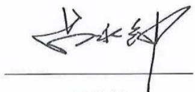

吕永钟

广东省广晟控股集团有限公司

2026 4 21

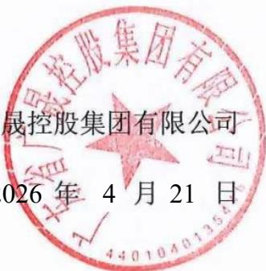

## 发行人全体董事及高级管理人员声明

本公司全体董事及高级管理人员承诺本募集说明书不存在虚假记载、误导性陈述或重大遗漏，对其真实性、准确性、完整性承担相应的法律责任，并承诺将持续履行相关职责，确保每期债券发行文件真实、准确、完整。

公司全体董事（签字）：

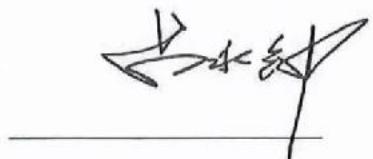

吕永钟

广东省广晟控股集团有限公司

2026 4 21

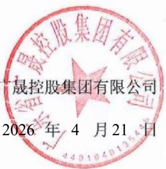

## 发行人全体董事及高级管理人员声明

本公司全体董事及高级管理人员承诺本募集说明书不存在虚假记载、误导性陈述或重大遗漏，对其真实性、准确性、完整性承担相应的法律责任，并承诺将持续履行相关职责，确保每期债券发行文件真实、准确、完整。

公司全体董事（签字）：

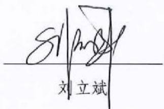

广东省广晟控股集团有限公司

2026 4 21

## 发行人全体董事及高级管理人员声明

本公司全体董事及高级管理人员承诺本募集说明书不存在虚假记载、误导性陈述或重大遗漏，对其真实性、准确性、完整性承担相应的法律责任，并承诺将持续履行相关职责，确保每期债券发行文件真实、准确、完整。

公司全体董事（签字）：

汪东兵 汪东兵

广东省广晟控股集团有限公司

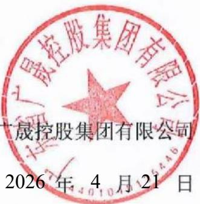

2026 年 4 月 21 日

## 发行人全体董事及高级管理人员声明

本公司全体董事及高级管理人员承诺本募集说明书不存在虚假记载、误导性陈述或重大遗漏，对其真实性、准确性、完整性承担相应的法律责任，并承诺将持续履行相关职责，确保每期债券发行文件真实、准确、完整。

公司全体董事（签字）：

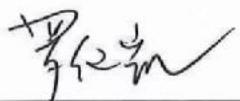

罗健凯

广东省广晟控股集团有限公司

2026 4 21

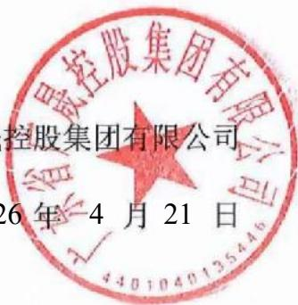

## 发行人全体董事及高级管理人员声明

本公司全体董事及高级管理人员承诺本募集说明书不存在虚假记载、误导性陈述或重大遗漏，对其真实性、准确性、完整性承担相应的法律责任，并承诺将持续履行相关职责，确保每期债券发行文件真实、准确、完整。

公司全体董事（签字）：

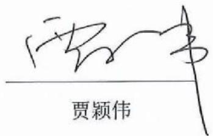

广东省广晟控股集团有限公司

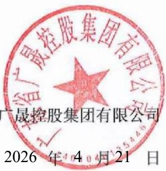

年 月 日2026 4 21

## 发行人全体董事及高级管理人员声明

本公司全体董事及高级管理人员承诺本募集说明书不存在虚假记载、误导性陈述或重大遗漏，对其真实性、准确性、完整性承担相应的法律责任，并承诺将持续履行相关职责，确保每期债券发行文件真实、准确、完整。

公司全体董事（签字）：

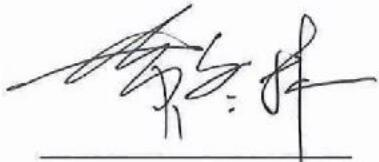

黄冬林

广东省广晟控股集团有限公司

2026 4 21

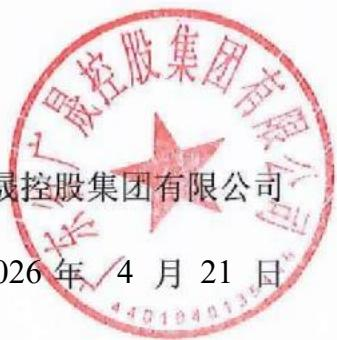

## 发行人全体董事及高级管理人员声明

本公司全体董事及高级管理人员承诺本募集说明书不存在虚假记载、误导性陈述或重大遗漏，对其真实性、准确性、完整性承担相应的法律责任，并承诺将持续履行相关职责，确保每期债券发行文件真实、准确、完整。

公司全体董事（签字）：

彭燎原

广东省广晟控股集团有限公司

2026 4 21

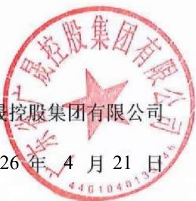

## 发行人全体董事及高级管理人员声明

本公司全体董事及高级管理人员承诺本募集说明书不存在虚假记载、误导性陈述或重大遗漏，对其真实性、准确性、完整性承担相应的法律责任，并承诺将持续履行相关职责，确保每期债券发行文件真实、准确、完整。

公司全体非董事高级管理人员（签字）：

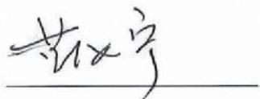

蓝汝宁

广东省广晟控股集团有限公司

2026 年 4 月21 日

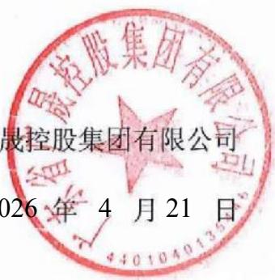

## 发行人全体董事及高级管理人员声明

本公司全体董事及高级管理人员承诺本募集说明书不存在虚假记载、误导性陈述或重大遗漏，对其真实性、准确性、完整性承担相应的法律责任，并承诺将持续履行相关职责，确保每期债券发行文件真实、准确、完整。

公司全体非董事高级管理人员（签字）：

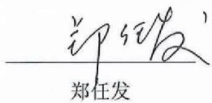

广东省广晟控股集团有限公司

2026 4 21

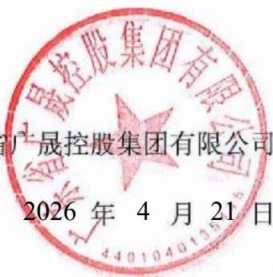

## 发行人全体董事及高级管理人员声明

本公司全体董事及高级管理人员承诺本募集说明书不存在虚假记载、误导性陈述或重大遗漏，对其真实性、准确性、完整性承担相应的法律责任，并承诺将持续履行相关职责，确保每期债券发行文件真实、准确、完整。

公司全体非董事高级管理人员（签字）：

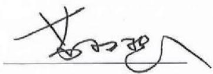

苏权捷

广东省广晟控股集团有限公司

2026 4 21

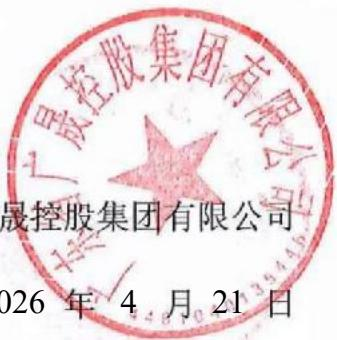

## 发行人全体董事及高级管理人员声明

本公司全体董事及高级管理人员承诺本募集说明书不存在虚假记载、误导性陈述或重大遗漏，对其真实性、准确性、完整性承担相应的法律责任，并承诺将持续履行相关职责，确保每期债券发行文件真实、准确、完整。

公司全体非董事高级管理人员（签字）：

吴圣辉

广东省广晟控股集团有限公司

2026 4 21

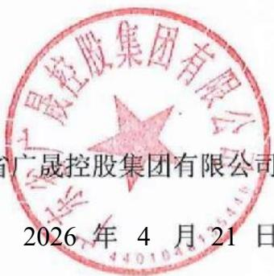

## 发行人全体董事及高级管理人员声明

本公司全体董事及高级管理人员承诺本募集说明书不存在虚假记载、误导性陈述或重大遗漏，对其真实性、准确性、完整性承担相应的法律责任，并承诺将持续履行相关职责，确保每期债券发行文件真实、准确、完整。

公司全体非董事高级管理人员（签字）：

1 万山

广东省广晟控股集团有限公司

年 月 日2026 4 21

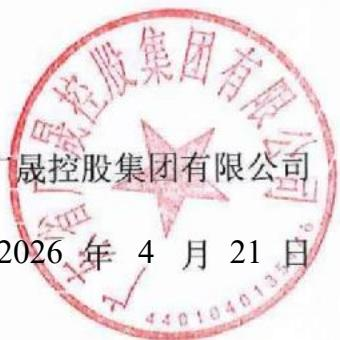

## 主承销商声明

本公司已对募集说明书进行了核查，确认不存在虚假记载、误导性陈述或重大遗漏，并对其真实性、准确性和完整性承担相应的法律责任。

项目负责人签名：

筒雁杰

苗雁杰

敖重淼

法定代表人或授权代表签名

孙

孙毅

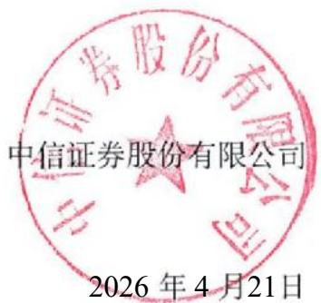

2年026 月4 21 日

## 法定代表人授权书

本人，张佑君，中信证券股份有限公司法定代表人，在此授权孙毅先生（身份证 ）作为被授权人，代表公司签署与投资银行管理委员会业务相关的合同协议及其相关法律文件。被授权人签署的法律文件对我公司具法律约束力。

未经授权人许可，被授权人不得转授权。

本授权的有效期限自2026年3月16日至2027年3月14日（或至本授权书提前解除之日）止。

授权人

中信证券股份有限公司法定代表人

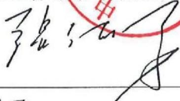

张佑君

2026年3月16日

被授权人

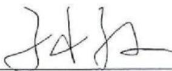

孙毅（身份证

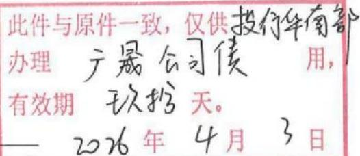

## 主承销商声明

本公司已对募集说明书进行了核查，确认不存在虚假记载、误导性陈述或重大遗漏，并对其真实性、准确性和完整性承担相应的法律责任。

目负责人签名：

基董尧奇孙晨曦

定代表人或授权代表签名：

刘津前刘康莉

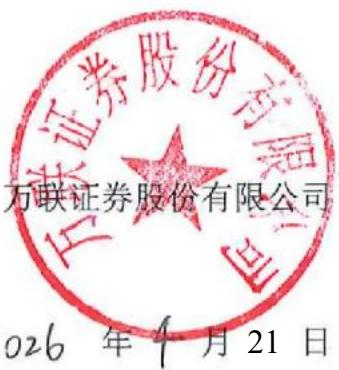

年 月 21 日

## 授权委托书

委托人：万联证券股份有限公司

法定代表人：王达

受托人：刘康莉

职务：党委书记、董事长

职务：副总裁

兹授权受托人代表本公司法定代表人，对投资银行业务条线债权融资类业务已依照本公司规定履行审批决策程序事项有关的合同、协议、文件，进行审批并对外签署，包括：

## 一、业务品种

公司债券（含企业债券）、金融债券、地方政府债券、债权融资计划、资产证券化产品、非金融企业债务融资工具的承销或财务顾问业务，其他债权融资类财务顾问业务。

## 二、文件类别

## (一) 业务协议类：

业务品种涉及的各类合同、协议。

## （二） 申报文件类：

公司债券（含企业债券）募集说明书承销商声明、受托管理人声明、主承销商核查意见等法规规定可以授权的文件等。

## （三)其他：

各项投标文件、法定代表人身份证复印件及各类其他对外报送文件。

受托人代表本公司法定代表人签署合同、协议、文件，须经本公司盖章确认方为有效。仅由受托人签署，未经本公司盖章确认的合同、协议、文件，不对本公司产生约束力。本授权书自2026年3月3日起生效至2026年12月31日（或本授权书提前终止之日）止。本授权事项不得转授权。

委托人：万联证券股份有限公司法定代表人（签字）：

受托人（签字、盖章）：华

## 主承销商声明

本公司已对募集说明书进行了核查、确认不存在虚假记载、误导性陈述或重大遗漏，并对其真实性、准确性和完整性承担相应的法律责任。

项目负责人签名：

得扬

王昊杨

刘瑞

刘瑞洁

法定代表人或授权代表签名

胡金泉

广发证券股份有限公司

2026 4 21

# 广发证券股份有限公司

广发证授权（2025）1号

## 2026年法定代表人签字授权书

根据工作需要，现将法定代表人的签字权授权如下：

## 一、授权原则

(一)被授权人根据公司经营管理层工作分工或部门负责人任命行使权力，当职务变更自动调整或终止本授权。  
（二）被授权人代表公司法定代表人签字并承担相应责任，其法律效力等同于法定代表人签字。  
（三）被授权人无转委权。  
（四）授权人职务变更自动终止本授权。

## 二、授权权限

（一）加盖公司印章的文件签字权，授权公司分管领导。  
（二）加盖部门印章的文件签字权，授权部门负责人。

## 三、授权期限

本授权书有效期为2026年1月1日至12月31日，有效期内授权人可签署新的授权书对本授权书作出补充或修订。

附件：1.公司营业执照  
2.被授权人职责证明(公司经营管理层最新分工或部门负责人聘任发文) 股

法定代表人

广发证券股份有限公司

2025年12月23日

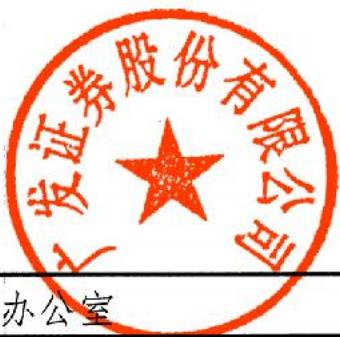

广发证券股份有限公司办公室

2025年12月23日印发

## 202月02月月01日

## 关

号号1号

花护花采

灵贯民热使众灵民垫

类

名

914039C 9140039

公标

#

一

# 广发证券股份有限公司

广发证董（2024）15号

# 关于聘任公司高级管理人员的决定

总部各部门、各分支机构各子公司

根据广发证券股份有限公司（以下简称“公司”）第十一届董事会第一次会议决议及工作安排，公司决定：

聘任秦力先生担任公司总经理，主持公司日常经营管理工作，并分管国际业务、产业研究院、战略发展部；

聘任孙晓燕女士担任公司常务副总经理兼财务总监，分管财务部、结算与交易管理部、资金管理部：

聘任肖雪生先生担任公司副总经理，分管战略客户关系管理

聘任欧阳西先生担任公司副总经理，分管资产托管部、证券金融部、财富管理与经纪业务总部（含下设的财富管理部、数字平台部、机构客户部、运营管理部)；

聘任张威先生担任公司副总经理，分管发展研究中心；

聘任易阳方先生担任公司副总经理，分管股权衍生品业务部、

证券投资业务管理总部下设的权益投资部；

聘任辛治运先生担任公司副总经理兼首席信息官，分管信息技术部；

聘任李谦先生担任公司副总经理，分管证券投资业务管理总部下设的固定收益投资部、资本中介部；

聘任徐佑军先生担任公司副总经理，分管办公室、人力资源管理部、培训中心；

聘任胡金泉先生担任公司副总经理，分管投行业务管理委员会（含下设的投行综合管理部、战略投行部、兼并收购部、债券业务部、资本市场部、投行质量控制部)：

聘任吴顺虎先生担任公司合规总监，兼任合规与法律事务部总经理，并分管合规与法律事务部、稽核部；

聘任崔舟航先生担任公司首席风险官，兼任风险管理部总经理，并分管风险管理部、投行内核部；

聘任尹中兴先生担任公司董事会秘书、联席公司秘书、证券事务代表，分管董事会办公室。

肖雪生先生和胡金泉先生正式履行上述职务尚需通过证券公司高级管理人员资质测试。尹中兴先生正式履行上述职务尚需通过证券公司高级管理人员资质测试及香港联合交易所有限公司关于公司秘书任职资格的豁免。在胡金泉先生正式履行上述职务之前，指定公司总经理秦力先生代为履行相应职责。在尹中兴先生正式履行上述职务之前，指定公司原董事会秘书、联席公司秘书、证券事务代表徐佑军先生继续履行相应职责。

公司将按规定向监管部门履行备案程序。

专此决定。

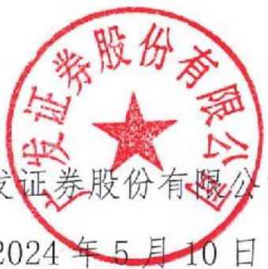

广发证券股份有限公司

2024年5月10日

（联系人：杨天天电话：020-66336680)

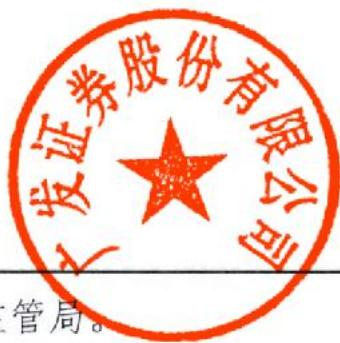

抄送：中国证监会广东监管局。

广发证券股份有限公司董事会办公室

2024年5月10日印发

## 主承销商声明

本公司已对募集说明书进行了核查，确认不存在虚假记载、误导性陈述或重大遗漏，并对其真实性、准确性和完整性承担相应的法律责任。

项目负责人签名：

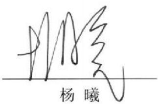

法定代表人或授权代表签名：

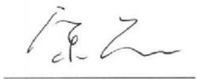

宋黎

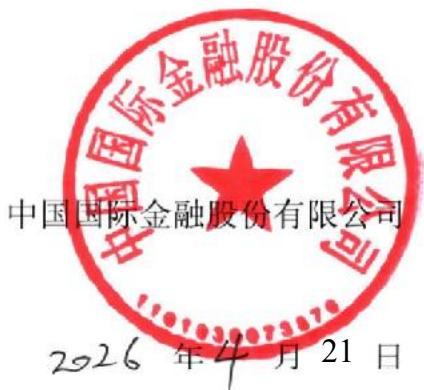

## 中国国际金融股份有限公司

## 授权书

兹授权中国国际金融股份有限公司党委委员、管理委员会成员王曙光签署如下合同、协议和文件：

1、授权王曙光签署与投资银行业务、资本市场业务相关的合同协议和文件，王曙光可根据投资银行业务及资本市场业务经营管理需要对本项授权进行转授权，与上市公司并购重组财务顾问业务相关的申报文件除外。 国国际金融舰  
2、授权王曙光签署与上市公司并购重组财务顾问业务相关的申报文件，包括重组报告书、财务顾问报告等申报文件，反馈意见回复报告、重组委意见回复等文件的财务顾问专业意见，举报信核查报告等。上述申报文件在签署并申报前应完成中国国际金融股份有限公司制定的质量控制、内核等相关内部控制流程。本项授权不得转授权。  
本授权自签署之日起生效，自上述授权撤销之日起失效。

中国国际金融股份有限公司

陈亮

党委书记、董事长、管委会主席

二零二四年四月十日

# 中国国际金融股份有限公司

## 授权书

兹授权中国国际金融股份有限公司投资银行部负责人孙雷签署与投资银行业务相关的协议和文件，与上市公司并购重组财务顾问业务相关的申报文件除外。孙雷可根据投资银行业务经营管理需要对本项授权进行转授权。

本授权自签署之日起生效，自上述授权撤销之日起失效。

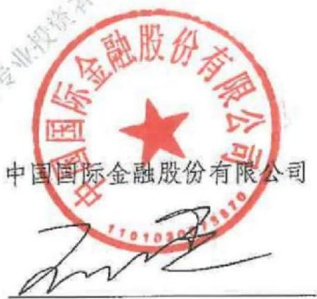

王曙光

二零二五年一月六日

# 中国国际金融股份有限公司

## 授权书

兹授权中国国际金融股份有限公司投资银行部执行负责人许佳投资银行部执行负责人宋黎签署与投资银行业务相关的协议和文件，

本授权自签署之日起生效，自上述授权撤销之日起失效。

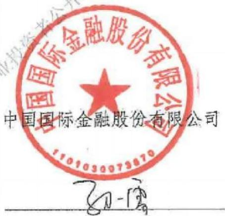

孙 雷

二零二五年一月六日

## 主承销商声明

主承销商已对募集说明书进行了核查，确认不存在虚假记载、误导性陈述和重大遗漏，并对其真实性、准确性和完整性承担相应的法律责任。

项目负责人（签字)：

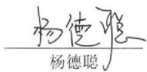

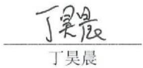

公司法定代表人或授权代表（签字）：

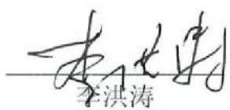

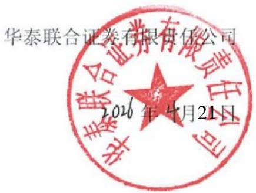

# 华泰联合证券有限责任公司

授权委托书

<table><tr><td>授权人</td><td>江禹</td><td>授权人职务</td><td>董事长、法定代表人</td></tr><tr><td>被授权人</td><td>李洪涛</td><td>被授权人职务</td><td>合规总监兼首席风险官</td></tr><tr><td>授权期限</td><td colspan="3">2026年1月1日至2026年12月31日</td></tr><tr><td colspan="4">具体授权事项</td></tr><tr><td colspan="4">授权李洪涛先生在债务融资类业务(包括但不限于企业债、公司债、资产证券化以及按上述类型管控的其他业务等)及公开募集基础设施证券投资基金(REITs)业务涉及的全部文件依照公司规定完成内部审批决策流程后,代表江禹先生对外签署,包括但不限于各类项目相关协议、申报材料、申请文件、说明文件、承诺函、通知书、公告文件、投标文件等。</td></tr><tr><td colspan="4">特别说明:1、除投标文件外,被授权人需亲自完成授权事项,无转授权的权利。投标文件可进行转授权。2、本授权为非排他性授权,授权作出后,授权人仍有权自行或授权其他人签署相关文件。3、被授权人基于相关职务接收授权人授权,如因被授权人临时不在岗或岗位发生变动,则相关授权事项归复原授权人执行。</td></tr><tr><td colspan="2">授权人(签字)</td><td colspan="2">被授权人(签字)[SIGNATURE]</td></tr></table>

授权日期：2025年12月31日（加盖公章）

## 主承销商声明

本公司已对募集说明书进行了核查，确认不存在虚假记载、误导性陈述或重大遗漏，并对其真实性、准确性和完整性承担相应的法律责任

项目负责人签名：

刘嘉璐

法定代表人或授权代表签名：

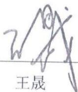

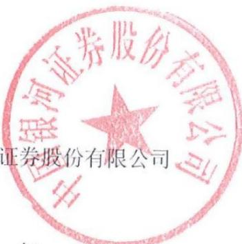

2026 4 21

## 主承销商声明

公司已对募集说明书进行了核查，确认不存在虚假记载、误导性陈述或大遗漏，并对其真实性、准确性和完整性承担相应的法律责任。

项目负责人签名：

孟李娇

孟李娜

施蓉蓉

施蓉蓉

付数宇

付翥宇

定代表人或授权代表签名：

周冰

周冰

银国际证券股份有限公司

2026年 4月 21日

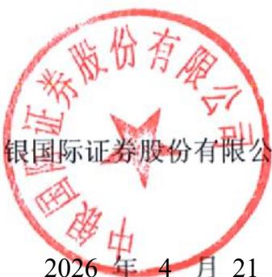

## 授权委托书

周冰先生现任中银国际证券股份有限公司（以下简称“公司”）执行总裁，特授权周冰先生代表法定代表人对外签署证券承销与保荐业务相关的业务合同及各类文

一、与首次公开发行股票、上市公司再融资、上市公司并购重组财务顾问等股权类保荐与承销业务相关的合同及其他文件。

二、与公司债、企业债、金融债、熊猫债、可续期债、非金融企业债务融资工具等债券类发行与承销业务，以及公司债受托管理业务相关的合同及其他文件

三、与全国中小企业股份转让系统主办券商推荐挂牌、持续督导、定向增发、重大资产重组等新三板类业务相关的合同及其他文件。

四、上述三类业务相关的报送监管机构各类项目申报文件、申请补贴文件、投标文件等。

五、投资银行业务日常经营管理及业务开展所需签订的其他合同及法律文件。

六、以上授权如有法律法规及监管规定要求必须由法定代表人办理的，或者其他授权文件明确授权他人办理的除外

本授权有效期为本授权委托书签发之日起至2026年12月31日止。

公开发行位仅供公司（本（控股发用有限公司投资者

授权人：中银国际证券股份有限公司董事长周权（签名）：

被授权人：中银国际证券股份有限公司执行总裁周冰（签名）:

周闲

2026年1月1日

## 主承销商声明

本公司已对募集说明书进行了核查，确认不存在虚假记载、误导性陈述或重大遗漏，并对其真实性、准确性和完整性承担相应的法律责任。

项目负责人签名：

李谦李谦

法定代表人或授权代表签名：

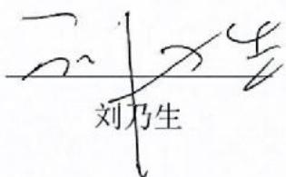

中信建投证券股份有限公司

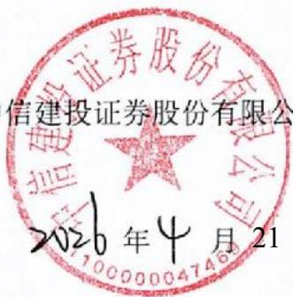

2026年4月21日

# 中信建投证券股份有限公司特别授权书

仅供广东省广晟控股集团有限公司公开发行公司债券项目使用

为公司投资银行业务开展需要中信建投证券股份有限公司董事长刘成先生对刘乃生先生特别授权如下：

## 一、代表公司法定代表人签署以下文件：

（一）签署投资银行业务承做债券相关业务的文件，限于向监管部门报送的募集说明书、主承销商受托管理人声明、主承销商专项核查报告、承销商核查意见、房地产调控政策之专项核查报告、企业债主承销商综合信用承诺书、债权代理人声明。  
(二）签署投资银行业务承做三板重组相关业务的文件，限于向监管部门报送的三板重组（预案）之重组报告书（真实性、准确性、完整性的声明）、三板重组（预案）之独立财务顾问核查意见/报告、定向发行合法合规性的专项意见。  
（三）签署投资银行业务承做并购重组相关业务的文件，限于向监管部门报送以下文件：

1、重组报告书、独立财务顾问报告、反馈意见回复报告、重组委意见回复等文件的财务顾问专业意见；  
2、申报文件真实性、准确性和完整性的承诺书、独立财务顾问同意书、独立财务顾问声明、举报信核查报告。  
（四）签署投资银行业务承做保荐承销相关业务的文件，限于向监管部门报送的会后事项承诺函、不存在影响启动发行重大事项的承诺函、非公开发行股票申请增加询价对象的承诺函、关于办理完成限售登记及符合相关规定的承诺、发行阶段的保荐代表人证明文件及专

项授权书、关于上市相关媒体质疑的专项回复的声明、认购对象合规性报告、发行情况报告书。

(五)签署由公司担任主承销商的投资银行类项目的发行及登记上市业务中向中国证监会、上海证券交易所、深圳证券交易所、北京证券交易所、中国证券登记结算有限责任公司、中央国债登记结算有限责任公司、全国中小企业股份转让系统有限转让公司等单位提交的文件，限于发行登记摇号公证上市阶段的授权委托书、IPO股票首次发行/可转债/配股/其他发行股票类网上认购资金划款申请表、配股发行失败应退利息支付承诺函、公司债券/资产支持专项计划/其他债权类发行登记及上市相关事宜的承诺函、股份过户登记申请。

二、在以下事务中拥有公司法定代表人人名章与身份证明文件的使用审批权：

(一)对外出具需要公司法定代表人签署的投资银行类项目的竞标文件、投标文件及建议书。

(二)在办理由公司担任主承销商的投资银行类项目的发行及登记上市业务中向中国证监会、上海证券交易所、深圳证券交易所、北京证券交易所、中国证券登记结算有限责任公司、中央国债登记结算有限责任公司、全国中小企业股份转让系统有限转让公司等单位提交公司法定代表人身份证件复印件、加盖法定代表人人名章的《指定联络人授权委托书》《集中办理深交所数字证书的承诺书》《信息披露联络人授权委托书》《可交换债券信托担保专用账户开立及信托担保登记办理授权书》《可交换债券质押担保专用账户开立及质押担保登记办理授权书》《验资业务银行询证函》《网下收款项目询证函》、公司债券转售业务的《非交易过户的申请》、可交换债券业务解除担保及信托事宜的《法定代表人授权委托书》。

（三）在办理由公司担任可转债抵押/质押权人代理人办理资产抵押/质押时提交的公司法定代表人身份证件复印件、加盖法定代表人人名章的《法定代表人证明书/委托书》《不动产登记申请表》等文

未经授权人许可，被授权人不得将上述授权内容再行转授权。

本授权有效期限自2026年1月1日起至2026年12月31日。

授权人：

中信建投证券股份有限公司董事长

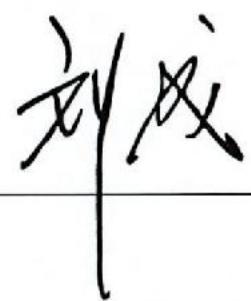

二零二六年一月一日建投证券股份有限公司倚缝专用章

## 主承销商声明

本公司已对募集说明书进行了核查，确认不存在虚假记载、误导性陈述或重大遗漏，并对其真实性、准确性和完整性承担相应的法律责任。

项目负责人签名：

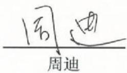

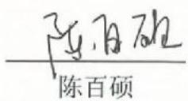

定代表人或授权代表签名：郁伟君

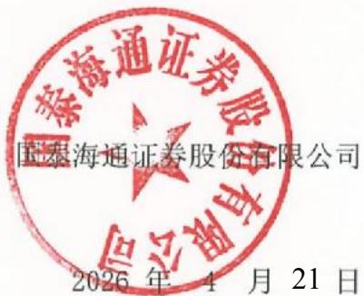

# 国泰海通证券股份有限公司文件

## 授权委托书

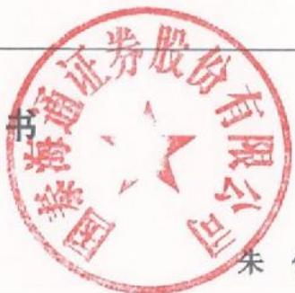

朱健

郁伟君

## 一、股权业务（保荐、并购重组和财务顾问业务）相关协议及文件

## 二、债券业务相关协议及文件

## 三、新三板业务相关协议及文件

四、上述业务条线/部门向监管部门、自律组织等机构（包括但不限于中国证券监督管理委员会及其派出机构、中国人民银行、国有资产监督管理委员会中国银行间市场交易商协会、中国外汇交易中心、上海清算所、上海证券交易所、深圳证券交易所、北京证券交易所、中国证券登记结算有限公司及其分公司、中国证券业协会、中国证券投资基金业协会、中国证券投资者保护基金有限责任公司、全国中小企业股份转让系统等）报送的文件（除监管部门明确规定需由法定代表人签字的文件)。

授权人：国泰海通证券股份限公司（章）

受权人：国泰海通证券股份限公司（章）

## 发行人律师声明

本所及签字的律师已阅读募集说明书，确认募集说明书与本所出具的法意见书不存在矛盾。本所及签字律师对发行人在募集说明书中所引用的法律见书的内容无异议，确认募集说明书不致因所引用内容出现虚假记载、误导陈述或重大遗漏，并对其真实性、准确性和完整性承担相应的法律责任。

经办律师（签名）：

叶嘉腾

律师事务所负责人（签名）：\_\_\_\_\_

2026 4 21

## 审计机构声明

本所及签字注册会计师已阅读广东省广晟控股集团有限公司2026年面向专报告不存在矛盾。本所及签字注册会计师对发行人在募集说明书中引用的财务用的广东省广晟控股集团有限公司2022年度、2023年度财务数据与本所出具的性陈述或重大遗漏，并对其真实性、准确性和完整性承担相应的法律责任。本所及签字注册会计师对发行人在募集说明书中引用的2022年度、2023年度财务报告的内容无异议，确认募集说明书不致因所引用内容而出现虚假记载、误导性陈述或重大遗漏，并对其真实性、准确性和完整性承担和应的法律责任。

经办注册会计师签名：

颜艳飞

张小勤

会计师事务所负责人（或授权代表）签名：

邱靖之

大职国际师事务所（特到普通合伙）

2026年4月15日

## 审计机构声明

本所及签字注册会计师已阅读募集说明书，确认募集说明书与本所出具的报告不存在矛盾。本所及签字注册会计师对发行人在募集说明书中引用的财务报告的内容无异议，确认募集说明书不致因所引用内容而出现虚假记载、误导性陈述或重大遗漏，并对其真实性、准确性和完整性承担相应的法

经办注册会计师签名： \_\_\_\_\_\_\_\_\_\_\_\_\_\_梁寄意

会计师事务所负责人（或授权代表）签名： \_\_\_\_\_\_\_\_\_\_\_\_\_\_\_\_\_\_\_\_\_\_

李惠琦

致同会计师事务所(特殊普通合伙)

6026年0042月15日

## 发行人审计机构关于承担审计业务签字注册会计师离职声明

致同会计师事务所（特殊普通合伙）（以下简称“本机构”）出具的“致同审字(2025）第440A021946号”审计报告的签字会计师为梁寄意、董永峰，董永峰已从本机构离职。

本机构对发行人在募集说明书中引用的审计报告的内容无异议，并对其真实性、准确性和完整性承担相应的法律责任。

实性、准

会计师事务所负责人（签名）：

李惠琦

致同会计师事务所（特殊普通盒）

2026年4月15日

## 第十三节 备查文件

## 一、备查文件清单

（一）发行人 2022-2024年度经审计的合并及母公司财务报告，2025年1-6月未经审计的合并及母公司财务报表；

（二）主承销商出具的核查意见；

（三）发行人律师出具的法律意见书；

（四）资信评级报告；

（五）《债券持有人会议规则》；

（六）《债券受托管理协议》；

（七）中国证监会同意发行人本次发行注册的文件；

（八）相关法律法规、规范性文件要求披露的其他文件。

## 二、备查文件查阅地点及查询网址

在本期债券发行期内，投资者可以至本公司及主承销商处查阅本募集说明书全文及上述备查文件，或访问深圳证券交易所网站（http://www.szse.cn）查阅本募集说明书。

投资者可以自本期债券募集说明书公告之日起到下列地点查阅本募集说明书全文及上述备查文件：

## （一）发行人：广东省广晟控股集团有限公司

住所：广东省广州市天河区珠江西路17号广晟国际大厦50-58楼

法定代表人：吕永钟

电话：020-29117551

传真：020-29110900

信息披露经办人员：姜可意、陈俊霖

## （二）牵头主承销商、受托管理人、簿记管理人：中信证券股份有限公司

住所：广东省深圳市福田区中心三路8号卓越时代广场（二期）北座

法定代表人：张佑君

联系电话：020-32258106

有关经办人员：董青、苗雁杰、敖重淼、何禧